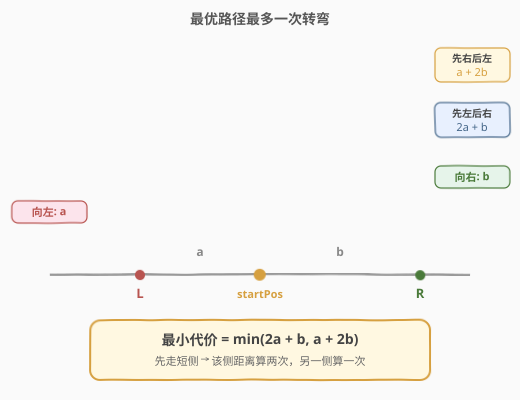
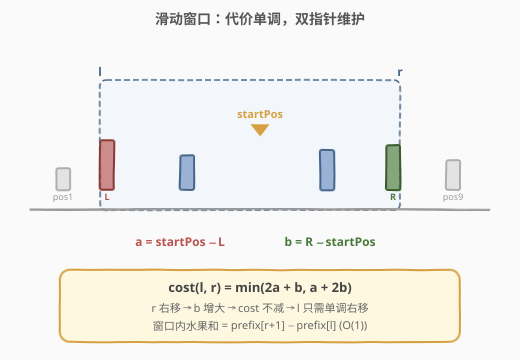
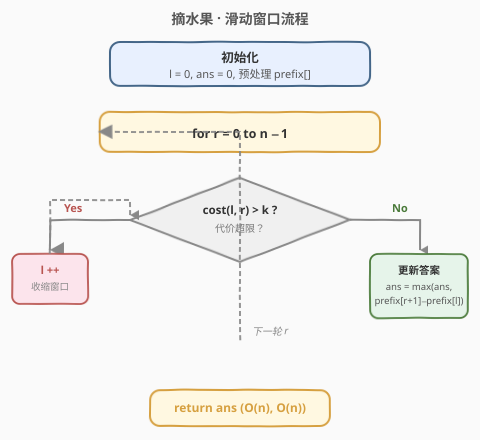
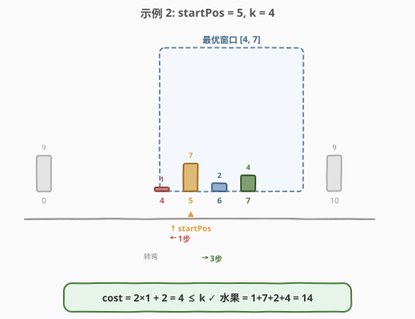

# 摘水果

- **题目名称**：摘水果
- **链接**：[2106. 摘水果](https://leetcode.cn/problems/maximum-fruits-harvested-after-at-most-k-steps/)
- **难度**：困难
- **标签**：数组、滑动窗口、双指针、前缀和

## 1. 题目概述

在无限的 x 坐标轴上，水果分布在某些位置。给定已按位置升序排列的 `fruits`，其中 `fruits[i] = [position_i, amount_i]` 表示 `position_i` 处有 `amount_i` 个水果。从 `startPos` 出发，每步向左或向右移动一个单位，总共最多走 `k` 步。每到一个位置摘掉该位置全部水果。返回能摘到的最大水果总数。

**示例 1**：

```text
输入：fruits = [[2,8],[6,3],[8,6]], startPos = 5, k = 4
输出：9
解释：向右走到位置 6（摘 3 个），再向右走到位置 8（摘 6 个），共 3 步，摘 9 个。
```

**示例 2**：

```text
输入：fruits = [[0,9],[4,1],[5,7],[6,2],[7,4],[10,9]], startPos = 5, k = 4
输出：14
解释：在位置 5 摘 7 个，向左到 4 摘 1 个，向右到 6 摘 2 个，向右到 7 摘 4 个。移动 1+3=4 步，共 14 个。
```

**示例 3**：

```text
输入：fruits = [[0,3],[6,4],[8,5]], startPos = 3, k = 2
输出：0
解释：最多走 2 步，无法到达任何有水果的位置。
```

**约束条件**：

- $1 \leq \text{fruits.length} \leq 10^5$
- $0 \leq \text{startPos}, \text{position}_i \leq 2 \times 10^5$
- `fruits` 按 $\text{position}_i$ 升序排列，位置互不相同
- $1 \leq \text{amount}_i \leq 10^4$
- $0 \leq k \leq 2 \times 10^5$

---

## 2. 解题思路

### 2.1 暴力思路

最朴素的想法：枚举所有可能的路径。但每步可以左或右，共 $2^k$ 种路径，完全不可行。

稍微优化：由于水果只在离散位置上，我们只关心**覆盖了哪些水果位置**。枚举所有水果的连续子区间 `[fruits[i], fruits[j]]`，计算从 `startPos` 出发覆盖该区间的最小步数，若 $\leq k$ 则用前缀和求区间水果总数。这需要 $O(n^2)$ 枚举区间 + $O(1)$ 查询，总计 $O(n^2)$，对于 $n = 10^5$ 仍然太慢。

### 2.2 核心观察：最优路径最多一次转弯

**关键引理**：最优路径最多改变一次方向（至多一次"转弯"）。

> **证明**：假设路径先向左、再向右、再向左。中间"向右再向左"的部分是在来回走同一段路——这段路上的水果在第一次经过时就已经摘完，折返完全是浪费步数。把这段折返去掉，用省下的步数向某个方向多走，结果不会更差。因此最优路径的形状只有四种。

设覆盖区间为 `[L, R]`，记 $a = \text{startPos} - L$（左距离），$b = R - \text{startPos}$（右距离）：



| 路径形状 | 代价 | 适用条件 |
|---------|------|---------|
| 向左走到底 | $a$ | $a \leq k$ |
| 向右走到底 | $b$ | $b \leq k$ |
| 先左后右 | $2a + b$ | $2a + b \leq k$ |
| 先右后左 | $a + 2b$ | $a + 2b \leq k$ |

覆盖区间 `[L, R]` 的最小代价为 $\min(2a + b,\; a + 2b)$（当 `startPos` 在 `[L, R]` 内时；在外时退化为单方向距离）。

> 💡 **直觉**：先走的方向要"走过去再走回来"，所以那侧的距离被计算两次；后走的方向只走一次。因此先走较短的一侧更划算——这正是 $\min(2a+b, a+2b)$ 的含义：若 $a < b$ 则先左（$2a+b < a+2b$），若 $b < a$ 则先右。

### 2.3 滑动窗口法

有了代价公式，问题转化为：**在已排序的水果位置数组上，找一个连续区间 `[l, r]`，使 $\text{cost}(l, r) \leq k$，最大化区间内水果总量**。

这正是滑动窗口的适用场景：

- **单调性**：右端 `r` 右移（区间变大），代价不减；左端 `l` 右移（区间变小），代价不增。
- **维护**：枚举右端 `r`，不断右移 `l` 直到窗口代价 $\leq k$，用前缀和 $O(1)$ 查询区间和。
- **复杂度**：`l` 和 `r` 各至多移动 $n$ 次，总计 $O(n)$。



**代价函数**（$O(1)$ 计算）：

- `startPos` 在窗口内（$a > 0, b > 0$）：$\text{cost} = \min(2a + b,\; a + 2b)$
- `startPos` 在窗口左外（$a \leq 0$）：只需向右走 $b$
- `startPos` 在窗口右外（$b \leq 0$）：只需向左走 $a$

> ⚠️ **单调性证明**：固定 `l`，`r` 右移时 $b$ 增大，$\min(2a+b, a+2b)$ 两项都不减；固定 `r`，`l` 右移时 $a$ 减小，两项都不增。因此 `l` 只需单调右移，无需回退——滑动窗口成立。

### 2.4 算法流程图



### 2.5 示例演算

以示例 2 为例：`fruits = [[0,9],[4,1],[5,7],[6,2],[7,4],[10,9]]`，`startPos = 5`，`k = 4`。



| 步骤 | r | 窗口 [l,r] | 位置范围 | a | b | cost | $\leq k$? | 区间和 | ans |
|------|---|-----------|---------|---|---|------|-----------|--------|-----|
| 1 | 0 | — | [0,0] | 5 | −5 | 5 | ✗ | 收缩至空 | 0 |
| 2 | 1 | [1,1] | [4,4] | 1 | −1 | 1 | ✓ | 1 | 1 |
| 3 | 2 | [1,2] | [4,5] | 1 | 0 | 1 | ✓ | 8 | 8 |
| 4 | 3 | [1,3] | [4,6] | 1 | 1 | 3 | ✓ | 10 | 10 |
| 5 | 4 | [1,4] | [4,7] | 1 | 2 | 4 | ✓ | 14 | **14** |
| 6 | 5 | 收缩 | [5,10] | 0 | 5 | 5 | ✗ | 收缩至空 | 14 |

第 5 步达到最优：窗口 `[1,4]` 覆盖位置 `[4,7]`，$a=1, b=2$，$\text{cost} = \min(4, 5) = 4 \leq k$，水果总数 $1+7+2+4=14$。路径：先左到 4（1 步），再右到 7（3 步），共 4 步。

---

## 3. 参考代码

### C++

```cpp
class Solution {
public:
    int maxTotalFruits(vector<vector<int>>& fruits, int startPos, int k) {
        int n = fruits.size();
        vector<long long> prefix(n + 1, 0);
        for (int i = 0; i < n; i++) {
            prefix[i + 1] = prefix[i] + fruits[i][1];
        }

        auto cost = [&](int l, int r) -> long long {
            long long a = (long long)startPos - fruits[l][0];
            long long b = (long long)fruits[r][0] - startPos;
            if (a <= 0) return b;
            if (b <= 0) return a;
            return min(2 * a + b, a + 2 * b);
        };

        long long ans = 0;
        int l = 0;
        for (int r = 0; r < n; r++) {
            while (l <= r && cost(l, r) > k) {
                l++;
            }
            if (l <= r) {
                ans = max(ans, prefix[r + 1] - prefix[l]);
            }
        }
        return (int)ans;
    }
};
```

### Python

```python
class Solution:
    def maxTotalFruits(self, fruits: List[List[int]], startPos: int, k: int) -> int:
        n = len(fruits)
        prefix = [0] * (n + 1)
        for i in range(n):
            prefix[i + 1] = prefix[i] + fruits[i][1]

        def cost(l: int, r: int) -> int:
            a = startPos - fruits[l][0]
            b = fruits[r][0] - startPos
            if a <= 0:
                return b
            if b <= 0:
                return a
            return min(2 * a + b, a + 2 * b)

        ans = 0
        l = 0
        for r in range(n):
            while l <= r and cost(l, r) > k:
                l += 1
            if l <= r:
                ans = max(ans, prefix[r + 1] - prefix[l])
        return ans
```

> 💡 **代价函数的边界处理**：当 `startPos` 在窗口外时（`a ≤ 0` 或 `b ≤ 0`），无需转弯，代价就是单方向距离。`a = 0`（`startPos` 恰在左端点）时 `a ≤ 0` 分支返回 `b`（向右走），与 $\min(2 \cdot 0 + b,\; 0 + 2b) = b$ 一致，因此用 `≤` 而非 `<` 不会出错。

---

## 4. 复杂度分析

| 维度 | 复杂度 | 说明 |
|------|--------|------|
| 时间复杂度 | $O(n)$ | `l` 和 `r` 各至多遍历数组一次（滑动窗口双指针） |
| 空间复杂度 | $O(n)$ | 前缀和数组 |

> ⚠️ 代价函数 $O(1)$ 计算，不引入额外因子。若不用前缀和而每次求和，会退化到 $O(n^2)$。

---

## 5. 扩展：二分枚举解法

滑动窗口利用了代价的单调性。另一种思路是**枚举 + 二分**：

1. 预处理前缀和。
2. **先左后右**：枚举左端点 `L`（每个 $\leq \text{startPos}$ 的水果位置），算 $a = \text{startPos} - L$，若 $2a \leq k$ 则右端最远到 $R = \text{startPos} + (k - 2a)$，二分找 $\leq R$ 的最右水果，前缀和求和。
3. **先右后左**：对称地枚举右端点 `R`。
4. **单方向**：$a=0$（向右）和 $b=0$（向左）作为特例包含在上述枚举中。

复杂度 $O(n \log n)$，不如滑动窗口的 $O(n)$，但思路更直观——每种路径形状独立枚举，不依赖单调性证明。

---

## 6. 面试要点

1. **为什么最优路径最多一次转弯？**
   - 多次转弯意味着在同一段路上来回走，那段路上的水果首次经过时已摘完，折返纯浪费步数。去掉折返不会丢水果，还能省步数走更远。

2. **滑动窗口的单调性如何保证？**
   - 右端 `r` 右移 → $b$ 增大 → $\min(2a+b, a+2b)$ 不减。左端 `l` 右移 → $a$ 减小 → 代价不增。因此 `l` 只需单调右移，无需回退。

3. **代价函数的三个分支怎么来的？**
   - `startPos` 在窗口内：$\min(2a+b, a+2b)$，先走短侧更优。
   - `startPos` 在窗口左外（$a \leq 0$）：只需向右走 $b$。
   - `startPos` 在窗口右外（$b \leq 0$）：只需向左走 $a$。

4. **为什么不枚举步数而枚举水果区间？**
   - 步数空间 $O(k)$ 太大且不连续；水果区间天然有序（位置已排序），滑动窗口直接在水果数组上操作。

5. **和 [1423. 可获得的最大点数](https://leetcode.cn/problems/maximum-points-you-can-obtain-from-cards/) 的区别？**
   - 1423 从数组两端取恰好 $k$ 张，等价于留一个长度 $n-k$ 的连续子数组——纯滑动窗口。本题有"转弯代价"非对称加权（先走方向算两次），代价函数更复杂，但滑动窗口框架不变。

---

## 7. 同类练习题

- [1423. 可获得的最大点数](https://leetcode.cn/problems/maximum-points-you-can-obtain-from-cards/)：从数组两端取 k 张最大化点数，等价于留 n-k 长连续子数组最小化，同属滑动窗口 + 前缀和
- [209. 长度最小的子数组](https://leetcode.cn/problems/minimum-size-subarray-sum/)（[题解](../0201-0300/209_长度最小的子数组.md)）：滑动窗口招牌题，正数单调性保证窗口合法性
- [713. 乘积小于 K 的子数组](https://leetcode.cn/problems/subarray-product-less-than-k/)（[题解](../0601-0700/713_乘积小于K的子数组.md)）：滑动窗口 + 计数，乘积单调性驱动收缩
- [1855. 下标对中的最大距离](https://leetcode.cn/problems/maximum-distance-between-a-pair-of-values/)：双指针在两个有序数组上找满足约束的最大距离，同属单调性驱动的双指针
- [3258. 统计满足 K 约束的子字符串数量 I](https://leetcode.cn/problems/count-substrings-that-satisfy-the-k-constraint-i/)：滑动窗口 + 计数，窗口内字符频率约束
