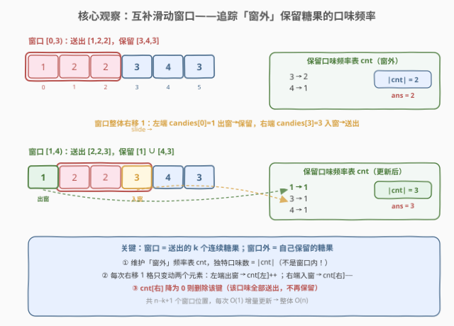
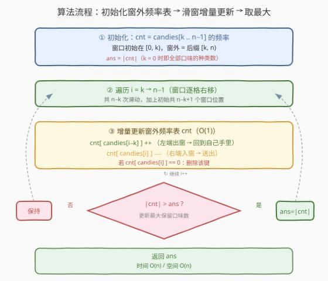

# LeetCode 分享 K 个糖果后独特口味的数量 题解

## 1. 题目概述

- **标题 / 题号**：分享 K 个糖果后独特口味的数量（#2107，medium）
- **链接**：https://leetcode.cn/problems/number-of-unique-flavors-after-sharing-k-candies
- **难度**：中等
- **标签**：数组、哈希表、滑动窗口

**题意**：给定一个 **下标从 0 开始** 的整数数组 `candies`，其中 `candies[i]` 表示第 `i` 个糖果的口味。妈妈让你和妹妹分享这些糖果——给她 `k` 个**连续**的糖果，而你想保留尽可能多的糖果口味。返回与妹妹分享后，自己**最多**能保留的**独特**口味数量。

**示例 1**：

```text
输入：candies = [1,[2,2,3],4,3], k = 3
输出：3
解释：把下标 [1,3] 范围内的连续糖果 [2,2,3] 分给妹妹。
      自己保留 [1] 和 [4,3]，口味集合 = {1, 4, 3}，共 3 种独特口味。
```

**示例 2**：

```text
输入：candies = [2,2,2,[2,3],3], k = 2
输出：2
解释：把下标 [3,4] 范围的 [2,3] 分给妹妹，自己保留 [2,2,2,3]，口味 {2,3} 共 2 种。
      也可以分享 [2,2]，保留 [2,2,3,3]，口味仍为 {2,3}。
```

**示例 3**：

```text
输入：candies = [2,4,5], k = 0
输出：3
解释：不必分享任何糖果，保留全部，口味 {2,4,5} 共 3 种。
```

**约束**：

- $0 \leq \text{candies.length} \leq 10^5$
- $1 \leq \text{candies}[i] \leq 10^5$
- $0 \leq k \leq \text{candies.length}$

> 💡 本题是 🔒 会员专享题。核心是「定长滑动窗口 + 哈希表」——但有个**视角翻转**：窗口内是送出去的糖果，我们要追踪的却是**窗口外**（自己保留的）口味的种类数。这与常见的「统计窗口内不同元素个数」恰好对偶。

## 2. 解题思路

### 2.1 暴力思路：枚举每个窗口

最直观的做法：枚举所有长度为 `k` 的连续窗口（共 $n - k + 1$ 个），对每个窗口计算**窗口外**元素的独特口味数——即前缀 `[0, i)` 与后缀 `[i+k, n)` 并集的不同元素个数。

每个窗口若用哈希集合统计需 $O(n)$，总计 $O(n^2)$。$n = 10^5$ 时约 $10^{10}$ 次操作，不可行。

> ⚠️ 暴力法的瓶颈：每次窗口移动后，**几乎整个窗口外的集合都不变**，只比上一个窗口差两个元素（左端一个出窗变保留、右端一个入窗变送出），却要重新统计整个集合——大量重复计算。突破口是「增量维护」。

### 2.2 核心观察：互补滑动窗口

**关键翻转**：常规滑动窗口统计的是**窗口内**的元素；本题要的是**窗口外**（保留下来）的独特口味数。因此维护一张「**窗外频率表**」`cnt`：记录每个口味在「保留糖果」中出现的次数。

- **窗口** = 连续 `k` 个送出的糖果；
- **窗口外** = 自己保留的糖果（前缀 + 后缀）；
- **答案** = $\max(\text{cnt 的大小})$，即保留糖果中不同口味的个数。



**为何增量更新只需 $O(1)$？** 窗口每次整体右移 1 格，只变动**两个**元素：

| 变动 | 操作 | 含义 |
|------|------|------|
| 左端 `candies[i-k]` 出窗 | `cnt[candies[i-k]] += 1` | 这颗糖从「送出」变为「保留」，回到自己手里 |
| 右端 `candies[i]` 入窗 | `cnt[candies[i]] -= 1` | 这颗糖从「保留」变为「送出」 |

若某口味频率降为 0，说明该口味的糖果**全部送出**、不再保留，需从 `cnt` 中删除该键——此时 `cnt.size()` 就是当前保留的独特口味数。

> 💡 **直觉**：保留集合 = 全集 减去 窗口。窗口滑动时，「左边吐出一颗回到保留集」「右边吞掉一颗离开保留集」，保留集只增减各一个元素，频率表随之 $O(1)$ 调整。这与 [3. 无重复字符的最长子串](../0001-0100/3_无重复字符的最长子串.md)「统计窗口内频率」是对偶关系——一个朝内看、一个朝外看。

### 2.3 算法流程图



### 2.4 示例演算

以示例 1 `candies = [1,2,2,3,4,3]`，`k = 3` 为例，共 $6 - 3 + 1 = 4$ 个窗口位置：

![示例演算：candies = [1,2,2,3,4,3]，k = 3](../images/candy_share_example_walkthrough.svg)

| 窗口 | 送出 | 保留 | cnt 表 | $\|$cnt$|$ | ans |
|------|------|------|--------|-----------|-----|
| `[0,3)` | `[1,2,2]` | `[3,4,3]` | `{3:2, 4:1}` | 2 | 2 |
| `[1,4)` | `[2,2,3]` | `[1] ∪ [4,3]` | `{1:1, 3:1, 4:1}` | 3 | **3** |
| `[2,5)` | `[2,3,4]` | `[1,2] ∪ [3]` | `{1:1, 2:1, 3:1}` | 3 | 3 |
| `[3,6)` | `[3,4,3]` | `[1,2,2]` | `{1:1, 2:2}` | 2 | 3 |

第 2 个窗口 `[1,4)` 达到最优：送出 `[2,2,3]`，保留 `[1]` 与 `[4,3]`，三种口味 `{1,3,4}` 全部保留，独特口味数 3。注意第 4 个窗口送出 `[3,4,3]` 后，口味 3 和 4 **全部**被送出（`cnt` 中 3、4 被删除），仅剩 `{1,2}` 两种——这正是「频率降为 0 则删键」的体现。

## 3. 参考代码

### C++

```cpp
class Solution {
public:
    int shareCandies(vector<int>& candies, int k) {
        int n = candies.size();
        unordered_map<int, int> cnt;        // 窗外（自己保留）的口味频率
        for (int i = k; i < n; ++i) {
            ++cnt[candies[i]];              // 初始窗口 [0,k)，窗外 = 后缀 [k,n)
        }
        int ans = cnt.size();
        for (int i = k; i < n; ++i) {       // 窗口逐格右移：从 [i-k,i) 到 [i-k+1,i+1)
            ++cnt[candies[i - k]];          // 左端出窗 → 回到自己手里
            if (--cnt[candies[i]] == 0) {   // 右端入窗 → 送出，频次降 0 则删除
                cnt.erase(candies[i]);
            }
            ans = max(ans, (int)cnt.size());
        }
        return ans;
    }
};
```

### Python

```python
class Solution:
    def shareCandies(self, candies: List[int], k: int) -> int:
        n = len(candies)
        cnt = Counter(candies[k:])          # 初始窗外 = 后缀 [k, n)
        ans = len(cnt)
        for i in range(k, n):               # 窗口逐格右移
            cnt[candies[i - k]] += 1        # 左端出窗 → 保留
            cnt[candies[i]] -= 1            # 右端入窗 → 送出
            if cnt[candies[i]] == 0:
                del cnt[candies[i]]         # 频次降 0 则删除
            ans = max(ans, len(cnt))
        return ans
```

> 💡 **边界处理**：
> - `k == 0`：初始 `cnt` 即全部糖果的频率，`ans` 初值就是总独特口味数；循环中 `i - k == i`，对同一元素先 `+1` 后 `−1` 净效果为零，`ans` 不变——返回全部口味数，正确。
> - `k == n`：初始 `cnt` 为空，`ans = 0`；循环不执行——全部送出、保留为空，正确。
> - `n == 0`：`cnt` 为空，`ans = 0`，循环不执行，返回 0。
>
> Python 用 `Counter` 时，`−1` 后若不 `del`，键会以值 0 残留导致 `len(cnt)` 偏大——**必须显式删除**。C++ 的 `unordered_map` 同理需 `erase`。这是本题最易踩的坑。

## 4. 复杂度分析

| 维度 | 复杂度 | 说明 |
|------|--------|------|
| **时间复杂度** | $O(n)$ | 初始化后缀频率 $O(n)$；滑动阶段共 $n - k$ 次，每次 $O(1)$ 增量更新 |
| **空间复杂度** | $O(n)$ | 哈希表最坏存 $n$ 个不同口味（如所有糖果口味各异） |

> ⚠️ 哈希表单次插入/删除/查找均摊 $O(1)$，故总时间严格 $O(n)$。若用有序容器（如 `std::map`）会退化到 $O(n \log n)$，不必要。

## 5. 扩展：与「窗口内频率统计」的对偶

### 5.1 朝内看 vs 朝外看

| 维度 | [3. 无重复字符的最长子串](../0001-0100/3_无重复字符的最长子串.md) | [2107. 分享 K 个糖果后独特口味的数量](https://leetcode.cn/problems/number-of-unique-flavors-after-sharing-k-candies) |
|------|------|------|
| 窗口含义 | 待考察的子串 | 送出的连续糖果 |
| 频率表追踪 | **窗口内**元素频率 | **窗口外**元素频率 |
| 窗口长度 | 可变（按约束收缩） | 固定 `k` |
| 答案 | 最大窗口长度 | 窗外不同元素个数的最大值 |
| 删键时机 | 窗口内某字符频率降为 0（收缩左端） | 窗外某口味频率降为 0（右端入窗送出） |

> 💡 同一套「频率哈希表 + 增量维护」模板，区别只在**统计哪一侧**。把窗口外的「保留集」看作全集对窗口做差集，频率表维护的就是这个差集——这正是「互补窗口」的精髓。

### 5.2 与 1423 可获得的最大点数的镜像

[1423. 可获得的最大点数](../1401-1500/1423_可获得的最大点数.md) 从数组**两端**取恰好 `k` 张牌最大化点数，等价于「留一个长度 $n - k$ 的**连续**中间子数组最大化其和」——把「取走的部分」翻转为「保留的连续段」。本题则是「取走一个连续段」翻转为「保留两段（前缀 + 后缀）」。两者都通过**视角翻转**把原问题化为更易处理的形式，是滑动窗口家族中「互补思想」的两种典型考法。

### 5.3 替代视角：总种类数 − 窗内独占种类数

也可维护「窗口内」频率 `inCnt`，并追踪**哪些口味被窗口独占**（`inCnt[f] == totalFreq[f]`，即全部出现在窗口内、被完全送出）。答案 = 总独特口味数 − 被独占的口味数。这与 2.2 节的「窗外频率表」等价（互为补集），但需要先算全局频率、再维护「独占计数器」，实现略繁琐。直接维护窗外频率表更简洁直观。

## 6. 面试要点

1. **为什么追踪「窗外」频率而非「窗内」？**

   - 题目问的是**保留**口味的种类数，保留集 = 全集 − 窗口。直接维护窗外频率表，其大小即为答案；若维护窗内频率，还需额外追踪「哪些口味被完全送出」再相减，绕了一圈。**让数据结构直接服务于所求量**，是滑动窗口建模的关键。

2. **每次窗口滑动为何是 $O(1)$？**

   - 定长窗口整体右移 1 格，只改变两个元素：左端 `candies[i-k]` 从窗内到窗外（`cnt++`），右端 `candies[i]` 从窗外到窗内（`cnt--`）。两次哈希操作均摊 $O(1)$。共 $n - k + 1$ 个窗口，总计 $O(n)$。

3. **频率降为 0 时为什么必须删除键？**

   - `cnt.size()` 表示「保留集中不同口味的个数」。若某口味频率降为 0 仍保留键，`size` 会偏大——把已完全不保留的口味算进去。Python 的 `Counter` 和 C++ 的 `unordered_map` 都**不会自动清理零值键**，必须显式 `del` / `erase`。

4. **`k == 0` 和 `k == n` 的边界如何处理？**

   - `k == 0`：初始 `cnt` = 全部糖果频率，`ans` 初值即总口味数；循环里 `i - k == i`，对同一元素先加后减、净效果为零，`ans` 不变，正确返回总口味数。`k == n`：初始 `cnt` 为空、`ans = 0`，循环不执行，返回 0。无需特判，代码自然成立。

5. **与 [1423. 可获得的最大点数](../1401-1500/1423_可获得的最大点数.md) 的异同？**

   - 都是「互补窗口」——把送出/取走的部分翻转为保留部分。1423 取走两端 $k$ 张 ↔ 保留一个连续中间段（长度 $n-k$），用定长窗口求最大和；本题取走一个连续中间段 ↔ 保留两段（前缀 + 后缀），用定长窗口求窗外最大种类数。前者窗口在「保留段」、后者窗口在「送出段」，方向相反但思想同源。

> 💡 **一句话总结**：2107 是「定长滑动窗口 + 哈希表」的**对偶版**——维护窗外（保留集）的口味频率表，每次滑动 $O(1)$ 增量更新一出一入，频率降 0 删键，取所有窗口位置 `cnt.size()` 的最大值，整体 $O(n)$。核心难点是认清「要统计的是窗外、不是窗内」以及「零值键必须显式删除」。

## 同类练习题

| # | 题目 | 与本题的关联 |
|---|------|-------------|
| 1423 | [可获得的最大点数](https://leetcode.cn/problems/maximum-points-you-can-obtain-from-cards/)（[题解](../1401-1500/1423_可获得的最大点数.md)） | 从两端取 k 张最大化点数 ↔ 保留连续中间段，同属「互补窗口」视角翻转 |
| 3 | [无重复字符的最长子串](https://leetcode.cn/problems/longest-substring-without-repeating-characters/)（[题解](../0001-0100/3_无重复字符的最长子串.md)） | 统计**窗口内**频率的招牌题，与本题「统计窗外频率」对偶，对照理解增量维护 |
| 209 | [长度最小的子数组](https://leetcode.cn/problems/minimum-size-subarray-sum/)（[题解](../0201-0300/209_长度最小的子数组.md)） | 滑动窗口招牌题，正数单调性驱动窗口收缩，定长/变长窗口的基础模板 |
| 713 | [乘积小于 K 的子数组](https://leetcode.cn/problems/subarray-product-less-than-k/)（[题解](../0601-0700/713_乘积小于K的子数组.md)） | 滑动窗口 + 计数 `right−left+1`，窗口增量维护与计数思想的结合 |
| 424 | [替换后的最长重复字符](https://leetcode.cn/problems/longest-repeating-character-replacement/)（[题解](../0401-0500/424_替换后的最长重复字符.md)） | 滑动窗口 + 频率哈希表，用窗口内最高频字符计数判定合法性，频率表维护同构 |
