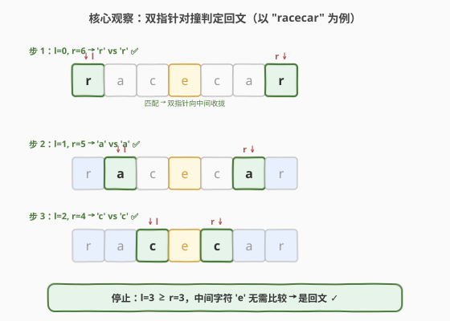
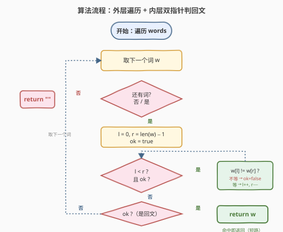
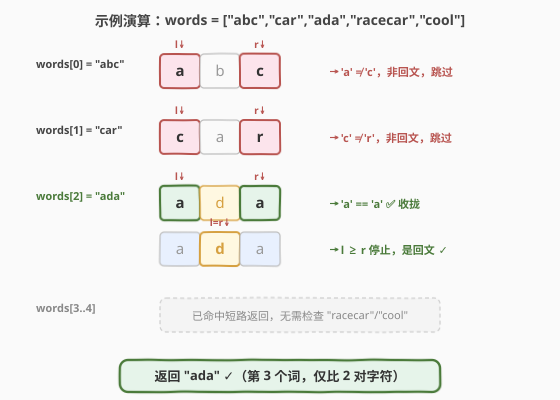

# 找出数组中的第一个回文字符串

- **题目名称**：找出数组中的第一个回文字符串
- **链接**：[2108. 找出数组中的第一个回文字符串](https://leetcode.cn/problems/find-first-palindromic-string-in-the-array/)
- **难度**：简单
- **标签**：数组、字符串、双指针

## 1. 题目概述

给定一个字符串数组 `words`，找出并返回数组中的**第一个回文字符串**。如果不存在满足要求的字符串，返回一个空字符串 `""`。

**回文字符串**的定义：如果一个字符串正着读和反着读一样，那么该字符串就是一个回文字符串。

**示例 1**：

```text
输入：words = ["abc","car","ada","racecar","cool"]
输出："ada"
解释：第一个回文字符串是 "ada"。
注意，"racecar" 也是回文字符串，但它不是第一个。
```

**示例 2**：

```text
输入：words = ["notapalindrome","racecar"]
输出："racecar"
解释：第一个也是唯一一个回文字符串是 "racecar"。
```

**示例 3**：

```text
输入：words = ["def","ghi"]
输出：""
解释：不存在回文字符串，所以返回一个空字符串。
```

**约束条件**：

- $1 \leq \text{words.length} \leq 100$
- $1 \leq \text{words[i].length} \leq 100$
- $\text{words[i]}$ 仅由小写英文字母组成

> 💡 **审题关键**：① 「第一个」指**数组顺序**中最靠前的回文，只需从左到右扫一遍、命中即返回；② 回文判定本身是经典子问题——可用双指针 $O(m)$ 判定，也可直接 `s == reverse(s)`；③ 数据规模极小（$n \leq 100$，$m \leq 100$），任何正确做法都能过，但面试中应展示**最优**写法：双指针 $O(1)$ 空间、提前终止。

---

## 2. 解题思路

### 2.1 暴力思路：逐词反转比较

最直观的做法：遍历 `words`，对每个词 `w` 反转得到 `w'`，若 `w == w'` 则返回 `w`；遍历结束仍未找到则返回 `""`。

- **正确性**：完全符合回文定义（正读 == 反读）。
- **效率**：判定单个词 $O(m)$ 时间 + $O(m)$ 空间（需存反转串）；遍历 $n$ 个词，整体 $O(nm)$ 时间、$O(m)$ 空间。
- **不足**：反转整串需要 $O(m)$ 额外空间，且即使首字符就不匹配也要把整个串反转完——**没有提前终止**。

> ⚠️ 对于本题的数据规模，暴力反转完全 AC。但反转串的 $O(m)$ 空间与「不提前终止」是两个可优化点，面试中应主动指出并改进。

### 2.2 核心观察：双指针对撞判定回文



回文的本质是「**关于中心对称**」——`s[i] == s[m-1-i]` 对所有 $i$ 成立。因此不必反转整串，只需从两端向中间收拢，逐对比较字符：

- 左指针 `l = 0`，右指针 `r = len(s) - 1`。
- 只要 `l < r`：若 `s[l] != s[r]`，立即判定**非回文**（提前终止）；否则 `l++`、`r--`，继续比较下一对。
- 循环正常结束（`l >= r`）则**是回文**。

$$\boxed{s \text{ 是回文} \iff \forall\, l < r,\ s[l] = s[r]}$$

**两个关键优势**：

| 优势 | 说明 |
|------|------|
| **$O(1)$ 空间** | 仅用 `l`、`r` 两个下标，无需反转串 |
| **提前终止** | 首对不匹配即返回 `false`，最坏才比到中间 |

**以 `"racecar"` 验证**（$m=7$，奇数长度，中间字符 `'e'` 无需比较）：

| 步 | `l` | `r` | `s[l]` | `s[r]` | 匹配？ |
|----|-----|-----|--------|--------|--------|
| 1 | 0 | 6 | `r` | `r` | ✅ |
| 2 | 1 | 5 | `a` | `a` | ✅ |
| 3 | 2 | 4 | `c` | `c` | ✅ |
| — | 3 | 3 | `e` | — | `l >= r`，停止 |

3 对全部匹配 → 是回文 ✓

> 💡 **奇偶长度统一处理**：无论长度奇偶，循环条件 `l < r` 都正确。奇数长度时中间字符自然跳过（`l == r` 时停止）；偶数长度时 `l` 与 `r` 在中间擦肩（`l > r` 时停止）。无需分类讨论。

### 2.3 算法流程图



**完整步骤**：

1. 遍历 `words` 中每个词 `w`：
2. &nbsp;&nbsp;**判定 `w` 是否回文**：`l = 0`，`r = len(w) - 1`，`ok = true`。
3. &nbsp;&nbsp;**当** `l < r` **且** `ok`：
   - 若 `w[l] != w[r]`：`ok = false`（提前终止）。
   - 否则：`l++`，`r--`。
4. &nbsp;&nbsp;**若** `ok`：**返回** `w`（找到第一个回文）。
5. 遍历结束仍未返回：**返回** `""`。

> ⚠️ 外层用「命中即返回」的**短路遍历**——找到第一个回文就 `return`，不必扫完整个数组。这是「找第一个」类题目的通用优化。

### 2.4 示例演算

以 `words = ["abc","car","ada","racecar","cool"]` 逐步演算：



**逐词拆解**：

- **`words[0] = "abc"`**（$m=3$）：`l=0,r=2`：`'a' != 'c'` → 非回文，跳过。
- **`words[1] = "car"`**（$m=3$）：`l=0,r=2`：`'c' != 'r'` → 非回文，跳过。
- **`words[2] = "ada"`**（$m=3$）：`l=0,r=2`：`'a' == 'a'` ✅ → `l=1,r=1`，`l >= r` 停止 → **是回文，返回 `"ada"`** ✓

$$\text{返回} = \text{"ada"} \checkmark$$

> 💡 **对照示例 3** `words = ["def","ghi"]`：`"def"` 判 `'d' != 'f'` 非回文；`"ghi"` 判 `'g' != 'i'` 非回文；遍历结束返回 `""` ✓。注意每个词只需比较**首对字符**即可否定——提前终止让实际比较次数远小于 $nm$。

---

## 3. 参考代码

### 方法一：双指针对撞判回文（$O(nm)$ / $O(1)$，推荐）

### C++

```cpp
class Solution {
public:
    string firstPalindrome(vector<string>& words) {
        for (const string& w : words) {
            if (isPalindrome(w)) return w;
        }
        return "";
    }
private:
    bool isPalindrome(const string& s) {
        int l = 0, r = s.size() - 1;
        while (l < r) {
            if (s[l] != s[r]) return false;
            ++l;
            --r;
        }
        return true;
    }
};
```

### Python

```python
class Solution:
    def firstPalindrome(self, words: list[str]) -> str:
        for w in words:
            if self._is_palindrome(w):
                return w
        return ""

    def _is_palindrome(self, s: str) -> bool:
        l, r = 0, len(s) - 1
        while l < r:
            if s[l] != s[r]:
                return False
            l += 1
            r -= 1
        return True
```

> 💡 **写法要点**：① 外层遍历命中即 `return`，短路返回第一个回文；② 回文判定抽成 `_is_palindrome`，职责单一、可复用；③ 循环条件 `l < r` 奇偶长度通用，中间字符无需处理；④ 参数用 `const string&` / 直接 `str` 避免拷贝。

### 方法二：Python 切片反转（$O(nm)$ / $O(m)$，思路对照）

### Python

```python
class Solution:
    def firstPalindrome(self, words: list[str]) -> str:
        for w in words:
            if w == w[::-1]:
                return w
        return ""
```

### C++

```cpp
class Solution {
public:
    string firstPalindrome(vector<string>& words) {
        for (const string& w : words) {
            string t(w.rbegin(), w.rend());
            if (w == t) return w;
        }
        return "";
    }
};
```

> 💡 方法二用「反转整串再比较」实现回文判定，Python 中 `w[::-1]` 极其简洁，竞赛首选。但相比方法一有两点不足：① **$O(m)$ 空间**——需构造反转串；② **不提前终止**——即使首字符不匹配也要反转完整串。面试中建议先写方法一展示 $O(1)$ 空间与提前终止意识，再提一句 Python 切片作为对照。

---

## 4. 复杂度分析

| 维度 | 方法 | 复杂度 | 说明 |
|------|------|--------|------|
| 时间 | 双指针 | $O(nm)$ | 最坏遍历 $n$ 个词，每词 $O(m)$ 判定；命中即停，实际更优 |
| 空间 | 双指针 | $O(1)$ | 仅 `l`、`r` 两个下标 |
| 时间 | 切片反转 | $O(nm)$ | 同为遍历 + 单词判定 |
| 空间 | 切片反转 | $O(m)$ | 需存反转串 |

> 💡 **关于 $O(nm)$ 是否可优化**：理论上不可——最坏情况（所有词都非回文，或仅最后一个词是回文）必须检查每个词的足够多字符。但双指针的**提前终止**让平均比较次数远低于 $nm$：对非回文词，平均只需比较约 1.27 对字符（首对即否定的概率最高）。$O(1)$ 空间是双指针相对切片反转的核心优势。

---

## 5. 扩展：若要找最长回文串 / 所有回文串

本题只问「第一个」回文，$O(nm)$ 即可。若问题升级，思路随之变化：

- **找最长回文串**：需对每个词判定后维护最大值，仍 $O(nm)$，但**不能短路**——必须扫完所有词。
- **判定子串是否回文（批量查询）**：单串上可用 **Manacher** $O(m)$ 预处理出所有回文半径，之后每次查询 $O(1)$。本题规模小无需此法，但面试官可能追问「如何支持大量回文查询」。
- **回文子串计数**（如 [647. 回文子串](https://leetcode.cn/problems/palindromic-substrings/)）：可用中心扩展 $O(m^2)$ 或 Manacher $O(m)$。

> 💡 本题是回文系列的**入门题**——核心是掌握「双指针对撞判回文」这一原子操作，后续所有回文题（中心扩展、Manacher、DP 预处理）都建立在此基础上。

---

## 6. 面试要点

**Q1：为什么用双指针而非反转字符串？**

> 双指针对撞判定回文有两个优势：① **$O(1)$ 空间**——仅用两个下标，无需构造反转串；② **提前终止**——首对字符不匹配即返回 `false`，不必处理整串。反转串做法（`s == s[::-1]`）简洁但需 $O(m)$ 空间且不提前终止。面试中优先展示双指针体现空间复杂度意识。

**Q2：循环条件为什么是 `l < r` 而非 `l <= r`？**

> 当 `l == r` 时（奇数长度中间字符），该字符与自己对称，**必然匹配**，无需比较。用 `l < r` 让奇数长度时 `l` 与 `r` 在中间字符处停止、偶数长度时擦肩而过（`l > r`），**奇偶长度统一处理**，无需分类讨论。若用 `l <= r`，奇数长度会多一次自比较，虽不影响正确性但冗余。

**Q3：「找第一个」为什么用短路返回？**

> 题目要求「第一个回文」，找到后后续词无需检查。外层遍历用「命中即 `return`」实现短路，平均情况下大幅减少比较次数。这是「找第一个满足条件」类题目的通用模式（如 [278. 第一个错误版本](../0201-0300/278_第一个错误的版本.md)、[724. 寻找数组的中心下标](../0701-0800/724_寻找数组的中心下标.md)）。

**Q4：数据规模这么小，为什么要追求 $O(1)$ 空间？**

> 本题 $n, m \leq 100$，任何正确做法都能 AC。但面试考察的是**复杂度意识与代码品味**——主动指出「反转串需 $O(m)$ 空间」「双指针可 $O(1)$」「可提前终止」三个优化点，体现对空间与常数因子的关注。这是区分「能做对」与「能做好」的关键。

**Q5：回文判定还有哪些做法？各自适用场景？**

> 三种主流做法：① **双指针对撞**——$O(m)$ 时间 / $O(1)$ 空间，单次判定首选；② **反转比较**——$O(m)$ 时间 / $O(m)$ 空间，Python 切片一行，竞赛首选；③ **Manacher**——$O(m)$ 预处理后支持 $O(1)$ 查询任意子串是否回文，适合批量查询场景。本题选①或②均可，面试展示①。

> 💡 **一句话总结**：遍历 `words`，对每个词用双指针对撞判定回文（$O(m)$ / $O(1)$，提前终止），命中即返回。整体 $O(nm)$ 时间、$O(1)$ 空间。核心是掌握「双指针对撞判回文」这一回文系列原子操作。

---

## 7. 同类练习题

- [9. 回文数](https://leetcode.cn/problems/palindrome-number/)：判定整数是否回文——同样用双指针对撞（数字版：反转一半数字），本题的「数值版」前身
- [125. 验证回文串](https://leetcode.cn/problems/valid-palindrome/)：判定含非字母数字的字符串是否回文——双指针对撞 + 跳过非法字符 + 大小写归一化，本题的「带噪音版」
- [680. 验证回文串 II](https://leetcode.cn/problems/valid-palindrome-ii/)：允许删除最多一个字符后是否回文——双指针对撞 + 贪心尝试删除（分两支继续判定），本题的「容错版」
- [5. 最长回文子串](https://leetcode.cn/problems/longest-palindromic-substring/)：求最长回文子串——中心扩展法，将「单串判定」升级为「所有位置扩展」，回文系列进阶
- [278. 第一个错误的版本](https://leetcode.cn/problems/first-bad-version/)：找第一个满足条件的版本——同为「找第一个」短路返回模式，但用二分而非线性扫描（单调性可用）
