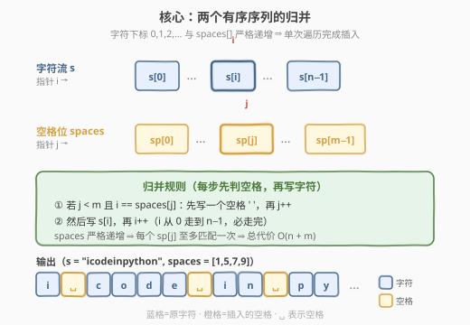
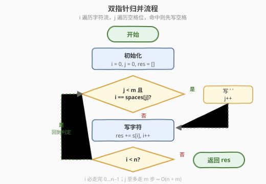
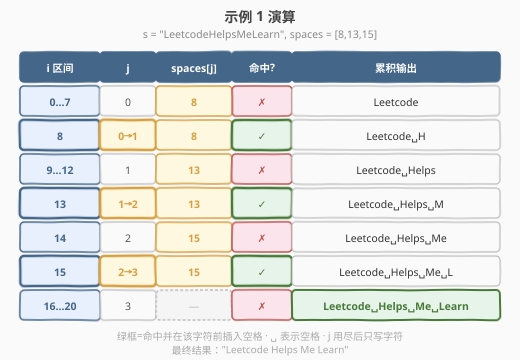

# 向字符串添加空格

- **题目名称**：向字符串添加空格
- **链接**：[2109. 向字符串添加空格](https://leetcode.cn/problems/adding-spaces-to-a-string/)
- **难度**：中等
- **标签**：数组、双指针、字符串、模拟

## 1. 题目概述

给定下标从 0 开始的字符串 `s` 和下标从 0 开始的整数数组 `spaces`。`spaces` 描述原字符串中需要添加空格的下标——每个空格都应插入到给定索引处的字符**之前**。返回添加空格后的字符串。

**示例 1**：

```text
输入：s = "LeetcodeHelpsMeLearn", spaces = [8,13,15]
输出："Leetcode Helps Me Learn"
解释：下标 8、13、15 对应 "LeetcodeHelpsMeLearn" 中加粗字符 H、M、L，在它们之前插入空格。
```

**示例 2**：

```text
输入：s = "icodeinpython", spaces = [1,5,7,9]
输出："i code in py thon"
解释：在下标 1、5、7、9 的字符前插入空格。
```

**示例 3**：

```text
输入：s = "spacing", spaces = [0,1,2,3,4,5,6]
输出：" s p a c i n g"
解释：字符串的第一个字符前也可以添加空格。
```

**约束条件**：

- $1 \leq \text{s.length} \leq 3 \times 10^5$
- `s` 仅由大小写英文字母组成
- $1 \leq \text{spaces.length} \leq 3 \times 10^5$
- $0 \leq \text{spaces}[i] \leq \text{s.length} - 1$
- `spaces` 中的所有值**严格递增**

---

## 2. 解题思路

### 2.1 暴力思路：逐个插入

最直白的做法是遍历 `spaces`，对每个下标 `pos` 调用字符串的 `insert(pos, " ")` 把空格插进 `s`。但字符串插入是 $O(n)$ 的——插入点之后的每个字符都要后移一位。`spaces` 有 $m$ 个位置，最坏 $m \approx n$，总代价 $O(n \cdot m) = O(n^2)$，对 $n = 3 \times 10^5$ 达到 $9 \times 10^{10}$，必然超时。

> ⚠️ **陷阱**：本题 $n, m$ 同阶且都到 $3 \times 10^5$，任何在原串上反复插入的做法都会退化到平方级。必须**一次性构造结果**，避免反复搬运字符。

### 2.2 核心观察：双指针归并

关键在于注意到 `spaces` **严格递增**，与字符下标 `0, 1, 2, …, n-1` 同为升序序列。这本质上是**两个有序序列的归并**：

- 序列 A：字符流 $s[0], s[1], \dots, s[n-1]$，由指针 $i$ 从左到右扫描；
- 序列 B：空格插入位 $\text{spaces}[0], \text{spaces}[1], \dots, \text{spaces}[m-1]$，由指针 $j$ 从左到右扫描。

归并规则：枚举 $i$ 遍历每个字符。在写字符 $s[i]$ 之前，先检查 $j$ 是否指向当前下标——若 $j < m$ 且 $i = \text{spaces}[j]$，说明这个字符前面要加空格，于是先写一个空格、$j$ 自增，再写 $s[i]$。



> 💡 **为什么 $j$ 不会回退？** `spaces` 严格递增，而 $i$ 单调递增。一旦 $i$ 越过 $\text{spaces}[j]$（即 $i > \text{spaces}[j]$ 时必然已经命中过它），后续的 $i$ 只会更大，$\text{spaces}[j]$ 永不再被匹配。因此命中后 $j$ 自增一次即可，$j$ 至多走 $m$ 步，总工作量 $O(n + m)$。

> ⚠️ **边界 `spaces[i] == 0`**：在第一个字符前插空格完全合法。此时 $i = 0$ 命中 $\text{spaces}[0] = 0$，先写空格再写 $s[0]$，逻辑无需特判。

### 2.3 算法流程图



### 2.4 示例演算

以示例 1 为例：`s = "LeetcodeHelpsMeLearn"`，`spaces = [8, 13, 15]`。指针 $i$ 从 0 走到 20，每走到 $8, 13, 15$ 时先插空格：



| 步骤 | $i$ 区间 | $j$ | $\text{spaces}[j]$ | 命中? | 动作 | 累积输出 |
|------|---------|-----|--------------------|-------|------|---------|
| 1 | 0…7 | 0 | 8 | ✗ | 写 $s[0..7]$ | `Leetcode` |
| 2 | 8 | 0→1 | 8 | ✓ | 写空格 + `H` | `Leetcode H` |
| 3 | 9…12 | 1 | 13 | ✗ | 写 $s[9..12]$ | `Leetcode Helps` |
| 4 | 13 | 1→2 | 13 | ✓ | 写空格 + `M` | `Leetcode Helps M` |
| 5 | 14 | 2 | 15 | ✗ | 写 `e` | `Leetcode Helps Me` |
| 6 | 15 | 2→3 | 15 | ✓ | 写空格 + `L` | `Leetcode Helps Me L` |
| 7 | 16…20 | 3 | — | ✗ | 写 $s[16..20]$ | `Leetcode Helps Me Learn` |

$j$ 用尽（$j = 3 = m$）后不再检查空格位，只写字符直到末尾。最终结果 `"Leetcode Helps Me Learn"`。

---

## 3. 参考代码

### C++

```cpp
class Solution {
public:
    string addSpaces(string s, vector<int>& spaces) {
        int n = s.size(), m = spaces.size();
        string res;
        res.reserve(n + m);
        for (int i = 0, j = 0; i < n; i++) {
            if (j < m && i == spaces[j]) {
                res.push_back(' ');
                j++;
            }
            res.push_back(s[i]);
        }
        return res;
    }
};
```

### Python

```python
class Solution:
    def addSpaces(self, s: str, spaces: List[int]) -> str:
        res = []
        j = 0
        m = len(spaces)
        for i, ch in enumerate(s):
            if j < m and i == spaces[j]:
                res.append(' ')
                j += 1
            res.append(ch)
        return ''.join(res)
```

> 💡 **工程细节**：C++ 中 `res.reserve(n + m)` 预分配容量，避免 `push_back` 触发多次扩容；Python 中用列表 `res` 收集字符再 `''.join`，比字符串 `+=` 拼接快得多（后者每次产生新对象）。两者都把构造结果的代价压到线性。

---

## 4. 复杂度分析

| 维度 | 复杂度 | 说明 |
|------|--------|------|
| 时间复杂度 | $O(n + m)$ | $i$ 遍历 $n$ 个字符，$j$ 至多前进 $m$ 步，每个元素各处理一次 |
| 空间复杂度 | $O(n + m)$ | 结果字符串长度恰为 $n + m$（不计输出则 $O(1)$ 额外空间） |

> ⚠️ `spaces` 严格递增是线性解法的前提。若 `spaces` 无序，需先排序 $O(m \log m)$，或改用哈希集合 $O(n + m)$ 但常数更大。本题保证了有序性，故双指针归并最优。

---

## 5. 扩展：预分配字符数组

上面的写法用动态追加构造结果。由于结果长度确定（$n + m$），可以**直接预分配定长数组**，把空格位置预先留好，再填入字符：

```cpp
class Solution {
public:
    string addSpaces(string s, vector<int>& spaces) {
        int n = s.size(), m = spaces.size();
        string res(n + m, ' ');          // 全部初始化为空格
        int w = 0;                        // 写指针
        for (int i = 0, j = 0; i < n; i++) {
            if (j < m && i == spaces[j]) {
                w++;                      // 跳过一格，保留预填的空格
                j++;
            }
            res[w++] = s[i];
        }
        return res;
    }
};
```

思路：`res` 初始化为 $n + m$ 个空格，写指针 $w$ 从 0 推进。当 $i$ 命中某个空格位时，$w$ 先自增跳过一格（那格已经是空格），再写字符。这样空格"自动"出现在正确位置，无需显式 `push_back(' ')`。

- **优点**：一次定长分配，无扩容开销；写入是纯赋值，常数最小。
- **代价**：逻辑稍绕，需理解"跳格留空"的技巧。
- **复杂度**：仍是 $O(n + m)$ 时间、$O(n + m)$ 空间，常数更优。

> 💡 这与 [27. 移除元素](../0001-0100/27_移除元素.md) 的快慢双指针同构——那里用读指针 $i$ / 写指针 $w$ 在原地把保留元素前移，这里则把"插入空格"转化为"写指针跳格"。本质都是**用一个写指针控制输出位置**。

---

## 6. 面试要点

1. **为什么不能逐个 `insert`？**
   - 字符串 `insert` 是 $O(n)$ 的（插入点后全部后移），$m$ 次插入退化到 $O(n \cdot m)$。$n, m$ 同阶到 $3 \times 10^5$ 时必然超时。必须一次构造结果。

2. **为什么双指针是 $O(n + m)$？**
   - `spaces` 严格递增、$i$ 单调递增。$j$ 只在命中时自增、从不回退，至多走 $m$ 步；$i$ 走 $n$ 步。合计 $n + m$ 次操作，每次 $O(1)$。

3. **`spaces[i] == 0`（首字符前插空格）需要特判吗？**
   - 不需要。$i = 0$ 时若命中 $\text{spaces}[0] = 0$，先写空格再写 $s[0]$，与通用逻辑一致。题目明确允许。

4. **为什么强调 `spaces` 严格递增？**
   - 严格递增保证 $j$ 单调前进不回退，是线性归并的基础。若允许重复或乱序，同一下标可能对应多个空格或 $j$ 需回退，双指针失效。

5. **预分配写法和动态追加写法差在哪？**
   - 预分配把空格"占位"再填字符，省去显式写空格和扩容；动态追加逻辑直观但可能多次扩容（`reserve` 可消除）。两者复杂度相同，预分配常数更优。

---

## 7. 同类练习题

- [27. 移除元素](https://leetcode.cn/problems/remove-element/)（[题解](../0001-0100/27_移除元素.md)）：快慢双指针原地写，同属"读指针 $i$ / 写指针 $w$ 控制输出"范式，对照"跳格留空"技巧
- [88. 合并两个有序数组](https://leetcode.cn/problems/merge-sorted-array/)：两有序序列归并到定长缓冲区，与本题"字符流 + 空格位归并"结构同构
- [977. 有序数组的平方](https://leetcode.cn/problems/squares-of-a-sorted-array/)（[题解](../0801-0900/977_有序数组的平方.md)）：双指针归并两个有序段到结果数组，预分配 + 双写指针同思路
- [1768. 交替合并字符串](https://leetcode.cn/problems/merge-strings-alternately/)：两个字符串按位交替归并，最简的双指针归并模板，本题的"退化特例"
- [986. 区间列表的交集](https://leetcode.cn/problems/interval-list-intersections/)（[题解](../0801-0900/986_区间列表的交集.md)）：两个有序区间列表取交集，双指针各单调推进，同属有序序列归并
