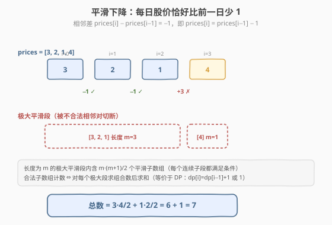
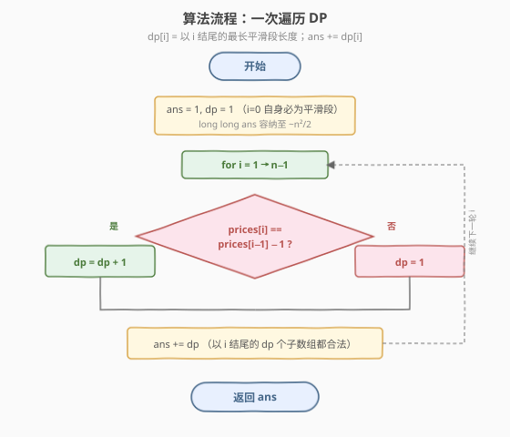
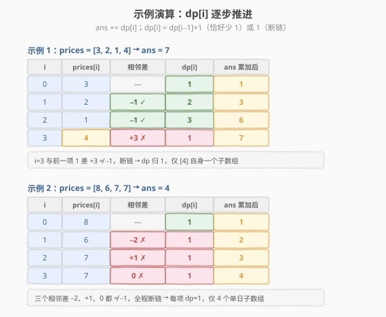

# 股票平滑下降阶段的数目

- **题目名称**：股票平滑下降阶段的数目
- **链接**：[2110. 股票平滑下降阶段的数目](https://leetcode.cn/problems/number-of-smooth-descent-periods-of-a-stock/)
- **难度**：中等
- **标签**：数组、动态规划、滑动窗口、贡献计数

## 1. 题目概述

给你一个整数数组 `prices`，表示一支股票的历史每日股价，其中 `prices[i]` 是第 `i` 天的价格。

一个 **平滑下降的阶段** 定义为：连续一天或多天，**每日股价都比前一日股价恰好少 `1`**（第一天的股价没有限制）。换句话说，对阶段内任一相邻对 `prices[k-1], prices[k]`，都满足：

$$\text{prices}[k] = \text{prices}[k-1] - 1$$

请返回 `prices` 中**平滑下降阶段的数目**。单个元素本身也算一个阶段。

**示例 1**：

```text
输入：prices = [3,2,1,4]
输出：7
解释：7 个平滑下降阶段为：
  [3], [2], [1], [4], [3,2], [2,1], [3,2,1]
  相邻差：3→2 为 −1 ✓，2→1 为 −1 ✓，1→4 为 +3 ✗
```

**示例 2**：

```text
输入：prices = [8,6,7,7]
输出：4
解释：4 个平滑下降阶段：[8], [6], [7], [7]
  相邻差：8→6 为 −2 ✗，6→7 为 +1 ✗，7→7 为 0 ✗（注意相等不算）
```

**示例 3**：

```text
输入：prices = [1]
输出：1
```

**约束条件**：

- $1 \le$ `prices.length` $\le 10^5$
- $1 \le$ `prices[i]` $\le 10^5$

> 💡 关键观察：判定条件 **只依赖相邻两个元素**（`prices[k] == prices[k-1] - 1`），与更远的元素无关。这种「局部性」是能把 $O(n^2)$ 枚举降到 $O(n)$ 的根本原因——一旦某相邻对不合法，**任何跨过该对的子数组都不合法**，相当于在数组上切了一刀。

---

## 2. 解题思路

### 2.1 暴力思路：枚举所有子数组

最直观的做法：枚举子数组左端点 `i`，向右扩展右端点 `j`，边扩展边检查 `prices[j] == prices[j-1] - 1` 是否成立；一旦不成立就停止扩展（因为再往后都跨过了不合法的对，必然非法）。

```text
ans = 0
for i in 0..n-1:
    ans += 1                       # 单元素 [i] 必合法
    for j in i+1..n-1:
        if prices[j] == prices[j-1] - 1:
            ans += 1               # [i..j] 合法
        else:
            break                  # 跨过非法对，停止
return ans
```

最坏情况（如 `prices = [n, n-1, ..., 1]` 全程合法），内层循环累计 $\frac{n(n-1)}{2}$ 次，时间 $O(n^2)$。$n = 10^5$ 时约 $5 \times 10^9$ 次操作，**超时**。

> ⚠️ 暴力法的瓶颈：虽然「遇非法即 break」已经利用了局部性来剪枝，但**统计层面**仍在按子数组枚举——每个合法子数组被单独计数一次。突破口是翻转视角：不问「有多少合法子数组」，而问「以位置 `i` 结尾的合法子数组有几个」——这就把求和从子数组层降到元素层。

### 2.2 核心观察：条件局部性 → 一次遍历 DP

**关键定义**：令 `dp[i]` = **以 `i` 结尾的最长平滑下降阶段长度**。则：

- 以 `i` 结尾的合法子数组，恰好是该最长阶段的 **所有后缀**——`[i]`、`[i-1, i]`、…、`[i-dp[i]+1, ..., i]`，共 `dp[i]` 个。
- 因此 **以 `i` 结尾的合法子数组数目 = `dp[i]`**，总答案为：

$$\text{ans} = \sum_{i=0}^{n-1} \text{dp}[i]$$

**递推**：由于条件只依赖相邻对，`dp[i]` 由 `dp[i-1]` 直接决定：

$$\text{dp}[i] = \begin{cases} \text{dp}[i-1] + 1, & \text{若 } \text{prices}[i] = \text{prices}[i-1] - 1 \\ 1, & \text{否则（断链，只剩单元素自身）} \end{cases}$$

边界 `dp[0] = 1`（单元素必为平滑段）。



> 💡 **为什么「以 `i` 结尾的合法子数组数目 = `dp[i]`」？** 设 `dp[i] = L`，意味着 `prices[i-L+1 .. i]` 这一段相邻对全合法（是一个长 `L` 的极大平滑段）。这一段的任意后缀 `[i-k+1 .. i]`（`1 \le k \le L`）内部所有相邻对都合法，故都是平滑阶段，恰好 `L` 个。而向左再延伸一步会引入 `prices[i-L] → prices[i-L+1]` 这个非法对（否则 `dp[i]` 还能更长），所以恰好 `L` 个、不多不少。这就是「最长合法段长度 = 合法后缀数」的等价性，也是把子数组计数转为元素层求和的关键。

> ⚠️ **「恰好少 1」不含相等**。示例 2 中 `7 → 7`（差 0）不算平滑——只有差恰好为 `−1` 才算。这是本题与「非递增子数组」类问题的区别，审题时务必注意。

### 2.3 算法流程图



```text
getDescentPeriods(prices):
  n = len(prices)
  ans = 1, dp = 1                # i = 0
  for i = 1 to n-1:
    if prices[i] == prices[i-1] - 1:
      dp = dp + 1                # 续接：以 i 结尾的后缀数 +1
    else:
      dp = 1                     # 断链：仅自身
    ans += dp
  return ans
```

> 💡 只用 **一个变量 `dp`** 滚动记录 `dp[i-1]`，无需数组，空间 $O(1)$。`ans` 用 `long long`：最坏情况 $n = 10^5$ 全程合法时 $\text{ans} = \frac{n(n+1)}{2} \approx 5 \times 10^9$，超过 32 位 `int` 上限（约 $2.1 \times 10^9$）。

### 2.4 示例演算

以示例 1 `prices = [3, 2, 1, 4]`（答案 7）和示例 2 `prices = [8, 6, 7, 7]`（答案 4）逐步推进 `dp` 与 `ans`：



**示例 1 要点**：`i=0..2` 形成 `3→2→1` 的长 3 平滑段，`dp` 从 1 涨到 3，累计贡献 `1+2+3 = 6`；`i=3`（值 4）与前一项 1 差 +3，断链 `dp` 归 1，贡献 1，合计 7。

**示例 2 要点**：三个相邻差 `−2、+1、0` 都 ≠ `−1`，全程断链，每项 `dp=1`，合计 4 个单日子数组——注意 `7→7`（差 0）也断链，因「恰好少 1」不含相等。

> 💡 对比暴力法：暴力要枚举 10 个子数组各判一次；DP 对 4 个元素各做一次 `dp` 递推再累加，乘法原理直接拿到该位置对所有合法子数组的总贡献。这是「翻转视角」降阶的威力——从 $O(n^2)$ 个子数组降到 $O(n)$ 个元素。

---

## 3. 参考代码

### C++：一次遍历 DP（$O(n)$ / $O(1)$）

```cpp
// 股票平滑下降阶段的数目 —— 一次遍历 DP
// 编译: g++ -O2 -std=c++17 solution.cpp -o descent
#include <vector>
using namespace std;

class Solution {
public:
    long long getDescentPeriods(vector<int>& prices) {
        int n = prices.size();
        long long ans = 1;          // dp[0] = 1，ans 先计入 i=0
        int dp = 1;                 // 滚动记录 dp[i-1]
        for (int i = 1; i < n; ++i) {
            // 条件：每日股价恰好比前一日少 1
            if (prices[i] == prices[i - 1] - 1) {
                ++dp;               // 续接：以 i 结尾的合法后缀数 = dp[i-1] + 1
            } else {
                dp = 1;             // 断链：仅自身一个
            }
            ans += dp;              // 累加以 i 结尾的 dp 个合法子数组
        }
        return ans;
    }
};
```

### Python：一次遍历 DP（$O(n)$ / $O(1)$）

```python
class Solution:
    def getDescentPeriods(self, prices: list[int]) -> int:
        ans = 1                     # dp[0] = 1
        dp = 1                      # 滚动记录 dp[i-1]
        for i in range(1, len(prices)):
            if prices[i] == prices[i - 1] - 1:
                dp += 1             # 续接
            else:
                dp = 1              # 断链
            ans += dp
        return ans
```

### C++：极大段分组 + 组合数求和（$O(n)$ / $O(1)$）

```cpp
// 股票平滑下降阶段的数目 —— 极大段分组 + 组合数
// 编译: g++ -O2 -std=c++17 solution.cpp -o descent
#include <vector>
using namespace std;

class Solution {
public:
    long long getDescentPeriods(vector<int>& prices) {
        int n = prices.size();
        long long ans = 0;
        int i = 0;
        while (i < n) {
            int j = i + 1;
            // 尽量向右扩展合法相邻对，得到极大平滑段 [i, j)
            while (j < n && prices[j] == prices[j - 1] - 1) {
                ++j;
            }
            long long m = j - i;                 // 极大段长度
            ans += m * (m + 1) / 2;              // 段内所有连续子段都合法
            i = j;                               // 跳到下一段起点
        }
        return ans;
    }
};
```

> 💡 **两种视角等价**：DP 版 `ans = Σ dp[i]`，分组版 `ans = Σ m·(m+1)/2`。对一个长 `m` 的极大段，`dp` 值依次为 `1, 2, …, m`，其和恰为 $\frac{m(m+1)}{2}$——正是组合数版每段的贡献。两者只是「按位置累加」还是「按段累加」的区别，复杂度相同。DP 版代码更短、更通用；分组版直觉更直白（「数段长再套等差数列求和」）。

---

## 4. 复杂度分析

| 维度 | 复杂度 | 说明 |
|------|--------|------|
| **时间复杂度** | $O(n)$ | 一次遍历，每个元素仅做一次 `dp` 递推与累加；分组版每元素至多被访问两次（作为段内成员 + 段尾判定） |
| **空间复杂度** | $O(1)$ | 仅用 `dp`、`ans` 两个滚动变量，无额外数组 |

> ⚠️ **数据类型**：`ans` 最坏为 $\frac{n(n+1)}{2}$，$n = 10^5$ 时约 $5 \times 10^9$，**超过 32 位 `int`**（$\approx 2.1 \times 10^9$）。C++ 必须用 `long long`；Python 整数任意精度无需担心。这是本题最常见的踩坑点。

---

## 5. 扩展：极大段分组视角与可推广模板

### 5.1 「条件只依赖相邻对」的子数组计数模板

本题是一类问题的典型代表：**判定条件只依赖相邻两个元素**。这类问题都有 $O(n)$ 解法，通式为：

- **DP 视角**：`dp[i]` = 以 `i` 结尾的最长合法段长度；`ans += dp[i]`。
- **分组视角**：用「非法相邻对」把数组切成若干极大合法段，每段长 `m` 贡献 $\frac{m(m+1)}{2}$。

两种视角完全等价，择一即可。条件越复杂（如涉及窗口内多元素统计），越偏向滑窗；条件越局部（只看相邻对），越偏向 DP/分组。

### 5.2 与滑动窗口计数的关系

[713. 乘积小于 K 的子数组](../0701-0800/713_乘积小于K的子数组.md) 用「`right - left + 1`」计数以 `right` 结尾的合法子数组——和本题 `ans += dp[i]` **形神皆似**：都是「以某位置结尾的合法子数组数目 = 该位置的最长合法左延伸长度」。区别在于 713 的条件（窗口乘积 < K）不局部、需用滑窗维护左端点收缩；本题条件局部（只看相邻对），左端点要么续接要么归零，无需显式滑窗。

### 5.3 若条件改为「差至多为 k」或「非递增」

- **差至多为 k**（`prices[i-1] - prices[i] ≤ k` 且非递增）：把判定改为 `prices[i] >= prices[i-1] - k && prices[i] <= prices[i-1]`，DP 模板不变。
- **非递增**（`prices[i] <= prices[i-1]`，差可为任意非负）：判定改为 `prices[i] <= prices[i-1]`，仍可用同一 DP。

模板的稳健性来自条件的局部性——只要判定能写成「只看 `prices[i-1], prices[i]`」的布尔函数，DP 递推就成立。

---

## 6. 面试要点

1. **为什么 `dp[i]` 等于「以 `i` 结尾的合法子数组数目」？**

   - `dp[i]` 是以 `i` 结尾的最长合法段长度 `L`。该段的每个后缀（共 `L` 个）都合法，且向左再延伸一步必引入非法相邻对（否则 `dp[i]` 还能更长），故恰好 `L` 个。`ans = Σ dp[i]` 把子数组层求和转为元素层求和。

2. **为什么能把 $O(n^2)$ 降到 $O(n)$？根本原因是什么？**

   - 条件**只依赖相邻两个元素**。一旦某相邻对非法，任何跨过它的子数组都非法——相当于在数组上切了一刀。因此合法子数组不会跨过「断点」，问题被分解为若干极大合法段，段内用等差数列求和 $O(1)$ 算贡献，总 $O(n)$。

3. **答案为什么可能很大？需要什么数据类型？**

   - 最坏全合法时 $\text{ans} = \frac{n(n+1)}{2}$，$n = 10^5$ 时约 $5 \times 10^9$，超 32 位 `int`（$\approx 2.1 \times 10^9$）。C++ 用 `long long`，Python 无需担心。这是本题最高频的 WA 来源。

4. **DP 版与极大段分组版有何异同？**

   - 等价：对一个长 `m` 的极大段，`dp` 依次为 `1,2,…,m`，和为 $\frac{m(m+1)}{2}$，正是分组版每段贡献。DP 按「位置」累加、代码更短更通用；分组按「段」累加、直觉更直白。复杂度均为 $O(n)/O(1)$。

5. **「恰好少 1」与「非递增」有何区别？审题注意什么？**

   - 本题要求 `prices[i] == prices[i-1] - 1`（差恰好 `−1`），**相等不算**（示例 2 的 `7→7` 断链）。而「非递增」允许差为任意非负（含 0）。条件不同 DP 判定式不同，但模板通用——只要判定是相邻对的布尔函数即可。

> 💡 **一句话总结**：2110 是「条件局部的子数组计数」模板题——用 `dp[i] = 以 i 结尾的最长合法段长度`、`ans += dp[i]` 一次遍历 $O(n)$ 解决，或等价地按极大段分组求 $\frac{m(m+1)}{2}$ 之和。核心是识别「条件只依赖相邻对」的局部性，并注意 `long long` 防溢出。

---

## 7. 同类练习题

- [713. 乘积小于 K 的子数组](https://leetcode.cn/problems/subarray-product-less-than-k/)（[题解](../0701-0800/713_乘积小于K的子数组.md)）：以 `right` 结尾的合法子数组数 = `right - left + 1`，与本题 `ans += dp[i]` 同构，区别在条件非局部需滑窗
- [2104. 子数组范围和](https://leetcode.cn/problems/sum-of-subarray-ranges/)（[题解](../2101-2200/2104_子数组范围和.md)）：同属「子数组计数/求和」家族，用贡献计数 + 单调栈把 $O(n^2)$ 降到 $O(n)$
- [228. 汇总区间](https://leetcode.cn/problems/summary-ranges/)：把连续递增 1 的序列分组成区间，与本题「极大平滑段」分组思路一致
- [845. 数组中的最长山脉](https://leetcode.cn/problems/longest-mountain-in-array/)：基于相邻差判定上升/下降段，run-based 双指针，本题分组的进阶形态
- [2799. 统计完全子数组的数目](https://leetcode.cn/problems/count-complete-subarrays-in-an-array/)：子数组计数，条件非局部改用「至多 K」转化 + 滑窗，对照本题局部条件的 DP 解法
