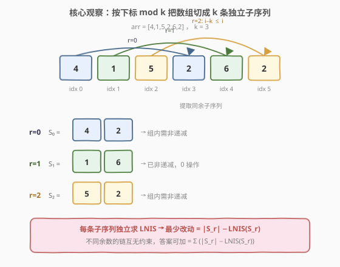
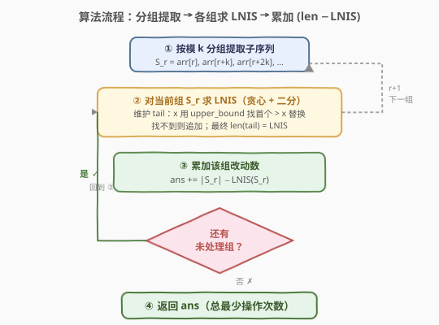

# 使数组 K 递增的最少操作次数

- **题目名称**：使数组 K 递增的最少操作次数
- **链接**：[2111. 使数组 K 递增的最少操作次数](https://leetcode.cn/problems/minimum-operations-to-make-the-array-k-increasing/)
- **难度**：困难
- **标签**：数组、二分查找、动态规划、最长非递减子序列

## 1. 题目概述

给定下标从 **0** 开始、含 `n` 个正整数的数组 `arr`，以及正整数 `k`。若对每个满足 $k \le i \le n-1$ 的下标 `i` 都有 $\text{arr}[i-k] \le \text{arr}[i]$，则称 `arr` 是 **K 递增** 的。

每一次**操作**可以任选一个下标 `i`，把 $\text{arr}[i]$ 改成**任意正整数**。求使数组变成 K 递增的**最少操作次数**。

**示例 1**：

```text
输入：arr = [5,4,3,2,1], k = 1
输出：4
解释：k = 1 时数组必须整体非递减。保留任一元素、改其余 4 个即可，如 [5,6,7,8,9]。
```

**示例 2**：

```text
输入：arr = [4,1,5,2,6,2], k = 2
输出：0
解释：按下标模 2 分两组——
  组0：arr[0,2,4] = [4,5,6] 非递减
  组1：arr[1,3,5] = [1,2,2] 非递减
两组都已满足，无需操作。
```

**示例 3**：

```text
输入：arr = [4,1,5,2,6,2], k = 3
输出：2
解释：按下标模 3 分三组——
  组0：arr[0,3] = [4,2] 需改 1 个（如 2→4）
  组1：arr[1,4] = [1,6] 已非递减，0 操作
  组2：arr[2,5] = [5,2] 需改 1 个（如 2→5）
合计 2 次操作。
```

**约束条件**：

- $1 \le \text{arr.length} \le 10^5$
- $1 \le \text{arr}[i], k \le \text{arr.length}$

> 💡 **审题关键**：① 条件 $\text{arr}[i-k] \le \text{arr}[i]$ 只约束"相隔 `k` 位"的元素对，并不要求相邻位有序；② 操作可改成任意正整数，意味着对某条需要变有序的子序列，最省操作的策略是**保留尽可能多的元素不动**，其余改掉——这正是「最少改动次数 = 长度 − 最长非递减子序列长度」的等价转化。

---

## 2. 解题思路

### 2.1 暴力思路：整体 DP 求最少改动

把"使数组 K 递增"看作一个整体约束，尝试用一维/二维 DP 直接求最少操作次数：令 `dp[i]` 表示"使前 `i+1` 个元素满足 K 递增的最少操作"，转移时枚举上一个未改动的下标 `j`（满足 $j \le i - k$ 且 $\text{arr}[j] \le \text{arr}[i]$ 时可同时保留）。

- **正确性**：理论上可刻画，但需要同时维护"哪些下标被保留"与"K 递增跨 `k` 位的约束"，状态依赖不连续的下标。
- **效率**：转移需枚举 $O(n)$ 个 `j`，总计 $O(n^2)$；$n \le 10^5$ 时达到 $10^{10}$，严重超时，且常数大、实现复杂。

> ⚠️ 暴力的盲点在于把 `K 递增` 当成"一条"耦合约束。其实它只连接相隔 `k` 位的元素对，天然把整个数组**切成 `k` 条互不相干的子序列**——每条子序列内部才需要"非递减"。把约束解耦，问题瞬间塌缩成 `k` 个独立的最长非递减子序列（LNIS）子问题。

### 2.2 核心观察：按模 k 分解为 k 条独立子序列



关键直觉分三层：

**1. K 递增约束在"跨 `k` 位"的链上传递**。条件 $\text{arr}[i-k] \le \text{arr}[i]$ 把下标按"$\bmod k$ 同余"连成一条链：下标 $r, r+k, r+2k, \dots$ 构成一条**等差子序列**，链上任一相邻对都要求前 $\le$ 后。这正是"该子序列非递减"的定义。

**2. 不同余数的链彼此独立**。下标 $r_1$ 与 $r_2$（$r_1 \not\equiv r_2 \pmod k$）之间没有任何约束相连——既不会被同一个 $i-k \le i$ 关系同时涉及，改动一条链上的元素也不影响另一条链的非递减判定。因此整个问题**完全可分**：

$$\text{答案} = \sum_{r=0}^{k-1} \Big( \text{len}(S_r) - \text{LNIS}(S_r) \Big)$$

其中 $S_r = [\text{arr}[r],\, \text{arr}[r+k],\, \text{arr}[r+2k],\, \dots]$ 是第 $r$ 条子序列，$\text{LNIS}(S_r)$ 是其**最长非递减子序列**长度。

**3. "保留最多 = 改动最少"**。对一条长度为 $m$ 的子序列，要让它非递减，**保留一个已有的非递减子序列、把其余元素改成填补值**是最省的——保留得越长，要改的越少。能保留的最长长度恰为 $\text{LNIS}$，故该子序列的最少改动数 $= m - \text{LNIS}$。

$$\boxed{\text{最少操作次数} = \sum_{r=0}^{k-1} \big(|S_r| - \text{LNIS}(S_r)\big)}$$

> 💡 **为什么"改成任意正整数"总能填补？** 设保留的非递减子序列为 $a_{i_1} \le a_{i_2} \le \dots \le a_{i_t}$，被改的下标分落在相邻保留元素之间或两端。两端外可取 $1$ 或足够大的值；两保留元素 $a_{i_p} \le a_{i_{p+1}}$ 之间的空位总可填入 $[a_{i_p}, a_{i_{p+1}}]$ 内的非递增序列（如都填 $a_{i_p}$ 或 $a_{i_{p+1}}$）。故只要保留段非递减，剩余位置必能填成整体非递减的正整数，不会出现"无法填补"的情况。

> ⚠️ **LNIS 用 `upper_bound` 而非 `lower_bound`**：因为本题允许相等（非递减），处理 `x` 时要找 `tail` 中**第一个严格大于 `x`** 的位置替换，使等值元素可以继续延长子序列；若误用 `lower_bound`（第一个 $\ge x$），相等元素会被替换掉，退化成严格递增的 LIS，会低估 LNIS 长度从而**高估答案**。

### 2.3 算法流程图



**完整步骤**：

1. **分组提取**：对每个余数 $r \in [0, k)$，按下标 $r, r+k, r+2k, \dots$ 抽取子序列 $S_r$ 的值（共 $\lceil(n-r)/k\rceil$ 个）。
2. **逐组求 LNIS**：对 $S_r$ 用「贪心 + 二分」求最长非递减子序列长度——维护一个 `tail` 数组，对每个 `x` 找 `tail` 中第一个 $> x$ 的位置（`upper_bound`）并替换；找不到则把 `x` 追加到末尾。最终 `tail` 的长度即 $\text{LNIS}(S_r)$。
3. **累加答案**：把 $|S_r| - \text{LNIS}(S_r)$ 累加进总操作数。
4. **返回总和**。

> 💡 **复杂度为何是 $O(n \log n)$ 而非 $O(n \log (n/k))$？** 每组长度 $m_r \approx n/k$，单组 LNIS 耗时 $O(m_r \log m_r)$。所有组求和：$\sum_r m_r \log m_r \le (\sum_r m_r) \log(\max_r m_r) = n \log(n/k) \le n \log n$。最坏情形 $k=1$（单组长度 $n$）恰为 $O(n \log n)$；$k$ 越大组越短，总耗时反而越小。

### 2.4 示例演算

以**示例 3**（`arr = [4,1,5,2,6,2]`, `k = 3`）逐步演算：

![示例演算：arr=[4,1,5,2,6,2], k=3 分三组求 LNIS](../images/2111_example_walkthrough.svg)

**步骤 ① 分组**：

| 余数 $r$ | 子序列下标 | 子序列值 $S_r$ | 长度 $|S_r|$ |
|----------|-----------|----------------|--------------|
| 0        | 0, 3      | `[4, 2]`       | 2            |
| 1        | 1, 4      | `[1, 6]`       | 2            |
| 2        | 2, 5      | `[5, 2]`       | 2            |

**步骤 ② 逐组求 LNIS（`upper_bound` 版贪心）**：

| 组 | 处理过程（`tail` 演化） | $\text{LNIS}$ | 改动数 $|S_r|-\text{LNIS}$ |
|----|------------------------|----------------|---------------------------|
| $r=0$ `[4,2]` | `x=4`→`tail=[4]`；`x=2`→`upper_bound([4],2)=0`（`4>2`）替换→`tail=[2]` | 1 | $2-1=1$ |
| $r=1$ `[1,6]` | `x=1`→`tail=[1]`；`x=6`→`upper_bound([1],6)=1`（无 $>6$）追加→`tail=[1,6]` | 2 | $2-2=0$ |
| $r=2$ `[5,2]` | `x=5`→`tail=[5]`；`x=2`→`upper_bound([5],2)=0`（`5>2`）替换→`tail=[2]` | 1 | $2-1=1$ |

**步骤 ③ 累加**：

$$\text{答案} = 1 + 0 + 1 = 2 \quad \checkmark$$

> 💡 **对照示例 1**（`arr = [5,4,3,2,1]`, `k = 1`）：只有一组 $S_0 = [5,4,3,2,1]$，`upper_bound` 版贪心逐步替换：`tail` 始终长度 1（每个新值都更小，替换 `tail[0]`），$\text{LNIS}=1$，答案 $= 5 - 1 = 4$。这恰是经典「最少改动能得到非递减数组」结论的直接体现。
>
> 💡 **对照示例 2**（`arr = [4,1,5,2,6,2]`, `k = 2`）：$S_0=[4,5,6]$ 与 $S_1=[1,2,2]$ 两组的 LNIS 都等于各自长度（已非递减），答案 $= 0 + 0 = 0$。算法对"已满足"输入天然返回 0，无需特判。

---

## 3. 参考代码

### C++

```cpp
class Solution {
public:
    int kIncreasing(vector<int>& arr, int k) {
        int n = arr.size();
        int ans = 0;
        vector<int> tail;  // 贪心维护的非递减尾值序列
        // ① ② ③ 对每个余数 r 独立处理
        for (int r = 0; r < k; ++r) {
            tail.clear();
            int len = 0;
            for (int i = r; i < n; i += k) {
                ++len;
                int x = arr[i];
                // upper_bound：第一个严格大于 x 的位置
                auto it = upper_bound(tail.begin(), tail.end(), x);
                if (it == tail.end()) {
                    tail.push_back(x);      // 全部 <= x，可延长子序列
                } else {
                    *it = x;                 // 替换，保持 tail 非递减
                }
            }
            ans += len - (int)tail.size();   // 该组改动数
        }
        return ans;
    }
};
```

### Python

```python
import bisect

class Solution:
    def kIncreasing(self, arr: List[int], k: int) -> int:
        n = len(arr)
        ans = 0
        # ① ② ③ 对每个余数 r 独立处理
        for r in range(k):
            tail: List[int] = []  # 贪心维护的非递减尾值序列
            length = 0
            for i in range(r, n, k):
                length += 1
                x = arr[i]
                # bisect_right：第一个严格大于 x 的位置（非递减用 right）
                pos = bisect.bisect_right(tail, x)
                if pos == len(tail):
                    tail.append(x)       # 全部 <= x，可延长子序列
                else:
                    tail[pos] = x        # 替换，保持 tail 非递减
            ans += length - len(tail)    # 该组改动数
        return ans
```

> 💡 **代码要点**：① 外层 `r` 枚举余数，内层 `i = r, r+k, r+2k, ...` 步长为 `k` 地遍历同组元素，天然完成"按模 `k` 分组"；② `tail` 复用——每组开始前 `clear()`，避免重复分配；③ `upper_bound`/`bisect_right` 是关键——非递减（允许等值）用 `right`，严格递增才用 `left`。

> ⚠️ **别用 `lower_bound`**：若误写成 `lower_bound`/`bisect_left`（找第一个 $\ge x$），遇到等值 `x` 时会替换掉 `tail` 中等于 `x` 的元素，导致等值元素无法累计延长子序列，最终算出的是**严格递增** LIS 长度，会**低估 LNIS、高估答案**。例如 $S = [2, 2]$：`upper_bound` 给 LNIS = 2（正确，答案 0）；`lower_bound` 给 LIS = 1（错误，答案 1）。

---

## 4. 复杂度分析

| 维度 | 复杂度 | 说明 |
|------|--------|------|
| 时间复杂度 | $O(n \log n)$ | 每个元素恰好进入某组一次（共 $n$ 个），单元素在 `tail` 上做一次二分 $O(\log m_r) \le O(\log n)$，总计 $O(n \log n)$；$k=1$ 时取到上界 |
| 空间复杂度 | $O(n / k)$ | `tail` 数组最大长度为最长那组子序列长度 $\lceil n/k \rceil$；$k=1$ 时为 $O(n)$，不计返回值 |

> 💡 **时间随 `k` 增大而下降**：$k$ 越大，组数越多但每组越短（$m_r \approx n/k$），二分 $\log m_r$ 更小，总耗时 $\sum_r m_r \log m_r \le n \log(n/k)$ 单调关于 $k$ 递减。极端 $k = n$ 时每组至多 1 个元素，$\log 1 = 0$，答案恒为 0（每个元素自成一组，无约束），算法退化为 $O(n)$ 扫描。

---

## 5. 扩展：贪心 + 二分求 LNIS 的原理

经典 LIS（严格递增）的 $O(n \log n)$ 解法维护 `tail[i]` = "所有长度为 `i+1` 的上升子序列的末尾最小值"，对每个 `x` 用 `lower_bound` 找第一个 $\ge x$ 的位置替换。本题需要**非递减**（允许相等），对应改动一处：

**用 `upper_bound` 替换第一个 $> x$ 的位置**。

**正确性直觉**：`tail` 始终保持非递减。处理 `x` 时：

- 若 `tail` 中存在某个 $> x$ 的元素，说明 `x` 可以"接在"某条长度为该位置的非递减子序列之后并替换其结尾，使后续更容易延长（结尾更小更友好）。替换**第一个** $> x$ 的位置保证 `tail` 仍非递减。
- 若 `tail` 中全部 $\le x$，则 `x` 可接在当前最长非递减子序列之后形成更长子序列，追加到末尾。
- 等值情形：`x` 等于 `tail[p]` 时，`upper_bound` 跳过所有等于 `x` 的元素，落在第一个 $> x$ 处或末尾——落在末尾则**追加**（让等值元素延长子序列），这正是非递减与严格递增的区别所在。

形式化地，最终 `tail` 的长度即为 LNIS 长度。该技巧在 [300. 最长递增子序列](../0201-0300/300_最长递增子序列.md) 的严格版基础上"放宽一格"即得。

> ⚠️ **`tail` 不等于真实 LNIS**：`tail` 仅给出 LNIS 的**长度**，其内容并非任一真实的最长非递减子序列（替换操作打乱了来源信息）。若还需还原一条具体 LNIS，需额外维护前驱指针 `prev[i]` 记录转移来源，最后回溯重建。本题只需长度，故省略。

---

## 6. 面试要点

**Q1：为什么 K 递增可以按模 `k` 拆成 `k` 个独立子问题？**

> 约束 $\text{arr}[i-k] \le \text{arr}[i]$ 只连接下标差恰为 `k` 的元素对。由传递性，所有 $\bmod k$ 同余的下标连成一条链，链上要求"前 $\le$ 后"即非递减；而不同余数的链之间无任何约束相连（任一 $i-k \le i$ 关系两端的下标必然同余）。改动一条链上的元素不影响另一条链的判定，故问题完全可分，答案为各组最少改动数之和。

**Q2：为什么每条子序列的最少改动数 = 长度 − LNIS？**

> 要让一条序列非递减，最省操作的策略是**保留尽可能多的原元素不动**，只改其余。能保留的元素必须本身构成一个非递减子序列，能保留的最多数量即 $\text{LNIS}$；剩余 $|S| - \text{LNIS}$ 个位置必须改动。又因操作可改成任意正整数，保留段之间的空位总能用 $[a_p, a_{p+1}]$ 内的值填补，故下界可达，等号成立。

**Q3：LNIS 为什么用 `upper_bound` 而 LIS 用 `lower_bound`？**

> 二者区别在于是否允许等值延长。非递减允许相等，故处理 `x` 时应跳过所有等于 `x` 的 `tail` 元素，找第一个**严格大于** `x` 的位置替换（`upper_bound`），这样等值 `x` 可以追加到末尾延长子序列。严格递增不允许相等，等值 `x` 必须替换掉 `tail` 中等于 `x` 的元素以"刷新"该长度下的最小结尾（`lower_bound`）。误用会让 LNIS 退化为 LIS，低估长度、高估答案。

**Q4：$n = 10^5$、$k = 1$ 时算法是否安全？**

> $k = 1$ 退化为单组长度 $n$ 的 LNIS，耗时 $O(n \log n) \approx 10^5 \times 17 \approx 1.7 \times 10^6$ 次操作，远在 1 秒限制内。空间上 `tail` 至多 $n$ 个元素，约 $0.4\text{ MB}$（`int`）。最坏情形被覆盖，安全通过。若误用 $O(n^2)$ DP 转移则会到 $10^{10}$ 超时。

**Q5：若操作改成"只能改成 `[1, 10^5]` 范围内的整数"或"只能交换相邻元素"，结论是否仍成立？**

> "改成任意正整数"是关键前提——它保证保留段之间的空位总能被合法正整数填补，下界可达。若限制取值范围（如上限 $10^5$），保留段两端之外的填充可能受限，但只要保留段本身非递减且值域连续覆盖，多数情形仍可填补，结论大体成立但需额外检查边界。若改成"只能交换相邻元素"，问题完全不同——退化为求逆序对数（类似冒泡排序的最少交换次数），与 LNIS 无关。

> 💡 **一句话总结**：K 递增约束天然按 $\bmod k$ 把数组切成 `k` 条独立链，每条链只需非递减；每条链的最少改动数 = 长度 − LNIS，其中 LNIS 用「贪心 + `upper_bound` 二分」在 $O(n \log n)$ 内整体求出。

---

## 7. 同类练习题

- [300. 最长递增子序列](https://leetcode.cn/problems/longest-increasing-subsequence/)（[题解](../0201-0300/300_最长递增子序列.md)）：LIS 的母题，贪心 + `lower_bound` 二分的严格递增版；本题是其"非递减 + 分组"的双重变体，对照理解 `lower_bound` 与 `upper_bound` 的取舍
- [1964. 找出到每个位置为止最长的障碍物距离](https://leetcode.cn/problems/find-the-longest-obstacle-at-each-position/)：对每个前缀求 LIS 长度，同用贪心 + 二分维护 `tail`，对照体会"逐元素二分替换"的同一套模板
- [354. 俄罗斯套娃信封问题](https://leetcode.cn/problems/russian-doll-envelopes/)：二维偏序转化为 LIS，是"把高维约束塌缩成 LIS"的范例；本题则是把"跨 `k` 位"约束塌缩成 `k` 条独立 LIS，同属"识别可分结构 → 套 LIS 模板"的范式
- [960. 三列非递减矩阵](https://leetcode.cn/problems/three-equal-parts/)（近似）：多维非递减约束下的最长可保留子序列，进一步巩固"保留最多 = 改动最少"的等价转化思想
- [1027. 最长等差子序列](https://leetcode.cn/problems/longest-arithmetic-subsequence/)：按公差分组的子序列 DP，与本题"按下标模 `k` 分组"同属"先识别等差/同余结构再分组求解"的思路
