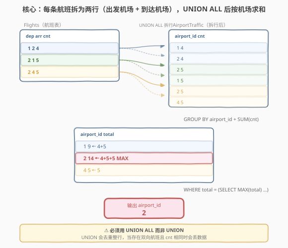
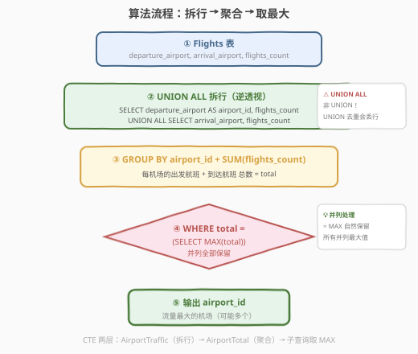
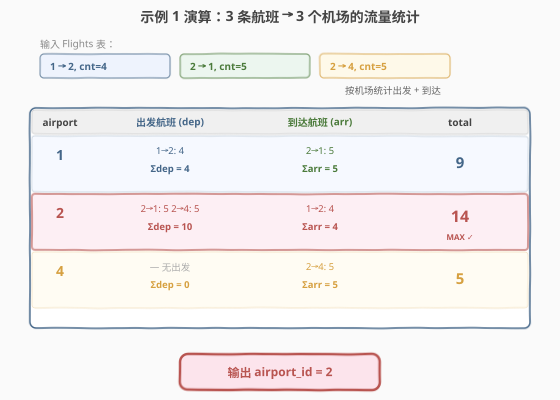

# 最繁忙的机场

- **题目名称**：最繁忙的机场
- **链接**：[2112. 最繁忙的机场 🔒](https://leetcode.cn/problems/the-airport-with-the-most-traffic/)
- **难度**：中等
- **标签**：数据库、SQL、`UNION ALL`、`GROUP BY`、`SUM`、聚合、子查询、窗口函数 `RANK()`、逆透视（UNPIVOT）、LeetCode 锁题

## 1. 题目概述

给定 `Flights`（航班）表，每行记录一条航线的出发机场、到达机场与航班数量。编写 SQL 查询，找出**客流量最大**的机场 ID。客流量 = 从该机场**起飞**的航班数 + **抵达**该机场的航班数。若有多个机场并列最大，全部返回，顺序不限。

**表结构**：

```text
Table: Flights
+-------------------+------+
| Column Name       | Type |
+-------------------+------+
| departure_airport | int  |  ← 出发机场
| arrival_airport   | int  |  ← 到达机场
| flights_count     | int  |  ← 航班数量
+-------------------+------+
(departure_airport, arrival_airport) 是该表的主键列。
每一行表示从 departure_airport 出发并到达 arrival_airport 的 flights_count 个航班。
```

**输出列**：`airport_id`。结果无顺序要求。

**示例 1**：

```text
输入：
Flights 表:
+-------------------+-----------------+---------------+
| departure_airport | arrival_airport | flights_count |
+-------------------+-----------------+---------------+
| 1                 | 2               | 4             |
| 2                 | 1               | 5             |
| 2                 | 4               | 5             |
+-------------------+-----------------+---------------+

输出：
+------------+
| airport_id |
+------------+
| 2          |
+------------+
```

**解释**：

| 机场 | 出发航班 $\sum$ | 到达航班 $\sum$ | 总流量 | 最大? |
|------|----------------|----------------|--------|-------|
| 1 | 4（1→2） | 5（2→1） | $9$ | |
| 2 | 10（2→1, 2→4） | 4（1→2） | $14$ | ✓ **MAX** |
| 4 | 0 | 5（2→4） | $5$ | |

**示例 2**：

```text
输入：
Flights 表:
+-------------------+-----------------+---------------+
| departure_airport | arrival_airport | flights_count |
+-------------------+-----------------+---------------+
| 1                 | 2               | 4             |
| 2                 | 1               | 5             |
| 3                 | 4               | 5             |
| 4                 | 3               | 4             |
| 5                 | 6               | 7             |
+-------------------+-----------------+---------------+

输出：
+------------+
| airport_id |
+------------+
| 1          |
| 2          |
| 3          |
| 4          |
+------------+
```

**解释**：

| 机场 | 出发 $\sum$ | 到达 $\sum$ | 总流量 | 最大? |
|------|------------|------------|--------|-------|
| 1 | 4 | 5 | $9$ | ✓ 并列 |
| 2 | 5 | 4 | $9$ | ✓ 并列 |
| 3 | 5 | 4 | $9$ | ✓ 并列 |
| 4 | 4 | 5 | $9$ | ✓ 并列 |
| 5 | 7 | 0 | $7$ | |
| 6 | 0 | 7 | $7$ | |

> 💡 本题是 SQL **"逆透视（UNPIVOT）+ 聚合取最值"招牌题**——核心难点在于：`Flights` 表的每行同时包含**两个机场**（出发 + 到达），而我们需要按**单个机场**维度统计流量。解法是把每行"拆"成两行（出发机场一行 + 到达机场一行），再用 `GROUP BY` 聚合。拆行用 `UNION ALL`，**绝不可用 `UNION`**（后者去重整行，双向航班相同 cnt 时会丢数据）。最后用子查询 `= MAX(total)` 自然处理并列。

---

## 2. 解题思路

### 2.1 暴力思路：逐机场枚举

最直觉的过程式思路：先收集所有出现过的机场 ID，对每个机场扫两遍 `Flights` 表——一遍累加以它为出发的 `flights_count`，一遍累加以它为到达的 `flights_count`，两者相加即为总流量。最后取最大值。伪代码：

```text
airports = set(all departure_airport) ∪ set(all arrival_airport)
traffic = {}
for a in airports:
    dep_sum = sum(f.cnt for f in Flights if f.departure_airport == a)
    arr_sum = sum(f.cnt for f in Flights if f.arrival_airport == a)
    traffic[a] = dep_sum + arr_sum
max_val = max(traffic.values())
return [a for a, v in traffic.items() if v == max_val]
```

逻辑正确，但 SQL 不擅长"逐行循环"。关键在于识别本题的结构：**每行航班同时关联两个机场，需要"拆行"后统一聚合**。

### 2.2 核心观察：UNION ALL 逆透视 + GROUP BY 聚合



**关键洞察**：`Flights` 表的每行有 `departure_airport` 和 `arrival_airport` 两列，但流量统计需要按**单一机场维度**聚合。这是一个经典的**逆透视（UNPIVOT）**场景：把一行中的两列"展开"为两行。

具体做法：

1. **拆行（UNION ALL）**：把 `Flights` 的每行拆成两行——
   - 一行取 `departure_airport` 作为 `airport_id`，携带 `flights_count`（出发贡献）；
   - 一行取 `arrival_airport` 作为 `airport_id`，携带 `flights_count`（到达贡献）。
   
   拆行后得到一张"长表" `AirportTraffic`，每行是 `(airport_id, flights_count)`，表示某机场的一次流量贡献。

2. **聚合（GROUP BY + SUM）**：对 `AirportTraffic` 按 `airport_id` 分组，`SUM(flights_count)` 即每机场的总流量。

3. **取最大（WHERE = 子查询 MAX）**：用子查询 `SELECT MAX(total)` 找到最大流量，`WHERE total = (SELECT MAX(total) …)` 筛出所有并列最大的机场。

> ⚠️ **必须用 `UNION ALL` 而非 `UNION`**：`UNION` 会对整行去重，当存在**双向航班且 `flights_count` 相同**时，拆行后会产生完全相同的两行 `(airport_id, cnt)`，`UNION` 会错误地只保留一行，导致流量少算。例如航班 `(1→2, cnt=5)` 和 `(2→1, cnt=5)` 拆行后都产生 `(1, 5)` 和 `(2, 5)`，`UNION` 去重后每机场只算一次 5 而非两次。`UNION ALL` 保留所有行，保证不丢数据。

> 💡 **"逆透视"思想**：本题的拆行操作本质上是把"宽表"（一行两个机场列）转为"长表"（一行一个机场列）。这在 SQL 中用 `UNION ALL` 实现，在 pandas 中用 `pd.concat` 或 `melt`，在 Power BI / Excel 中叫 UNPIVOT。这是处理"一行多实体"类统计问题的通用范式。

### 2.3 算法流程图



**逻辑执行步骤**：

| 步骤 | 操作 | 作用 |
|------|------|------|
| ① | `FROM Flights` | 读取航班表 |
| ② | `UNION ALL` 拆行 | 每行拆为出发机场行 + 到达机场行，得到长表 `AirportTraffic` |
| ③ | `GROUP BY airport_id` + `SUM(flights_count)` | 按机场聚合流量，得到 `AirportTotal` |
| ④ | `WHERE total = (SELECT MAX(total) FROM AirportTotal)` | 筛出流量最大的机场（并列全保留） |
| ⑤ | `SELECT airport_id` | 输出结果 |

> 💡 **SQL 子句执行顺序**：`FROM`（含 `UNION ALL`）→ `GROUP BY` → `HAVING` → `SELECT` → `WHERE`（子查询独立执行）。本题用 CTE 分层：先 `AirportTraffic`（拆行），再 `AirportTotal`（聚合），最后 `WHERE = MAX`（过滤）。CTE 使每步职责清晰。

### 2.4 示例演算

以示例 1 为例，观察"拆行 → 聚合 → 取最大"的逐步过程：



**步骤 ①：Flights 表（3 行）**

| departure_airport | arrival_airport | flights_count |
|-------------------|-----------------|---------------|
| 1 | 2 | 4 |
| 2 | 1 | 5 |
| 2 | 4 | 5 |

**步骤 ②：UNION ALL 拆行（3 行 → 6 行）**

| airport_id | flights_count | 来源 |
|------------|---------------|------|
| 1 | 4 | 航班 1→2 的出发 |
| 2 | 4 | 航班 1→2 的到达 |
| 2 | 5 | 航班 2→1 的出发 |
| 1 | 5 | 航班 2→1 的到达 |
| 2 | 5 | 航班 2→4 的出发 |
| 4 | 5 | 航班 2→4 的到达 |

> 每行航班拆成两行：出发机场拿走 `cnt`、到达机场也拿走 `cnt`。6 行即 3 航班 × 2 机场。

**步骤 ③：GROUP BY airport_id + SUM(flights_count)**

| airport_id | SUM(flights_count) | 计算明细 |
|------------|---------------------|---------|
| 1 | $9$ | $4 + 5$ |
| 2 | $14$ | $4 + 5 + 5$ |
| 4 | $5$ | $5$ |

**步骤 ④：WHERE total = MAX(total) = 14**

- 机场 1：$9 \neq 14$ → ✗
- 机场 2：$14 = 14$ → ✓ **输出**
- 机场 4：$5 \neq 14$ → ✗

最终输出 1 行：`airport_id = 2`，与示例一致。

> 💡 **示例 2 的并列处理**：示例 2 中机场 1/2/3/4 的总流量均为 $9$（最大），`WHERE total = (SELECT MAX(total))` 会**全部保留**这 4 行，而机场 5/6（流量 $7$）被滤掉。这正是用 `= MAX` 而非 `ORDER BY ... LIMIT 1` 的原因——后者只返回一个，漏掉并列。

---

## 3. 参考代码

### SQL（解法 A：UNION ALL + GROUP BY + 子查询 MAX，推荐）

```sql
WITH AirportTraffic AS (
    SELECT departure_airport AS airport_id, flights_count
    FROM Flights
    UNION ALL
    SELECT arrival_airport AS airport_id, flights_count
    FROM Flights
),
AirportTotal AS (
    SELECT airport_id, SUM(flights_count) AS total
    FROM AirportTraffic
    GROUP BY airport_id
)
SELECT airport_id
FROM AirportTotal
WHERE total = (SELECT MAX(total) FROM AirportTotal);
```

> 💡 **写法要点**：
> - **CTE 两层分工**：`AirportTraffic` 负责"拆行"（逆透视），`AirportTotal` 负责"聚合"（分组求和），最后 `WHERE` 负责"取最大"。职责分离，逻辑清晰。
> - **`UNION ALL`**：保留所有拆行结果，不去重。⚠️ **绝不换成 `UNION`**——当双向航班 `cnt` 相同时 `UNION` 去重整行会丢数据。
> - **`WHERE total = (SELECT MAX(total) FROM AirportTotal)`**：子查询独立求全局最大值，外层 `WHERE` 筛出所有等于最大值的行，**天然处理并列**。
> - ✓ **最推荐**：标准 SQL（MySQL / PostgreSQL / SQL Server 均支持），CTE 分层清晰，`UNION ALL` 保证正确性。

### SQL（解法 B：RANK() 窗口函数，现代写法）

```sql
WITH AirportTraffic AS (
    SELECT departure_airport AS airport_id, flights_count
    FROM Flights
    UNION ALL
    SELECT arrival_airport AS airport_id, flights_count
    FROM Flights
),
Ranked AS (
    SELECT airport_id,
           SUM(flights_count) AS total,
           RANK() OVER (ORDER BY SUM(flights_count) DESC) AS rnk
    FROM AirportTraffic
    GROUP BY airport_id
)
SELECT airport_id
FROM Ranked
WHERE rnk = 1;
```

> 💡 **解法 B 的思路**：用 `RANK() OVER (ORDER BY SUM(flights_count) DESC)` 对每机场的流量排名。`RANK()` 在并列时赋予相同名次（均为 1），因此 `WHERE rnk = 1` 天然筛出所有并列最大的机场。
>
> **与解法 A 的对比**：
> - **等价性**：两者结果完全相同。`RANK() = 1` 等价于 `total = MAX(total)`。
> - **写法**：解法 A 用子查询 `MAX`，解法 B 用窗口函数 `RANK`，都需要两层 CTE。解法 B 把"排名"和"过滤"合并在一层 CTE 中，少一层嵌套。
> - **可读性**：解法 A 的 `= MAX(total)` 语义更直白；解法 B 的 `RANK() = 1` 在需要"取前 N 名"时更自然（改 `rnk <= N` 即可）。
> - **兼容性**：`RANK()` 需 MySQL 8.0+；解法 A 的子查询 `MAX` 兼容 MySQL 5.7 及更早版本。

### SQL（解法 C：分别聚合出发 / 到达 + COALESCE 合并）

```sql
WITH Dep AS (
    SELECT departure_airport AS airport_id, SUM(flights_count) AS dep_cnt
    FROM Flights
    GROUP BY departure_airport
),
Arr AS (
    SELECT arrival_airport AS airport_id, SUM(flights_count) AS arr_cnt
    FROM Flights
    GROUP BY arrival_airport
),
AllAirports AS (
    SELECT airport_id FROM Dep
    UNION
    SELECT airport_id FROM Arr
),
Totals AS (
    SELECT a.airport_id,
           COALESCE(d.dep_cnt, 0) + COALESCE(r.arr_cnt, 0) AS total
    FROM AllAirports a
    LEFT JOIN Dep d USING (airport_id)
    LEFT JOIN Arr r USING (airport_id)
)
SELECT airport_id
FROM Totals
WHERE total = (SELECT MAX(total) FROM Totals);
```

> 💡 **解法 C 的思路**：不拆行，而是分别按 `departure_airport` 和 `arrival_airport` 各做一次 `GROUP BY + SUM`，再用 `LEFT JOIN` 合并两份结果。`COALESCE(..., 0)` 处理某机场只有出发或只有到达的情况（另一侧为 `NULL`）。
>
> **与解法 A/B 的对比**：
> - **思路差异**：解法 A/B 是"先拆行后聚合"（长表 → GROUP BY），解法 C 是"先聚合后合并"（两份分组结果 → JOIN）。两种思路等价但视角不同。
> - **复杂度**：解法 C 需要两次 `GROUP BY` + 两次 `LEFT JOIN`，代码更长；解法 A 一次 `UNION ALL` + 一次 `GROUP BY`，更简洁。
> - **何时用解法 C**：当出发和到达需要**分别计算不同指标**时（如出发均次、到达均次），分别聚合更灵活。本题只需总和，解法 A 更优。
> - **`AllAirports` 中的 `UNION`**（非 `UNION ALL`）是正确的——这里只是收集所有机场 ID 的集合，去重符合预期（每个机场只需出现一次）。

### Python（pandas）

```python
import pandas as pd

def airport_with_most_traffic(flights: pd.DataFrame) -> pd.DataFrame:
    dep = flights[['departure_airport', 'flights_count']].rename(
        columns={'departure_airport': 'airport_id'})
    arr = flights[['arrival_airport', 'flights_count']].rename(
        columns={'arrival_airport': 'airport_id'})
    traffic = pd.concat([dep, arr], ignore_index=True)
    total = traffic.groupby('airport_id', as_index=False)['flights_count'].sum()
    max_val = total['flights_count'].max()
    return total.loc[total['flights_count'] == max_val, ['airport_id']]
```

> 💡 **pandas 对照**：
> - `.rename(columns=...)` 把出发 / 到达列统一改名为 `airport_id`——对应 SQL 的 `SELECT departure_airport AS airport_id`。
> - `pd.concat([dep, arr])`——对应 `UNION ALL`（`concat` 默认不去重，等价于 `UNION ALL`）。
> - `.groupby('airport_id')['flights_count'].sum()`——对应 `GROUP BY airport_id` + `SUM(flights_count)`。
> - `total['flights_count'] == max_val`——对应 `WHERE total = (SELECT MAX(total))`，布尔索引天然保留所有并列行。

---

## 4. 复杂度分析

| 维度 | 解法 A（UNION ALL） | 解法 B（RANK） | 解法 C（分别聚合） | pandas |
|------|---------------------|----------------|---------------------|--------|
| **时间** | $O(n)$ | $O(n \log n)$ | $O(n)$ | $O(n)$ |
| **空间** | $O(n)$（CTE 物化） | $O(n)$ | $O(n)$ | $O(n)$ |
| **扫表次数** | 1 次 | 1 次 | 2 次（dep + arr） | 1 次 |
| **可读性** | ✓ 简洁 | ✓ 现代 | 分层多 | ✓ 清晰 |
| **推荐度** | ✓ **首选** | ✓ MySQL 8.0+ | ✓ 对照/灵活 | ✓ 验证用 |

> - $n$ = `Flights` 表行数。
> - **解法 A**：`UNION ALL` 产生 $2n$ 行长表，`GROUP BY` 哈希聚合 $O(n)$，子查询 `MAX` 线性扫一次 $O(k)$（$k$ = 机场数），总体线性。
> - **解法 B**：`RANK()` 需要对 $k$ 个机场排序 $O(k \log k)$，其余同 A。当 $k \ll n$ 时排序代价可忽略。
> - **解法 C**：两次 `GROUP BY` 各 $O(n)$，两次 `LEFT JOIN` $O(k)$，总体仍 $O(n)$，但常数更大。
> - **索引优化**：在 `departure_airport` 和 `arrival_airport` 上建索引可加速分组（索引有序扫描）；`UNION ALL` 无需去重，无需排序。

---

## 5. 扩展：UNION ALL vs UNION 的陷阱

### 5.1 为什么必须用 UNION ALL

`UNION` 和 `UNION ALL` 的唯一区别是：`UNION` 会对结果**整行去重**（相当于 `DISTINCT`），`UNION ALL` 保留所有行。

考虑以下场景：航班 `(1→2, cnt=5)` 和 `(2→1, cnt=5)` 都存在。拆行后：

| 来源 | airport_id | flights_count |
|------|------------|---------------|
| 1→2 出发 | 1 | 5 |
| 1→2 到达 | 2 | 5 |
| 2→1 出发 | 2 | 5 |
| 2→1 到达 | 1 | 5 |

`UNION` 去重后只剩 2 行 `(1,5)` 和 `(2,5)`，每机场流量 = 5。而正确答案应为每机场 $5 + 5 = 10$。`UNION ALL` 保留 4 行，每机场 $5 + 5 = 10$，正确。

> ⚠️ **口诀**：拆行用 `UNION ALL`，收集集合用 `UNION`。当拆行后各行可能完全相同时（双向航班同 cnt），必须用 `UNION ALL`。

### 5.2 逆透视（UNPIVOT）的多种写法

把一行多列"展开"为多行一列的操作叫**逆透视**，在不同环境中有不同写法：

| 环境 | 写法 | 备注 |
|------|------|------|
| MySQL / PostgreSQL | `UNION ALL` | 最通用，手动拼接 |
| SQL Server | `CROSS APPLY` / `UNPIVOT` 运算符 | 语法更简洁 |
| Oracle | `UNPIVOT` 子句 | 内置逆透视语法 |
| pandas | `pd.concat` / `melt()` | `concat` 拼接 / `melt` 宽转长 |

本题在 MySQL 环境下用 `UNION ALL` 最直接。若用 SQL Server，可写：

```sql
SELECT airport_id, SUM(flights_count) AS total
FROM Flights
UNPIVOT (flights_count FOR airport_id IN (departure_airport, arrival_airport)) u
GROUP BY airport_id
HAVING SUM(flights_count) = (
    SELECT MAX(total) FROM (
        SELECT SUM(flights_count) AS total
        FROM Flights
        UNPIVOT (flights_count FOR airport_id IN (departure_airport, arrival_airport)) u2
        GROUP BY airport_id
    ) m
);
```

> 💡 `UNPIVOT` 运算符把 `departure_airport` 和 `arrival_airport` 两列"展开"为两行，列名变为 `airport_id` 的值，对应数据保留在 `flights_count` 列。语义等价于 `UNION ALL`，但语法更声明式。

### 5.3 若题目改为"流量前 K 大的机场"

```sql
WITH AirportTraffic AS (
    SELECT departure_airport AS airport_id, flights_count FROM Flights
    UNION ALL
    SELECT arrival_airport AS airport_id, flights_count FROM Flights
)
SELECT airport_id
FROM (
    SELECT airport_id,
           SUM(flights_count) AS total,
           DENSE_RANK() OVER (ORDER BY SUM(flights_count) DESC) AS rnk
    FROM AirportTraffic
    GROUP BY airport_id
) t
WHERE rnk <= 3;
```

> 💡 用 `DENSE_RANK()`（而非 `RANK()`）更合适——`DENSE_RANK` 在并列时不跳号（1,1,2,3...），保证"前 3 名"恰好覆盖 3 个不同流量值。`RANK()` 在并列时会跳号（1,1,3,4...），可能漏掉第 3 名。

---

## 6. 面试要点

1. **为什么用 `UNION ALL` 而不是 `UNION`？**

   > `UNION` 会对整行去重，当存在双向航班（A→B 和 B→A）且 `flights_count` 相同时，拆行后会产生完全相同的两行 `(airport_id, cnt)`，`UNION` 只保留一行，导致流量少算。`UNION ALL` 保留所有行，保证每条航线的出发贡献和到达贡献都被计入。口诀：**拆行用 ALL，集合用 UNION**。

2. **如何处理"并列最大"的情况？**

   > 用 `WHERE total = (SELECT MAX(total) FROM AirportTotal)`——子查询求全局最大值，外层 `WHERE` 筛出所有等于最大值的行，天然保留所有并列。不可用 `ORDER BY total DESC LIMIT 1`（只返回一行，漏掉并列）。等价写法是用 `RANK() OVER (ORDER BY total DESC)` 取 `rnk = 1`。

3. **"逆透视"是什么？什么时候需要拆行？**

   > 逆透视（UNPIVOT）是把一行中的多列"展开"为多行，使每行只承载一个实体的数据。当一行同时包含**多个同类实体**（本题：一行含出发机场 + 到达机场两个机场），而需要按**单个实体维度**聚合时，必须先拆行再聚合。在 SQL 中用 `UNION ALL` 实现，在 pandas 中用 `pd.concat` 或 `melt`。

4. **解法 A（UNION ALL）和解法 C（分别聚合）有什么区别？**

   > 解法 A 是"先拆行后聚合"——把每行拆成出发机场行 + 到达机场行，统一 `GROUP BY` 一次搞定。解法 C 是"先聚合后合并"——分别按出发机场和到达机场各做一次 `GROUP BY + SUM`，再用 `LEFT JOIN` 合并两份结果。两者等价，但解法 A 只需一次 `GROUP BY`，更简洁；解法 C 在需要分别计算出发 / 到达不同指标时更灵活。

5. **如果只需要"流量最大的一个机场"（不要并列），怎么改？**

   > 加 `LIMIT 1`：`SELECT airport_id FROM AirportTotal ORDER BY total DESC LIMIT 1`。但题目要求并列全部返回，故用 `WHERE total = MAX` 而非 `LIMIT`。面试中要主动说明两者的区别——`LIMIT 1` 丢并列，`= MAX` 保留并列。

> 💡 **一句话总结**：2112 是 SQL **"UNION ALL 逆透视 + 聚合取最值"招牌题**——核心模板「`Flights` → `UNION ALL` 拆行（出发 + 到达）→ `GROUP BY airport_id` + `SUM` → `WHERE total = (SELECT MAX(total))`」。最大要点：**拆行用 `UNION ALL` 不用 `UNION`（双向同 cnt 会丢数据）；`= MAX` 天然处理并列（不用 `LIMIT 1`）**。

---

## 7. 同类练习题

- [1581. 进店却未进行过交易的顾客](https://leetcode.cn/problems/customer-who-visited-but-did-not-make-any-transactions/)（[题解](../1501-1600/1581_进店却未进行过交易的顾客.md)）：`LEFT JOIN` 反连接 + `GROUP BY` + `COUNT`，同为 SQL 聚合基础题（2112 的聚合维度是"拆行后的机场"，1581 是"进店记录"）
- [1254. 统计封闭岛屿的数目](https://leetcode.cn/problems/number-of-closed-islands/)：虽是图论题，但"从边界出发反向搜索"的思路与本题"拆行后双向统计"有类似的"双向展开"思想
- [1890. 2020 年最后一次登录](https://leetcode.cn/problems/the-latest-login-in-2020/)（[题解](../1801-1900/1890_2020年最后一次登录.md)）：`GROUP BY` + `MAX` 聚合取最值，2112 的"子查询 MAX"对照（1890 是每组 MAX，2112 是全局 MAX + 并列）
- [619. 只出现一次的最大数字](https://leetcode.cn/problems/biggest-single-number/)（[题解](../0601-0700/619_只出现一次的最大数字.md)）：`GROUP BY` + `HAVING COUNT = 1` + `MAX`，同为"聚合后取最值"骨架（619 是单表聚合，2112 多了 UNION ALL 拆行）
- [1070. 产品销售分析 III](https://leetcode.cn/problems/product-sales-analysis-iii/)：`GROUP BY` + `MIN` 取每组最值，巩固"分组聚合后过滤"范式（1070 是每组取最小，2112 是全局取最大 + 并列保留）
