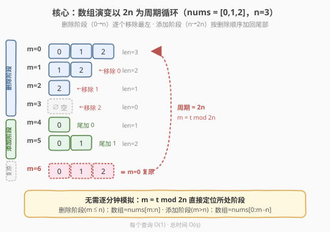
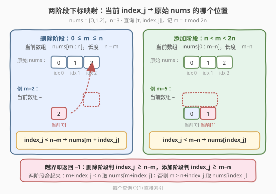
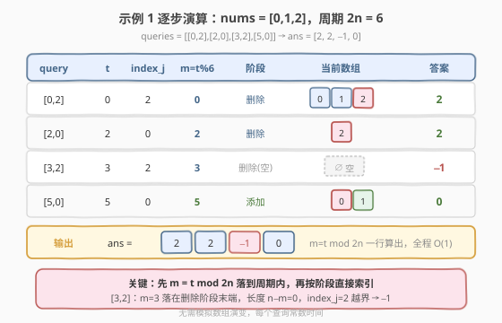

# LeetCode 查询删除和添加元素后的数组 题解

## 1. 题目概述

- **标题 / 题号**：查询删除和添加元素后的数组（#2113，medium）
- **链接**：https://leetcode.cn/problems/elements-in-array-after-removing-and-replacing-elements/
- **难度**：中等
- **标签**：数组、数学、取模

**题意**：给你一个**下标从 0 开始**的数组 `nums`。一开始（第 `0` 分钟）数组无变化。此后每过一分钟，数组的**最左边**的元素将被移除，直到数组为空；然后每过一分钟，数组的**尾部**将添加一个元素，添加顺序和删除顺序相同，直到数组被复原。此后上述操作**无限循环**进行。

例如 `nums = [0, 1, 2]`，数组按如下流程变化：

```text
[0,1,2] → [1,2] → [2] → [] → [0] → [0,1] → [0,1,2] → [1,2] → ...
```

再给一个长度为 `n` 的二维数组 `queries`，其中 `queries[j] = [time_j, index_j]`。第 `j` 个查询的答案定义如下：

- 若在时刻 `time_j`，`index_j < 当前数组长度`，答案是此时的当前数组第 `index_j` 个元素；
- 否则答案是 `-1`。

返回长度为 `n` 的整数数组 `ans`，`ans[j]` 为第 `j` 个查询的答案。

**示例 1**：

```text
输入：nums = [0,1,2], queries = [[0,2],[2,0],[3,2],[5,0]]
输出：[2,2,-1,0]
解释：
第 0 分钟: [0,1,2] —— 第 2 个元素是 2
第 2 分钟: [2]     —— 第 0 个元素是 2
第 3 分钟: []      —— 不存在第 2 个元素，返回 -1
第 5 分钟: [0,1]   —— 第 0 个元素是 0
```

**示例 2**：

```text
输入：nums = [2], queries = [[0,0],[1,0],[2,0],[3,0]]
输出：[2,-1,2,-1]
解释：
第 0 分钟: [2] → nums[0]=2
第 1 分钟: []  → -1
第 2 分钟: [2] → 2
第 3 分钟: []  → -1
```

**约束**：

- `1 <= nums.length <= 100`
- `0 <= nums[i] <= 100`
- `n == queries.length`
- `1 <= n <= 10^5`
- `queries[j].length == 2`
- `0 <= time_j <= 10^5`
- `0 <= index_j < nums.length`

## 2. 解题思路

记 `N = len(nums)`（数组原始长度），`q = len(queries)`（查询数）。

### 2.1 暴力思路：逐分钟模拟数组演变

最直白的做法是按时间推进，**真正维护一个会变长变短的数组**：用一个双端队列 `cur` 表示当前数组，从第 0 分钟起每过一分钟执行一次操作——前半周期从队头 `popleft`，后半周期往队尾 `append`。为了回答所有查询，把查询按 `time_j` 排序，在模拟到对应分钟时顺手读取 `cur[index_j]`。

```text
cur = deque(nums)
按 time_j 排序 queries，记下原序
minute = 0
for 每个查询 (time, idx, 原序) in 排序后:
    while minute < time:
        if minute < N:           # 删除阶段
            cur.popleft()
        elif minute < 2*N:       # 添加阶段
            cur.append(nums[minute - N])
        minute += 1
    ans[原序] = cur[idx] if idx < len(cur) else -1
```

复杂度：模拟最多推进到 `max(time_j)`，即 $O(\max t)$ 步，每步 $O(1)$；排序 $O(q \log q)$。本题 $\max t \le 10^5$、$q \le 10^5$，这其实能过。但它**完全没用到题目自带的结构**——演变是周期性的，每个查询其实可以 $O(1)$ 直接算出来。

> ⚠️ **更朴素的暴力是 $O(q \cdot \max t)$**：对每个查询独立从第 0 分钟模拟到 `time_j`。$10^5 \times 10^5 = 10^{10}$ 必然超时。即便用"排序 + 单调推进"优化到 $O(\max t)$，也仍要真正搬动数组元素，常数和实现复杂度都偏高。

### 2.2 核心观察：演变以 $2N$ 为周期，取模即可定位



把 `nums = [0,1,2]` 的演变按分钟展开，会看到一个非常规整的周期：

| 分钟 `m` | 当前数组 | 长度 | 所属阶段 |
|----------|----------|------|----------|
| 0 | `[0,1,2]` | 3 | 删除阶段 |
| 1 | `[1,2]` | 2 | 删除阶段 |
| 2 | `[2]` | 1 | 删除阶段 |
| 3 | `[]` | 0 | 删除阶段末端 |
| 4 | `[0]` | 1 | 添加阶段 |
| 5 | `[0,1]` | 2 | 添加阶段 |
| 6 | `[0,1,2]` | 3 | ≡ 第 0 分钟 |

三个关键观察：

1. **周期为 $2N$**：$N$ 分钟把所有元素删完，再用 $N$ 分钟按原顺序加回来，第 $2N$ 分钟数组复原为 `nums`，之后无限循环。因此任意时刻的状态完全由 $m = t \bmod 2N$ 决定。
2. **删除阶段（$0 \le m \le N$）**：当前数组恰为 `nums[m : N]`（左端切掉 `m` 个），长度 $N - m$。
3. **添加阶段（$N < m < 2N$）**：当前数组恰为 `nums[0 : m - N]`（左端加了 `m - N` 个），长度 $m - N$。

> 💡 **为什么是切片而不是随便搬动？** 删除阶段每次移除的是"当前最左"，等价于把原始 `nums` 的左边界整体右移一位——所以第 `m` 分钟剩下的恰好是 `nums[m:N]`。添加阶段每次往尾部加的元素，按题意"添加顺序和删除顺序相同"，即依次加回 `nums[0], nums[1], ...`，所以第 $m$ 分钟（$m > N$）已加回的就是 `nums[0 : m - N]`。两阶段都是 `nums` 的一个**前缀/后缀切片**，无需真正搬运。

### 2.3 下标映射：当前 `index_j` → 原始 `nums` 的哪一位



知道了当前数组是 `nums` 的哪段切片，把"当前数组的第 `index_j` 位"翻译回"原始 `nums` 的第几位"就只是切片内的偏移：

- **删除阶段**（`0 ≤ m ≤ N`）：当前数组 = `nums[m : N]`，故当前第 `index_j` 位 = `nums[m + index_j]`，要求 `index_j < N - m`（即 `m + index_j < N`），否则越界返回 `-1`。
- **添加阶段**（`N < m < 2N`）：当前数组 = `nums[0 : m - N]`，故当前第 `index_j` 位 = `nums[index_j]`，要求 `index_j < m - N`（即 `m > N + index_j`），否则越界返回 `-1`。

两条分支可以合并成一个判定（见第 5 节扩展），但分成两阶段写最直观、最不容易写错边界。

### 2.4 示例演算

以示例 1 `nums = [0,1,2]`（$N=3$，周期 $2N=6$）逐步演算四个查询：



- `[0,2]`：$m = 0 \bmod 6 = 0$，删除阶段，`m + index_j = 0 + 2 = 2 < 3` ✓ → `nums[2] = 2`
- `[2,0]`：$m = 2 \bmod 6 = 2$，删除阶段，`2 + 0 = 2 < 3` ✓ → `nums[2] = 2`
- `[3,2]`：$m = 3 \bmod 6 = 3$，删除阶段末端，`3 + 2 = 5 ≥ 3` ✗，长度为 0 → `-1`
- `[5,0]`：$m = 5 \bmod 6 = 5$，添加阶段，`5 > 3 + 0 = 3` ✓ → `nums[0] = 0`

最终 `ans = [2, 2, -1, 0]`，与示例一致。

## 3. 参考代码

### C++（取模 + 两阶段直接索引）

```cpp
class Solution {
  public:
    vector<int> elementInNums(vector<int>& nums, vector<vector<int>>& queries) {
        int N = nums.size();
        int period = 2 * N;
        vector<int> ans;
        ans.reserve(queries.size());
        for (const auto& q : queries) {
            int t = q[0], idx = q[1];
            int m = t % period;          // 落到周期内
            int val = -1;
            if (m <= N) {                // 删除阶段：当前数组 = nums[m:N]
                if (m + idx < N) {
                    val = nums[m + idx];
                }
            } else {                     // 添加阶段：当前数组 = nums[0:m-N]
                if (idx < m - N) {
                    val = nums[idx];
                }
            }
            ans.push_back(val);
        }
        return ans;
    }
};
```

### Python

```python
class Solution:
    def elementInNums(self, nums: List[int], queries: List[List[int]]) -> List[int]:
        N = len(nums)
        period = 2 * N
        ans = []
        for t, idx in queries:
            m = t % period
            if m <= N:                       # 删除阶段：nums[m:N]
                val = nums[m + idx] if m + idx < N else -1
            else:                            # 添加阶段：nums[0:m-N]
                val = nums[idx] if idx < m - N else -1
            ans.append(val)
        return ans
```

> 💡 **边界统一用"加法比较"更稳**：删除阶段判 `m + idx < N` 而非 `idx < N - m`，避免任何关于 `N - m` 为 0/负数的歧义；添加阶段判 `idx < m - N`，由于进入此分支时 `m > N`，`m - N` 恒正，无需特判。`m == N` 归入删除阶段，此时 `N - m = 0`，任何 `idx ≥ 0` 都越界返回 `-1`，与"数组为空"语义一致。

## 4. 复杂度分析

| 维度 | 复杂度 | 说明 |
|------|--------|------|
| 时间复杂度 | $O(q)$ | 每个查询只做一次取模 + 一次数组下标访问，共 $q$ 个查询 |
| 空间复杂度 | $O(1)$ | 仅用常数个整型变量（不计返回的 `ans` 数组） |

> 💡 对比暴力逐分钟模拟的 $O(\max t + q \log q)$，取模法把"时间维度"完全压缩：不再依赖 `time_j` 的大小，只与查询个数 $q$ 线性相关。即使题目把 `time_j` 放大到 $10^9$，本解法依然 $O(q)$。

## 5. 扩展：两阶段判定合并为一个表达式

仔细观察两条分支的越界条件，会发现它们其实覆盖了 $m$ 的不同区间，可以合并成一组**统一的充要条件**：

$$
\text{ans} = \begin{cases}
\text{nums}[m + \text{idx}] & \text{若 } m + \text{idx} < N \quad(\text{删除阶段且未越界}) \\
\text{nums}[\text{idx}] & \text{若 } m > N + \text{idx} \quad(\text{添加阶段且未越界}) \\
-1 & \text{否则}
\end{cases}
$$

为什么这两个条件**互斥且覆盖所有有效情形**？

- `m + idx < N` 成立时，由于 `idx ≥ 0`，必有 `m < N`，即处于删除阶段，自动排除添加阶段。
- `m > N + idx` 成立时，由于 `idx ≥ 0`，必有 `m > N`，即处于添加阶段，自动排除删除阶段。
- 两者都不满足时（例如 `m` 落在"删除阶段末端已越界"或"添加阶段尚未加到该位"），返回 `-1`。

对应代码可以写成：

```python
m = t % (2 * N)
if m + idx < N:
    val = nums[m + idx]
elif m > N + idx:
    val = nums[idx]
else:
    val = -1
```

这种写法更紧凑，但可读性略低于"先判阶段再判越界"的两分支版本。**面试时建议先写两阶段版本讲清思路，再点出可合并作为优化**——既展示了对边界的把握，又体现了化简能力。

> ⚠️ **不要写成 `m < N` 时取 `nums[m+idx]`、`m >= N` 时取 `nums[idx]`**：这样会漏掉越界判定，在删除阶段末端（`m` 接近 `N`）和添加阶段初期（`m` 略大于 `N`）访问到不存在的元素。**阶段判定和越界判定缺一不可**。

## 6. 面试要点

1. **为什么周期是 $2N$ 而不是 $N$？**

   - 前 $N$ 分钟把 $N$ 个元素依次删完（第 $N$ 分钟为空），后 $N$ 分钟又把这 $N$ 个元素按原顺序依次加回（第 $2N$ 分钟复原）。一个完整的"清空—复原"循环长度恰好是 $N + N = 2N$。只看删除或只看添加都会漏掉另一半。

2. **`m == N` 归到哪个阶段？此时数组是什么？**

   - 归到删除阶段。第 $N$ 分钟刚把最后一个元素删掉，数组为空，长度 $N - m = 0$。任何 `index_j ≥ 0` 都越界，返回 `-1`。若把它错归到添加阶段，会以为长度 `m - N = 0`，结论恰好一致，但语义上"刚删完"属于删除阶段更自然，且能与 `m <= N` 的分支统一。

3. **取模法为什么比模拟法快？关键利用了什么性质？**

   - 利用了演变的**周期性 + 切片性**：状态由 $m = t \bmod 2N$ 唯一决定，且每个 $m$ 对应的当前数组就是 `nums` 的一个前缀或后缀切片。这样把"沿时间轴推进"换成了"对周期取模 + 一次下标运算"，时间从依赖 $\max t$ 降到只依赖查询数 $q$。

4. **如果 `time_j` 可以为负或非常大（$10^{18}$），解法还成立吗？**

   - 成立。取模运算对任意非负整数都有效，$10^{18}$ 也在 64 位整数范围内。本题 `time_j ≥ 0`，无需处理负数取模的语言差异；若变体允许负时间，需统一用 `(t % period + period) % period` 规整到 $[0, 2N)$。

5. **为什么添加阶段是 `nums[0 : m-N]` 而不是别的顺序？**

   - 题目明确"添加顺序和删除顺序相同"。删除阶段是按 `nums[0], nums[1], ..., nums[N-1]` 的顺序移除的，所以加回时也按这个顺序依次 `append` 到尾部。第 $m$ 分钟（$m > N$）已经加回了前 $m - N$ 个，即 `nums[0], ..., nums[m-N-1]`，正好是切片 `nums[0 : m-N]`。

## 同类练习题

| # | 题目 | 与本题的关联 |
|---|------|-------------|
| 3282 | [到达数组末尾的最大能量](https://leetcode.cn/problems/reach-end-of-array-with-max-score/) | 同样是"别被时间步长绑架"的思路——观察结构后用数学/指针直接算，跳过朴素模拟 |
| 189 | [轮转数组](https://leetcode.cn/problems/rotate-array/) | 用 $k \bmod n$ 把"轮转 $k$ 次"压缩为一次切片重组，与本题"取模落到周期内"如出一辙 |
| 2259 | [移除指定数字得到的最大整数字符串](https://leetcode.cn/problems/remove-digit-from-number-to-maximize-result/) | 在字符串/数组上做"移除"操作并查询结果，对照本题"移除阶段切片"视角 |
| 289 | [生命游戏](https://leetcode.cn/problems/game-of-life/) | 状态随时间周期性演变，需要识别周期/不变量以避免无限模拟（周期识别思想的本题近邻） |
| 54 | [螺旋矩阵](https://leetcode.cn/problems/spiral-matrix/) | 按"阶段"（方向/边界）分段处理索引，与本题"删除/添加两阶段分段索引"同构 |
