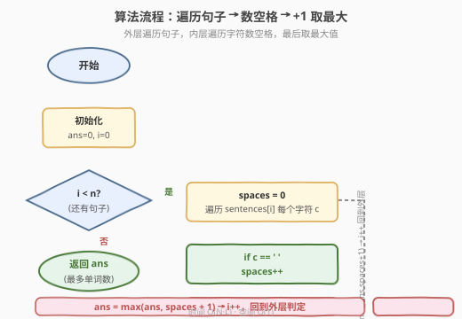

# LeetCode 句子中的最多单词数 题解

## 1. 题目概述

- **标题 / 题号**：句子中的最多单词数（#2114，easy）
- **链接**：https://leetcode.cn/problems/maximum-number-of-words-found-in-sentences/
- **难度**：简单
- **标签**：数组、字符串

**题意**：一个**句子**由一些**单词**以及它们之间的单个空格组成，句子的开头和结尾不会有多余空格。

给你一个字符串数组 `sentences`，其中 `sentences[i]` 表示单个**句子**。请返回单个句子里**单词的最多数目**。

**示例 1**：

```text
输入：sentences = ["alice and bob love leetcode", "i think so too", "this is great thanks very much"]
输出：6
解释：
- 第一个句子 "alice and bob love leetcode" 共 5 个单词。
- 第二个句子 "i think so too" 共 4 个单词。
- 第三个句子 "this is great thanks very much" 共 6 个单词。
所以最多单词数为 6（第三个句子）。
```

**示例 2**：

```text
输入：sentences = ["please wait", "continue to fight", "continue to win"]
输出：3
解释：第二个与第三个句子都有 3 个单词，并列最多。
```

**约束**：

- `1 <= sentences.length <= 100`
- `1 <= sentences[i].length <= 100`
- `sentences[i]` 只包含小写英文字母和 `' '`
- `sentences[i]` 的开头和结尾都没有空格
- `sentences[i]` 中所有单词由**单个空格**隔开

> 💡 本题的关键约束是「**单词由单个空格隔开，且无首尾空格**」。这意味着空格与单词之间有确定的对应关系：每个空格都是两个相邻单词的分隔符。抓住这一点，就能把"数单词"转化为"数空格"，避免任何切分与存储。

## 2. 解题思路

### 2.1 暴力思路：切分句子数单词

最直觉的做法是「按空格切分每个句子，取切分后列表的长度」：

- **Python**：`s.split()` 或 `s.split(' ')`，对每个句子得到单词列表，`len()` 即单词数，最后取所有句子的最大值。
- **C++**：可用 `istringstream >> word` 逐词读取计数，或手动按空格切分存入 `vector` 再取大小。

这种写法正确且直观，但会**创建中间单词列表**，空间复杂度为 $O(L)$（$L$ 为单个句子的长度，存储切分出的字符串副本）。而且切分本身需要遍历整个句子、拷贝子串，常数较大。题目只问"最多单词数"，并不需要这些单词本身——**存储它们纯属浪费**。

### 2.2 核心观察：单词数 = 空格数 + 1


关键直觉来自题目的两个保证：

1. **单词之间恰好一个空格**：每个空格都是两个相邻单词的分隔符，没有连续空格。
2. **无首尾空格**：首字符和末字符都是字母，不存在"虚空格"。

在这两个保证下，空格数与单词数有**精确的线性关系**：

$$\text{单词数} = \text{空格数} + 1$$

> 💡 **为什么是 $+1$？** 把 $n$ 个单词排成一行，相邻单词之间恰好需要 $n - 1$ 个空格作为分隔符。因此空格数 $= \text{单词数} - 1$，反过来即单词数 $= \text{空格数} + 1$。$n = 1$（单词句）时空格数为 0，$0 + 1 = 1$ 仍然成立——边界自然兼容，无需特判。

于是算法变得极简：对每个句子数一遍空格，加 1 即单词数；对所有句子取最大值即可。**无需切分、无需存储单词**，只维护一个计数变量。

> ⚠️ **此关系依赖题目保证的"单空格 + 无首尾空格"**。若改成"任意多个空格分隔"（如 [58. 最后一个单词的长度](../0001-0100/58_最后一个单词的长度.md) 的输入形态），`空格数 + 1` 就不再成立，必须用 `split()` 或扫描法处理连续空格。本题的简洁性完全来自约束。

### 2.3 算法流程图



流程是双层循环 + 一次取最大：外层遍历 `sentences` 中每个句子，内层遍历句子字符数空格；每个句子算出 `spaces + 1` 后更新全局最大值 `ans`。

### 2.4 示例演算

![示例演算：sentences = ["alice and bob love leetcode", ...]](../images/2114_example_walkthrough.svg)

以示例 1 的三个句子逐步演算：

- **句子 1** `"alice and bob love leetcode"`：空格出现在 `alice|and|bob|love|leetcode` 之间，共 **4** 个 → 单词数 $4 + 1 = 5$。
- **句子 2** `"i think so too"`：空格共 **3** 个 → 单词数 $3 + 1 = 4$。
- **句子 3** `"this is great thanks very much"`：空格共 **5** 个 → 单词数 $5 + 1 = 6$。

三者取最大 → $\max(5, 4, 6) = 6$，即答案。

> 💡 注意单词数恰好等于"句子里的空格位置数 + 1"。数空格只需一次线性扫描，不需要任何字符串拷贝。

## 3. 参考代码

### C++（数空格，原地 O(1) 空间）

```cpp
class Solution {
  public:
    int mostWordsFound(vector<string>& sentences) {
        int ans = 0;
        for (const string& s : sentences) {
            int spaces = 0;
            for (char c : s) {
                if (c == ' ') ++spaces;
            }
            ans = max(ans, spaces + 1);
        }
        return ans;
    }
};
```

### Python（数空格，一行流）

```python
class Solution:
    def mostWordsFound(self, sentences: List[str]) -> int:
        return max(s.count(' ') + 1 for s in sentences)
```

### Python（split 写法，对比用）

```python
class Solution:
    def mostWordsFound(self, sentences: List[str]) -> int:
        return max(len(s.split()) for s in sentences)
```

> ⚠️ **两种写法的对比**：`split()` 写法依赖题目保证的"单空格分隔"——`s.split()` 会合并任意连续空格，因此即使输入有多个空格也正确；而 `s.count(' ') + 1` **严格依赖单空格约束**，若输入变体允许多空格则会出错。本题约束下两者都对，但 `count(' ')` 空间为 $O(1)$、常数更小，是更贴合题意的解法。面试时建议先写数空格，再提及 `split()` 作为对照。

## 4. 复杂度分析

| 维度 | 复杂度 | 说明 |
|------|--------|------|
| 时间复杂度 | $O(N \cdot L)$ | $N$ 为句子数（$\le 100$），$L$ 为单句平均长度（$\le 100$）；对每个句子线性扫描一遍数空格 |
| 空间复杂度 | $O(1)$ | 仅维护 `ans` 与 `spaces` 两个计数变量，原地扫描，不存储任何单词 |

> 💡 相比 `split()` 写法的 $O(L)$ 空间（存储单词列表），数空格法把空间压到 $O(1)$，且避免了子串拷贝。数据规模 $N, L \le 100$ 极小，两种写法性能差异在工程上可忽略，但数空格法更体现对题目约束的利用。

## 5. 扩展：约束如何决定解法

本题的简洁性完全来自题目对输入的强约束。把约束逐条放松，会得到不同的解法形态，是理解"为什么能用 $O(1)$ 空间"的好抓手：

| 约束放松 | 输入形态变化 | `空格数+1` 是否成立 | 应对解法 |
|----------|------------|-------------------|---------|
| 严格按本题约束 | 单空格 + 无首尾空格 | ✅ 成立 | 直接 `count(' ') + 1` |
| 允许连续空格 | 单词间可能多空格 | ❌ 不成立（多空格会重复计数） | 用 `s.split()` 合并连续空格，或扫描时去重 |
| 允许首尾空格 | 句子前后可能有空格 | ❌ 不成立（首尾空格非分隔符） | 先 `strip()` 或扫描跳过首尾空格 |
| 一般字符串 | 任意空格分布 | ❌ 不成立 | [58. 最后一个单词的长度](../0001-0100/58_最后一个单词的长度.md) 的从右向左扫描法 |

> 💡 **方法论**：看到字符串计数题，先看输入的"空格结构"——单空格还是多空格、有无首尾空格。结构越规整，越能直接用计数；结构越松散，越需要扫描或 `split` 处理。本题是"规整结构 → 计数"的极致简化形态。

## 6. 面试要点

1. **为什么单词数等于空格数加 1？**

   - $n$ 个单词排成一行，相邻单词之间恰好需要 $n - 1$ 个分隔空格。因此空格数 $= \text{单词数} - 1$，反过来即单词数 $= \text{空格数} + 1$。这个关系要求"单词间恰好一个空格且无首尾空格"，是题目约束的直接推论。

2. **如果输入可能有连续空格或首尾空格怎么办？**

   - `空格数 + 1` 不再成立：连续空格会让空格数虚高，首尾空格是非分隔符空格。此时应改用 `s.split()`（自动合并连续空格并去首尾）或手动扫描跳过多余空格。本题的简洁完全依赖约束。

3. **`count(' ')` 和 `split()` 哪个更好？**

   - 本题约束下两者都对。`count(' ')` 时间 $O(L)$、空间 $O(1)$、常数小；`split()` 时间 $O(L)$、空间 $O(L)$（存储单词列表）。面试建议先写 `count(' ')` 体现对约束的利用，再提 `split()` 作为对照。工程脚本中 `split()` 更稳健（能容忍输入不规范）。

4. **为什么不用正则或状态机？**

   - 杀鸡用牛刀。题目保证单空格分隔，空格字符与分隔符一一对应，一个 `== ' '` 判定就够了。正则或状态机适用于分隔符不规则、需多状态切换的场景（如 [8. 字符串转换整数 (atoi)](../0001-0100/8_字符串转换整数atoi.md)、[65. 有效数字](../0001-0100/65_有效数字.md)）。

5. **能否不遍历整个句子就得到单词数？**

   - 不能。空格可能出现在句子任意位置，必须扫描全句才能数完。但可以边读边数，无需回头或存储——这是流式 $O(1)$ 空间的优势。若句子已预处理为某种索引结构（如记录所有空格位置），可 $O(\log)$ 查询，但预处理本身仍是 $O(L)$。

## 同类练习题

| # | 题目 | 与本题的关联 |
|---|------|-------------|
| 58 | [最后一个单词的长度](https://leetcode.cn/problems/length-of-last-word/)（[站内题解](../0001-0100/58_最后一个单词的长度.md)） | 字符串中数单词的姊妹题，但输入允许任意空格分布，需从右向左扫描跳过尾随空格——对照本题"约束决定解法" |
| 151 | [反转字符串中的单词](https://leetcode.cn/problems/reverse-words-in-a-string/) | 处理任意空格分布的字符串，需切分 + 去多余空格 + 反转，是本题约束放松后的进阶形态 |
| 434 | [字符串中的单词数](https://leetcode.cn/problems/number-of-segments-in-a-string/) | 统计字符串中的单词段数，输入可能有连续空格，`空格数+1` 不成立，需扫描判定单词起点 |
| 2042 | [检查句子中的数字是否严格递增](https://leetcode.cn/problems/check-if-numbers-are-ascending-in-a-sentence/) | 同为"单空格分隔句子"结构，按空格切分后逐段处理，复用本题的句子结构假设 |
| 1816 | [截断句子](https://leetcode.cn/problems/truncate-sentence/) | 在单空格分隔的句子中按前 k 个单词截断，同样依赖"单空格分隔"约束，是本题结构的另一应用 |
