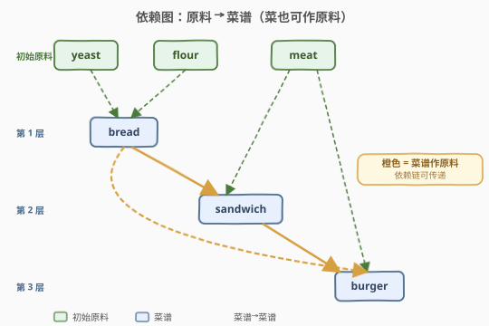
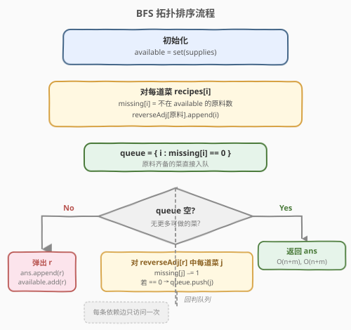
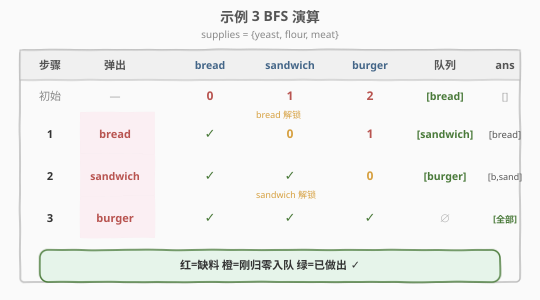

# LeetCode 从给定原材料中找到所有可以做出的菜 题解

## 1. 题目概述

- **标题 / 题号**：从给定原材料中找到所有可以做出的菜（#2115，medium）
- **链接**：https://leetcode.cn/problems/find-all-possible-recipes-from-given-supplies/
- **难度**：中等
- **标签**：图、拓扑排序、广度优先搜索、哈希表

**题意**：你有 `n` 道不同的菜。给定字符串数组 `recipes` 和二维字符串数组 `ingredients`，第 `i` 道菜名为 `recipes[i]`，所需全部原料为 `ingredients[i]`。**一道菜也可以是另一道菜的原料**——即 `ingredients[i]` 中可能包含 `recipes` 里的另一个字符串。再给你初始拥有的原料数组 `supplies`（每种无限多）。返回你能做出的所有菜，顺序任意。

> ⚠️ 两道菜可能在原料中**互相包含**（形成环），此时两道菜都做不出来。

**示例 1**：

```text
输入：recipes = ["bread"], ingredients = [["yeast","flour"]], supplies = ["yeast","flour","corn"]
输出：["bread"]
解释：原料 "yeast" 和 "flour" 都在初始 supplies 中，可以直接做出 bread。
```

**示例 2**：

```text
输入：recipes = ["bread","sandwich"], ingredients = [["yeast","flour"],["bread","meat"]], supplies = ["yeast","flour","meat"]
输出：["bread","sandwich"]
解释：bread 原料齐备可直接做；sandwich 需要 bread（已做出）和 meat（初始有），故也能做。
```

**示例 3**：

```text
输入：recipes = ["bread","sandwich","burger"], ingredients = [["yeast","flour"],["bread","meat"],["sandwich","meat","bread"]], supplies = ["yeast","flour","meat"]
输出：["bread","sandwich","burger"]
解释：bread → sandwich → burger 逐级解锁。
```

**示例 4**：

```text
输入：recipes = ["bread"], ingredients = [["yeast","flour"]], supplies = ["yeast"]
输出：[]
解释：缺少 "flour"，bread 永远做不出来。
```

**约束**：

- $n == \text{recipes.length} == \text{ingredients.length}$
- $1 \leq n \leq 100$
- $1 \leq \text{ingredients}[i].\text{length},\; \text{supplies.length} \leq 100$
- $1 \leq \text{recipes}[i].\text{length},\; \text{ingredients}[i][j].\text{length},\; \text{supplies}[k].\text{length} \leq 10$
- `recipes[i]`、`ingredients[i][j]`、`supplies[k]` 只含小写英文字母
- `recipes` 和 `supplies` 中的值互不相同；`ingredients[i]` 内部字符串互不相同

## 2. 解题思路

### 2.1 暴力思路

最朴素的做法是**反复扫描**：每轮遍历所有菜，挑出"原料全部可获取"的菜标记为已做出，重复直到某轮无新增。每轮 $O(n \cdot m)$（$m$ 为平均原料数），最多 $n$ 轮，总复杂度 $O(n^2 \cdot m)$。对于 $n \leq 100$ 能过，但每轮都把已做出的菜重新检查了一遍，浪费。

优化方向：用**入度 + 队列**，只在某道菜的"缺料数"恰好降为 0 时才把它入队——这就是 Kahn 拓扑排序，复杂度降到 $O(n \cdot m)$。

### 2.2 核心观察：拓扑排序（Kahn / BFS）



关键直觉：

- 把每道菜看作图中的一个节点，它的**入度 = 不在初始 supplies 中的原料个数**（即"还缺几个原料"）。
- 初始 supplies 是天然的"入度 0 源点"——它们已就绪，不需要再等任何原料。
- 一道菜的全部原料就绪（缺料数归零）时，它就可以被做出；做出后，它本身又变成可用原料，去解锁依赖它的其它菜。
- 像**剥洋葱**一样一层层解锁：
  - 若某道菜最终缺料数没归零 → 它依赖的某个原料既不在 supplies、也不是可做出的菜（甚至可能在环里），永远做不出来。
  - 只有被 BFS 流程解锁的菜才进入答案。

> 💡 一句话：**把 supplies 当作入度 0 的源点，菜谱当节点，"缺料数"当入度，BFS 逐层解锁**。这正是 [207. 课程表](../0201-0300/207_课程表.md) Kahn 算法的变体——区别仅在于"入度"从"前置课程数"换成了"不在初始库存中的原料数"。

### 2.3 建图细节

直接套 Kahn 模板，但有两个适配点：

1. **入度的定义**：对菜 `recipes[i]`，扫描它的原料 `ingredients[i]`，只统计**不在 `supplies` 集合中**的原料数作为 `missing[i]`。已在 supplies 中的原料不贡献入度（它们一开始就可用）。
2. **反向邻接表**：对每个**不在 supplies 中**的原料 `ing`，记录"哪些菜需要它"——`reverseAdj[ing] = [菜的下标...]`。当 `ing` 变为可用（某道菜被做出，或本来是 supply）时，把这些菜的 `missing` 各减 1。

> ⚠️ **为什么只对"不在 supplies 中"的原料建反向边？** 因为 supplies 一开始就可用，对应的入度已记为 0，无需等待触发。若对它们也建边，BFS 初始就要遍历所有 supplies 去触发减法——逻辑上可行但多走一遍，不如直接在初始化时把供应品原料排除。

### 2.4 算法流程图



流程只有一重 `while`，每道菜至多入队出队各一次，每条依赖边（原料→菜）只在触发减法时被访问一次，因此总时间 $O(n \cdot m)$。

### 2.5 示例演算

以示例 3 为例：`recipes = ["bread","sandwich","burger"]`，`ingredients = [["yeast","flour"],["bread","meat"],["sandwich","meat","bread"]]`，`supplies = ["yeast","flour","meat"]`。



| 步骤 | 弹出 | missing[bread, sandwich, burger] | 队列 | ans |
|------|------|----------------------------------|------|-----|
| 初始 | — | 0, 1, 2 | `[bread]` | `[]` |
| 1 | bread | ✓, **0**, 1 | `[sandwich]` | `[bread]` |
| 2 | sandwich | ✓, ✓, **0** | `[burger]` | `[bread, sandwich]` |
| 3 | burger | ✓, ✓, ✓ | `∅` | `[bread, sandwich, burger]` |

**初始**：`available = {yeast, flour, meat}`。bread 的原料 yeast/flour 都在 supplies 中 → `missing[bread]=0`；sandwich 缺 bread → `missing=1`；burger 缺 sandwich、bread → `missing=2`。`reverseAdj[bread]=[sandwich, burger]`，`reverseAdj[sandwich]=[burger]`。

**步骤 1**：弹出 bread，加入 ans。`available += {bread}`。`reverseAdj[bread]` 中的 sandwich 的 `missing 1→0`（入队）、burger 的 `missing 2→1`。

**步骤 2**：弹出 sandwich，加入 ans。`available += {sandwich}`。`reverseAdj[sandwich]` 中的 burger `missing 1→0`（入队）。

**步骤 3**：弹出 burger，加入 ans。无菜依赖 burger，队列空，结束。返回 `[bread, sandwich, burger]`。

> 💡 若两道菜**互相依赖**（如 A 需要 B、B 需要 A），则两者 `missing` 都 ≥1 且永远等不到对方解锁，BFS 不会把它们入队——天然处理了环。

## 3. 参考代码

### C++

```cpp
class Solution {
public:
    vector<string> findAllRecipes(vector<string>& recipes,
                                  vector<vector<string>>& ingredients,
                                  vector<string>& supplies) {
        unordered_set<string> available(supplies.begin(), supplies.end());
        unordered_map<string, vector<int>> reverseAdj;
        vector<int> missing(recipes.size());

        for (int i = 0; i < (int)recipes.size(); i++) {
            int cnt = 0;
            for (const string& ing : ingredients[i]) {
                if (!available.count(ing)) {
                    cnt++;
                    reverseAdj[ing].push_back(i);
                }
            }
            missing[i] = cnt;
        }

        queue<int> q;
        for (int i = 0; i < (int)recipes.size(); i++) {
            if (missing[i] == 0) q.push(i);
        }

        vector<string> ans;
        while (!q.empty()) {
            int i = q.front(); q.pop();
            ans.push_back(recipes[i]);
            available.insert(recipes[i]);
            for (int j : reverseAdj[recipes[i]]) {
                if (--missing[j] == 0) q.push(j);
            }
        }
        return ans;
    }
};
```

### Python

```python
class Solution:
    def findAllRecipes(self, recipes: List[str], ingredients: List[List[str]], supplies: List[str]) -> List[str]:
        available = set(supplies)
        reverse_adj = defaultdict(list)
        missing = [0] * len(recipes)

        for i, ings in enumerate(ingredients):
            cnt = 0
            for ing in ings:
                if ing not in available:
                    cnt += 1
                    reverse_adj[ing].append(i)
            missing[i] = cnt

        q = deque(i for i in range(len(recipes)) if missing[i] == 0)
        ans = []
        while q:
            i = q.popleft()
            ans.append(recipes[i])
            for j in reverse_adj[recipes[i]]:
                missing[j] -= 1
                if missing[j] == 0:
                    q.append(j)
        return ans
```

> 💡 **为什么不需要显式判环？** Kahn 算法天然处理环：环中节点的入度永远降不到 0，根本不会入队。最终 `ans` 只包含被成功解锁的菜，环上的菜自动被排除。对照示例 4：`flour` 不在 supplies、也不是任何菜，`missing[bread]=1` 永远不归零，bread 不会入队，返回 `[]`。

## 4. 复杂度分析

| 维度 | 复杂度 | 说明 |
|------|--------|------|
| 时间复杂度 | $O(n \cdot m + s)$ | 建图遍历所有菜的原料共 $n \cdot m$ 条；初始化 supplies 集合 $s$；BFS 每条依赖边只访问一次 |
| 空间复杂度 | $O(n \cdot m + s)$ | `available` 集合 $O(s + n)$；`reverseAdj` 存所有"非供应品原料→菜"的边共 $O(n \cdot m)$；`missing` 数组 $O(n)$ |

其中 $n$ 为菜数，$m$ 为平均原料数，$s$ 为初始供应品数。题目中 $n, m, s \leq 100$，规模很小。

## 5. 扩展：DFS 记忆化解法

除 BFS 外，也可用 **DFS + 三色标记**求解：对每道菜递归判断"能否做出"，用 `UNKNOWN / DOING / OK / FAIL` 四态记忆化，遇到 `DOING` 即环（互相依赖）返回失败。

```python
class Solution:
    def findAllRecipes(self, recipes, ingredients, supplies):
        available = set(supplies)
        recipe_set = set(recipes)
        memo = {}  # 0=unknown 1=visiting 2=ok 3=fail
        ing_map = {r: ings for r, ings in zip(recipes, ingredients)}

        def can_make(r):
            if r in available:
                return True
            if r not in recipe_set:
                return False
            if memo.get(r, 0) == 2:
                return True
            if memo.get(r, 0) == 3:
                return False
            if memo.get(r, 0) == 1:  # 环
                return False
            memo[r] = 1
            ok = all(can_make(ing) for ing in ing_map[r])
            memo[r] = 2 if ok else 3
            return ok

        return [r for r in recipes if can_make(r)]
```

复杂度同为 $O(n \cdot m)$。BFS 的优势是无需递归栈、天然按拓扑序输出；DFS 的优势是写法更直观（"这道菜能不能做"的递归问法更贴近题意）。两者本质都是拓扑排序。

## 6. 面试要点

1. **为什么是拓扑排序问题？**
   - 菜对原料有依赖，原料可以是 supplies（源点）或其它菜（前置节点）。一道菜可做 ⇔ 所有前置就绪 ⇔ 入度归零。这正是 DAG 上 Kahn 拓扑排序的判定。

2. **入度如何定义？为什么只数"不在 supplies 中"的原料？**
   - supplies 一开始就可用，对应入度已为 0，不贡献等待。只对"非供应品原料"计数，避免 BFS 初始还要遍历 supplies 触发减法。建反向边时同理只对非供应品原料建。

3. **如何处理互相依赖（环）？**
   - Kahn 天然处理：环上节点的 `missing` 永远降不到 0，不会入队，自动被排除。无需额外判环逻辑。

4. **BFS 和 DFS 两种解法的取舍？**
   - BFS（Kahn）：迭代无栈溢出风险，按拓扑序逐层解锁，适合输出"所有可做菜"。DFS：递归写法直观，但需手动维护访问状态防环，最坏递归深度 $O(n)$。

5. **和 [207. 课程表](https://leetcode.cn/problems/course-schedule/) 的异同？**
   - 同：都是有向图上判可达 / 拓扑序问题，核心都是入度归零入队。异：207 的节点是课程、入度是前置课数；本题节点是菜、入度是"缺料数"，且源点不是显式节点而是 supplies 集合——需要把 supplies 转化为"初始入度 0"的语义。

## 同类练习题

| # | 题目 | 与本题的关联 |
|---|------|-------------|
| 207 | [课程表](https://leetcode.cn/problems/course-schedule/)（[题解](../0201-0300/207_课程表.md)） | 拓扑排序判环母题，Kahn BFS 模板，本题的直接原型 |
| 210 | [课程表 II](https://leetcode.cn/problems/course-schedule-ii/)（[题解](../0201-0300/210_课程表II.md)） | 返回拓扑序本身，与本题"返回所有可做菜"完全同构 |
| 1462 | [课程表 IV](https://leetcode.cn/problems/course-schedule-iv/)（[题解](../1401-1500/1462_课程表IV.md)） | 拓扑排序 + 传递闭包，多查询"u 是否 v 的先修" |
| 802 | [找到最终的安全状态](https://leetcode.cn/problems/find-eventual-safe-states/) | 反向拓扑排序（出度归零），三色 DFS 的招牌题 |
| 2392 | [给定条件下构造矩阵](https://leetcode.cn/problems/build-a-matrix-with-conditions/) | 双图拓扑排序（行约束 + 列约束分别排序），拓扑序的进阶应用 |
