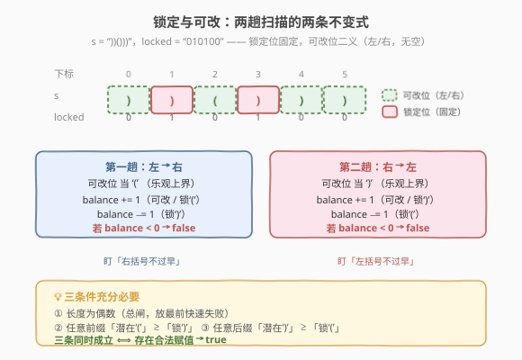
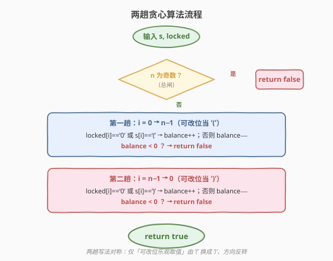
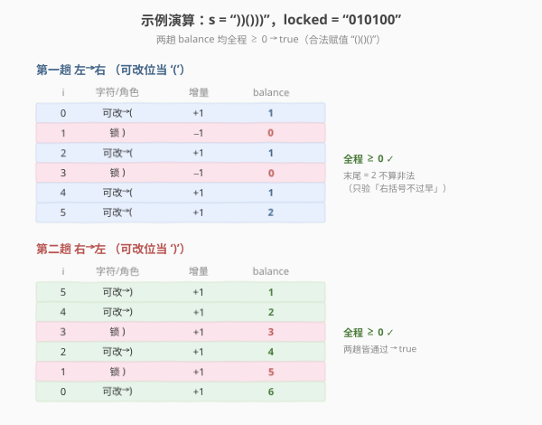

# LeetCode 判断一个括号字符串是否有效 题解

## 1. 题目概述

- **标题 / 题号**：判断一个括号字符串是否有效（#2116，medium）
- **链接**：https://leetcode.cn/problems/check-if-a-parentheses-string-can-be-valid/
- **难度**：中等
- **标签**：贪心、字符串、括号匹配

**题意**：给定一个仅由 `'('` 和 `')'` 组成的非空括号字符串 `s`，以及一个等长的二进制字符串 `locked`。对于每个下标 `i`：

- `locked[i] == '1'`：`s[i]` **锁定**，不可改变；
- `locked[i] == '0'`：`s[i]` **可改**，可任意变为 `'('` 或 `')'`。

问：能否通过修改可改位置，使 `s` 成为一个**有效括号字符串**？能返回 `true`，否则 `false`。

有效括号字符串的定义（标准）：可递归地表为 `()`、`AB`（`A`、`B` 均有效）或 `(A)`。

**示例 1**：

```text
输入：s = "))()))", locked = "010100"
输出：true
解释：locked[1]、locked[3] 为 '1'，s[1]=')'、s[3]=')' 不可改；
      将 s[0]、s[4] 改为 '('，s[2] 保持 '('、s[5] 保持 ')'，
      得到 "()()()"，有效。
```

**示例 2**：

```text
输入：s = "()()", locked = "0000"
输出：true
解释：s 本身已有效，无需改动。
```

**示例 3**：

```text
输入：s = ")", locked = "0"
输出：false
解释：无论把 s[0] 改成 '(' 还是 ')'，长度为 1，不可能有效。
```

**示例 4**：

```text
输入：s = "(((())(((())", locked = "111111010111"
输出：true
解释：locked 允许改 s[6]、s[8]，将二者改为 ')' 即得 "(((()))((()))"，有效。
```

**约束**：

- `n == s.length == locked.length`
- $1 \le n \le 10^5$
- `s[i]` 为 `'('` 或 `')'`
- `locked[i]` 为 `'0'` 或 `'1'`

> 💡 本题是 [678. 有效的括号字符串](../0601-0700/678_有效的括号字符串.md) 的「位置锁定」变体：678 里的 `'*'` 是「字符三义（左/右/空）」，本题里的**可改位**是「位置二义（左/右，不能为空）」——字符串长度固定不变。这一差异让 678 的「维护 balance 区间」做法不再是最自然的选择，取而代之的是更直白的**两趟贪心扫描**：分别从左、从右各扫一遍，各自只盯一条不变式。

## 2. 解题思路

### 2.1 暴力思路：枚举每个可改位

共有 $k$ 个 `locked[i] == '0'` 的位置，每个可取 `'('` / `')'` 两种值，共 $2^k$ 种组合。对每种组合用 20 题「有效括号」的单栈判定 $O(n)$。总复杂度 $O(2^k \cdot n)$，$n, k \le 10^5$ 时完全不可行。

> ⚠️ 暴力的浪费在于：我们并不关心每个可改位**具体**填什么，只关心「**到当前位置为止，左括号够不够用、右括号会不会过早出现**」这种**累计量**。突破口是把逐位枚举换成两趟**贪心累计**。

### 2.2 核心观察：两条互为镜像的必要条件

一个有效括号字符串有两个等价的「**任意前缀/后缀计数**」刻画（与 20 题单栈判定等价）：

1. **任意前缀里 `'('` 的数量 $\ge$ `')'` 的数量**（从左往右看，右括号不能「早到」）；
2. **任意后缀里 `')'` 的数量 $\ge$ `'('` 的数量**（从右往左看，左括号不能「早到」）；
3. **总长为偶数**且 `'('` 与 `')'` 总数相等（由 1、2 在全长处取等号推出）。

回到本题：可改位「**既可以当 `'('` 也可以当 `')'`**」这一自由度，恰好让我们在两条扫描里**各取所需**：

- **从左往右扫**：要让「前缀里 `'('` 够多」。可改位**尽量当 `'('`**（贡献 $+1$），锁定 `')'` 贡献 $-1$，锁定 `'('` 贡献 $+1$。维护累计 `balance`，若任一前缀 `balance < 0`，说明即便把所有可改位都当 `'('` 也堵不住已出现的 `')'` → **必然非法**。
- **从右往左扫**：要让「后缀里 `')'` 够多」。可改位**尽量当 `')'`**（贡献 $+1$），锁定 `'('` 贡献 $-1$，锁定 `')'` 贡献 $+1$。同样维护 `balance`，若任一后缀 `balance < 0`，说明即便把所有可改位都当 `')'` 也堵不住已出现的 `'('` → **必然非法**。

加上「**长度为偶数**」这条总闸，三条合起来恰好**充分必要**。



> 💡 **为什么「各取所需」不矛盾？** 两趟扫描各自只是**判定可行性**，并不真的给可改位赋值。左扫时把可改位当 `'('` 是「乐观上界」——它只用来证明「右括号不会过早出现」；右扫时当 `')'` 是「乐观上界」的另一面——证明「左括号不会过早出现」。两条独立的不变式同时成立，等价于存在一种一致的赋值满足完整括号匹配（这是经典括号匹配定理的「两侧充要条件」形式）。

> ⚠️ **和 678 的关键差别**：678 的 `'*'` **可以当空串**（不贡献字符），所以「未匹配左括号数量」的可能取值集合在每步都**连续**，可用一个区间 `[lo, hi]` 刻画。本题可改位**必须填一个括号、长度固定**，取值集合可能出现「空洞」（如一次 `{-1, +1}` 跳过 `0`），区间法不再直观。两趟贪心绕开了对取值集合形状的依赖，直接验证两条**计数型**充要条件，更清爽。长度为偶数的总闸也由此变得**不可或缺**（见 6.2）。

### 2.3 算法流程图



```text
canBeValid(s, locked):
  n = len(s)
  if n % 2 == 1: return false          # 总闸：奇数长度必非法

  # 第一趟：从左到右，可改位当 '('
  balance = 0
  for i in 0..n-1:
      if locked[i] == '0' or s[i] == '(':   balance += 1
      else:                                   balance -= 1   # 锁定 ')'
      if balance < 0: return false

  # 第二趟：从右到左，可改位当 ')'
  balance = 0
  for i in n-1..0:
      if locked[i] == '0' or s[i] == ')':   balance += 1
      else:                                  balance -= 1   # 锁定 '('
      if balance < 0: return false

  return true
```

### 2.4 示例演算

以示例 1 `s = "))()))"`、`locked = "010100"`（$n=6$，偶数 ✓）为例，下标 0–5：

| 下标 | 0 | 1 | 2 | 3 | 4 | 5 |
|------|---|---|---|---|---|---|
| `s`  | `)` | `)` | `(` | `)` | `)` | `)` |
| `locked` | `0` | `1` | `0` | `1` | `0` | `0` |
| 角色 | 可改 | 锁 `)` | 可改 | 锁 `)` | 可改 | 可改 |



**第一趟（左→右，可改位当 `'('`）**：

| 步 | `i` | 字符/角色 | 增量 | `balance` |
|----|-----|-----------|------|-----------|
| ① | 0 | 可改 → `(` | +1 | 1 |
| ② | 1 | 锁 `)` | −1 | 0 |
| ③ | 2 | 可改 → `(` | +1 | 1 |
| ④ | 3 | 锁 `)` | −1 | 0 |
| ⑤ | 4 | 可改 → `(` | +1 | 1 |
| ⑥ | 5 | 可改 → `(` | +1 | 2 |

全程 `balance ≥ 0` ✓。

**第二趟（右→左，可改位当 `')'`）**：

| 步 | `i` | 字符/角色 | 增量 | `balance` |
|----|-----|-----------|------|-----------|
| ① | 5 | 可改 → `)` | +1 | 1 |
| ② | 4 | 可改 → `)` | +1 | 2 |
| ③ | 3 | 锁 `)` | +1 | 3 |
| ④ | 2 | 可改 → `)` | +1 | 4 |
| ⑤ | 1 | 锁 `)` | +1 | 5 |
| ⑥ | 0 | 可改 → `)` | +1 | 6 |

全程 `balance ≥ 0` ✓。两趟都通过 → **`true`** ✓。

> 💡 注意第一趟末尾 `balance = 2` 而非 `0`——这**不代表非法**。第一趟只验证「右括号不过早」，不要求结尾归零；结尾归零由「长度偶数 + 两趟对称」共同保证。最终合法赋值正是 `"()()()"`（`balance` 演化 1,0,1,0,1,0）。

再以示例 3 `s = ")"`、`locked = "0"` 为反例：$n = 1$ 奇数 → **总闸直接 `false`**，无需扫描。

## 3. 参考代码

### C++

```cpp
// 判断一个括号字符串是否有效 —— 两趟贪心 O(n)/O(1)
// 编译: g++ -O2 -std=c++17 判断一个括号字符串是否有效.cpp -o cpb
#include <string>
using namespace std;

class Solution {
public:
    bool canBeValid(string s, string locked) {
        int n = s.size();
        if (n % 2 == 1) return false;          // 总闸：奇数长度必非法

        // 第一趟：从左到右，可改位当 '('
        int balance = 0;
        for (int i = 0; i < n; ++i) {
            if (locked[i] == '0' || s[i] == '(') balance += 1;
            else                                  balance -= 1;   // 锁定 ')'
            if (balance < 0) return false;
        }

        // 第二趟：从右到左，可改位当 ')'
        balance = 0;
        for (int i = n - 1; i >= 0; --i) {
            if (locked[i] == '0' || s[i] == ')') balance += 1;
            else                                  balance -= 1;   // 锁定 '('
            if (balance < 0) return false;
        }
        return true;
    }
};
```

### Python

```python
class Solution:
    def canBeValid(self, s: str, locked: str) -> bool:
        n = len(s)
        if n % 2 == 1:
            return False                      # 总闸：奇数长度必非法

        # 第一趟：从左到右，可改位当 '('
        balance = 0
        for i in range(n):
            if locked[i] == '0' or s[i] == '(':
                balance += 1
            else:                             # 锁定 ')'
                balance -= 1
            if balance < 0:
                return False

        # 第二趟：从右到左，可改位当 ')'
        balance = 0
        for i in range(n - 1, -1, -1):
            if locked[i] == '0' or s[i] == ')':
                balance += 1
            else:                             # 锁定 '('
                balance -= 1
            if balance < 0:
                return False
        return True
```

> 💡 **实现细节**：① 两趟循环写法完全对称，只是「可改位的乐观取值」从 `'('` 换成 `')'`、扫描方向反转。② 不需要单独再判「总数相等」——长度偶数 + 两趟都通过已经隐含总数可配平。③ 提前 `return false` 让大多数非法用例在第一趟就被截断，常数极小。

## 4. 复杂度分析

| 维度 | 复杂度 | 说明 |
|------|--------|------|
| **时间复杂度** | $O(n)$ | 两趟线性扫描，每个字符 $O(1)$；非法用例常在第一趟提前结束 |
| **空间复杂度** | $O(1)$ | 仅一个 `balance` 计数器，无栈无 DP 表 |

> ⚠️ $n \le 10^5$，$O(n)$ 轻松通过。两趟扫描虽各遍历一次，但常数极小（单次比较 + 加减），实测远优于栈/DP 方案。

## 5. 扩展：双栈解法与与 678 的对照

### 5.1 双栈解法（$O(n)$ 时间 / $O(n)$ 空间）

思路更贴近 20 题单栈，便于「需要还原具体匹配方案」的变体：

- 维护两个栈：`open` 存**锁定 `'('`** 的下标，`flex` 存**可改位**的下标。
- 从左到右扫描：
  - 锁定 `'('` → 压 `open`；
  - 可改位 → 压 `flex`；
  - 锁定 `')'` → 优先用 `open` 栈顶匹配，其次用 `flex` 栈顶，两者皆空则非法。
- 扫描结束后，逐一弹出 `open` 栈顶，要求存在一个**下标更大**的 `flex` 栈顶与之配对（保证该可改位充当 `')'` 时位于此 `'('` 之后）；否则非法。
- 最后 `open` 必须为空（剩余 `flex` 数量为偶数即可自配，由总长偶数保证）。

时间 $O(n)$（每个下标入栈出栈各一次），空间 $O(n)$。比两趟贪心多一份栈空间，但思路直白、易扩展到「输出一种合法赋值」。

### 5.2 与 678 的对照

| 维度 | 678 有效的括号字符串 | 2116 判断括号字符串是否有效 |
|------|----------------------|------------------------------|
| 自由来源 | 字符 `'*'` | 位置 `locked == '0'` |
| 自由度 | 三义：`'('` / `')'` / **空** | 二义：`'('` / `')'`（**无空**） |
| 字符串长度 | 可变（`'*'` 当空缩短） | 固定（每位必填一个括号） |
| 取值集合形状 | 每步**连续**区间 | 可能出现**空洞** |
| 主推解法 | 贪心维护 `[lo, hi]` 区间 | 两趟对称贪心扫描 |
| 奇偶总闸 | 不需要（`'*'` 可缩长） | **必需**（长度固定为奇必非法） |
| 时空 | $O(n)$ / $O(1)$ | $O(n)$ / $O(1)$ |

### 5.3 为什么 678 的区间法在本题不直观

678 区间法的核心是「`balance` 的可能取值集合始终是一段连续整数」，故 `[lo, hi]` 两端点就完整刻画了集合。本题可改位**无「空」选项**，每步对 `balance` 的贡献是 $\{-1, +1\}$（而非 $\{-1, 0, +1\}$），单步就能制造空洞：例如 `balance` 当前唯一取值为 $1$，遇一个可改位后可能取值变为 $\{0, 2\}$，**$1$ 不再可达**——区间 `[0, 2]` 会错误地暗示 $1$ 仍可达。

两趟贪心完全绕开「取值集合形状」的讨论，只验证两条**计数型**充要条件，因此更稳健、更易讲清。若坚持用区间法，需配合「长度偶数」总闸并对截断逻辑另作论证，远不如两趟贪心清爽。

## 6. 面试要点

1. **为什么「长度为偶数」是总闸，且必须放在最前？**

   - 任何有效括号字符串的 `'('` 与 `')'` 数量相等，故长度必为偶数。本题每位必填一个括号、长度固定，奇数长度直接判非法，无需扫描。
   - 放最前既是「快速失败」剪枝，也避免后续两趟扫描对奇数长度用例给出误导性中间结果。

2. **两趟扫描各自验证什么？为什么是「充要」而非「必要」？**

   - 左扫验证「任意前缀 `'('` 数 $\ge$ `')'` 数」（右括号不过早），右扫验证「任意后缀 `')'` 数 $\ge$ `'('` 数」（左括号不过早）。
   - 这两条加上「总数相等」是经典括号匹配的**等价刻画**（与单栈判定等价）。本题里「总数相等」由「长度偶数 + 两趟对称」隐含保证，故三条合起来充分必要。

3. **第一趟末尾 `balance = 2`（非 0）为什么不算非法？**

   - 第一趟只负责「右括号不过早」这一条，**不要求结尾归零**。`balance` 末尾为正只表示「乐观上界下还剩潜在 `'('`」，是否真能配平由第二趟与长度偶数共同裁决。不要把 678 「结尾 `lo == 0`」的判据照搬过来。

4. **两趟各自把可改位当 `'('` / `')'`，会不会自相矛盾？**

   - 不会。两趟**各自只做判定**，不真的赋值。左扫把可改位当 `'('` 是验证「右括号不过早」的**乐观上界**；右扫当 `')'` 是验证「左括号不过早」的乐观上界。两条独立不变式同时成立 ⟺ 存在一致的合法赋值——这是「两侧充要条件」定理的内容。

5. **与 678 的关键差别是什么？为什么换解法？**

   - 678 的 `'*'` **可当空**，`balance` 取值集合每步连续，用 `[lo, hi]` 区间最自然；本题可改位**必填括号**，取值集合可能出现空洞，区间法不再直观。
   - 两趟贪心直接验证计数型充要条件，绕开取值集合形状，且空间仍 $O(1)$，是本题的最优解。

> 💡 **一句话总结**：2116 是 678 的「位置锁定」变体——可改位二义（左/右，无空）让区间法不再直观，改用**两趟对称贪心**：左扫盯「右括号不过早」、右扫盯「左括号不过早」，加「长度偶数」总闸，三条件充分必要，$O(n)$ 时间 $O(1)$ 空间。

## 同类练习题

| # | 题目 | 与本题的关联 |
|---|------|-------------|
| 678 | [有效的括号字符串](https://leetcode.cn/problems/valid-parenthesis-string/)（[题解](../0601-0700/678_有效的括号字符串.md)） | `'*'` 三义（含空）的原型题，贪心维护 `[lo, hi]` 区间，与本题互为镜像，务必对比掌握 |
| 20 | [有效的括号](https://leetcode.cn/problems/valid-parentheses/)（[题解](../0001-0100/20_有效括号.md)） | 括号匹配的母题，单栈判定，本题两条不变式的来源 |
| 32 | [最长有效括号](https://leetcode.cn/problems/longest-valid-parentheses/)（[题解](../0001-0100/32_最长有效括号.md)） | 在合法判定上求最长合法子串，栈 / DP / 双向贪心，前缀计数思想的延伸 |
| 921 | [使括号有效的最少插入](https://leetcode.cn/problems/minimum-add-to-make-parentheses-valid/) | 通过插入最少的 `'('` / `')'` 使串有效，同样是「前缀 balance 不过负 + 总数配平」两件套 |
| 1963 | [使字符串平衡的最小交换次数](https://leetcode.cn/problems/minimum-number-of-swaps-to-make-the-string-balanced/) | 括号串平衡的贪心改造，与本题同属「锁定结构下的括号可行性」家族 |
