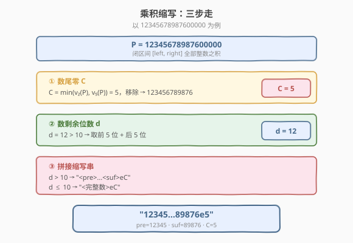
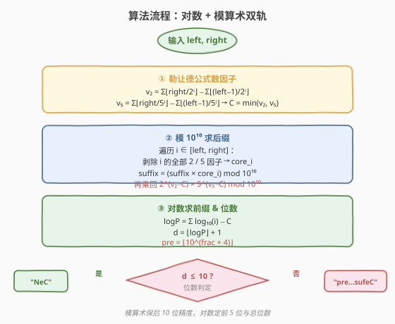
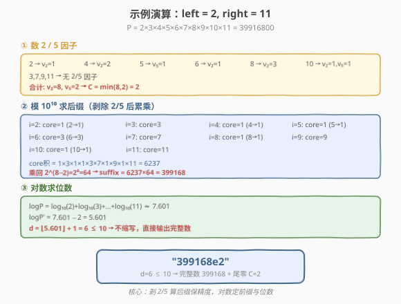

# LeetCode 一个区间内所有数乘积的缩写 题解

## 1. 题目概述

- **标题 / 题号**：一个区间内所有数乘积的缩写（#2117，hard）
- **链接**：https://leetcode.cn/problems/abbreviating-the-product-of-a-range/
- **难度**：困难
- **标签**：数学、模拟、对数

**题意**：给定正整数 `left` 和 `right`（`left <= right`），计算闭区间 `[left, right]` 中所有整数的**乘积** `P`。由于 `P` 可能极大，需要按以下步骤**缩写**：

1. **统计后缀 0 的数目 `C`**，并移除这些 0。
2. 设移除后剩余数字位数为 `d`。若 `d > 10`，取**前 5 位** `pre` 和**后 5 位** `suf`，表示为 `<pre>...<suf>`；若 `d <= 10`，保持不变。
3. 最终输出 `"<pre>...<suf>eC"` 或 `"<完整数>eC"`。

**示例 1**：

```text
输入：left = 1, right = 4
输出："24e0"
解释：P = 1×2×3×4 = 24，无后缀 0，d=2 ≤ 10，直接输出 "24e0"。
```

**示例 2**：

```text
输入：left = 2, right = 11
输出："399168e2"
解释：P = 39916800，C=2，移除后 399168，d=6 ≤ 10，输出 "399168e2"。
```

**示例 3**：

```text
输入：left = 371, right = 375
输出："7219856259e3"
解释：P = 7219856259000，C=3，移除后 7219856259，d=10 ≤ 10，输出 "7219856259e3"。
```

**约束**：

- $1 \le \text{left} \le \text{right} \le 10^4$

> 💡 `right` 最大 $10^4$ 意味着 $P$ 可达 $10000!$，约 $10^{35660}$，远超任何内置数值类型。**不能直接计算乘积**，必须分别提取所需信息（尾零数、前 5 位、后 5 位、总位数）。



## 2. 解题思路

### 2.1 暴力思路：直接大数乘法

用任意精度整数（Python 的 `int` 或 Java 的 `BigInteger`）直接连乘 `[left, right]` 中的每个数，得到完整乘积 `P` 后按规则截取。

- 时间 $O(n \times M)$，其中 $n = \text{right} - \text{left} + 1$，$M$ 为乘积的位数（可达 $35000+$）。
- 空间 $O(M)$ 存储大数。

> ⚠️ 当 `right = 10^4` 时，乘积有约 $35000$ 位，每次乘法涉及大数运算，总时间难以接受。更关键的是：**题目只需要前 5 位、后 5 位和尾零数，计算完整乘积是巨大的浪费**。

### 2.2 核心观察：三条独立信息，三套独立工具

仔细分析缩写所需的信息，发现它们可以**独立计算**，互不依赖：

| 信息 | 工具 | 原理 |
|------|------|------|
| **尾零数 `C`** | 勒让德公式 | 尾零 $= \min(v_2(P), v_5(P))$，而 $v_2 > v_5$ 恒成立，故 $C = v_5(P)$ |
| **后 5 位 `suf`** | 模 $10^{10}$ 累乘 | 剥除每个数的 $2/5$ 因子，累乘取模，最后乘回多余的 $2$ |
| **前 5 位 `pre` + 位数 `d`** | 对数（`log10`） | $\log_{10} P = \sum \log_{10} i$，位数 $d = \lfloor \log_{10}(P/10^C) \rfloor + 1$，前 5 位由小数部分决定 |

> 💡 **为什么后缀用模 $10^{10}$ 而非 $10^5$？** 当 $d \le 10$ 时需要完整数字（最多 10 位），模 $10^{10}$ 恰好保留全部 10 位。当 $d > 10$ 时取后 5 位（模 $10^5$）即可，$10^{10}$ 给出足够余量。

> ⚠️ **为什么剥除 $2/5$ 因子？** 模运算下除法不保持精度。尾零来自 $2 \times 5 = 10$，直接取模会丢失因子信息。正确做法：累乘时**剥除全部 $2/5$ 因子**得到"核心积"，最后**统一乘回**多余的 $2^{v_2 - C} \times 5^{v_5 - C}$（其中一项指数为 $0$）。



### 2.3 算法流程图

```text
abbreviateProduct(left, right):
  # ① 勒让德公式数 2/5 因子
  v2 = legendre(right, 2) - legendre(left-1, 2)
  v5 = legendre(right, 5) - legendre(left-1, 5)
  C  = min(v2, v5)

  # ② 模 10^10 累乘求后缀
  MOD = 10^10
  suffix = 1
  for i in [left, right]:
      core = strip_2_5(i)        # 剥除全部 2/5 因子
      suffix = (suffix * core) % MOD
  suffix = (suffix * 2^(v2-C) * 5^(v5-C)) % MOD

  # ③ 对数求前缀与位数
  logP = sum(log10(i) for i in [left, right]) - C
  d = floor(logP) + 1

  if d <= 10:
      return f"{suffix}e{C}"
  else:
      frac  = logP - floor(logP)
      pre   = floor(10^(frac + 4))
      suf5  = suffix % 100000, 零填充至 5 位
      return f"{pre}...{suf5}e{C}"
```

### 2.4 示例演算

以 `left = 2, right = 11` 为例，$P = 39916800$：



**第一步 — 数因子**：

| 数 | $v_2$ | $v_5$ |
|----|-------|-------|
| 2 | 1 | 0 |
| 3 | 0 | 0 |
| 4 | 2 | 0 |
| 5 | 0 | 1 |
| 6 | 1 | 0 |
| 7 | 0 | 0 |
| 8 | 3 | 0 |
| 9 | 0 | 0 |
| 10 | 1 | 1 |
| 11 | 0 | 0 |
| **合计** | **8** | **2** |

$C = \min(8, 2) = 2$。

**第二步 — 模 $10^{10}$ 累乘**：

逐个剥除 $2/5$ 因子后累乘：

| $i$ | 剥除后 core | suffix（累乘） |
|-----|-------------|----------------|
| 2 | 1 | 1 |
| 3 | 3 | 3 |
| 4 | 1 | 3 |
| 5 | 1 | 3 |
| 6 | 3 | 9 |
| 7 | 7 | 63 |
| 8 | 1 | 63 |
| 9 | 9 | 567 |
| 10 | 1 | 567 |
| 11 | 11 | 6237 |

乘回多余 $2^{v_2 - C} = 2^6 = 64$：$\text{suffix} = 6237 \times 64 = 399168$。

**第三步 — 对数求位数**：

$\log_{10} P = \sum_{i=2}^{11} \log_{10} i \approx 7.601$

$\log_{10}(P / 10^C) = 7.601 - 2 = 5.601$

$d = \lfloor 5.601 \rfloor + 1 = 6 \le 10$ → 不缩写，输出 `"399168e2"`。 ✓

## 3. 参考代码

### C++

```cpp
// 一个区间内所有数乘积的缩写 —— 对数 + 模算术 O(n)/O(1)
// 编译: g++ -O2 -std=c++17 一个区间内所有数乘积的缩写.cpp -o apbr
#include <string>
#include <cmath>
using namespace std;

using ll  = long long;
using lld = long double;

class Solution {
public:
    string abbreviateProduct(int left, int right) {
        // ① 勒让德公式：v_f(n!) = Σ⌊n / f^i⌋
        auto legendre = [](int n, int f) -> ll {
            ll cnt = 0;
            while (n > 0) { n /= f; cnt += n; }
            return cnt;
        };
        ll v2 = legendre(right, 2) - legendre(left - 1, 2);
        ll v5 = legendre(right, 5) - legendre(left - 1, 5);
        ll C  = min(v2, v5);

        // ② 模 10^10 累乘（剥除 2/5 因子）
        const ll MOD = 10000000000LL;
        ll suffix = 1;
        for (int i = left; i <= right; ++i) {
            int v = i;
            while (v % 2 == 0) v /= 2;
            while (v % 5 == 0) v /= 5;
            suffix = (suffix * (ll)v) % MOD;
        }
        // 乘回多余的 2^(v2-C) 和 5^(v5-C)
        suffix = mulmod(suffix, powmod(2, v2 - C, MOD), MOD);
        suffix = mulmod(suffix, powmod(5, v5 - C, MOD), MOD);

        // ③ 对数求前缀与位数
        lld logP = 0;
        for (int i = left; i <= right; ++i)
            logP += log10l((lld)i);
        logP -= (lld)C;

        int d = (int)floorl(logP) + 1;

        if (d <= 10) {
            return to_string(suffix) + "e" + to_string(C);
        } else {
            lld frac = logP - floorl(logP);
            ll pre = (ll)powl(10, frac + 4);
            if (pre >= 100000) pre = 99999;        // 浮点兜底
            char buf[16];
            snprintf(buf, sizeof(buf), "%05lld", suffix % 100000);
            return to_string(pre) + "..." + string(buf) + "e" + to_string(C);
        }
    }
private:
    ll mulmod(ll a, ll b, ll mod) {                 // 10^10 × 10^10 溢出 int64
        return (__int128)a * b % mod;
    }
    ll powmod(ll base, ll exp, ll mod) {
        ll res = 1; base %= mod;
        while (exp > 0) {
            if (exp & 1) res = mulmod(res, base, mod);
            base = mulmod(base, base, mod);
            exp >>= 1;
        }
        return res;
    }
};
```

### Python

```python
import math

class Solution:
    def abbreviateProduct(self, left: int, right: int) -> str:
        # ① 勒让德公式数 2/5 因子
        def legendre(n, f):
            cnt = 0
            while n > 0:
                n //= f
                cnt += n
            return cnt

        v2 = legendre(right, 2) - legendre(left - 1, 2)
        v5 = legendre(right, 5) - legendre(left - 1, 5)
        C = min(v2, v5)

        # ② 模 10^10 累乘（剥除 2/5 因子）
        MOD = 10 ** 10
        suffix = 1
        for i in range(left, right + 1):
            v = i
            while v % 2 == 0:
                v //= 2
            while v % 5 == 0:
                v //= 5
            suffix = (suffix * v) % MOD
        # 乘回多余的 2^(v2-C) × 5^(v5-C)
        suffix = (suffix * pow(2, v2 - C, MOD)) % MOD
        suffix = (suffix * pow(5, v5 - C, MOD)) % MOD

        # ③ 对数求前缀与位数
        logP = sum(math.log10(i) for i in range(left, right + 1)) - C
        d = math.floor(logP) + 1

        if d <= 10:
            return f"{suffix}e{C}"
        else:
            frac = logP - math.floor(logP)
            pre = int(10 ** (frac + 4))
            if pre >= 100000:
                pre = 99999
            suf5 = str(suffix % 100000).zfill(5)
            return f"{pre}...{suf5}e{C}"
```

> 💡 **实现细节**：① 勒让德公式 $v_f(n!) = \sum_{i=1}^{\infty} \lfloor n / f^i \rfloor$，区间 $[\text{left}, \text{right}]$ 的因子数用 $v_f(\text{right}!) - v_f((\text{left}-1)!)$ 作差。② C++ 中 $10^{10} \times 10^{10}$ 溢出 `int64`，必须用 `__int128` 做模乘。③ 对数累加 $10^4$ 个 `log10` 的误差约 $10^{-11}$，对 5 位前缀（需 $10^{-5}$ 精度）绰绰有余。

## 4. 复杂度分析

| 维度 | 复杂度 | 说明 |
|------|--------|------|
| **时间复杂度** | $O(n)$ | $n = \text{right} - \text{left} + 1$；三步各遍历一次区间，勒让德公式 $O(\log_f n)$ |
| **空间复杂度** | $O(1)$ | 仅常数个变量，无大数存储 |

> ⚠️ $n \le 10^4$，$O(n)$ 轻松通过。瓶颈在对数累加（$10^4$ 次 `log10`），但现代 CPU 上 $< 1\text{ms}$。

## 5. 扩展：浮点精度问题与应对

### 5.1 对数累加的误差分析

`double`（53 位尾数，约 $15$ 位有效数字）累加 $10^4$ 个 `log10` 值：

- 每个 `log10(i)` 的相对误差 $\approx 10^{-15}$
- 累加 $10^4$ 项，最坏情况误差 $\approx 10^4 \times 10^{-15} \times 4 \approx 4 \times 10^{-11}$
- 前缀需要 $5$ 位精度（$10^{-5}$），安全余量 $10^6$ 倍

C++ 用 `long double`（80 位扩展精度，$18\text{-}19$ 位有效数字）更稳。Python 的 `float` 即 `double`，精度同样足够。

### 5.2 前缀边界 `pre >= 100000` 的兜底

当 $\text{frac}$ 极接近 $1$（即前 5 位本应是 $99999$），浮点运算 `powl(10, frac+4)` 可能产出 $100000.0\ldots$。`int()` 截断后变为 $6$ 位数，需 `clamp` 回 $99999$。

### 5.3 为什么不用 `Decimal` / 大数？

Python 的 `decimal.Decimal` 可设任意精度，但 $10^4$ 个大数乘法的时间开销远大于对数方案。对数 + 模算术是**精度与速度的最优平衡**。

## 6. 面试要点

1. **为什么不能直接大数乘法？**

   - `right` 最大 $10^4$，乘积约 $10^{35660}$，有 $35000+$ 位。大数连乘的时间 $O(n \times M)$ 和空间 $O(M)$ 都不可接受。题目只需前 5 位、后 5 位和尾零数，应**按需提取**而非全量计算。

2. **尾零数为什么等于 $v_5$？**

   - 每个尾零来自一对 $2 \times 5$。在阶乘/区间乘积中，$2$ 的因子数恒多于 $5$（每两个数出一个 $2$，每五个数才出一个 $5$），所以 $\min(v_2, v_5) = v_5$。勒让德公式 $v_f(n!) = \sum \lfloor n / f^i \rfloor$ 给出精确计数。

3. **后缀计算为什么要"剥除再乘回"？**

   - 直接对 $P \bmod 10^{10}$ 取模会丢失 $2/5$ 因子信息（模运算下无法整除 $10^C$）。正确做法：累乘时剥除每个数的全部 $2/5$ 因子得到"核心积"，最后统一乘回多余的 $2^{v_2-C} \times 5^{v_5-C}$（其中一项指数为 $0$）。

4. **前缀为什么用对数？**

   - $\log_{10} P = \sum \log_{10} i$ 将乘法转化为加法，避免大数。$\log_{10}(P/10^C)$ 的整数部分 $+1$ 给出位数 $d$，小数部分 $\text{frac}$ 决定前 5 位：$\text{pre} = \lfloor 10^{\text{frac}+4} \rfloor$。

5. **$d \le 10$ 和 $d > 10$ 的输出格式有何不同？**

   - $d \le 10$：完整数字（由模 $10^{10}$ 的 `suffix` 直接给出）+ `"eC"`。
   - $d > 10$：`"pre...sufeC"`，`pre` 为 5 位前缀，`suf` 为 5 位后缀（`suffix % 10^5`，`zfill(5)` 补零）。

> 💡 **一句话总结**：将乘积缩写拆解为三条独立信息——尾零用勒让德公式、后 5 位用模 $10^{10}$ 累乘（剥除 $2/5$ 再乘回）、前 5 位与位数用对数，三者各司其职、互不干扰，$O(n)$ 时间 $O(1)$ 空间完成。

## 同类练习题

| # | 题目 | 与本题的关联 |
|---|------|-------------|
| 172 | [阶乘后的零](https://leetcode.cn/problems/factorial-trailing-zeroes/)（[题解](../0101-0200/172_阶乘后的零.md)） | 勒让德公式数 $v_5(n!)$ 的原型题，本题尾零计算的直接基础 |
| 400 | [第 N 位数字](https://leetcode.cn/problems/nth-digit/)（[题解](../0301-0400/400_第N位数字.md)） | 按位数分层定位，同样利用 $\log_{10}$ 确定数字位数与位置 |
| 50 | [Pow(x, n)](https://leetcode.cn/problems/powx-n/) | 快速幂模板，本题 C++ 中 $2^{v_2-C} \bmod 10^{10}$ 用的就是它 |
| 166 | [分数到小数](https://leetcode.cn/problems/fraction-to-recurring-decimal/)（[题解](../0101-0200/166_分数到小数.md)） | 长除法模拟 + 哈希检测循环节，同属"大数问题的精确模拟"家族 |
