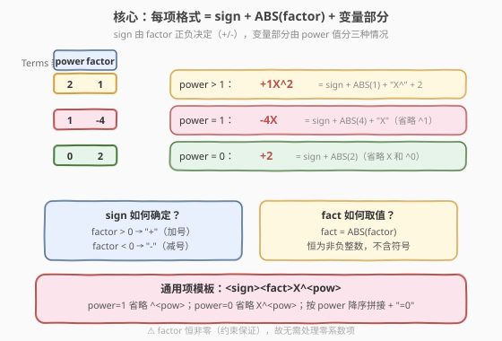
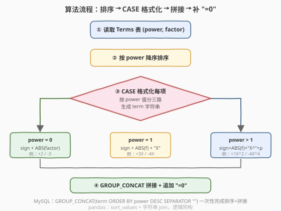
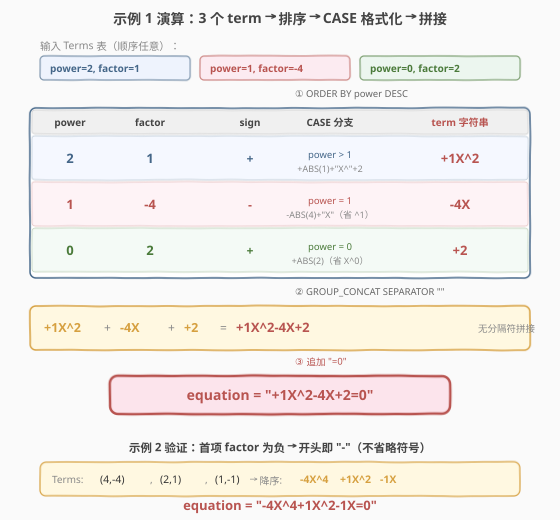

# LeetCode 建立方程 题解

## 1. 题目概述

- **标题 / 题号**：建立方程（#2118，hard）
- **链接**：https://leetcode.cn/problems/build-the-equation/
- **难度**：困难
- **标签**：数据库、SQL、字符串构建、`CASE` 表达式、`GROUP_CONCAT`、`CONCAT`、`ABS`、`IF`/`CASE`、排序拼接、LeetCode 锁题

**题意**：给定 `Terms` 表，每行表示多项式中的一个项 $\text{factor} \cdot X^{\text{power}}$。编写 SQL 查询，把这些项**按 `power` 降序**拼成一条方程字符串，并以 `"=0"` 结尾，输出为单行单列 `equation`。

**表结构**：

```text
Table: Terms
+--------+------+
| Column | Type |
+--------+------+
| power  | int  |  ← 幂次（X 的指数）
| factor | int  |  ← 系数（可为负，保证非零）
+--------+------+
每行表示一个项 factor * X^power。
同一个 power 不会重复出现；factor 恒不为 0。
```

**项的格式规则**：每个项 = `sign` + `ABS(factor)` + 变量部分，其中

- **`sign`**：`factor > 0` → `"+"`；`factor < 0` → `"-"`（**首项也不省略符号**）。
- **系数**：恒取 `ABS(factor)`，即不含符号的非负整数（如 `factor = -4` 显示 `4`）。
- **变量部分**（按 `power` 分三种情形）：

| `power` 取值 | 变量部分 | 示例（`factor` / `power`） | 拼出的 term |
|--------------|----------|----------------------------|--------------|
| $> 1$ | `X^` + `power` | `1, 2` | `+1X^2` |
| $= 1$ | `X`（省略 `^1`） | `-4, 1` | `-4X` |
| $= 0$ | 空（省略 `X^0`） | `2, 0` | `+2` |

**输出**：单行单列 `equation`，即所有 term 按 `power` 降序无分隔符拼接后追加 `"=0"`。

**示例 1**：

```text
输入：
Terms 表:
+-------+--------+
| power | factor |
+-------+--------+
| 2     | 1      |
| 1     | -4     |
| 0     | 2      |
+-------+--------+

输出：
+---------------------+
| equation            |
+---------------------+
| +1X^2-4X+2=0        |
+---------------------+
```

**解释**：按 `power` 降序三项分别为 `+1X^2`、`-4X`、`+2`，拼接得 `+1X^2-4X+2`，追加 `=0`。

**示例 2**：

```text
输入：
Terms 表:
+-------+--------+
| power | factor |
+-------+--------+
| 4     | -4     |
| 2     | 1      |
| 1     | -1     |
+-------+--------+

输出：
+---------------------+
| equation            |
+---------------------+
| -4X^4+1X^2-1X=0     |
+---------------------+
```

**解释**：首项 `factor = -4 < 0`，故方程以 `"-"` 开头（**不省略首项符号**）。

> 💡 本题是 SQL **"逐行 CASE 格式化 + `GROUP_CONCAT` 排序拼接"招牌题**——核心难点不在聚合，而在**字符串格式化的分支逻辑**：① 符号由 `factor` 正负决定且首项不省；② 系数取绝对值；③ 变量部分按 `power` 分三种省略情形。把这三条规则用 `CASE` 表达清楚后，用 `GROUP_CONCAT(... ORDER BY power DESC SEPARATOR '')` 一次性完成"排序 + 无分隔拼接"，最后外层 `CONCAT` 补上 `"=0"`。

## 2. 解题思路

### 2.1 暴力思路：应用层游标循环逐项拼接

最直觉的过程式思路：把 `Terms` 读进应用层，按 `power` 排序后逐行处理，对每行用 `if/else` 生成 term 字符串并累加到一个 buffer，最后追加 `"=0"`。伪代码：

```text
rows = SELECT power, factor FROM Terms ORDER BY power DESC
buf = ""
for r in rows:
    sign = "+" if r.factor > 0 else "-"
    coeff = str(abs(r.factor))
    if r.power == 0:
        var = ""
    elif r.power == 1:
        var = "X"
    else:
        var = f"X^{r.power}"
    buf += sign + coeff + var
return buf + "=0"
```

逻辑正确，但 **SQL 不擅长"逐行循环 + 状态累加"**。关键在于识别本题的结构：① 每行的 term 字符串**只依赖本行的 `power`/`factor`**（无跨行依赖）→ 可用 `CASE` 表达式**集合式**地一次性算出每行的 term；② 全表的"拼接"在 SQL 中有原生算子 `GROUP_CONCAT`，可同时完成排序与无分隔拼接。把过程式的两层循环替换成两条集合操作，就是本题的最优解。

### 2.2 核心观察：term = sign + ABS(factor) + 变量部分（CASE 三分支）



**关键洞察**：把"一个 term 长什么样"拆成三段独立决策，每段都能用一个简单 SQL 表达式实现：

1. **`sign` 段**——只看 `factor` 正负：`IF(factor > 0, '+', '-')`。⚠️ 题目要求**首项也带符号**（示例 2 开头是 `-4X^4`），因此**不需要**对首项做"省略正号"的特殊处理，每项无脑加 `sign` 即可。这反而是最简单的规则。

2. **`fact` 段**——系数取绝对值：`ABS(factor)`。⚠️ `sign` 已经把正负号独立出去了，这里的数字必须**恒非负**，否则会出现 `--4X` 这样的双符号。`ABS` 正好把符号剥离。

3. **变量段**——按 `power` 分三种省略情形，用 `CASE` 表达：

   ```sql
   CASE power
     WHEN 0 THEN ''                   -- 常数项：省 X 和 ^0
     WHEN 1 THEN 'X'                  -- 一次项：省 ^1
     ELSE CONCAT('X^', power)         -- 高次项：完整 X^power
   END
   ```

把三段用 `CONCAT` 串起来即得每行的 `term` 字符串：

$$
\text{term} = \text{sign} \;\Vert\; \text{ABS}(\text{factor}) \;\Vert\; \text{varPart}(\text{power})
$$

其中 $\Vert$ 表示字符串拼接。

> ⚠️ **三个最易踩的坑**：
> - **系数为 $\pm 1$ 不省略**：示例 1 的 `factor=1, power=2` 拼出 `+1X^2`（不是 `+X^2`）。这与数学课本的习惯不同——题面要求**始终显示 `ABS(factor)`**，故 `1` 也要写出来。
> - **首项符号不省略**：示例 2 开头是 `-4X^4` 而非 `4X^4`。即使一项是方程的第一项，它的 `sign` 照常输出。
> - **`factor` 恒非零**（题目约束保证），故无需处理"零系数项应跳过"的情况。若约束放宽，需额外加 `WHERE factor != 0` 过滤。

> 💡 **"分支逻辑用 `CASE`，不用 `IF` 串"**：变量段有三个互斥分支，`CASE power WHEN ... THEN ... ELSE ... END` 是 SQL 表达"按值分情况"的标准算子，比嵌套 `IF(cond, a, IF(cond2, b, c))` 更清晰。`sign` 段只有两分支，用 `IF(factor > 0, '+', '-')` 更简洁——两者混用，各取所长。

### 2.3 算法流程图



**逻辑执行步骤**：

| 步骤 | 操作 | 作用 |
|------|------|------|
| ① | `FROM Terms` | 读取项表 `(power, factor)` |
| ② | `ORDER BY power DESC`（在 `GROUP_CONCAT` 内完成） | 按 `power` 降序，保证高次项在前 |
| ③ | `CASE` 格式化每项 | 按 `power` 三分支生成 `term` 字符串 |
| ④ | `GROUP_CONCAT(term ORDER BY power DESC SEPARATOR '')` | 无分隔符拼接所有 term |
| ⑤ | 外层 `CONCAT(..., '=0')` | 追加等号右端 |

> 💡 **`GROUP_CONCAT` 一举两得**：它的 `ORDER BY` 子句在拼接前对组内行排序，`SEPARATOR ''` 指定无分隔符——把"排序"和"拼接"两个动作合并成一条算子。这比"先 `ORDER BY` 再用变量累加"的老式写法简洁得多。注意 `ORDER BY` 引用的 `power` 列必须在其作用域内可见（CTE 里保留 `power` 列即可，见解法 A）。

### 2.4 示例演算

以示例 1 为例，观察"排序 → CASE 格式化 → 拼接 → 补 `=0`"的逐步过程：



**步骤 ①：Terms 表（3 行，输入顺序任意）**

| power | factor |
|-------|--------|
| 2 | 1 |
| 1 | -4 |
| 0 | 2 |

**步骤 ②：按 `power` 降序排序后 + CASE 格式化**

| power | factor | sign | CASE 分支 | term 字符串 |
|-------|--------|------|-----------|-------------|
| 2 | 1 | `+` | `power > 1` → `+ABS(1)+"X^"+2` | `+1X^2` |
| 1 | -4 | `-` | `power = 1` → `-ABS(4)+"X"`（省 `^1`） | `-4X` |
| 0 | 2 | `+` | `power = 0` → `+ABS(2)`（省 `X^0`） | `+2` |

**步骤 ③：`GROUP_CONCAT` 无分隔符拼接**

$$
\texttt{+1X\^2} \;\Vert\; \texttt{-4X} \;\Vert\; \texttt{+2} \;=\; \texttt{+1X\^2-4X+2}
$$

**步骤 ④：追加 `"=0"`**

$$
\texttt{+1X\^2-4X+2} \;+\; \texttt{=0} \;=\; \boxed{\texttt{+1X\^2-4X+2=0}}
$$

> 💡 **示例 2 验证首项符号**：示例 2 排序后首项是 `(4, -4)`，`factor < 0` 故 `sign = "-"`，term 为 `-4X^4`，方程以 `-` 开头：`-4X^4+1X^2-1X=0`。这印证了"首项不省略符号"的规则——若误把首项正号省略或对首项做特殊处理，示例 2 会立刻挂掉。

## 3. 参考代码

### SQL（解法 A：CTE 分离格式化 + GROUP_CONCAT，推荐）

```sql
WITH FormattedTerms AS (
    SELECT
        CONCAT(
            IF(factor > 0, '+', '-'),
            ABS(factor),
            CASE power
                WHEN 0 THEN ''
                WHEN 1 THEN 'X'
                ELSE CONCAT('X^', power)
            END
        ) AS term,
        power
    FROM Terms
)
SELECT CONCAT(
    GROUP_CONCAT(term ORDER BY power DESC SEPARATOR ''),
    '=0'
) AS equation
FROM FormattedTerms;
```

> 💡 **写法要点**：
> - **CTE 分两步**：`FormattedTerms` 只负责"逐行算 term 字符串"（保留 `power` 列供排序用）；外层 `SELECT` 只负责"拼接 + 补 `=0`"。职责分离，每层逻辑单一，可读性最佳。
> - **`IF(factor > 0, '+', '-')`**：两分支取符号，比等价的 `CASE WHEN factor > 0 THEN '+' ELSE '-' END` 更简洁。⚠️ `factor` 恒非零，故无需考虑 `= 0` 情形。
> - **`CASE power WHEN 0 ... WHEN 1 ... ELSE ...`**：三分支定变量部分。`ELSE` 兜底所有 `power ≥ 2`，用 `CONCAT('X^', power)` 拼出 `X^<power>`。
> - **`GROUP_CONCAT(term ORDER BY power DESC SEPARATOR '')`**：无 `GROUP BY` 时整表为一个组，`GROUP_CONCAT` 把组内所有 `term` 按 `power` 降序拼成一条字符串，`SEPARATOR ''` 表示无分隔符。`ORDER BY power DESC` 引用的 `power` 来自 CTE，作用域可见。
> - **外层 `CONCAT(..., '=0')`**：`GROUP_CONCAT` 返回字符串，`CONCAT` 再追加 `"=0"`。
> - ✓ **最推荐**：MySQL 8.0+ 标准 SQL，CTE 分层清晰，`GROUP_CONCAT` 一举完成排序+拼接。

### SQL（解法 B：内联 GROUP_CONCAT，紧凑写法）

```sql
SELECT CONCAT(
    GROUP_CONCAT(
        CONCAT(
            IF(factor > 0, '+', '-'),
            ABS(factor),
            CASE power
                WHEN 0 THEN ''
                WHEN 1 THEN 'X'
                ELSE CONCAT('X^', power)
            END
        )
        ORDER BY power DESC
        SEPARATOR ''
    ),
    '=0'
) AS equation
FROM Terms;
```

> 💡 **解法 B 与 A 的区别**：把"格式化 term"的 `CONCAT` 直接塞进 `GROUP_CONCAT` 的聚合表达式里，省掉 CTE 一层。
>
> - **等价性**：两者结果完全相同。
> - **可读性**：解法 A 用 CTE 把 `term` 命名出来，调试时可以 `SELECT * FROM FormattedTerms` 单独看每行 term；解法 B 更紧凑但嵌套较深，`CONCAT` 套 `GROUP_CONCAT` 套 `CONCAT` 套 `CASE`，阅读时需从内向外拆。
> - **`ORDER BY` 的作用域**：解法 B 中 `GROUP_CONCAT(... ORDER BY power DESC)` 的 `power` 直接来自 `FROM Terms`，无需在 CTE 里显式保留——因为这里没有 CTE 包裹，`power` 在整表聚合的作用域里天然可见。
> - **何时选 B**：题目简单、不需中间结果调试时，B 更短小；面试讲解或需要分步验证时，A 更清晰。

### SQL（解法 C：窗口函数拼序号 + 条件聚合，无 GROUP_CONCAT）

```sql
WITH OrderedTerms AS (
    SELECT
        power,
        factor,
        ROW_NUMBER() OVER (ORDER BY power DESC) AS rn,
        COUNT(*) OVER () AS total
    FROM Terms
),
Formatted AS (
    SELECT
        CONCAT(
            IF(factor > 0, '+', '-'),
            ABS(factor),
            CASE power
                WHEN 0 THEN ''
                WHEN 1 THEN 'X'
                ELSE CONCAT('X^', power)
            END
        ) AS term,
        rn,
        total
    FROM OrderedTerms
)
SELECT CONCAT(
    MAX(CASE WHEN rn = 1 THEN term ELSE '' END),
    MAX(CASE WHEN rn = 2 THEN term ELSE '' END),
    MAX(CASE WHEN rn = 3 THEN term ELSE '' END),
    MAX(CASE WHEN rn = 4 THEN term ELSE '' END),
    MAX(CASE WHEN rn = 5 THEN term ELSE '' END),
    '=0'
) AS equation
FROM Formatted;
```

> ⚠️ **解法 C 仅为教学对照**——它用 `ROW_NUMBER()` 给每行编序号，再用"条件聚合"（`MAX(CASE WHEN rn=k THEN term END)`）按位置逐个拼出字符串。这是 `GROUP_CONCAT` 不可用时的**通用行转列套路**（PostgreSQL 早期版本、某些 OLAP 引擎无 `GROUP_CONCAT` 时常用）。
>
> **致命缺陷**：必须**预先知道项数上限**并写够 `MAX(CASE WHEN rn=k ...)` 的数量。本题约束未给出 `power` 上界，项数可能很大，此法不可扩展。生产中应优先用 `GROUP_CONCAT`（MySQL）或 `STRING_AGG`（PostgreSQL/SQL Server）。列出此解法是为说明：**没有 `GROUP_CONCAT` 时，字符串拼接会退化成"按位置展开"的笨办法**——这正是 `GROUP_CONCAT` 价值所在。

### Python（pandas）

```python
import pandas as pd


def build_equation(terms: pd.DataFrame) -> pd.DataFrame:
    df = terms.sort_values('power', ascending=False)
    sign = df['factor'].gt(0).map({True: '+', False: '-'})
    coeff = df['factor'].abs().astype(str)
    var = df['power'].map(
        lambda p: '' if p == 0 else ('X' if p == 1 else f'X^{p}')
    )
    equation = (sign + coeff + var).sum() + '=0'
    return pd.DataFrame({'equation': [equation]})
```

> 💡 **pandas 对照**：
> - `.sort_values('power', ascending=False)`——对应 `ORDER BY power DESC`。
> - `df['factor'].gt(0).map({True:'+',False:'-'})`——对应 `IF(factor > 0, '+', '-')`。
> - `df['factor'].abs().astype(str)`——对应 `ABS(factor)`，`astype(str)` 把数字转成可拼接的字符串。
> - `df['power'].map(lambda p: ...)`——对应 `CASE power WHEN 0 ... WHEN 1 ... ELSE ...`，三分支定变量部分。
> - `sign + coeff + var`——三个 Series 按元素拼接，得到每行的 term 字符串 Series（对应 SQL 的 `CONCAT(...)` 逐行算 term）。
> - `.sum()`——对字符串 Series 求和即**无分隔符拼接所有元素**，对应 `GROUP_CONCAT(... SEPARATOR '')`。⚠️ 这是 pandas 字符串 Series 的特性：`.sum()` 对数值是求和，对字符串是拼接。
> - `+ '=0'`——对应外层 `CONCAT(..., '=0')`。

## 4. 复杂度分析

| 维度 | 解法 A（CTE + GROUP_CONCAT） | 解法 B（内联 GROUP_CONCAT） | 解法 C（ROW_NUMBER + 条件聚合） | pandas |
|------|------------------------------|----------------------------|----------------------------------|--------|
| **时间** | $O(n \log n)$ | $O(n \log n)$ | $O(n \log n)$ | $O(n \log n)$ |
| **空间** | $O(n)$（CTE 物化） | $O(n)$ | $O(n)$ | $O(n)$ |
| **扫表次数** | 1 次 | 1 次 | 1 次 | 1 次 |
| **是否需预知项数** | 否 | 否 | **是**（致命限制） | 否 |
| **可读性** | ✓ 分层清晰 | 紧凑但嵌套深 | 笨重 | ✓ 清晰 |
| **推荐度** | ✓ **首选** | ✓ 紧凑备选 | ✗ 仅对照 | ✓ 验证用 |

> - $n$ = `Terms` 表行数。
> - **时间瓶颈是排序**：`GROUP_CONCAT(... ORDER BY power DESC)` 需对 $n$ 行按 `power` 排序 $O(n \log n)$；逐行 `CASE` 格式化 $O(n)$。整体由排序主导。若 `power` 列有索引，排序可走索引有序扫描近似 $O(n)$。
> - **空间**：CTE 物化每行的 `term` 字符串 + `power`，$O(n)$；`GROUP_CONCAT` 内部缓冲区还需容纳拼接结果。
> - **解法 C 的额外代价**：`ROW_NUMBER()` + `COUNT(*) OVER()` 两次窗口排序，常数更大；且需枚举 `rn = 1..k` 所有位置，$k$ 未知时不可用。

## 5. 扩展：GROUP_CONCAT 的陷阱与跨数据库方案

### 5.1 `group_concat_max_len` 截断陷阱

MySQL 的 `GROUP_CONCAT` 默认有结果长度上限 `group_concat_max_len`，**默认值仅 1024 字节**。拼接结果超过此值会被**静默截断**（不报错！），导致方程字符串残缺。

```sql
-- 查看当前上限
SHOW VARIABLES LIKE 'group_concat_max_len';
-- 临时调大（会话级）
SET SESSION group_concat_max_len = 1048576;  -- 1 MB
```

> ⚠️ 本题 `power` 范围有限、项数不多，拼接结果远小于 1024 字节，不会触发截断。但**生产环境用 `GROUP_CONCAT` 拼接长字符串（如汇总日志、聚合文本）时，必须先调大 `group_concat_max_len`**，否则会得到被截断的错误结果且难以察觉。这是 `GROUP_CONCAT` 最隐蔽的坑。

### 5.2 跨数据库的字符串聚合函数

`GROUP_CONCAT` 是 MySQL 方言。不同数据库有各自的字符串聚合算子：

| 数据库 | 字符串聚合函数 | 排序语法 | 分隔符 |
|--------|----------------|----------|--------|
| MySQL | `GROUP_CONCAT(x ORDER BY y SEPARATOR ',')` | `ORDER BY` 内置 | `SEPARATOR` |
| PostgreSQL | `STRING_AGG(x, ',' ORDER BY y)` | `ORDER BY` 内置 | 第 2 参数 |
| SQL Server | `STRING_AGG(x, ',') WITHIN GROUP (ORDER BY y)` | `WITHIN GROUP` | 第 2 参数 |
| Oracle | `LISTAGG(x, ',') WITHIN GROUP (ORDER BY y)` | `WITHIN GROUP` | 第 2 参数 |

PostgreSQL 版本（`SEPARATOR ''` 即空分隔符）：

```sql
SELECT STRING_AGG(
    IF(factor > 0, '+', '-') || ABS(factor) ||
    CASE power WHEN 0 THEN '' WHEN 1 THEN 'X' ELSE 'X^' || power END,
    '' ORDER BY power DESC
) || '=0' AS equation
FROM Terms;
```

> 💡 PostgreSQL 用 `||` 拼接字符串（也支持 `CONCAT`），`STRING_AGG` 的分隔符是第 2 参数（空串即无分隔）。`IF` 在 PG 中需换成 `CASE WHEN`（`IF` 是 MySQL 方言）。

### 5.3 若题目改为"省略系数 1"

数学课本里 `1X^2` 常简写为 `X^2`。若题面改为"系数绝对值为 1 时省略数字"（仅当 `ABS(factor) = 1` 且 `power > 0` 时省略 `1`），需在 `fact` 段加判断：

```sql
CASE
    WHEN ABS(factor) = 1 AND power > 0 THEN ''   -- 省略 1
    ELSE CAST(ABS(factor) AS CHAR)               -- 其余照写
END
```

> ⚠️ `power = 0` 时**不能省略 1**：常数项 `+1` 若省成 `+` 会变成孤零零的符号。故条件必须带 `power > 0`。本题原题面**不省略 1**（`+1X^2` 原样输出），无需此逻辑——列出仅为对比说明"格式化规则的小改动如何映射到 `CASE` 分支"。

## 6. 面试要点

1. **首项的符号为什么不能省略？**

   > 题面要求每项都带 `sign`，示例 2 的方程以 `-4X^4` 开头（首项 `factor = -4 < 0`）。这与数学课本"方程首项不写正号"的习惯不同——SQL 里无需对首项特殊处理，每项一律 `IF(factor > 0, '+', '-')` 拼上符号即可。若误把首项正号省略，示例 2 仍正确（首项是负号），但遇到首项 `factor > 0` 的用例（如示例 1 的 `+1X^2`）就会输出 `1X^2-4X+2=0` 漏了前导 `+` 而判错。

2. **`GROUP_CONCAT` 的 `ORDER BY` 在排序什么？和 `SELECT ... ORDER BY` 有什么区别？**

   > `GROUP_CONCAT(expr ORDER BY col SEPARATOR s)` 的 `ORDER BY` 决定**组内行被拼进字符串的先后顺序**——它只影响拼接结果的字符顺序，不改变结果行数（整组仍拼成一条字符串）。而 `SELECT ... ORDER BY` 决定**最终结果集行的输出顺序**。本题整表为一组、输出一行，所以用 `GROUP_CONCAT` 内的 `ORDER BY power DESC` 控制项的拼接顺序；若误用外层 `ORDER BY`，它只排序输出行（只有 1 行），对字符串内部顺序毫无作用。

3. **为什么 `factor` 要取 `ABS`，而不是直接拼 `factor`？**

   > 因为 `sign` 段已经独立输出了 `+`/`-`，数字段必须**不含符号**，否则会出现 `--4X`（`factor=-4` 直接拼成 `-4`，再前置 `-` 号）或 `++1X^2` 这样的双符号。`ABS(factor)` 把符号剥离，保证 `sign` 与数字段职责互不重叠。这是"把字符串拆成独立决策段"的好处——每段只管一件事。

4. **`GROUP_CONCAT` 默认长度限制是多少？怎么排查截断？**

   > 默认 `group_concat_max_len = 1024` 字节。拼接结果超长会被**静默截断**（不报错）。排查方法：`SHOW VARIABLES LIKE 'group_concat_max_len'`；解决：`SET SESSION group_concat_max_len = <更大值>`。本题结果远小于 1024 字节不会触发，但生产环境拼接长文本（如聚合日志）必须先调大。这是 `GROUP_CONCAT` 最隐蔽的坑。

5. **不用 `GROUP_CONCAT` 怎么拼字符串？有什么代价？**

   > 用 `ROW_NUMBER() OVER (ORDER BY power DESC)` 给每行编号，再用条件聚合 `MAX(CASE WHEN rn=k THEN term END)` 按位置逐个展开（见解法 C）。代价是必须**预知项数上限**并写够所有 `rn=k` 分支，项数不确定时不可扩展。PostgreSQL/SQL Server 用 `STRING_AGG`/`STRING_AGG` 替代 `GROUP_CONCAT`，语义等价且无此限制。结论：**MySQL 优先 `GROUP_CONCAT`，跨库用 `STRING_AGG`**。

> 💡 **一句话总结**：2118 是 SQL **"CASE 逐行格式化 + GROUP_CONCAT 排序拼接"招牌题**——核心模板「`CONCAT(IF 符号, ABS 系数, CASE 变量三分支)` 算 term → `GROUP_CONCAT(term ORDER BY power DESC SEPARATOR '')` 排序拼接 → 外层 `CONCAT` 补 `=0`」。最大要点：**首项不省符号、系数取 ABS、变量段按 power 三分支省略；`GROUP_CONCAT` 的 `ORDER BY` 控拼接顺序、注意 `group_concat_max_len` 截断**。

## 同类练习题

| # | 题目 | 与本题的关联 |
|---|------|-------------|
| 1484 | [按日期分组销售产品](https://leetcode.cn/problems/group-sold-products-by-the-date/)（[题解](../1301-1400/1484_按日期分组销售产品.md)） | `GROUP_CONCAT(DISTINCT ... ORDER BY ... SEPARATOR)` 排序拼接招牌题，与 2118 共享"GROUP_CONCAT 排序+拼接"骨架，但多了去重维度 |
| 1543 | [产品名称格式修复](https://leetcode.cn/problems/fix-product-name-format/)（[题解](../1501-1600/1543_产品名称格式修复.md)） | 字符串清洗（`TRIM`/大小写归一）+ 分组拼接，与 2118 共享"逐行字符串格式化 + 聚合"思路，侧重清洗规则 |
| 1527 | [患某种疾病的患者](https://leetcode.cn/problems/patients-with-a-condition/)（[题解](../1501-1600/1527_患某种疾病的患者.md)） | `REGEXP`/`LIKE` 字符串匹配，与 2118 同为"字符串条件分支"类，对照"匹配筛选"vs"格式化生成"两个方向 |
| 1777 | [每个商店的商品价格 🔒](https://leetcode.cn/problems/products-price-for-each-store/) | `GROUP_CONCAT` 行转列（条件聚合 pivot），与 2118 同用 `GROUP_CONCAT`，但把多行聚合成"多列"而非"一串"，对照拼接 vs 透视两种聚合形态 |
| 1789 | [员工的首要部门](https://leetcode.cn/problems/primary-department-for-each-employee/) | `ROW_NUMBER()` + 条件筛选，巩固解法 C 中"窗口函数编序号"的套路，对照"按位置取值"的另一种应用 |
