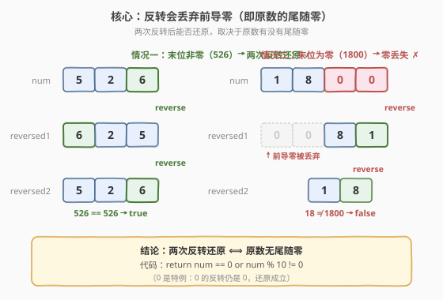
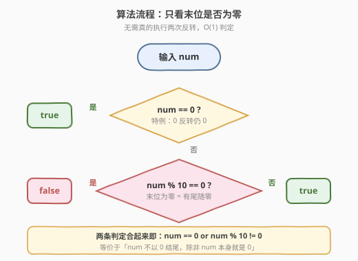
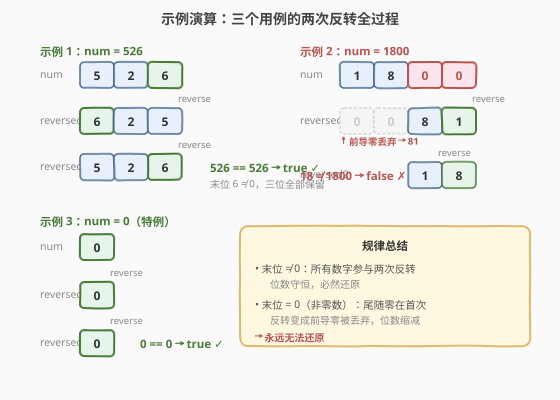

# 反转两次的数字

- **题目名称**：反转两次的数字
- **链接**：[2119. 反转两次的数字](https://leetcode.cn/problems/a-number-after-a-double-reversal/)
- **难度**：简单
- **标签**：数学

## 1. 题目概述

**反转** 一个整数意味着倒置它的所有位。

- 例如，反转 `2021` 得到 `1202`。反转 `12300` 得到 `321`，**不保留前导零**。

给你一个整数 `num`，**反转** `num` 得到 `reversed1`，**接着反转** `reversed1` 得到 `reversed2`。如果 `reversed2` 等于 `num`，返回 `true`；否则返回 `false`。

**示例 1**：

```text
输入：num = 526
输出：true
解释：反转 num 得到 625，接着反转 625 得到 526，等于 num。
```

**示例 2**：

```text
输入：num = 1800
输出：false
解释：反转 num 得到 81，接着反转 81 得到 18，不等于 num。
```

**示例 3**：

```text
输入：num = 0
输出：true
解释：反转 num 得到 0，接着反转 0 得到 0，等于 num。
```

**约束条件**：

- $0 \le \text{num} \le 10^6$

> 💡 本题的题眼藏在「**不保留前导零**」这句话里。反转操作并非简单的字符串翻转——它把反转后出现在**最左侧的零**全部丢弃，而这些零恰是原数**最右侧的尾随零**。于是「两次反转能否还原」这个问题，就被翻译成了「原数到底有没有尾随零」。

---

## 2. 解题思路

### 2.1 暴力思路：老实执行两次反转

最直接的做法是按题意模拟：实现一个 `reverse(num)` 函数，对 `num` 调用两次，再与原数比较。

**字符串版**（Python 最省事）：

```python
def reverse(x):
    return int(str(x)[::-1])

reversed1 = reverse(num)
reversed2 = reverse(reversed1)
return reversed2 == num
```

**数学版**（[7. 整数反转](../0001-0100/7_整数反转.md) 的弹出/压入机制）：

```python
def reverse(x):
    rev = 0
    while x:
        rev = rev * 10 + x % 10
        x //= 10
    return rev
```

两种写法都对，但都**做了远超必要的工作**：它们真的把所有数字翻转了两遍。题目只问「能否还原」，并不需要知道 `reversed1`、`reversed2` 的具体值。**真正决定答案的，是原数的末位是不是 0**——这就是暴力法隐藏的浪费。

### 2.2 核心观察：尾随零的不可逆丢失



关键直觉来自「反转**不保留前导零**」这一规则。把原数与两次反转后的数逐位对照：

- **末位非零**（如 `526`）：反转得 `625`，首位是 `6`（非零），**没有任何数字丢失**。再反转得 `526`，与原数完全一致 → `true`。
- **末位为零**（如 `1800`）：反转得 `0081`，但前导零被丢弃 → `81`。两位零**永久丢失**了。再反转 `81` 得 `18`，与 `1800` 位数都不等 → `false`。
- **`num = 0`**：反转 `0` 仍是 `0`，两次反转后还是 `0` → `true`。这是唯一的特例。

把现象提炼成数学命题：

> **定理**：记 $R(x)$ 为反转操作（丢弃前导零）。$R(R(\text{num})) = \text{num}$ 当且仅当 $\text{num} = 0$ 或 $\text{num} \bmod 10 \ne 0$。

**证明**（分两种情形）：

1. **$\text{num}$ 无尾随零**（$\text{num} \bmod 10 \ne 0$，含 $\text{num} = 0$ 的非零情形之外）：

   设 $\text{num}$ 的十进制表示为 $d_{k-1} d_{k-2} \cdots d_1 d_0$，其中 $d_0 \ne 0$（末位非零）且 $d_{k-1} \ne 0$（首位非零，因为是合法整数）。

   - 第一次反转：$R(\text{num}) = d_0 d_1 \cdots d_{k-1}$。由于 $d_0 \ne 0$，反转结果**无前导零**，所有 $k$ 位完整保留。
   - $R(\text{num})$ 的末位是 $d_{k-1} \ne 0$，同样末位非零。
   - 第二次反转：$R(R(\text{num})) = d_{k-1} \cdots d_1 d_0 = \text{num}$。✓

2. **$\text{num}$ 有尾随零**（$\text{num} \bmod 10 = 0$ 且 $\text{num} \ne 0$）：

   设 $\text{num} = a \times 10^t$，其中 $a \bmod 10 \ne 0$（$a$ 是去掉尾随零后的部分）且 $t \ge 1$。

   - $\text{num}$ 的数字序列为「$a$ 的各位」后接 $t$ 个 `0`。
   - 第一次反转：序列变成「$t$ 个 `0`」+「$a$ 的各位反转」。前导的 $t$ 个零被丢弃 → $R(\text{num}) = R(a)$。
   - 由于 $a \bmod 10 \ne 0$，由情形 1 知 $R(R(a)) = a$。
   - 故 $R(R(\text{num})) = R(R(a)) = a$。
   - 但 $\text{num} = a \times 10^t \ne a$（因 $t \ge 1$、$a \ne 0$）→ $R(R(\text{num})) \ne \text{num}$。✗

证毕。$\text{num} = 0$ 时 $R(0) = 0$，$R(R(0)) = 0 = \text{num}$，自然归入情形 1 的「末位非零」并不成立，但单独验证为 `true`。

> 💡 **一句话总结**：反转操作的「不保留前导零」是一条**有损**变换——它会把原数的尾随零彻底抹掉。两次反转能还原，当且仅当第一次反转没有丢失任何数字，即原数末位非零（或原数就是 `0`）。

### 2.3 算法流程图



由定理直接得到 $O(1)$ 判定流程，无需任何反转：

1. 若 $\text{num} = 0$，返回 `true`（特例）。
2. 否则若 $\text{num} \bmod 10 = 0$，返回 `false`（尾随零必然丢失）。
3. 否则返回 `true`（无尾随零，必然还原）。

### 2.4 示例演算



三个官方示例的完整演算：

- **`num = 526`**（末位 `6 ≠ 0`）：
  - 反转：`526` → `625`（三位全部保留，首位 `6` 非零，无丢弃）
  - 再反转：`625` → `526`（同理，末位 `5` 非零）
  - $526 = 526$ → **`true`** ✓

- **`num = 1800`**（末位 `0`，且 `num ≠ 0`）：
  - 反转：`1800` → `0081` → 前导零丢弃 → `81`（**两位零丢失**）
  - 再反转：`81` → `18`
  - $18 \ne 1800$ → **`false`** ✗

- **`num = 0`**（特例）：
  - 反转：`0` → `0`（无前导零问题）
  - 再反转：`0` → `0`
  - $0 = 0$ → **`true`** ✓

> ⚠️ 注意 `1800` 的关键：第一次反转后位数从 4 缩到 2，**信息不可逆地丢失**了。第二次反转无论怎么做都恢复不出那两个零——这正是尾随零导致 `false` 的根本原因。

---

## 3. 参考代码

### C++（O(1) 一行判定）

```cpp
class Solution {
  public:
    bool isSameAfterReversals(int num) {
        return num == 0 || num % 10 != 0;
    }
};
```

### Python（O(1) 一行判定）

```python
class Solution:
    def isSameAfterReversals(self, num: int) -> bool:
        return num == 0 or num % 10 != 0
```

### Python（暴力模拟，对比用）

```python
class Solution:
    def isSameAfterReversals(self, num: int) -> bool:
        def reverse(x: int) -> int:
            return int(str(x)[::-1])
        return reverse(reverse(num)) == num
```

> ⚠️ **两种写法的对比**：暴力模拟法时间 $O(\log_{10}\text{num})$、空间 $O(\log_{10}\text{num})$（字符串副本），虽然能过，但完全没用到题目的数学结构；$O(1)$ 判定法把问题从「模拟变换」降维到「检查末位」，是更贴合题意的最优解。面试时建议先讲清定理，再给出 $O(1)$ 写法，最后提暴力法作为正确性对照。

---

## 4. 复杂度分析

| 维度 | 复杂度 | 说明 |
|------|--------|------|
| 时间复杂度 | $O(1)$ | 仅一次 `== 0` 判定与一次 `% 10` 取模，常数时间 |
| 空间复杂度 | $O(1)$ | 不使用任何额外变量或字符串 |

> 💡 相比暴力模拟的 $O(\log_{10}\text{num})$（需遍历所有数字位），$O(1)$ 解法把工作量压到与输入规模无关。$\text{num} \le 10^6$ 时差异可忽略，但「**用数学洞察替代机械模拟**」的思路在更难的题里价值巨大。

---

## 5. 扩展：为什么这道题值得做

表面看 2119 是一道「一眼题」——$O(1)$ 的答案确实简单。但它的价值不在答案本身，而在**从「模拟题意」到「提炼不变量」的思维跳跃**：

| 思维层次 | 做法 | 视角 |
|----------|------|------|
| L0 照题意模拟 | 实现两次反转再比较 | 把题目当说明书执行 |
| L1 找中间规律 | 发现「末位零」是关键 | 观察示例归纳 |
| L2 提炼不变量 | 「反转是有损变换，丢失量 = 尾随零数」 | 用数学命题刻画 |

> 💡 **方法论**：看到「对输入做某种变换后再判断」的题，先问自己——**变换是不是可逆的？什么时候不可逆？** 不可逆的条件往往就是答案。本题里「反转丢弃前导零」是不可逆的根源，而「原数有尾随零」触发不可逆。同样的思路适用于 [9. 回文数](../0001-0100/9_回文数.md)（反转后是否等于原数 → 半量反转即可判定）等题。

---

## 6. 面试要点

1. **为什么两次反转不一定能还原原数？**

   - 反转操作「**不保留前导零**」是一条有损变换。原数末尾的零在反转后变成前导零，会被丢弃。若原数有尾随零（如 `1800` → `0081` → `81`），第一次反转就丢了数字，第二次反转无法恢复，故 `reversed2 ≠ num`。

2. **`num = 0` 为什么是 `true`？它末位也是 0。**

   - `0` 反转后仍是 `0`（没有非零数字，不存在「前导零」需要丢弃的问题），两次反转后还是 `0`，等于原数。`0` 是唯一的「末位为零但能还原」的特例，所以代码里要单独写 `num == 0 ||`，不能只写 `num % 10 != 0`。

3. **能否不实现反转函数就得到答案？**

   - 能。由定理「$R(R(\text{num})) = \text{num} \iff \text{num} = 0 \text{ 或 } \text{num} \bmod 10 \ne 0$」，只需检查末位：`return num == 0 or num % 10 != 0`。时间 $O(1)$、空间 $O(1)$，是最优解。

4. **这个结论怎么严谨证明？**

   - 分两种情形：① 末位非零时，反转结果首位非零、无前导零丢失，两次反转等价于字符对称变换两次，必然还原；② 末位为零（非零数）时，设 $\text{num} = a \times 10^t$（$a$ 末位非零，$t \ge 1$），第一次反转得 $R(a)$（丢了 $t$ 个零），第二次反转得 $a$，而 $a \ne a \times 10^t$，故不还原。详见 2.2 节。

5. **和 [9. 回文数](../0001-0100/9_回文数.md) 有什么关系？**

   - 两题都涉及「整数反转」，但关注点不同：9 题问「反转后是否等于原数」（一次反转，半量反转即可判定），本题问「两次反转后是否等于原数」（反转的有损性是否被触发）。9 题里末位为零的数一定不是回文（`10` → `01` → `1 ≠ 10`），与本题「末位为零则两次反转不还原」是同一现象的不同切面。两题共享「反转丢前导零」这一底层机制。

---

## 7. 同类练习题

- [7. 整数反转](https://leetcode.cn/problems/reverse-integer/)（[题解](../0001-0100/7_整数反转.md)）：整数反转的母题，弹出/压入机制 + 32 位溢出预判，是理解「反转」操作机制的基础
- [9. 回文数](https://leetcode.cn/problems/palindrome-number/)（[题解](../0001-0100/9_回文数.md)）：反转后是否等于原数，与本题共享「反转丢前导零」的机制，末位为零特判思路一致
- [168. Excel表列名称](https://leetcode.cn/problems/excel-sheet-column-title/)（[题解](../0001-0100/168_Excel表列名称.md)）：1-indexed 进制转换，同样是「数学观察把模拟降维」的思路，先减 1 再取余的技巧与本题「只看末位」异曲同工
- [172. 阶乘后的零](https://leetcode.cn/problems/factorial-trailing-zeroes/)（[题解](../0101-0200/172_阶乘后的零.md)）：另一道「尾随零」专题，用勒让德公式数 $n!$ 末尾零的个数，与本题「判断有无尾随零」形成计数 vs 判定的对照
- [509. 斐波那契数](https://leetcode.cn/problems/fibonacci-number/)（[题解](../0501-0600/509_斐波那契数.md)）：同为「数学洞察简化模拟」的简单题，递推公式把重复计算压成 $O(n)$，思路与本题把两次反转压成 $O(1)$ 一致
