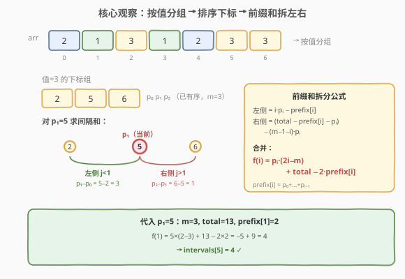
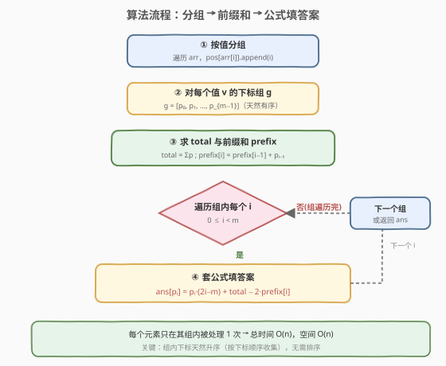
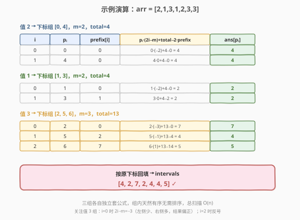

# 相同元素的间隔之和

- **题目名称**：相同元素的间隔之和
- **链接**：[2121. 相同元素的间隔之和](https://leetcode.cn/problems/intervals-between-identical-elements/)
- **难度**：中等
- **标签**：数组、哈希表、前缀和

## 1. 题目概述

给定一个下标从 0 开始、长度为 `n` 的整数数组 `arr`。两个元素的**间隔**定义为其下标的绝对差 `|i - j|`。返回长度为 `n` 的数组 `intervals`，其中 `intervals[i]` 是 `arr[i]` 与 `arr` 中**每个相同值元素**的间隔之和（不含自身，但自身贡献为 0，等价于含自身）。

**示例 1**：

```text
输入：arr = [2,1,3,1,2,3,3]
输出：[4,2,7,2,4,4,5]
解释：
- 下标 0：另一个 2 在下标 4，|0-4| = 4
- 下标 1：另一个 1 在下标 3，|1-3| = 2
- 下标 2：另两个 3 在下标 5、6，|2-5|+|2-6| = 7
- 下标 3：另一个 1 在下标 1，|3-1| = 2
- 下标 4：另一个 2 在下标 0，|4-0| = 4
- 下标 5：另两个 3 在下标 2、6，|5-2|+|5-6| = 4
- 下标 6：另两个 3 在下标 2、5，|6-2|+|6-5| = 5
```

**示例 2**：

```text
输入：arr = [10,5,10,10]
输出：[5,0,3,4]
解释：值 10 的下标组 [0,2,3]，值 5 仅出现一次，间隔和为 0。
```

**约束条件**：

- `n == arr.length`
- $1 \le n \le 10^5$
- $1 \le$ `arr[i]` $\le 10^5$

> 💡 本题与 [2615. 等值距离和](https://leetcode.cn/problems/sum-of-distances/) 完全相同。核心是经典的「**到所有同色点距离之和**」问题：同值元素的下标天然有序，可用**前缀和**把每个位置的距离和从 $O(m)$ 降到 $O(1)$，整体 $O(n)$。

---

## 2. 解题思路

### 2.1 暴力思路：按值分组 + 组内两两求距离

最直观的做法：用哈希表按值收集下标，得到若干「下标组」。对每个组里的每个下标 `p_i`，遍历组内所有下标 `p_j` 累加 `|p_i - p_j|`。

```text
for each value v:
    g = pos[v]                # 下标组，天然升序
    for i in 0..m-1:
        for j in 0..m-1:
            ans[g[i]] += abs(g[i] - g[j])
```

时间 $O\left(\sum m^2\right)$，最坏情况（所有元素同值）退化为 $O(n^2)$，$n = 10^5$ 时约 $10^{10}$ 次运算，**超时**。

> ⚠️ 暴力的问题：对每个 `p_i` 都重新遍历整组求距离，**没有复用组内已有序的结构**。突破口是观察——组内下标升序时，`p_i` 左侧的 `p_j` 都满足 `p_j < p_i`（绝对值可直接去括号），右侧同理。去绝对值后，距离和能用**前缀和** $O(1)$ 算出。

### 2.2 核心观察：前缀和拆左右

设某值对应下标组 $g = [p_0, p_1, \dots, p_{m-1}]$（按下标顺序收集，**天然升序**，无需排序）。对位置 $i$ 的元素 $p_i$，其间隔和：

$$f(i) = \sum_{j=0}^{m-1} |p_i - p_j|$$

由于组内有序，**按 $i$ 切成左右两半去绝对值**：

- **左侧** $j < i$：$p_j \le p_i$，$|p_i - p_j| = p_i - p_j$，共 $i$ 项：

$$\text{left} = i \cdot p_i - \sum_{j=0}^{i-1} p_j = i \cdot p_i - \text{prefix}[i]$$

- **右侧** $j > i$：$p_j \ge p_i$，$|p_i - p_j| = p_j - p_i$，共 $m-1-i$ 项。令 $\text{total} = \sum_{j=0}^{m-1} p_j$，则右侧下标和 $= \text{total} - \text{prefix}[i] - p_i$：

$$\text{right} = (\text{total} - \text{prefix}[i] - p_i) - (m-1-i) \cdot p_i$$

合并左右两半：

$$\boxed{f(i) = p_i \cdot (2i - m) + \text{total} - 2 \cdot \text{prefix}[i]}$$

其中 $\text{prefix}[i] = p_0 + p_1 + \dots + p_{i-1}$（前 $i$ 项之和，`prefix[0] = 0`）。



> 💡 **直觉理解**：$2i - m$ 是「左侧点数减右侧点数」。当 $i$ 偏左（$i < m/2$），左侧少、右侧多，向右的距离贡献占优；$p_i$ 越大、右侧点越多，结果越大。前缀和把「左侧下标和」与「右侧下标和」都压成 $O(1)$ 查询，这是把 $O(m)$ 降到 $O(1)$ 的关键。

> ⚠️ **为什么组内天然有序？** 因为遍历 `arr` 时按下标 `i` 从 0 到 `n-1` 顺序收集，`pos[arr[i]].append(i)` 自然把同值下标按升序存入。无需调用排序，省掉 $O(m \log m)$。

### 2.3 算法流程图



**完整步骤**：

1. **按值分组**：遍历 `arr`，`pos[arr[i]].append(i)`，得到每个值对应的升序下标组。
2. **逐组处理**：对每个值 `v` 的下标组 `g`（长度 `m`）：
   - 求 `total = sum(g)`；
   - 求前缀和 `prefix`（`prefix[0] = 0`，`prefix[i] = prefix[i-1] + g[i-1]`）；
   - 对组内每个 `i`，套公式 `ans[g[i]] = g[i] * (2*i - m) + total - 2 * prefix[i]`。
3. 返回 `ans`。

> ⚠️ **数据类型**：`p_i` 可达 $10^5$、`m` 可达 $10^5$，乘积与累加和可达 $10^{10}$，**C++ 必须用 `long long`**（否则 int 溢出）。Python 无需担心。

### 2.4 示例演算

以 `arr = [2,1,3,1,2,3,3]` 为例，三个下标组分别为：

- 值 2 → `[0, 4]`，`m=2`，`total=4`
- 值 1 → `[1, 3]`，`m=2`，`total=4`
- 值 3 → `[2, 5, 6]`，`m=3`，`total=13`



以**值 3 组** `[2, 5, 6]` 为例（`m=3, total=13`，`prefix = [0, 2, 7]`）：

| `i` | `p_i` | `2i-m` | `prefix[i]` | 计算 `p_i·(2i-m) + total - 2·prefix[i]` | `ans[p_i]` |
|-----|-------|--------|-------------|------------------------------------------|------------|
| 0 | 2 | $-3$ | 0 | $2 \times (-3) + 13 - 0 = 7$ | `ans[2] = 7` |
| 1 | 5 | $-1$ | 2 | $5 \times (-1) + 13 - 4 = 4$ | `ans[5] = 4` |
| 2 | 6 | $1$ | 7 | $6 \times 1 + 13 - 14 = 5$ | `ans[6] = 5` |

三组合并回填后得到 `intervals = [4, 2, 7, 2, 4, 4, 5]`，与示例一致。

> 💡 关注 `i` 从 0 到 2 时 $2i - m$ 从 $-3$ 变到 $+1$——这正是从「左侧少」到「右侧少」的转折，`p_i` 较大时正负号翻转影响显著。中间位置（`i=1`）左右点数接近，距离和较小。

---

## 3. 参考代码

### C++

```cpp
// 相同元素的间隔之和.cpp —— 按值分组 + 前缀和
// 编译: g++ -O2 -std=c++17 相同元素的间隔之和.cpp -o intervals
#include <vector>
#include <unordered_map>
using namespace std;

class Solution {
  public:
    vector<long long> getDistances(vector<int>& arr) {
        int n = arr.size();
        unordered_map<int, vector<int>> pos;
        pos.reserve(n);
        for (int i = 0; i < n; ++i) {
            pos[arr[i]].push_back(i);     // 天然升序
        }

        vector<long long> ans(n, 0);
        for (auto& [v, g] : pos) {
            int m = g.size();
            long long total = 0;
            for (int x : g) total += x;    // 组内下标总和

            long long prefix = 0;          // prefix[i] = sum(g[0..i-1])
            for (int i = 0; i < m; ++i) {
                // f(i) = g[i] * (2*i - m) + total - 2 * prefix
                ans[g[i]] = (long long)g[i] * (2 * i - m) + total - 2 * prefix;
                prefix += g[i];            // 滚动累加，供下一个 i 使用
            }
        }
        return ans;
    }
};
```

### Python

```python
class Solution:
    def getDistances(self, arr: list[int]) -> list[int]:
        from collections import defaultdict

        pos = defaultdict(list)
        for i, v in enumerate(arr):
            pos[v].append(i)               # 天然升序

        ans = [0] * len(arr)
        for g in pos.values():
            m = len(g)
            total = sum(g)
            prefix = 0                     # prefix[i] = sum(g[0..i-1])
            for i, p in enumerate(g):
                # f(i) = p * (2*i - m) + total - 2 * prefix
                ans[p] = p * (2 * i - m) + total - 2 * prefix
                prefix += p                # 滚动累加
        return ans
```

> 💡 **实现细节**：① 用「滚动变量」`prefix` 而非显式前缀和数组——遍历到 `i` 时 `prefix` 恰好是 `prefix[i]`（前 `i` 项和），套完公式后 `prefix += g[i]` 更新为 `prefix[i+1]`，省 $O(m)$ 空间。② 用 `unordered_map` / `defaultdict` 按值分组；因 `arr[i] <= 10^5`，也可改用 `vector<vector<int>> pos(MAXV+1)` 数组哈希避免开桶开销。③ C++ 的 `ans` 与中间量都用 `long long`，防止 $10^5 \times 10^5 = 10^{10}$ 溢出 `int`。

---

## 4. 复杂度分析

| 维度 | 复杂度 | 说明 |
|------|--------|------|
| **时间复杂度** | $O(n)$ | 每个下标入组 1 次、出组处理 1 次（$O(1)$ 套公式），总计 $O(n)$ |
| **空间复杂度** | $O(n)$ | 哈希表存所有下标，答案数组 $O(n)$；前缀和用滚动变量省到 $O(1)$ 额外空间 |

> ⚠️ 虽然有「组遍历 + 组内遍历」两层循环，但**每个元素在整个过程中只被处理一次**（入组一次、套公式一次），总操作 $2n$，与 [239. 滑动窗口最大值](../0201-0300/239_滑动窗口最大值.md) 单调队列的均摊分析同理。前缀和的滚动累加是 $O(1)$，不引入额外开销。

---

## 5. 扩展：增量递推法与相关问题

### 5.1 增量递推：从 $p_{i-1}$ 到 $p_i$ 的转移

除了前缀和公式，还有另一种 $O(n)$ 思路——**相邻位置的增量递推**。设 $f(i)$ 为 $p_i$ 的间隔和。当从 $p_{i-1}$ 移动到 $p_i$ 时（$p_i > p_{i-1}$）：

- 左侧 $i$ 个点（$j \le i-1$）都变远 $\Delta = p_i - p_{i-1}$，贡献 $+i \cdot \Delta$；
- 右侧 $m - i$ 个点（$j \ge i$）都变近 $\Delta$，贡献 $-(m-i) \cdot \Delta$。

$$f(i) = f(i-1) + (2i - m) \cdot (p_i - p_{i-1})$$

基准 $f(0) = \text{total} - m \cdot p_0$（所有点都在右侧）。这与前缀和公式**完全等价**（差分求和即得原公式），只是把「前缀和」换成了「滚动递推」。

```python
# 增量递推版本（等价 O(n)）
for g in pos.values():
    m = len(g)
    total = sum(g)
    f0 = total - m * g[0]
    ans[g[0]] = f0
    for i in range(1, m):
        ans[g[i]] = ans[g[i-1]] + (2 * i - m) * (g[i] - g[i-1])
```

> 💡 增量法的优势是**无需前缀和数组**，且能自然推广到「动态插入点」的场景（如带更新的距离和查询）。前缀和公式更直观、便于面试讲清「左右拆分」的来源。两者任选其一即可。

### 5.2 与「到所有点距离之和」的关系

本题是经典几何问题「**数轴上一点到所有给定点距离之和**」的分组版——每组同值下标构成数轴上的点集，对每个点求到同集其他点的距离和。该问题的通用结论：

- **中位数定理**：到所有点距离之和最小的点是**中位数**。本题不求最值，而是求每个点的距离和，但前缀和正是刻画「任意一点距离和」的标准工具。
- 前缀和公式 $f(i) = p_i(2i - m) + \text{total} - 2 \cdot \text{prefix}[i]$ 适用于**任意有序点集**，不限于下标。

### 5.3 2615 等值距离和（同题）

[2615. 等值距离和](https://leetcode.cn/problems/sum-of-distances/) 与本题**题意、数据范围完全相同**，仅输入输出形式微调。掌握本题模板即可直接迁移。

---

## 6. 面试要点

1. **为什么组内下标天然有序？还需要排序吗？**

   - 不需要。遍历 `arr` 时按下标 `i` 从 0 到 `n-1` 顺序执行 `pos[arr[i]].append(i)`，同值下标按升序入组。利用这一点可直接去绝对值拆左右，省掉 $O(m \log m)$ 排序。若题目改成「无序收集」（如流式数据），才需排序或用有序结构维护。

2. **前缀和公式 $f(i) = p_i(2i-m) + \text{total} - 2\cdot\text{prefix}[i]$ 怎么推导？**

   - 组内有序，按 $i$ 切左右：左侧 $j<i$ 共 $i$ 项，距离 $= p_i - p_j$，和 $= i \cdot p_i - \text{prefix}[i]$；右侧 $j>i$ 共 $m-1-i$ 项，距离 $= p_j - p_i$，和 $= (\text{total} - \text{prefix}[i] - p_i) - (m-1-i)p_i$。两式相加合并同类项即得。关键是去绝对值依赖有序性。

3. **为什么必须用 `long long`？**

   - $n, \text{arr}[i] \le 10^5$，最坏单组 $m = n = 10^5$、$p_i \approx 10^5$，则 $p_i \cdot m \approx 10^{10}$，`total` 可达 $\sum i \approx 5 \times 10^9$，均远超 32 位 `int` 上界（约 $2.1 \times 10^9$）。C++ 必须用 `long long`；Python 整数自动扩容无需关心。

4. **增量递推法和前缀和法哪个更好？**

   - 两者等价、均 $O(n)$。前缀和法更直观（左右拆分清晰），增量法无需前缀和数组、且 $f(i) = f(i-1) + (2i-m)\Delta$ 形式更紧凑。面试建议先讲前缀和法（便于推导），再提增量法作为延伸，展示对问题的多角度理解。

5. **能否用「中位数 + 前缀和」只求最小距离和？**

   - 可以。若问题改为「求同值元素间隔和的最小值」，由中位数定理，最小值出现在组内中位数位置，用前缀和 $O(1)$ 算中位数处的 $f$ 即可。但本题要求**每个**位置的间隔和，故需对每个 `i` 套公式，仍 $O(n)$。

> 💡 **一句话总结**：2121 是「数轴上到所有同色点距离之和」的分组版——同值下标天然有序，用前缀和把每个位置的 $O(m)$ 距离和压成 $O(1)$ 公式 $f(i) = p_i(2i-m) + \text{total} - 2\cdot\text{prefix}[i]$，整体 $O(n)$。核心是「去绝对值拆左右 + 前缀和降阶」，与 2615 同题、与所有「有序点集距离和」问题同构。

---

## 7. 同类练习题

- [2615. 等值距离和](https://leetcode.cn/problems/sum-of-distances/)：与本题完全相同的题，模板直接迁移
- [462. 最小移动次数使数组元素相等 II](https://leetcode.cn/problems/minimum-moves-to-equal-array-elements-ii/)：数轴上到所有点距离之和的最小值（中位数定理），本题的「最值」变体
- [296. 最佳的碰头点](https://leetcode.cn/problems/best-meeting-point/)：二维网格上到所有 1 的曼哈顿距离之和最小（行列独立取中位数），中位数定理的二维延伸
- [1685. 有序数组中绝对差之和](https://leetcode.cn/problems/sum-of-absolute-differences-in-a-sorted-array/)：有序数组每个元素到其他元素绝对差之和，本题的「整组同值」退化为「全数组有序」版，前缀和公式同构
- [3086. 拾起 K 个 1 需要的最小行动数](https://leetcode.cn/problems/minimum-moves-to-pick-k-ones/)：数轴距离和 + 滑窗中位数，本题前缀和技巧的进阶组合
