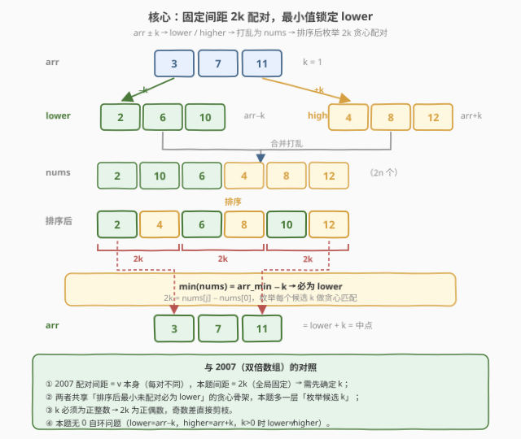
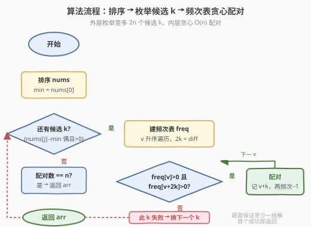
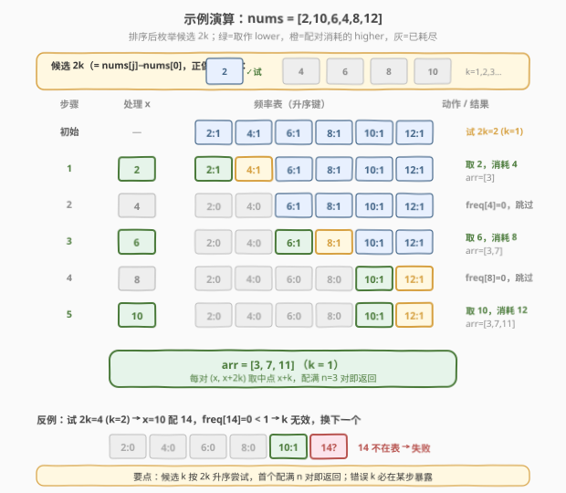

# LeetCode 还原原数组 题解

## 1. 题目概述

- **标题 / 题号**：还原原数组（#2122，hard）
- **链接**：https://leetcode.cn/problems/recover-the-original-array/
- **难度**：困难
- **标签**：数组、排序、贪心、哈希表、枚举

**题意**：Alice 有一个下标从 0 开始、由 $n$ 个正整数组成的数组 `arr`。她任选一个**正整数** $k$，按下述方式构造两个长度均为 $n$ 的新数组：

- `lower[i] = arr[i] - k`
- `higher[i] = arr[i] + k`

然后她把 `lower` 与 `higher` 合并、**打乱**，得到一个长度为 $2n$ 的数组 `nums`。不幸的是，Alice 丢失了 `arr`、`lower`、`higher` 三个数组，只记得 `nums` 中出现的所有整数（但不知道每个数属于 `lower` 还是 `higher`）。

给定 `nums`（恰好 $n$ 个来自 `lower`、$n$ 个来自 `higher`），还原并返回**任一**合法的 `arr`。题目保证至少存在一组有效解。

**示例 1**：

```text
输入：nums = [2,10,6,4,8,12]
输出：[3,7,11]
解释：arr = [3,7,11]，k = 1 → lower = [2,6,10]，higher = [4,8,12]，合并打乱即 nums。
      另一组合法解为 arr = [5,7,9]，k = 3。
```

**示例 2**：

```text
输入：nums = [1,1,3,3]
输出：[2,2]
解释：arr = [2,2]，k = 1 → lower = [1,1]，higher = [3,3]。
      注意 arr 不能是 [1,3]：那样 k = 0，而 k 必须为正整数。
```

**示例 3**：

```text
输入：nums = [5,435]
输出：[220]
解释：arr = [220]，k = 215 → lower = [5]，higher = [435]。
```

**约束**：

- $2 \cdot n = \text{nums.length}$
- $1 \le n \le 1000$
- $1 \le \text{nums}[i] \le 10^9$
- 生成的测试用例保证存在至少一个有效数组 `arr`

> 💡 **审题关键**：① $k$ 是**正整数**（$k \ge 1$），所以 $2k$ 为**正偶数**——这是候选剪枝的依据；② `lower` 与 `higher` **元素个数各为 $n$**，且每对 $(\text{lower}[i], \text{higher}[i])$ 的差**恒为 $2k$（全局固定）**，与 [2007. 从双倍数组中还原原数组](../2001-2100/2007_从双倍数组中还原原数组.md)「每对差 $= v$ 本身（逐对不同）」形成对照；③ 答案可能不唯一，返回任一即可——这意味着只要能凑出 $n$ 对差为 $2k$ 的配对，每组取中点即为合法 `arr`。

## 2. 解题思路

### 2.1 暴力思路：枚举 k 与配对

最直观的做法：枚举所有可能的 $k$（$1 \le k \le (\max - \min)/2$），对每个 $k$ 尝试把 `nums` 划分成 $n$ 个差为 $2k$ 的二元组 $(a, b)$（$b - a = 2k$），每组取中点 $a + k$ 作为 `arr` 元素。若存在完美匹配则返回。

- **正确性**：覆盖所有 $k$，存在即返回。
- **效率**：$k$ 的取值范围可达 $10^9$，根本枚举不完；即便离散化为「$\text{nums}[j] - \text{nums}[i]$ 的一半」，候选仍有 $O(n^2)$ 个，每个再做指数级匹配枚举，完全不可行。

> ⚠️ 暴力的瓶颈有二：① $k$ 的搜索空间巨大；② 盲目配对是指数级。突破口在于两个结构观察——**最小值锁定 `lower`**（压缩 $k$ 的候选到 $O(n)$ 个），以及**排序后最小未配对元素身份唯一**（把匹配降维成线性贪心）。

### 2.2 核心观察：最小值必为 lower，固定间距 2k 贪心配对



关键洞察分三步：

**第一步：排序后 $\text{nums}[0]$ 必为 `lower` 元素。** 把 `nums` 升序排序。设 $\text{arr}_{\min} = \min(\text{arr})$，则 $\text{arr}_{\min} - k$ 与 $\text{arr}_{\min} + k$ 都在 `nums` 中，且对任意 $i$ 有 $\text{arr}[i] - k \ge \text{arr}_{\min} - k$。所以 $\min(\text{nums}) = \text{arr}_{\min} - k$，即**全局最小值一定属于 `lower`**。它的配对（`higher`）是 $\text{nums}[0] + 2k$，必在 `nums` 中出现。这把 $2k$ 的候选压缩到 $\{\text{nums}[j] - \text{nums}[0] : j > 0\}$，至多 $2n - 1$ 个。

**第二步：$2k$ 必为正偶数，候选可大幅剪枝。** $k$ 为正整数 ⇒ $2k \ge 2$ 且为偶数。所以只考虑 $\text{nums}[j] - \text{nums}[0] > 0$ 且为偶数的候选，去重后逐一尝试。

**第三步：固定 $k$ 后，排序 + 频率表贪心配对（每步被迫选择）。** 对每个候选 $2k$，用频率表 `freq` 从小到大扫描。对最小未配对键 $x$（$\text{freq}[x] > 0$）：所有 $< x$ 的值都已配完，$x$ 不可能是任何更小 `lower` 的 `higher`（那些已被消耗），故 $x$ **只能是 `lower`**；它的 `higher` 只能是 $x + 2k$，要求 $\text{freq}[x + 2k] \ge \text{freq}[x]$，否则此 $k$ 无效。配对后消耗 $\text{freq}[x]$ 个 $x + 2k$，记录 $\text{freq}[x]$ 个 $x + k$ 作为 `arr` 元素。

$$\boxed{\text{排序后逐键贪心：} x \text{ 最小未配对} \Rightarrow x \text{ 为 lower，消耗 } \text{freq}[x] \text{ 个 } x+2k,\ \text{arr} \leftarrow x+k}$$

> 💡 **为什么贪心是「被迫」的，无需交换论证？** 每步处理最小未配对 $x$ 时，它的身份（`lower`）和它的配对（$x + 2k$）都唯一确定——没有别的合法选项。既然每步只有一种选择，贪心产出的就是唯一可能的匹配。这种「唯一性」比交换论证更直接，与 [2007](../2001-2100/2007_从双倍数组中还原原数组.md) 的论证同源。

> ⚠️ **与 2007 的关键区别**：2007 的配对间距 $= v$（逐对不同，由元素值本身决定，$k$ 已知无需枚举）；本题配对间距 $= 2k$（全局固定但 $k$ 未知），所以多一层「枚举候选 $k$」。两者共享「排序后最小未配对必为 `lower`」的贪心骨架。另外本题 $k > 0$ 保证 $\text{lower} \ne \text{higher}$，**没有 2007 中 $v = 0$ 的自环特例**，无需奇偶特判。

> ⚠️ **为何无需担心「假阳性」？** 若某错误 $k$ 恰好也配满 $n$ 对，那这 $n$ 对每对差恰为 $2k$，取中点 $x + k$ 即得到合法 `arr`（`lower` = 中点 $- k$、`higher` = 中点 $+ k$）。所以**任何配满的 $k$ 都对应一组真实解**，不存在误判——题目要求返回任一解，正中下怀。

### 2.3 算法流程图



1. **排序** `nums`（$O(n \log n)$）。
2. **枚举候选 $2k$**：遍历 $j = 1 \dots 2n-1$，令 $d = \text{nums}[j] - \text{nums}[0]$；若 $d > 0$、$d$ 为偶数、且未试过（去重），作为候选 $2k$。
3. **贪心匹配**（对每个候选 $2k$）：
   - 建频率表 `freq`，取升序键；
   - 对每个键 $x$：若 $\text{freq}[x] = 0$ 跳过；否则要求 $\text{freq}[x + 2k] \ge \text{freq}[x]$，不满足则此 $k$ 失败、换下一个；满足则记录 $\text{freq}[x]$ 个 $x + k$，消耗 $\text{freq}[x + 2k]$，置 $\text{freq}[x] = 0$；
   - 全部键配完且凑满 $n$ 对 → 返回结果。
4. 题目保证有解，必有某候选 $k$ 成功。

> 💡 **为何按 $2k$ 升序尝试？** 候选 $2k$ 由小到大对应 $k$ 由小到大。最先配满的即返回，无需遍历全部候选。最坏情况仍 $O(n)$ 个候选 × $O(n)$ 匹配 = $O(n^2)$，但实际往往首个（最小 $2k$）就命中。

### 2.4 示例演算

以示例 1 `nums = [2,10,6,4,8,12]` 演示，排序后 `[2,4,6,8,10,12]`，$\text{nums}[0] = 2$：



候选 $2k \in \{2, 4, 6, 8, 10\}$（正偶去重），先试 $2k = 2$（$k = 1$）：

| 步骤 | 处理 $x$ | 频率表变化 | 动作 |
|------|---------|-----------|------|
| 初始 | — | `{2:1, 4:1, 6:1, 8:1, 10:1, 12:1}` | 试 $2k=2$ |
| 1 | $2$ | `4:1→0`，`2:1→0` | 取 $2$ 为 lower，消耗 $4$；`arr=[3]` |
| 2 | $4$ | `freq[4]=0` | 跳过 |
| 3 | $6$ | `8:1→0`，`6:1→0` | 取 $6$ 为 lower，消耗 $8$；`arr=[3,7]` |
| 4 | $8$ | `freq[8]=0` | 跳过 |
| 5 | $10$ | `12:1→0`，`10:1→0` | 取 $10$ 为 lower，消耗 $12$；`arr=[3,7,11]` |

配满 $n = 3$ 对，返回 `[3,7,11]`。

> 💡 **观察要点**：① $\text{nums}[0] = 2$ 必为 lower，其 higher $= 4$，故 $2k = 2$ 是首个候选；② 每步最小未配对被迫当 lower，其 $x + 2k$ 必须在场；③ 若试 $2k = 4$（$k=2$），到 $x = 10$ 时需配 $14$，`freq[14] = 0 < 1` → 失败，换下一个候选。

## 3. 参考代码

### C++

```cpp
class Solution {
public:
    vector<int> recoverArray(vector<int>& nums) {
        sort(nums.begin(), nums.end());
        int n2 = nums.size();
        unordered_set<int> seen;
        for (int j = 1; j < n2; ++j) {
            int d = nums[j] - nums[0];
            if (d > 0 && d % 2 == 0 && !seen.count(d)) {
                seen.insert(d);
                vector<int> res;
                if (tryK(nums, d, res)) return res;
            }
        }
        return {};
    }
private:
    bool tryK(const vector<int>& nums, int d, vector<int>& res) {
        map<long long,int> freq;
        for (int x : nums) freq[x]++;
        for (auto& [x, c] : freq) {
            if (c == 0) continue;
            long long y = x + d;
            auto it = freq.find(y);
            if (it == freq.end() || it->second < c) return false;
            res.insert(res.end(), c, (int)(x + d / 2));
            it->second -= c;
            c = 0;
        }
        return true;
    }
};
```

### Python

```python
class Solution:
    def recoverArray(self, nums: List[int]) -> List[int]:
        nums.sort()
        n2 = len(nums)
        seen = set()
        for j in range(1, n2):
            d = nums[j] - nums[0]
            if d > 0 and d % 2 == 0 and d not in seen:
                seen.add(d)
                res = self._try_k(nums, d)
                if res:
                    return res
        return []

    def _try_k(self, nums, d):
        from collections import Counter
        freq = Counter(nums)
        res = []
        for x in sorted(freq):
            c = freq[x]
            if c == 0:
                continue
            if freq.get(x + d, 0) < c:
                return []
            res.extend([x + d // 2] * c)
            freq[x + d] -= c
            freq[x] = 0
        return res
```

> 💡 **写法对照**：两版逻辑完全一致——排序 + 枚举正偶候选 $2k$（去重）+ 频率表升序键贪心。C++ 用 `map<long long,int>` 保证键有序且 $x + d$ 不溢出（$\text{nums}[i] \le 10^9$，$x + d \le 2 \times 10^9$ 接近 `INT_MAX`，用 `long long` 最稳妥）；Python 的 `sorted(freq)` 在调用时物化键列表，后续修改 `freq` 不影响迭代。注意 `freq.get(x+d, 0)` 处理 $x + 2k$ 不在表中的情况。

> 💡 **溢出提示**：$x + d$ 最高 $2 \times 10^9$，虽 $< \text{INT\_MAX} \approx 2.147 \times 10^9$ 但临界，C++ 建议用 `long long` 做 `y = x + d` 再查表，避免意外。结果 $x + d/2 = \text{arr}[i] < 10^9$，安全落在 `int` 内。

## 4. 复杂度分析

| 维度 | 复杂度 | 说明 |
|------|--------|------|
| 时间复杂度 | $O(n^2)$ | 至多 $O(n)$ 个去重候选 $2k$，每个 `_try_k` 建表 $O(n)$ + 升序键扫描 $O(n)$（`map`/`sorted` 含 $O(n \log n)$，但 $n \le 1000$ 时与 $O(n)$ 同阶）；排序 $O(n \log n)$ 非主项 |
| 空间复杂度 | $O(n)$ | 频率表 + 结果数组 + 候选去重集合，均为 $O(n)$ |

> 💡 $n \le 1000$，$O(n^2) \approx 10^6$ 完全宽裕。本题的优雅在于两层降维：①「最小值锁定 lower」把 $k$ 的搜索空间从 $O(10^9)$ 压到 $O(n)$；②「最小未配对身份唯一」把指数级匹配降到线性贪心。

## 5. 扩展：双指针匹配与候选优化

### 5.1 双指针代替频率表

除了频率表 + 升序键，固定 $2k$ 后还可用**双指针 + `used` 标记数组**匹配：排序 `nums`，维护指针 `i` 找最小未用元素作为 lower，再二分/线性找 `nums[i] + 2k` 作为 higher 并标记。由于已排序，可用一个指针 `j` 单调推进找配对：

```python
def _try_k_two_ptr(self, nums, d):
    used = [False] * len(nums)
    res = []
    j = 0
    for i in range(len(nums)):
        if used[i]:
            continue
        j = max(j, i + 1)
        while j < len(nums) and (nums[j] - nums[i] < d or used[j]):
            j += 1
        if j == len(nums) or nums[j] - nums[i] != d:
            return []
        used[j] = True
        res.append(nums[i] + d // 2)
    return res
```

正确性同频率表版（最小未用必为 lower），复杂度 $O(n)$（`j` 单调不回退）。频率表版更贴近 [2007](../2001-2100/2007_从双倍数组中还原原数组.md) 的写法、便于讲解；双指针版常数更小、空间更省。

### 5.2 候选数优化

候选 $2k = \text{nums}[j] - \text{nums}[0]$ 已是 $O(n)$ 个。可进一步观察到：题目保证有解，且 $\text{nums}[0]$ 是 $\text{arr}_{\min} - k$，故**正确 $2k$ 一定在候选中**。按 $2k$ 升序尝试，最小合法 $k$ 通常最先命中，平均尝试次数远小于 $n$。最坏仍 $O(n^2)$，但 $n \le 1000$ 足够。

> ⚠️ 切勿枚举所有 $\text{nums}[j] - \text{nums}[i]$（$i < j$）作候选——那是 $O(n^2)$ 个候选 × $O(n)$ 匹配 = $O(n^3)$，$n = 1000$ 时 $10^9$ 超时。「$\text{nums}[0]$ 必为 lower」正是把候选压到 $O(n)$ 的关键。

## 6. 面试要点

**Q1：为什么排序后 $\text{nums}[0]$ 一定是 `lower` 元素，而不是 `higher`？**

> 设 $\text{arr}_{\min} = \min(\text{arr})$。$\text{arr}_{\min} - k$ 与 $\text{arr}_{\min} + k$ 都在 `nums` 中，且对任意 $i$，$\text{arr}[i] - k \ge \text{arr}_{\min} - k$、$\text{arr}[i] + k > \text{arr}_{\min} - k$。故 $\min(\text{nums}) = \text{arr}_{\min} - k$，必属 `lower`。它的 `higher` 配对 $= \text{nums}[0] + 2k$ 必在 `nums` 中——这把 $2k$ 的候选锁定为 $\text{nums}[j] - \text{nums}[0]$。

**Q2：为什么 $2k$ 必须是正偶数？如何利用？**

> $k$ 是正整数（$k \ge 1$），故 $2k \ge 2$ 且为偶数。候选 $d = \text{nums}[j] - \text{nums}[0]$ 中，$d \le 0$ 或 $d$ 为奇数直接剪枝。这把候选数减半并去掉非法 $k = 0$ 的情况（对应示例 2 中 `arr = [1,3]` 的反例）。

**Q3：贪心匹配的正确性如何保证？需要交换论证吗？**

> 不需要。每步处理最小未配对 $x$ 时，所有 $< x$ 的值已配完，$x$ 不可能是任何已处理 `lower` 的 `higher`（那些 `higher` $= \text{lower} + 2k$ 已被消耗），故 $x$ 只能是 `lower`，配对只能是 $x + 2k$。每步唯一选择 ⇒ 贪心即唯一合法匹配，不存在更优解。这是「被迫选择」型贪心，比交换论证更强。

**Q4：如果某个错误 $k$ 也凑满 $n$ 对，会不会返回错误答案？**

> 不会。若某 $k$ 配满 $n$ 对，则 `nums` 被划分成 $n$ 个差为 $2k$ 的二元组 $(a, b)$，取中点 $a + k$ 即得 `arr`，满足 `lower = arr - k`、`higher = arr + k` 重组后恰为 `nums`。所以**任何配满的 $k$ 都对应真实解**，题目要求返回任一解，完全合法。

**Q5：本题与 2007（双倍数组）的异同？**

> 同：都靠「排序后最小未配对必为 lower/原值」做贪心配对，都用频率表批量消耗。异：① 2007 配对间距 $= v$（逐对不同，$k$ 即元素值已知，无需枚举）；本题间距 $= 2k$（全局固定但 $k$ 未知），多一层「枚举候选 $k$」，故 $O(n^2)$ vs 2007 的 $O(n \log n)$；② 2007 有 $v = 0$ 自环特例（`0×2=0` 须成对）；本题 $k > 0$ 保证 `lower ≠ higher`，无自环，无需奇偶特判。

> 💡 **一句话总结**：排序后最小值必为 lower → 枚举 $2k = \text{nums}[j] - \text{nums}[0]$（正偶去重）→ 频率表升序键贪心配对（最小未配对被迫当 lower，消耗 $x + 2k$，取中点 $x + k$）→ 配满 $n$ 对即返回，$O(n^2)$。

## 同类练习题

| # | 题目 | 与本题的关联 |
|---|------|-------------|
| 2007 | [从双倍数组中还原原数组](https://leetcode.cn/problems/find-original-array-from-doubled-array/)（[题解](../2001-2100/2007_从双倍数组中还原原数组.md)） | 配对间距逐对变化（$= v$）的「还原数组」原型，本题是其「固定间距 $2k$」泛化，共享排序贪心骨架，对照 $k$ 已知 vs 需枚举 |
| 954 | [二倍数对数组](https://leetcode.cn/problems/array-of-doubled-pairs/) | 判定能否分成 $v/2v$ 对，2007 的判定版，与本题同属「固定/可变间距配对」家族 |
| 350 | [两个数组的交集 II](https://leetcode.cn/problems/intersection-of-two-arrays-ii/) | 频率表计数 + 配对取最小频次，与本题「消耗 `freq[x]` 个 $x+2k$」的批量消耗逻辑同源 |
| 1 | [两数之和](https://leetcode.cn/problems/two-sum/)（[题解](../0001-0100/1_两数之和.md)） | 在数组中为元素找配对的基础题，本题是「固定差值配对 + 完美匹配」的进阶，哈希计数思想一脉相承 |
| 410 | [分割数组的最大值](https://leetcode.cn/problems/split-array-largest-sum/)（[题解](../0401-0500/410_分割数组的最大值.md)） | 同样依赖「枚举答案 + 贪心验证」的二分答案范式，本题是「枚举候选 $k$ + 贪心验证」的离散版，对照两类枚举验证思路 |
