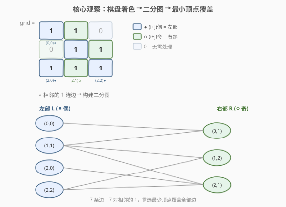
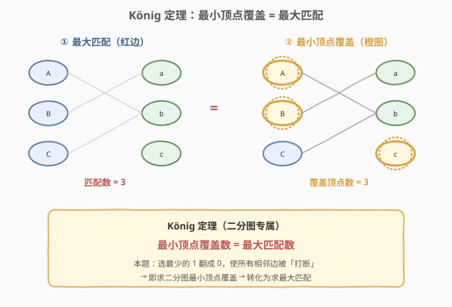

# LeetCode 使矩阵中的 1 互不相邻的最小操作数 题解

## 1. 题目概述

- **标题 / 题号**：使矩阵中的 1 互不相邻的最小操作数（#2123，hard）
- **链接**：https://leetcode.cn/problems/minimum-operations-to-remove-adjacent-ones-in-matrix/
- **难度**：困难
- **标签**：二分图匹配、匈牙利算法、图论、矩阵、网络流

**题意**：给定一个下标从 0 开始的 $m \times n$ 二进制矩阵 `grid`。每次操作可以选择任意一个值为 `1` 的格子，将其变为 `0`。

如果矩阵中没有任何一个 `1` 与另一个 `1` 在**四连通**方向（上、下、左、右）上相邻，则称该矩阵是**完全独立**（well-isolated）的。

返回使 `grid` 成为完全独立矩阵的**最小操作数**。

**示例 1**：

```text
输入：grid = [[1,1,0],[0,1,1],[1,1,1]]
输出：3
解释：将 grid[0][1]、grid[1][2]、grid[2][1] 变为 0 后，
      没有任何两个 1 四连通相邻，矩阵完全独立。
```

**示例 2**：

```text
输入：grid = [[0,0,0],[0,0,0],[0,0,0]]
输出：0
解释：矩阵中没有 1，已经完全独立。
```

**示例 3**：

```text
输入：grid = [[0,1],[1,0]]
输出：0
解释：两个 1 位于对角线，不四连通相邻，已经完全独立。
```

**约束**：

- $m = \text{grid.length}$
- $n = \text{grid}[i].\text{length}$
- $1 \le m, n \le 300$
- $\text{grid}[i][j]$ 为 $0$ 或 $1$

> 💡 本题是经典的**二分图最小顶点覆盖**问题。关键观察：棋盘式的 $(i+j) \bmod 2$ 染色将矩阵天然二分，相邻的 1 必定异色，构成二分图。「选最少的 1 翻 0 使所有相邻边被打断」就是最小顶点覆盖，由 **König 定理**转化为求**最大匹配**，用匈牙利算法求解。

## 2. 解题思路

### 2.1 暴力思路：枚举子集

最直观的做法：枚举所有值为 1 的格子的子集，检查删除该子集后是否还有相邻的 1，取最小子集大小。

```text
ones = 所有值为 1 的格子集合
for mask in 0 .. 2^|ones| - 1:
    removed = ones 中 mask 对应的子集
    if 删除 removed 后无相邻 1:
        ans = min(ans, |removed|)
```

若有 $k$ 个 1，子集数为 $2^k$，$k$ 可达 $mn = 90000$，完全不可行。

> ⚠️ 暴力的问题：把「选哪些 1 删除」当成无结构子集枚举，**没有利用相邻关系的图结构**。突破口是观察——相邻的 1 构成图的边，问题等价于图论中的最小顶点覆盖。

### 2.2 核心观察：二分图最小顶点覆盖

**观察 1：棋盘染色 → 天然二分图**

将矩阵按 $(i+j) \bmod 2$ 染色（类似国际象棋棋盘）：

- **偶数格** $(i+j)$ 为偶数：归入左部 $L$（蓝色）
- **奇数格** $(i+j)$ 为奇数：归入右部 $R$（绿色）

任意两个四连通相邻的格子，其 $i+j$ 奇偶性必定不同（一个走行/列差 1），因此**相邻的 1 一定分属不同部**——这天然构成二分图。

**观察 2：问题 = 最小顶点覆盖**

将每个值为 1 的格子作为顶点，相邻的 1 之间连边。目标「选最少的 1 翻 0，使所有相邻边被打断」等价于：**选取最少的顶点，使每条边至少有一个端点被选中**——这正是**最小顶点覆盖**（Minimum Vertex Cover）。

**观察 3：König 定理转化为最大匹配**

在一般图中，最小顶点覆盖是 NP-hard 问题。但在**二分图**中，由 **König 定理**保证：

$$\text{最小顶点覆盖数} = \text{最大匹配数}$$

因此只需用**匈牙利算法**求二分图最大匹配，匹配数即为答案。



> 💡 **直觉理解**：最大匹配的每条匹配边都需要至少一个端点在覆盖集中。匈牙利算法找到最大匹配后，通过交替路径可以构造出等大小的顶点覆盖（左部非交替可达 $\cup$ 右部交替可达），证明二者相等。

### 2.3 算法流程图



**完整步骤**：

1. **遍历矩阵**：对每个值为 1 且 $(i+j)$ 为奇数的格子（右部），检查其上、下、左、右四个方向的邻居，若邻居也为 1，则在二分图中连一条边（右部 → 左部）。
2. **匈牙利算法**：对每个右部顶点，用 DFS 寻找增广路径。若找到则匹配数 +1。
3. **返回匹配数**：由 König 定理，匹配数 = 最小顶点覆盖数 = 最小操作数。

> ⚠️ **为什么只遍历奇数格？** 二分图最大匹配只需从一侧出发找增广路径。固定从右部（奇数格）出发，避免重复计数。每个右部顶点的邻居天然属于左部（偶数格）。

### 2.4 示例演算

以 `grid = [[1,1,0],[0,1,1],[1,1,1]]` 为例：

- **左部** $L$（偶数格，值为 1）：$(0,0), (1,1), (2,0), (2,2)$ — 4 个顶点
- **右部** $R$（奇数格，值为 1）：$(0,1), (1,2), (2,1)$ — 3 个顶点
- **边**（相邻的 1）：7 条

匈牙利算法逐个处理右部顶点：

| 顺序 | 右部顶点 | 增广路径 | 匹配结果 |
|------|----------|----------|----------|
| 1 | $(0,1)$ | $(0,1) \to (0,0)$ | $(0,0) \leftrightarrow (0,1)$ |
| 2 | $(1,2)$ | $(1,2) \to (1,1)$ | $(1,1) \leftrightarrow (1,2)$ |
| 3 | $(2,1)$ | $(2,1) \to (2,0)$ | $(2,0) \leftrightarrow (2,1)$ |

最大匹配 = 3 → 最小顶点覆盖 = 3 → 答案 = **3**。

![示例演算：[[1,1,0],[0,1,1],[1,1,1]] → 输出 3](../images/minops_adjacent_example.svg)

移除顶点覆盖中的 3 个格子 $(0,1), (1,2), (2,1)$ 后，剩余的 1 互不相邻，矩阵完全独立。

> 💡 本例中右部恰好 3 个顶点全部匹配成功。若某右部顶点无法找到增广路径（所有邻居已被匹配且无法腾挪），则匹配数小于右部顶点数，说明该顶点无需删除（它的所有邻居已被覆盖）。

## 3. 参考代码

### C++

```cpp
// 使矩阵中的1互不相邻的最小操作数.cpp —— 二分图最大匹配（匈牙利算法）
// 编译: g++ -O2 -std=c++17 使矩阵中的1互不相邻的最小操作数.cpp -o minops
#include <vector>
#include <cstring>
using namespace std;

class Solution {
  public:
    int minimumOperations(vector<vector<int>>& grid) {
        int m = grid.size(), n = grid[0].size();
        // 邻接表：g[i] 存储右部顶点 i 的所有左部邻居
        vector<vector<int>> g(m * n);
        int dirs[4][2] = {{-1, 0}, {1, 0}, {0, -1}, {0, 1}};

        for (int i = 0; i < m; ++i) {
            for (int j = 0; j < n; ++j) {
                if ((i + j) % 2 == 1 && grid[i][j] == 1) {  // 右部（奇数格）
                    int u = i * n + j;
                    for (auto& d : dirs) {
                        int ni = i + d[0], nj = j + d[1];
                        if (ni >= 0 && ni < m && nj >= 0 && nj < n && grid[ni][nj] == 1) {
                            g[u].push_back(ni * n + nj);  // 右部 u → 左部 v
                        }
                    }
                }
            }
        }

        vector<int> match(m * n, -1);   // match[v] = 左部 v 被哪个右部匹配
        int ans = 0;

        for (int u = 0; u < m * n; ++u) {
            if (g[u].empty()) continue;
            vector<int> vis(m * n, 0);
            ans += dfs(u, g, match, vis);
        }
        return ans;
    }

  private:
    bool dfs(int u, vector<vector<int>>& g, vector<int>& match, vector<int>& vis) {
        for (int v : g[u]) {
            if (!vis[v]) {
                vis[v] = 1;
                if (match[v] == -1 || dfs(match[v], g, match, vis)) {
                    match[v] = u;
                    return true;
                }
            }
        }
        return false;
    }
};
```

### Python

```python
class Solution:
    def minimumOperations(self, grid: list[list[int]]) -> int:
        from collections import defaultdict

        m, n = len(grid), len(grid[0])
        g = defaultdict(list)
        dirs = [(-1, 0), (1, 0), (0, -1), (0, 1)]

        for i in range(m):
            for j in range(n):
                if (i + j) % 2 == 1 and grid[i][j] == 1:  # 右部（奇数格）
                    u = i * n + j
                    for di, dj in dirs:
                        ni, nj = i + di, j + dj
                        if 0 <= ni < m and 0 <= nj < n and grid[ni][nj] == 1:
                            g[u].append(ni * n + nj)       # 右部 u → 左部 v

        match = [-1] * (m * n)    # match[v] = 左部 v 被哪个右部匹配

        def find(u: int) -> int:
            for v in g[u]:
                if v not in vis:
                    vis.add(v)
                    if match[v] == -1 or find(match[v]):
                        match[v] = u
                        return 1
            return 0

        ans = 0
        for u in g:               # 只遍历有邻边的右部顶点
            vis = set()
            ans += find(u)
        return ans
```

> 💡 **实现细节**：① 只遍历 $(i+j)$ 为奇数且值为 1 的格子构建邻接表，减少一半遍历量。② `match[v]` 记录左部顶点 `v` 被哪个右部顶点匹配，初始 $-1$ 表示未匹配。③ DFS 增广时用 `vis` 集合避免同一轮中重复访问左部顶点——每轮增广的 `vis` 必须独立重置。④ 顶点编号用 $i \times n + j$ 展平为一维，简化邻接表与 `match` 数组管理。

## 4. 复杂度分析

| 维度 | 复杂度 | 说明 |
|------|--------|------|
| **时间复杂度** | $O(V \cdot E)$ | $V$ 为右部顶点数（$\le mn/2$），$E$ 为边数（$\le 2mn$）。每次 DFS 增广最坏遍历所有边，共 $V$ 次增广。最坏 $O(m^2 n^2)$，但网格图增广路径短，实际运行远快于上界 |
| **空间复杂度** | $O(m \cdot n)$ | 邻接表 $O(E)$、`match` 数组 $O(mn)$、`vis` 数组 $O(mn)$ |

> ⚠️ **最坏情况**：$m = n = 300$ 且全为 1 时，$V \approx 45000$、$E \approx 180000$，理论上界 $O(8 \times 10^9)$。但网格图的特殊结构使得增广路径平均长度很小（$\approx O(\sqrt{V})$），实际运行在 LeetCode 时间限制内可通过。若需严格保证效率，可改用 **Hopcroft-Karp** 算法（见第 5 节），最坏 $O(E\sqrt{V}) \approx O(180000 \times 300) = O(5.4 \times 10^7)$。

## 5. 扩展：Hopcroft-Karp 算法

匈牙利算法每次只找一条增广路径，最坏 $O(VE)$。**Hopcroft-Karp** 算法用 BFS 分层 + DFS 批量增广，每轮找到**最短增广路径集合**，共 $O(\sqrt{V})$ 轮，总复杂度 $O(E\sqrt{V})$。

**核心思路**：

1. **BFS 分层**：从所有未匹配的右部顶点出发，按交替路径分层，记录到每个左部顶点的距离。
2. **DFS 批量增广**：只沿着当前最短长度的增广路径增广，一轮可找到多条不相交的增广路径。
3. 重复直到无法增广。

```python
# Hopcroft-Karp 版本（O(E√V)，适合 m=n=300 全 1 极端情况）
class Solution:
    def minimumOperations(self, grid: list[list[int]]) -> int:
        from collections import defaultdict, deque

        m, n = len(grid), len(grid[0])
        g = defaultdict(list)
        dirs = [(-1, 0), (1, 0), (0, -1), (0, 1)]

        for i in range(m):
            for j in range(n):
                if (i + j) % 2 == 1 and grid[i][j] == 1:
                    u = i * n + j
                    for di, dj in dirs:
                        ni, nj = i + di, j + dj
                        if 0 <= ni < m and 0 <= nj < n and grid[ni][nj] == 1:
                            g[u].append(ni * n + nj)

        match_l = {}   # 右部 → 左部
        match_r = {}   # 左部 → 右部
        INF = float('inf')

        def bfs():
            dist = {}
            q = deque()
            for u in g:
                if u not in match_l:        # 未匹配的右部顶点
                    dist[u] = 0
                    q.append(u)
            found = False
            while q:
                u = q.popleft()
                for v in g[u]:
                    w = match_r.get(v, -1)  # v 的匹配者
                    if w not in dist:
                        dist[w] = dist[u] + 1
                        if w != -1:
                            q.append(w)
                    elif w == -1:
                        found = True         # 找到增广终点
            return dist if found else None

        def dfs(u, dist):
            for v in g[u]:
                w = match_r.get(v, -1)
                if w == -1 or (w in dist and dist.get(w, INF) == dist.get(u, INF) + 1 and dfs(w, dist)):
                    match_l[u] = v
                    match_r[v] = u
                    return True
            dist[u] = INF
            return False

        ans = 0
        while True:
            dist = bfs()
            if dist is None:
                break
            for u in g:
                if u not in match_l:
                    if dfs(u, dist):
                        ans += 1
        return ans
```

> 💡 **何时用 Hopcroft-Karp？** 当网格接近满 1 且规模接近 $300 \times 300$ 时，匈牙利可能逼近超时边缘。Hopcroft-Karp 的 $O(E\sqrt{V})$ 提供理论保障。对于稀疏矩阵（1 较少）或小规模网格，匈牙利 DFS 实现更简洁、常数更小，是面试首选。

## 6. 面试要点

1. **为什么矩阵的相邻关系构成二分图？**

   - 按棋盘染色 $(i+j) \bmod 2$，相邻格子（上下左右）的行列坐标差恰为 1，故 $i+j$ 的奇偶性必定相反。因此相邻的 1 一个在偶数格（左部）、一个在奇数格（右部），天然构成二分图。

2. **König 定理是什么？为什么能用？**

   - König 定理：在二分图中，**最小顶点覆盖数 = 最大匹配数**。本题「选最少的 1 翻 0 使所有相邻边被打断」= 最小顶点覆盖。因为图是二分图，所以可以转化为求最大匹配，用匈牙利算法在多项式时间内解决。一般图的最小顶点覆盖是 NP-hard，二分图的特殊性是关键。

3. **匈牙利算法的增广路径是什么？**

   - 增广路径是从未匹配右部顶点出发，经过「非匹配边 → 匹配边 → 非匹配边 → …」交替到达未匹配左部顶点的路径。找到后翻转路径上边的匹配状态，匹配数 +1。每轮 DFS 用 `vis` 集合防止重复访问左部顶点，保证每次增广成功或判定失败。

4. **为什么只遍历奇数格（右部）构建邻接表？**

   - 二分图最大匹配只需从一侧出发找增广路径。固定从右部（奇数格）出发，每个右部顶点的邻居天然属于左部（偶数格）。若同时从两侧出发会重复计数。选择奇数格还是偶数格不影响结果，但选数量较少的一侧可减少遍历次数。

5. **匈牙利 vs Hopcroft-Karp，面试怎么选？**

   - 匈牙利 DFS 实现简洁（~15 行核心），常数小，适合面试白板和中小规模数据。Hopcroft-Karp 用 BFS 分层 + DFS 批量增广，最坏 $O(E\sqrt{V})$，适合大规模稠密图。LeetCode 本题 $m, n \le 300$，匈牙利实际可通过；若面试官追问最坏情况或要求更优复杂度，再提 Hopcroft-Karp。

> 💡 **一句话总结**：2123 是「二分图最小顶点覆盖」的经典应用——棋盘染色将矩阵天然二分，相邻的 1 构成二分图的边，「选最少 1 翻 0 打断所有相邻边」= 最小顶点覆盖 = König 定理 → 最大匹配，匈牙利算法求解。核心是「识别二分图结构 + 应用 König 定理转化」。

## 同类练习题

| # | 题目 | 与本题的关联 |
|---|------|-------------|
| — | [LCP 04. 覆盖](https://leetcode.cn/problems/broken-board-dominoes/) | 二分图最大匹配求最多放多少多米诺骨牌（不重叠），与本题对称——最大匹配 = 最多放置数 |
| 1947 | [最大兼容性评分和](https://leetcode.cn/problems/maximum-compatibility-score-sum/) | 分配问题转化为二分图最大权匹配，本题的无权版本 |
| 1820 | [求解方程](https://leetcode.cn/problems/maximum-number-of-accepted-invitations/) | 二分图最大匹配模板题，匈牙利算法直接套用 |
| 785 | [判断二分图](https://leetcode.cn/problems/is-graph-bipartite/) | 二分图判定（BFS/DFS 染色），理解二分图的基础题，本题隐含了棋盘染色的二分图判定 |
| — | [LCP 56. 信封传力](https://leetcode.cn/problems/6olJm/) | 矩阵上建模二分图匹配的变体，与本题同为「网格 + 二分图」模式 |
