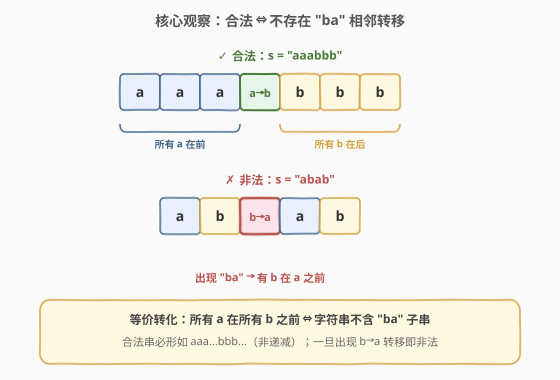
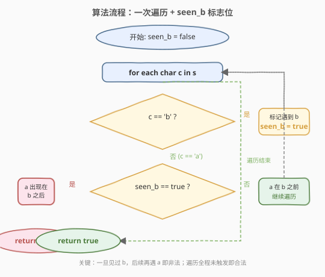
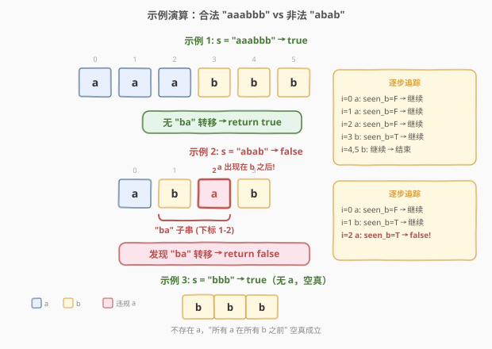

# LeetCode 检查是否所有 A 都在 B 之前 题解

## 1. 题目概述

- **标题 / 题号**：检查是否所有 A 都在 B 之前（#2124，easy）
- **链接**：https://leetcode.cn/problems/check-if-all-as-appears-before-all-bs/
- **难度**：简单
- **标签**：字符串、一次遍历

**题意**：给你一个**仅**由字符 `'a'` 和 `'b'` 组成的字符串 `s`。如果字符串中**每个** `'a'` 都出现在**每个** `'b'` 之前，返回 `true`；否则返回 `false`。

**示例 1**：

```text
输入：s = "aaabbb"
输出：true
解释：'a' 位于下标 0、1 和 2；而 'b' 位于下标 3、4 和 5。
     因此，每个 'a' 都出现在每个 'b' 之前，所以返回 true。
```

**示例 2**：

```text
输入：s = "abab"
输出：false
解释：存在一个 'a' 位于下标 2，而一个 'b' 位于下标 1。
     因此，不能满足每个 'a' 都出现在每个 'b' 之前，所以返回 false。
```

**示例 3**：

```text
输入：s = "bbb"
输出：true
解释：不存在 'a'，因此可以视作每个 'a' 都出现在每个 'b' 之前，所以返回 true。
```

**约束**：

- `1 <= s.length <= 100`
- `s[i]` 为 `'a'` 或 `'b'`

> 💡 本题看似需要检查"所有 `a` 都在所有 `b` 之前"，直觉上像是要两两比较 `a` 和 `b` 的位置。但实际上，**只需检测是否存在一个 `b` 出现在某个 `a` 之前**即可——等价于字符串中不含 `"ba"` 子串。这是"全称命题 → 反面否定"的经典转化。

## 2. 解题思路

### 2.1 暴力思路

最直觉的做法是对每一对 `(a, b)` 检查 `a` 的下标是否小于 `b` 的下标：

- 收集所有 `a` 的下标和所有 `b` 的下标。
- 双重循环：对每个 `a` 的下标 `i` 和每个 `b` 的下标 `j`，若 `i > j` 则返回 `false`。

时间复杂度 $O(n^2)$，空间 $O(n)$。能出结果但**完全没有利用问题的结构**——实际上只需关注 `a` 和 `b` 的**相对出现顺序**，而非两两比较。

### 2.2 核心观察：等价转化为检测 "ba" 子串



**关键转化**：「所有 `a` 都在所有 `b` 之前」等价于「字符串中不存在 `"ba"` 子串」。

> 如果字符串中出现了 `"ba"`——即某个 `b` 紧接着一个 `a`——那么这个 `b` 出现在这个 `a` 之前，违反条件。反之，如果不存在 `"ba"`，则所有 `b` 之后不会再有 `a`，即所有 `a` 都在所有 `b` 之前。

这把一个"全称量词"问题转化为"存在量词"问题——**只需找到一次 `"ba"` 即可判定非法**，无需比较所有对。

合法字符串的形态必然是 `aaa...bbb...`（非递减，因为 `'a' < 'b'`），即字符串是**排序好的**。一旦出现 `b → a` 的下降转移，就非法。

### 2.3 算法流程图



采用**一次遍历 + 标志位**的写法：维护 `seen_b` 标记是否遇到过 `b`。

- 遍历每个字符 `c`：
  - 若 `c == 'b'`：置 `seen_b = true`。
  - 若 `c == 'a'`：若 `seen_b` 已为 `true`，说明 `a` 出现在 `b` 之后 → 返回 `false`。
- 遍历结束未触发 → 返回 `true`。

> 💡 这个写法的本质是**在线检测 `"ba"` 模式**：`seen_b` 记录"是否已经进入 `b` 区"，一旦进入 `b` 区后又遇到 `a`，就说明出现了 `b → a` 的非法转移。

### 2.4 示例演算



以三个示例分别演算：

**示例 1** `s = "aaabbb"`：

- `i=0` `a`：`seen_b=false` → 继续。
- `i=1` `a`：`seen_b=false` → 继续。
- `i=2` `a`：`seen_b=false` → 继续。
- `i=3` `b`：`seen_b=true` → 继续。
- `i=4` `b`、`i=5` `b`：`seen_b=true`，但 `c == 'b'` 不触发检查 → 继续。
- 遍历结束 → 返回 `true`。

**示例 2** `s = "abab"`：

- `i=0` `a`：`seen_b=false` → 继续。
- `i=1` `b`：`seen_b=true` → 继续。
- `i=2` `a`：`seen_b=true` → **`a` 出现在 `b` 之后** → 返回 `false`。

**示例 3** `s = "bbb"`：

- 全程 `c == 'b'`，`seen_b` 置 `true` 但无 `a` 触发检查。
- 遍历结束 → 返回 `true`（不存在 `a`，条件空真成立）。

> ⚠️ **空真（vacuous truth）**：示例 3 是本题的一个重要边界。当字符串中不存在 `a` 时，"所有 `a` 都在所有 `b` 之前"这一命题**空真成立**——因为没有 `a` 可以违反它。本算法自然处理：`seen_b` 虽为 `true`，但从未遇到 `a`，不会触发 `false` 分支。

## 3. 参考代码

### C++（一次遍历 + 标志位）

```cpp
class Solution {
  public:
    bool checkString(string s) {
        bool seen_b = false;
        for (char c : s) {
            if (c == 'b') {
                seen_b = true;
            } else {
                if (seen_b) return false;
            }
        }
        return true;
    }
};
```

### Python（一次遍历 + 标志位）

```python
class Solution:
    def checkString(self, s: str) -> bool:
        seen_b = False
        for c in s:
            if c == 'b':
                seen_b = True
            elif seen_b:
                return False
        return True
```

### Python（一行流：检测 "ba" 子串）

```python
class Solution:
    def checkString(self, s: str) -> bool:
        return "ba" not in s
```

### C++（一行流：检测 "ba" 子串）

```cpp
class Solution {
  public:
    bool checkString(string s) {
        return s.find("ba") == string::npos;
    }
};
```

> ⚠️ **多种写法的对比**：`"ba" not in s` / `s.find("ba")` 写法最简洁，直接表达了核心观察——"合法 ⇔ 不含 `ba` 子串"。一次遍历 + 标志位写法展示了对字符流的**在线处理**能力（无需知道完整字符串即可逐字符判定），面试中建议先讲清等价转化，再写一行流或标志位写法均可。

## 4. 复杂度分析

| 维度 | 复杂度 | 说明 |
|------|--------|------|
| 时间复杂度 | $O(n)$ | 遍历字符串一次（或 `find` 内部一次扫描），每个字符最多访问一次 |
| 空间复杂度 | $O(1)$ | 仅使用 `seen_b` 一个布尔变量（`find` 写法同样 $O(1)$） |

> 与暴力 $O(n^2)$ 双重循环的对比：暴力法收集所有 `a`、`b` 下标再两两比较，时间和空间都劣于一次遍历。核心差距在于**没有识别出"只需检测 `ba` 转移"这一结构**。

## 5. 扩展：等价判定方式

### 5.1 利用排序性质

合法字符串必形如 `aaa...bbb...`，即**非递减排序**（`'a' < 'b'`）。因此可以直接判断 `s` 是否已排序：

```python
class Solution:
    def checkString(self, s: str) -> bool:
        return s == ''.join(sorted(s))
```

```cpp
class Solution {
  public:
    bool checkString(string s) {
        return is_sorted(s.begin(), s.end());
    }
};
```

> 💡 `is_sorted` 是 C++17 引入的算法，内部逐对检查相邻元素是否满足 `≤` 关系，本质与检测 `ba`（即 `b > a` 的下降）一致，时间 $O(n)$，空间 $O(1)$。Python 的 `sorted` 写法会创建新字符串，空间 $O(n)$，但表达力强。

### 5.2 利用首末位置关系

合法 ⇔ 最后一个 `a` 的下标 < 第一个 `b` 的下标（若两者都存在）：

```python
class Solution:
    def checkString(self, s: str) -> bool:
        last_a = s.rfind('a')
        first_b = s.find('b')
        if last_a == -1 or first_b == -1:
            return True
        return last_a < first_b
```

> ⚠️ 当字符串中只有 `a` 或只有 `b` 时，`rfind`/`find` 会返回 `-1`，需特判返回 `true`（空真）。这本质上是在比较 `a` 区和 `b` 区的边界，比 `find("ba")` 多了边界处理，不如直接检测子串简洁。

## 6. 面试要点

1. **为什么不需要两两比较所有 `a` 和 `b` 的位置？**

   - 因为"所有 `a` 都在所有 `b` 之前"等价于"不存在 `b` 在 `a` 之前"。而"存在 `b` 在 `a` 之前"只需检测相邻的 `b → a` 转移——如果整个串没有 `ba` 子串，那么任意 `b` 后面都不会有 `a`。这是"全称命题取反"的经典简化：$\forall a \prec \forall b \Leftrightarrow \neg(\exists b \prec a)$。

2. **`"ba" not in s` 和一次遍历 + 标志位有什么区别？**

   - 功能完全等价。`"ba" not in s` 直接调用语言内置的子串查找，简洁且语义清晰；标志位写法展示了对字符流的在线处理能力——逐字符读取，无需回溯，适合流式数据场景。面试中两种写法都应掌握，先讲清等价转化再写代码。

3. **字符串中没有 `a` 或没有 `b` 时怎么办？**

   - 两种情况都返回 `true`（空真）。没有 `a` 时，"所有 `a` 都在所有 `b` 之前"无反例可举；没有 `b` 时同理。本算法自然处理：标志位写法中 `seen_b` 不会在遇到 `a` 时被触发（因为没有 `b`），或不会遇到 `a`（因为没有 `a`）；`find("ba")` 写法中子串不存在自然返回 `true`。无需特判。

4. **这个问题和"判断字符串是否有序"有什么关系？**

   - 完全等价。因为 `'a' < 'b'`，合法字符串 `aaa...bbb...` 就是非递减排序的。所以 `is_sorted(s)` 或 `s == sorted(s)` 都能判定。但从"检测 `ba` 子串"的角度更直观地揭示了**为什么**——非法的本质就是出现了一次 `b → a` 的下降。

5. **能否推广到更多字符（如 `a`, `b`, `c` 要求所有 `a` 在所有 `b` 之前，所有 `b` 在所有 `c` 之前）？**

   - 可以。推广后合法字符串形如 `aaa...bbb...ccc...`，即严格按字母序排列。检测方法不变：判断字符串是否已排序即可（`is_sorted`）。或检测是否存在 `ba` 或 `cb` 子串。本质都是"非递减序列判定"。

## 同类练习题

| # | 题目 | 与本题的关联 |
|---|------|-------------|
| 896 | [单调数列](https://leetcode.cn/problems/monotonic-array/)（[站内题解](../0801-0900/896_单调数列.md)） | 判断数组是否单调非增或非减，"有序性判定"的直接推广，同样只需一次遍历检测下降转移 |
| 1752 | [检查数组是否经排序和轮转得到](https://leetcode.cn/problems/check-if-array-is-sorted-and-rotated/)（[站内题解](../1701-1800/1752_检查数组是否经排序和轮转得到.md)） | 判断数组是否为排序数组的轮转，"有序性判定"家族的变体，允许一次断点 |
| 28 | [找出字符串中第一个匹配项的下标](https://leetcode.cn/problems/find-the-index-of-the-first-occurrence-in-a-string/)（[站内题解](../0001-0100/28_找出字符串中第一个匹配项的下标.md)） | 子串查找母题，本题 `"ba" in s` 即调用此操作 |
| 58 | [最后一个单词的长度](https://leetcode.cn/problems/length-of-last-word/)（[站内题解](../0001-0100/58_最后一个单词的长度.md)） | 字符串一次遍历扫描，同属字符串基础扫描题 |
