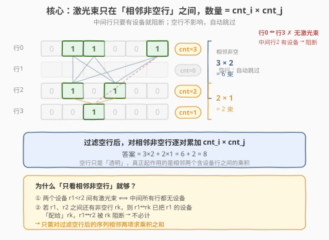
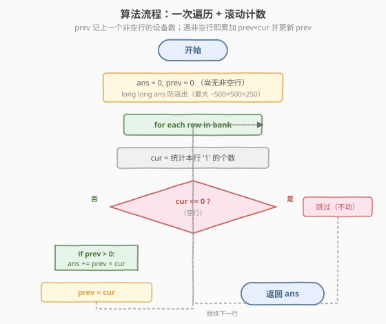
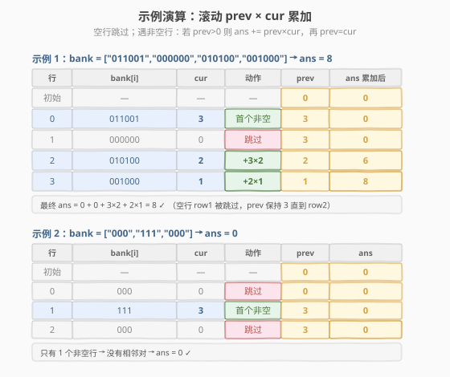

# 银行中的激光束数量

- **题目名称**：银行中的激光束数量
- **链接**：[2125. 银行中的激光束数量](https://leetcode.cn/problems/number-of-laser-beams-in-a-bank/)
- **难度**：中等
- **标签**：数组、数学、贪心、贡献计数

## 1. 题目概述

给定一个下标从 **0** 开始的二进制字符串数组 `bank`，表示银行的平面图，这是一个大小为 $m \times n$ 的二维矩阵。`bank[i]` 表示第 $i$ 行的设备分布，由若干 `'0'` 和若干 `'1'` 组成：

- `'0'` 表示单元格为空；
- `'1'` 表示单元格有一个安全设备。

对任意两个安全设备，**如果同时**满足下面两个条件，则二者之间存在**一个**激光束：

1. 两个设备位于两个**不同行** $r_1$ 和 $r_2$，其中 $r_1 < r_2$；
2. 满足 $r_1 < i < r_2$ 的**所有**行 $i$，都**没有安全设备**（即中间所有行全为 `'0'`）。

激光束是独立的，互不干扰也不合并。返回银行中激光束的总数量。

**示例 1**：

```text
输入：bank = ["011001","000000","010100","001000"]
输出：8
解释：在下面每组设备对之间，存在一条激光束。总共是 8 条激光束：
  * bank[0][1] -- bank[2][1]
  * bank[0][1] -- bank[2][3]
  * bank[0][2] -- bank[2][1]
  * bank[0][2] -- bank[2][3]
  * bank[0][5] -- bank[2][1]
  * bank[0][5] -- bank[2][3]
  * bank[2][1] -- bank[3][2]
  * bank[2][3] -- bank[3][2]
注意，第 0 行和第 3 行上的设备之间不存在激光束，
这是因为第 2 行存在安全设备，不满足第 2 个条件。
```

**示例 2**：

```text
输入：bank = ["000","111","000"]
输出：0
解释：不存在两个位于不同行的设备
```

**约束条件**：

- $m == \text{bank.length}$
- $n == \text{bank}[i].\text{length}$
- $1 \le m, n \le 500$
- `bank[i][j]` 为 `'0'` 或 `'1'`

> 💡 **读题关键**：激光束的第二个条件「中间所有行都没有设备」意味着——**只有「相邻的两个非空行」之间才会产生激光束**。若两行之间夹着任何一个非空行，激光束就被该行阻断。这把看似 $O(m^2)$ 的两两配对问题，直接降维成对**过滤空行后的序列**做相邻项求积。

---

## 2. 解题思路

### 2.1 暴力思路：枚举所有设备对

最直观的做法：遍历所有行对 $(r_1, r_2)$（$r_1 < r_2$），检查中间行是否全空；若全空，则两行间的激光束数为 $\text{cnt}_{r_1} \times \text{cnt}_{r_2}$，累加进答案。

```text
ans = 0
for r1 in 0..m-1:
    for r2 in r1+1..m-1:
        if 中间行 (r1, r2) 全空:
            ans += cnt[r1] * cnt[r2]
return ans
```

检查中间行需 $O(m)$，故总时间 $O(m^3)$（若每行先预算 `cnt`）。$m = 500$ 时约 $1.25 \times 10^8$ 次操作，常数大时偏慢，且空间需 $O(m)$ 存计数。

> ⚠️ 暴力的浪费在于：把「中间全空」这一条件**逐对重复检查**。事实上「中间全空」等价于「$r_1$、$r_2$ 在过滤掉空行后的序列里**相邻**」——这是一条**全局结构**，只需一次扫描就能确定所有合法的行对，无需逐对验证。

### 2.2 核心观察：只看相邻非空行

把所有**空行**（`cnt == 0`）抽掉，得到一个「非空行序列」$c_0, c_1, \dots, c_{k-1}$（每个 $c_i$ 是该行设备数）。则：

- **任意两个相邻非空行 $c_i, c_{i+1}$ 之间**：中间没有任何非空行（空行已被抽掉，而空行不影响激光束），故条件 2 满足 → 它们的**每个设备对**都形成一束激光，贡献 $c_i \times c_{i+1}$。
- **任意两个非相邻非空行 $c_i, c_j$（$j > i+1$）之间**：中间至少夹着 $c_{i+1}$ 这个非空行 → 条件 2 不满足 → **无激光束**。

因此答案就是相邻非空行设备数的乘积之和：

$$\text{ans} = \sum_{i=0}^{k-2} c_i \times c_{i+1}$$



> 💡 **为什么空行「透明」？** 条件 2 只要求中间行**没有设备**，空行恰好没有设备，所以不会阻断激光束——它对激光束的贡献是「透明」的。真正起阻断作用的是**含设备的行**。因此把空行抽掉后，序列里「相邻」恰好对应原矩阵里「中间全空」的行对，二者等价。

> ⚠️ **不要误以为「任意两个非空行之间都有激光束」**。示例 1 中行 0 和行 3 都非空，但因行 2 夹在中间（非空），二者**无**激光束。只有相邻非空行（行 0↔行 2、行 2↔行 3）才计数。

### 2.3 算法流程图



```text
numberOfBeams(bank):
    ans = 0
    prev = 0                      // 上一个非空行的设备数
    for each row in bank:
        cur = 统计 row 中 '1' 的个数
        if cur == 0:
            continue              // 空行：跳过，prev 不变
        if prev > 0:
            ans += prev * cur     // 与上一个非空行配对
        prev = cur                // 滚动更新
    return ans
```

> 💡 **实现要点**：① 用「滚动变量 `prev`」而非数组，把空间压到 $O(1)$——我们只需要上一个非空行的计数，更早的已无用。② `prev` 初始为 `0`，天然跳过「首个非空行」（它没有前驱可配对）。③ 答案最大约 $500 \times 500 \times 250 \approx 6.25 \times 10^7$，`int` 足够，但用 `long long` 更稳妥（C++）。

### 2.4 示例演算

以示例 1 `bank = ["011001","000000","010100","001000"]` 为例：

| 行 | `bank[i]` | `cur` | 动作 | `prev` | `ans` 累加后 |
|----|-----------|-------|------|--------|--------------|
| 初始 | — | — | — | 0 | 0 |
| 0 | `011001` | 3 | 首个非空，仅更新 prev | 3 | 0 |
| 1 | `000000` | 0 | 跳过（空行） | 3 | 0 |
| 2 | `010100` | 2 | $+3 \times 2$ | 2 | 6 |
| 3 | `001000` | 1 | $+2 \times 1$ | 1 | 8 |



最终 $\text{ans} = 0 + 0 + 3 \times 2 + 2 \times 1 = 8$ ✓。

注意行 1（空行）被跳过，`prev` 保持 `3` 不变，直到行 2 才参与乘积——这正是「空行透明、非空行阻断」的体现：行 0 的设备**越过**空行 1 与行 2 的设备配对，但因行 2 阻断，行 0 与行 3 **不**配对。

再以示例 2 `bank = ["000","111","000"]` 为例：只有行 1 非空（`cur=3`），它是首个非空行，无前驱 → `ans = 0`。只有一个非空行时没有相邻对，自然无激光束。

---

## 3. 参考代码

### C++

```cpp
// 银行中的激光束数量 —— 一次遍历 + 滚动计数 O(mn)/O(1)
// 编译: g++ -O2 -std=c++17 银行中的激光束数量.cpp -o laser
#include <string>
#include <vector>
using namespace std;

class Solution {
public:
    int numberOfBeams(vector<string>& bank) {
        int ans = 0, prev = 0;
        for (const string& row : bank) {
            int cur = 0;
            for (char c : row) if (c == '1') ++cur;
            if (cur == 0) continue;          // 空行：跳过，prev 不变
            if (prev > 0) ans += prev * cur; // 与上一个非空行配对
            prev = cur;                      // 滚动更新
        }
        return ans;
    }
};
```

### Python

```python
class Solution:
    def numberOfBeams(self, bank: list[str]) -> int:
        ans = 0
        prev = 0
        for row in bank:
            cur = row.count('1')
            if cur == 0:
                continue                    # 空行：跳过，prev 不变
            if prev > 0:
                ans += prev * cur           # 与上一个非空行配对
            prev = cur                      # 滚动更新
        return ans
```

> 💡 **实现细节**：① Python 用 `str.count('1')` 一行搞定计数，比手写循环更简洁且 C 层实现更快。② C++ 用 `const string&` 避免拷贝。③ 不必显式「过滤空行再两两配对」——滚动 `prev` 在一次遍历里同时完成过滤与配对，逻辑更紧凑、空间 $O(1)$。

---

## 4. 复杂度分析

| 维度 | 复杂度 | 说明 |
|------|--------|------|
| **时间复杂度** | $O(m \times n)$ | 遍历每个单元格一次以统计 `'1'`；乘积累加为 $O(1)$ |
| **空间复杂度** | $O(1)$ | 仅 `ans`、`prev`、`cur` 三个计数器，无额外数组 |

> ⚠️ $m, n \le 500$，$O(mn)$ 最多 $2.5 \times 10^5$ 次字符比较，极快。即便 $m, n = 500$ 全为 `'1'`，答案上界约 $500 \times 250 \approx 1.25 \times 10^5$（相邻行乘积之和），`int` 完全够用。

---

## 5. 扩展：为什么「相邻非空行」等价于「中间全空」

把「过滤空行后的序列里相邻」与原题条件 2 的等价性严格说清，有助于举一反三。

**命题**：对原矩阵中两行 $r_1 < r_2$（均非空），下面两条等价：

1. 满足 $r_1 < i < r_2$ 的所有行 $i$ 都没有设备（条件 2）；
2. 在「删去所有空行后」的非空行序列里，$r_1$ 与 $r_2$ 相邻。

**证明**：

- $(1 \Rightarrow 2)$：若 $r_1, r_2$ 之间所有行都空，则删去空行后 $r_1, r_2$ 之间不再有其它非空行，故在非空行序列里相邻。
- $(2 \Rightarrow 1)$：若 $r_1, r_2$ 在非空行序列里相邻，则 $r_1, r_2$ 之间不存在任何非空行，即原矩阵里 $r_1 < i < r_2$ 的所有行 $i$ 都只能是空行（无设备），条件 2 成立。

因此「过滤空行 + 相邻配对」是对条件 2 的**精确刻画**，无遗漏也无重复。这也解释了为什么只需一次线性扫描即可覆盖所有合法行对——合法行对恰好就是非空行序列的相邻对，共 $k-1$ 个（$k$ 为非空行数）。

> 💡 这一「**删去透明元素后相邻即配对**」的化约思想，在「可见性」「无阻挡配对」类问题中很常见：凡阻碍物是「空」时，先删空再相邻配对即可。

---

## 6. 面试要点

1. **为什么只需考虑相邻非空行？**

   - 条件 2 要求「中间所有行无设备」。若两非空行之间还夹着非空行，则被阻断、无激光束；若中间全空，则删去空行后二者在非空行序列里**相邻**。故合法行对 = 非空行序列的相邻对，遍历一次即可。

2. **空行为什么可以「跳过」而不影响答案？**

   - 空行无设备，不阻断激光束（条件 2 只禁「有设备的中间行」）。跳过空行时 `prev` 保持不变，等价于让上一个非空行「越过」空行与当前非空行配对——这正是「空行透明」的体现。

3. **`prev` 初始为 `0` 有什么妙用？**

   - 既表示「尚无非空行」的哨兵值，又让首个非空行自然跳过 `ans += prev * cur`（因 `prev == 0`），无需特判「是否首个」。一个变量身兼两职，是常见的初始化技巧。

4. **答案的上界是多少？需要担心溢出吗？**

   - 最坏情况：非空行交替出现 $500/2 = 250$ 个相邻对，每对两端各 500 个设备 → 答案 $\le 250 \times 500 \times 500 = 6.25 \times 10^7$，`int`（上界 $\approx 2.1 \times 10^9$）足够。若题目把 $n$ 放到 $10^5$，则需 `long long`。

5. **能否不预处理计数、边读边算？**

   - 可以。本题解法即「边读行边计数、边累加」——读到一行就立即统计 `'1'`、决定跳过或配对、更新 `prev`，无需存储所有行的计数。这正是 $O(1)$ 空间的来源，也适合**流式输入**场景。

> 💡 **一句话总结**：2125 的核心是把「中间全空」转化为「过滤空行后相邻」——一次遍历统计每行设备数，跳过空行，对相邻非空行累加 $\text{prev} \times \text{cur}$，$O(mn)$ 时间 $O(1)$ 空间。

---

## 7. 同类练习题

- [2319. 判断矩阵是否是一个 X 矩阵](https://leetcode.cn/problems/check-if-matrix-is-x-matrix/)：同样遍历矩阵按位置判定，练习「按行扫描 + 计数/校验」的基本功
- [733. 图像渲染](https://leetcode.cn/problems/flood-fill/)：矩阵遍历的另一种形式（BFS/DFS 染色），对比线性扫描与图搜索的边界
- [463. 岛屿的周长](https://leetcode.cn/problems/island-perimeter/)：矩阵中按贡献计数（每个 1 贡献 4 − 相邻 1 数），与本题「按相邻行乘积贡献」同属贡献法思想
- [1252. 奇数值单元格的数目](https://leetcode.cn/problems/cells-with-odd-values-in-a-atrix/)：矩阵行列增量计数，练习「行/列统计 + 贡累加」的简化思路
- [2027. 转换字符串的最少操作次数](https://leetcode.cn/problems/minimum-moves-to-convert-string/)（[题解](../2001-2100/2027_转换字符串的最少操作次数.md)）：贪心线性扫描的代表，对比「一次遍历贪心」在不同场景的体现
