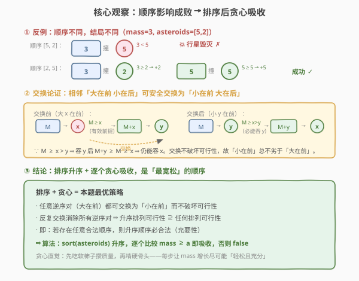
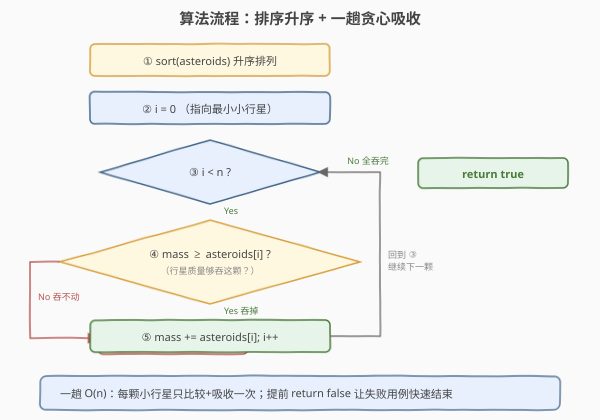
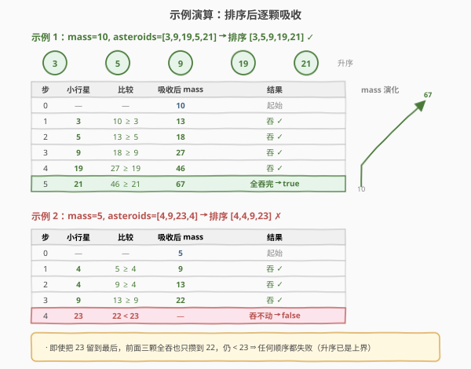

# 摧毁小行星

- **题目名称**：摧毁小行星
- **链接**：[2126. 摧毁小行星](https://leetcode.cn/problems/destroying-asteroids/)
- **难度**：中等
- **标签**：贪心、排序、数组

## 1. 题目概述

给定一颗行星的初始质量 `mass`，以及一个整数数组 `asteroids`，其中 `asteroids[i]` 是第 `i` 颗小行星的质量。你可以按**任意顺序**安排小行星与行星碰撞的次序：

- 若行星碰撞时的质量 **大于等于** 小行星质量，则小行星被**摧毁**，且行星**获得**该小行星的质量（`mass += asteroids[i]`）；
- 否则，行星被摧毁。

判断是否所有小行星**都能**被摧毁，能返回 `true`，否则 `false`。

**示例 1**：

```text
输入：mass = 10, asteroids = [3,9,19,5,21]
输出：true
解释：按 [9,19,5,3,21] 顺序碰撞：
      10+9=19 → 19+19=38 → 38+5=43 → 43+3=46 → 46+21=67，全部摧毁。
```

**示例 2**：

```text
输入：mass = 5, asteroids = [4,9,23,4]
输出：false
解释：无论怎么安排，把别的小行星全摧毁后质量为 5+4+9+4=22，仍 < 23，无法摧毁最后一颗。
```

**约束条件**：

- $1 \le \text{mass} \le 10^5$
- $1 \le \text{asteroids.length} \le 10^5$
- $1 \le \text{asteroids[i]} \le 10^5$

> 💡 题眼在「**任意顺序**」四字——顺序由你决定，那么必然存在一个**最优顺序**让行星尽可能多地活下来。突破口是想到：**先吃小的不影响后续、先吃大的可能直接送命**，于是贪心方向呼之欲出。

---

## 2. 解题思路

### 2.1 暴力思路：枚举所有排列

共 $n!$ 种小行星排列，对每种排列模拟一遍碰撞过程 $O(n)$，任一成功即返回 `true`。总复杂度 $O(n! \cdot n)$，$n \le 10^5$ 时完全不可行。

> ⚠️ 暴力的浪费在于：我们并不关心**具体哪种顺序**可行，只关心「**是否存在**一种顺序」。突破口是把「枚举顺序」换成「**直接构造一种最有利的顺序**，再判定它是否可行」——而最有利的顺序就是**升序**。

### 2.2 核心观察：排序升序 + 贪心吸收

直觉很朴素：**先吞小的攒质量，再啃大的**。小行星越小，被吞的门槛越低；吞掉它后行星质量只增不减，对后续只会更有利。因此「**从小到大**」是最宽松的顺序。

但直觉需要证明——为什么升序**一定不劣于**任何其它顺序？关键工具是**交换论证**：

> 若某合法顺序中存在相邻的「大在前、小在后」$(x, y)$ 且 $x > y$，则把它们交换为「小在前、大在后」$(y, x)$ 后**仍然合法**。

证明：设撞到 $x$ 之前行星质量为 $M$。因原顺序合法，故 $M \ge x$；又 $x > y$，故 $M \ge x > y$，即 $M \ge y$，吞 $y$ 没问题。吞完 $y$ 后质量变为 $M + y \ge M \ge x$，再吞 $x$ 也没问题。交换不破坏可行性。∎

反复用交换消除所有逆序对（类似冒泡排序），最终得到**升序排列**——而每步交换都不破坏可行性。因此：

$$\text{升序顺序合法} \iff \text{存在某种合法顺序}$$

即升序是**充要**的：升序能成则答案 `true`，升序都成不了则任何顺序都成不了，答案 `false`。



> 💡 **一句话直觉**：吞小行星是「**门槛低 + 涨质量**」双赢，越早吞越多小行星，质量增长越快，越容易够到后面的大行星。先大后小则可能「**门槛太高直接送命**」，连攒质量的机会都没有。

> ⚠️ **注意「任意顺序」与「子集和」的区别**：本题所有小行星**都必须**摧毁，不是选子集。所以不能简单地用「总和 vs 最大值」判定——升序模拟是必须的，因为中间任何一步卡住都会失败（哪怕总量够）。

### 2.3 算法流程图



```text
asteroidsDestroyed(mass, asteroids):
  sort(asteroids)                       # 升序
  for a in asteroids:
      if mass >= a:  mass += a          # 吞掉，质量增长
      else:          return false       # 吞不动，行星毁灭
  return true                           # 全部吞完
```

### 2.4 示例演算

以**示例 1** `mass = 10`、`asteroids = [3,9,19,5,21]` 为例，排序后为 `[3,5,9,19,21]`：

| 步 | 小行星 | 比较 | 吸收后 mass | 结果 |
|----|--------|------|-------------|------|
| 0  | —      | —    | 10          | 起始 |
| 1  | 3      | 10 ≥ 3 | 13        | 吞 ✓ |
| 2  | 5      | 13 ≥ 5 | 18        | 吞 ✓ |
| 3  | 9      | 18 ≥ 9 | 27        | 吞 ✓ |
| 4  | 19     | 27 ≥ 19 | 46       | 吞 ✓ |
| 5  | 21     | 46 ≥ 21 | 67       | 全吞完 → `true` |

再以**示例 2** `mass = 5`、`asteroids = [4,9,23,4]` 为例，排序后为 `[4,4,9,23]`：

| 步 | 小行星 | 比较 | 吸收后 mass | 结果 |
|----|--------|------|-------------|------|
| 0  | —      | —    | 5           | 起始 |
| 1  | 4      | 5 ≥ 4  | 9         | 吞 ✓ |
| 2  | 4      | 9 ≥ 4  | 13        | 吞 ✓ |
| 3  | 9      | 13 ≥ 9 | 22        | 吞 ✓ |
| 4  | 23     | 22 < 23 | —        | 吞不动 → `false` |



> 💡 示例 2 中即使把 `23` 留到最后，前三颗全吞也只攒到 $22$，仍 $< 23$。这印证了交换论证的结论：**升序已是「最宽松」顺序**，升序都过不了，任何顺序都过不了。

---

## 3. 参考代码

### C++

```cpp
// 摧毁小行星 —— 排序 + 贪心 O(n log n)/O(log n)
// 编译: g++ -O2 -std=c++17 摧毁小行星.cpp -o da
#include <vector>
#include <algorithm>
using namespace std;

class Solution {
public:
    bool asteroidsDestroyed(int mass, vector<int>& asteroids) {
        sort(asteroids.begin(), asteroids.end());   // 升序：先吃软柿子
        long long m = mass;                          // 防中途溢出（n·max ≤ 1e10）
        for (int a : asteroids) {
            if (m >= a) m += a;                      // 吞掉，质量增长
            else        return false;                // 吞不动，行星毁灭
        }
        return true;
    }
};
```

### Python

```python
class Solution:
    def asteroidsDestroyed(self, mass: int, asteroids: List[int]) -> bool:
        asteroids.sort()                            # 升序：先吃软柿子
        m = mass
        for a in asteroids:
            if m >= a:
                m += a                              # 吞掉，质量增长
            else:
                return False                        # 吞不动，行星毁灭
        return True
```

> 💡 **实现细节**：① C++ 中 `mass` 与 `asteroids[i]` 均 $\le 10^5$、$n \le 10^5$，吸收后质量上限 $10^5 + 10^5 \times 10^5 = 10^{10}$，超出 `int` 范围（约 $2.1 \times 10^9$），需用 `long long`。Python 无此问题。② 排序用 `std::sort` / `list.sort`，$O(n \log n)$ 是全算法瓶颈，单趟扫描 $O(n)$ 反而次要。③ 提前 `return false` 让失败用例在卡住处立刻结束，无需扫完。

---

## 4. 复杂度分析

| 维度 | 复杂度 | 说明 |
|------|--------|------|
| **时间复杂度** | $O(n \log n)$ | 排序 $O(n \log n)$ 为瓶颈；一趟扫描 $O(n)$，失败用例常提前结束 |
| **空间复杂度** | $O(\log n)$ | 原地排序的栈空间（C++ `std::sort` / Python Timsort）；不另开数组 |

> ⚠️ $n \le 10^5$，$O(n \log n)$ 轻松通过。若题目放宽到 $n \le 10^7$，可考虑**值域桶排序**（值域仅 $10^5$）将排序降到 $O(n + V)$，但本题无需。

---

## 5. 扩展：为何不能用「总和判定」简化

观察到一个诱人的 shortcut：若 $\text{mass} + \sum \text{asteroids} \ge \max(\text{asteroids})$，是否就能直接返回 `true`？**不能**。这个条件只保证了「**最终**质量够大」，但忽略了**中途卡死**的可能。

构造反例：`mass = 1`、`asteroids = [2, 100, 1]`。总和 $1 + 2 + 100 + 1 = 104 \ge 100$ 满足「总和条件」，但升序为 `[1, 2, 100]`：

- `1 ≥ 1` → mass = 2
- `2 ≥ 2` → mass = 4
- `4 < 100` → **失败**

原因是中间某颗小行星的门槛在当时质量下够不到，即便后面还有「小行星能补质量」也无济于事——因为那颗大 asteroid 横在前面挡路，而题目要求**全部**摧毁。所以**必须**逐颗模拟，不能只看总和与最大值。

> 💡 唯一能省的情形是值域特殊时：若保证 `asteroids[i] ≤ mass` 恒成立（题面无此保证），则任意顺序都能吞，直接 `true`。本题无此便利。

---

## 6. 面试要点

1. **为什么升序是最优顺序？怎么证明？**

   - 直觉：先吞小的，门槛低且涨质量，对后续只更有利。
   - 严格证明用**交换论证**：合法顺序中任一相邻逆序对 $(x, y)$（$x > y$，大在前）都可交换为 $(y, x)$ 而不破坏合法性——因 $M \ge x > y$ 保证能吞 $y$，吞完 $M + y \ge M \ge x$ 保证还能吞 $x$。反复消除逆序对得升序，故升序合法 $\iff$ 存在合法顺序。

2. **「任意顺序」是否意味着要枚举排列？**

   - 不需要。「任意顺序」是题面给的**自由度**，正是用来构造**最有利顺序**（升序）的。枚举 $n!$ 排列是暴力，升序模拟是利用自由度的最优策略。

3. **能否只比较 `mass + sum` 与 `max` 来判定？为什么？**

   - 不能。这只保证「最终质量够」，忽略了「中途卡死」。反例 `mass=1, asteroids=[2,100,1]`：总和够但中途 `4 < 100` 失败。必须逐颗模拟升序吸收过程。

4. **C++ 中为何把 `mass` 提升为 `long long`？**

   - 吸收后质量上限 $10^5 + 10^5 \times 10^5 = 10^{10}$，超过 `int` 上界 $2.1 \times 10^9$。即便中途比较只用到 `m >= a`（`a ≤ 1e5` 不会溢出 `int`），但累加 `m += a` 会溢出，故用 `long long` 稳妥。Python 无此问题。

5. **复杂度瓶颈在哪？能否优化？**

   - 瓶颈是排序 $O(n \log n)$。本题 $n \le 10^5$ 足够。若 $n$ 更大且值域有限（$V = 10^5$），可用**计数排序/桶排序**降到 $O(n + V)$，再按值域从小到大遍历非空桶即可。

> 💡 **一句话总结**：2126 是「**任意顺序 + 贪心**」的招牌题——用交换论证证明「升序最宽松」，排序后一趟贪心吸收即得充要判定，$O(n \log n)$ 时间 $O(\log n)$ 空间。

---

## 7. 同类练习题

- [455. 分发饼干](https://leetcode.cn/problems/assign-cookies/)（[题解](../0401-0500/455_分发饼干.md)）：双排序 + 贪心匹配，最小的饼干喂胃口最小的孩子，同为「排序后贪心」范式
- [881. 救生艇](https://leetcode.cn/problems/boats-to-save-people/)：排序 + 双指针贪心，每艘船尽量塞「最重 + 最轻」两人，与本题同属排序后线性贪心家族
- [253. 会议室 II](https://leetcode.cn/problems/meeting-rooms-ii/)（[题解](../0201-0300/253_会议室II.md)）：区间调度贪心，按时间排序后用最小堆维护并发，对照排序贪心的不同变体
- [435. 无重叠区间](https://leetcode.cn/problems/non-overlapping-intervals/)（[题解](../0401-0500/435_无重叠区间.md)）：按右端点排序的区间调度贪心，与本题同为「排序确定最优顺序 + 一趟线性判定」结构
- [1798. 你能构造出多少个最大值](https://leetcode.cn/problems/maximum-number-of-groups-entering-a-competition/)：值域有序后的贪心构造，与本题「升序即最优」思想相通
