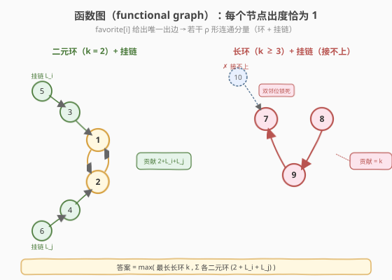
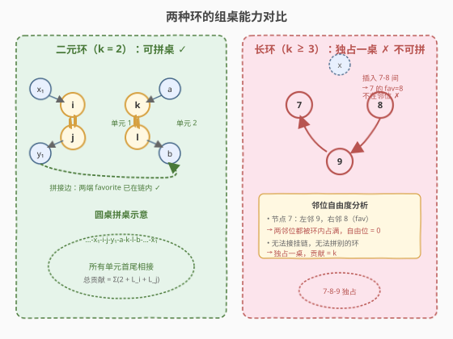
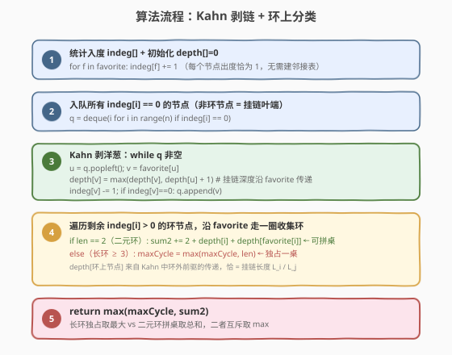
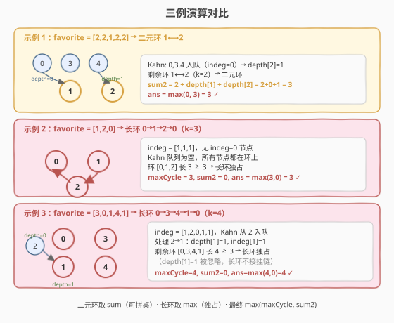

# LeetCode 参加会议的最多员工数 题解

## 1. 题目概述

- **标题 / 题号**：参加会议的最多员工数（#2127，hard）
- **链接**：https://leetcode.cn/problems/maximize-employees-to-be-invited/
- **难度**：困难
- **标签**：图、拓扑排序、内向基环森林

**题意**：公司有 `n` 名员工，编号 `0` 到 `n-1`。给定一个 **下标从 0 开始** 的数组 `favorite`，其中 `favorite[i]` 表示员工 `i` 最喜欢的人。

公司打算邀请部分员工参加会议，且将所有受邀员工安排坐在**圆桌**旁。参会规则：

- **参会条件**：员工 `i` 愿意参会，当且仅当 `i` 和 `favorite[i]` **都被邀请**。
- **座位约束**：每位受邀员工的**左邻或右邻**中至少有一人是自己的 `favorite`（即最喜欢的必须坐在自己旁边）。

返回**最多**能邀请多少名员工。

**示例 1**：

```text
输入：favorite = [2,2,1,2,2]
输出：3
解释：邀请 0、1、2，圆桌座次 0-1-2。
      0 的最喜欢 2（右邻 ✓），1 的最喜欢 2（右邻 ✓），2 的最喜欢 1（左邻 ✓）。
```

**示例 2**：

```text
输入：favorite = [1,2,0]
输出：3
解释：0→1→2→0 构成长度为 3 的环，三人围坐一桌即满足约束。
```

**示例 3**：

```text
输入：favorite = [3,0,1,4,1]
输出：4
解释：邀请 0、1、3、4，圆桌座次 0-3-4-1。
      0 的最喜欢 3（右邻 ✓），3 的最喜欢 4（右邻 ✓），4 的最喜欢 1（右邻 ✓），1 的最喜欢 0（左邻 ✓）。
```

**约束**：

- $n = \text{favorite.length}$
- $2 \le n \le 10^5$
- $0 \le \text{favorite}[i] \le n - 1$
- $\text{favorite}[i] \ne i$

> 💡 题眼在「**每人恰有一个最喜欢**」——这把输入变成了一张**每个节点出度恰为 1** 的**函数图**（functional graph），也就是**内向基环森林**。圆桌座位约束则把问题转化为：在函数图上选一组节点，使得它们能被安排成若干条「沿 favorite 方向首尾相接」的链。突破口是按**环的长度**分两类讨论。

## 2. 解题思路

> ⚠️ **座位约束的图论翻译**：员工 `i` 的座位两侧至少一侧是 `favorite[i]`，意味着在圆桌排列中 `i` 必须与 `favorite[i]` **相邻**。由于 `favorite[i]` 唯一，`i` 在圆桌上占用 1 个「favorite 邻位」，剩 1 个「自由邻位」可接别人。这正是函数图「出度 = 1」的直接体现。

### 2.1 暴力思路：枚举子集 + 排列验证

枚举 $2^n$ 个员工子集，对每个子集检查是否存在一种圆桌排列使所有约束满足（即 Hamilton 回路判定，NPC 问题）。$n \le 10^5$ 时完全不可行。

> ⚠️ 暴力的浪费在于：我们不需要**构造**具体座次，只需知道**最多能坐几人**。突破口是把「圆桌排列」抽象成函数图上的**环结构**——只有环上的节点（及挂在其上的链）才能围坐成桌。

### 2.2 核心观察：函数图 + 环长分类



每个节点出度恰为 1，所以整张图是**若干个 ρ 形连通分量**的并集——每个分量由一个**环**和挂在环上节点的**树（有向链）**组成。

**关键分类**：按环长把所有环分为两类，它们的「组桌能力」截然不同。

#### 类型 A：环长 $\ge 3$ 的长环——独占一桌

设环为 $a_0 \to a_1 \to \cdots \to a_{k-1} \to a_0$（$k \ge 3$，`favorite[a_i] = a_{i+1}`）。圆桌唯一合法座次就是**环序本身**：$a_0\text{-}a_1\text{-}\cdots\text{-}a_{k-1}\text{-}a_0$。

- 每个 $a_i$ 的 favorite 是 $a_{i+1}$（右邻），恰好满足。
- 能否往里**插入**挂链上的节点？不能。设想在 $a_{k-1}$ 和 $a_0$ 之间插入 $x$，则 $a_{k-1}$ 的邻位变成 $a_{k-2}$ 和 $x$，而 $\text{favorite}[a_{k-1}] = a_0$ 不在邻位——**约束被破坏**。

> 💡 **长环的「双邻位锁死」**：$k \ge 3$ 时每个环上节点的两个邻位都被其他环上节点占据（左邻是前驱、右邻是后继），没有「自由邻位」接挂链，因此长环只能**独占一桌**，贡献 $= k$。多个长环**不能合并**。

#### 类型 B：环长 $= 2$ 的二元互喜环——可拼桌

设 `favorite[i] = j` 且 `favorite[j] = i`（二人互为最喜欢）。圆桌中 `i` 和 `j` 必相邻，各自还有一个**自由邻位**可以接挂链：

- `i` 的自由邻位接「指向 `i` 的最长链」$L_i$（不含 `j`）。
- `j` 的自由邻位接「指向 `j` 的最长链」$L_j$（不含 `i`）。

座次形如 $\underbrace{x_p\text{-}\cdots\text{-}x_1}_{L_i}\text{-}i\text{-}j\text{-}\underbrace{y_1\text{-}\cdots\text{-}y_q}_{L_j}$，其中链上每个节点的 favorite 正是链中下一个（朝 `i`/`j` 方向），约束全满足。

**关键**：链的两端 $x_p$ 和 $y_q$ 的 favorite 都在链内部（已相邻），所以它们的「自由邻位」可以接**另一个二元环单元**的端点。于是**所有二元环单元可以首尾相接拼成一张大圆桌**，总贡献 $=$ 各单元贡献之和。



#### 综合答案

$$\text{ans} = \max\Big(\underbrace{\max_{\text{长环 } \ge 3} k}_{\text{独占桌}},\ \ \underbrace{\sum_{\text{二元环}} \big(2 + L_i + L_j\big)}_{\text{拼桌总和}}\Big)$$

> 💡 **一句话直觉**：长环 $\ge 3$ 是「**双邻位锁死、独占一桌**」，只能取最大那个；二元环是「**各有 1 个自由邻位、可无限拼接**」，全部加起来。两者互斥（长环不能和别的拼），取较大。

> ⚠️ **为何长环与二元环不能混拼**：长环节点两邻位都被环内节点占满，无法腾出位置接二元环单元；强行插入必破坏某节点「favorite 在邻位」的约束。所以答案是对两者取 `max`，而非求和。

### 2.3 算法流程：拓扑剥链 + 环上分类



用**拓扑排序（Kahn）剥掉非环节点**，同时计算每个节点接收的最长链深度 `depth`：

```text
maximumInvitations(favorite):
  1. 统计入度 indeg[i]；初始 depth[i] = 0
  2. Kahn 入队所有 indeg[i] == 0 的节点
  3. while 队列非空:
       u = 出队; v = favorite[u]
       depth[v] = max(depth[v], depth[u] + 1)   # 沿 favorite 方向传递链长
       indeg[v] -= 1
       if indeg[v] == 0: 入队 v
  4. 剩余 indeg > 0 的节点都在环上，逐一遍历环：
       for i in 0..n-1:
         if indeg[i] == 0: continue
         沿 favorite 走一圈，收集 cycle[]
         if len(cycle) == 2:
           sum2 += 2 + depth[cycle[0]] + depth[cycle[1]]
         else:
           maxCycle = max(maxCycle, len(cycle))
  5. return max(maxCycle, sum2)
```

**三个要点**：

1. **`depth` 的含义**：Kahn 过程中 `depth[v] = max(depth[u]+1)` 记录的是「从非环节点出发、沿 favorite 方向到达 `v` 的最长链长度」。环上节点不会被 Kahn 处理（入度始终 $> 0$），所以 `depth[环上节点]` 恰好是**挂链长度**——这正是二元环需要的 $L_i$、$L_j$。

2. **长环的 `depth` 无用**：长环 $\ge 3$ 独占一桌，挂链再长也接不上去，所以只取 `len(cycle)`，忽略 `depth`。

3. **二元环的 `depth` 有用**：`depth[i]` 是指向 `i`（不经过 `j`）的最长链，因为 `j` 是环上节点、Kahn 不会从 `j` 传递 depth 到 `i`，天然排除了 `j` 的干扰。

> 💡 **与 802/2360 的对照**：同样是「内向基环森林 + Kahn 剥洋葱」，[802](../0801-0900/802_找到最终的安全状态.md) 剥出度收集环外安全节点，[2360](https://leetcode.cn/problems/longest-cycle-in-a-graph/) 剥入度求最长环，本题剥入度求**环长分类 + 挂链深度**——同一套框架三种用法。

### 2.4 示例演算

以**示例 3** `favorite = [3,0,1,4,1]` 为例：

- 入度 `indeg = [1, 2, 0, 1, 1]`，Kahn 从 `indeg[2]=0` 开始。
- 处理 `2 → favorite[2]=1`：`depth[1] = max(0, 0+1) = 1`，`indeg[1] = 1`。
- 队列空，剩余 `indeg[0,1,3,4]` 均为 1，它们构成环 `0→3→4→1→0`（长度 4）。
- `maxCycle = 4`，`sum2 = 0`，答案 `max(4, 0) = 4` ✓。

以**示例 1** `favorite = [2,2,1,2,2]` 为例：

| 步骤 | 出队 `u` | `v=favorite[u]` | `depth` 变化 | `indeg[v]` | 队列 |
|------|----------|-----------------|-------------|-----------|------|
| 初始 | — | — | 全 0 | `[0,1,4,0,0]` | `[0,3,4]` |
| 1 | 0 | 2 | `depth[2]=1` | 3 | `[3,4]` |
| 2 | 3 | 2 | `depth[2]=1`（不变） | 2 | `[4]` |
| 3 | 4 | 2 | `depth[2]=1`（不变） | 1 | `[]` |

- 剩余 `indeg[1]=1, indeg[2]=1`，环 `1→2→1`（长度 2，二元环）。
- `sum2 = 2 + depth[1] + depth[2] = 2 + 0 + 1 = 3`，`maxCycle = 0`。
- 答案 `max(0, 3) = 3` ✓。



> 💡 示例 1 中 `0、3、4` 都指向 `2`，但 `depth[2]` 只记最长链长 `1`（而非计数 3）。因为二元环 `1-2` 的自由邻位只能接**一条链**，多个指向 `2` 的节点只能取最长那条，其余被淘汰——这是「最长链」而非「所有前驱之和」的原因。

## 3. 参考代码

### C++

```cpp
// 参加会议的最多员工数 —— 拓扑剥链 + 环分类 O(n)/O(n)
// 编译: g++ -O2 -std=c++17 参加会议的最多员工数.cpp -o mei
#include <vector>
#include <queue>
#include <algorithm>
using namespace std;

class Solution {
public:
    int maximumInvitations(vector<int>& favorite) {
        int n = favorite.size();
        vector<int> indeg(n, 0);
        for (int f : favorite) indeg[f]++;

        queue<int> q;
        for (int i = 0; i < n; ++i)
            if (indeg[i] == 0) q.push(i);

        vector<int> depth(n, 0);                 // 挂链最长深度
        while (!q.empty()) {
            int u = q.front(); q.pop();
            int v = favorite[u];
            depth[v] = max(depth[v], depth[u] + 1);
            if (--indeg[v] == 0) q.push(v);
        }

        int maxCycle = 0, sum2 = 0;
        for (int i = 0; i < n; ++i) {
            if (indeg[i] == 0) continue;          // 非环节点，跳过
            int len = 0, j = i;
            while (indeg[j] > 0) {                // 遍历环
                indeg[j] = 0;                      // 标记已访问
                j = favorite[j];
                ++len;
            }
            if (len == 2) {
                // 二元环：可拼桌，贡献 2 + 两侧挂链
                sum2 += 2 + depth[i] + depth[favorite[i]];
            } else {
                maxCycle = max(maxCycle, len);    // 长环：独占一桌
            }
        }
        return max(maxCycle, sum2);
    }
};
```

### Python

```python
from collections import deque
from typing import List

class Solution:
    def maximumInvitations(self, favorite: List[int]) -> int:
        n = len(favorite)
        indeg = [0] * n
        for f in favorite:
            indeg[f] += 1

        q = deque(i for i in range(n) if indeg[i] == 0)
        depth = [0] * n                          # 挂链最长深度
        while q:
            u = q.popleft()
            v = favorite[u]
            if depth[u] + 1 > depth[v]:
                depth[v] = depth[u] + 1
            indeg[v] -= 1
            if indeg[v] == 0:
                q.append(v)

        max_cycle = 0
        sum2 = 0
        for i in range(n):
            if indeg[i] == 0:
                continue
            # 遍历环
            cycle_len = 0
            j = i
            while indeg[j] > 0:
                indeg[j] = 0                     # 标记已访问
                j = favorite[j]
                cycle_len += 1
            if cycle_len == 2:
                # 二元环：可拼桌，贡献 2 + 两侧挂链
                sum2 += 2 + depth[i] + depth[favorite[i]]
            else:
                # 长环：独占一桌
                max_cycle = max(max_cycle, cycle_len)

        return max(max_cycle, sum2)
```

> 💡 **实现细节**：① Kahn 剥完后 `indeg[i] > 0` 的节点恰是环上节点，遍历时把 `indeg[j]` 置 0 兼作 visited 标记，无需额外数组。② 二元环判定 `len == 2` 后直接用 `depth[i]` 和 `depth[favorite[i]]`——二者即环上两节点各自的挂链深度。③ `depth` 传递用 `max` 而非累加：多个前驱指向同一节点时只取最长链，因为二元环的自由邻位只能接一条链。

## 4. 复杂度分析

| 维度 | 复杂度 | 说明 |
|------|--------|------|
| **时间复杂度** | $O(n)$ | 入度统计 $O(n)$；Kahn 每点入队出队各一次、每条边删一次 $O(n)$；环遍历每点访问一次 $O(n)$ |
| **空间复杂度** | $O(n)$ | `indeg`、`depth`、队列各 $O(n)$；无需建反图（`favorite` 数组本身即出边表） |

> ⚠️ $n \le 10^5$，$O(n)$ 轻松通过。注意无需显式建邻接表/反图——`favorite[i]` 直接给出唯一出边，Kahn 中 `v = favorite[u]` 一步到位，省去 `radj` 的 $O(n)$ 空间与建图开销，这是函数图「出度 = 1」带来的简化。

## 5. 扩展：为何二元环可拼而长环不可——邻位自由度分析

把圆桌座位约束形式化：每个节点 `i` 有 2 个邻位，其中**至少 1 个**必须是 `favorite[i]`。定义节点的**自由邻位数** $=$ 2 $-$ （已被 favorite 占用的邻位数）。

| 环类型 | 每个环节点的自由邻位 | 挂链可接入？ | 多个环可拼桌？ |
|--------|---------------------|-------------|---------------|
| **二元环**（$k=2$） | $i$ 的 favorite 是 $j$，$j$ 与 $i$ 相邻占 1 位，剩 **1 个自由位** | ✓ 接 $L_i$ / $L_j$ | ✓ 端点互连 |
| **长环**（$k \ge 3$） | $i$ 的 favorite 是后继 $a_{i+1}$，但 $a_{i+1}$ 占 1 位后，另一邻位被前驱 $a_{i-1}$ 占据（环序需要），自由位 $= 0$ | ✗ 无空位 | ✗ |

**二元环的拼桌证明**：设两个二元环单元分别为 $\alpha\text{-}i\text{-}j\text{-}\beta$ 和 $\gamma\text{-}k\text{-}l\text{-}\delta$（$\alpha,\beta,\gamma,\delta$ 是挂链端点）。拼成 $\alpha\text{-}i\text{-}j\text{-}\beta\text{-}\gamma\text{-}k\text{-}l\text{-}\delta\text{-}\alpha$（圆桌）。拼接处 $\beta\text{-}\gamma$：$\beta$ 的 favorite 在其链内（已相邻），$\gamma$ 的 favorite 也在其链内（已相邻），二者约束均不依赖拼接边，故拼接合法。归纳可得任意多个二元环单元可拼。

**长环不可拼的反例**：环 $a\to b\to c\to a$（$k=3$）。合法座次 $a\text{-}b\text{-}c$，若在 $c$ 和 $a$ 间插入 $x$ 变 $a\text{-}b\text{-}c\text{-}x$，则 $c$ 的邻位变为 $b$ 和 $x$，而 $\text{favorite}[c]=a$ 不在邻位——约束破坏。

> 💡 **本质**：圆桌排列要求节点序列在 favorite 方向上「首尾相接成环」。二元环因 $k=2$ 天然有 2 个端点（$i$ 和 $j$ 的外侧）可向外延伸；长环 $k \ge 3$ 的序列已自闭环，无端点可延伸。这与「环长 $= 2$ 是最小的、唯一能被打开的环」这一图论性质一致。

## 6. 面试要点

1. **为什么把问题建模成函数图？**

   - 题面「每人恰有一个最喜欢」直接给出「每节点出度 $= 1$」的函数图（functional graph）。函数图的核心性质是：每个连通分量恰有一个环，环上挂着树（ρ 形结构）。座位约束「favorite 必须在邻位」等价于「圆桌排列沿 favorite 方向成环」，因此答案完全由**环结构**决定，树（挂链）只是环的附属。

2. **为什么要按环长分两类？**

   - 环长 $\ge 3$ 时，环序排列使每个节点的**两个邻位都被环内节点占满**（左邻前驱、右邻后继），没有自由位接挂链或别的环，只能独占一桌。环长 $= 2$ 时，每个节点只有 1 个邻位被对方占据，另 1 个自由位可接挂链或别的二元环单元，因此可无限拼接。两类互斥，取 `max`。

3. **`depth` 数组在 Kahn 中如何正确计算挂链长度？**

   - Kahn 只处理入度归零的非环节点。`depth[v] = max(depth[v], depth[u]+1)` 沿 favorite 方向传递链长。环上节点入度始终 $> 0$（不会被 Kahn 处理），所以 `depth[环上节点]` 只来自环外前驱，恰好是「不经过环上另一节点」的最长挂链——这正是二元环需要的 $L_i$、$L_j$，无需特殊排除。

4. **多个指向同一节点的前驱，为什么 `depth` 取 max 而非求和？**

   - 二元环节点的自由邻位只有 1 个，只能接**一条**挂链。多个前驱指向同一节点时，选最长的那条挂上去，其余被淘汰。`depth` 取 `max` 正对应「取最长链」。

5. **能否不建反图？为什么？**

   - 可以。函数图「出度 $= 1$」意味着 `favorite[i]` 直接给出唯一出边，Kahn 中 `v = favorite[u]` 一步到位，不需要邻接表。对比 [802](../0801-0900/802_找到最终的安全状态.md) 的通用图（出度任意）需建反图遍历所有前驱，本题利用了出度 $= 1$ 的特殊结构，空间省到 $O(n)$ 且无建图开销。

> 💡 **一句话总结**：2127 是「**内向基环森林 + 环长分类**」的招牌题——Kahn 剥链求 `depth`，长环取 `max`、二元环取 `sum`，最终 `max(maxCycle, sum2)`，$O(n)$ 时间 $O(n)$ 空间。

## 同类练习题

| # | 题目 | 与本题的关联 |
|---|------|-------------|
| 2360 | [图中的最长环](https://leetcode.cn/problems/longest-cycle-in-a-graph/) | 同为内向基环森林，Kahn 剥入度后求最长环，与本题「长环取 max」部分同构 |
| 802 | [找到最终的安全状态](../0801-0900/802_找到最终的安全状态.md) | 反图 Kahn 剥出度收集环外节点，同一套拓扑剥洋葱框架的不同应用 |
| 287 | [寻找重复数](../0201-0300/287_寻找重复数.md) | 函数图 + Floyd 判圈找环入口，从概念上引入「出度 = 1 → 必有环」的函数图性质 |
| 457 | [环形数组是否存在循环](https://leetcode.cn/problems/circular-array-loop/) | 函数图判环是否存在，本题进一步问「最大环能组几桌」 |
| 565 | [数组嵌套](https://leetcode.cn/problems/array-nesting/) | 排列（特殊函数图）上的环长问题，可视作本题无挂链的退化版 |
