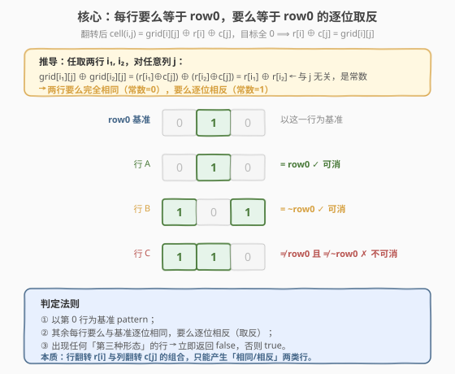
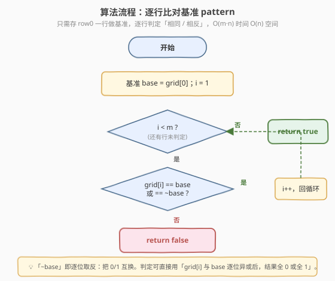
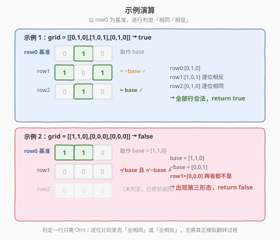

# LeetCode 通过翻转行或列来去除所有的1 题解

## 1. 题目概述

- **标题 / 题号**：通过翻转行或列来去除所有的1（#2128，medium）
- **链接**：https://leetcode.cn/problems/remove-all-ones-with-row-and-column-flips/
- **难度**：中等
- **标签**：数组、矩阵、位运算、数学

**题意**：给定一个 $m \times n$ 的二进制矩阵 `grid`。在一次操作中，你可以选择**任意一行或任意一列**，并把该行/列中的所有值翻转（把 `0` 变 `1`，把 `1` 变 `0`）。

你可以执行任意次操作（包括 0 次）。判断是否能够通过这些操作把矩阵中的**所有 `1` 都移除**（即最终矩阵全为 `0`）。能则返回 `true`，否则返回 `false`。

**示例 1**：

```text
输入：grid = [[0,1,0],[1,0,1],[0,1,0]]
输出：true
解释：一种可行方案：翻转中间行（第 1 行），再翻转中间列（第 1 列）。
```

**示例 2**：

```text
输入：grid = [[1,1,0],[0,0,0],[0,0,0]]
输出：false
解释：无论怎样翻转，都无法把所有 1 移除。
```

**示例 3**：

```text
输入：grid = [[0]]
输出：true
解释：矩阵本就没有 1，无需操作。
```

**约束**：

- $m == \text{grid.length}$
- $n == \text{grid}[i].\text{length}$
- $1 \le m, n \le 300$
- `grid[i][j]` 为 `0` 或 `1`

> 💡 **读题关键**：行/列翻转的**顺序无关**——同一行翻转两次等于没翻。因此每行最终要么翻、要么不翻，每列同理。这把「无限次操作」压缩成「每行/每列各做一个 0/1 选择」，问题从「模拟过程」变成「能否找到一组行/列翻转选择使结果全 0」。

## 2. 解题思路

### 2.1 暴力思路：枚举所有行/列翻转组合

每行有两种选择（翻 / 不翻），每列也有两种，共 $2^{m+n}$ 种组合。对每种组合模拟翻转后检查是否全 0。

```text
for mask in 0 .. 2^(m+n) - 1:
    r[i] = (mask >> i) & 1      // 第 i 行是否翻转
    c[j] = (mask >> (m+j)) & 1  // 第 j 列是否翻转
    if 对所有 (i,j): grid[i][j] ^ r[i] ^ c[j] == 0:
        return true
return false
```

时间复杂度 $O(2^{m+n} \cdot mn)$，$m=n=300$ 时完全不可行。问题在于盲目枚举了所有组合，没有利用「翻转的代数结构」。

### 2.2 核心观察：行翻转 + 列翻转 = 异或分解

设 $r[i] \in \{0,1\}$ 表示第 $i$ 行是否翻转，$c[j] \in \{0,1\}$ 表示第 $j$ 列是否翻转。一次行翻转和一次列翻转对单元格 $(i,j)$ 的作用都是「翻转一次」，可叠加。因此翻转后单元格的最终值为：

$$\text{final}(i,j) = \text{grid}[i][j] \oplus r[i] \oplus c[j]$$

目标是所有单元格最终为 $0$，即对任意 $(i,j)$：

$$r[i] \oplus c[j] = \text{grid}[i][j]$$



**关键推导**：任取两行 $i_1, i_2$，对任意列 $j$，由上式两边分别对应相异或：

$$\text{grid}[i_1][j] \oplus \text{grid}[i_2][j] = (r[i_1] \oplus c[j]) \oplus (r[i_2] \oplus c[j]) = r[i_1] \oplus r[i_2]$$

等号右侧 $r[i_1] \oplus r[i_2]$ **与列 $j$ 无关，是一个常数**（要么恒为 0，要么恒为 1）。这意味着：

- 若常数为 $0$：两行**逐位相同**；
- 若常数为 $1$：两行**逐位相反**（互为取反）。

也就是说，**矩阵中任意两行要么完全相同，要么完全相反**——不存在「第三种形态」。以第 0 行为基准，其余每行要么等于 `row0`，要么等于 `~row0`（逐位取反）。出现任何不满足此条件的行，就无解。

> 💡 **为什么只需看行，不看列？** 行与列在异或分解中地位对称（$r[i] \oplus c[j]$ 对 $i,j$ 对称）。把判定建立在「行之间相同/相反」上已经完整刻画了可行性：若所有行都满足「等于 row0 或 ~row0」，则一定能构造出合法的 $r[\cdot], c[\cdot]$（例如令 $r[i] = \text{grid}[i][0]$，$c[j] = \text{grid}[0][j] \oplus r[0]$ 即可验证）。所以只需逐行判定，无需再单独检查列。

### 2.3 算法流程图



只需保存第 0 行作为基准 `base`，然后从第 1 行起逐行判定：是否与 `base` 逐位相同，或逐位相反。一旦遇到「第三形态」立即返回 `false`；全部通过则返回 `true`。

```text
removeOnes(grid):
    base = grid[0]
    for i in 1 .. m-1:
        if grid[i] 与 base 既不相同也不相反:
            return false
    return true
```

> 💡 **判定「相同或相反」的小技巧**：逐位异或 `grid[i][j] ^ base[j]`，若结果全为 0 即相同，全为 1 即相反。也可以用「相同则完全相等；否则检查是否每个位置都不同」。

### 2.4 示例演算



**示例 1** `grid = [[0,1,0],[1,0,1],[0,1,0]]`：

| 行 | 值 | 与 base=[0,1,0] 关系 | 判定 |
|----|------|----------------------|------|
| row0 | `[0,1,0]` | 基准 | — |
| row1 | `[1,0,1]` | 逐位相反（`~base`） | ✓ |
| row2 | `[0,1,0]` | 逐位相同（`base`） | ✓ |

所有行合法 → `return true`。

**示例 2** `grid = [[1,1,0],[0,0,0],[0,0,0]]`：

| 行 | 值 | 与 base=[1,1,0] 关系 | 判定 |
|----|------|----------------------|------|
| row0 | `[1,1,0]` | 基准 | — |
| row1 | `[0,0,0]` | `~base` 应为 `[0,0,1]`，既非相同也非相反 | ✗ |

第 1 行出现「第三形态」→ `return false`（后续行无需再判）。

## 3. 参考代码

### C++

```cpp
// 通过翻转行或列来去除所有的1 —— 逐行判定 O(mn)/O(n)
// 编译: g++ -O2 -std=c++17 通过翻转行或列来去除所有的1.cpp -o rem
#include <vector>
using namespace std;

class Solution {
public:
    bool removeOnes(vector<vector<int>>& grid) {
        int m = grid.size(), n = grid[0].size();
        const vector<int>& base = grid[0];          // 以第 0 行为基准
        for (int i = 1; i < m; ++i) {
            // 判断 grid[i] 与 base 是「全相同」还是「全相反」
            // diff = base[0] ^ grid[i][0]：0 表示相同，1 表示相反
            int diff = base[0] ^ grid[i][0];
            for (int j = 1; j < n; ++j) {
                if ((base[j] ^ grid[i][j]) != diff) {
                    return false;                   // 既不相同也不相反
                }
            }
        }
        return true;
    }
};
```

### Python

```python
class Solution:
    def removeOnes(self, grid: list[list[int]]) -> bool:
        base = grid[0]
        for row in grid[1:]:
            # row 与 base 要么完全相等，要么逐位相反
            if row != base and row != [1 - v for v in base]:
                return False
        return True
```

> 💡 **实现细节**：① C++ 用 `diff = base[0] ^ grid[i][0]` 一次性确定「该行应相同还是相反」，后续每位只需检查异或值是否都等于 `diff`，比分别判定「全相等 / 全相反」更紧凑。② Python 直接比较 `row != base` 和 `row != [1-v for v in base]`，可读性最佳；若追求性能可写成 `all((a ^ b) == (base[0] ^ row[0]) for a, b in zip(base, row))`。③ 只存 `base` 一行，空间 $O(n)$。

## 4. 复杂度分析

| 维度 | 复杂度 | 说明 |
|------|--------|------|
| **时间复杂度** | $O(m \times n)$ | 最坏遍历所有单元格一次（每行 $n$ 个元素与基准比较） |
| **空间复杂度** | $O(n)$ | 仅保存第 0 行的引用 `base`，无额外矩阵 |

> ⚠️ $m, n \le 300$，$O(mn)$ 最多 $9 \times 10^4$ 次比较，极快。提前返回 `false` 时更省。

## 5. 扩展：从判定到构造翻转方案

本题只问「能否」，但顺着异或分解可以顺便构造出一组合法的翻转方案（若答案为 `true`）：

由 $r[i] \oplus c[j] = \text{grid}[i][j]$，可令：

- $r[i] = \text{grid}[i][0]$（第 $i$ 行是否翻转，由第 0 列决定）；
- $c[j] = \text{grid}[0][j] \oplus r[0]$（第 $j$ 列是否翻转，由第 0 行与 $r[0]$ 决定）。

代入验证：$\text{grid}[i][j] \oplus r[i] \oplus c[j]$ 是否恒为 $0$，等价于「每行等于 row0 或 ~row0」这一条件。这说明判定条件不仅是必要的，也是充分的——一旦所有行满足「相同/相反」，上述构造就给出了一组可行翻转，证明有解。

> 💡 **对称性视角**：把判定建立在「行」上等价于建立在「列」上。若所有行都「等于 row0 或 ~row0」，则所有列也必然「等于 col0 或 ~col0」（反之亦然）。因此「按行判定」与「按列判定」二选一即可，不必都做。

## 6. 面试要点

1. **为什么翻转的顺序和次数不重要？**

   - 同一行/列翻转两次效果互相抵消（异或满足结合律且 $a \oplus a = 0$）。所以每行/每列最终只有「翻一次」或「不翻」两种状态，操作次数可压缩为 $m+n$ 个 0/1 变量，顺序无关。

2. **如何从「模拟翻转」转化为「代数判定」？**

   - 把行翻转 $r[i]$、列翻转 $c[j]$ 抽象为 0/1 变量，单元格终值 $= \text{grid}[i][j] \oplus r[i] \oplus c[j]$。要求全 0 即 $r[i] \oplus c[j] = \text{grid}[i][j]$。这一步把「过程模拟」变成「方程求解」，是本题的关键思维跃迁。

3. **为什么「每行等于 row0 或 ~row0」是充要条件？**

   - **必要**：由两行异或为常数推导，任意两行必须相同或相反。**充分**：若条件成立，令 $r[i] = \text{grid}[i][0]$、$c[j] = \text{grid}[0][j] \oplus r[0]$ 即可构造出合法翻转方案（见第 5 节）。两者合一即为充要。

4. **为什么只检查行就够了，不用再检查列？**

   - 行与列在 $r[i] \oplus c[j]$ 中对称。「所有行都是 row0 或 ~row0」与「所有列都是 col0 或 ~col0」互为充要（可互相推导）。做行判定已完整覆盖可行性，再查列是冗余。

5. **如果题目改为「翻转一个单元格及其所在行和列」呢？**

   - 那是另一类「开关灯」问题（如 1284），单元格终值依赖多个翻转的组合，判定条件不同。本题的关键在于行/列翻转**只受两个变量 $r[i], c[j]$ 控制**，结构简单，才能化为「行相同/相反」判定。混淆两类问题是常见误区。

> 💡 **一句话总结**：2128 的核心是把行/列翻转抽象为异或变量 $r[i] \oplus c[j] = \text{grid}[i][j]$，推出「任意两行异或为常数」→ 每行只能等于 row0 或其逐位取反，$O(mn)$ 一次扫描判定。

## 同类练习题

| # | 题目 | 与本题的关联 |
|---|------|-------------|
| 1284 | [转化为全零矩阵的最少翻转次数](https://leetcode.cn/problems/minimum-number-of-flips-to-convert-binary-matrix-to-zero-matrix/) | 翻转一个单元格及其四邻（行/列邻位），状态依赖更复杂，对比「单变量行/列翻转」与「多变量单元格翻转」的结构差异 |
| 2125 | [银行中的激光束数量](https://leetcode.cn/problems/number-of-laser-beams-in-a-bank/)（[题解](2125_银行中的激光束数量.md)） | 同属矩阵扫描题，把「阻断条件」化简为相邻配对的化约思想，与本题「化翻转模拟为行 pattern 判定」异曲同工 |
| 733 | [图像渲染](https://leetcode.cn/problems/flood-fill/) | 矩阵遍历 + 连通区域处理，对比线性扫描与图搜索的边界 |
| 832 | [翻转图像](https://leetcode.cn/problems/flipping-an-image/) | 行翻转 + 取反的纯模拟，作为本题「翻转操作语义」的入门热身 |
| 1252 | [奇数值单元格的数目](https://leetcode.cn/problems/cells-with-odd-values-in-a-matrix/) | 行列增量计数，练习「行/列独立统计」的分解思想，与本题行/列翻转分解同源 |
