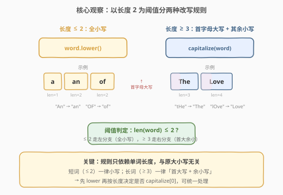
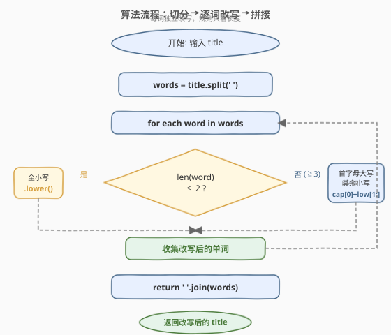
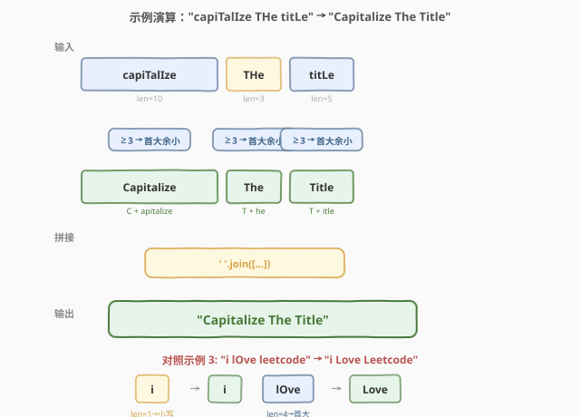

# LeetCode 将标题首字母大写 题解

## 1. 题目概述

- **标题 / 题号**：将标题首字母大写（#2129，easy）
- **链接**：https://leetcode.cn/problems/capitalize-the-title/
- **难度**：简单
- **标签**：字符串、模拟

**题意**：给定一个字符串 `title`，由若干个**以单个空格分隔**的单词组成，每个单词只含英文字母。要求按以下规则改写标题中每个单词的大小写：

1. 若单词长度为 **1 或 2**，则将所有字母改为**小写**；
2. 否则（长度 $\geq 3$），将**首字母大写**、**其余字母小写**。

返回改写后的标题字符串。

**示例 1**：

```text
输入：title = "capiTalIze THe titLe"
输出："Capitalize The Title"
解释：
  "capiTalIze" 长度 10 ≥ 3 → "Capitalize"
  "THe"        长度 3  ≥ 3 → "The"
  "titLe"      长度 5  ≥ 3 → "Title"
```

**示例 2**：

```text
输入：title = "First leTTeR is ALWAYS a Capital"
输出："First Letter is Always a Capital"
解释：
  "is" 长度 2 ≤ 2 → "is"（全小写）
  "a"  长度 1 ≤ 2 → "a" （全小写）
  其余长度 ≥ 3，首大余小
```

**示例 3**：

```text
输入：title = "i lOve leetcode"
输出："i Love Leetcode"
解释：
  "i"        长度 1 ≤ 2 → "i"
  "lOve"     长度 4 ≥ 3 → "Love"
  "leetcode" 长度 8 ≥ 3 → "Leetcode"
```

**约束**：

- $1 \leq \text{title.length} \leq 100$
- `title` 由单词组成，单词间以单个空格分隔
- 每个单词由大写和小写英文字母组成
- 不含前导 / 尾随空格，单词间只有一个空格

> 💡 **关键结构**：题目的本质是「切分 → 逐词改写 → 拼接」的字符串模拟。改写规则**只依赖单词长度**，与原大小写无关——这是简化实现的钥匙。

## 2. 解题思路

### 2.1 暴力思路：逐字符扫描判定

最直白的做法是不切分单词，直接在原串上扫描：遇到空格就切出一个单词，统计长度后再决定每个字母怎么改。这能出正确结果，但**把「按词处理」和「按字符改写」混在一起**，逻辑分支多、易写错。实际上单词之间相互独立，**完全可以先切分再逐词处理**，让代码结构更清晰。

### 2.2 核心观察：规则只依赖单词长度



关键观察：改写规则**只看单词长度，不看原始大小写**。这意味着对每个单词可以采用**统一的「先全小写，再按长度决定是否大写首字母」**流程：

- $\text{len} \leq 2$：直接 `.lower()`，结束。
- $\text{len} \geq 3$：`.lower()` 后再把 `word[0]` 大写。

> 💡 **为什么「先 lower 再 capitalize」更稳妥？** 因为规则要求「其余字母小写」。如果先 capitalize 再处理中间字母，容易遗漏原串中混入的大写字母（如 `"lOve"` 里的 `O`）。先整体小写、再只动首字母，一步到位，无遗漏。

> ⚠️ 注意阈值是**严格 $\leq 2$ 走小写分支**，即长度 1 和 2 都要全小写。常见笔误是把阈值写成 `< 2`（只处理长度 1），漏掉长度 2 的单词。

### 2.3 算法流程图



1. **切分**：`words = title.split(' ')`，得到单词列表。
2. **逐词改写**：对每个 `word`：
   - 若 `len(word) <= 2`：`word = word.lower()`
   - 否则：`word = word.lower(); word = word[0].upper() + word[1:]`
3. **拼接**：`return ' '.join(words)`。

> 💡 **为什么可以直接 `split(' ')`？** 约束保证单词间**恰好一个空格**、无前后导空格，所以 `split(' ')` 切出的就是干净单词列表，无需额外清洗。若输入可能有连续空格，改用 `split()`（无参）会更鲁棒。

### 2.4 示例演算

以示例 1 `title = "capiTalIze THe titLe"` 为例：



| 单词 | 长度 | 规则分支 | 改写过程 | 结果 |
|------|------|----------|----------|------|
| `capiTalIze` | 10 | $\geq 3$：首大余小 | `lower()` → `"capitalize"` → 大写首字母 | `Capitalize` |
| `THe` | 3 | $\geq 3$：首大余小 | `lower()` → `"the"` → 大写首字母 | `The` |
| `titLe` | 5 | $\geq 3$：首大余小 | `lower()` → `"title"` → 大写首字母 | `Title` |

拼接得 `"Capitalize The Title"`。

对照示例 3 `title = "i lOve leetcode"`：单词 `"i"` 长度 1 走小写分支保持 `"i"`；`"lOve"` 和 `"leetcode"` 长度 $\geq 3$ 走首大余小分支，得 `"Love"`、`"Leetcode"`。最终 `"i Love Leetcode"`——注意短词 `"i"` 仍为小写，这正是阈值规则的作用。

## 3. 参考代码

### Python

```python
class Solution:
    def capitalizeTitle(self, title: str) -> str:
        words = title.split(' ')
        for i, w in enumerate(words):
            if len(w) <= 2:
                words[i] = w.lower()
            else:
                w = w.lower()
                words[i] = w[0].upper() + w[1:]
        return ' '.join(words)
```

### C++

```cpp
class Solution {
public:
    string capitalizeTitle(string title) {
        string ans;
        ans.reserve(title.size());
        int n = title.size(), i = 0;
        while (i < n) {
            int start = i;
            while (i < n && title[i] != ' ') i++;       // 找到一个单词 [start, i)
            int len = i - start;
            for (int k = start; k < i; ++k) {
                char c = tolower(title[k]);
                if (len > 2 && k == start) c = toupper(c);
                ans.push_back(c);
            }
            if (i < n) ans.push_back(' ');              // 补空格
            i++;                                         // 跳过空格
        }
        return ans;
    }
};
```

> 💡 **实现细节**：① Python 用 `split` + `join` 最简洁，原地修改列表避免反复拼接字符串。② C++ 用单遍扫描就地构造结果，`tolower` / `toupper` 来自 `<cctype>`；`ans.reserve(n)` 预分配避免扩容。③ C++ 也可用 `istringstream` 切分单词，但单遍扫描常数更小。

## 4. 复杂度分析

| 维度 | 复杂度 | 说明 |
|------|--------|------|
| 时间 | $O(n)$ | 切分 $O(n)$ + 逐词改写每字符访问一次 $O(n)$ + 拼接 $O(n)$；每个字符常数次操作 |
| 空间 | $O(n)$ | 切分出的单词列表与结果字符串均与 $n$ 同阶 |

> 💡 约束 $n \leq 100$，最大操作数百次，远低于时限。即便 $n$ 放大到 $10^6$，$O(n)$ 仍轻松通过——瓶颈在常数而非渐近复杂度。C++ 单遍扫描写法不计输出缓冲则额外空间 $O(1)$。

## 5. 扩展：利用语言内置 capitalize

Python 的 `str.capitalize()` 会把首字母大写、其余小写，**恰好满足长度 $\geq 3$ 分支的需求**。结合规则可进一步简化：

```python
class Solution:
    def capitalizeTitle(self, title: str) -> str:
        def fix(w):
            return w.lower() if len(w) <= 2 else w.capitalize()
        return ' '.join(map(fix, title.split(' ')))
```

> ⚠️ **`capitalize` 与 `title` 方法的区别**：Python 还有 `str.title()`，它会把**每个空格后**的字母都大写（如 `"hello world"` → `"Hello World"`）。看似契合本题，但它会错误处理含撇号等情况（如 `"don't"` → `"Don'T"`），且**不区分单词长度**——长度 $\leq 2$ 的词不应大写。因此不能直接用 `title.title()`，必须按长度分支。

## 6. 面试要点

1. **为什么不能直接用 `str.title()` / `String.toUpperCase` 全局处理？**
   > 因为题目对**短词（长度 $\leq 2$）**有特殊规则——必须全小写。`title()` 不区分长度，会把 `"is"` 变成 `"Is"`，违反规则。必须按长度分支处理。

2. **为什么建议「先 lower 再 capitalize 首字母」而不是逐字符判断？**
   > 规则要求「其余字母小写」。若逐字符判断，需对每个非首字母单独 `lower()`，逻辑易乱。先整体 `lower()` 把所有字母归一化，再只动首字母，**一步到位无遗漏**，且代码更简洁。

3. **阈值是 `< 2` 还是 `<= 2`？**
   > `<= 2`。长度 1 和 2 的单词都要全小写。常见笔误是写成 `< 2`，只处理长度 1，漏掉长度 2（如把 `"is"` 错误地改成 `"Is"`）。

4. **如果输入可能有连续空格或前导空格怎么办？**
   > 约束保证单词间恰好一个空格、无前后导空格，所以 `split(' ')` 安全。若放宽约束，应改用 `split()`（无参）自动合并连续空白，或预处理去除前后导空格后再切分。

5. **能否原地修改字符串？**
   > Python 字符串不可变，必须构造新串。C++ 中 `string` 可变，理论上可原地改，但需处理「长度变化」（本题长度不变，每个字符替换即可）和空格定位，不如构造新串直观。本题数据量小，构造新串更清晰。

> 💡 **一句话总结**：2129 是「切分 + 逐词按长度改写 + 拼接」的字符串模拟题，核心是识别规则只依赖单词长度，用「先 lower 再按长度 capitalize 首字母」统一处理。$O(n)$ 时间、$O(n)$ 空间，注意阈值是 $\leq 2$。

## 同类练习题

| # | 题目 | 与本题的关联 |
|---|------|-------------|
| 58 | [最后一个单词的长度](https://leetcode.cn/problems/length-of-last-word/)（[题解](../0001-0100/58_最后一个单词的长度.md)） | 同样涉及按空格切分单词，字符串基础扫描题 |
| 2109 | [向字符串添加空格](https://leetcode.cn/problems/adding-spaces-to-a-string/)（[题解](../2101-2200/2109_向字符串添加空格.md)） | 在指定位置插入空格，与本题「按空格切分」互为正反操作 |
| 1694 | [重新格式化电话号码](https://leetcode.cn/problems/reformat-phone-number/)（[题解](../1601-1700/1694_重新格式化电话号码.md)） | 过滤 + 定长分块 + 拼接，同属字符串重新格式化家族 |
| 1662 | [检查两个字符串数组是否相等](https://leetcode.cn/problems/check-if-two-string-arrays-are-equivalent/) | 字符串拼接比较，同样涉及「先把碎片拼成整体再处理」 |
| 709 | [转换成小写字母](https://leetcode.cn/problems/to-lower-case/) | 最基础的大小写转换，本题「先 lower」步骤的母题 |
