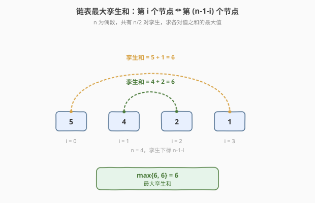
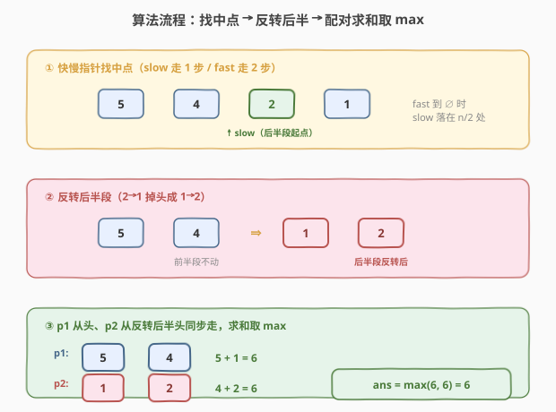

# LeetCode 链表最大孪生和 题解

## 1. 题目概述

- **标题 / 题号**：链表最大孪生和（#2130，medium）
- **链接**：https://leetcode.cn/problems/maximum-twin-sum-of-a-linked-list/
- **难度**：中等
- **标签**：链表、双指针、快慢指针

**题意**：给定一个长度为 `n`（`n` 为**偶数**）的单链表头节点 `head`，节点下标从 `0` 开始。对于 `0 <= i <= n/2 - 1`，第 `i` 个节点的**孪生节点**定义为第 `(n - 1 - i)` 个节点。

- **孪生和** = 一个节点与其孪生节点两者值之和。
- 共有 `n/2` 对孪生，要求返回其中的**最大孪生和**。

**示例 1**：

```text
输入：head = [5,4,2,1]
输出：6
解释：n = 4，孪生对为 (0,3) 与 (1,2)。
  - 节点 0 与节点 3：5 + 1 = 6
  - 节点 1 与节点 2：4 + 2 = 6
  最大孪生和 = max(6, 6) = 6。
```

**示例 2**：

```text
输入：head = [4,2,2,3]
输出：7
解释：n = 4。
  - 节点 0 与节点 3：4 + 3 = 7
  - 节点 1 与节点 2：2 + 2 = 4
  最大孪生和 = max(7, 4) = 7。
```

**示例 3**：

```text
输入：head = [1,100000]
输出：100001
解释：n = 2，仅一对孪生 (0,1)，和为 1 + 100000 = 100001。
```

**约束**：

- 链表节点数目为 `[2, 10^5]` 中的**偶数**
- `1 <= Node.val <= 10^5`

> 💡 **审题关键**：① 链表长度恒为偶数，故恰好有 `n/2` 对孪生，不存在「中间落单节点」；② 孪生对是**首尾对称配对**——第 `i` 个配第 `n-1-i` 个，等价于「前半段正序」与「后半段逆序」逐位相加；③ 单链表无法从尾部回头，所以「逆序读后半段」必须靠**就地反转**实现，这正是本题的切入点。

## 2. 解题思路

### 2.1 暴力思路：复制到数组再配对

链表不支持随机访问、也不能从尾向头走，最直觉的做法是**把所有节点值复制到数组**，再用下标直接配对：

```text
vals = []
for p in head..end: vals.append(p.val)
n = len(vals)
ans = 0
for i in 0 .. n/2 - 1:
    ans = max(ans, vals[i] + vals[n-1-i])
return ans
```

- 时间 $O(n)$，空间 $O(n)$（要开一个长度为 $n$ 的数组）。

能 AC，但**用了 $O(n)$ 额外空间**。它的本质问题是：链表「只能单向走」的特性让我们不得不用数组来「反着读后半段」。如果能**在链表上直接把后半段反过来**，就能省掉数组，把空间压到 $O(1)$。

> ⚠️ 暴力法把链表的「顺序值」搬进了数组，相当于用 $O(n)$ 空间换取了「双向访问」的能力。最优解的思路是：与其搬数据，不如**就地反转后半段链表**，让指针自己会「倒着走」——这与 [234. 回文链表](../0201-0300/234_回文链表.md) 的进阶解法如出一辙。

### 2.2 核心观察：找中点 → 反转后半 → 配对求和



三步组合，每一步都是已学过的原子操作：

1. **找中点**：快慢双指针 `slow` 走 1 步、`fast` 走 2 步。由于链表长度恒为偶数，`fast` 走到 `null` 时 `slow` 恰好落在第 `n/2` 个节点（即**后半段的起点**）。
2. **反转后半段**：从 `slow` 开始，套用 [206. 反转链表](../0201-0300/206_反转链表.md) 的三指针迭代法把后半段原地掉头。
3. **配对求和**：`p1` 从 `head` 出发（正序走前半段）、`p2` 从反转后的后半段头出发（逆序走原后半段），逐对计算 `p1.val + p2.val` 取最大值。

> 💡 **为什么这样配对正好是孪生对？** 反转后半段后，原来第 `n-1` 个节点（尾）成了后半段的新头，第 `n/2` 个节点成了后半段的新尾。于是 `p2` 的第 `k` 步落在原链表的第 `n-1-k` 个节点上，而 `p1` 的第 `k` 步落在原链表的第 `k` 个节点上——二者下标之和恰为 `n-1`，正是孪生定义！所以「前半段正序 + 后半段反转后正序」天然就是孪生配对，无需任何下标计算。

**关键性质：两段等长**

由于 `n` 恒为偶数，前半段与后半段长度都是 `n/2`，`p1`、`p2` 同步前进、同时走完。比较循环用 `while p2`（或 `while p1`）控制即可，不会出现一段先结束的边界问题——这比 [234](../0201-0300/234_回文链表.md) 还要简单（234 要处理奇数链正中节点）。

### 2.3 算法流程图



**完整步骤**：

1. **找后半段起点**：`slow = fast = head`，循环 `while fast and fast.next`，每轮 `slow` 走 1 步、`fast` 走 2 步。结束时 `slow` 在后半段第一个节点。
2. **反转后半段**：从 `slow` 开始做三指针反转，返回反转后的新头 `second`。
3. **配对求和**：`p1 = head`，`p2 = second`，`ans = 0`；只要 `p2` 非空就 `ans = max(ans, p1.val + p2.val)`，各自前进一步。
4. **（可选）恢复链表**：本题不要求，若需保持原结构可再反转一次接回。
5. **返回** `ans`。

> 💡 **写法要点**：① 链表长度恒为偶数，循环条件用 `while fast and fast.next`（**取后中点**）让 `slow` 落在后半段起点；② 反转从 `slow` 开始而非 `slow.next`——因为 `slow` 本身就属于后半段；③ 配对循环用 `while p2` 控制，两段等长同步走完。

### 2.4 示例演算

以 `head = [5, 4, 2, 1]` 逐步演算三步执行过程：

![示例演算：[5,4,2,1] 的找中点、反转后半、配对求和全过程](../images/2130_example_walkthrough.svg)

| 步骤 | 操作 | 链表状态 | 说明 |
|------|------|---------|------|
| ① 找中点 | `slow` 走到值 2 | `5→4→[2]→1` | `fast` 走到 `null`，`slow` 落在后半段起点（下标 2） |
| ② 反转后半 | 反转 `2→1` | 前半 `5→4`，后半 `1→2` | 后半段掉头，新头为原尾节点 1 |
| ③ 轮 1 | `p1=5, p2=1` | `5+1=6` | `ans = 6` |
| ③ 轮 2 | `p1=4, p2=2` | `4+2=6` | `ans = max(6, 6) = 6` |
| 终止 | `p2 = null` | — | 两段等长同步走完，返回 `ans = 6` ✓ |

**对照示例 2** `head = [4, 2, 2, 3]`：`slow` 落在值 2（下标 2），后半段 `2→3` 反转成 `3→2`。配对：`p1(4)+p2(3)=7`，`p1(2)+p2(2)=4`，`ans = max(7, 4) = 7` ✓。

## 3. 参考代码

### C++（$O(n)$ / $O(1)$）

```cpp
/**
 * Definition for singly-linked list.
 * struct ListNode {
 *     int val;
 *     ListNode *next;
 *     ListNode() : val(0), next(nullptr) {}
 *     ListNode(int x) : val(x), next(nullptr) {}
 *     ListNode(int x, ListNode *next) : val(x), next(next) {}
 * };
 */
class Solution {
public:
    int pairSum(ListNode* head) {
        // ① 快慢指针找后半段起点（n 恒为偶数，slow 落在 n/2 处）
        ListNode* slow = head;
        ListNode* fast = head;
        while (fast && fast->next) {
            slow = slow->next;
            fast = fast->next->next;
        }

        // ② 反转后半段
        ListNode* second = reverseList(slow);

        // ③ 配对求和取 max
        ListNode* p1 = head;
        ListNode* p2 = second;
        int ans = 0;
        while (p2) {
            ans = max(ans, p1->val + p2->val);
            p1 = p1->next;
            p2 = p2->next;
        }
        return ans;
    }

private:
    ListNode* reverseList(ListNode* head) {
        ListNode* prev = nullptr;
        ListNode* curr = head;
        while (curr) {
            ListNode* nxt = curr->next;
            curr->next = prev;
            prev = curr;
            curr = nxt;
        }
        return prev;
    }
};
```

### Python

```python
# Definition for singly-linked list.
# class ListNode:
#     def __init__(self, val=0, next=None):
#         self.val = val
#         self.next = next
class Solution:
    def pairSum(self, head: Optional[ListNode]) -> int:
        # ① 快慢指针找后半段起点
        slow = fast = head
        while fast and fast.next:
            slow = slow.next
            fast = fast.next.next

        # ② 反转后半段
        second = self._reverse(slow)

        # ③ 配对求和取 max
        p1, p2 = head, second
        ans = 0
        while p2:
            ans = max(ans, p1.val + p2.val)
            p1, p2 = p1.next, p2.next
        return ans

    def _reverse(self, head: Optional[ListNode]) -> Optional[ListNode]:
        prev, curr = None, head
        while curr:
            nxt = curr.next
            curr.next = prev
            prev = curr
            curr = nxt
        return prev
```

> 💡 **写法要点**：① 找中点用 `while fast and fast.next`（取后中点），`slow` 直接落在后半段起点，反转从 `slow` 开始；② `reverseList` 完全复用 [206. 反转链表](../0201-0300/206_反转链表.md) 的三指针模板；③ 配对循环用 `while p2`——两段等长，`p2` 走完即停，无需额外计数。

## 4. 复杂度分析

| 维度 | 复杂度 | 说明 |
|------|--------|------|
| **时间复杂度** | $O(n)$ | 找中点遍历一半 $O(n)$；反转后半段 $O(n)$；配对求和 $O(n/2)$，总和仍为线性 |
| **空间复杂度** | $O(1)$ | 只用 `slow`/`fast`/`prev`/`curr`/`p1`/`p2` 等常数个指针，无递归栈、无数组 |

> ⚠️ 三段遍历每段都是线性，总常数因子约 $2n$，仍是 $O(n)$。相比暴力法的 $O(n)$ 数组，本解法把空间从 $O(n)$ 压到 $O(1)$，是面试官最爱追问的「能不能不要额外空间」的样板解。

## 5. 扩展：与回文链表 / 重排链表的对比

本题与 [234. 回文链表](../0201-0300/234_回文链表.md)、[143. 重排链表](../0101-0200/143_重排链表.md) 共用同一套「找中点 + 反转后半」三件套，差别仅在第三步：

| 题目 | 链表长度 | 取中点 | 反转起点 | 第三步操作 |
|------|---------|--------|----------|-----------|
| [234 回文链表](../0201-0300/234_回文链表.md) | 奇偶皆可 | 取**前**中点 `fast.next && fast.next.next` | `slow.next` | 双指针**判等**，跳过奇数正中节点 |
| **2130 本题** | **恒偶数** | 取**后**中点 `fast && fast.next` | `slow` | 双指针**求和取 max**，两段等长 |
| [143 重排链表](../0101-0200/143_重排链表.md) | 奇偶皆可 | 取前中点 | `slow.next` | 双指针**交错合并**成 `L0→Ln→L1→Ln-1→…` |

> 💡 **取前中点 vs 取后中点**：当链表长度可能为奇数时，取前中点（`fast.next && fast.next.next`）让 `slow` 停在前半段末尾，`slow.next` 恰为后半段起点，能干净地跳过正中节点；本题长度恒为偶数，没有正中节点，直接取后中点（`fast && fast.next`）让 `slow` 落在后半段起点，反转从 `slow` 开始即可。口诀：**奇数链取前中点用 `fast.next && fast.next.next`，偶数链取后中点用 `fast && fast.next`**。

## 6. 面试要点

**Q1：为什么反转后半段后，配对的就是孪生节点？**

> 反转后半段后，原尾节点（第 `n-1` 个）成了后半段新头。`p2` 第 `k` 步落在原链表第 `n-1-k` 个节点，`p1` 第 `k` 步落在原链表第 `k` 个节点，二者下标和为 `n-1`，正是孪生定义。所以「前半正序 + 后半反转后正序」天然配对，无需下标运算。

**Q2：找中点为什么用 `while fast and fast.next` 而不是 `while fast.next and fast.next.next`？**

> 题目保证长度恒为偶数，`fast` 走到 `null` 时 `slow` 恰好落在第 `n/2` 个节点（后半段起点），反转从 `slow` 开始。若用 `fast.next && fast.next.next`（取前中点），`slow` 会停在前半段末尾，反转要从 `slow.next` 开始——奇数链才需要这种取法以跳过正中节点，偶数链两种写法都能 AC，但取后中点更贴合「均分两段」的语义。

**Q3：配对循环用 `while p1` 还是 `while p2`？**

> 都行。两段等长（各 `n/2`），`p1`、`p2` 同时走完。习惯上用 `while p2`——后半段是反转得到的「新链表」，用它控制循环更直观。若题目放宽为奇数长度，则需用较短的一段控制并处理正中节点，参考 [234](../0201-0300/234_回文链表.md)。

**Q4：反转后半段会破坏原链表，需要恢复吗？**

> 题目不强制。若调用方之后还要用原链表，可花 $O(n)$ 再反转一次接回，空间仍为 $O(1)$。面试中主动提一句「需要的话我可以恢复原结构」，体现工程素养——这与 [234](../0201-0300/234_回文链表.md) 的恢复步骤完全一致。

**Q5：能不能不反转、用栈做？**

> 可以：第一遍把前半段压栈，第二遍从后半段起点出发，逐个弹栈配对求和。时间 $O(n)$、空间 $O(n)$——本质和「复制到数组」一样用额外空间换「反着读」的能力。面试中作为过渡解法提出即可，最终应落到 $O(1)$ 空间的反转法。

> 💡 **一句话总结**：2130 = 取后中点的快慢指针 + 三指针反转后半段（206）+ 双指针配对求和取 max。三段均为 $O(n)$ / $O(1)$，是「找中点 + 反转后半」三件套在偶数链上的最简应用。

## 同类练习题

| # | 题目 | 与本题的关联 |
|---|------|-------------|
| 234 | [回文链表](https://leetcode.cn/problems/palindrome-linked-list/)（[题解](../0201-0300/234_回文链表.md)） | 同一三件套，第三步改为「判等」并处理奇数正中节点——本题的「判定版」前身 |
| 143 | [重排链表](https://leetcode.cn/problems/reorder-list/)（[题解](../0101-0200/143_重排链表.md)） | 同一三件套，第三步改为「交错合并」，本体最复杂的变体 |
| 206 | [反转链表](https://leetcode.cn/problems/reverse-linked-list/)（[题解](../0201-0300/206_反转链表.md)） | 三指针反转模板，本题后半段反转直接复用 |
| 876 | [链表的中间结点](https://leetcode.cn/problems/middle-of-the-linked-list/) | 快慢指针找中点的原版，本题取后中点的来源 |
| 2095 | [删除链表的中间节点](https://leetcode.cn/problems/delete-the-middle-node-of-a-linked-list/) | 快慢指针找中点 + 删除，体会找中点后如何操作前驱指针 |
