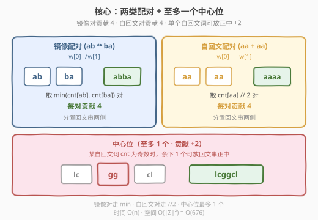
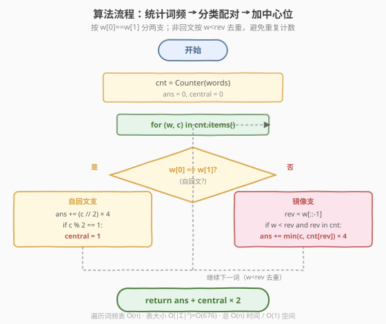
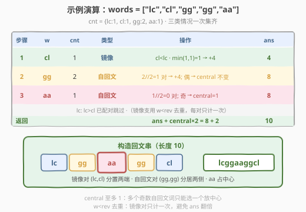

# 连接两字母单词得到的最长回文串

- **题目名称**：连接两字母单词得到的最长回文串
- **链接**：[2131. 连接两字母单词得到的最长回文串](https://leetcode.cn/problems/longest-palindrome-by-concatenating-two-letter-words/)
- **难度**：中等
- **标签**：贪心、数组、哈希表、字符串、计数

## 1. 题目概述

给定一个字符串数组 `words`，其中每个元素都是一个**长度为 2** 的小写英文字母单词。请你从 `words` 中选择一些元素，按**任意顺序**连接，得到一个**尽可能长的回文串**。每个元素**至多**只能使用一次。返回你能得到的最长回文串的**长度**；若无法得到任何回文串，返回 `0`。

> **回文串**：从前往后和从后往前读都一样的字符串。

**示例 1**：

```text
输入：words = ["lc","cl","gg"]
输出：6
解释：最长回文串为 "lc" + "gg" + "cl" = "lcggcl"，长度为 6。
"clgglc" 是另一个可以得到的最长回文串。
```

**示例 2**：

```text
输入：words = ["ab","ty","yt","lc","cl","ab"]
输出：8
解释：最长回文串是 "ty" + "lc" + "cl" + "yt" = "tylcclyt"，长度为 8。
注意 "ab" 出现两次，但 "ba" 不在 words 中，无法配对，被丢弃。
```

**示例 3**：

```text
输入：words = ["cc","ll","xx"]
输出：2
解释：最长回文串是 "cc"（或 "ll" / "xx"），长度为 2。
三个自回文词都只剩 1 个，只能选一个放中心。
```

**约束条件**：

- $1 \le \text{words.length} \le 10^5$
- $\text{words}[i].\text{length} == 2$
- `words[i]` 仅包含小写英文字母

> 💡 **读题关键**：每个单词长度恰为 2，是本题最关键的结构约束——它把「回文配对」问题切成两类整齐的情况：**两字符不同**的「镜像对」与**两字符相同**的「自回文词」。抓住这个二分，问题立刻简化为计数 + 取最小值。

---

## 2. 解题思路

### 2.1 暴力思路：枚举所有子集

最直白的做法：枚举 `words` 的所有子集（共 $2^n$ 个），对每个子集尝试所有排列，判定拼接后是否为回文串，记录最长长度。

```text
ans = 0
for subset in 2^words:               // 2^n 个子集
    for perm in permutations(subset): // |subset|! 个排列
        s = concat(perm)
        if isPalindrome(s):
            ans = max(ans, len(s))
return ans
```

时间复杂度 $O(2^n \cdot n! \cdot n)$，$n = 10^5$ 时宇宙热寂都跑不完。空间 $O(n)$ 存子集。

> ⚠️ 暴力的浪费在于：把「能否拼成回文」当作逐子集逐排列验证的黑盒，完全忽略了两字母单词的**配对结构**。事实上回文串的对称性天然把单词分成「左侧」和「右侧（左侧的镜像）」两组，再加一个可选的中心位——这是一条**全局结构**，只需一次计数即可确定所有合法配对。

### 2.2 核心观察：两类配对 + 至多一个中心位

长度为 2 的单词只有两类：

1. **镜像词**（$w[0] \ne w[1]$，如 `"ab"`）：它的回文伴侣是翻转 `"ba"`。二者一左一右拼在回文串两端，形成 `"ab...ba"`，贡献 $4$ 字符。
2. **自回文词**（$w[0] == w[1]$，如 `"aa"`）：翻转后仍是自身。两个 `"aa"` 一左一右拼成 `"aa...aa"`，贡献 $4$ 字符。

由此得到三条计数规则：

| 类型 | 配对方式 | 数量 | 贡献 |
|------|----------|------|------|
| **镜像对** $w$ 与 $\text{rev}(w)$ | 各取 1 个拼两端 | $\min(\text{cnt}[w], \text{cnt}[\text{rev}(w)])$ 对 | $4 \times \text{对数}$ |
| **自回文对** $w$ 与 $w$ | 各取 1 个拼两端 | $\text{cnt}[w] // 2$ 对 | $4 \times \text{对数}$ |
| **中心位** | 单个自回文词放正中 | 至多 1 个（某自回文词频次为奇时） | $+2$ |



> 💡 **为什么中心位至多 1 个？** 回文串只有一个正中位置（长度为奇时的中心字符对）。若放两个自回文词 `"aa"` 和 `"bb"` 在中间，得到 `...aabb...`，右侧需有镜像 `bbaa...` 才回文——但那样它们就该作为「自回文对」分置两侧，而非挤在中心。因此中心位是**奇数个自回文词的「零头」**：每个自回文词频次为奇时各有 1 个零头，但只能挑 1 个放中心，其余丢弃。

> ⚠️ **镜像对要去重计数**：遍历词频表时，`"ab"` 和 `"ba"` 都会被访问。若每次都加 $\min$，答案会翻倍。用 `w < rev(w)` 条件保证每对只计一次——`"ab" < "ba"`（字典序），所以处理 `"ab"` 时计，处理 `"ba"` 时跳过。自回文词 $w == \text{rev}(w)$ 不受影响，走另一分支。

### 2.3 算法流程图



```text
longestPalindrome(words):
    cnt = Counter(words)
    ans = 0, central = 0
    for (w, c) in cnt.items():
        if w[0] == w[1]:                  // 自回文词
            ans += (c // 2) * 4            // 成对放两侧
            if c % 2 == 1:
                central = 1                // 记一个零头可放中心
        else:                              // 镜像词
            rev = w[::-1]
            if w < rev and rev in cnt:     // 去重：只处理 w<rev
                ans += min(c, cnt[rev]) * 4
    return ans + central * 2
```

> 💡 **实现要点**：① 用 `Counter` 一次统计词频，$O(n)$。② `w < rev` 是字符串字典序比较，保证镜像对只计一次。③ `central` 是 0/1 布尔标志，不是计数——多个奇数自回文词也只能放 1 个中心。④ 最终 `ans + central * 2` 把中心位长度加上。

### 2.4 示例演算

以自定义输入 `words = ["lc","cl","gg","gg","aa"]` 为例（集齐三类情况）：

- 统计词频：$\text{cnt} = \{\text{lc}:1, \text{cl}:1, \text{gg}:2, \text{aa}:1\}$
- 遍历每个词：

| 步骤 | $w$ | $\text{cnt}[w]$ | 类型 | 操作 | $\text{ans}$ |
|------|-----|-----------------|------|------|---------------|
| 1 | `cl` | 1 | 镜像 | `cl < lc` · $\min(1,1)=1$ → $+4$ | 4 |
| 2 | `gg` | 2 | 自回文 | $2//2=1$ 对 → $+4$；偶 → central 不变 | 8 |
| 3 | `aa` | 1 | 自回文 | $1//2=0$ 对；奇 → $\text{central}=1$ | 8 |
| 返回 | — | — | — | $8 + 1 \times 2$ | **10** |

> 注：处理 `lc` 时 `lc > cl`，已在步骤 1 配对，跳过（镜像支用 $w < \text{rev}$ 去重）。



构造出的回文串为 $\text{lc} + \text{gg} + \text{aa} + \text{gg} + \text{cl} = \text{"lcggaaggcl"}$（长度 10）：
- 镜像对 `(lc, cl)` 分置两端
- 自回文对 `(gg, gg)` 分居中心两侧
- 单个 `aa` 占正中（`aa` 频次为奇，零头放中心）

最终 $\text{ans} = 8 + 2 = 10$ ✓。

**对照示例 2** `["ab","ty","yt","lc","cl","ab"]`：`ab` 出现两次但 `ba` 不存在 → 0 对；`(ty,yt)` 和 `(lc,cl)` 各 1 对 → $+8$；无自回文词 → central=0；答案 $8$。**对照示例 3** `["cc","ll","xx"]`：三个自回文词各频次 1，均无成对 → 0 对；三个奇零头只能选 1 个放中心 → $+2$；答案 $2$。

---

## 3. 参考代码

### C++

```cpp
// 连接两字母单词得到的最长回文串 —— 词频计数 + 分类配对 O(n)/O(|Σ|²)
// 编译: g++ -O2 -std=c++17 连接两字母单词得到的最长回文串.cpp -o sol
#include <string>
#include <vector>
#include <unordered_map>
#include <algorithm>
using namespace std;

class Solution {
public:
    int longestPalindrome(vector<string>& words) {
        unordered_map<string, int> cnt;
        for (const string& w : words) cnt[w]++;

        int ans = 0, central = 0;
        for (auto& [w, c] : cnt) {
            if (w[0] == w[1]) {                 // 自回文词：成对放两侧
                ans += (c / 2) * 4;
                if (c % 2) central = 1;         // 奇零头可放中心（至多 1 个）
            } else {                            // 镜像词：与 rev 配对
                string rev = w;
                swap(rev[0], rev[1]);
                if (w < rev && cnt.count(rev)) {// w<rev 去重，每对只计一次
                    ans += min(c, cnt[rev]) * 4;
                }
            }
        }
        return ans + central * 2;
    }
};
```

### Python

```python
from collections import Counter
from typing import List

class Solution:
    def longestPalindrome(self, words: List[str]) -> int:
        cnt = Counter(words)
        ans = central = 0
        for w, c in cnt.items():
            if w[0] == w[1]:                    # 自回文词：成对放两侧
                ans += (c // 2) * 4
                if c % 2:
                    central = 1                 # 奇零头可放中心（至多 1 个）
            else:                               # 镜像词：与 rev 配对
                rev = w[::-1]
                if w < rev and rev in cnt:      # w<rev 去重，每对只计一次
                    ans += min(c, cnt[rev]) * 4
        return ans + central * 2
```

> 💡 **实现细节**：① Python 用 `Counter(words)` 一行统计词频；`w[::-1]` 翻转字符串。② C++ 用 `swap(rev[0], rev[1])` 原地翻转；`auto& [w, c]` 结构化绑定遍历哈希表。③ `w < rev` 在两语言中都是字典序比较，语义一致。④ 不必显式「构造回文串」——题目只求长度，累加贡献即可。

---

## 4. 复杂度分析

| 维度 | 复杂度 | 说明 |
|------|--------|------|
| **时间复杂度** | $O(n)$ | 统计词频 $O(n)$；遍历词频表 $O(|\text{cnt}|) \le O(\min(n, 26^2))$；每词 $O(1)$ 字符串比较与哈希查询 |
| **空间复杂度** | $O(|\Sigma|^2) = O(676)$ | 词频表最多存 $26 \times 26 = 676$ 种两字母组合，与 $n$ 无关，可视作 $O(1)$ |

> ⚠️ $n \le 10^5$，$O(n)$ 约 $10^5$ 次哈希操作，极快。答案上界 $4 \times \lfloor n/2 \rfloor + 2 \le 2 \times 10^5 + 2$，`int`（上界 $\approx 2.1 \times 10^9$）绰绰有余。词频表大小被字母表平方封顶，是本题能 $O(1)$ 空间的关键。

---

## 5. 扩展：贪心正确性与「中心位」唯一性

本题的贪心——「镜像对取 $\min$、自回文对取 $\lfloor c/2 \rfloor$、中心位至多 1」——为何最优？分两点说明。

**1. 镜像对取 $\min$ 无损**

对镜像词 $w$ 与 $\text{rev}(w)$，能配的对数上限是 $\min(\text{cnt}[w], \text{cnt}[\text{rev}(w)])$——多出的那一方无伴侣可配，必然浪费。每对贡献固定 4 字符（左 1 右 1），无「质量差异」，故取满 $\min$ 即最优，不存在「少配一对换更大收益」的取舍。

**2. 中心位至多 1 个的严格证明**

回文串 $S = L + C + \text{rev}(L)$，其中 $L$ 是左半部分，$C$ 是中心（长度 0 或 2，因为单词长度为 2）。若 $C$ 非空，它必须是自回文词（$C = \text{rev}(C)$），且整个回文串**只有一个**中心位置。因此：

- 每个自回文词 $w$ 的 $\lfloor \text{cnt}[w]/2 \rfloor$ 对分置 $L$ 与 $\text{rev}(L)$，贡献 $4 \times \lfloor \text{cnt}[w]/2 \rfloor$。
- 剩余的奇零头（$\text{cnt}[w] \bmod 2$ 个）只能放 $C$，但 $C$ 只有一个槽位，故至多选 1 个零头，其余丢弃。

> 💡 这也解释了为何 `central` 是 0/1 标志而非计数：设多个自回文词都有奇零头（如示例 3 的 `cc`、`ll`、`xx` 各 1 个），也只能挑 1 个放中心，另外 2 个零头无法利用。若强行放两个，如 `...cc ll cc...`，右半需 `...ll cc` 镜像——但 `ll` 已是中心而非配对，破坏对称性，不构成回文。

**3. 与「最长回文子串」的对照**

| 维度 | 5 最长回文子串 | 2131 本题 |
|------|----------------|-----------|
| 输入 | 单个字符串 | 单词数组（每词长 2） |
| 任务 | 找**子串**（连续） | 选**子集**拼接（可不连续） |
| 套路 | 中心扩展 / Manacher | 贪心计数 + 配对 |
| 复杂度 | $O(n^2)$ / $O(n)$ | $O(n)$ |

> 💡 本题本质是「**离散配对型**回文构造」，与「连续子串型」回文判定是两条路线。配对型只关心「能否凑出对称的左右两组」，不关心内部顺序——故贪心计数足矣，无需 DP 或扩展。

---

## 6. 面试要点

1. **为什么镜像对要去重计数？怎么去重？**

   - 遍历词频表时，$w$ 和 $\text{rev}(w)$ 都会被访问。若每次都加 $\min$，答案翻倍。用 `w < rev(w)` 条件保证每对只计一次：字典序小的那个负责计数，大的跳过。自回文词 $w = \text{rev}(w)$ 走另一分支，不受影响。

2. **中心位为什么至多 1 个？**

   - 回文串只有一个正中位置。每个自回文词频次为奇时各有 1 个零头，但中心槽位只有一个，故至多放 1 个，其余零头丢弃。`central` 是 0/1 标志而非计数，正是此意。

3. **如果单词长度不是 2（比如 3 或 $k$），思路如何变？**

   - 镜像配对仍成立（$w$ 与 $\text{rev}(w)$ 配，贡献 $2k$）。但「自回文词」的判定变为「整个词等于自身翻转」（如 `"aba"`），中心位仍是单个自回文词（贡献 $k$）。复杂度不变，$O(n)$ 时间 $O(|\Sigma|^k)$ 空间——$k$ 大时空间涨得快。

4. **答案的上界是多少？需要担心溢出吗？**

   - 最坏 $n = 10^5$ 个词全可配对，每对贡献 4 → 上界 $4 \times \lfloor n/2 \rfloor + 2 \le 2 \times 10^5 + 2$。`int` 上界 $\approx 2.1 \times 10^9$，绰绰有余。若 $n$ 涨到 $10^9$，才需 `long long`。

5. **能否不用哈希表，用数组优化？**

   - 可以。两字母词可编码为 $c_0 \times 26 + c_1$（$0 \sim 675$ 的整数），用长度 676 的定长数组替代哈希表。优势：无哈希开销、缓存友好、严格 $O(1)$ 空间。劣势：仅当字母表固定为 26 时适用。本题 $|\Sigma| = 26$，数组法更快（约 2~3 倍常数优化）。

> 💡 **一句话总结**：2131 的核心是抓住「两字母单词」的二分结构——镜像对走 $\min$、自回文对走 $\lfloor c/2 \rfloor$、中心位至多 1 个——一次遍历词频表 $O(n)$ 时间 $O(676)$ 空间即得最长回文串长度。

---

## 7. 同类练习题

- [5. 最长回文子串](https://leetcode.cn/problems/longest-palindrome/)：对照「连续子串型」回文 vs 本题「离散配对型」回文，理解两条路线的差异
- [409. 最长回文串](https://leetcode.cn/problems/longest-palindrome/)：用字符频率构造最长回文串，本题的「字符版」前身，同样的「成对放两侧 + 至多 1 中心」贪心
- [2002. 两个回文子序列长度的最大乘积](https://leetcode.cn/problems/maximum-product-of-the-length-of-two-palindrome-subsequences/)（[题解](../2001-2100/2002_两个回文子序列长度的最大乘积.md)）：回文子序列的构造与乘积最大化，状压 DP 视角下的回文问题
- [1457. 二叉树中的伪回文路径](https://leetcode.cn/problems/pseudo-palindromic-paths-in-a-binary-tree/)：路径可重排为回文 ⇔ 至多 1 个字符频次为奇，与本题「中心位至多 1」同源
- [1864. 构成交替字串需要的最小交换次数](https://leetcode.cn/problems/minimum-number-of-swaps-to-make-the-binary-string-alternating/)：字符计数判定可重组为目标串，与本题「频次配对决定可行性」思想相通
