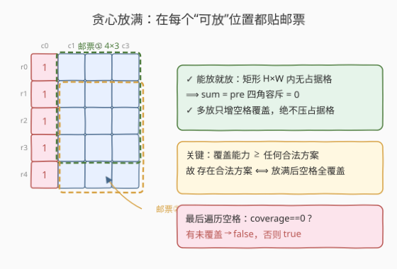
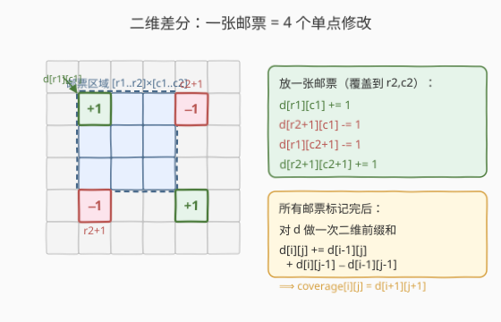
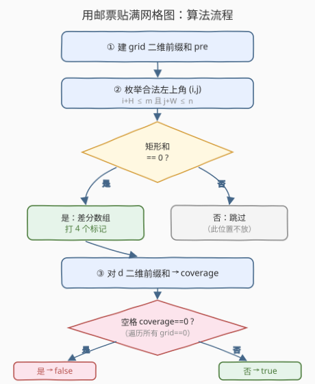
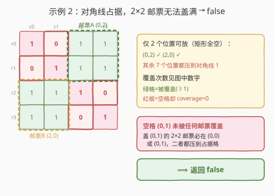

# 用邮票贴满网格图

- **题目名称**：用邮票贴满网格图
- **链接**：[2132. 用邮票贴满网格图](https://leetcode.cn/problems/stamping-the-grid/)
- **难度**：困难
- **标签**：数组、二维前缀和、二维差分、贪心

## 1. 题目概述

给定一个 $m \times n$ 的二进制矩阵 `grid`（`0` 表示空格，`1` 表示被占据）和邮票尺寸 `stampHeight × stampWidth`。要求在满足下列条件的前提下用邮票覆盖**所有空格**：

1. 覆盖所有**空**格子；
2. 不覆盖任何**被占据**的格子；
3. 邮票数目任意、可相互重叠、不可旋转、必须完全在矩阵内。

能放下则返回 `true`，否则 `false`。

**示例 1**：

```text
输入：grid = [[1,0,0,0],[1,0,0,0],[1,0,0,0],[1,0,0,0],[1,0,0,0]], stampHeight = 4, stampWidth = 3
输出：true
解释：在 (0,1) 和 (1,1) 各放一张 4×3 邮票（有重叠），覆盖第 1~3 列的所有空格。
```

**示例 2**：

```text
输入：grid = [[1,0,0,0],[0,1,0,0],[0,0,1,0],[0,0,0,1]], stampHeight = 2, stampWidth = 2
输出：false
解释：对角线上的占据格把网格切成碎片，没有任何 2×2 邮票能不压住占据格而覆盖 (0,1)。
```

**约束条件**：

- $1 \leq m, n \leq 10^5$
- $1 \leq m \cdot n \leq 2 \times 10^5$
- $\text{grid}[r][c] \in \{0, 1\}$
- $1 \leq \text{stampHeight}, \text{stampWidth} \leq 10^5$

> ⚠️ 注意 $m \cdot n \leq 2 \times 10^5$ 这一关键约束：二维数组整体规模不大，但单维可能很长（如 $1 \times 2 \times 10^5$），所以算法必须是 $O(mn)$，且要按实际尺寸分配数组。

---

## 2. 解题思路

### 2.1 暴力思路

最朴素的做法：枚举每个空格，再枚举所有可能覆盖它的邮票左上角 $(i,j)$（共 $H \cdot W$ 个），逐一检查该邮票区域内是否全为空格。单次检查 $O(HW)$，总体 $O(mn \cdot H^2 W^2)$，完全不可行。

稍微优化：对每个候选邮票位置 $(i,j)$，用 $O(HW)$ 扫描判断区域是否全空，若全空就"放一张"，最后再 $O(mn)$ 扫描判断空格是否被覆盖。这仍是 $O(mn \cdot HW)$，对于 $H, W$ 可达 $10^5$ 的数据规模依然超时。

瓶颈在于**"判断一个 $H \times W$ 矩形是否全空"**这一操作太贵——我们需要把它降到 $O(1)$。

### 2.2 核心观察：贪心放满 + 二维前缀和 + 二维差分

本题有两个关键观察：

**观察一：贪心——在每个可放位置都放邮票。**

> 一张邮票能放在 $(i,j)$ 当且仅当它完全在网格内、且覆盖的 $H \times W$ 区域内**没有占据格**。一旦某位置可放，就放——多放只会增加空格的覆盖次数，绝不会压到占据格（因为该区域本就全空）。因此**把所有可放位置都放满**，是覆盖能力最强的方案。

由交换论证：任何合法方案使用的邮票位置集合 $S$，一定是"可放位置全集" $U$ 的子集（合法方案不能在非可放位置放邮票）。贪心方案用的是 $U$，覆盖能力 $\geq$ 任何 $S$。所以：

$$\text{存在合法方案} \iff \text{贪心放满后所有空格都被覆盖}$$

这样问题从"搜索如何放"退化成"判定每个位置能不能放 + 统计覆盖次数"。



**观察二：用二维前缀和 $O(1)$ 判矩形全空，用二维差分 $O(1)$ 标记一张邮票。**

- 把 `grid` 当作"占据格计数"矩阵，建二维前缀和 `pre`。那么任意矩形 $[r_1, r_2] \times [c_1, c_2]$ 内占据格总数：

$$\text{sum} = \text{pre}[r_2{+}1][c_2{+}1] - \text{pre}[r_1][c_2{+}1] - \text{pre}[r_2{+}1][c_1] + \text{pre}[r_1][c_1]$$

  $\text{sum} = 0 \iff$ 该矩形全空 $\iff$ 邮票可放在此。每次查询 $O(1)$。

- 用**二维差分数组** `d` 标记邮票：在左上角 $(r_1, c_1)$ 放一张覆盖到 $(r_2, c_2)$ 的邮票，等价于对差分数组做 4 次单点修改：

$$d[r_1][c_1]{+}{=}1,\quad d[r_2{+}1][c_1]{-}{=}1,\quad d[r_1][c_2{+}1]{-}{=}1,\quad d[r_2{+}1][c_2{+}1]{+}{=}1$$

  所有邮票标记完后，对 `d` 做一次二维前缀和即可还原每个格子的**被覆盖次数** `coverage[i][j]`。



> 💡 **为何用差分而不是直接累加？** 邮票数可达 $O(mn)$ 张，每张覆盖 $O(HW)$ 格。直接累加是 $O(mn \cdot HW)$；差分把"区间加"压成 4 个单点修改，最后一次性前缀和还原，总成本 $O(mn)$。

### 2.3 算法流程

整体四步，全是 $O(mn)$：

1. **建前缀和**：对 `grid` 建二维前缀和 `pre`，用于 $O(1)$ 矩形求和。
2. **标记邮票**：枚举每个合法左上角 $(i,j)$（满足 $i+H \leq m$ 且 $j+W \leq n$），若对应矩形全空（`rectSum == 0`），则在差分数组 `d` 上打 4 个标记。
3. **还原覆盖**：对 `d` 做二维前缀和，得到每格覆盖次数 `coverage`。
4. **判定**：遍历所有空格（`grid[i][j] == 0`），若任一空格 `coverage == 0` 返回 `false`；否则 `true`。



### 2.4 示例演算

以**示例 2**（$4 \times 4$ 对角线占据、邮票 $2 \times 2$）演示为何返回 `false`：



| 候选左上角 $(i,j)$ | 覆盖矩形 | 占据格数 | 是否放置 |
|------------------|---------|--------|--------|
| $(0,0)$ | $[0,1]\times[0,1]$ | 2（含 $(0,0),(1,1)$） | ✗ |
| $(0,1)$ | $[0,1]\times[1,2]$ | 1（含 $(1,1)$） | ✗ |
| $(0,2)$ | $[0,1]\times[2,3]$ | 0 | ✓ 放 |
| $(1,0)$ | $[1,2]\times[0,1]$ | 1（含 $(1,1)$） | ✗ |
| $(1,1)$ | $[1,2]\times[1,2]$ | 2（含 $(1,1),(2,2)$） | ✗ |
| $(1,2)$ | $[1,2]\times[2,3]$ | 1（含 $(2,2)$） | ✗ |
| $(2,0)$ | $[2,3]\times[0,1]$ | 0 | ✓ 放 |
| $(2,1)$ | $[2,3]\times[1,2]$ | 1（含 $(2,2)$） | ✗ |
| $(2,2)$ | $[2,3]\times[2,3]$ | 2（含 $(2,2),(3,3)$） | ✗ |

最终覆盖图：

```text
占据  占据/空 覆盖  覆盖
空    占据   空    覆盖
覆盖  空     占据  空
覆盖  覆盖   空    占据
```

空格 $(0,1)$ 的覆盖次数为 $0$（没有任何合法邮票能盖到它），返回 `false`。

> 💡 **对比例 1**：例 1 中第 0 列全是占据格，但第 1~3 列全是空格，$4 \times 3$ 邮票放在 $(0,1)$ 和 $(1,1)$ 两处即可覆盖全部空格，故返回 `true`。

---

## 3. 参考代码

### C++

```cpp
class Solution {
public:
    bool possibleToStamp(vector<vector<int>>& grid, int stampHeight, int stampWidth) {
        int m = grid.size(), n = grid[0].size();
        // 1) 对 grid 建二维前缀和（1 = 占据），用于 O(1) 判矩形全空
        vector<vector<int>> pre(m + 1, vector<int>(n + 1, 0));
        for (int i = 0; i < m; i++)
            for (int j = 0; j < n; j++)
                pre[i + 1][j + 1] = grid[i][j] + pre[i][j + 1] + pre[i + 1][j] - pre[i][j];
        auto rectSum = [&](int r1, int c1, int r2, int c2) -> int {
            return pre[r2 + 1][c2 + 1] - pre[r1][c2 + 1] - pre[r2 + 1][c1] + pre[r1][c1];
        };
        // 2) 1-indexed 二维差分数组，在每个可放位置打标记
        vector<vector<int>> d(m + 2, vector<int>(n + 2, 0));
        int H = stampHeight, W = stampWidth;
        for (int i = 0; i + H - 1 < m; i++)
            for (int j = 0; j + W - 1 < n; j++)
                if (rectSum(i, j, i + H - 1, j + W - 1) == 0) {
                    int r1 = i + 1, r2 = i + H, c1 = j + 1, c2 = j + W;
                    d[r1][c1] += 1;
                    d[r2 + 1][c1] -= 1;
                    d[r1][c2 + 1] -= 1;
                    d[r2 + 1][c2 + 1] += 1;
                }
        // 3) 二维前缀和还原每格覆盖次数
        for (int i = 1; i <= m; i++)
            for (int j = 1; j <= n; j++)
                d[i][j] += d[i - 1][j] + d[i][j - 1] - d[i - 1][j - 1];
        // 4) 所有空格必须被覆盖
        for (int i = 0; i < m; i++)
            for (int j = 0; j < n; j++)
                if (grid[i][j] == 0 && d[i + 1][j + 1] == 0)
                    return false;
        return true;
    }
};
```

### Python

```python
class Solution:
    def possibleToStamp(self, grid: List[List[int]], stampHeight: int, stampWidth: int) -> bool:
        m, n = len(grid), len(grid[0])
        # 1) 对 grid 建二维前缀和（1 = 占据），用于 O(1) 判矩形全空
        pre = [[0] * (n + 1) for _ in range(m + 1)]
        for i in range(m):
            for j in range(n):
                pre[i + 1][j + 1] = grid[i][j] + pre[i][j + 1] + pre[i + 1][j] - pre[i][j]

        def rectSum(r1: int, c1: int, r2: int, c2: int) -> int:
            return pre[r2 + 1][c2 + 1] - pre[r1][c2 + 1] - pre[r2 + 1][c1] + pre[r1][c1]

        # 2) 1-indexed 二维差分数组，在每个可放位置打标记
        d = [[0] * (n + 2) for _ in range(m + 2)]
        H, W = stampHeight, stampWidth
        for i in range(m - H + 1):
            for j in range(n - W + 1):
                if rectSum(i, j, i + H - 1, j + W - 1) == 0:
                    r1, r2, c1, c2 = i + 1, i + H, j + 1, j + W
                    d[r1][c1] += 1
                    d[r2 + 1][c1] -= 1
                    d[r1][c2 + 1] -= 1
                    d[r2 + 1][c2 + 1] += 1

        # 3) 二维前缀和还原每格覆盖次数
        for i in range(1, m + 1):
            for j in range(1, n + 1):
                d[i][j] += d[i - 1][j] + d[i][j - 1] - d[i - 1][j - 1]

        # 4) 所有空格必须被覆盖
        for i in range(m):
            for j in range(n):
                if grid[i][j] == 0 and d[i + 1][j + 1] == 0:
                    return False
        return True
```

> ⚠️ **差分数组用 1-indexed**：把格子 $(i,j)$ 映射到差分数组位置 $(i+1, j+1)$，邮票覆盖 $[i, i{+}H{-}1] \times [j, j{+}W{-}1]$ 对应 1-indexed 的 $[r_1, r_2] \times [c_1, c_2]$（$r_1=i{+}1, r_2=i{+}H, c_1=j{+}1, c_2=j{+}W$），打标记在 $d[r_1][c_1], d[r_2{+}1][c_1], d[r_1][c_2{+}1], d[r_2{+}1][c_2{+}1]$。数组开 $(m{+}2) \times (n{+}2)$ 才能容纳 $r_2{+}1 = i{+}H{+}1 \leq m{+}1$ 和 $c_2{+}1 \leq n{+}1$ 的边界标记，避免越界。还原后 `coverage[i][j] = d[i+1][j+1]`。

---

## 4. 复杂度分析

| 维度 | 复杂度 | 说明 |
|------|--------|------|
| 时间复杂度 | $O(mn)$ | 建前缀和 $O(mn)$；枚举每个左上角 $O(mn)$，每次 $O(1)$ 查询；差分还原 $O(mn)$；最终判定 $O(mn)$ |
| 空间复杂度 | $O(mn)$ | 前缀和数组 `pre` 与差分数组 `d`，均为 $O(mn)$ |

> 💡 关键约束 $m \cdot n \leq 2 \times 10^5$ 保证 $O(mn)$ 在毫秒级完成。注意 $m, n$ 各自可达 $10^5$，故数组必须按实际 $m, n$ 分配，不能用固定大小。

---

## 5. 扩展：不用差分的写法与变体

**变体一：直接累加覆盖。** 如果把"标记邮票"改成对覆盖区域每个格子 `+1`，复杂度退化为 $O(mn \cdot HW)$，仅在 $H, W$ 很小时可行。差分数组正是为此优化而生。

**变体二：求最少邮票数。** 若题目改为"最少用多少张邮票覆盖所有空格"，贪心放满不再最优（重叠浪费），需转化为集合覆盖 / DP，是 NP-hard 的二维变体，远超本题难度。本题之所以能贪心，正是因为只问"是否可行"而非"最优"。

**变体三：邮票不可重叠。** 若禁止重叠，贪心放满失效，需要更复杂的区间/矩形打包，通常用扫描线 + 贪心，难度显著上升。

---

## 6. 面试要点

1. **为什么贪心放满是正确的？**
   - 可放位置全集 $U$ 是任何合法方案邮票位置集合 $S$ 的超集（合法方案只能在可放位置放）。多放只增加空格覆盖、不压占据格，故 $U$ 的覆盖能力 $\geq$ 任何 $S$。"存在合法方案"等价于"贪心放满后空格全覆盖"。

2. **如何 $O(1)$ 判断一个 $H \times W$ 矩形全空？**
   - 对 `grid` 建二维前缀和 `pre`，矩形占据格数 = 四角容斥 $O(1)$ 查询，等于 0 即全空。

3. **为什么用二维差分而不是直接累加覆盖？**
   - 邮票数 $O(mn)$、每张覆盖 $O(HW)$，直接累加 $O(mn \cdot HW)$ 超时。差分把每张邮票压成 4 个单点修改，最后一次性二维前缀和还原，总 $O(mn)$。

4. **差分数组为什么开 $(m+2) \times (n+2)$？**
   - 邮票覆盖到网格边界时，取消标记落在 $r_2{+}1 = m{+}1$、$c_2{+}1 = n{+}1$ 处，需多留一行一列存放边界标记，否则越界或被错误覆盖。

5. **$m \cdot n \leq 2 \times 10^5$ 这个约束意味着什么？**
   - 二维总规模有界，$O(mn)$ 可行；但单维可达 $10^5$（如 $1 \times 2 \times 10^5$ 的单行网格），数组须按实际尺寸分配，不能用固定 $N \times N$。

---

## 7. 同类练习题

- [304. 二维区域和检索 - 数组不可变](https://leetcode.cn/problems/range-sum-query-2d-immutable/)（[题解](../0301-0400/304_二维区域和检索 - 数组不可变.md)）：二维前缀和模板题，本题判矩形全空直接复用其四角容斥
- [1314. 矩阵区域和](https://leetcode.cn/problems/matrix-block-sum/)：二维前缀和的对称应用（由和求区域），与本题"由区域查和"互为镜像
- [1109. 航班预订统计](https://leetcode.cn/problems/corporate-flight-bookings/)：一维差分模板，本题二维差分的降维前身，理解一维差分是基础
- [2536. 子矩阵元素加 1](https://leetcode.cn/problems/increment-submatrices-by-one/)：二维差分模板题，本题"标记邮票"环节的直接训练
- [1292. 元素和小于等于阈值的正方形的最大边长](https://leetcode.cn/problems/maximum-side-length-of-a-square-with-sum-less-than-or-equal-to-threshold/)（[题解](../1201-1300/1292_元素和小于等于阈值的正方形的最大边长.md)）：二维前缀和 + 二分判矩形，同为"前缀和查矩形"套路
