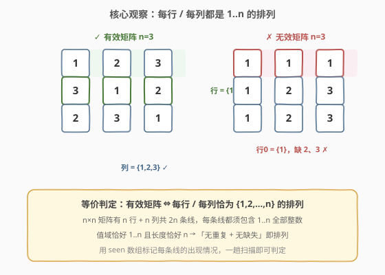
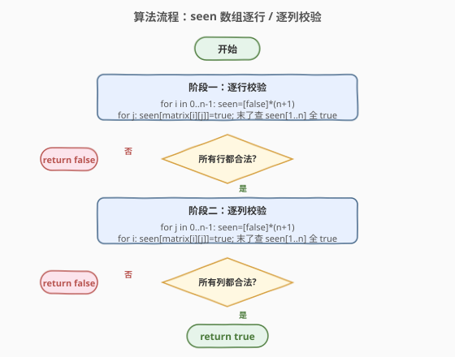
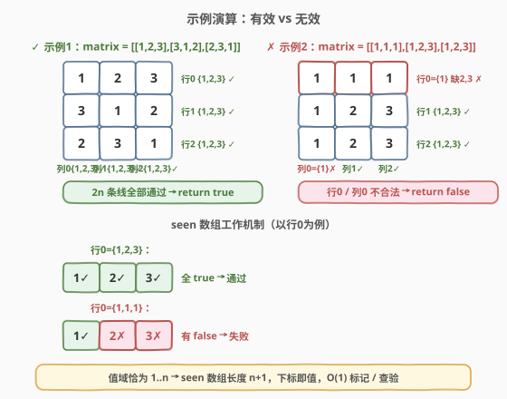

# LeetCode 检查是否每一行每一列都包含全部整数 题解

## 1. 题目概述

- **标题 / 题号**：检查是否每一行每一列都包含全部整数（#2133，easy）
- **链接**：https://leetcode.cn/problems/check-if-every-row-and-column-contains-all-numbers/
- **难度**：简单
- **标签**：数组、哈希表、矩阵

**题意**：对一个大小为 $n \times n$ 的矩阵而言，如果其**每一行**和**每一列**都包含从 $1$ 到 $n$ 的**全部**整数（含 $1$ 和 $n$），则认为该矩阵是一个**有效**矩阵。

给你一个大小为 $n \times n$ 的整数矩阵 `matrix`，请你判断矩阵是否为一个有效矩阵：如果是，返回 `true`；否则返回 `false`。

**示例 1**：

```text
输入：matrix = [[1,2,3],[3,1,2],[2,3,1]]
输出：true
解释：n = 3，每一行和每一列都包含数字 1、2、3，因此返回 true。
```

**示例 2**：

```text
输入：matrix = [[1,1,1],[1,2,3],[1,2,3]]
输出：false
解释：n = 3，但第一行和第一列不包含数字 2 和 3，因此返回 false。
```

**约束**：

- $n == \text{matrix.length} == \text{matrix}[i].\text{length}$
- $1 \le n \le 100$
- $1 \le \text{matrix}[i][j] \le n$

> 💡 注意三个约束的「巧合」：矩阵是 $n \times n$ 方阵、每条线（行或列）长度恰为 $n$、元素取值恰在 $[1, n]$。三者叠加意味着：**一条线合法 ⇔ 它是 $\{1,2,\dots,n\}$ 的一个排列**——既无重复也无缺失。这是本题一切简化的源头。

## 2. 解题思路

### 2.1 暴力思路：每条线排序后比对

对每一条行和每一条列：

- 取出该行的 $n$ 个元素，**排序**后与 $[1, 2, \dots, n]$ 逐位比较；
- 列同理（需按列收集元素）。

共 $2n$ 条线，每条排序 $O(n \log n)$，总时间 $O(n^2 \log n)$，空间 $O(n)$（存放取出的元素）。

> ⚠️ 暴力法能出结果，但**没有利用值域的特殊结构**：元素取值恰为 $1..n$，意味着我们可以用「**值即下标**」的方式 $O(1)$ 判定存在性，无需排序。排序是把通用问题（任意值域判重）的武器，而本题值域与长度相等，存在更直接的判定。

### 2.2 核心观察：每条线是 1..n 的排列



**关键转化**：「每行每列都包含 $1$ 到 $n$ 的全部整数」等价于「每行每列都是 $\{1, 2, \dots, n\}$ 的排列」。

> 一条长度为 $n$ 的线，要包含 $n$ 个不同的值（$1$ 到 $n$），那么每个值**恰好出现一次**——既不能重复（重复就必有缺失），也不能缺失。所以「包含全部」=「无重复」=「无缺失」=「排列」，这四者在「长度 $n$ + 值域 $n$」的条件下完全等价。

判定一条线是否为 $\{1..n\}$ 的排列，用 **`seen` 布尔数组**最直接：

- 数组长度 $n + 1$，下标 $1..n$ 对应取值；
- 遍历该线的每个元素 $v$，置 `seen[v] = true`；
- 末了检查 `seen[1..n]` 是否全为 `true`。

> 💡 由于值域恰为 $1..n$，无需处理越界或非法值，`seen[v]` 直接合法。若值域更宽（如 $1..n^2$），则需先判 $v \in [1,n]$ 再标记，本题无此负担。

### 2.3 算法流程图



分两个阶段，各扫一遍矩阵：

```text
checkValid(matrix):
  n = len(matrix)
  # 阶段一：逐行校验
  for i in 0..n-1:
      seen = [false] * (n + 1)
      for j in 0..n-1:
          seen[matrix[i][j]] = true
      for v in 1..n:
          if not seen[v]: return false
  # 阶段二：逐列校验
  for j in 0..n-1:
      seen = [false] * (n + 1)
      for i in 0..n-1:
          seen[matrix[i][j]] = true
      for v in 1..n:
          if not seen[v]: return false
  return true
```

> 💡 **提前返回**：任一条线不合法立即 `return false`，无需扫完所有线。最坏情况（合法矩阵）才需完整扫 $2n$ 条线。

### 2.4 示例演算



以**示例 1** `matrix = [[1,2,3],[3,1,2],[2,3,1]]`，$n = 3$：

| 线 | 元素 | seen[1..3] | 结果 |
|----|------|------------|------|
| 行0 | 1,2,3 | T,T,T | ✓ |
| 行1 | 3,1,2 | T,T,T | ✓ |
| 行2 | 2,3,1 | T,T,T | ✓ |
| 列0 | 1,3,2 | T,T,T | ✓ |
| 列1 | 2,1,3 | T,T,T | ✓ |
| 列2 | 3,2,1 | T,T,T | ✓ |

$2n = 6$ 条线全部通过 → 返回 `true`。

再以**示例 2** `matrix = [[1,1,1],[1,2,3],[1,2,3]]`，$n = 3$：

| 线 | 元素 | seen[1..3] | 结果 |
|----|------|------------|------|
| 行0 | 1,1,1 | T,**F**,**F** | ✗ 缺 2、3 |

行0 即失败，立即返回 `false`（无需继续检查列）。

> ⚠️ 示例 2 中行0 全是 `1`，`seen[1]` 被重复置 `true` 但 `seen[2]`、`seen[3]` 始终为 `false`——**重复不会让缺失消失**，这正是「排列」判定的核心：每个值都要出现，且只需出现一次。

## 3. 参考代码

### C++（seen 布尔数组）

```cpp
class Solution {
public:
    bool checkValid(vector<vector<int>>& matrix) {
        int n = matrix.size();
        // 阶段一：逐行
        for (int i = 0; i < n; ++i) {
            vector<char> seen(n + 1, 0);
            for (int j = 0; j < n; ++j) seen[matrix[i][j]] = 1;
            for (int v = 1; v <= n; ++v) if (!seen[v]) return false;
        }
        // 阶段二：逐列
        for (int j = 0; j < n; ++j) {
            vector<char> seen(n + 1, 0);
            for (int i = 0; i < n; ++i) seen[matrix[i][j]] = 1;
            for (int v = 1; v <= n; ++v) if (!seen[v]) return false;
        }
        return true;
    }
};
```

### Python（seen 布尔数组）

```python
class Solution:
    def checkValid(self, matrix: List[List[int]]) -> bool:
        n = len(matrix)
        # 阶段一：逐行
        for row in matrix:
            seen = [False] * (n + 1)
            for v in row:
                seen[v] = True
            for v in range(1, n + 1):
                if not seen[v]:
                    return False
        # 阶段二：逐列
        for j in range(n):
            seen = [False] * (n + 1)
            for i in range(n):
                seen[matrix[i][j]] = True
            for v in range(1, n + 1):
                if not seen[v]:
                    return False
        return True
```

### Python（一行流：集合比对）

```python
class Solution:
    def checkValid(self, matrix: List[List[int]]) -> bool:
        n = len(matrix)
        target = set(range(1, n + 1))
        return all(set(row) == target for row in matrix) and \
               all(set(matrix[i][j] for i in range(n)) == target for j in range(n))
```

> ⚠️ **多种写法对比**：`seen` 数组写法把「值即下标」的优势发挥到极致——标记和查验都是 $O(1)$ 数组访问，无哈希开销，常数最小。集合写法（`set(row) == target`）语义最清晰，直接表达了「该行是 $\{1..n\}$ 的排列」，但构建集合有哈希开销、且 `set` 比较内部仍需遍历。面试中建议先讲清「排列」等价转化，再写 `seen` 数组版本展示对值域的利用，集合版作为简洁备选。

## 4. 复杂度分析

| 维度 | 复杂度 | 说明 |
|------|--------|------|
| **时间复杂度** | $O(n^2)$ | 行扫描 $n \times n$ + 列扫描 $n \times n$，每个元素访问两次；每条线末尾查验 $O(n)$，共 $2n$ 条线合计 $O(n^2)$ |
| **空间复杂度** | $O(n)$ | 单条线的 `seen` 数组长度 $n+1$，可复用，无需为所有线同时开辟 |

> 与暴力排序 $O(n^2 \log n)$ 的对比：差距在于每条线的判定从「排序 $O(n \log n)$」降到「标记 + 查验 $O(n)$」。根源是利用了**值域与长度相等**这一结构——值即下标，无需排序即可 $O(1)$ 判存在性。

## 5. 扩展：位运算压缩 seen 数组

当 $n$ 较小（本题 $n \le 100$，可用一个或两个 64 位整数；若 $n \le 64$ 则单个 `long long` 即可）时，可用**位图**替代布尔数组：第 $v$ 位表示值 $v$ 是否出现。

```cpp
class Solution {
public:
    bool checkValid(vector<vector<int>>& matrix) {
        int n = matrix.size();
        unsigned long long full = (n >= 64 ? ~0ULL : ((1ULL << n) - 1)); // 低 n 位全 1
        // 行
        for (int i = 0; i < n; ++i) {
            unsigned long long mask = 0;
            for (int j = 0; j < n; ++j) mask |= (1ULL << (matrix[i][j] - 1));
            if (mask != full) return false;
        }
        // 列
        for (int j = 0; j < n; ++j) {
            unsigned long long mask = 0;
            for (int i = 0; i < n; ++i) mask |= (1ULL << (matrix[i][j] - 1));
            if (mask != full) return false;
        }
        return true;
    }
};
```

> 💡 位图写法把「标记」和「查验」合并：标记是 `mask |= (1ULL << (v-1))`，查验是 `mask == full`（低 $n$ 位全 1）。不仅空间压缩到 $O(1)$（一个寄存器），查验也从「循环 $n$ 次」变成「一次比较」。但 $n > 64$ 时需多个整数拼接，本题 $n \le 100$ 需两个 `unsigned long long`，略增复杂度。在 $n \le 64$ 的变体中此写法最优。

> ⚠️ 位图判定合法的条件是 `mask` 的低 $n$ 位全为 1——这同时保证了「无缺失」（每位都被置位）和「无重复」（重复置位不影响结果，但若值域外元素出现会被额外位置位，需配合值域约束）。本题值域恰为 $1..n$，故 `mask == full` 等价于排列判定。

## 6. 面试要点

1. **为什么「包含全部」等价于「是排列」？**

   - 因为线长度 $= n$、值域大小 $= n$。要在长度 $n$ 的序列里装下 $n$ 个不同的值（$1$ 到 $n$），每个值**恰好出现一次**。「包含全部」⇒ 无缺失 ⇒ $n$ 个位置被 $n$ 个不同值占满 ⇒ 无重复 ⇒ 排列。四者等价。

2. **`seen` 数组为什么长度是 $n+1$ 而不是 $n$？**

   - 因为值域是 $1..n$（1-indexed），下标 $0$ 不用，下标 $1..n$ 对应取值。若值域是 $0..n-1$ 则长度 $n$ 即可。这是「值即下标」设计的细节，避免做 `v-1` 的偏移（虽然位图写法仍需 `-1` 因为位从 0 开始）。

3. **能否只检查行不检查列（或反之）？**

   - 不能。行合法不蕴含列合法。反例：`[[1,2,3],[1,2,3],[1,2,3]]` 每行都是 $\{1,2,3\}$ 合法，但每列都是 $\{1\}$、$\{2\}$、$\{3\}$ 全部非法。行列必须各扫一遍，共 $2n$ 条线相互独立。

4. **集合写法 `set(row) == target` 和 `seen` 数组有什么实质区别？**

   - 功能等价，常数不同。`seen` 数组是连续内存的 $O(1)$ 下标访问，缓存友好；`set` 是哈希表，构建有哈希计算 + 可能的哈希冲突开销。$n \le 100$ 时差异不大，但 $n$ 更大时 `seen` 数组明显更优。此外 `seen` 数组能提前发现重复（若需区分「重复」与「缺失」），而集合比较只能给出最终是否相等。

5. **如果值域放宽到 $1..n^2$（线长仍为 $n$）会怎样？**

   - 此时「包含全部 $1..n^2$」不可能成立（$n$ 个位置装不下 $n^2$ 个值），题目语义会改变。更合理的变体是「每条线无重复」——此时 `seen` 数组需扩大到 $n^2+1$，且标记时若发现 `seen[v]` 已为 `true` 即可提前 `return false`（检测重复而非检测缺失）。判定逻辑从「末了查验全 true」变为「标记时遇冲突即失败」。

> 💡 **一句话总结**：2133 是「**值域即下标**」的招牌题——利用线长 $n$ 与值域 $n$ 相等的结构，把排列判定降到 $O(n)$ 标记 + 查验，$O(n^2)$ 时间 $O(n)$ 空间扫一遍行列即得。

## 同类练习题

| # | 题目 | 与本题的关联 |
|---|------|-------------|
| 36 | [有效的数独](https://leetcode.cn/problems/valid-sudoku/)（[站内题解](../0001-0100/36_有效的数独.md)） | 用 `seen` 数组校验每行/每列/每个 3×3 宫无重复，同为「值即下标 + 标记查验」范式，是本题的多区块推广 |
| 73 | [矩阵置零](https://leetcode.cn/problems/set-matrix-zeroes/)（[站内题解](../0001-0100/73_矩阵置零.md)） | 矩阵逐行逐列扫描的另一种应用，练习矩阵的行列遍历结构 |
| 289 | [生命游戏](https://leetcode.cn/problems/game-of-life/)（[站内题解](../0201-0300/289_生命游戏.md)） | 矩阵原地状态标记，与本题「用辅助数组记录状态」思路相通 |
| 1886 | [判断矩阵经轮转后是否一致](https://leetcode.cn/problems/determine-whether-matrix-can-be-obtained-by-rotation/) | 矩阵逐元素比对判定，同属矩阵基础扫描题家族 |
