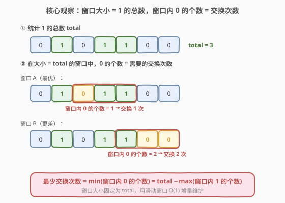
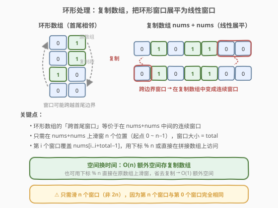

# 最少交换次数来组合所有的 1 II

- **题目名称**：最少交换次数来组合所有的 1 II
- **链接**：[2134. 最少交换次数来组合所有的 1 II](https://leetcode.cn/problems/minimum-swaps-to-group-all-1s-together-ii/)
- **难度**：中等
- **标签**：数组、滑动窗口、环形数组

## 1. 题目概述

**交换**定义为选中一个数组中两个**互不相同**的位置并交换二者的值。**环形**数组可以认为第一个元素和最后一个元素相邻。

给你一个**二进制环形**数组 `nums`，返回在**任意位置**将数组中的所有 `1` 聚集在一起需要的最少交换次数。

**示例 1**：

```text
输入：nums = [0,1,0,1,1,0,0]
输出：1
解释：[0,0,1,1,1,0,0] 交换 1 次即可将所有 1 聚集在一起。
```

**示例 2**：

```text
输入：nums = [0,1,1,1,0,0,1,1,0]
输出：2
```

**示例 3**：

```text
输入：nums = [1,1,0,0,1]
输出：0
解释：得益于环形特性，所有的 1 已经聚集在一起。
```

**约束条件**：

- $1 \le \text{nums.length} \le 10^5$
- $\text{nums}[i]$ 为 $0$ 或者 $1$

> 💡 本题是 [1151. 最少交换次数来组合所有的 1](https://leetcode.cn/problems/minimum-swaps-to-group-all-1s-together/) 的**环形版**——数组从线性变为环形，窗口可以跨越首尾边界。核心套路完全一致（定长滑动窗口），只是需要处理环形展开。

---

## 2. 解题思路

### 2.1 暴力思路

枚举所有可能的聚集起点（环形数组有 $n$ 个位置），对每个起点检查长度为 `total`（1 的总数）的窗口中有多少个 0，取最小值。每个窗口独立统计，时间复杂度 $O(n \times \text{total}) = O(n^2)$，会超时。

### 2.2 核心观察：定长滑动窗口



**关键转化**：将所有 1 聚集在一起，等价于找到一个长度为 `total`（1 的总数）的窗口，使窗口内的 1 尽可能多。

> 💡 **为什么窗口大小 = total？** 聚集后的 1 连成一段，长度恰好等于 1 的总数 `total`。所以最优聚集位置对应一个大小为 `total` 的窗口。窗口内每个 0 都需要一次交换（把外面的 1 换进来），因此：
>
> $$\text{交换次数} = \text{窗口内 0 的个数} = \text{total} - \text{窗口内 1 的个数}$$
>
> 最小化交换次数 $\Leftrightarrow$ 最大化窗口内 1 的个数 $\Leftrightarrow$ 最小化窗口内 0 的个数。

用**定长滑动窗口**在数组上扫描，窗口大小固定为 `total`。窗口每次右移一格，左边出一个元素、右边进一个元素，用 $O(1)$ 增量更新窗口内 0 的计数。$n$ 个窗口位置取最小值即为答案。

### 2.3 环形处理：复制数组



本题的关键在于数组是**环形**的——窗口可能跨越首尾边界。处理方式有两种：

1. **复制数组**（空间 $O(n)$）：将 `nums` 拼接自身得到 `nums + nums`，在其上滑窗 $n$ 个位置（起点 $0 \sim n-1$），窗口大小 `total`。第 $i$ 个窗口覆盖 `nums[i..i+\text{total}-1]`，自然包含了跨边界的情况。

2. **取模下标**（空间 $O(1)$）：不复制数组，访问时用 `index % n` 映射回原数组。窗口从 $i$ 到 $i + \text{total} - 1$，每个位置取 `(i + k) % n`。

> ⚠️ 只需滑 **$n$ 个窗口**（非 $2n$），因为第 $n$ 个窗口与第 $0$ 个窗口完全相同——复制数组只是为了让跨边界窗口变为连续访问，并不增加新的窗口位置。

### 2.4 示例演算

![示例演算：nums = [0,1,0,1,1,0,0]，total = 3](../images/2134_example_walkthrough.svg)

以**示例 1** `nums = [0,1,0,1,1,0,0]` 为例，`total = 3`，窗口大小 = 3：

| 起点位置 | 窗口内容（环形） | 0 的个数 | 交换次数 |
|----------|------------------|----------|----------|
| 0 | [0, 1, 0] | 2 | 2 |
| 1 | [1, 0, 1] | 1 | **1** ✓ |
| 2 | [0, 1, 1] | 1 | **1** ✓ |
| 3 | [1, 1, 0] | 1 | **1** ✓ |
| 4 | [1, 0, 0] | 2 | 2 |
| 5 | [0, 0, 0] | 3 | 3 |
| 6 | [0, 0, 1]（跨边界） | 2 | 2 |

最少交换次数 $= \min(2, 1, 1, 1, 2, 3, 2) = 1$。

> 💡 起点 6 的窗口 $[0, 0, 1]$ 跨越了首尾边界（取 `nums[6], nums[0], nums[1]`），这正是环形数组需要特殊处理的原因。复制数组后，这个窗口对应 `nums+nums` 中的连续区间 $[6, 8]$，无需特殊判断。

---

## 3. 参考代码

### C++（复制数组）

```cpp
class Solution {
public:
    int minSwaps(vector<int>& nums) {
        int n = nums.size();
        int total = 0;
        for (int x : nums) total += x;

        if (total <= 1 || total == n) return 0;

        vector<int> doubled(nums.begin(), nums.end());
        doubled.insert(doubled.end(), nums.begin(), nums.end());

        int zeros = 0;
        for (int i = 0; i < total; i++) {
            if (doubled[i] == 0) zeros++;
        }
        int ans = zeros;

        for (int i = 1; i < n; i++) {
            if (doubled[i - 1] == 0) zeros--;
            if (doubled[i + total - 1] == 0) zeros++;
            ans = min(ans, zeros);
        }

        return ans;
    }
};
```

### Python（取模下标，O(1) 额外空间）

```python
class Solution:
    def minSwaps(self, nums: List[int]) -> int:
        n = len(nums)
        total = sum(nums)

        if total <= 1 or total == n:
            return 0

        zeros = 0
        for i in range(total):
            if nums[i] == 0:
                zeros += 1
        ans = zeros

        for i in range(1, n):
            if nums[(i - 1) % n] == 0:
                zeros -= 1
            if nums[(i + total - 1) % n] == 0:
                zeros += 1
            ans = min(ans, zeros)

        return ans
```

> 💡 **两种写法对比**：复制数组版代码更直观（线性访问，无需取模），但多用 $O(n)$ 空间；取模版省空间但每次访问多一次取模运算。面试中两种均可，取模版更能体现对环形结构的理解。注意取模版中 `i - 1` 在 $i = 0$ 时为 $-1$，但循环从 $i = 1$ 开始，故 `(i - 1) % n` 始终非负。

---

## 4. 复杂度分析

| 维度 | 复杂度 | 说明 |
|------|--------|------|
| **时间复杂度** | $O(n)$ | 统计 1 的总数 $O(n)$ + 初始化窗口 $O(\text{total})$ + 滑动 $n$ 个位置每次 $O(1)$，总计 $O(n)$ |
| **空间复杂度** | $O(n)$ / $O(1)$ | 复制数组版 $O(n)$（拼接数组长度 $2n$）；取模版 $O(1)$（仅常数变量） |

> 与暴力 $O(n^2)$ 的对比：差距在于相邻窗口的 0 计数从「重新统计 $O(\text{total})$」降到「增量更新 $O(1)$」——左边出一个、右边进一个，只看这两个元素是否为 0 即可。这正是滑动窗口的核心优势。

---

## 5. 扩展：与线性版 1151 的对比

[1151. 最少交换次数来组合所有的 1](https://leetcode.cn/problems/minimum-swaps-to-group-all-1s-together/) 是本题的线性版（数组非环形），套路完全一致：

- 同样统计 `total`，用大小为 `total` 的滑动窗口最小化 0 的个数
- 区别：线性版只需滑 $n - \text{total} + 1$ 个窗口（窗口不超出数组边界），无需处理跨边界

本题（环形版）需要滑 $n$ 个窗口，因为窗口可以跨越首尾。两种解法的关系：

| 维度 | 1151（线性） | 2134（环形） |
|------|-------------|-------------|
| 窗口数量 | $n - \text{total} + 1$ | $n$ |
| 跨边界 | 不需要 | 需要（复制数组或取模） |
| 时间复杂度 | $O(n)$ | $O(n)$ |
| 空间复杂度 | $O(1)$ | $O(1)$（取模）/ $O(n)$（复制） |

> 💡 环形数组的通用技巧：**复制数组**或**取模下标**。这不仅适用于滑动窗口，也适用于环形子数组和（如 [918. 环形子数组的最大和](../0901-1000/918_环形子数组的最大和.md)）、环形 DP（如 [213. 打家劫舍 II](../0201-0300/213_打家劫舍II.md)）等场景。

---

## 6. 面试要点

1. **为什么窗口大小等于 1 的总数？**

   - 聚集后所有 1 连成一段，长度恰好是 1 的总数 `total`。所以最优聚集位置一定对应一个大小为 `total` 的窗口。窗口内的 0 需要被交换出去，1 需要从外面换进来，交换次数 = 窗口内 0 的个数。

2. **环形数组如何处理跨边界的窗口？**

   - 两种方法：① 复制数组 `nums + nums`，在其上线性滑窗，跨边界窗口自动变为连续区间；② 用 `(i + k) % n` 取模下标直接在原数组上访问。两者等价，取模版省空间。

3. **为什么只需滑 $n$ 个窗口而非 $2n$？**

   - 复制数组长度为 $2n$，但第 $i$ 个窗口和第 $i + n$ 个窗口覆盖的元素完全相同（因为 `nums[j] == nums[j + n]`），所以只需滑 $n$ 个窗口（起点 $0 \sim n-1$）。

4. **边界情况有哪些？**

   - `total == 0`：数组全 0，无需交换，返回 0。`total == 1`：只有一个 1，天然「聚集」，返回 0。`total == n`：数组全 1，无需交换，返回 0。这三种情况需要在滑动前提前返回，否则可能越界或逻辑错误。

5. **滑动窗口如何 $O(1)$ 更新 0 的计数？**

   - 窗口从起点 $i$ 移到 $i+1$ 时，左边出 `nums[i]`、右边进 `nums[i + total]`。只需检查这两个元素：出的是 0 则 `zeros--`，进的是 0 则 `zeros++`。无需重新遍历整个窗口。

> 💡 **一句话总结**：2134 是「**定长滑动窗口 + 环形展开**」的招牌题——窗口大小锁定为 1 的总数，最小化窗口内 0 的个数即为答案；环形通过复制数组或取模下标展平为线性。

---

## 7. 同类练习题

- [1151. 最少交换次数来组合所有的 1](https://leetcode.cn/problems/minimum-swaps-to-group-all-1s-together/)：本题的线性版，套路完全一致，无需处理环形边界，适合先做这题再升级到环形
- [918. 环形子数组的最大和](https://leetcode.cn/problems/maximum-sum-circular-subarray/)（[站内题解](../0901-1000/918_环形子数组的最大和.md)）：环形数组的滑动窗口 / Kadane 变体，同样用复制数组或取模处理环形
- [213. 打家劫舍 II](https://leetcode.cn/problems/house-robber-ii/)（[站内题解](../0201-0300/213_打家劫舍II.md)）：环形 DP，拆环为线的经典思路，与本题「环形展平」思想相通
- [209. 长度最小的子数组](https://leetcode.cn/problems/minimum-size-subarray-sum/)（[站内题解](../0201-0300/209_长度最小的子数组.md)）：定长 / 变长滑动窗口基础模板，练习窗口的增量维护
