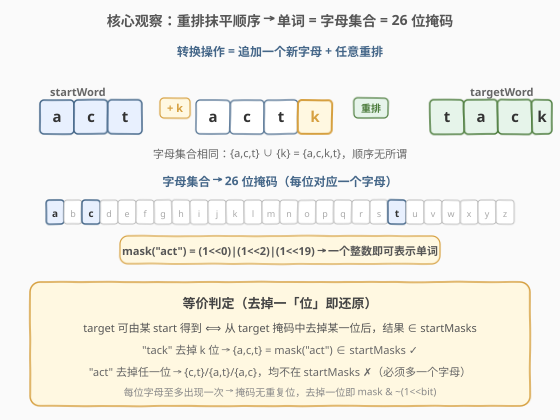
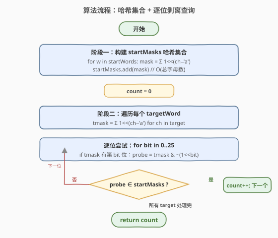

# 统计追加字母可以获得的单词数

- **题目名称**：统计追加字母可以获得的单词数
- **链接**：[2135. 统计追加字母可以获得的单词数](https://leetcode.cn/problems/count-words-obtained-after-adding-a-letter/)
- **难度**：中等
- **标签**：位运算、哈希表、字符串、数组

## 1. 题目概述

给你两个下标从 $0$ 开始的字符串数组 `startWords` 和 `targetWords`，每个字符串**仅由小写英文字母**组成，且**每个字母在单个字符串中至多出现一次**。

对于 `targetWords` 中的每个字符串，检查是否能够从 `startWords` 中选出某个字符串，执行**一次转换操作**得到它与当前 `targetWords` 字符串相等：

1. **追加**一个**不存在于**当前字符串的小写字母到末尾；
2. **重排**新字符串中的字母（任意顺序，包括保持原序）。

返回 `targetWords` 中能够由 `startWords` 中**任一**字符串经一次操作获得的字符串**数目**。

> ⚠️ 注意「必须追加一个字母」：即便 `targetWords` 里某字符串本身就在 `startWords` 中出现，也**不能**算作可获得——必须经过「加一个字母再重排」才算。示例 1 的 `"act"` 就是这个反例。

**示例 1**：

```text
输入：startWords = ["ant","act","tack"], targetWords = ["tack","act","acti"]
输出：2
解释：
- target[0]="tack"：选 start[1]="act"，追加 'k'，重排 "actk"→"tack"。✓
- target[1]="act" ：start 中无可用于获得 "act" 的字符串（"act" 虽在 start 中，但必须先追加一个字母）。✗
- target[2]="acti"：选 start[1]="act"，追加 'i'，重排 "acti"→"acti"。✓
```

**示例 2**：

```text
输入：startWords = ["ab","a"], targetWords = ["abc","abcd"]
输出：1
解释：
- target[0]="abc" ：选 start[0]="ab"，追加 'c'，重排→"abc"。✓
- target[1]="abcd"：无可匹配的 start（长度差必须恰为 1）。✗
```

**约束条件**：

- $1 \le \text{startWords.length},\ \text{targetWords.length} \le 5 \times 10^4$
- $1 \le \text{startWords}[i].\text{length},\ \text{targetWords}[j].\text{length} \le 26$
- `startWords` 和 `targetWords` 中的每个字符串都仅由小写英文字母组成
- 在任一字符串中，每个字母**至多出现一次**

> 💡 三个约束的合力是本题的最优解钥匙：**全小写**（字母表只有 26 个）+ **每字母至多一次**（一个字符串就是一个**字母集合**，无重复位）+ **允许重排**（顺序无关）。三者叠加意味着每个单词可用一个 **26 位整数掩码**唯一表示，比较与变换都退化为位运算。

---

## 2. 解题思路

### 2.1 暴力思路：逐对枚举 + 集合比较

对每个 `target`，遍历 `startWords` 中每个 `start`：

- 若 $|\text{target}| = |\text{start}| + 1$ 且 `start` 的字母集合是 `target` 字母集合的**子集**，则该 `target` 可获得。

用集合做子集判定最直观：`set(start) <= set(target)` 且 `len(target) == len(start) + 1`。

共 $|S| \times |T|$ 对，每对集合构建 $O(L)$，总时间 $O(|S| \cdot |T| \cdot L)$，约 $5\times10^4 \times 5\times10^4 \times 26 \approx 6.5\times10^{10}$，**严重超时**。

> ⚠️ 暴力法的浪费在于「对每个 target 都重新扫描全部 start」。如果先把 start 全部编码成一个可 $O(1)$ 查询的结构，就能把「找匹配」从 $O(|S|)$ 降到 $O(26)$。

### 2.2 核心观察：单词 = 字母集合 = 26 位掩码



**关键转化**分两步：

1. **重排使顺序失效**：转换操作允许任意重排，所以「`start` 能否变成 `target`」只取决于两者的**字母多重集合**。又因每字母至多出现一次，多重集合退化为**集合**——一个单词的「身份」就是它含哪些字母，与排列无关。

2. **字母集合 → 整数掩码**：26 个小写字母恰好对应一个 26 位整数的 26 个位。字母 $c$ 在单词中出现 ⇔ 掩码第 $c - \text{'a'}$ 位为 1。于是：

$$
\text{mask}(w) = \sum_{c \in w} 1 \ll (c - \text{'a'})
$$

   一个 `int` 即可装下整个单词，集合相等/包含/增删一位全部变成 $O(1)$ 位运算。

> 💡 **等价判定（去掉一位即还原）**：`target` 可由某 `start` 获得 ⟺ `target` 比 `start` **恰多一个字母**且 `start` 的字母都在 `target` 中 ⟺ **从 `target` 掩码中去掉某一位**后，得到的掩码**存在于 `startMasks` 集合中**。
>
> 「去掉一位」是「追加一位」的逆操作：`start --加 k--> target` 的逆就是 `target --去 k--> start`。逆操作天然把「在 start 中追加哪个字母」的枚举（最多 26 种）转成了「在 target 中去掉哪个字母」的枚举（最多 26 种），但**前者要遍历整个 startWords，后者只需查一个哈希集合**——这正是本题的优化核心。

### 2.3 算法流程图



两阶段：

```text
wordCount(startWords, targetWords):
  # 阶段一：把 startWords 全部编码成掩码，存入哈希集合
  startMasks = set()
  for w in startWords:
      m = 0
      for ch in w: m |= 1 << (ch - 'a')
      startMasks.add(m)

  # 阶段二：对每个 target，逐位剥离试探
  count = 0
  for t in targetWords:
      tmask = 0
      for ch in t: tmask |= 1 << (ch - 'a')
      for bit in 0..25:
          if (tmask >> bit) & 1:                 # 该字母在 target 中
              probe = tmask & ~(1 << bit)        # 去掉这一位
              if probe in startMasks:
                  count += 1
                  break                          # 一个 target 命中一次即可
  return count
```

> 💡 **为何只需「去掉一位」而不需校验长度差恰为 1？** 因为 `probe = tmask` 去掉一位得到的掩码，其字母数恰为 $|\text{target}| - 1$；只要它在 `startMasks` 中，对应的 `start` 长度自然就是 $|\text{target}| - 1$，长度差条件自动满足。这是「逆操作」思路的附带红利——长度信息已编码在掩码的位数里。

### 2.4 示例演算

![示例演算：startWords=["ant","act","tack"]](../images/countwords_example_walkthrough.svg)

以**示例 1** `startWords = ["ant","act","tack"]` 为例：

**阶段一**构建 `startMasks`：

| startWord | 字母集合 | 掩码（标 1 的位） |
|-----------|----------|-------------------|
| `"ant"` | {a, n, t} | 位 0、13、19 |
| `"act"` | {a, c, t} | 位 0、2、19 |
| `"tack"` | {a, c, k, t} | 位 0、2、10、19 |

**阶段二**逐个 target 剥离试探：

| target | tmask | 逐位剥离 | 结果 |
|--------|-------|----------|------|
| `"tack"` | {a,c,k,t} | −a→{c,k,t}✗ &nbsp; −c→{a,k,t}✗ &nbsp; **−k→{a,c,t}✓** | 命中 `"act"`，count=1 |
| `"act"` | {a,c,t} | −a→{c,t}✗ &nbsp; −c→{a,t}✗ &nbsp; −t→{a,c}✗ | 全未命中（少一个字母的都不在集合里） |
| `"acti"` | {a,c,t,i} | −a→{c,t,i}✗ &nbsp; −c→{a,t,i}✗ &nbsp; −t→{a,c,i}✗ &nbsp; **−i→{a,c,t}✓** | 命中 `"act"`，count=2 |

最终 `count = 2`。

> ⚠️ `target[1]="act"` 的失败恰好印证「必须追加一个字母」：从 `"act"` 去掉任一位得到 {c,t}/{a,t}/{a,c}，长度为 2，都不在 `startMasks`（最短的 `start` 也是 3 个字母），所以无法由任何 `start` **加一个字母**得到——它本身就在 `startWords` 里也不算数。

---

## 3. 参考代码

### C++（位掩码 + unordered_set）

```cpp
class Solution {
public:
    int wordCount(vector<string>& startWords, vector<string>& targetWords) {
        unordered_set<int> startMasks;
        // 阶段一：编码所有 startWords
        for (const string& w : startWords) {
            int mask = 0;
            for (char ch : w) mask |= 1 << (ch - 'a');
            startMasks.insert(mask);
        }
        // 阶段二：逐个 target 逐位剥离试探
        int count = 0;
        for (const string& t : targetWords) {
            int tmask = 0;
            for (char ch : t) tmask |= 1 << (ch - 'a');
            for (int bit = 0; bit < 26; ++bit) {
                if ((tmask >> bit) & 1) {
                    int probe = tmask ^ (1 << bit);  // 去掉第 bit 位
                    if (startMasks.count(probe)) {
                        ++count;
                        break;
                    }
                }
            }
        }
        return count;
    }
};
```

### Python（位掩码 + set）

```python
class Solution:
    def wordCount(self, startWords: List[str], targetWords: List[str]) -> int:
        start_masks = set()
        for w in startWords:
            m = 0
            for ch in w:
                m |= 1 << (ord(ch) - 97)
            start_masks.add(m)

        count = 0
        for t in targetWords:
            tmask = 0
            for ch in t:
                tmask |= 1 << (ord(ch) - 97)
            for bit in range(26):
                if (tmask >> bit) & 1:
                    if (tmask ^ (1 << bit)) in start_masks:
                        count += 1
                        break
        return count
```

### Python（frozenset 版：不依赖位运算的等价写法）

```python
class Solution:
    def wordCount(self, startWords: List[str], targetWords: List[str]) -> int:
        start_sets = {frozenset(w) for w in startWords}
        count = 0
        for t in targetWords:
            ts = set(t)
            for ch in ts:
                if ts - {ch} in start_sets:
                    count += 1
                    break
        return count
```

> ⚠️ **位掩码 vs frozenset**：两者思路等价（都用集合身份 + 去掉一位逆操作），常数差距明显。位掩码把「编码」降到一次按位或、把「去掉一位」降到一次异或、把「查询」降到整数哈希；`frozenset` 每次构建/相减都要分配哈希对象，且哈希值由内容计算，常数大得多。$5 \times 10^4$ 规模下位掩码版明显更稳。面试中先讲清「单词=集合=掩码」的转化，再给位掩码版展示对 26 字母表结构的利用。

> 💡 剥离一位用 `tmask ^ (1 << bit)` 还是 `tmask & ~(1 << bit)` 均可——前提是该位确为 1（已由 `if (tmask >> bit) & 1` 保证），此时异或与「清位」等价。异或写法更短，清位写法语义更防御性（即便误对 0 位也保持原值不变）。

---

## 4. 复杂度分析

| 维度 | 复杂度 | 说明 |
|------|--------|------|
| **时间复杂度** | $O\big((|S| + |T|) \cdot 26\big)$ | 阶段一编码 $|S|$ 个单词每个扫一遍字母（$\le 26$）；阶段二每个 target 做 $\le 26$ 次位剥离 + $O(1)$ 哈希查询，共 $|T| \cdot 26$ 次。总计与字母表大小 $\Sigma=26$ 成线性 |
| **空间复杂度** | $O(|S|)$ | `startMasks` 哈希集合存 $|S|$ 个掩码（每个一个 `int`），与 `targetWords` 规模无关 |

> 与暴力 $O(|S| \cdot |T| \cdot L)$ 的对比：差距源于把「对每个 target 扫一遍 start」换成「对每个 target 做 26 次哈希查询」。根源是利用了「**字母表大小固定为 26**」这一结构——把状态空间压缩成一个 `int`，使得「start 集合」可被整体放进哈希表做 $O(1)$ 成员判定，而「target 的所有可能前驱」只有至多 26 个（去掉每一位），全部试探也只需常数次。

---

## 5. 扩展：若字母可重复会怎样？

本题的位掩码编码**依赖「每字母至多出现一次」**——字母出现次数被压成 0/1，丢掉了「出现几次」的信息。若约束放宽为「字母可重复」（如普通英文单词），位掩码不再适用，需改用**字母频次数组**（长度 26 的 `vector<int>`）作为状态键：

- `start` 的频次数组 $\to$ `target` 的频次数组，要求：恰有一个字母频次差为 $+1$，其余频次全相等。
- 状态键不再是单个 `int`，而是 26 元组（可用 `array<int,26>` 或字符串化做哈希键），哈希开销上升。
- 「去掉一位」改为「某一字母频次减 1」后查哈希表，仍保持「逆操作 + 哈希集合」的框架，只是键更重。

> 💡 这说明「**用最小状态刻画问题**」是普适原则：状态越紧凑（本题一个 `int`），哈希/比较越便宜。位掩码是「字母表小 + 无重复」双重条件下的极致压缩；条件一弱，就要退回到频次向量。

另一种变体是「允许追加任意多个字母」——此时退化为**子集判定**问题（`start` 的掩码是 `target` 掩码的子集），可用 `target & start == start` 在 $O(1)$ 内判定单个对，但仍需遍历 `startMasks`（除非预处理按大小分桶 + 枚举 target 子集，$3^{26}$ 不可行，需另寻剪枝）。

---

## 6. 面试要点

1. **为什么「重排」是把单词降维成集合的关键？**

   - 转换操作的第二步「任意重排」意味着字符串的**顺序信息完全无用**——`"act"`、`"cat"`、`"tca"` 在本题中完全等价。加上「每字母至多一次」去掉了重复信息，单词的身份就只剩「含哪些字母」这一个维度，自然映射到 26 位掩码。若题目禁止重排，则顺序必须保留，位掩码失效，需回到字符串匹配。

2. **为什么是「从 target 去掉一位」而不是「给 start 加一位」？**

   - 两者都是 26 种枚举，但**查询方向不同**：给 start 加一位后要判断结果是否等于某 target，需要把 target 存成哈希集，对每个 start 枚举 26 次查询——这本题也行（对称）。但「从 target 去掉一位查 start 集」更自然：start 集
     先建一次，每个 target 独立查 26 次，逻辑清晰且无需处理「加的字母不能已在 start 中」（去掉一位天然保证被去的是 target 独有的，即 start 没有的，自动满足「追加一个**不存在**的字母」）。这一条是逆操作思路的隐藏红利。

3. **`tmask ^ (1 << bit)` 和 `tmask & ~(1 << bit)` 有何区别？**

   - 当第 `bit` 位为 1 时两者结果相同（都把它变 0）；当第 `bit` 位为 0 时，异或会**错误地置 1**，而清位写法保持原值不变。本题已用 `if ((tmask >> bit) & 1)` 守门，保证只对 1 位操作，故两种写法等价。若省去守门判断，必须用清位写法 `& ~(1<<bit)` 才安全。

4. **能否不编码 start，直接对每个 target 在 startWords 里找匹配？**

   - 能，但会退化到暴力 $O(|S| \cdot |T| \cdot 26)$，$5\times10^4 \times 5\times10^4$ 必超时。把 start 预编码成哈希集合是「**把多次查询的公共部分预处理成一次构建**」的典型空间换时间：构建 $O(|S| \cdot 26)$ 一次，换来每个 target $O(26)$ 而非 $O(|S|)$ 的查询。

5. **如果 `startWords` 中有重复单词或某个 start 是另一个的子集，会影响结果吗？**

   - 不影响。重复单词编码成同一个掩码，哈希集合自动去重，无副作用。某 start 是另一 start 的子集也不影响——`startMasks` 只用于「target 去掉一位后是否命中」，不同 start 各占一个掩码位互不干扰。实际上 `startMasks` 存的是「所有可行的 start 身份」，多一个少一个重复都只改变集合大小，不改变命中判定。

> 💡 **一句话总结**：2135 是「**状态压缩 + 逆操作枚举**」的招牌题——用 26 位掩码把单词压成一个 `int`，把「给 start 加字母」反转为「从 target 去一位查哈希集合」，把 $O(|S| \cdot |T|)$ 的暴力降到 $O((|S|+|T|) \cdot 26)$。

---

## 7. 同类练习题

- [389. 找不同](https://leetcode.cn/problems/find-the-difference/)（[站内题解](../0301-0400/389_找不同.md)）：同样「字符串打乱后多加一个字母」，用位运算/求和定位多出的那个字母，是 2135「去掉一位」思路的单点版（2135 是批量计数 + 哈希集合，389 是单个定位）
- [318. 最大单词长度乘积](https://leetcode.cn/problems/maximum-product-of-word-lengths/)（[站内题解](../0301-0400/318_最大单词长度乘积.md)）：用 26 位掩码表示单词字母集合，按位与判「两单词无公共字母」，同为「单词→掩码」编码范式
- [187. 重复的 DNA 序列](https://leetcode.cn/problems/repeated-dna-sequences/)（[站内题解](../0101-0200/187_重复的DNA序列.md)）：把定长字母串编码成整数（2 位/碱基 + 滚动哈希），哈希集合查重，与本题「字母表小→整数编码+哈希」同源，区别在 187 编码顺序信息、2135 丢弃顺序
- [784. 字母大小写全排列](https://leetcode.cn/problems/letter-case-permutation/)（[站内题解](../0701-0800/784_字母大小写全排列.md)）：对字母做位运算状态枚举（大小写翻转=翻转某位），练习「字母 ↔ 位」的思维映射
- [2131. 连接两字母单词得到的最长回文串](https://leetcode.cn/problems/longest-palindrome-by-concatenating-two-letter-words/)（[站内题解](../2101-2200/2131_连接两字母单词得到的最长回文串.md)）：两字母单词用哈希计数 + 翻转配对，同属「短字符串→紧凑键 + 哈希表」家族，与 2135 题号相邻、思路呼应
