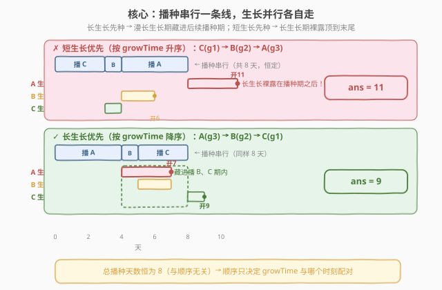
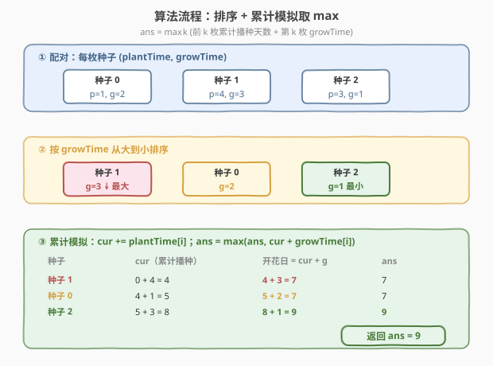
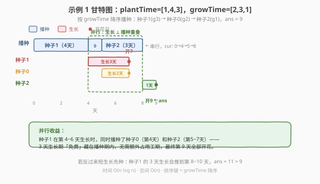

# LeetCode 全部开花的最早一天 题解

## 1. 题目概述

- **标题 / 题号**：全部开花的最早一天（#2136，hard）
- **链接**：https://leetcode.cn/problems/earliest-possible-day-of-full-bloom/
- **难度**：困难
- **标签**：贪心、数组、排序

**题意**：你有 `n` 枚花的种子。每枚种子必须先**种下**，才能开始**生长**、开花。给你两个下标从 0 开始的整数数组 `plantTime` 和 `growTime`，长度均为 `n`：

- `plantTime[i]`：播种第 `i` 枚种子所需的**完整天数**。每天你只能为**某一枚**种子播种（播种同一枚种子的天数**无须连续**，但累计工作天数达到 `plantTime[i]` 后才算种完）。
- `growTime[i]`：第 `i` 枚种子**完全种下后**生长所需的完整天数。生长的最后一天**之后**开花并永远绽放。

从第 `0` 天开始，可按**任意顺序**播种。返回所有种子都开花的**最早**一天。

**示例 1**：

```text
输入：plantTime = [1,4,3], growTime = [2,3,1]
输出：9
解释：一种最优方案——
第 0 天播种种子 0（1 天），生长 2 天，第 3 天开花；
第 1~4 天播种种子 1（4 天），生长 3 天，第 8 天开花；
第 5~7 天播种种子 2（3 天），生长 1 天，第 9 天开花。
所有种子在第 9 天全部开花。
```

**示例 2**：

```text
输入：plantTime = [1,2,3,2], growTime = [2,1,2,1]
输出：9
```

**示例 3**：

```text
输入：plantTime = [1], growTime = [1]
输出：2
```

**约束**：

- $n == \text{plantTime.length} == \text{growTime.length}$
- $1 \le n \le 10^5$
- $1 \le \text{plantTime}[i], \text{growTime}[i] \le 10^4$

> 💡 两个关键结构：**播种是串行的**（每天只播一枚，总播种天数恒为 $\sum \text{plantTime}$，与顺序无关）；**生长是并行的**（每种完一枚便立即开始独立生长，多枚种子可同时生长）。答案由「最后开花的那枚」决定，因此要让**生长慢的种子尽早种完**，使其漫长的生长期能与后续种子的播种期重叠。

## 2. 解题思路

### 2.1 暴力思路：枚举全排列

枚举所有 $n!$ 种播种顺序，对每种顺序模拟：维护累计播种天数 `cur`，每种种完的种子在 `cur + growTime` 开花，取所有种子开花日的最大值。即使模拟本身 $O(n)$，$n!$ 量级对 $n \le 10^5$ 完全不可行。

> ⚠️ 暴力法的问题在于「没有利用并行结构」：总播种时间 $\sum \text{plantTime}$ 是**定值**，顺序只影响每枚种子的「种完时刻」。真正要优化的不是播种总时长，而是「让生长慢的种子尽早开始生长」——这是一个**排序贪心**问题。

### 2.2 核心观察：长生长优先 + 交换论证



**关键转化**：设播种顺序为 $\sigma_1, \sigma_2, \dots, \sigma_n$，记前 $k$ 枚种子的累计播种天数为

$$P_k = \sum_{i=1}^{k} \text{plantTime}[\sigma_i]$$

则第 $k$ 枚种完的种子在 $P_k$ 时刻开始生长、于 $P_k + \text{growTime}[\sigma_k]$ 开花。所有种子开花日为

$$\text{ans} = \max_{k=1}^{n}\bigl(P_k + \text{growTime}[\sigma_k]\bigr)$$

注意 $P_n = \sum \text{plantTime}$ 是**与顺序无关的定值**——顺序只改变各 $\text{growTime}$ 与哪个 $P_k$ 配对。

> 💡 **贪心策略**：按 $\text{growTime}$ **从大到小**播种。直觉——生长慢的种子越早种完，它漫长的生长期就越能「藏」在后续种子的播种期里；若把它放最后，它的长生长期会直接顶到最末尾，毫无重叠地拖后总完工日。

**交换论证（adjacent swap）**：设相邻两枚种子先 $i$ 后 $j$，且 $\text{growTime}_i < \text{growTime}_j$。记它们之前的累计播种天数为 $t$，则

- 顺序 $(i, j)$：$i$ 开花于 $t + p_i + g_i$，$j$ 开花于 $t + p_i + p_j + g_j$，二者最大值为 $t + p_i + \max(g_i,\; p_j + g_j)$；
- 交换为 $(j, i)$：$j$ 开花于 $t + p_j + g_j$，$i$ 开花于 $t + p_j + p_i + g_i$，二者最大值为 $t + p_j + \max(g_j,\; p_i + g_i)$。

由 $g_j > g_i$ 可证交换后不增：

$$\underbrace{p_j + \max(g_j,\; p_i + g_i)}_{\text{交换后}} \;\le\; \underbrace{p_i + \max(g_i,\; p_j + g_j)}_{\text{交换前}} \;=\; p_i + p_j + g_j$$

最后一等号因 $p_j + g_j > g_j > g_i$。而 $\max(g_j,\; p_i + g_i) \le p_i + g_j$ 恒成立（$g_j \le p_i + g_j$ 显然；$p_i + g_i \le p_i + g_j$ 由 $g_i \le g_j$），故交换后 $\le p_i + g_j \le p_i + p_j + g_j$，得证。

> ⚠️ 任意「短生长在前、长生长在后」的逆序对都可通过相邻交换消除且不使答案变差，故「按 $\text{growTime}$ 降序」是该交换论证下的**全局最优**（类似冒泡排序的终止性）。

### 2.3 算法流程图



```text
earliestFullBloom(plantTime, growTime):
  n = len(plantTime)
  # ① 按下标配对，按 growTime 降序排序
  order = sorted(range(n), key=lambda i: growTime[i], reverse=True)
  # ② 累计模拟
  cur = 0          # 累计播种天数（= 当前种子种完时刻）
  ans = 0
  for i in order:
      cur += plantTime[i]                 # 种完 i 的时刻
      ans = max(ans, cur + growTime[i])   # i 的开花日
  return ans
```

> 💡 **为什么是 `max` 而非末项**：所有种子开花日各异，总完工日由「最后开花」者决定。即使最后一枚种完的种子生长快、早早开花，也可能某枚**更早种完但生长极慢**的种子拖到最后才开——故必须取所有 $P_k + g_k$ 的最大值，而非最后一项。

### 2.4 示例演算



以**示例 1** `plantTime = [1,4,3]`，`growTime = [2,3,1]` 为例。按 $\text{growTime}$ 降序排序后播种顺序为 **种子 1 → 种子 0 → 种子 2**：

| 步骤 | 种子 | growTime | plantTime | `cur`（累计播种，种完时刻） | 开花日 $= \text{cur} + \text{growTime}$ | `ans` |
|------|------|----------|-----------|---------------------------|----------------------------------------|-------|
| 1 | 种子 1 | 3 | 4 | 4 | 7 | 7 |
| 2 | 种子 0 | 2 | 1 | 5 | 7 | 7 |
| 3 | 种子 2 | 1 | 3 | 8 | 9 | **9** |

时间线（灰格=播种，彩格=生长，花=开花日）：

```text
日:  0  1  2  3  4  5  6  7  8  9
种子1:▓▓▓▓ ░░░        🌸          ← 播种0-3, 生长4-6, 第7天开花
种子0:         ▓ ░░ 🌸            ← 播种4, 生长5-6, 第7天开花
种子2:            ▓▓▓ ░ 🌸       ← 播种5-7, 生长8, 第9天开花
```

> 💡 **并行的威力**：种子 1 在第 4~6 天生长时，我们**同时**播种了种子 0（第 4 天）和种子 2（第 5~7 天）。若反过来让短生长的种子 2 先种，它第 4 天就开完花，但种子 1 的 3 天生长会被推到最末尾，总完工日拖到 $8 + 3 = 11 > 9$。这正是「长生长优先」让生长期与播种期重叠的价值。

## 3. 参考代码

### C++

```cpp
class Solution {
public:
    int earliestFullBloom(vector<int>& plantTime, vector<int>& growTime) {
        int n = plantTime.size();
        vector<int> order(n);
        iota(order.begin(), order.end(), 0);
        // 按 growTime 降序排序
        sort(order.begin(), order.end(), [&](int a, int b) {
            return growTime[a] > growTime[b];
        });
        int cur = 0, ans = 0;
        for (int i : order) {
            cur += plantTime[i];
            ans = max(ans, cur + growTime[i]);
        }
        return ans;
    }
};
```

### Python

```python
class Solution:
    def earliestFullBloom(self, plantTime: List[int], growTime: List[int]) -> int:
        n = len(plantTime)
        order = sorted(range(n), key=lambda i: growTime[i], reverse=True)
        cur = 0
        ans = 0
        for i in order:
            cur += plantTime[i]
            ans = max(ans, cur + growTime[i])
        return ans
```

### Python（zip 配对排序简写）

```python
class Solution:
    def earliestFullBloom(self, plantTime: List[int], growTime: List[int]) -> int:
        # 按 growTime 降序排序后逐项累计
        cur = ans = 0
        for p, g in sorted(zip(plantTime, growTime), key=lambda x: -x[1]):
            cur += p
            ans = max(ans, cur + g)
        return ans
```

> ⚠️ **溢出提醒**：$n \le 10^5$、$\text{plantTime}[i] \le 10^4$，累计播种天数最大 $10^9$，加 $\text{growTime}$ 后仍在 `int`（$\approx 2.1 \times 10^9$）范围内，C++ 用 `int` 安全。若约束再放宽一档，则需改用 `long long`。

## 4. 复杂度分析

| 维度 | 复杂度 | 说明 |
|------|--------|------|
| **时间复杂度** | $O(n \log n)$ | 排序主导；后续单趟累计 $O(n)$ |
| **空间复杂度** | $O(n)$ | 存排序下标数组 `order`（原地排序可降到 $O(1)$ 额外空间，但会破坏原数组） |

> 与暴力 $O(n!)$ 的对比：贪心把「选顺序」从组合爆炸降到排序，根源是发现总播种时间为定值、只需让长生长与播种期重叠——一个**排序键**（$\text{growTime}$ 降序）即编码了全部最优结构。

## 5. 扩展：播种天数无须连续的影响

题目允许「播种同一枚种子的天数无须连续」——例如可在第 0、3、5 天分别播种同一枚种子，只要累计达到 `plantTime` 即算种完。这是否影响贪心？

**结论：不影响**。最优解中**每枚种子一定被连续播完**，理由：

- 任意把一枚种子的播种天数「拆散」插入其它种子的播种间隙，只会让它的「种完时刻」**推迟**（最后一个播种片段更靠后），而生长在种完后才开始——推迟种完 ⟹ 推迟开花 ⟹ 不更优。
- 反之，把它**连续**放在某个时间区间内，种完时刻最早，开花最早。故连续播种是最优的，题目给的灵活性不会带来额外收益。

> 💡 这也解释了为何贪心模型可直接用「累计播种天数」$P_k$ 作为种完时刻——默认了每枚种子被连续播完，而这恰是最优行为。题目的「无须连续」只是放宽合法解集合，但最优解仍落在「连续」子集内。

## 6. 面试要点

1. **为什么总播种时间与顺序无关？**

   - 每天只能播一枚种子，播种 $n$ 枚各需 $\text{plantTime}[i]$ 天，则无论顺序如何、是否连续，总占用天数恒为 $\sum \text{plantTime}$。顺序只决定「每枚种子何时种完」，不改变总工期下界。

2. **为什么按 $\text{growTime}$ 降序而非升序？**

   - 生长是并行的，播种是串行的。长生长的种子越早种完，其漫长生长期越能藏在后续种子的播种期里「免费」进行。若放最后，它的长生长期会裸露地顶到末尾，毫无重叠地拖后总完工日。

3. **交换论证的核心一步是什么？**

   - 对相邻 $(i,j)$ 且 $g_i < g_j$，证明交换为 $(j,i)$ 后这两枚的最大开花日不增：关键是 $\max(g_j,\; p_i + g_i) \le p_i + g_j$ 恒成立（因 $g_j \le p_i + g_j$ 且 $p_i + g_i \le p_i + g_j$）。消除所有逆序对即得全局最优。

4. **答案为什么取 `max` 而非最后一项？**

   - 总完工日由「最后开花」者决定，它不一定是最后种完的种子。某枚早种完但生长极慢的种子可能开花最晚。故须对所有 $P_k + g_k$ 取最大值。

5. **如果允许同时播种多枚种子（多机调度）会怎样？**

   - 退化为 $m$ 台并行机的调度问题（$P \mid \mid C_{\max}$），NP-hard。本题是 $m=1$ 的特例——单机串行 + 各任务有「尾权」（growTime），按尾权降序的 **Lawler 算法** 即最优，本题正是其直接应用。

> 💡 **一句话总结**：2136 是「**单机调度 + 尾权**」的招牌题——播种是单机串行加工、生长是各任务的尾权（无资源占用的收尾），按尾权 $\text{growTime}$ 降序的 Lawler 贪心即最优，$O(n \log n)$ 一趟累计取 max。

## 同类练习题

| # | 题目 | 与本题的关联 |
|---|------|-------------|
| 621 | [任务调度器](https://leetcode.cn/problems/task-scheduler/)（[站内题解](../0601-0700/621_任务调度器.md)） | CPU 串行执行任务 + 冷却期并行等待，同为「串行工作 + 并行空闲」结构，按频率贪心安排 |
| 1665 | [完成所有任务的最少初始能量](https://leetcode.cn/problems/minimum-initial-energy-to-finish-tasks/)（[站内题解](../1601-1700/1665_完成所有任务的最少初始能量.md)） | 按「实际−最低」差值排序的贪心，同属「排序键编码最优结构 + 交换论证」范式 |
| 452 | [用最少数量的箭引爆气球](https://leetcode.cn/problems/minimum-number-of-arrows-to-burst-balloons/)（[站内题解](../0401-0500/452_用最少数量的箭引爆气球.md)） | 区间按右端点排序的贪心，经典排序贪心调度题 |
| 179 | [最大数](https://leetcode.cn/problems/largest-number/)（[站内题解](../0101-0200/179_最大数.md)） | 自定义比较器排序，练习「排序键即最优结构」的构造思路 |
