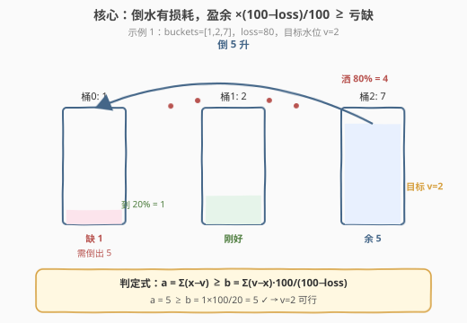
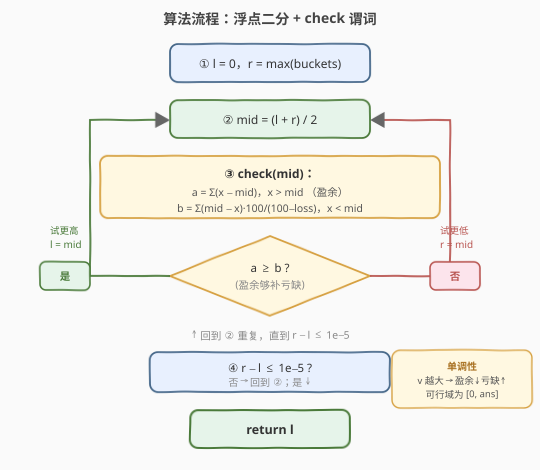

# 通过倒水操作让所有的水桶所含水量相等

- **题目名称**：通过倒水操作让所有的水桶所含水量相等
- **链接**：[2137. 通过倒水操作让所有的水桶所含水量相等](https://leetcode.cn/problems/pour-water-between-buckets-to-make-water-levels-equal/)
- **难度**：中等
- **标签**：数组、二分查找、二分答案

## 1. 题目概述

你有 `n` 个水桶，第 `i` 个水桶中有 `buckets[i]` 升水。你想让所有水桶中的水量相同。你可以从一个水桶向**任意另一个**水桶倒任意数量的水（可以是小数）。但每倒 `k` 升水，**百分之** `loss` 的水会洒掉（即只有 $k \cdot \frac{100-\text{loss}}{100}$ 升能到达目标桶）。

返回经过倒水操作后，所有水桶水量相等时，每个水桶中的**最大**水量。答案与标准答案误差不超过 $10^{-5}$ 即可通过。

**示例 1**：

```text
输入：buckets = [1,2,7], loss = 80
输出：2.00000
解释：从水桶 2 向水桶 0 倒 5 升水。
5 × 80% = 4 升洒掉，水桶 0 只获得 5 − 4 = 1 升。
此时所有水桶都含 2 升水，返回 2。
```

**示例 2**：

```text
输入：buckets = [2,4,6], loss = 50
输出：3.50000
解释：从水桶 1 向水桶 0 倒 0.5 升（洒 0.25，到 0.25）；
再从水桶 2 向水桶 0 倒 2.5 升（洒 1.25，到 1.25）。
水桶 0 共获 1.5 升，达到 3.5，所有桶均为 3.5。
```

**示例 3**：

```text
输入：buckets = [3,3,3,3], loss = 40
输出：3.00000
解释：所有水桶已含相同水量。
```

**约束条件**：

- $1 \le n \le 10^5$
- $0 \le \text{buckets}[i] \le 10^5$
- $0 \le \text{loss} \le 99$

> 💡 关键结构：**水量是守恒衰减的**——倒出 $k$ 升只有 $k \cdot \frac{100-\text{loss}}{100}$ 升到达。要把低桶抬到目标水位 $v$，每补 1 升缺口需从高桶倒出 $\frac{100}{100-\text{loss}}$ 升。问题问的是「最大可行水位」，而「水位越高越难满足」天然单调——这是**二分答案**的招牌特征。

---

## 2. 解题思路

### 2.1 暴力思路：枚举目标水位

从小到大枚举每个候选水位 $v$（在所有 `buckets[i]` 取值甚至更密的网格上），对每个 $v$ 模拟倒水能否让所有桶达到 $v$。但 $v$ 是连续实数，且模拟倒水过程本身复杂（先倒哪桶、倒多少都影响损耗），暴力既不精确也不可行。

> ⚠️ 暴力法的盲点在于「陷入倒水顺序的细节」。其实能否达到水位 $v$ 只取决于**总量是否够补**，与倒水顺序无关——把所有盈余桶能倒出的水加总，与所有亏缺桶需要倒入的水（换算成需倒出量）加总比较即可。这是一个**可行性判定**问题，配合单调性即二分答案。

### 2.2 核心观察：可行性判定 + 单调性 → 二分答案



**可行性判定 `check(v)`**：设目标水位为 $v$。

- 对 `buckets[i] > v` 的桶：水量盈余 $x - v$，这部分水可以被倒出（供给方）。
- 对 `buckets[i] < v` 的桶：水量亏缺 $v - x$。为补足这 $v-x$ 升，由于每倒出 1 升只有 $\frac{100-\text{loss}}{100}$ 升到达，需从盈余桶倒出 $(v-x) \cdot \frac{100}{100-\text{loss}}$ 升。

记

$$a = \sum_{x > v}(x - v), \qquad b = \sum_{x < v}(v - x) \cdot \frac{100}{100-\text{loss}}$$

则 $v$ 可行 $\iff a \ge b$（盈余能覆盖「换算后的亏缺需求」）。

> 💡 **为何与倒水顺序无关**：损耗只与「倒出量」成正比，与倒几次、怎么倒无关（线性损耗）。无论把哪桶盈余倒给哪桶亏缺，总到达量恒为 $\text{总倒出量} \times \frac{100-\text{loss}}{100}$。故只需比较总量，不必关心调度细节。

**单调性**：随着 $v$ 增大，盈余 $a$ 单调不增、亏缺需求 $b$ 单调不减，故 $a \ge b$ 一旦不成立便永不成立——`check(v)` 是从 `true` 单调过渡到 `false` 的布尔序列。**二分查找最大的可行 $v$** 即答案。

**二分区间**：

- 下界 $l = 0$：`check(0)` 恒成立（所有桶都盈余、无亏缺）。
- 上界 $r = \max(\text{buckets})$：水位不可能超过最大桶原有水量（水不能凭空产生）。`check(r)` 仅在所有桶相等时成立，否则不成立。

> ⚠️ 注意 $\text{loss} \in [0, 99]$，故 $100 - \text{loss} \in [1, 100]$ 恒为正，**无除零风险**。当 $\text{loss}=0$ 时 $\frac{100}{100-\text{loss}}=1$，无损耗，答案退化为平均值 $\frac{\sum x}{n}$；当 $\text{loss}=99$ 时补 1 升需倒出 100 升，水位几乎卡在最小桶附近。

### 2.3 算法流程图



```text
equalizeWater(buckets, loss):
  l = 0
  r = max(buckets)
  while r - l > 1e-5:            # 精度控制
      mid = (l + r) / 2
      a = sum(x - mid for x in buckets if x > mid)          # 盈余
      b = sum((mid - x) * 100 / (100 - loss)                # 需倒出
              for x in buckets if x < mid)
      if a >= b:                 # mid 可行 → 试更高
          l = mid
      else:                      # mid 不可行 → 试更低
          r = mid
  return l
```

> 💡 **浮点二分的终止**：用 `while r - l > 1e-5` 控制区间宽度，循环结束时 $l$ 与真值误差不超过 $10^{-5}$，满足题目精度。也可改用固定 60 次迭代（$2^{60}$ 倍缩放，精度远超需求），代码更稳健、不受量纲影响。

### 2.4 示例演算

![示例演算：buckets=[2,4,6]，loss=50，验证 v=3.5](../images/2137_example_walkthrough.svg)

以**示例 2** `buckets = [2,4,6]`，`loss = 50` 为例，因子 $\frac{100}{100-50} = 2$（每补 1 升需倒出 2 升）。验证 `check(3.5)`：

| 桶 | 水量 $x$ | 与 $v=3.5$ | 盈余 $x-v$ | 需倒出 $(v-x)\times 2$ |
|----|---------|-----------|-----------|----------------------|
| 0 | 2 | ＜ 亏 | — | $1.5 \times 2 = 3.0$ |
| 1 | 4 | ＞ 盈 | 0.5 | — |
| 2 | 6 | ＞ 盈 | 2.5 | — |
| **Σ** | | | **$a = 3.0$** | **$b = 3.0$** |

$a = 3.0 \ge b = 3.0$ ✓，故 $v=3.5$ 可行。

> 💡 **为何 3.5 是最大**：当 $v > 3.5$，盈余 $a$ 下降而亏缺 $b$ 上升（且 $b$ 还乘 2 放大），$a \ge b$ 必然失败。例如 $v=3.6$：$a=0.4+2.4=2.8$，$b=1.6\times2=3.2$，$2.8 < 3.2$ 不可行。二分会把区间 $[0, 6]$ 反复折半缩至 $r-l \le 10^{-5}$，收敛到 $3.5$。

---

## 3. 参考代码

### C++

```cpp
class Solution {
public:
    double equalizeWater(vector<int>& buckets, int loss) {
        double l = 0, r = *max_element(buckets.begin(), buckets.end());
        auto check = [&](double v) {
            double a = 0, b = 0;
            for (int x : buckets) {
                if (x > v) {
                    a += x - v;
                } else {
                    b += (v - x) * 100.0 / (100 - loss);
                }
            }
            return a >= b;
        };
        while (r - l > 1e-5) {
            double mid = (l + r) / 2;
            if (check(mid)) {
                l = mid;
            } else {
                r = mid;
            }
        }
        return l;
    }
};
```

### Python

```python
class Solution:
    def equalizeWater(self, buckets: List[int], loss: int) -> float:
        def check(v: float) -> bool:
            a = b = 0.0
            for x in buckets:
                if x > v:
                    a += x - v
                else:
                    b += (v - x) * 100 / (100 - loss)
            return a >= b

        l, r = 0.0, max(buckets)
        while r - l > 1e-5:
            mid = (l + r) / 2
            if check(mid):
                l = mid
            else:
                r = mid
        return l
```

### Python（固定迭代次数版，更稳健）

```python
class Solution:
    def equalizeWater(self, buckets: List[int], loss: int) -> float:
        def check(v: float) -> bool:
            a = b = 0.0
            for x in buckets:
                if x > v:
                    a += x - v
                else:
                    b += (v - x) * 100 / (100 - loss)
            return a >= b

        l, r = 0.0, max(buckets)
        for _ in range(60):          # 2^60 缩放，精度远超 1e-5
            mid = (l + r) / 2
            if check(mid):
                l = mid
            else:
                r = mid
        return l
```

> ⚠️ **精度注意**：`while r - l > 1e-5` 在 $r$ 量级为 $10^5$ 时仍安全（`double` 有约 15 位有效数字），但若题目放宽 `buckets[i]` 上界到 $10^9$，则建议改用固定迭代次数版，避免大数相减的相对精度问题。

---

## 4. 复杂度分析

| 维度 | 复杂度 | 说明 |
|------|--------|------|
| **时间复杂度** | $O(n \log \frac{M}{\varepsilon})$ | 二分区间宽 $M=\max(\text{buckets})\le 10^5$，精度 $\varepsilon=10^{-5}$，迭代约 $\log_2(10^{10})\approx 34$ 次；每次 `check` 一趟 $O(n)$ |
| **空间复杂度** | $O(1)$ | 只用常数个浮点变量，原地遍历 |

> 与暴力模拟的对比：二分答案把「选目标水位」从连续实数枚举降到 $\log$ 级判定，根源是发现可行性只依赖总量守恒、且随水位单调——一个**谓词函数** `check(v)` 即编码了全部最优结构。

---

## 5. 扩展：损耗模型与退化情形

**线性损耗的等价性**：题目规定「倒 $k$ 升洒百分之 `loss`」，即到达量为 $k \cdot \frac{100-\text{loss}}{100}$，损耗与单次倒水量成**线性**关系。这意味着无论分几次倒、怎么分配，总到达量只取决于总倒出量——这是 `check` 只看总量的理论基石。若改成「每倒一次固定洒 $c$ 升」（与倒量无关的固定开销），则倒水顺序会影响总损耗，问题退化为复杂的调度优化，不再能用简单的总量判定。

**退化情形**：

- $\text{loss}=0$：$\frac{100}{100-\text{loss}}=1$，无损耗，水完全守恒。`check(v)` 退化为 $\sum(x-v) \ge \sum(v-x)$，即 $\sum x \ge n\cdot v$，最大可行 $v = \frac{\sum x}{n}$（平均值）。二分答案对 $\text{loss}=0$ 自然给出平均值。
- $\text{loss}=99$：补 1 升需倒出 100 升，亏缺被放大百倍，水位几乎只能取在最小桶附近，但只要最大桶水量远大于亏缺，仍可略高于最小值。
- 所有桶相等：$\max=\min$，$r=l$，循环不执行，直接返回该值。

> 💡 二分答案的**通用范式**：当问题是「求最大的某指标，使得某条件成立」且条件关于该指标**单调**时，把「指标取值」作为二分对象、把「条件是否成立」作为谓词 `check`，即可在 $O(\text{check} \times \log \frac{\text{值域}}{\varepsilon})$ 内求解。本题是该范式在浮点值域上的典型应用。

---

## 6. 面试要点

1. **为什么能用二分答案？**

   - 「最大可行水位」= 最大的 $v$ 使 `check(v)` 成立。而 $v$ 越大，盈余 $a$ 越小、亏缺需求 $b$ 越大，`check(v)` 由 `true` 单调转 `false`。单调布尔序列求边界 ⟹ 二分。

2. **`check(v)` 里的 $b$ 为什么乘 $\frac{100}{100-\text{loss}}$ 而不是乘 $\frac{100-\text{loss}}{100}$？**

   - 亏缺 $(v-x)$ 是**需要到达**的水量。每倒出 1 升只有 $\frac{100-\text{loss}}{100}$ 升到达，故为送达 $(v-x)$ 升需倒出 $(v-x) \div \frac{100-\text{loss}}{100} = (v-x)\cdot\frac{100}{100-\text{loss}}$ 升。除变乘倒数，方向别搞反。

3. **为什么倒水顺序不影响可行性？**

   - 损耗与单次倒水量成**线性**正比，总到达量 $= \text{总倒出量}\times\frac{100-\text{loss}}{100}$，与分几次、倒给谁无关。故只需比较「能倒出的总量」与「需倒出的总量」。

4. **二分上下界怎么取？精度如何保证？**

   - 下界 $l=0$（恒可行），上界 $r=\max(\text{buckets})$（水不能凭空产生）。用 `while r-l > 1e-5` 或固定 60 次迭代，误差 $\le 10^{-5}$ 满足题目要求。

5. **`loss=0` 和 `loss=99` 各退化成什么？**

   - `loss=0`：无损耗，水守恒，答案 = 平均值 $\frac{\sum x}{n}$。`loss=99`：补 1 升需倒出 100 升，亏缺被巨幅放大，水位贴近最小桶但仍可略高（取决于盈余是否够放大后的需求）。

> 💡 **一句话总结**：2137 是「**二分答案 + 总量可行性判定**」的招牌题——倒水损耗线性 ⟹ 可行性只看「盈余总量 $\ge$ 亏缺换算总量」，水位单调 ⟹ 浮点二分求最大可行值，$O(n\log\frac{M}{\varepsilon})$ 一趟 `check` 搞定。

---

## 7. 同类练习题

- [875. 爱吃香蕉的珂珂](https://leetcode.cn/problems/koko-eating-bananas/)（[站内题解](../0801-0900/875_爱吃香蕉的珂珂.md)）：二分答案 + $O(n)$ 验证，整数版二分答案入门，承接本题的「谓词单调即二分」范式
- [1011. 在 D 天内送达包裹的能力](https://leetcode.cn/problems/capacity-to-ship-packages-within-d-days/)（[站内题解](../1001-1100/1011_在D天内送达包裹的能力.md)）：二分答案 + 贪心验证，同样是「最大/最小可行指标 + 单调谓词」
- [410. 分割数组的最大值](https://leetcode.cn/problems/split-array-largest-sum/)（[站内题解](../0401-0500/410_分割数组的最大值.md)）：二分答案 + 贪心划分，困难版二分答案，练习谓词设计与边界
- [719. 找出第 K 小的数对距离](https://leetcode.cn/problems/find-k-th-smallest-pair-distance/)（[站内题解](../0701-0800/719_找出第K小的数对距离.md)）：二分答案 + 双指针计数，二分值域 + $O(n)$ 计数验证，与本题同属「二分指标 + 线性 check」家族
