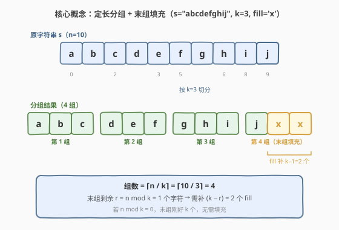
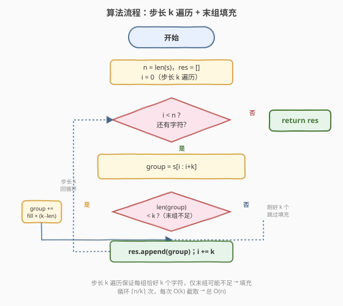
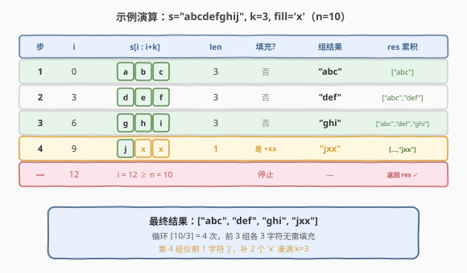

# 将字符串拆分为若干长度为 k 的组

- **题目名称**：将字符串拆分为若干长度为 k 的组
- **链接**：[2138. 将字符串拆分为若干长度为 k 的组](https://leetcode.cn/problems/divide-a-string-into-groups-of-size-k/)
- **难度**：简单
- **标签**：字符串、模拟

## 1. 题目概述

给定一个字符串 `s`，将其按**从左到右**的顺序划分为若干长度为 `k` 的组：

- 第一组由前 `k` 个字符组成，第二组由接下来的 `k` 个字符组成，依此类推。
- **每个字符都必须属于某一个组**（不能跳过）。
- 对于**最后一组**，如果剩余字符**不足** `k` 个，需用字符 `fill` 补全到长度 `k`。

返回一个字符串数组，表示分组后每个组的组成情况。

> ⚠️ 注意：去除最后一组的填充字符后按顺序连接所有组，应能得到原串 `s`——即填充只发生在末组、且只补在尾部。

**示例 1**：

```text
输入：s = "abcdefghi", k = 3, fill = "x"
输出：["abc","def","ghi"]
解释：
  n = 9 恰好被 3 整除，3 组各 3 字符，无需填充。
```

**示例 2**：

```text
输入：s = "abcdefghij", k = 3, fill = "x"
输出：["abc","def","ghi","jxx"]
解释：
  前 3 组 "abc"、"def"、"ghi" 各 3 字符。
  末组仅剩 'j'（1 个），补 2 个 'x' 凑成 "jxx"。
```

**示例 3**：

```text
输入：s = "a", k = 1, fill = "x"
输出：["a"]
解释：
  n = 1 恰好被 1 整除，1 组 1 字符，无需填充。
```

**约束条件**：

- $1 \leq \text{s.length} \leq 100$
- `s` 仅由小写英文字母组成
- $1 \leq k \leq 100$
- `fill` 是一个小写英文字母

> 💡 **审题关键**：① 分组是**定长**的——每组恰好 `k` 个字符，只有末组可能不足；② 填充**只发生在末组**，且补在**尾部**；③ 组数 $= \lceil n / k \rceil$，当 $n \bmod k = 0$ 时末组刚好、无需填充。数据规模极小（$n \leq 100$），任何正确做法都能通过，但应展示**步长遍历 + 一次性填充**的清晰写法。

---

## 2. 解题思路

### 2.1 暴力思路：逐字符累加到缓冲区

最直白的做法：维护一个临时缓冲区 `buf`，逐字符遍历 `s`，每凑满 `k` 个就输出一组并清空缓冲区；遍历结束后若 `buf` 非空，用 `fill` 补到 `k` 再输出。

- **正确性**：完全符合题意。
- **不足**：逐字符处理引入了「缓冲区管理」的额外状态——计数器、清空时机、末尾补齐分支——逻辑分散，容易在边界（空缓冲区、恰好凑满）处出错。实际上「定长分组」的本质是**等间距切片**，完全可以用步长 `k` 直接跳跃，无需逐字符累积。

> 💡 本题数据量小，暴力做法当然能 AC。但「逐字符累加」把简单的切片问题复杂化了——面试中应直接展示「步长遍历」的写法，体现对问题结构的洞察。

### 2.2 核心观察：定长切片，末组唯一需要填充



关键观察：分组是**等间距**的——第 $i$ 组（从 0 开始）对应原串的下标区间 $[i \cdot k,\ i \cdot k + k)$。因此无需逐字符扫描，直接**以步长 $k$ 遍历起点**即可：

$$\text{第 } i \text{ 组} = s\left[i \cdot k\ :\ \min\left((i+1) \cdot k,\ n\right)\right]$$

- **组数**：$\lceil n / k \rceil$，等价于整数上取整公式 $\lfloor (n + k - 1) / k \rfloor$。
- **末组**：当 $n \bmod k \neq 0$ 时，末组仅含 $r = n \bmod k$ 个字符，需补 $k - r$ 个 `fill`。
- **其余组**：长度恰好 $k$，无需任何处理。

> 💡 **为什么只需处理末组？** 因为前 $\lfloor n/k \rfloor$ 组每组都恰好 $k$ 个字符（等间距切片保证），只有最后一组可能「够不着」$k$。这意味着填充逻辑只需一处 `if` 判定，代码极简。

> ⚠️ **填充位置**：`fill` 只补在末组**尾部**，不能补在头部或中间。使用 `group += fill * (k - len(group))` 自然满足此要求（字符串拼接在末尾）。

### 2.3 算法流程图



**完整步骤**：

1. **初始化**：`n = len(s)`，`res = []`，遍历起点 `i = 0`。
2. **循环**（步长 `k`）：当 `i < n` 时：
   - 截取 `group = s[i : i+k]`（语言原生切片，越界自动截断）。
   - **若** `len(group) < k`：`group += fill * (k - len(group))`（末组填充）。
   - `res.append(group)`。
   - `i += k`。
3. **返回** `res`。

> 💡 **Python / C++ 切片的越界安全性**：Python 的 `s[i:i+k]` 在 `i+k` 超过 `n` 时自动截断到末尾，不会报错；C++ 的 `s.substr(i, k)` 同样取 `min(k, n-i)` 个字符。因此无需手动计算截取长度，只需在截取后检查 `len` 是否不足 `k` 即可——这是简化代码的关键。

### 2.4 示例演算

以示例 2 `s = "abcdefghij", k = 3, fill = 'x'`（$n = 10$）为例逐步演算：



| 步 | `i` | `s[i:i+k]` | len | 填充? | 组结果 | res 累积 |
|----|-----|------------|-----|-------|--------|----------|
| 1 | 0 | `"abc"` | 3 | 否 | `"abc"` | `["abc"]` |
| 2 | 3 | `"def"` | 3 | 否 | `"def"` | `["abc","def"]` |
| 3 | 6 | `"ghi"` | 3 | 否 | `"ghi"` | `["abc","def","ghi"]` |
| 4 | 9 | `"j"` | 1 | 是 `+xx` | `"jxx"` | `["abc","def","ghi","jxx"]` |
| — | 12 | — | — | `i ≥ n` 停止 | — | 返回 `res` |

- 步 1–3：每次 `i` 增加 3，截取 3 个字符，`len = 3 = k`，无需填充。
- 步 4：`i = 9`，`s[9:12]` 越界自动截断为 `"j"`（仅 1 字符），`len = 1 < k = 3`，补 `fill × (3−1) = "xx"` → `"jxx"`。
- 步 5：`i = 12 ≥ n = 10`，循环结束，返回 `["abc","def","ghi","jxx"]`。

> 💡 对照示例 1 `s = "abcdefghi", k = 3`（$n = 9 = 3 \times 3$）：步 1–3 同上，步 4 时 `i = 9 ≥ n = 9` 直接停止，无末组填充——这正是 $n \bmod k = 0$ 的情形。

---

## 3. 参考代码

### Python

```python
class Solution:
    def divideString(self, s: str, k: int, fill: str) -> list[str]:
        res = []
        for i in range(0, len(s), k):
            group = s[i:i + k]
            if len(group) < k:
                group += fill * (k - len(group))
            res.append(group)
        return res
```

### C++

```cpp
class Solution {
public:
    vector<string> divideString(string s, int k, char fill) {
        vector<string> res;
        int n = s.size();
        for (int i = 0; i < n; i += k) {
            string group = s.substr(i, k);
            while (group.size() < k) group.push_back(fill);
            res.push_back(group);
        }
        return res;
    }
};
```

> 💡 **实现细节**：① Python 用 `range(0, len(s), k)` 天然实现步长遍历，`s[i:i+k]` 越界自动截断；② C++ 用 `s.substr(i, k)` 取最多 `k` 个字符，`while` 循环补齐到 `k`（也可写成 `group += string(k - group.size(), fill)` 一行补齐）；③ 无需预先计算组数，循环条件 `i < n` 自然控制——当 `i` 步进到 `≥ n` 时退出。

---

## 4. 复杂度分析

| 维度 | 复杂度 | 说明 |
|------|--------|------|
| 时间 | $O(n)$ | 循环 $\lceil n/k \rceil$ 次，每次截取 $O(k)$，总截取 $n$ 字符 + 末组填充至多 $k-1$ 字符，整体与 $n$ 同阶 |
| 空间 | $O(n)$ | 结果数组存储 $\lceil n/k \rceil$ 个字符串，总字符数 $= n + \text{填充量} \leq n + k$ |

> 💡 约束 $n \leq 100$，最大操作数百次，远低于时限。即便 $n$ 放大到 $10^6$，$O(n)$ 仍轻松通过。空间上结果本身需要 $O(n)$（输出不计则 $O(1)$ 额外空间），无法进一步优化——每个字符都必须出现在某个组中。

---

## 5. 扩展：预计算组数 + 列表推导

若希望代码更紧凑，可预计算组数后用列表推导一次性生成：

### Python

```python
class Solution:
    def divideString(self, s: str, k: int, fill: str) -> list[str]:
        n = len(s)
        groups = (n + k - 1) // k          # ⌈n/k⌉ 的整数上取整
        s += fill * (groups * k - n)       # 一次性补齐末组
        return [s[i * k : i * k + k] for i in range(groups)]
```

> 💡 此写法先在 `s` 尾部一次性补足 `fill` 使总长恰好 $= \text{groups} \times k$，之后每组截取都恰好 $k$ 个字符，循环内无需 `if` 判定。**思路对照**：把「末组特殊处理」转换为「预处理统一长度」，用一次补齐换取循环内的零分支——这是「预处理消除特例」的常用技巧。

> ⚠️ Python 中 `s += ...` 会创建新字符串（`str` 不可变），额外 $O(k)$ 空间。由于 $k \leq 100$ 可忽略。若 $k$ 很大，应改用原写法（循环内按需填充）避免预补齐的额外空间。

### C++（预补齐版）

```cpp
class Solution {
public:
    vector<string> divideString(string s, int k, char fill) {
        int n = s.size();
        int groups = (n + k - 1) / k;
        s.append(groups * k - n, fill);    // 补齐到 groups*k
        vector<string> res(groups);
        for (int i = 0; i < groups; ++i)
            res[i] = s.substr(i * k, k);
        return res;
    }
};
```

---

## 6. 面试要点

**Q1：组数怎么算？为什么用 `(n + k - 1) / k` 而非 `n / k`？**

> 组数 $= \lceil n / k \rceil$。整数除法 `n / k` 是**下取整**，当 $n \bmod k \neq 0$ 时会少算一组（如 $n=10, k=3$，`10/3=3` 但实际需要 4 组）。公式 `(n + k - 1) / k` 是整数上取整的标准写法，等价于 $\lceil n/k \rceil$。不过本题用 `for (i = 0; i < n; i += k)` 循环时无需预计算组数——循环条件自然控制。

**Q2：为什么只需处理末组的填充？**

> 步长 $k$ 遍历保证前 $\lfloor n/k \rfloor$ 组每组都恰好 $k$ 个字符（等间距切片），只有最后一组可能因剩余不足 $k$ 而需要填充。因此填充逻辑只需一处 `if len(group) < k` 判定，代码极简。若改成「逐字符累加到缓冲区」则需要在每步判断是否凑满，逻辑更分散。

**Q3：切片越界怎么办？需要手动限制截取长度吗？**

> 不需要。Python 的 `s[i:i+k]` 和 C++ 的 `s.substr(i, k)` 在 `i+k` 超过串长时都**自动截断**到末尾，不会报错。因此直接截取后检查长度即可，无需 `min(k, n-i)` 手动限制——这是利用语言原生切片安全性的简化技巧。

**Q4：填充补在头部还是尾部？为什么？**

> 补在**尾部**。题目要求「去除填充后连接所有组应得原串 `s`」——若补在头部或中间，去除时无法区分哪些是填充、哪些是原字符。补在尾部则天然满足：末组 = `剩余原字符 + fill × (k − 剩余数)`，去除尾部 `fill` 即还原。代码用 `group += fill * ...` 自然实现尾部拼接。

**Q5：如果 `fill` 出现在原串中，去除填充时会不会误删原字符？**

> 不会。题目只要求「填充后能还原」，还原方式是**按组数和 $k$ 值重新切分**，而非「删除所有 `fill` 字符」。末组的填充数量 $= k - (n \bmod k)$ 是确定的（当 $n \bmod k \neq 0$ 时），只需删掉末组末尾这么多 `fill` 即可还原。即使原串末尾恰好有 `fill` 字符，它们属于「原字符」而非「填充」，不会被误删——因为填充数量是按公式精确计算的。

> 💡 **一句话总结**：2138 是「定长分组 + 末组填充」的字符串模拟题。以步长 $k$ 遍历起点、切片截取、末组按需补 `fill`，$O(n)$ 时间 / $O(n)$ 空间。核心是识别「等间距切片」结构，利用语言切片的越界自动截断简化代码。

---

## 7. 同类练习题

- [1694. 重新格式化电话号码](https://leetcode.cn/problems/reformat-phone-number/)：过滤数字后定长分块（2-3 块），末块长度有特殊规则，同属「字符串重新格式化」家族
- [2109. 向字符串添加空格](https://leetcode.cn/problems/adding-spaces-to-string/)（[题解](../2101-2200/2109_向字符串添加空格.md)）：在指定位置插入空格，与本题「按位置切分」互为正反操作
- [2129. 将标题首字母大写](https://leetcode.cn/problems/capitalize-the-title/)（[题解](../2101-2200/2129_将标题首字母大写.md)）：按空格切分单词后逐词改写，同属字符串切分 + 重组模拟
- [58. 最后一个单词的长度](https://leetcode.cn/problems/length-of-last-word/)（[题解](../0001-0100/58_最后一个单词的长度.md)）：从右向左扫描定位单词边界，字符串基础切分题
- [1662. 检查两个字符串数组是否相等](https://leetcode.cn/problems/check-if-two-string-arrays-are-equivalent/)：字符串数组拼接比较，与本题「分组后再连接应还原」的逆向验证思想相通
