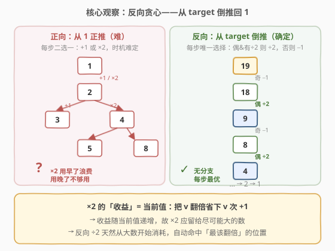
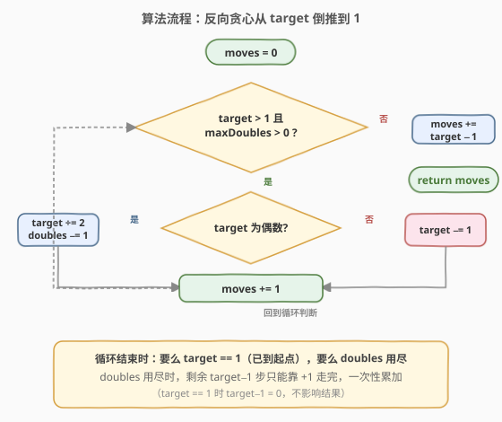
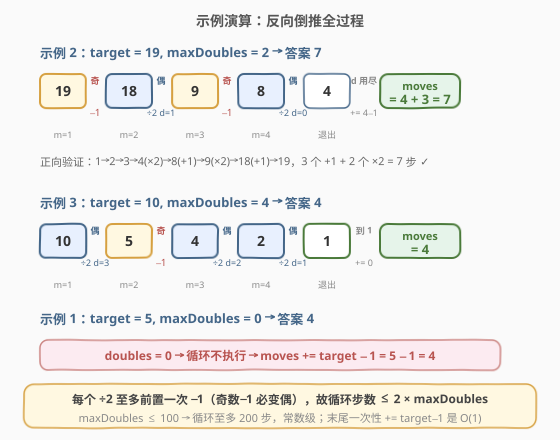

# 得到目标值的最小移动次数

- **题目名称**：得到目标值的最小移动次数
- **链接**：[2139. 得到目标值的最小移动次数](https://leetcode.cn/problems/minimum-moves-to-reach-target-score/)
- **难度**：中等
- **标签**：贪心、数学

## 1. 题目概述

你正在玩一个整数游戏。初始时数字为 $1$，给定目标整数 `target` 和整数 `maxDoubles`。在每一**步移动**中，你可以执行以下两种操作之一：

- **加一**：把当前数字加 $1$（即 $x = x + 1$）；
- **翻倍**：把当前数字乘 $2$（即 $x = x \times 2$）。

其中**翻倍操作最多使用 `maxDoubles` 次**。返回达到 `target` 所需的**最少移动次数**。

**示例 1**：

```text
输入：target = 5, maxDoubles = 0
输出：4
解释：没有翻倍机会，只能一直加一：1 → 2 → 3 → 4 → 5，共 4 步。
```

**示例 2**：

```text
输入：target = 19, maxDoubles = 2
输出：7
解释：1 → 2 → 3 → 4（×2）→ 8（+1）→ 9（×2）→ 18（+1）→ 19，共 7 步。
```

**示例 3**：

```text
输入：target = 10, maxDoubles = 4
输出：4
解释：1 → 2（×2）→ 4（×2）→ 5（+1）→ 10（×2），共 4 步。
```

**约束条件**：

- $1 \le \text{target} \le 10^9$
- $0 \le \text{maxDoubles} \le 100$

> 💡 注意两个约束的「甜区」：`target` 可达 $10^9$（排除正向 BFS/DP），而 `maxDoubles` 极小（$\le 100$）。这一上界提示——翻倍操作是**稀缺资源**，应当被精打细算地安排；而安排的关键，就在于「翻倍发生在哪个数上」。

---

## 2. 解题思路

### 2.1 暴力思路：正向 BFS

从 $1$ 出发正向搜索：每个状态记录 `(当前值, 已用翻倍次数)`，转移到 `(x+1, d)` 或 `(2x, d+1)`，用 BFS 求到 `target` 的最短步数。

但 $\text{target} \le 10^9$，状态空间巨大：仅「当前值」一维就跨越 $10^9$ 个可能取值，搜索树深度也可达 $10^9$ 级（全是 $+1$ 时）。BFS 完全不可行。

> ⚠️ 正向的困难本质上不是「状态多」，而是**每步都有两种选择且后果相互耦合**：翻倍用早了（在小数上翻倍）收益低、浪费配额；用晚了（配额耗尽后遇到大数）又没机会用。正向贪心无法在每一步局部判断「现在该不该翻倍」。

### 2.2 核心观察：反向贪心——从 target 倒推回 1



破解的关键在于**把操作反过来做**。正向两种操作的逆操作为：

| 正向操作 | 逆操作 | 说明 |
|----------|--------|------|
| $x \to x + 1$ | $x \to x - 1$ | 总可逆 |
| $x \to 2x$ | $x \to x / 2$ | **仅当 $x$ 为偶数时可逆** |

于是问题转化为：**从 `target` 出发，用「$-1$」和「$\div 2$（最多 `maxDoubles` 次）」两种逆操作，最少几步回到 $1$？**

> 💡 **为什么反向更简单？** 正向时每步二选一、时机难判；反向时，**当 `target` 为偶数且仍有翻倍配额，÷2 永远优于 −1**——因为 ÷2 一步就把数减半，而 −1 只减一。于是反向的每一步选择是**唯一确定**的，无需搜索、无需 DP。

**贪心准则**：

- 若 `target` 为偶数 **且** `maxDoubles > 0`：执行 $\div 2$，配额 $-1$；
- 否则（奇数，或配额已耗尽）：执行 $-1$；
- 直到 `target == 1` 或配额耗尽，剩余步数全是 $+1$（逆操作 $-1$）一次性累加。

**为什么翻倍要留给大数？**

翻倍的「收益」定义为「相对全用 $+1$ 节省的步数」：把 $v$ 翻倍到 $2v$ 只需 $1$ 步，而全用 $+1$ 需要 $v$ 步，故**省下 $v - 1$ 步**。收益随 $v$ **线性递增**——$v$ 越大，翻倍越划算。

- 在 $1$ 上翻倍：$1 \to 2$，省 $0$ 步（与 $+1$ 完全等价）；
- 在 $9$ 上翻倍：$9 \to 18$，省 $8$ 步。

正向贪心难以判断「何时翻倍」，正是因为要从众多小步中挑出大数翻倍的时机；而**反向 ÷2 天然从最大的数开始消耗配额**——倒推链上的 ÷2 操作，逆着看回去正是「在最该翻倍的大数上翻倍」。这就把「正向难判的时机选择」转化为「反向机械的偶数判定」。

> 💡 **一句话总结**：翻倍是稀缺资源（$\le 100$ 次），收益与被翻倍数成正比；反向 ÷2 自动把配额花在最大的数上，每步唯一确定，故贪心最优。

### 2.3 算法流程图



流程要点：

1. 初始化 `moves = 0`；
2. 循环：只要 `target > 1` 且 `maxDoubles > 0`：
   - `target` 为偶数 → `target ÷= 2`，`maxDoubles -= 1`；
   - 否则 → `target -= 1`；
   - `moves += 1`；
3. 循环结束后，`moves += target - 1`（配额耗尽时剩余的全是 $+1$ 步；若 `target == 1` 则加 $0$，不影响结果）。

> 💡 第 3 步是关键的**加速**：配额一旦用尽，剩下的 `target − 1` 步只能靠 $+1$ 走完，无需逐步步进，一次性累加即可，把最坏 $10^9$ 次循环压成 $O(1)$ 算术。

### 2.4 示例演算



以**示例 2** `target = 19, maxDoubles = 2` 为例，完整倒推链：

| 步骤 | target | doubles | 奇偶 | 操作 | moves |
|------|--------|---------|------|------|-------|
| 初始 | 19 | 2 | 奇 | — | 0 |
| 1 | 18 | 2 | 奇 | $-1$ | 1 |
| 2 | 9 | 1 | 偶 | $\div 2$（d: 2→1） | 2 |
| 3 | 8 | 1 | 奇 | $-1$ | 3 |
| 4 | 4 | 0 | 偶 | $\div 2$（d: 1→0） | 4 |
| 退出 | — | 0 | — | $+= 4 - 1 = 3$ | **7** |

- 第 1 步：`19` 奇数，只能 $-1 \to 18$；
- 第 2 步：`18` 偶数且有配额，$\div 2 \to 9$，配额 $2 \to 1$；
- 第 3 步：`9` 奇数，$-1 \to 8$；
- 第 4 步：`8` 偶数且有配额，$\div 2 \to 4$，配额 $1 \to 0$；
- 配额耗尽，剩余 `4 − 1 = 3` 步全是 $+1$，一次性累加 → 总移动数 $4 + 3 = 7$。

正向验证：$1 \xrightarrow{+1} 2 \xrightarrow{+1} 3 \xrightarrow{+1} 4 \xrightarrow{\times 2} 8 \xrightarrow{+1} 9 \xrightarrow{\times 2} 18 \xrightarrow{+1} 19$，$3$ 个 $+1$ 加 $2$ 个 $\times 2$ = $7$ 步，与反向结果一致 ✓。

> ⚠️ 注意第 2、4 步的 ÷2 逆着看回去，分别对应正向在 $9 \to 18$ 和 $4 \to 8$ 处翻倍——这两个数是整条正向链上**最大的可翻倍位置**，恰好印证「翻倍留给大数」。

再看**示例 3** `target = 10, maxDoubles = 4`：

- $10$（偶）$\div 2 \to 5$（d=3, m=1）；
- $5$（奇）$-1 \to 4$（m=2）；
- $4$（偶）$\div 2 \to 2$（d=2, m=3）；
- $2$（偶）$\div 2 \to 1$（d=1, m=4）；
- `target == 1`，循环结束，`moves += 1 - 1 = 0` → 总移动数 $4$。

正向验证：$1 \xrightarrow{\times 2} 2 \xrightarrow{\times 2} 4 \xrightarrow{+1} 5 \xrightarrow{\times 2} 10$，$1$ 个 $+1$ 加 $3$ 个 $\times 2$ = $4$ 步 ✓。（配额用了 $3$ 次，剩 $1$ 次未用——因为已到目标，多余的配额无意义。）

**示例 1** `target = 5, maxDoubles = 0`：配额为 $0$，循环不执行，`moves += 5 - 1 = 4`，直接返回 $4$。

---

## 3. 参考代码

### C++

```cpp
class Solution {
public:
    int minMoves(int target, int maxDoubles) {
        int moves = 0;
        while (target > 1 && maxDoubles > 0) {
            if (target % 2 == 0) {
                target /= 2;
                maxDoubles--;
            } else {
                target--;
            }
            moves++;
        }
        moves += target - 1; // 配额耗尽后剩余全靠 +1
        return moves;
    }
};
```

### Python

```python
class Solution:
    def minMoves(self, target: int, maxDoubles: int) -> int:
        moves = 0
        while target > 1 and maxDoubles > 0:
            if target % 2 == 0:
                target //= 2
                maxDoubles -= 1
            else:
                target -= 1
            moves += 1
        moves += target - 1  # 配额耗尽后剩余全靠 +1
        return moves
```

> 💡 两处细节：① 循环条件同时检查 `target > 1` 与 `maxDoubles > 0`，任一不满足即退出——前者表示已到起点，后者表示配额耗尽；② 末尾 `moves += target - 1` 把「配额耗尽后纯加一」的段一次性累加，避免 $10^9$ 次循环。这是把最坏时间从 $O(\text{target})$ 压到 $O(\text{maxDoubles})$ 的关键。

---

## 4. 复杂度分析

| 维度 | 复杂度 | 说明 |
|------|--------|------|
| **时间复杂度** | $O(\text{maxDoubles})$ | 每次循环要么 $\div 2$（至多 `maxDoubles` 次），要么 $-1$；$-1$ 后必变偶、下一步必 $\div 2$，故 $-1$ 次数 $\le$ $\div 2$ 次数 $+ 1$，总循环步数 $\le 2 \times \text{maxDoubles} + 1$ |
| **空间复杂度** | $O(1)$ | 仅用常数个整型变量 |

> 💡 由于 $\text{maxDoubles} \le 100$，循环至多约 $200$ 步，常数级。末尾的 `target − 1` 是一次 $O(1)$ 算术运算，不是逐步步进。即便 $\text{target} = 10^9$、$\text{maxDoubles} = 0$，算法也只做一次减法即返回——这正是末尾一次性累加的威力。

> ⚠️ 若不加末尾累加、纯靠循环 $-1$ 走完，最坏情况（$\text{maxDoubles} = 0$）需 $10^9$ 次循环，必然超时。末尾累加是**必须**的优化，不是锦上添花。

---

## 5. 扩展：与 991. 坏了的计算器 的同构关系

本题与 [991. 坏了的计算器](../0901-1000/991_坏了的计算器.md) 是**同一道题的两种表述**：

| 维度 | 2139（本题） | 991（坏了的计算器） |
|------|--------------|---------------------|
| 起点 | $1$ | $X$（任意） |
| 终点 | `target` | $Y$ |
| 正向操作 | $+1$、$\times 2$ | $\times 2$、$-1$ |
| 翻倍限制 | 最多 `maxDoubles` 次 | **无限制** |
| 最优策略 | 反向：偶数且有余量则 $\div 2$，否则 $-1$ | 反向：$Y > X$ 时偶数 $\div 2$、奇数 $+1$；$Y \le X$ 时只能 $+1$ 到 $X$ |

两题的**核心技巧完全一致**——正向操作含 $\times 2$ 时，正向贪心难判时机，转而**反向**让 $\div 2$ 在偶数处自然发生，从而把「何时翻倍」的决策交给「偶数判定」自动完成。

差异仅在于：991 的翻倍无配额限制，故反向时只要 $Y > X$ 就持续 $\div 2$ / $+1$ 直到 $Y \le X$；本题翻倍有 `maxDoubles` 上界，反向 $\div 2$ 还需检查配额是否用尽。理解了 991，本题只是「带配额的 991」。

> 💡 **方法论**：凡正向操作含「乘法/翻倍」且难判时机的题，优先尝试**反向贪心**——把乘法逆成除法，让「能否整除」成为天然的选择判据。这一范式还见于 [2193. 得到回文串的最少操作次数](https://leetcode.cn/problems/minimum-number-of-moves-to-make-palindrome/)（反向匹配）等题。

---

## 6. 面试要点

1. **为什么反向贪心是正确的？**

   - 翻倍的收益 $= v - 1$（省下的 $+1$ 步数），随被翻倍数 $v$ 线性递增。故最优解一定把翻倍配额用在**尽可能大的数**上。反向倒推时，$\div 2$ 发生在倒推链当前的最大数上（因为是从 `target` 往小走），逆着看回去恰是「正向最大的可翻倍位置」。用交换论证：若某最优正向解未在最大偶数处翻倍，可把一次翻倍「后移」到该处而不增加步数，故总存在「翻倍全打在大数上」的最优解，与反向贪心的输出一致。

2. **`maxDoubles = 0` 时为什么不会超时？**

   - 循环条件含 `maxDoubles > 0`，配额为 $0$ 时循环根本不进入，直接执行末尾 `moves += target - 1` 的一次 $O(1)$ 减法。最坏 $\text{target} = 10^9$ 也只做一次算术，常数时间。若漏掉这个提前退出/末尾累加，纯循环 $-1$ 会超时。

3. **为什么 $-1$ 的次数不会很多？**

   - $-1$ 只在 `target` 为奇数时发生，而**奇数 $-1$ 后必变偶数**，下一步（若有配额）必然 $\div 2$。所以 $-1$ 与 $\div 2$ 严格交替，$-1$ 次数 $\le \div 2$ 次数 $+ 1 \le \text{maxDoubles} + 1$。总循环步数 $\le 2 \times \text{maxDoubles} + 1 \le 201$。

4. **能否正向贪心？难点在哪？**

   - 难。正向每步面对「现在加一还是翻倍」的二选一，且翻倍配额是全局稀缺资源，局部无法判断「此刻翻倍是否最优」。例如 `target = 19, maxDoubles = 2`：正向走到 $4$ 时该翻倍还是继续加？走到 $9$ 才发现该翻倍——但 $9$ 怎么来的？这种「后效性」使正向贪心失效。反向消除了后效性：偶数 ÷2 永远不劣于 −1。

5. **和 [991. 坏了的计算器](../0901-1000/991_坏了的计算器.md) 的关系？**

   - 同构题。991 是「起点任意、翻倍无配额」的版本，本题是「起点固定为 1、翻倍有配额」的版本。两者都用反向贪心，差异仅在于本题反向 $\div 2$ 需额外检查配额。掌握了任一题的思路，另一题即可秒杀。

> 💡 **一句话总结**：2139 是「**反向贪心**」的招牌题——翻倍收益与被翻倍数成正比，正向难判时机，反向 ÷2 自动把配额花在大数上，每步唯一确定；末尾一次性累加把 $O(\text{target})$ 压成 $O(\text{maxDoubles})$。

---

## 7. 同类练习题

- [991. 坏了的计算器](https://leetcode.cn/problems/broken-calculator/)（[站内题解](../0901-1000/991_坏了的计算器.md)）：与本题**完全同构**，正向 $\times 2$ / $-1$、反向 $\div 2$ / $+1$，无翻倍配额限制，是本题的「无配额母题」
- [55. 跳跃游戏](https://leetcode.cn/problems/jump-game/)（[站内题解](../0001-0100/55_跳跃游戏.md)）：同样采用**反向贪心**——从终点回推起点，每步维护「最远可达位置」，与本题「从 target 回推 1」思路同源
- [134. 加油站](https://leetcode.cn/problems/gas-station/)（[站内题解](../0101-0200/134_加油站.md)）：贪心经典，利用「总盈余 ≥ 0 则必存在起点」的全局性质化简局部判定，与本题「翻倍收益全局单调」的贪心论证同为「先证全局性质再定局部策略」范式
- [45. 跳跃游戏 II](https://leetcode.cn/problems/jump-game-ii/)（[站内题解](../0001-0100/45_跳跃游戏II.md)）：正向贪心 + 维护当前跳跃边界，对照 55 的反向贪心，体会「正反双向贪心」的取舍
- [2178. 拆分成最多质数的正偶数之和](https://leetcode.cn/problems/maximum-split-of-positive-even-integers/)：贪心 + 数学，从大数贪心拆分，与本题「把稀缺操作留给大数」的贪心直觉相通
