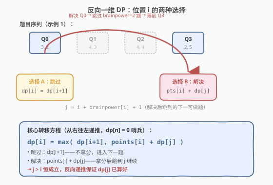
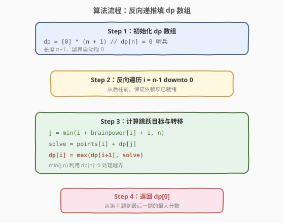
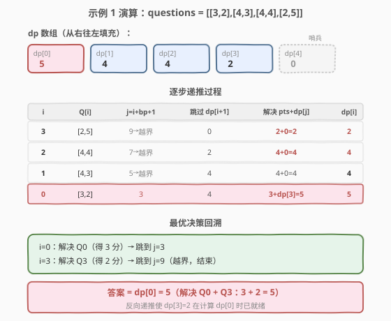

# LeetCode 解决智力问题 题解

## 1. 题目概述

- **标题 / 题号**：解决智力问题（#2140，medium）
- **链接**：https://leetcode.cn/problems/solving-questions-with-brainpower/
- **难度**：中等
- **标签**：数组、动态规划

**题意**：给定一个下标从 **0** 开始的二维整数数组 `questions`，其中 `questions[i] = [points_i, brainpower_i]`，表示第 `i` 道题的**得分**和**脑力消耗**。

你必须**按顺序**从第 0 题开始逐一处理每道题，对每道题做出选择：

- **解决**第 `i` 题：获得 `points_i` 分，但必须**跳过**接下来的 `brainpower_i` 道题（即不能解决这些题）；
- **跳过**第 `i` 题：直接进入第 `i+1` 题，不获得分数。

返回你能获得的**最大分数**。

**示例 1**：

```text
输入：questions = [[3,2],[4,3],[4,4],[2,5]]
输出：5
解释：解决第 0 题和第 3 题。
  解决 Q0：得 3 分，跳过接下来 2 题（Q1、Q2）
  解决 Q3：得 2 分
  总计：3 + 2 = 5
```

**示例 2**：

```text
输入：questions = [[1,1],[2,2],[3,3],[4,4],[5,5]]
输出：7
解释：解决第 1 题和第 4 题。
  解决 Q1：得 2 分，跳过接下来 2 题（Q2、Q3）
  解决 Q4：得 5 分
  总计：2 + 5 = 7
```

**约束**：

- $1 \le \text{questions.length} \le 10^5$
- $\text{questions[i].length} == 2$
- $1 \le \text{points}_i \le 10^5$
- $0 \le \text{brainpower}_i \le 10^5$

> 💡 **审题关键**：① 必须按顺序处理，不可回看；② 解决一道题的"代价"是跳过后续若干题——跳过数量 `brainpower_i` **因题而异**，这是与打家劫舍（固定跳过 1 题）的核心区别；③ `brainpower_i` 可为 0（解决后不跳过任何题，直接进入下一题）。

## 2. 解题思路

### 2.1 暴力思路：枚举所有选/不选组合

对每道题有"解决"或"跳过"两种选择，朴素地枚举所有 $2^n$ 种组合，对每种组合模拟"解决后跳过"的约束并累计得分，取最大值。

- **正确性**：覆盖所有可能，显然正确。
- **效率**：$2^n$ 种组合，$n = 10^5$ 时完全不可行。

> ⚠️ 暴力的浪费在于：从位置 `i` 出发的最优收益与"前面怎么选的"无关——前面的选择只决定**当前到了哪一题**，一旦确定当前在 `i`，后续最优解就是固定的。这正是**最优子结构**，可用 DP 把 $2^n$ 压缩到 $O(n)$。

### 2.2 核心观察：反向一维 DP



定义 `dp[i]` = **从第 `i` 题到最后一题能获得的最大分数**。

在位置 `i` 有两种选择：

**选择 A — 跳过第 `i` 题**：不拿分，直接进入 `i+1`，后续收益为 `dp[i+1]`：

$$\text{skip} = \text{dp}[i+1]$$

**选择 B — 解决第 `i` 题**：获得 `points[i]` 分，然后跳过 `brainpower[i]` 道题，落到第 $j = i + \text{brainpower}[i] + 1$ 题，后续收益为 `dp[j]`（若 $j \ge n$ 则为 0）：

$$\text{solve} = \text{points}[i] + \text{dp}[j], \quad j = i + \text{brainpower}[i] + 1$$

取两者较大值：

$$\boxed{\text{dp}[i] = \max\big(\text{dp}[i+1],\;\; \text{points}[i] + \text{dp}[j]\big), \quad j = i + \text{brainpower}[i] + 1}$$

**为什么必须反向递推（从 $n-1$ 到 $0$）？** 因为 `dp[i]` 依赖 `dp[i+1]` 和 `dp[j]`，而 $j > i$ 恒成立（`brainpower[i] >= 0` 蕴含 $j \ge i+1$）。反向递推保证计算 `dp[i]` 时 `dp[i+1]` 与 `dp[j]` 都已就绪。

> 💡 **与打家劫舍的对比**：[198. 打家劫舍](../0101-0200/198_打家劫舍.md) 是 `dp[i] = max(dp[i-1], nums[i] + dp[i-2])`——跳过距离固定为 1。本题把"固定跳 1"推广为"跳 `brainpower[i]`"，但转移结构完全一致：**在当前位置做"取/舍"二选一，取舍后跳到一个更远的位置继续**。这类"带跳跃的选/不选 DP"是线性 DP 的核心子族。

### 2.3 算法流程图



**完整步骤**：

1. **初始化**：创建长度为 $n+1$ 的 `dp` 数组，全部置 0。`dp[n] = 0` 作为哨兵（超出最后一题时收益为 0）。
2. **反向递推**：`for i = n-1 downto 0`：
   - 计算跳跃目标 $j = i + \text{brainpower}[i] + 1$；
   - 若 $j \ge n$，则 `dp[j]` 取 0（用 `min(j, n)` 索引到哨兵 `dp[n] = 0`）；
   - `dp[i] = max(dp[i+1], points[i] + dp[min(j, n)])`。
3. **返回 `dp[0]`**：从第 0 题到最后一题的最大分数。

> ⚠️ **越界处理**：$j = i + \text{brainpower}[i] + 1$ 可能远大于 $n$。两种处理方式：① 条件判断 `j < n ? dp[j] : 0`；② 用 `min(j, n)` 直接索引（因 `dp[n] = 0`）。推荐 `min(j, n)` 写法，代码更简洁。

### 2.4 示例演算

以示例 1（`questions = [[3,2],[4,3],[4,4],[2,5]]`）逐步演算：



**初始化**：`dp = [0, 0, 0, 0, 0]`（长度 5，`dp[4] = 0` 为哨兵）

| $i$ | questions[i] | $j$ = i+bp+1 | 跳过 dp[i+1] | 解决 points[i]+dp[j] | dp[i] | 说明 |
|-----|-------------|-------------|-------------|---------------------|-------|------|
| 3 | [2,5] | 9 → 越界(0) | dp[4]=0 | 2+0=**2** | **2** | 解决更优 |
| 2 | [4,4] | 7 → 越界(0) | dp[3]=2 | 4+0=**4** | **4** | 解决更优 |
| 1 | [4,3] | 5 → 越界(0) | dp[2]=4 | 4+0=**4** | **4** | 两者相等 |
| 0 | [3,2] | 3 | dp[1]=4 | 3+dp[3]=3+2=**5** | **5** | 解决更优 |

**答案 = `dp[0]` = 5** ✓（解决 Q0 和 Q3）

> 💡 **关键决策在 $i=0$**：跳过 Q0 能从 Q1 起拿 4 分；解决 Q0 拿 3 分后跳到 Q3，再从 Q3 拿 2 分，共 5 分。`dp[3]=2` 在计算 `dp[0]` 时已被算好——这正是反向递推的价值。

## 3. 参考代码

### C++

```cpp
class Solution {
public:
    long long mostPoints(vector<vector<int>>& questions) {
        int n = questions.size();
        vector<long long> dp(n + 1, 0);  // dp[n] = 0 哨兵

        for (int i = n - 1; i >= 0; --i) {
            int j = i + questions[i][1] + 1;       // 跳跃目标
            long long solve = questions[i][0] + (j < n ? dp[j] : 0);
            dp[i] = max(dp[i + 1], solve);
        }
        return dp[0];
    }
};
```

### Python

```python
class Solution:
    def mostPoints(self, questions: List[List[int]]) -> int:
        n = len(questions)
        dp = [0] * (n + 1)  # dp[n] = 0 哨兵

        for i in range(n - 1, -1, -1):
            j = i + questions[i][1] + 1           # 跳跃目标
            solve = questions[i][0] + (dp[j] if j < n else 0)
            dp[i] = max(dp[i + 1], solve)

        return dp[0]
```

> 💡 **代码要点**：① `dp` 长度为 $n+1$，`dp[n] = 0` 天然处理"跳跃越界"的边界；② 反向遍历 `i` 从 $n-1$ 到 $0$，保证 `dp[i+1]` 和 `dp[j]`（$j > i$）已就绪；③ **溢出注意**：最大分数可达 $n \times \max(\text{points}) = 10^5 \times 10^5 = 10^{10}$，超出 `int` 范围（$\approx 2.1 \times 10^9$），C++ 必须用 `long long`，Python 无此问题。

> ⚠️ **用 `min(j, n)` 简化越界判断**：因 `dp[n] = 0`，`j` 越界时 `dp[min(j, n)] = dp[n] = 0`，可省去条件判断：
> ```cpp
> int j = min(i + questions[i][1] + 1, n);
> dp[i] = max(dp[i + 1], (long long)questions[i][0] + dp[j]);
> ```
> 两种写法等价，`min` 版更简洁但需注意 `questions[i][0]` 转 `long long` 后再加 `dp[j]`。

## 4. 复杂度分析

| 维度 | 复杂度 | 说明 |
|------|--------|------|
| 时间复杂度 | $O(n)$ | 一趟反向线性扫描，每个位置 $O(1)$ 转移 |
| 空间复杂度 | $O(n)$ | 长度为 $n+1$ 的 `dp` 数组 |

> 💡 **空间可优化但意义不大**：`dp[i]` 依赖 `dp[i+1]` 和 `dp[j]`（$j$ 可达 $i + \text{brainpower}[i] + 1$），最大回看距离为 $\max(\text{brainpower})$。但 $\text{brainpower}$ 也可达 $10^5$，与 $n$ 同阶，优化意义不大，优先保留完整 `dp` 数组保证可读性。

## 5. 扩展：正向 DP（前向松弛）

反向递推是本题最直观的写法。也可以换用**正向松弛**视角：定义 `dp[i]` = 处理到第 `i` 题时（含之前所有决策）能获得的最大分数。初始 `dp[0] = 0`（还未处理任何题），对每道题 `i`：

- **跳过**：`dp[i+1] = max(dp[i+1], dp[i])`（不解决，把收益传递下去）；
- **解决**：`j = i + brainpower[i] + 1`，`dp[j] = max(dp[j], dp[i] + points[i])`（解决后跳到 `j`，把收益推到 `j`）。

最终答案为 $\max(\text{dp}[0..n])$。

```python
class Solution:
    def mostPoints(self, questions: List[List[int]]) -> int:
        n = len(questions)
        dp = [0] * (n + 1)

        for i in range(n):
            # 跳过：把当前最大收益传给 i+1
            dp[i + 1] = max(dp[i + 1], dp[i])
            # 解决：把收益推到跳跃目标 j
            j = min(i + questions[i][1] + 1, n)
            dp[j] = max(dp[j], dp[i] + questions[i][0])

        return dp[n]
```

| 维度 | 反向递推（推荐） | 正向松弛 |
|------|----------------|---------|
| 状态定义 | dp[i] = 从 i 到末尾的最大收益 | dp[i] = 处理到 i 时的最大收益 |
| 递推方向 | $n-1 \to 0$ | $0 \to n-1$ |
| 答案 | dp[0] | dp[n] |
| 直觉 | "从 i 出发能拿多少" | "到 i 时已拿多少" |

> 💡 两种视角等价。反向递推更贴合"从当前位置做选择"的直觉；正向松弛更接近"把决策的影响向前推"。面试中优先讲反向版（转移方程更简洁，只有一行 `max`）。

## 6. 面试要点

**Q1：为什么用反向递推而不是正向？**

> `dp[i]` 的定义是"从 `i` 到末尾的最大收益"，依赖 `dp[i+1]` 和 `dp[j]`（$j > i$）。反向递推（$n-1 \to 0$）天然保证依赖项已就绪。若用正向，需把"解决 `i`"的收益推到 `j` 处累加，逻辑稍绕。两种等价，反向更直观。

**Q2：为什么 `dp` 数组长度是 $n+1$ 而不是 $n$？**

> 多出的 `dp[n] = 0` 作为哨兵，统一处理"跳跃越界"的情况。当 $j = i + \text{brainpower}[i] + 1 \ge n$ 时，`dp[min(j, n)] = dp[n] = 0`，无需额外条件判断。这是 DP 中常见的"哨兵简化边界"技巧。

**Q3：为什么 C++ 要用 `long long` 而 Python 不用？**

> 最大分数上界为 $n \times \max(\text{points}) = 10^5 \times 10^5 = 10^{10}$，超出 32 位 `int` 的范围（$\approx 2.1 \times 10^9$）。C++ 的 `int` 会溢出，必须用 `long long`（64 位）。Python 整数任意精度，无需特殊处理。

**Q4：本题与打家劫舍的异同？**

> 同：都是"在每个位置做选/不选二选一"的线性 DP，转移结构 `dp[i] = max(跳过, 选取 + 跳到远处)`。异：打家劫舍跳过距离**固定为 1**（解决 `i` 后必须跳到 `i+2`）；本题跳过距离**因题而异**（`brainpower[i]` 各不相同），可能跳很远也可能不跳（`brainpower=0`）。打家劫舍可视为 `brainpower[i] = 1` 的特例。

**Q5：如果题目改为"可以不按顺序，自由选择解题顺序"会怎样？**

> 这退化成**带冲突的加权调度**问题——若两题的"跳过区间"重叠则不能同时选。这与区间调度/加权区间调度（WIS）相关，需按区间端点排序后 DP，复杂度 $O(n \log n)$。本题"必须按顺序"的约束反而简化了问题。

## 同类练习题

| # | 题目 | 与本题的关联 |
|---|------|-------------|
| 198 | [打家劫舍](https://leetcode.cn/problems/house-robber/) | 固定跳过 1 题的"选/不选"线性 DP，可视为本题 `brainpower[i] = 1` 的特例——对照理解固定跳跃与可变跳跃的异同 |
| 740 | [删除并获得点数](https://leetcode.cn/problems/delete-and-earn/) | 值域上的打家劫舍——选 `x` 后不能选 `x-1` 和 `x+1`，本质是"选/不选 + 跳跃"的变体 |
| 174 | [地下城游戏](https://leetcode.cn/problems/dungeon-game/) | 同样是反向网格 DP——从终点倒推到起点，体会"依赖未来状态"的反向递推思想 |
| 213 | [打家劫舍 II](https://leetcode.cn/problems/house-robber-ii/) | 环状打家劫舍，拆环为线后套用打家劫舍模板——进一步巩固"选/不选 + 跳跃"模式 |
| 2050 | [并行课程 III](https://leetcode.cn/problems/parallel-courses-iii/) | DAG 上的 DP，同样是"从当前位置出发的最优"——对比线性结构与图结构下的 DP 转移 |
