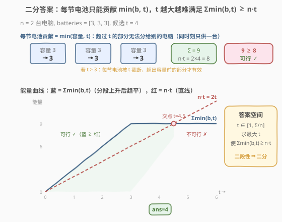
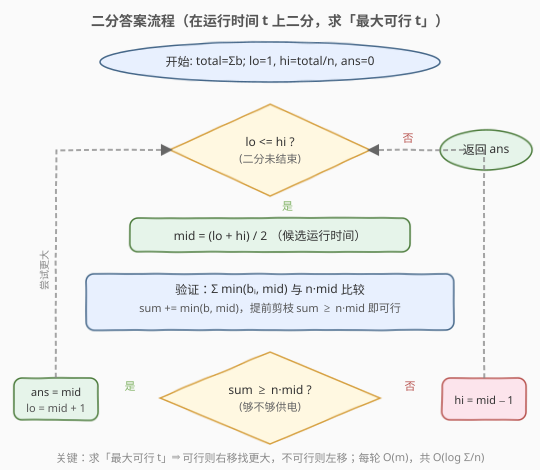

# LeetCode 同时运行 N 台电脑的最长时间 题解

## 1. 题目概述

- **标题 / 题号**：同时运行 N 台电脑的最长时间（#2141，hard）
- **链接**：https://leetcode.cn/problems/maximum-running-time-of-n-computers/
- **难度**：困难
- **标签**：数组、二分查找、贪心

**题意**：你有 `n` 台电脑，给定下标从 0 开始的整数数组 `batteries`，其中第 `i` 个电池可让一台电脑**运行** `batteries[i]` 分钟。要求使用这些电池让**全部** `n` 台电脑**同时**运行。

规则：

- 一开始每台电脑**至多**连接一个电池。
- 任意整数时刻可断开电池并换上另一个（全新或用过的均可），操作不耗时。
- 电池**不能充电**，一节电池在任意时刻只能供一台电脑。
- 最大化 `n` 台电脑**同时**运行的分钟数。

**示例 1**：

```text
输入：n = 2, batteries = [3,3,3]
输出：4
解释：电脑 0 用电池 0；电脑 1 用电池 1。2 分钟后电脑 1 换电池 2（电池 0 还剩 1 分钟）。
第 3 分钟末电脑 0 换电池 1；第 4 分钟末电池 1 耗尽。两台同时最多运行 4 分钟。
```

**示例 2**：

```text
输入：n = 2, batteries = [1,1,1,1]
输出：2
解释：电脑 0 用电池 0，电脑 1 用电池 2；1 分钟后均耗尽，分别换电池 1、电池 3；
再过 1 分钟全部耗尽。两台同时最多运行 2 分钟。
```

**约束**：

- `1 <= n <= batteries.length <= 10^5`
- `1 <= batteries[i] <= 10^9`

## 2. 解题思路

### 2.1 暴力思路

设运行时间为 $t$。最朴素的判定：「在 $t$ 分钟内，这堆电池能否同时供 $n$ 台电脑」。但电池可任意切换、可跨电脑共享时间线，直接模拟调度很复杂。

换个角度想总能量：$n$ 台电脑各运行 $t$ 分钟共需耗能 $n \cdot t$。而所有电池能提供的总能量上界为 $\sum_i \text{batteries}[i]$，故 $t \le \lfloor \sum \text{batteries}[i] / n \rfloor$。从 $t = 1$ 逐个尝试到这个上界，每个 $t$ 做一次可行性判定——但上界可达 $10^{14}$，线性枚举必然超时。

### 2.2 核心观察：二分答案



关键直觉有两层：

**① 每节电池的有效贡献是 $\min(b_i, t)$。** 一节电池同一时刻只能供一台电脑，而任何一台电脑最多运行 $t$ 分钟。因此容量超过 $t$ 的电池，多余部分被「浪费」——它无法把超出 $t$ 的能量在 $t$ 分钟内塞给其他电脑。于是判定 $t$ 是否可行化为一个纯求和条件：

$$\sum_i \min(\text{batteries}[i],\, t) \;\ge\; n \cdot t$$

> 💡 这是本题最核心的化简。把「复杂的电池切换调度」翻译成「带截断的求和不等式」，调度可行性的证明见第 5 节。

**② 该条件关于 $t$ 具有「二段性」。** 令 $f(t) = \sum_i \min(b_i, t) - n \cdot t$：

- $t = 0$ 时 $f(0) = 0$，可行；
- $t$ 很小时 $\min(b_i, t) = t$（所有电池都未触顶），$f(t) = m \cdot t - n \cdot t = (m - n)t \ge 0$（因 $m \ge n$），仍可行；
- $t$ 增大后部分电池被 $t$ 截断，$\sum \min$ 增速放缓，而 $n \cdot t$ 匀速上升，$f(t)$ 由正转负并**单调下降到底**（一旦「活跃电池数 $< n$」，$f$ 的斜率恒为负且不再回升）。

故存在分界点 $t^*$：$t \le t^*$ 可行、$t > t^*$ 不可行。这正是二分所需的二段性，且我们要找的是**最大可行 $t$**（最后一种可行值，即上界型二分）。

```text
t ≤ t* → Σmin(b,t) ≥ n·t   (够供电 ✓)
t > t* → Σmin(b,t) <  n·t   (不够 ✗)
```

> 💡 **识别信号**：求「最大化最小值/最大值」+ 能 $O(m)$ 验证候选 → 二分答案。本题与 [2064. 分配给商店的最多商品的最小值](../2001-2100/2064_分配给商店的最多商品的最小值.md) 是同一骨架的镜像：2064 求「最小化最大值」（找首个可行，可行往左），本题求「最大化可行值」（找最后可行，可行往右）。

> ⚠️ **上下界**：下界 $1$（电池容量 $\ge 1$，$t \ge 1$ 必可行）；上界 $\lfloor \sum b_i / n \rfloor$（总能量均分后的物理天花板，此时若所有 $b_i \le t$ 则恰好打平等分）。

### 2.3 算法流程图



注意方向与「最小化最大值」型相反：**可行则记录 `ans = mid` 并右移 `lo = mid + 1`**（尝试更大运行时间），不可行则左移 `hi = mid - 1`。

### 2.4 示例演算

![示例演算：n = 2, batteries = [3, 3, 3]](../images/mrtc_example_walkthrough.svg)

以 `n = 2, batteries = [3,3,3]` 为例，$\text{total} = 9$，`hi = 9 / 2 = 4`，答案区间 $[1, 4]$：

- **第 1 轮** `[1,4]`，`mid=2`，$\sum \min(3,2) \times 3 = 6 \ge 2 \cdot 2 = 4$ ✓ → 可行，记 `ans=2`，`lo=3`。
- **第 2 轮** `[3,4]`，`mid=3`，$\sum \min(3,3) \times 3 = 9 \ge 2 \cdot 3 = 6$ ✓ → 可行，记 `ans=3`，`lo=4`。
- **第 3 轮** `[4,4]`，`mid=4`，$\sum \min(3,4) \times 3 = 9 \ge 2 \cdot 4 = 8$ ✓ → 可行，记 `ans=4`，`lo=5`。
- **结束** `lo=5 > hi=4`，返回 `ans=4`。

> 💡 本例中 $t \le 3$ 时三节电池都未触顶，$\sum \min = 3t > 2t$ 恒可行；$t > 4.5$ 后 $\sum \min = 9 < 2t$ 不可行。交点在 $t = 4.5$，最大整数解即 $4$。

## 3. 参考代码

### C++

```cpp
class Solution {
  public:
    long long maxRunTime(int n, vector<int>& batteries) {
        long long total = 0;
        for (int b : batteries) total += b;

        long long lo = 1, hi = total / n, ans = 0;
        while (lo <= hi) {
            long long mid = lo + (hi - lo) / 2;
            if (canRun(batteries, n, mid)) {
                ans = mid;        // 可行，尝试更长运行时间
                lo = mid + 1;
            } else {
                hi = mid - 1;     // 不够供电，缩短时间
            }
        }
        return ans;
    }

  private:
    // 验证：n 台电脑同时运行 t 分钟是否可行
    bool canRun(const vector<int>& batteries, int n, long long t) {
        long long target = (long long)n * t;          // 总耗能
        long long sum = 0;
        for (int b : batteries) {
            sum += min((long long)b, t);              // 每节电池截断在 t
            if (sum >= target) return true;           // 提前剪枝，兼防溢出
        }
        return false;
    }
};
```

### Python

```python
class Solution:
    def maxRunTime(self, n: int, batteries: List[int]) -> int:
        total = sum(batteries)

        lo, hi = 1, total // n
        ans = 0
        while lo <= hi:
            mid = (lo + hi) // 2
            if self._can_run(batteries, n, mid):
                ans = mid          # 可行，尝试更长运行时间
                lo = mid + 1
            else:
                hi = mid - 1       # 不够供电，缩短时间
        return ans

    def _can_run(self, batteries: List[int], n: int, t: int) -> bool:
        target = n * t                       # 总耗能
        s = 0
        for b in batteries:
            s += min(b, t)                   # 每节电池截断在 t
            if s >= target:
                return True                  # 提前剪枝
        return False
```

> ⚠️ **三个易错点**：
> 1. **`min(b, t)` 的截断不可省**：这是本题相对 [2064](../2001-2100/2064_分配给商店的最多商品的最小值.md)/[875](../0801-0900/875_爱吃香蕉的珂珂.md) 的关键区别。后两者是「向上取整求和」$\lceil q/x \rceil$，本题是「向下截断求和」$\min(b, t)$——因为一节大电池**不能**把它超出的能量分给别的电脑。
> 2. **溢出**：`batteries[i]` 达 $10^9$、$m$ 达 $10^5$，`total` 可达 $10^{14}$，C++ 必须用 `long long`。`n * mid` 因 `mid ≤ total/n`，其值 $\le total \le 10^{14}$，也在 `long long` 内。`min((long long)b, t)` 中必须先把 `b` 提升为 `long long` 再与 `t` 比较，避免隐式截断。
> 3. **二分方向**：本题是「最大化可行值」（找最后一种可行），可行时 `ans = mid; lo = mid + 1`，与「最小化最大值」型（可行时 `ans = mid; hi = mid - 1`）**方向相反**，切勿套错模板。

## 4. 复杂度分析

| 维度 | 复杂度 | 说明 |
|------|--------|------|
| 时间复杂度 | $O(m \log S)$ | $m = \text{len}(\text{batteries})$，$S = \sum b_i / n \le 10^{14}$；二分 $O(\log S) \approx 47$ 次，每次验证 $O(m)$ |
| 空间复杂度 | $O(1)$ | 仅常数额外变量 |

> 💡 $m \le 10^5$、$\log S \approx 47$，总运算量约 $4.7 \times 10^6$，远低于时限。提前剪枝 `sum >= target` 在 $t$ 较小时往往几节电池就提前返回，实际更快。

## 5. 扩展：为什么 $\sum \min(b_i, t) \ge n \cdot t$ 等价于调度可行？

判定函数把「电池可任意切换」的调度问题化简为一个求和不等式，但其正确性并不显然，需要双向证明。

### 5.1 必要性（可行 ⇒ 不等式成立）

若存在调度让 $n$ 台电脑同时运行 $t$ 分钟：每节电池 $b_i$ 在整个 $[0, t]$ 区间内至多被使用 $t$ 分钟（它只能串行供电），且至多用满自身容量 $b_i$，故实际贡献 $\le \min(b_i, t)$。$n$ 台电脑总耗能 $n \cdot t$ 不能超过所有电池实际贡献之和，故 $n \cdot t \le \sum \min(b_i, t)$。

### 5.2 充分性（不等式成立 ⇒ 可行调度存在）

构造性证明（贪心匹配）：把每节电池拆成「能量片段」。因 $\sum \min(b_i, t) \ge n \cdot t$，可视为有足够多的「单位能量」需要填满 $n$ 个长度为 $t$ 的槽位（电脑×时间）。关键约束是「同一节电池不能同时供两台电脑」——即一节电池的片段不能在**同一时刻**出现在两台电脑上。

标准做法：把每节电池的有效贡献 $\min(b_i, t)$ 看作一段长为 $\min(b_i, t)$ 的能量条，按任意顺序首尾相接排成一条总长 $\sum \min(b_i, t) \ge n \cdot t$ 的长条。从前往后按长度 $t$ 切成 $n$ 段分给 $n$ 台电脑。由于每节电池的条长 $\le t$，它至多跨越一个切段边界——即至多同时出现在「上一台电脑的末尾 + 下一台电脑的开头」两个**不同时刻**，绝不落在同一时刻，满足约束。故调度必存在。

> 💡 这条「条长 ≤ $t$ ⇒ 不跨同一时刻」的论证，正是 `min(b, t)` 截断的几何意义：把电池能量压扁到 $t$ 以内，保证它不会在时间轴上自我重叠。

### 5.3 进阶：贪心「削峰」$O(m \log m)$ 解法

二分并非最快。利用排序 + 一次扫描可在 $O(m \log m)$ 求解，思路是**把最大的几节电池当作「主力」，其余当作「备用」逐级拉平**：

1. 将 `batteries` 降序排列，前 $n$ 节（最大）各对接一台电脑作为主力，记 `spare = Σ batteries[n:]`（备用电池总能量）。
2. 主力中最小的是 `b[n-1]`。从它开始逐级「拉平」：要把它升到 `b[n-2]`，只需给 1 台电脑补 `(b[n-2] - b[n-1])`；升到 `b[n-2]` 后有 2 台电脑需要补给才能升到 `b[n-3]`，需 $2 \cdot (b[n-3] - b[n-2])$；……；第 $k$ 级需 $k$ 台电脑各补差额。
3. 若某级 `spare` 不足以支付 $k \cdot \text{diff}$，则答案 = 当前级 + `spare / k`（把剩余备用均摊给这 $k$ 台）。
4. 若一路拉平到 `b[0]` 仍有余量，则全部 $n$ 台再均摊：答案 = `b[0] + spare / n`。

```python
class Solution:
    def maxRunTime(self, n: int, batteries: List[int]) -> int:
        batteries.sort(reverse=True)
        spare = sum(batteries[n:])              # 备用电池总能量
        for i in range(n - 1, 0, -1):
            k = n - i                           # 需补给 k 台升到 b[i-1]
            diff = batteries[i - 1] - batteries[i]
            need = k * diff
            if spare >= need:
                spare -= need
            else:
                return batteries[i] + spare // k
        return batteries[0] + spare // n        # 全部拉平到 b[0] 再均摊
```

以 `n=3, batteries=[10,1,1,1]` 验证：降序 `[10,1,1,1]`，前 3 节 `[10,1,1]`，`spare=1`。`i=2`：`k=1, diff=0`，`spare` 不变；`i=1`：`k=2, diff=9, need=18 > spare=1` → 返回 `batteries[1] + 1//2 = 1 + 0 = 1`。即 3 台电脑中两台只有 1 分钟能量，主力 10 被拖累，最多同时跑 1 分钟。

> 💡 本质上贪心解法就是在「显式求出二分的交点 $t^*$」：只要没有电池超 $t^*$ 太多，答案就是 $\lfloor \sum b_i / n \rfloor$；一旦某节电池独大（超出其余之和），它被截断后只能贡献 $t^*$，答案退化为「其余电池之和」。二分写法通用、不易错，贪心写法更快、更需洞察——面试先讲二分拿稳，再口头补贪心作为优化。

## 6. 面试要点

1. **为什么 `min(b, t)` 要截断？不能让大电池把多余能量分给别人吗？**

   - 一节电池任意时刻只能供一台电脑，而所有电脑都只活 $t$ 分钟。容量 $b > t$ 的电池，即使全程在线也只能供 $t$ 分钟，超出部分没有「时间窗口」去供给别的电脑——别的电脑在那 $t$ 分钟内已被自己接的电池占满。故有效贡献封顶 $\min(b, t)$。

2. **二段性体现在哪？为什么能二分？**

   - $f(t) = \sum \min(b_i, t) - n \cdot t$。$t$ 较小时所有电池未触顶，$f(t) = (m-n)t \ge 0$；$t$ 增大后电池陆续触顶，活跃电池数一旦降到 $n$ 以下，$f$ 斜率恒负且不再回升（单调下降）。故 $f$ 从 $\ge 0$ 转为 $< 0$ 只有一次跨越，即「小 $t$ 可行 / 大 $t$ 不可行」的二段性。

3. **上下界怎么取？**

   - 下界 $1$：电池容量 $\ge 1$，$t = 1$ 时 $\sum \min(b_i, 1) = m \ge n = n \cdot 1$，恒可行。上界 $\lfloor \sum b_i / n \rfloor$：$n$ 台电脑总耗能 $n \cdot t$ 不能超过总能量 $\sum b_i$，这是物理天花板。

4. **溢出风险在哪？怎么防？**

   - `total` 可达 $10^{14}$，`n * mid` 也可达 $10^{14}$，C++ `int`（$\approx 2.1 \times 10^9$）必溢出，全程用 `long long`。`min((long long)b, t)` 必须先提升 `b` 的类型。加 `if (sum >= target) return true` 提前剪枝，既加速又彻底规避累加溢出。

5. **和 [2064. 分配给商店的最多商品的最小值](../2001-2100/2064_分配给商店的最多商品的最小值.md) 有何异同？**

   - 同属二分答案家族，都有「能量/容量在候选值下被截断」的思想。差异有三：(1) 方向相反——2064 最小化最大值（可行往左），本题最大化可行值（可行往右）；(2) 截断方式不同——2064 是 $\lceil q/x \rceil$（向上取整，商品可拆到多店），本题是 $\min(b, t)$（向下截断，电池不可同时分身）；(3) 2064 下界取 `max`，本题下界取 $1$。

## 同类练习题

| # | 题目 | 与本题的关联 |
|---|------|-------------|
| 2064 | [分配给商店的最多商品的最小值](https://leetcode.cn/problems/minimized-maximum-of-products-distributed-to-any-store/) | 同骨架镜像，二分单店上限，`check` 用 $\lceil q/x \rceil$ 向上取整求和，方向相反（最小化最大值） |
| 875 | [爱吃香蕉的珂珂](https://leetcode.cn/problems/koko-eating-bananas/) | 二分吃速，`check` 向上取整求和，最小化最大值型入门题 |
| 410 | [分割数组的最大值](https://leetcode.cn/problems/split-array-largest-sum/) | 二分「最大段和」上限，`check` 贪心划段，困难级二分答案招牌 |
| 1011 | [在 D 天内送达包裹的能力](https://leetcode.cn/problems/capacity-to-ship-packages-within-d-days/) | 二分运载能力，`check` 贪心按天装货 |
| 1283 | [使结果不超过阈值的最小除数](https://leetcode.cn/problems/find-the-smallest-divisor-given-a-threshold/) | 同模板，二分除数，`check` 向上取整求和 |
