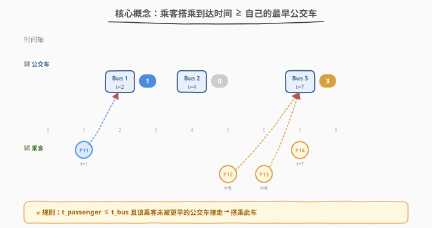
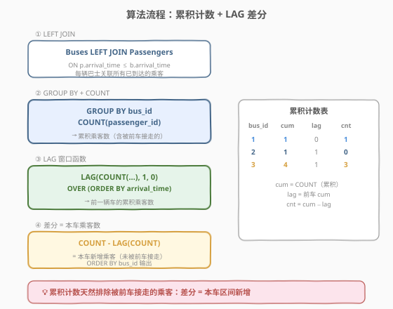
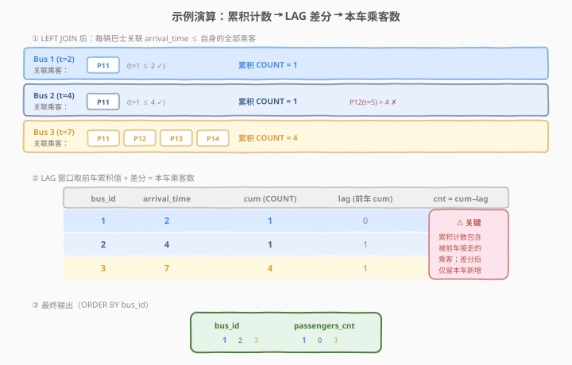

# 每辆车的乘客人数 I

- **题目名称**：每辆车的乘客人数 I
- **链接**：[2142. 每辆车的乘客人数 I](https://leetcode.cn/problems/the-number-of-passengers-in-each-bus-i/)
- **难度**：中等
- **标签**：SQL、数据库、窗口函数、`LAG`、`LEFT JOIN`、`GROUP BY`、`COUNT`、差分

## 1. 题目概述

公交车和乘客先后到达 LeetCode 站点。若一辆公交车在时间 $t_{\text{bus}}$ 到站，乘客在时间 $t_{\text{passenger}}$ 到站，且 $t_{\text{passenger}} \leq t_{\text{bus}}$，**该乘客之前没有赶上任何公交车**，则该乘客将搭乘该公交车。编写 SQL 查询每辆公交车搭载的乘客数量，按 `bus_id` **升序**排序返回。

**表结构**：

```text
Table: Buses
+--------------+------+
| Column Name  | Type |
+--------------+------+
| bus_id       | int  |
| arrival_time | int  |
+--------------+------+
bus_id 是该表的主键。
不会出现两辆公交车同时到达。

Table: Passengers
+--------------+------+
| Column Name  | Type |
+--------------+------+
| passenger_id | int  |
| arrival_time | int  |
+--------------+------+
passenger_id 是该表的主键。
```

**示例 1**：

```text
输入：
Buses 表:
+--------+--------------+
| bus_id | arrival_time |
+--------+--------------+
| 1      | 2            |
| 2      | 4            |
| 3      | 7            |
+--------+--------------+
Passengers 表:
+--------------+--------------+
| passenger_id | arrival_time |
+--------------+--------------+
| 11           | 1            |
| 12           | 5            |
| 13           | 6            |
| 14           | 7            |
+--------------+--------------+

输出：
+--------+----------------+
| bus_id | passengers_cnt |
+--------+----------------+
| 1      | 1              |
| 2      | 0              |
| 3      | 3              |
+--------+----------------+

解释：
- 11 号乘客在时间 1 到达。1 号公交车到达时间为 2，搭载 11 号乘客。
- 2 号公交车在时间 4 到达，没有乘客。
- 12 号乘客在时间 5 到达，13 号乘客在时间 6 到达，14 号乘客在时间 7 到达。
- 3 号公交车在时间 7 到达，搭载 12、13、14 号乘客。
```

**约束条件**：

- `bus_id` 是 `Buses` 表的主键，`passenger_id` 是 `Passengers` 表的主键
- 不会出现两辆公交车同时到达（`arrival_time` 在 `Buses` 表中唯一）
- 乘客一旦被某辆公交车接走，就不会再搭乘后续公交车
- 结果按 `bus_id` 升序排序

> 💡 本题是 SQL **"累积计数 + 窗口差分"招牌题**——核心难点在于「乘客只搭乘最早的可用公交车」，这导致每辆车的乘客不是简单的 `arrival_time ≤ bus.arrival_time` 计数（那样会重复计算被前车接走的乘客）。解法用 **`LEFT JOIN` + `GROUP BY` 得累积计数**，再用 **`LAG` 窗口函数取前车累积值**，两者**差分**即为本车新增乘客数。

---

## 2. 解题思路

### 2.1 暴力思路：逐乘客找最早可用公交

最直觉的过程式思路：对每个乘客，遍历所有公交车找到 `arrival_time ≥ passenger.arrival_time` 的**最早**一辆，将该乘客计入那辆车的计数。伪代码：

```text
cnt = {bus_id: 0 for bus in Buses}
for p in Passengers:
    candidates = [b for b in Buses if b.arrival_time >= p.arrival_time]
    if candidates:
        earliest = min(candidates, key=lambda b: b.arrival_time)
        cnt[earliest.bus_id] += 1
return sorted(cnt.items())
```

但**纯 SQL 没有显式逐行循环**——「每个乘客找最早公交」需换成集合式表达。有两种自然翻译：

- **正向匹配**：对每辆公交，找出「到达时间在本车及之前、但不在前一辆车及之前」的乘客——即 `prev_bus_time < passenger.arrival_time ≤ bus.arrival_time`。
- **累积差分**：对每辆公交算「到达时间 ≤ 本车」的全部乘客数（累积计数），再减去前一辆车的累积计数——差分即为新增。

> ⚠️ 暴力法的关键缺陷在于「乘客不可重复计数」——若直接 `COUNT` 所有 `arrival_time ≤ bus.arrival_time` 的乘客，Bus 3 会数到 4 个（P11、P12、P13、P14），但 P11 已被 Bus 1 接走，正确答案应为 3。**累积差分**巧妙地用前车累积值抵消了这部分重复。

### 2.2 核心观察：累积计数 + LAG 差分



**问题拆解为三个子问题**：

1. **累积计数**：对每辆公交 `b`，`LEFT JOIN Passengers p ON p.arrival_time ≤ b.arrival_time` 后 `GROUP BY bus_id` + `COUNT(passenger_id)`，得到「到达时间 ≤ 本车」的**累积**乘客数。Bus 1 的累积 = 1（P11），Bus 2 的累积 = 1（P11），Bus 3 的累积 = 4（P11、P12、P13、P14）。

2. **LAG 取前车累积**：`LAG(COUNT(passenger_id), 1, 0) OVER (ORDER BY arrival_time)` 取按到达时间排序的**前一辆车**的累积计数。首辆车的 `LAG` 默认值为 0。

3. **差分 = 本车新增**：`累积计数 − 前车累积计数` = 在「前车到达时间, 本车到达时间」区间内到达的乘客数——这些乘客未被前车接走（到达时间 > 前车），又在本车到达时已在等候（到达时间 ≤ 本车），故搭乘本车。

$$\text{passengers\_cnt}(\text{bus}_i) = \text{cum}(\text{bus}_i) - \text{cum}(\text{bus}_{i-1})$$

> 其中 $\text{cum}(\text{bus}_i) = |\{p \mid t_{\text{passenger}} \leq t_{\text{bus}_i}\}|$，$\text{cum}(\text{bus}_0) = 0$。

> 💡 **为何差分恰好等于本车乘客数？** 到达时间 $\leq t_{\text{bus}_{i-1}}$ 的乘客已被前车接走（前车更早到达且满足 $t_{\text{passenger}} \leq t_{\text{bus}_{i-1}}$），到达时间 $> t_{\text{bus}_{i-1}}$ 且 $\leq t_{\text{bus}_i}$ 的乘客在前车到达时还未出现、在本车到达时已等候——恰好搭乘本车。差分 $\text{cum}(\text{bus}_i) - \text{cum}(\text{bus}_{i-1})$ 精确对应这个区间。

> ⚠️ **`LEFT JOIN` 的必要性**：若某辆公交到达时没有任何乘客在等候（如 Bus 2），`INNER JOIN` 会丢弃该车导致结果缺行。`LEFT JOIN` 保留所有公交车，未匹配时 `passenger_id` 为 `NULL`，`COUNT(passenger_id)` 计为 0——与 1164「保留全集」模式一致。

### 2.3 算法流程图



**逻辑执行步骤**：

| 步骤 | 子句 | 作用 |
|------|------|------|
| ① | `Buses LEFT JOIN Passengers ON p.arrival_time ≤ b.arrival_time` | 每辆公交关联所有到达时间 ≤ 自身的乘客（累积关联） |
| ② | `GROUP BY bus_id` + `COUNT(passenger_id)` | 按公交分组，数累积乘客数 |
| ③ | `LAG(COUNT(...), 1, 0) OVER (ORDER BY arrival_time)` | 窗口函数取前一辆车的累积计数 |
| ④ | `COUNT − LAG(COUNT)` | 差分 = 本车新增乘客数 |
| ⑤ | `ORDER BY bus_id` | 按公交 ID 升序输出 |

> 💡 **SQL 子句执行顺序**：`FROM`（含 `JOIN`/`ON`）→ `WHERE` → `GROUP BY` → `HAVING` → `SELECT`（含窗口函数）→ `ORDER BY` → `LIMIT`。⚠️ 本题的精妙之处在于 `COUNT(passenger_id)`（聚合函数）和 `LAG(...)`（窗口函数）**同时出现在 `SELECT` 中**——聚合先于窗口求值，`LAG` 作用于**聚合后的结果集**（每辆公交一行），取前一行的累积计数。这是「窗口函数作用于聚合结果」的经典模式。

> ⚠️ **`LAG` 的 `ORDER BY` 必须用 `arrival_time` 而非 `bus_id`**：前一辆车的判定依据是**到达时间顺序**，而非公交编号顺序。虽然本题示例中 `bus_id` 恰好与 `arrival_time` 同序，但题目并未保证 `bus_id` 递增 ⟺ `arrival_time` 递增。用 `ORDER BY arrival_time` 确保 `LAG` 取到的是时间意义上的「前一辆车」。

### 2.4 示例演算

以示例 1 数据为例，观察「`LEFT JOIN` → 累积计数 → `LAG` 差分」的逐步过程：



**步骤 ①：`LEFT JOIN` + `GROUP BY` + `COUNT`（累积计数）**

| bus_id | arrival_time | 关联乘客（arrival_time ≤ bus） | 累积 COUNT |
|--------|-------------|-------------------------------|-----------|
| 1 | 2 | P11 (t=1) | **1** |
| 2 | 4 | P11 (t=1) | **1** |
| 3 | 7 | P11 (t=1), P12 (t=5), P13 (t=6), P14 (t=7) | **4** |

> 💡 注意 Bus 2 的累积计数是 1 而非 0——P11 虽已被 Bus 1 接走，但仍满足 `arrival_time ≤ 4`，故出现在 `LEFT JOIN` 结果中。这正是需要差分的原因。

**步骤 ②：`LAG` 取前车累积 + 差分**

| bus_id | arrival_time | cum (COUNT) | lag (前车 cum) | cnt = cum − lag |
|--------|-------------|-------------|---------------|-----------------|
| 1 | 2 | 1 | 0 | **1** |
| 2 | 4 | 1 | 1 | **0** |
| 3 | 7 | 4 | 1 | **3** |

> 💡 **看 Bus 2 这一行**：累积 = 1（P11 满足 `t=1 ≤ 4`），前车累积 = 1（Bus 1 的累积也是 1，因为 P11 同样满足 `t=1 ≤ 2`），差分 = 1 − 1 = **0**。P11 被 Bus 1 和 Bus 2 同时关联，但差分将他在 Bus 2 的计数抵消了——因为他在 Bus 1 的累积中已被计入。

> ⚠️ **看 Bus 3 这一行**：累积 = 4（P11、P12、P13、P14 均满足 `arrival_time ≤ 7`），前车累积 = 1（Bus 2 的累积），差分 = 4 − 1 = **3**。被抵消的正是 P11（已被 Bus 1 接走），新增的是 P12、P13、P14（到达时间在 Bus 2 到达时间 4 之后、Bus 3 到达时间 7 及之前）。

**步骤 ③：`ORDER BY bus_id` 输出**

| bus_id | passengers_cnt |
|--------|----------------|
| 1 | 1 |
| 2 | 0 |
| 3 | 3 |

---

## 3. 参考代码

### SQL（解法 A：累积计数 + LAG 差分，推荐）

```sql
SELECT
    bus_id,
    COUNT(passenger_id) - LAG(COUNT(passenger_id), 1, 0) OVER (
        ORDER BY b.arrival_time
    ) AS passengers_cnt
FROM
    Buses AS b
    LEFT JOIN Passengers AS p ON p.arrival_time <= b.arrival_time
GROUP BY 1
ORDER BY 1;
```

> 💡 **写法要点**：
> - **`LEFT JOIN Passengers ON p.arrival_time ≤ b.arrival_time`**：每辆公交关联所有到达时间不超过自己的乘客。`LEFT JOIN` 保留无乘客的公交（如 Bus 2），未匹配时 `passenger_id` 为 `NULL`。
> - **`GROUP BY 1`**：按 `bus_id` 分组（`1` 引用 `SELECT` 第一列）。每组 `COUNT(passenger_id)` 数非空 `passenger_id` 行数，即累积乘客数。⚠️ 用 `COUNT(passenger_id)` 而非 `COUNT(*)`——`LEFT JOIN` 未匹配行 `passenger_id` 为 `NULL`，`COUNT(passenger_id)` 正确计 0，而 `COUNT(*)` 会把 NULL 行也数成 1。
> - **`LAG(COUNT(passenger_id), 1, 0) OVER (ORDER BY arrival_time)`**：取按到达时间排序的前一行的累积计数，首行默认 0。`LAG` 作用于 `GROUP BY` 后的聚合结果（每辆公交一行）。
> - **`COUNT − LAG(COUNT)`**：差分 = 本车新增乘客数。
> - **`ORDER BY 1`**：按 `bus_id` 升序输出。
> - ✓ **最推荐**：一行表达式同时完成累积与差分，紧凑高效。

### SQL（解法 B：LAG 取前车到达时间 + 区间计数）

```sql
WITH bus_windows AS (
    SELECT
        bus_id,
        arrival_time,
        LAG(arrival_time) OVER (ORDER BY arrival_time) AS prev_arrival
    FROM Buses
)
SELECT
    b.bus_id,
    COUNT(p.passenger_id) AS passengers_cnt
FROM bus_windows b
LEFT JOIN Passengers p
    ON p.arrival_time <= b.arrival_time
    AND (b.prev_arrival IS NULL OR p.arrival_time > b.prev_arrival)
GROUP BY b.bus_id
ORDER BY b.bus_id;
```

> 💡 **写法要点**：先用 `CTE` + `LAG(arrival_time)` 为每辆公交算出前一辆车的到达时间 `prev_arrival`，再 `LEFT JOIN Passengers` 时加区间条件 `p.arrival_time ≤ b.arrival_time AND p.arrival_time > b.prev_arrival`——直接只关联「前车到达之后、本车到达及之前」的乘客。
>
> **与解法 A 的区别**：解法 A 先累积再差分（减法消除重复）；解法 B 在 `JOIN` 条件中直接排除前车区间（不等式过滤）。解法 B 逻辑更显式——「本车乘客 = 前车到达时间 < 乘客到达时间 ≤ 本车到达时间」，但需要 `CTE` 两步写。⚠️ 首辆车 `prev_arrival` 为 `NULL`，用 `IS NULL OR ...` 处理：首辆车包含所有 `arrival_time ≤ 首车到达时间` 的乘客。

### SQL（解法 C：NOT EXISTS 排除被前车接走的乘客）

```sql
SELECT
    b.bus_id,
    COUNT(p.passenger_id) AS passengers_cnt
FROM
    Buses AS b
    LEFT JOIN Passengers AS p
        ON p.arrival_time <= b.arrival_time
        AND NOT EXISTS (
            SELECT 1 FROM Buses b2
            WHERE b2.arrival_time < b.arrival_time
              AND b2.arrival_time >= p.arrival_time
        )
GROUP BY b.bus_id
ORDER BY b.bus_id;
```

> 💡 **写法要点**：`NOT EXISTS` 子查询判断「是否存在比本车更早到达、且到达时间 ≥ 乘客到达时间的公交」——若存在，则该乘客已被那辆更早的公交接走，排除。`LEFT JOIN` 条件同时要求 `p.arrival_time ≤ b.arrival_time`（乘客在本车到达时已等候）且 `NOT EXISTS`（没有更早的车可接走该乘客）。
>
> **与解法 A/B 的区别**：解法 C 用**相关子查询**逐乘客判定「是否被前车接走」，逻辑最直觉但性能最差——对每行 `JOIN` 结果执行一次子查询。数据量大时解法 A/B 更优。

### Python（pandas）

```python
import pandas as pd

def count_passengers(buses: pd.DataFrame, passengers: pd.DataFrame) -> pd.DataFrame:
    buses_sorted = buses.sort_values('arrival_time')
    buses_sorted['prev_arrival'] = buses_sorted['arrival_time'].shift()
    result = []
    for _, bus in buses_sorted.iterrows():
        if pd.isna(bus['prev_arrival']):
            mask = passengers['arrival_time'] <= bus['arrival_time']
        else:
            mask = (passengers['arrival_time'] > bus['prev_arrival']) & \
                   (passengers['arrival_time'] <= bus['arrival_time'])
        result.append({
            'bus_id': bus['bus_id'],
            'passengers_cnt': int(mask.sum())
        })
    return pd.DataFrame(result).sort_values('bus_id')[['bus_id', 'passengers_cnt']]
```

> 💡 **pandas 对照**：
> - `buses.sort_values('arrival_time')` + `.shift()` 对应 SQL 的 `LAG(arrival_time) OVER (ORDER BY arrival_time)`——取前一行的到达时间。
> - `(passengers['arrival_time'] > bus['prev_arrival']) & (passengers['arrival_time'] <= bus['arrival_time'])` 对应解法 B 的区间 `JOIN` 条件。
> - `pd.isna(bus['prev_arrival'])` 对应 SQL 的 `prev_arrival IS NULL`——首辆车无前车，包含所有 `arrival_time ≤ 首车` 的乘客。
> - `.sort_values('bus_id')` 对应 `ORDER BY bus_id`。

---

## 4. 复杂度分析

| 维度 | 解法 A（累积 + LAG 差分） | 解法 B（LAG + 区间 JOIN） | 解法 C（NOT EXISTS） |
|------|--------------------------|--------------------------|----------------------|
| **时间** | $O(n \times m)$ | $O(n \times m)$ | $O(n \times m \times n)$ |
| **空间** | $O(n)$ | $O(n)$ | $O(n)$ |
| **扫描次数** | 1 次 JOIN + 1 次排序 | 1 次 CTE + 1 次 JOIN | 1 次 JOIN + $n \times m$ 次子查询 |
| **推荐度** | ✓ **首选**，紧凑高效 | ✓ 备选，逻辑显式 | ✓ 备选，直觉清晰 |

> - $n$ = `Buses` 表行数，$m$ = `Passengers` 表行数
> - **解法 A**：`LEFT JOIN` 产生 $O(n \times m)$ 行（最坏每辆公交关联全部乘客），`GROUP BY` 聚合 $O(n \times m)$，`LAG` 排序 $O(n \log n)$。实际中 `arrival_time` 有序时 `JOIN` 可走索引，接近 $O(n + m)$。
> - **解法 B**：`CTE` 的 `LAG` 排序 $O(n \log n)$，`LEFT JOIN` 带区间条件产生 $O(m)$ 行（每个乘客最多匹配一辆公交），聚合 $O(m)$。**理论上最优**——区间条件使 `JOIN` 结果远小于解法 A 的全累积关联。
> - **解法 C**：`NOT EXISTS` 相关子查询对每行 `JOIN` 结果执行一次 $O(n)$ 扫描，最坏 $O(n \times m \times n)$。数据量大时性能最差。
> - **索引优化**：在 `Passengers(arrival_time)` 上建索引可加速 `JOIN` 的范围扫描；在 `Buses(arrival_time)` 上建索引可让 `LAG` 的 `ORDER BY` 走索引有序扫描。

---

## 5. 扩展：差分思想与累积前缀和

### 5.1 从 SQL 差分到前缀和逆运算

本题的「累积计数 − 前车累积 = 本车增量」本质是**前缀和的差分逆运算**——与数组题中的「前缀和数组 `P[i]`，区间和 `P[r] − P[l−1]`」同构：

| 概念 | 数组前缀和 | 本题累积计数 |
|------|-----------|-------------|
| 累积结构 | `P[i] = a[1] + a[2] + ... + a[i]` | `cum(bus_i) = |{p : t_p ≤ t_{bus_i}}|` |
| 区间查询 | `sum(l, r) = P[r] − P[l−1]` | `cnt(bus_i) = cum(bus_i) − cum(bus_{i−1})` |
| 单点增量 | `a[i] = P[i] − P[i−1]` | `cnt(bus_i) = cum(bus_i) − lag` |

> 💡 本题可视为「将公交车到达时间作为分界点，对乘客到达时间做区间计数」——每辆公交负责 `(前车到达时间, 本车到达时间]` 区间内的乘客。累积计数是前缀和，`LAG` 差分是逆运算还原单区间计数。

### 5.2 窗口函数作用于聚合结果

本题的 `LAG(COUNT(passenger_id))` 是一个容易被忽略的高级用法——**窗口函数作用于聚合后的结果集**。执行顺序：

1. `FROM ... LEFT JOIN ...` → 产生关联行集
2. `GROUP BY bus_id` → 折叠成每辆公交一行
3. `COUNT(passenger_id)` → 对每组求聚合值（累积计数）
4. `LAG(COUNT(passenger_id)) OVER (ORDER BY arrival_time)` → 对聚合后的 $n$ 行结果取前一行

```sql
-- 通用模式：窗口函数作用于聚合结果
SELECT
    key,
    AGG_FUNC(col) AS agg_val,
    LAG(AGG_FUNC(col), 1, 0) OVER (ORDER BY sort_key) AS prev_agg,
    AGG_FUNC(col) - LAG(AGG_FUNC(col), 1, 0) OVER (ORDER BY sort_key) AS diff
FROM table
GROUP BY key;
```

> 💡 **与「窗口函数作用于明细行」的区别**：若 `LAG` 直接作用于明细行（如 `LAG(passenger_id) OVER (...)`），它取的是上一行乘客；而 `LAG(COUNT(...))` 取的是上一组的聚合值。前者在 `GROUP BY` 前求值，后者在 `GROUP BY` 后求值——这是 SQL 窗口函数与聚合函数交互的核心知识点。

### 5.3 进阶：每辆车的乘客人数 II（题号 2153）

本题的进阶版 [2153. 每辆车的乘客人数 II](https://leetcode.cn/problems/the-number-of-passengers-in-each-bus-ii/) 增加了「乘客可在任意站点下车」的约束——乘客下车后可再次等候下一辆公交，导致同一乘客可能搭乘多辆车。此时累积差分不再适用（乘客不再「一经接走即消失」），需改为逐趟匹配 + 下车时间过滤。

---

## 6. 面试要点

1. **为什么不能直接 `COUNT(passenger_id)` 算每辆车的乘客数？**

   > 直接 `COUNT` 会把所有 `arrival_time ≤ bus.arrival_time` 的乘客都算上，但其中部分已被更早的公交接走。例如 Bus 3 直接 `COUNT` 得 4（P11、P12、P13、P14），但 P11 已被 Bus 1 接走，正确答案应为 3。必须用累积差分或区间过滤排除被前车接走的乘客。

2. **`LAG(COUNT(passenger_id))` 中 `LAG` 和 `COUNT` 的执行顺序是什么？**

   > `COUNT` 先执行——`GROUP BY bus_id` 把关联行折叠成每辆公交一行，`COUNT(passenger_id)` 对每组求累积计数。然后 `LAG` 后执行——对聚合后的 $n$ 行结果（每行一辆公交）按 `arrival_time` 排序取前一行的累积计数。简言之：`COUNT` 是聚合函数在 `GROUP BY` 时求值，`LAG` 是窗口函数在 `SELECT` 阶段对聚合结果求值。

3. **`LAG` 的 `ORDER BY` 为什么用 `arrival_time` 而非 `bus_id`？**

   > 「前一辆车」是时间意义上的——到达时间更早的公交。题目只保证 `bus_id` 是主键，未保证 `bus_id` 递增等价于 `arrival_time` 递增。若 Bus 3 的 `arrival_time` 早于 Bus 2，用 `ORDER BY bus_id` 会错误地取 Bus 2 作为 Bus 3 的「前车」。用 `ORDER BY arrival_time` 确保按时间顺序取前车。最终结果用 `ORDER BY bus_id` 输出，与 `LAG` 的排序无关。

4. **为什么用 `COUNT(passenger_id)` 而非 `COUNT(*)`？**

   > `LEFT JOIN` 未匹配行（公交到达时无乘客等候）的 `passenger_id` 为 `NULL`。`COUNT(passenger_id)` 只数非空值，正确计 0；`COUNT(*)` 会把 NULL 行也数成 1，导致无乘客的公交错误计 1。这是 `LEFT JOIN` + `COUNT` 的经典陷阱——数右表匹配行用 `COUNT(右表列)`，数总行数用 `COUNT(*)`。

5. **解法 A（累积差分）和解法 B（区间 JOIN）哪个更好？**

   > 解法 A 更紧凑——一条 `SELECT` 同时完成累积与差分，无需 `CTE`；解法 B 更显式——`JOIN` 条件直接表达「前车到达时间 < 乘客到达时间 ≤ 本车到达时间」的区间语义。性能上解法 B 理论更优——区间 `JOIN` 产生的行数远少于全累积关联（每个乘客只匹配一辆公交 vs 每辆公交关联全部已到乘客）。面试中建议先讲解法 A 展示对窗口函数的掌握，再提解法 B 说明对 `JOIN` 区间过滤的理解。

> 💡 **一句话总结**：2142 是 SQL **"累积计数 + 窗口差分"招牌题**——核心模板「`LEFT JOIN` 关联已到乘客 → `GROUP BY` + `COUNT` 算累积 → `LAG` 取前车累积 → 差分得本车新增」。最大要点：**`LAG(COUNT(...))` 是窗口函数作用于聚合结果的高级用法**，差分天然消除被前车接走的重复计数。

---

## 7. 同类练习题

- [1164. 指定日期的产品价格](https://leetcode.cn/problems/product-price-at-a-given-date/)（[站内题解](../1101-1200/1164_指定日期的产品价格.md)）：`LEFT JOIN` 保留全集 + 时间条件过滤，同属「时间序关联 + 保留缺失行」模式，对比 2142 的累积关联
- [1729. 求关注者的数量](https://leetcode.cn/problems/find-followers-count/)（[站内题解](../1701-1800/1729_求关注者的数量.md)）：`GROUP BY` + `COUNT` 最基础分组计数，对照 2142 的「`COUNT` 作用于 `LEFT JOIN` 结果 + 窗口差分」进阶
- [180. 连续出现的数字](https://leetcode.cn/problems/consecutive-numbers/)：`LAG` 窗口函数取前一行做比较，同属「`LAG` 取相邻行」家族，对比 2142 的 `LAG` 作用于聚合结果
- [197. 上升的温度](https://leetcode.cn/problems/rising-temperature/)：自连接取「前一天」数据做对比，对比 2142 用 `LAG` 窗口取「前一辆车」的现代化写法
- [2153. 每辆车的乘客人数 II](https://leetcode.cn/problems/the-number-of-passengers-in-each-bus-ii/)：本题进阶版，乘客可下车后再次搭乘，累积差分失效，需逐趟匹配 + 下车时间过滤——对照理解「一经接走即消失」约束对解法的影响
