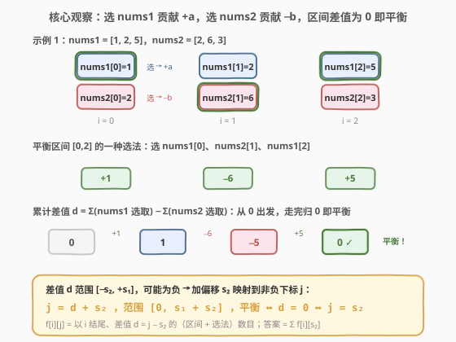

# LeetCode 在两个数组的区间中选取数字 题解

## 1. 题目概述

- **标题 / 题号**：在两个数组的区间中选取数字（#2143，hard）
- **链接**：https://leetcode.cn/problems/choose-numbers-from-two-arrays-in-range/
- **难度**：困难
- **标签**：数组、动态规划

**题意**：给定两个**下标从 0 开始**、长度为 $n$ 的整数数组 `nums1` 和 `nums2`。

如果一个区间 $[l, r]$（**包含左右端点**，$0 \le l \le r < n$）满足下列条件，则称该区间是**平衡的**：

- 对 $[l, r]$ 中的每个 $i$，你需要选取 `nums1[i]` 或 `nums2[i]` 之一；
- 从 `nums1` 中选取的数字和与从 `nums2` 中选取的数字和相等（若未从某个数组选取任何数字，则和视为 $0$）。

两个**平衡**区间 $[l_1, r_1]$ 与 $[l_2, r_2]$ 是**不同**的，当且仅当满足以下条件之一：

- $l_1 \ne l_2$；
- $r_1 \ne r_2$；
- 两个区间中存在至少一个 $i$，使得一个区间选了 `nums1[i]` 而另一个选了 `nums2[i]`（选取情况不同）。

返回**不同的平衡区间数目**。由于答案可能很大，返回答案 **模 $10^9 + 7$** 的结果。

**示例 1**：

```text
输入：nums1 = [1,2,5], nums2 = [2,6,3]
输出：3
解释：平衡的区间有：
  - [0, 1] 选 nums2[0] 和 nums1[1]：sum1 = 2 = sum2 = 2
  - [0, 2] 选 nums1[0]、nums2[1]、nums1[2]：sum1 = 1+5 = 6 = sum2 = 6
  - [0, 2] 选 nums1[0]、nums1[1]、nums2[2]：sum1 = 1+2 = 3 = sum2 = 3
注意后两个区间端点相同但选取情况不同，计为不同。
```

**示例 2**：

```text
输入：nums1 = [0,1], nums2 = [1,0]
输出：4
解释：平衡的区间有：
  - [0, 0] 选 nums1[0]：sum1 = 0 = sum2 = 0
  - [1, 1] 选 nums2[1]：sum1 = 0 = sum2 = 0
  - [0, 1] 选 nums1[0] 和 nums2[1]：sum1 = 0 = sum2 = 0
  - [0, 1] 选 nums2[0] 和 nums1[1]：sum1 = 1 = sum2 = 1
```

**约束**：

- $n = \text{nums1.length} = \text{nums2.length}$
- $1 \le n \le 100$
- $0 \le \text{nums1}[i], \text{nums2}[i] \le 100$

> 💡 **审题关键**：① 每个 $i$ 都必须二选一（不能两个都不选），但"和为 0"可以通过选值为 0 的元素实现"实质不选"的效果；② **不同的判定包含选取情况**——同一区间 $[l, r]$ 若有两种不同选法都平衡，则计为 2 个；③ $n$ 很小（$\le 100$）但值域和 $\le 20000$，暗示 DP 状态应以"差值"为维度而非以"区间"为维度。

## 2. 解题思路

### 2.1 暴力思路：枚举区间 + 枚举选法

对所有 $O(n^2)$ 个区间 $[l, r]$，每个位置有 2 种选法，共 $2^{r-l+1}$ 种选取方案，逐一检查 `sum1 == sum2`。

- **正确性**：覆盖所有可能。
- **效率**：$O(n^2 \cdot 2^n)$，$n = 100$ 时天文数字，完全不可行。

> ⚠️ 暴力的浪费在于：**"选 nums1[i] 贡献 $+a$，选 nums2[i] 贡献 $-b$"** 这一结构使得"区间是否平衡"只取决于**累计差值**是否归零，与具体选取顺序无关。若用差值作状态维度，可把指数级选法压缩到"差值频次表"——差值取值范围仅 $[-s_2, +s_1]$，规模与 $n \cdot \max(\text{value})$ 同阶。

### 2.2 核心观察：差值 DP



**第一步：定义差值。** 令 $a = \text{nums1}[i]$，$b = \text{nums2}[i]$。在位置 $i$：

- 选 `nums1[i]`：对"差值"贡献 $+a$（`sum1` 增加 $a$）；
- 选 `nums2[i]`：对"差值"贡献 $-b$（`sum2` 增加 $b$，等价于差值减少 $b$）。

其中差值 $d = \text{sum1} - \text{sum2}$。一个区间 $[l, r]$ 在某种选法下**平衡 $\iff d = 0$**。

> 💡 这与 [525. 连续数组](https://leetcode.cn/problems/contiguous-array/) 把 0 当 $-1$ 的手法同源——都是把"二选一"转成"加减差值"，把"是否平衡"转成"差值是否归零"。区别在于 525 每个位置贡献固定（$+1$ 或 $-1$），本题每个位置的 $+a$ 与 $-b$ **不对称且因位置而异**。

**第二步：偏移消除负数。** 差值 $d$ 的取值范围为 $[-s_2, +s_1]$（$s_1 = \sum \text{nums1}$，$s_2 = \sum \text{nums2}$），可能为负。给所有差值加上偏移 $s_2$，映射到非负下标 $j$：

$$j = d + s_2, \quad j \in [0,\; s_1 + s_2], \quad \text{平衡} \iff d = 0 \iff j = s_2$$

**第三步：定义 DP。** 令 $f[i][j]$ = **以第 $i$ 个位置结尾**的（区间 + 选法）数目，其中差值 $d = j - s_2$。$f[i][j]$ 有两个来源：

**来源 1 — 单独成段 $[i, i]$**：区间只含位置 $i$ 本身。

- 选 `nums1[i]`：差值 $+a$，$j = a + s_2$ → $f[i][a + s_2] \mathrel{+}= 1$；
- 选 `nums2[i]`：差值 $-b$，$j = s_2 - b$ → $f[i][s_2 - b] \mathrel{+}= 1$。

**来源 2 — 接在前段之后 $[l, i]$（$l < i$）**：把位置 $i$ 接在某个以 $i-1$ 结尾的区间后面。

- 选 `nums1[i]`（差值 $+a$）：前段差值 $j - a$ → $f[i][j] \mathrel{+}= f[i-1][j - a]$（要求 $j \ge a$）；
- 选 `nums2[i]`（差值 $-b$）：前段差值 $j + b$ → $f[i][j] \mathrel{+}= f[i-1][j + b]$（要求 $j + b \le s_1 + s_2$）。

> ⚠️ **为何只接在 $i-1$ 后就能覆盖所有 $[l, i]$？** 因为"以 $i-1$ 结尾的区间"已经递归地包含了所有 $l \le i-1$ 的起点。$f[i-1]$ 是所有以 $i-1$ 结尾区间的差值频次表，把 $i$ 接上去就得到所有以 $i$ 结尾且 $l < i$ 的区间。这是"结尾位置"维度的链式传递，与 [560. 和为K的子数组](https://leetcode.cn/problems/subarray-sum-equals-k/) 的前缀和同构。

### 2.3 算法流程图

![算法流程：f[i][j] 的两个来源与答案累积](../images/2143_algorithm_flow.svg)

**完整步骤**：

1. **预处理**：计算 $s_1 = \sum \text{nums1}$，$s_2 = \sum \text{nums2}$，偏移 $\text{offset} = s_2$，宽度 $m = s_1 + s_2 + 1$。
2. **初始化**：$f$ 为 $n \times m$ 的零表，答案 `ans = 0`。
3. **逐行递推**：`for i = 0 to n-1`，令 $a = \text{nums1}[i]$，$b = \text{nums2}[i]$：
   - **来源 1**：`f[i][a + offset] += 1`；`f[i][offset - b] += 1`；
   - **来源 2**（$i > 0$ 时）：遍历 $j \in [0, m)$，若 $j \ge a$ 则 `f[i][j] += f[i-1][j - a]`；若 $j + b \le s_1 + s_2$ 则 `f[i][j] += f[i-1][j + b]`；每步取模；
   - **累加答案**：`ans = (ans + f[i][offset]) % mod`。
4. **返回 `ans`**。

> 💡 **答案为何是 $\sum_i f[i][s_2]$？** $f[i][s_2]$ 是所有以 $i$ 结尾且差值为 0（平衡）的（区间 + 选法）数目。按结尾位置 $i$ 累加，每个平衡区间恰好在其右端点 $r$ 处被计入一次，不重不漏。

### 2.4 示例演算

以示例 2（`nums1 = [0,1]`，`nums2 = [1,0]`）演算，$s_1 = 1$，$s_2 = 1$，$\text{offset} = 1$，$m = 3$（$j \in \{0, 1, 2\}$）：

![示例演算：f[i][j] 表与 4 个平衡区间](../images/2143_example_walkthrough.svg)

**初始化**：`f` 全零，`ans = 0`。

| $i$ | $a, b$ | 来源 1（单独） | 来源 2（扩展自 $f[i-1]$） | $f[i][0], f[i][1], f[i][2]$ | $f[i][s_2]$ | ans |
|-----|--------|----------------|---------------------------|----------------------------|-------------|-----|
| 0 | 0, 1 | $f[0][0+1]\!+\!=1$；$f[0][1-1]\!+\!=1$ | —（$i=0$ 无前驱） | 1, **1**, 0 | **1** | 1 |
| 1 | 1, 0 | $f[1][1+1]\!+\!=1$；$f[1][1-0]\!+\!=1$ | $f[0][j-1]$（选 nums1）+ $f[0][j+0]$（选 nums2） | 1, **3**, 2 | **3** | 4 |

**$f[1][1] = 3$ 的拆解**（差值 0 = 平衡，以 $i=1$ 结尾）：

1. 单独 $[1,1]$ 选 `nums2[1]=0`：差值 $0$ → $+1$；
2. 扩展 $f[0][0]$（前段差值 $-1$，即 $[0,0]$ 选 `nums2[0]=1`）+ 选 `nums1[1]=1`：$-1 + 1 = 0$ → $+1$；
3. 扩展 $f[0][1]$（前段差值 $0$，即 $[0,0]$ 选 `nums1[0]=0`）+ 选 `nums2[1]=0`：$0 - 0 = 0$ → $+1$。

**答案 = 1 + 3 = 4** ✓

> 💡 **关键观察**：$f[1][1]$ 的 3 个贡献恰好对应示例中的区间 ②③④。其中 ③④ 的区间端点都是 $[0,1]$，但因选法不同（一个选 `nums2[0]+nums1[1]`，一个选 `nums1[0]+nums2[1]`）被分别计入——这正是题目"选取情况不同即不同"的体现，差值 DP 天然区分了不同选法。

## 3. 参考代码

### C++

```cpp
class Solution {
public:
    int countSubranges(vector<int>& nums1, vector<int>& nums2) {
        int n = nums1.size();
        int s1 = accumulate(nums1.begin(), nums1.end(), 0);
        int s2 = accumulate(nums2.begin(), nums2.end(), 0);
        int offset = s2;
        int m = s1 + s2 + 1;
        const int mod = 1e9 + 7;
        vector<vector<int>> f(n, vector<int>(m, 0));
        int ans = 0;
        for (int i = 0; i < n; ++i) {
            int a = nums1[i], b = nums2[i];
            f[i][a + offset] += 1;
            f[i][offset - b] += 1;
            if (i > 0) {
                for (int j = 0; j < m; ++j) {
                    if (j >= a) {
                        f[i][j] = (f[i][j] + f[i - 1][j - a]) % mod;
                    }
                    if (j + b <= s1 + s2) {
                        f[i][j] = (f[i][j] + f[i - 1][j + b]) % mod;
                    }
                }
            }
            ans = (ans + f[i][offset]) % mod;
        }
        return ans;
    }
};
```

### Python

```python
class Solution:
    def countSubranges(self, nums1: List[int], nums2: List[int]) -> int:
        n = len(nums1)
        s1, s2 = sum(nums1), sum(nums2)
        offset = s2
        m = s1 + s2 + 1
        mod = 10**9 + 7
        f = [[0] * m for _ in range(n)]
        ans = 0
        for i in range(n):
            a, b = nums1[i], nums2[i]
            f[i][a + offset] += 1
            f[i][offset - b] += 1
            if i > 0:
                for j in range(m):
                    if j >= a:
                        f[i][j] = (f[i][j] + f[i - 1][j - a]) % mod
                    if j + b <= s1 + s2:
                        f[i][j] = (f[i][j] + f[i - 1][j + b]) % mod
            ans = (ans + f[i][offset]) % mod
        return ans
```

> 💡 **代码要点**：① `offset = s2` 把差值 $[-s_2, +s_1]$ 平移到 $[0, s_1+s_2]$，避免负下标；② **来源 1 必须在来源 2 之前写入**——来源 2 读的是 $f[i-1]$，与 $f[i]$ 的独立写入不冲突；③ 答案在每轮 $i$ 结束时立即累加 $f[i][\text{offset}]$，无需等整张表填完；④ 全程取模，`f[i][j] + f[i-1][...]` 两项均 $< \text{mod} \approx 10^9$，和 $< 2 \times 10^9 < 2^{31}$，`int` 不溢出。

> ⚠️ **下标安全性**：$a + \text{offset} = a + s_2 \le s_1 + s_2 = m - 1$（因 $a \le s_1$）；$\text{offset} - b = s_2 - b \ge 0$（因 $b \le s_2$，单元素不超过总和）。两处独立写入的下标天然合法。

## 4. 复杂度分析

| 维度 | 复杂度 | 说明 |
|------|--------|------|
| 时间复杂度 | $O(n \cdot (s_1 + s_2))$ | 每行 $i$ 遍历 $m = s_1 + s_2 + 1$ 个差值，共 $n$ 行 |
| 空间复杂度 | $O(n \cdot (s_1 + s_2))$ | 二维 $f$ 表；可滚动数组优化至 $O(s_1 + s_2)$，见第 5 节 |

> 💡 **规模估算**：$n \le 100$，$\text{nums}[i] \le 100$，故 $s_1 + s_2 \le 20000$。总运算量 $\le 100 \times 20001 \approx 2 \times 10^6$，远在时限内。这是典型的"小 $n$ + 受限值域"催生的**值域 DP**——状态维度建在值域和而非区间数上。

## 5. 扩展：滚动数组优化

$f[i]$ 仅依赖 $f[i-1]$，可用两个一维数组交替（或每轮新建 `nf`）把空间降到 $O(s_1 + s_2)$：

```python
class Solution:
    def countSubranges(self, nums1: List[int], nums2: List[int]) -> int:
        s1, s2 = sum(nums1), sum(nums2)
        offset = s2
        m = s1 + s2 + 1
        mod = 10**9 + 7
        f = [0] * m
        ans = 0
        for a, b in zip(nums1, nums2):
            nf = [0] * m
            nf[a + offset] += 1            # 来源 1：单独选 nums1[i]
            nf[offset - b] += 1            # 来源 1：单独选 nums2[i]
            for j in range(m):
                if f[j] == 0:
                    continue
                if j + a < m:              # 来源 2：选 nums1[i]，差值 +a
                    nf[j + a] = (nf[j + a] + f[j]) % mod
                if j - b >= 0:             # 来源 2：选 nums2[i]，差值 -b
                    nf[j - b] = (nf[j - b] + f[j]) % mod
            f = nf
            ans = (ans + f[offset]) % mod
        return ans
```

> ⚠️ **不能原地更新**：来源 2 需要读"旧的 $f$"（即 $f[i-1]$），若原地修改会把"刚写入的新值"误当作前段差值，导致同一位置被重复接续。必须用 `nf` 接收结果，再 `f = nf` 整体替换。加 `if f[j] == 0: continue` 跳过空差值可显著减少内层常数。

| 维度 | 二维表（主解） | 滚动数组 |
|------|---------------|---------|
| 空间 | $O(n \cdot (s_1+s_2))$ | $O(s_1+s_2)$ |
| 可读性 | 直接对应 $f[i][j]$，便于讲解 | 略抽象，需注意新旧分离 |
| 常数 | 每行遍历全 $m$ | 可跳过空差值，稀疏时更快 |

> 💡 面试中优先讲二维版（状态定义清晰、转移方程一目了然），再口头补充"可滚动优化空间"。本题 $n \cdot m \le 2 \times 10^6$ 个 `int` 约 8 MB，二维版在堆上分配完全可行，不优化也能通过。

## 6. 面试要点

**Q1：为什么用"差值"作为 DP 状态维度，而不是直接枚举区间？**

> 平衡条件是 $\text{sum1} = \text{sum2}$，等价于差值 $d = \text{sum1} - \text{sum2} = 0$。把"两个和相等"压缩成"一个差值归零"，状态空间从"两个和的二维组合"降到"一个差值的一维取值"。差值范围 $[-s_2, +s_1]$ 受值域约束，远小于指数级的选法空间。这是"等价改写降维"的典型操作。

**Q2：为什么偏移 $s_2$ 而不是 $s_1$ 或别的值？**

> 偏移只需保证"最小差值 $-s_2$ 映射后 $\ge 0$"。选 $s_2$ 使 $-s_2 \to 0$、$0 \to s_2$、$+s_1 \to s_1 + s_2$，下标范围 $[0, s_1+s_2]$ 连续无空隙。选 $s_1$ 也能保证非负但会让"平衡点"在 $s_1$ 处，不如 $s_2$ 直观（$s_2$ = `nums2` 总和，选 `nums2[i]` 时下标向 0 方向移动，语义清晰）。任何 $\ge s_2$ 的偏移都合法，$s_2$ 是最小且最自然的。

**Q3：$f[i][j]$ 的"来源 2"为何只接 $i-1$ 就能覆盖所有 $l < i$ 的起点？**

> $f[i-1][j']$ 已经是"所有以 $i-1$ 结尾、差值 $j'$ 的区间+选法"的频次，它递归地包含了从所有起点 $l \le i-1$ 出发的区间。把 $i$ 接在 $i-1$ 后，相当于把所有这些区间的右端点从 $i-1$ 延长到 $i$，差值相应 $+a$ 或 $-b$。这是"结尾位置链式传递"，与 [560. 和为K的子数组](https://leetcode.cn/problems/subarray-sum-equals-k/) 的前缀和思想同构——前缀和也是"每个新位置承接前一个位置的所有前缀"。

**Q4：本题与 560/525/974 等前缀和+哈希题的本质区别是什么？**

> 这些题每个位置的贡献是**固定的**（数组值或 $+1/-1$），前缀和是**唯一确定**的序列，用哈希表记录出现次数即可 $O(n)$ 求解。本题每个位置有**两种选择**（$+a$ 或 $-b$），前缀差值不再是单值而是**指数级增长的集合**。好在差值取值范围受值域限制（$[-s_2, s_1]$），可以用 DP 表代替哈希表记录"每个差值的频次"，复杂度 $O(n \cdot (s_1+s_2))$。本质是"前缀和+哈希"在"每位置带选择"场景下的 DP 推广。

**Q5：如果 $n$ 很大（如 $10^5$）但值域仍小，算法还可行吗？**

> 时间 $O(n \cdot (s_1+s_2))$ 中 $s_1+s_2$ 与 $n \cdot \max(\text{value})$ 同阶，$n = 10^5$、$\max = 100$ 时 $s_1+s_2 \le 2 \times 10^7$，$n \cdot m \approx 2 \times 10^{12}$ 不可行。此时需改用哈希表只存"非零差值"（稀疏化），单步最坏仍可能退化。本题能这样做是因为 $n \le 100$ 这一强约束——**值域 DP 的可行性依赖小 $n$**。

## 同类练习题

| # | 题目 | 与本题的关联 |
|---|------|-------------|
| 560 | [和为K的子数组](https://leetcode.cn/problems/subarray-sum-equals-k/) | 固定贡献的前缀和+哈希版——对照理解"无选择"与"有选择"的复杂度分野（$O(n)$ vs $O(n \cdot \text{值域和})$） |
| 525 | [连续数组](https://leetcode.cn/problems/contiguous-array/) | 把 0 当 $-1$ 求"差值归零"的子数组——本题"选 nums1=+a、选 nums2=−b"的直接前身，只是贡献固定为 $\pm1$ |
| 974 | [和可被K整除的子数组](https://leetcode.cn/problems/subarray-sums-divisible-by-k/) | 前缀和+同余定理——同样是"前缀差值的频次统计"，把"等于 0"推广为"模 K 同余" |
| 416 | [分割等和子集](https://leetcode.cn/problems/partition-equal-subset-sum/) | 在整个数组上分配 $\pm$ 号使和为 0——本题的"非连续、无区间"版本，对比"全数组子集"与"连续区间+逐位选择"的 DP 差异 |
| 1049 | [最后一块石头的重量 II](https://leetcode.cn/problems/last-stone-weight-ii/) | 分配 $\pm$ 号最小化两组差——同样是"符号分配型"值域 DP，目标从"计数归零"变为"最小化绝对差" |
