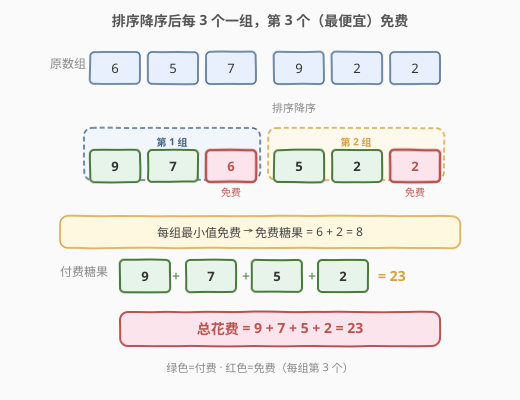
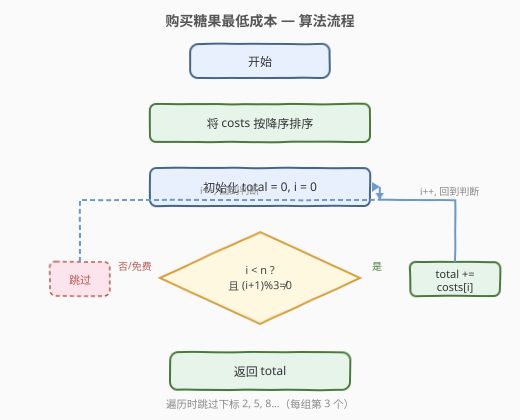

# 购买糖果的最低成本

- **题目名称**：购买糖果的最低成本
- **链接**：[2144. 购买糖果的最低成本](https://leetcode.cn/problems/minimum-cost-of-buying-candies-with-discounts/)
- **难度**：中等
- **标签**：贪心、数组、排序

## 1. 题目概述

一家商店正在打折销售糖果。每个糖果都有一个价格，用一个下标从 0 开始的整数数组 `costs` 表示，其中 `costs[i]` 表示第 `i` 个糖果的价格。

商店提供一条**买二送一**的特殊优惠：每购买 3 个糖果，就可以免费获得其中**最便宜**的那一个。你需要**购买所有** `n` 个糖果，求最低总花费。

> 简言之：将所有糖果分成若干组（每组恰好 3 个），每组中价格最低的那个免费，其余两个照价付款。糖果总数不是 3 的倍数时，剩余的 1-2 个照价付款。目标是合理分组使总花费最小。

**示例 1**：

```text
输入：costs = [1,2,3]
输出：5
解释：购买价格为 2 和 3 的糖果，免费获得价格为 1 的糖果。总花费 = 2 + 3 = 5。
```

**示例 2**：

```text
输入：costs = [6,5,7,9,2,2]
输出：23
解释：价格为 [9,7,6,5,2,2] 排序后，分成两组：
  - 第一组 [9,7,6]：付 9+7=16，6 免费
  - 第二组 [5,2,2]：付 5+2=7，2 免费
  总花费 = 16 + 7 = 23。
```

**示例 3**：

```text
输入：costs = [5,5]
输出：10
解释：只有 2 个糖果，无法享受优惠，全部照价付款。总花费 = 5 + 5 = 10。
```

**约束条件**：

- `n == costs.length`
- `1 <= n <= 100`
- `1 <= costs[i] <= 100`

---

## 2. 解题思路

### 2.1 暴力思路

暴力做法是枚举所有可能的分组方案。将 `n` 个糖果分成 $\lfloor n/3 \rfloor$ 组（每组 3 个），剩余的单独付款。每种分法的花费不同，取最小值。

但分组方案的数目巨大——相当于将 `n` 个元素分成若干无序三元组，组合数呈阶乘级增长，`n=99` 时完全不可行。需要利用贪心思想找到最优结构。

### 2.2 核心观察：排序 + 贪心分组

**关键转换**：总花费 = 所有糖果价格之和 − 免费糖果价格之和。要**最小化总花费**，等价于**最大化免费糖果的价格之和**。

每组的免费糖果是该组 3 个中**最便宜**的。为了使免费糖果尽可能贵，我们需要让每组中的"最便宜者"尽可能大。

**贪心策略**：将所有糖果**按价格降序排序**，然后**每 3 个一组**取连续的三个。这样每组的最小值（第 3 个）就是"在该位置能取到的最大可能值"。



上图展示了核心直觉：

- **降序排序**后，糖果从贵到便宜排列：$c_1 \geq c_2 \geq c_3 \geq \cdots \geq c_n$。
- **每 3 个连续为一组**：$(c_1, c_2, c_3)$、$(c_4, c_5, c_6)$、……
- 每组的第 3 个（即 $c_3, c_6, c_9, \ldots$）是该组最小值，免费。
- 其余全部照价付款。

> 💡 **为什么贪心是最优的？** 免费糖果的数量固定为 $\lfloor n/3 \rfloor$ 个。第 $k$ 个免费糖果最多能取到排序后第 $3k$ 个的位置——因为它需要 2 个更贵的糖果"撑着"（同组中比它贵的至少 2 个）。降序排序 + 连续分组恰好让每个免费位取到其上界 $c_{3k}$，因此免费总和最大，花费最小。任何其他分组都会让某个免费位取到更小的值，导致免费总和下降。

### 2.3 算法流程图



算法步骤：

1. 将 `costs` 按**降序**排序。
2. 遍历排序后的数组，下标从 0 开始。
3. 当 `(i + 1) % 3 == 0`（即下标 2, 5, 8, …，每组第 3 个）时，**跳过**（免费）。
4. 否则将 `costs[i]` 累加到 `total`。
5. 返回 `total`。

### 2.4 示例演算

以 `costs = [6,5,7,9,2,2]`（示例 2）为例：

![示例演算：[6,5,7,9,2,2]](../images/2144_example_walkthrough.svg)

| 步骤 | i | costs[i] | (i+1)%3 | 操作 | total | 备注 |
|------|---|----------|---------|------|-------|------|
| 1 | 0 | 9 | 1 | 付费 | 9 | 第 1 组第 1 个 |
| 2 | 1 | 7 | 2 | 付费 | 16 | 第 1 组第 2 个 |
| 3 | 2 | 6 | 0 | **免费** | 16 | 第 1 组第 3 个（最小） |
| 4 | 3 | 5 | 1 | 付费 | 21 | 第 2 组第 1 个 |
| 5 | 4 | 2 | 2 | 付费 | 23 | 第 2 组第 2 个 |
| 6 | 5 | 2 | 0 | **免费** | 23 | 第 2 组第 3 个（最小） |

最终结果为 `23`，与示例 2 一致。

---

## 3. 参考代码

### C++

```cpp
class Solution {
  public:
    int minimumCost(vector<int>& costs) {
        sort(costs.begin(), costs.end(), greater<int>());
        int total = 0;
        for (int i = 0; i < (int)costs.size(); ++i) {
            if ((i + 1) % 3 != 0) {
                total += costs[i];
            }
        }
        return total;
    }
};
```

### Python

```python
class Solution:
    def minimumCost(self, costs: List[int]) -> int:
        costs.sort(reverse=True)
        total = 0
        for i, c in enumerate(costs):
            if (i + 1) % 3 != 0:
                total += c
        return total
```

> 💡 也可以用切片写法更简洁：`sum(c for i, c in enumerate(costs) if (i + 1) % 3)`，但可读性略低于显式循环。

---

## 4. 复杂度分析

| 维度 | 复杂度 | 说明 |
|------|--------|------|
| 时间复杂度 | $O(n \log n)$ | 排序主导，遍历为 $O(n)$ |
| 空间复杂度 | $O(\log n)$ | 排序的递归栈空间（C++ `std::sort` 内省排序） |

> ⚠️ 本题 $n \leq 100$，排序开销极小。但算法本身的时间瓶颈始终是排序，即使 $n$ 放大到 $10^5$ 也能轻松通过。

---

## 5. 扩展：贪心正确性证明

**命题**：将 `costs` 降序排序后按连续三元分组，每组的第 3 个免费，总花费最小。

**证明**（上界论证）：

设排序后为 $c_1 \geq c_2 \geq \cdots \geq c_n$，共可获得 $\lfloor n/3 \rfloor$ 个免费糖果。

对于第 $k$ 个免费糖果（$k = 1, 2, \ldots, \lfloor n/3 \rfloor$），它必须是某组 3 个中的最小值，因此同组中至少有 2 个糖果的价格 $\geq$ 它。这意味着在前 $3k$ 个糖果中，至少有 $2k$ 个被用作"支撑"（付费），留给免费位的最大可能就是第 $3k$ 个糖果 $c_{3k}$。

因此**任何合法方案**中，第 $k$ 个免费糖果的价格 $\leq c_{3k}$，免费总和 $\leq \sum_{k=1}^{\lfloor n/3 \rfloor} c_{3k}$。

降序排序 + 连续分组恰好让每个免费位取到 $c_{3k}$，达到上界，因此最优。$\blacksquare$

---

## 6. 面试要点

1. **为什么排序降序而不是升序？**
   - 降序排序后，每 3 个一组的第 3 个是"能取到的最大免费值"。升序排序则会让最贵的糖果无法被免费覆盖，免费总和最小化（最差策略）。

2. **贪心和动态规划有什么区别？这里为什么贪心就够了？**
   - 贪心依赖"局部最优 = 全局最优"的结构。本题的优惠规则（每组最小值免费、组数固定）天然具有**交换论证**性质——交换不改变组内最小值上界，因此排序后连续分组一定最优，无需 DP。

3. **如果优惠规则改成"买一送一"（每 2 个免费 1 个最便宜的）怎么改？**
   - 同样降序排序，改为跳过下标 `(i+1) % 2 == 0` 的位置（即每隔 1 个跳过 1 个）。

4. **如果不需要买所有糖果呢？**
   - 那就只买能凑成 3 的倍数的那部分，且只买最便宜的。但这改变了问题性质，需要重新分析。

5. **时间复杂度的瓶颈是什么？**
   - 排序 $O(n \log n)$。遍历只有 $O(n)$。如果题目限定价格范围很小（如 $1 \sim 100$），可以用计数排序将整体降到 $O(n + V)$。

---

## 7. 同类练习题

- [455. 分发饼干](https://leetcode.cn/problems/assign-cookies/)：排序 + 贪心双指针，满足更多孩子
- [881. 救生艇](https://leetcode.cn/problems/boats-to-save-people/)：排序 + 双指针贪心，每船最多 2 人配对
- [1402. 做菜顺序](https://leetcode.cn/problems/reducing-dishes/)：排序 + 贪心前缀和，选择做哪些菜使满意度最大
- [1005. K 次取反后最大化的数组和](https://leetcode.cn/problems/maximize-sum-of-array-after-k-negations/)：排序 + 贪心取反，优先翻转最小负数
