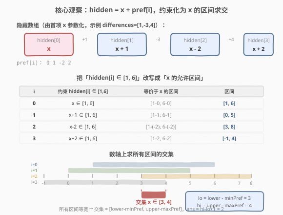
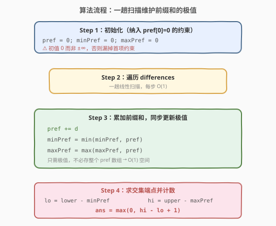
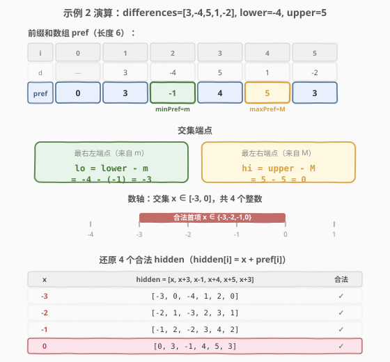

# 统计隐藏数组数目

- **题目名称**：统计隐藏数组数目
- **链接**：[2145. 统计隐藏数组数目](https://leetcode.cn/problems/count-the-hidden-sequences/)
- **难度**：中等
- **标签**：数组、前缀和、差分数组、区间求交

## 1. 题目概述

给定长度为 `n` 的整数数组 `differences`，它描述一个长度为 `n + 1` 的**隐藏数组** `hidden` 中**相邻元素之间的差值**：

$$\text{differences}[i] = \text{hidden}[i + 1] - \text{hidden}[i], \quad i = 0, \dots, n-1$$

同时给定两个整数 `lower` 和 `upper`，要求 `hidden` 中**所有元素**都落在闭区间 `[lower, upper]` 内。

返回满足条件的 `hidden` 数组的**数目**；若不存在则返回 `0`。

> 💡 **一句话审题**：`differences` 就是 `hidden` 的**差分数组**，`hidden` 是 `differences` 的**前缀和**（再加一个自由的首项）。本题问：在「所有元素 ∈ [lower, upper]」的约束下，首项有多少种合法取值。

**示例 1**：

```text
输入：differences = [1,-3,4], lower = 1, upper = 6
输出：2
解释：设 hidden[0] = x，则 hidden = [x, x+1, x-2, x+2]。
      四个元素都要落在 [1,6]：
        x ∈ [1,6] ∧ x+1 ∈ [1,6] ∧ x-2 ∈ [1,6] ∧ x+2 ∈ [1,6]
      即 x ∈ [3,4]，共 2 个合法首项：
        [3,4,1,5]、[4,5,2,6]
```

**示例 2**：

```text
输入：differences = [3,-4,5,1,-2], lower = -4, upper = 5
输出：4
解释：hidden = [x, x+3, x-1, x+4, x+5, x+3]，约束交集得 x ∈ [-3,0]，共 4 个。
```

**示例 3**：

```text
输入：differences = [4,-7,2], lower = 3, upper = 6
输出：0
解释：hidden = [x, x+4, x-3, x-1]，约束交集为空（下界 6 > 上界 2）。
```

**约束条件**：

- `n == differences.length`
- $1 \le n \le 10^5$
- $-10^5 \le$ `differences[i]` $\le 10^5$
- $-10^5 \le$ `lower` $\le$ `upper` $\le 10^5$

> ⚠️ **溢出提醒**：`differences[i]` 可达 $\pm 10^5$、累加 $n = 10^5$ 次，故前缀和 `pref` 可达 $\pm 10^{10}$，超出 32 位 `int` 范围（$\approx \pm 2.1 \times 10^9$）。C++ 必须用 `long long` 存前缀和；但**答案本身**（合法首项个数）上界为 `upper - lower + 1` $\le 2 \times 10^5 + 1$，`int` 足够。

---

## 2. 解题思路

### 2.1 暴力思路：枚举首项 x

`hidden` 一旦确定首项 `hidden[0] = x`，后续每个元素都被差分数组**唯一确定**：

$$\text{hidden}[i] = x + \sum_{k=0}^{i-1} \text{differences}[k]$$

最直观的做法：枚举 $x \in [\text{lower}, \text{upper}]$（首项本身也必须在范围内），对每个 $x$ 重建整个 `hidden` 并检查所有元素是否仍在 `[lower, upper]` 内。

```text
ans = 0
for x in lower..upper:                 # 至多 2×10^5 个候选
    cur = x
    ok = (lower <= cur <= upper)
    for d in differences:              # 每次 O(n) 重建
        cur += d
        if not (lower <= cur <= upper):
            ok = False; break
    if ok: ans += 1
return ans
```

- **正确性**：穷举所有合法首项，显然正确。
- **效率**：$O((\text{upper} - \text{lower}) \cdot n)$，最坏 $2 \times 10^5 \times 10^5 = 2 \times 10^{10}$，**严重超时**。

> ⚠️ 暴力的浪费在于：对每个候选 $x$ 都「从头到尾」重建一遍 `hidden`，重复扫了同一份 `differences` 数十万次。突破口是——**所有元素都是 $x$ 的平移**，把每个元素的约束整理成「$x$ 的一个区间」，再把所有区间**一次性求交**，即可跳过逐个枚举。

### 2.2 核心观察：前缀和参数化 + 区间求交



**第一步：参数化**。记 $\text{pref}[0] = 0$，$\text{pref}[i] = \text{pref}[i-1] + \text{differences}[i-1]$（即 `differences` 的前缀和，长度 $n+1$）。则：

$$\text{hidden}[i] = x + \text{pref}[i], \quad x = \text{hidden}[0]$$

整条 `hidden` 被**单一自由变量 $x$** 完全决定，`pref` 只是 $x$ 上的逐项偏移。

**第二步：约束转区间**。「$\text{hidden}[i] \in [\text{lower}, \text{upper}]$」等价于：

$$\text{lower} \le x + \text{pref}[i] \le \text{upper}
\iff \text{lower} - \text{pref}[i] \le x \le \text{upper} - \text{pref}[i]$$

即**每个 $i$ 给出 $x$ 的一个允许区间** $[\text{lower} - \text{pref}[i],\; \text{upper} - \text{pref}[i]]$。

**第三步：区间求交**。$x$ 必须同时满足所有 $n+1$ 个区间，取它们的**交集**。注意到所有区间**等宽**（宽度均为 `upper - lower`，只是左右平移了 $\text{pref}[i]$），故交集仍是一个区间：

$$x \in \Big[\,\max_i(\text{lower} - \text{pref}[i]),\;\; \min_i(\text{upper} - \text{pref}[i])\,\Big]$$

用 $m = \min_i \text{pref}[i]$、$M = \max_i \text{pref}[i]$ 简化：

$$\boxed{\;x \in [\,\text{lower} - m,\;\; \text{upper} - M\,]\;}$$

**第四步：计数**。合法 $x$ 的个数为（区间为空时取 0）：

$$\text{ans} = \max\big(0,\; (\text{upper} - M) - (\text{lower} - m) + 1\big)$$

> 💡 **为什么交集只取决于 pref 的最大最小值？** 因为所有区间**等宽**且**沿 $x$ 轴平移**：左端点 $\text{lower} - \text{pref}[i]$ 随 $\text{pref}[i]$ 增大而**左移**（更紧），右端点 $\text{upper} - \text{pref}[i]$ 随 $\text{pref}[i]$ 增大而**左移**（更紧）。于是**最右的左端点**来自最大的 $\text{pref}$（$M$），**最左的右端点**来自最小的 $\text{pref}$（$m$）——「最大下界、最小上界」即交集。若区间不等宽（如本题的变体），则需更一般的区间求交或扫描线。

> ⚠️ **易错点：别漏掉 $\text{pref}[0] = 0$**。隐藏数组的第 0 个元素 `hidden[0] = x` 本身也要落在 `[lower, upper]`，对应 $\text{pref}[0] = 0$ 这一项。初始化时务必令 `minPref = maxPref = 0`（而非 `±∞`），等价于把 $i=0$ 的约束纳入。若误用 `minPref = +∞`、`maxPref = -∞` 然后只在循环里更新，会漏掉首项约束，在 `differences` 全正或全负时算出错误区间。

### 2.3 算法流程图



**完整步骤**：

1. **初始化**：`pref = 0`、`minPref = 0`、`maxPref = 0`（即纳入 $i=0$ 的约束 $\text{pref}[0] = 0$）。
2. **一趟扫描**：遍历 `differences`，逐项累加 `pref += d`，并同步更新 `minPref = min(minPref, pref)`、`maxPref = max(maxPref, pref)`。
3. **求交集端点**：`lo = lower - minPref`、`hi = upper - maxPref`。
4. **计数**：`ans = max(0, hi - lo + 1)`，返回 `ans`。

```text
numberOfArrays(differences, lower, upper):
    pref = 0
    minPref = 0          # 包含 pref[0] = 0
    maxPref = 0
    for d in differences:
        pref += d
        minPref = min(minPref, pref)
        maxPref = max(maxPref, pref)
    lo = lower - minPref
    hi = upper - maxPref
    return max(0, hi - lo + 1)
```

> 💡 **一趟扫描即可**：只需前缀和的**最小值与最大值**，无需存储整个 `pref` 数组，空间 $O(1)$。这是「维护流的极值」这一经典技巧的体现——后续无需回看任何历史前缀和。

### 2.4 示例演算

以**示例 2**（`differences = [3,-4,5,1,-2]`，`lower = -4`，`upper = 5`，答案 4）逐步演算：



**第 1 步：求前缀和数组 `pref`（长度 6）**

| $i$ | 0 | 1 | 2 | 3 | 4 | 5 |
|-----|---|---|---|---|---|---|
| `differences[i-1]` | — | 3 | -4 | 5 | 1 | -2 |
| `pref[i]` | 0 | 3 | -1 | 4 | 5 | 3 |

- $m = \min_i \text{pref}[i] = -1$（在 $i=2$ 取得）
- $M = \max_i \text{pref}[i] = 5$（在 $i=4$ 取得）

**第 2 步：把每个 $i$ 的约束写成 $x$ 的区间**

| $i$ | `pref[i]` | `hidden[i] = x + pref[i]` 的约束 | $x$ 的允许区间 `[lower-pref, upper-pref]` |
|-----|-----------|----------------------------------|-------------------------------------------|
| 0 | 0  | $x \in [-4, 5]$            | $[-4, 5]$ |
| 1 | 3  | $x + 3 \in [-4, 5]$        | $[-7, 2]$ |
| 2 | -1 | $x - 1 \in [-4, 5]$        | $[-3, 6]$ |
| 3 | 4  | $x + 4 \in [-4, 5]$        | $[-8, 1]$ |
| 4 | 5  | $x + 5 \in [-4, 5]$        | $[-9, 0]$ |
| 5 | 3  | $x + 3 \in [-4, 5]$        | $[-7, 2]$ |

**第 3 步：取所有区间的交集**

- 最右左端点 $\max_i(\text{lower} - \text{pref}[i]) = \text{lower} - m = -4 - (-1) = -3$
- 最左右端点 $\min_i(\text{upper} - \text{pref}[i]) = \text{upper} - M = 5 - 5 = 0$
- 交集 $x \in [-3, 0]$，长度 $0 - (-3) + 1 = 4$

**第 4 步：还原 4 个合法 `hidden`**（$x \in \{-3, -2, -1, 0\}$）

| $x$ | `hidden = [x, x+3, x-1, x+4, x+5, x+3]` | 是否全在 `[-4, 5]` |
|-----|------------------------------------------|---------------------|
| -3 | `[-3, 0, -4, 1, 2, 0]`  | ✓ |
| -2 | `[-2, 1, -3, 2, 3, 1]`  | ✓ |
| -1 | `[-1, 2, -2, 3, 4, 2]`  | ✓ |
| 0  | `[0, 3, -1, 4, 5, 3]`   | ✓ |

**答案 = 4** ✓

> 💡 **关键直觉**：`pref` 的极差 $M - m = 5 - (-1) = 6$，恰好是 `hidden` 内部「最高点相对最低点」的最小跨度。要让所有元素塞进宽度为 `upper - lower + 1 = 10` 的窗口，首项 $x$ 的活动空间就是「窗口宽度 − 极差」$= 10 - 6 = 4$——这正是 $\text{ans} = (\text{upper} - \text{lower} + 1) - (M - m)$ 的另一种等价写法（区间非空时）。

---

## 3. 参考代码

### C++

```cpp
// 统计隐藏数组数目 —— 前缀和极值 + 区间求交 O(n) O(1)
// 编译: g++ -O2 -std=c++17 统计隐藏数组数目.cpp -o hidden
#include <vector>
#include <algorithm>
using namespace std;

class Solution {
public:
    int numberOfArrays(vector<int>& differences, int lower, int upper) {
        long long pref = 0;                 // pref[0] = 0
        long long minPref = 0, maxPref = 0; // 纳入 i=0 的约束
        for (int d : differences) {
            pref += d;
            minPref = min(minPref, pref);
            maxPref = max(maxPref, pref);
        }
        long long lo = (long long)lower - minPref;   // 交集下界
        long long hi = (long long)upper - maxPref;   // 交集上界
        long long ans = hi - lo + 1;
        return ans > 0 ? (int)ans : 0;
    }
};
```

### Python

```python
class Solution:
    def numberOfArrays(self, differences: List[int], lower: int, upper: int) -> int:
        pref = 0
        min_pref = max_pref = 0           # 包含 pref[0] = 0
        for d in differences:
            pref += d
            min_pref = min(min_pref, pref)
            max_pref = max(max_pref, pref)
        lo = lower - min_pref             # 交集下界
        hi = upper - max_pref             # 交集上界
        return max(0, hi - lo + 1)
```

> 💡 **代码要点**：
> - ① **`minPref` / `maxPref` 初值均为 0**，等价于把 $i = 0$（即 `hidden[0] = x` 本身也要在范围内）的约束纳入。若误用 `±∞` 初值只在循环内更新，会漏掉首项约束。
> - ② C++ 中 `pref` 必须用 `long long`：$n \cdot \max|\text{differences}[i]| = 10^5 \times 10^5 = 10^{10}$，远超 `int`。`lower` / `upper` 转 `long long` 再参与运算，避免隐式截断。
> - ③ **答案用 `int` 返回**：合法个数上界 $= \text{upper} - \text{lower} + 1 \le 2 \times 10^5 + 1$，安全落在 `int` 内；先用 `long long` 计算 `hi - lo + 1`，与 0 比较后再转 `int`。
> - ④ 只维护前缀和的**极值**，不存整个 `pref` 数组，空间 $O(1)$。

---

## 4. 复杂度分析

| 维度 | 复杂度 | 说明 |
|------|--------|------|
| **时间复杂度** | $O(n)$ | 一趟遍历 `differences`，每步 $O(1)$ 累加与极值更新 |
| **空间复杂度** | $O(1)$ | 仅维护 `pref` / `minPref` / `maxPref` 三个变量，不存前缀和数组 |

> ⚠️ 若采用「枚举首项 $x$ + 重建 `hidden`」的暴力，时间为 $O((\text{upper}-\text{lower}) \cdot n)$，最坏 $2 \times 10^{10}$ 必超时。核心优化在于**把逐 $x$ 验证翻转为一次性求所有约束的交集**——这是「参数化 + 区间求交」降阶的典型范式。

---

## 5. 扩展：差分约束与「首项自由度」视角

### 5.1 差分↔前缀的对偶

`differences` 是 `hidden` 的**差分数组**，`hidden` 是 `differences` 的**前缀和**（再补一个首项）。这是数组里最基础的对偶关系，许多题围绕它展开：

| 方向 | 已知 | 求解 | 代表题 |
|------|------|------|--------|
| 前缀和 | 原数组 | 区间和 / 还原 | [303. 区域和检索](../0301-0400/303_区域和检索 - 数组不可变.md)、[304. 二维区域和检索](../0301-0400/304_二维区域和检索 - 数组不可变.md) |
| 差分 | 区间更新 | 还原原数组 | [370. 区间加法](../0301-0400/370_区间加法.md)、[1109. 航班预订统计](../1101-1200/1109_航班预订统计.md) |
| **本题** | 差分 + 值域约束 | 合法首项个数 | 2145 |

本题的特殊性在于：差分数组给定后，原数组还剩**一个自由度**（首项 $x$），再叠加上「所有元素 ∈ [lower, upper]」的约束，问自由度还剩多少。这本质是**差分约束系统**的最简形式——一组形如 $x + c_i \in [L, U]$ 的约束，求可行解的个数。

### 5.2 等价公式：窗口宽度 − 极差

当交集非空时，答案可改写为：

$$\text{ans} = (\text{upper} - \text{lower} + 1) - (M - m)$$

直觉：`pref` 的极差 $M - m$ 是 `hidden` 内部「波峰相对波谷」的**固有跨度**（与首项无关），`upper - lower + 1` 是允许窗口的宽度。把固有跨度塞进窗口后，首项还能左右滑动的空间就是「窗口宽 − 极差」。交集为空 ⟺ 极差 > 窗口宽 − 1 ⟺ $M - m > \text{upper} - \text{lower}$。

```cpp
// 等价写法
long long span = maxPref - minPref;          // 极差
long long window = (long long)upper - lower + 1;
return max(0LL, window - span);
```

两种写法数值上完全等价（展开 `hi - lo + 1` 即得 `window - span`），选用更直观的一种即可。推荐主代码用 `hi - lo + 1`（直接对应交集长度，易于讲解），本节公式作为验证与直觉补充。

### 5.3 若区间不等宽：更一般的区间求交

本题所有约束区间**等宽**（均为 `upper - lower`），故交集只需两个极值。若把题目改为「每个 `hidden[i]` 有自己的 `[lower_i, upper_i]`」，则区间不等宽，需用**扫描线 / 逐步求交**维护「当前交集」：从 `[−∞, +∞]` 出发，对每个 $i$ 把交集与 `[lower_i - pref[i], upper_i - pref[i]]` 求交（取 max 下界、min 上界），空则提前返回 0。复杂度仍 $O(n)$，但失去了「只看极值」的简洁性。

---

## 6. 面试要点

**Q1：为什么 `hidden` 被单一变量 $x$ 完全决定？**

> `differences` 给定了相邻元素的差，即 `hidden[i+1] - hidden[i]` 全部固定。一旦确定 `hidden[0] = x`，后续每个元素 `hidden[i] = x + pref[i]`（`pref` 是 `differences` 的前缀和）都被唯一确定。所以 `hidden` 的「自由度」只有首项 $x$ 一个维度——把无穷多种数组压缩成对单变量的枚举/求交。

**Q2：为什么交集只取决于 `pref` 的最大最小值？**

> 每个约束 `lower <= x + pref[i] <= upper` 化为 $x$ 的一个区间 `[lower - pref[i], upper - pref[i]]`，**所有区间等宽**（宽 `upper - lower`）。等宽区间沿 $x$ 轴平移时，**最右的左端点**来自最大的 `pref`（$M$），**最左的右端点**来自最小的 `pref`（$m$）。交集即 `[lower - m, upper - M]`，只需维护 `pref` 的极值，$O(n)$ 时间、$O(1)$ 空间。

**Q3：为什么 `minPref` / `maxPref` 初值要设为 0 而不是 `±∞`？**

> 初值 0 等价于把 $i = 0$ 的约束 `hidden[0] = x ∈ [lower, upper]`（即 `pref[0] = 0`）纳入。若用 `minPref = +∞`、`maxPref = -∞` 且只在循环里更新，会**漏掉首项本身也要在范围内**这一约束，在 `differences` 全正或全负时算出错误区间。把 `pref[0] = 0` 当作前缀和序列的第一项参与极值统计，是边界正确性的关键。

**Q4：C++ 为什么用 `long long`？答案却能用 `int` 返回？**

> 前缀和 `pref` 可达 $n \times \max|\text{differences}[i]| = 10^5 \times 10^5 = 10^{10}$，远超 32 位 `int`（$\approx \pm 2.1 \times 10^9$），故 `pref` / `minPref` / `maxPref` / `lo` / `hi` 必须用 `long long`，且 `lower` / `upper` 要先转 `long long` 再运算。但**答案**是合法首项个数，上界 `upper - lower + 1 ≤ 2×10^5 + 1`，安全落在 `int` 内，故先用 `long long` 算 `hi - lo + 1`、与 0 比较后再转 `int` 返回。

**Q5：暴力 $O((\text{upper}-\text{lower}) \cdot n)$ 会被卡在哪里？如何降到 $O(n)$？**

> 暴力对每个候选首项 $x$ 都「从头重建 `hidden`」并逐元素校验，重复扫 `differences` 数十万次。降阶的关键是**翻转视角**：不再「逐 $x$ 验证全部约束」，而是「把全部约束整理成 $x$ 的区间再求交」。每个约束只贡献一个区间，交集大小直接给出合法 $x$ 数目，无需逐个枚举——这是「枚举 → 求交」的典型降阶范式，与区间调度类问题的思路一致。

> 💡 **一句话总结**：2145 把「差分→前缀」对偶与「区间求交」结合——`hidden` 由首项 $x$ 参数化，每个元素的值域约束化为 $x$ 的一个等宽区间，所有区间的交集长度即答案。$O(n)$ 时间、$O(1)$ 空间，核心是维护前缀和的最小最大值，并牢记 `pref[0] = 0` 的边界。

---

## 7. 同类练习题

- [370. 区间加法](https://leetcode.cn/problems/range-addition/)（[题解](../0301-0400/370_区间加法.md)）：差分数组的经典应用——给定区间更新还原原数组。与本题互为镜像：370 是「给差分求前缀还原」，本题是「给差分 + 首项自由度 + 值域约束，求合法首项数」
- [1109. 航班预订统计](https://leetcode.cn/problems/corporate-flight-bookings/)（[题解](../1101-1200/1109_航班预订统计.md)）：差分数组实战，区间加 → 前缀和还原，巩固「差分↔前缀」对偶
- [303. 区域和检索 - 数组不可变](https://leetcode.cn/problems/range-sum-query-immutable/)（[题解](../0301-0400/303_区域和检索 - 数组不可变.md)）：前缀和的母题，理解 `pref[i]` 的本质，是本题参数化的基础
- [56. 合并区间](https://leetcode.cn/problems/merge-intervals/)（[题解](../0001-0100/56_合并区间.md)）：区间操作的母题——本题把每个约束化为 $x$ 的区间再求交，是区间求交思想的最简形式，56 给出更一般的区间合并/求交套路
- [1526. 形成目标数组的最少操作次数](https://leetcode.cn/problems/minimum-number-of-increments-on-subarrays-to-form-a-target-array/)：差分约束的进阶——从「差分数组」反推最少操作次数，体会差分数组在「构造/计数」类问题中的双向应用
