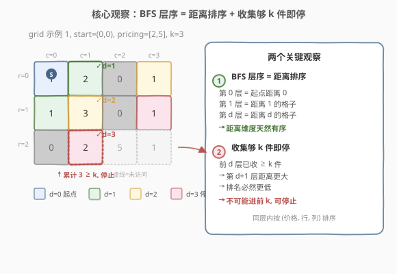
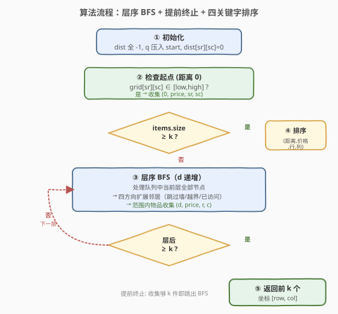
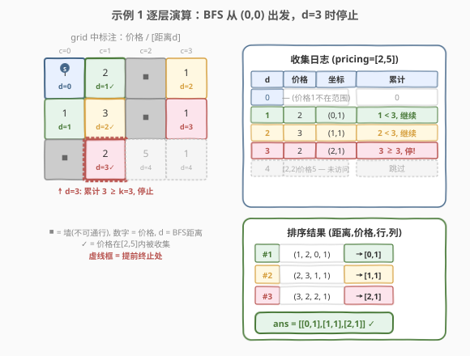

# 价格范围内最高排名的 K 样物品

- **题目名称**：价格范围内最高排名的 K 样物品
- **链接**：[2146. 价格范围内最高排名的 K 样物品](https://leetcode.cn/problems/k-highest-ranked-items-within-a-price-range/)
- **难度**：中等
- **标签**：广度优先搜索、BFS、排序、矩阵

## 1. 题目概述

给定一个 `m x n` 的二维整数数组 `grid`，表示商店的物品分布图：

- `0`：无法穿越的墙。
- `1`：可自由通过的空格子。
- **其他正整数**：该格子内物品的价格，可自由经过。

从一个格子走到上下左右相邻格子花费 **1 步**。给定 `pricing = [low, high]`、`start = [row, col]` 和整数 `k`，要求返回**价格在闭区间 `[low, high]` 内**且**排名最高**的 `k` 件物品的坐标，按排名排序后返回。若不足 `k` 件，则全部返回。

**排名规则**（优先级从高到低）：

1. **距离**：从 `start` 到该物品的最短路径步数，越近排名越高。
2. **价格**：价格越低排名越高（仅考虑范围内的物品）。
3. **行坐标**：行坐标越小排名越高。
4. **列坐标**：列坐标越小排名越高。

**示例 1**：

```text
输入：grid = [[1,2,0,1],[1,3,0,1],[0,2,5,1]], pricing = [2,5], start = [0,0], k = 3
输出：[[0,1],[1,1],[2,1]]
解释：起点 (0,0)，价格范围 [2,5]。
范围内物品：(0,1)距离1, (1,1)距离2, (2,1)距离3, (2,2)距离4。
排名最高的 3 件：(0,1), (1,1), (2,1)。
```

**示例 2**：

```text
输入：grid = [[1,2,0,1],[1,3,3,1],[0,2,5,1]], pricing = [2,3], start = [2,3], k = 2
输出：[[2,1],[1,2]]
解释：起点 (2,3)，价格范围 [2,3]。
范围内物品：(2,1)距离2价格2, (1,2)距离2价格3, (1,1)距离3, (0,1)距离4。
同距离2按价格排序：价格2 < 价格3，所以 (2,1) 排在 (1,2) 前。
```

**示例 3**：

```text
输入：grid = [[1,1,1],[0,0,1],[2,3,4]], pricing = [2,3], start = [0,0], k = 3
输出：[[2,1],[2,0]]
解释：范围内只有 2 件物品（不足 k=3），全部返回。
(2,1)距离5价格3, (2,0)距离6价格2。
距离优先：距离5 < 距离6，所以 (2,1) 排前。
```

**约束条件**：

- $m == \text{grid.length}$，$n == \text{grid[i].length}$
- $1 \leq m, n \leq 10^5$
- $1 \leq m \times n \leq 10^5$
- $0 \leq \text{grid[i][j]} \leq 10^5$
- $\text{pricing.length} == 2$，$2 \leq \text{low} \leq \text{high} \leq 10^5$
- $\text{start.length} == 2$，$0 \leq \text{row} < m$，$0 \leq \text{col} < n$
- $\text{grid[row][col]} > 0$（起点一定可通行）
- $1 \leq k \leq m \times n$

> 💡 **审题关键**：① **排名的第一关键字是距离**——这意味着 BFS 的天然层序（按距离递增）恰好给出了距离维度的排序；② **物品格子也可通行**——价格为正整数的格子不是障碍，BFS 可以穿过它们继续扩展；③ **同距离内需按 (价格, 行, 列) 二次排序**——BFS 层内顺序不保证此排序，需要额外排序；④ $m \times n \leq 10^5$，BFS 的 $O(mn)$ 时间和空间完全可行。

---

## 2. 解题思路

### 2.1 暴力思路：全图 BFS + 全排序

最直观的做法：从 `start` 出发对整个网格做 BFS，计算每个可达格子的最短距离。然后筛出价格在 `[low, high]` 内的物品格子，按 `(距离, 价格, 行, 列)` 四元组排序，取前 `k` 个。

- **正确性**：BFS 保证每个格子的距离是最短路径步数；全排序保证四关键字排名正确。
- **效率**：BFS 遍历所有可达格子 $O(mn)$，收集后排序 $O(t \log t)$（$t$ 为范围内物品数，最坏 $t = mn$），总体 $O(mn \log(mn))$。$mn \leq 10^5$ 时约 $1.7 \times 10^6$ 次操作，可接受但不是最优。

> ⚠️ 全图 BFS + 全排序虽然正确，但当 `k` 很小、物品集中在起点附近时，会白白遍历大量远距离格子。可以利用 BFS 的层序特性做**提前终止**优化。

### 2.2 核心观察：BFS 层序天然按距离排序 + 提前终止



整个解法建立在**两个关键观察**上。

**观察 1：BFS 的层序恰好对应距离排序**

BFS 从起点出发，逐层扩展——第 0 层是起点（距离 0），第 1 层是距离为 1 的所有格子，第 2 层是距离为 2 的所有格子，依此类推。这意味着：

$$\text{BFS 层序} \implies \text{距离单调递增} \implies \text{排名第一关键字天然有序}$$

因此，**按 BFS 层序收集到的物品，其距离维度已经排好序**。我们只需在同层内按 `(价格, 行, 列)` 排序即可。

> 💡 **关键推论**：如果在前 $d$ 层中已收集到 $\geq k$ 件物品，那么第 $d+1$ 层及以后的物品距离都更大，排名必然更低，不可能挤进前 $k$。这就是**提前终止**的理论依据。

**观察 2：提前终止——收集够 k 件即停**

按层 BFS，每处理完一层就检查已收集的物品数。一旦达到 `k` 件，立即停止 BFS——后续层的物品距离更大，不可能进入前 `k`。

| 场景 | 全图 BFS | 提前终止 BFS |
|------|----------|--------------|
| `k` 很小、物品近 | 遍历全图 $O(mn)$ | 仅遍历前几层 $O(d_{\text{stop}} \cdot \text{层宽})$ |
| `k` 很大或物品稀疏 | 遍历全图 | 退化为全图 BFS（无劣化） |
| 最坏情况 | $O(mn)$ | $O(mn)$（同样遍历全图） |

**用示例 1 验证提前终止**：`k = 3`，起点 `(0,0)`。

| BFS 层 | 该层发现的可收集物品 | 累计收集数 | 是否停止 |
|--------|---------------------|-----------|----------|
| $d=0$ | 无（`(0,0)` 价格 1 不在 `[2,5]`） | 0 | 否 |
| $d=1$ | `(0,1)` 价格 2 ✓ | 1 | 否 |
| $d=2$ | `(1,1)` 价格 3 ✓ | 2 | 否 |
| $d=3$ | `(2,1)` 价格 2 ✓ | 3 $\geq k$ | **是** ✓ |

提前终止在 $d=3$ 停止，无需访问 $d=4$ 的 `(2,2)`。最终对 3 件物品排序（距离已有序，仅需确认同层内排序），取前 3 件返回 `[[0,1],[1,1],[2,1]]` ✓

### 2.3 算法流程图



**完整步骤**：

1. **初始化**：距离数组 `dist` 全填 $-1$，队列 `q` 压入起点 `(sr, sc)`，`dist[sr][sc] = 0`，物品列表 `items` 为空。
2. **检查起点**：若 `grid[sr][sc]` 在 `[low, high]` 内，将 `(0, price, sr, sc)` 加入 `items`。若 `items.size() >= k`，跳到步骤 5。
3. **层序 BFS**：`d` 从 1 递增，每层处理队列中当前所有节点：
   - 对每个节点 `(r, c)`，遍历四方向邻居 `(nr, nc)`：
     - 越界 / 是墙（`grid == 0`）/ 已访问 → 跳过。
     - 否则标记 `dist[nr][nc] = d`，入队。
     - 若 `grid[nr][nc]` 在 `[low, high]` 内，将 `(d, price, nr, nc)` 加入 `items`。
   - **层结束检查**：若 `items.size() >= k`，`break` 跳出 BFS。
4. **排序**：对 `items` 按 `(距离, 价格, 行, 列)` 四元组升序排序（`tuple` 默认字典序恰好匹配）。
5. **取前 k**：输出前 $\min(k, \text{items.size()})$ 件物品的 `(row, col)` 坐标。

> 💡 **写法要点**：① 层序 BFS 用「每层开始前记录 `sz = q.size()`，循环 `sz` 次」实现；② 提前终止的检查放在每层循环**之后**——确保当前距离层全部收集完才判断，避免遗漏同距离物品；③ 起点本身也可能是物品（距离 0），需在 BFS 循环前单独检查。

### 2.4 示例演算

以示例 1 `grid = [[1,2,0,1],[1,3,0,1],[0,2,5,1]], pricing = [2,5], start = [0,0], k = 3` 逐步演算：



**网格布局**（`■` = 墙，数字 = 价格/空格）：

```text
      c=0   c=1   c=2   c=3
r=0   [1]   [2]   ■     [1]
r=1   [1]   [3]   ■     [1]
r=2   ■     [2]   [5]   [1]
```

**逐层 BFS 展开**：

- **$d=0$**：起点 `(0,0)`，价格 1，不在 `[2,5]` → 不收集。`items = []`。
- **$d=1$**：从 `(0,0)` 扩展 → `(0,1)` 价格 2 ✓ 收集，`(1,0)` 价格 1 不收集。`items = [(1,2,0,1)]`。累计 1 < 3，继续。
- **$d=2$**：从 `(0,1)` 扩展 → `(0,2)` 是墙跳过，`(1,1)` 价格 3 ✓ 收集。从 `(1,0)` 扩展 → `(2,0)` 是墙跳过，`(1,1)` 已访问。`items = [(1,2,0,1), (2,3,1,1)]`。累计 2 < 3，继续。
- **$d=3$**：从 `(1,1)` 扩展 → `(1,2)` 是墙跳过，`(2,1)` 价格 2 ✓ 收集，`(0,1)` 已访问，`(1,0)` 已访问。`items = [(1,2,0,1), (2,3,1,1), (3,2,2,1)]`。累计 3 ≥ 3，**停止** ✓

**排序**（`tuple` 字典序 = 距离 → 价格 → 行 → 列）：

| 排名 | 距离 | 价格 | 行 | 列 | 坐标 |
|------|------|------|----|----|------|
| 1 | 1 | 2 | 0 | 1 | `[0,1]` |
| 2 | 2 | 3 | 1 | 1 | `[1,1]` |
| 3 | 3 | 2 | 2 | 1 | `[2,1]` |

**输出**：`[[0,1],[1,1],[2,1]]` ✓

> 💡 **对照示例 2**（`start = [2,3], pricing = [2,3], k = 2`）：`d=2` 时同时发现 `(2,1)` 价格 2 和 `(1,2)` 价格 3，同距离按价格排序 → `(2,1)` 排前。累计 2 ≥ `k=2`，停止。输出 `[[2,1],[1,2]]` ✓。这验证了**同距离层内按价格排序**的正确性。

---

## 3. 参考代码

### 方法一：层序 BFS + 提前终止 + 排序（推荐）

### C++

```cpp
class Solution {
public:
    vector<vector<int>> highestRankedKItems(vector<vector<int>>& grid,
                                           vector<int>& pricing,
                                           vector<int>& start, int k) {
        int m = grid.size(), n = grid[0].size();
        int low = pricing[0], high = pricing[1];
        int sr = start[0], sc = start[1];

        vector<tuple<int,int,int,int>> items;
        vector<vector<int>> dist(m, vector<int>(n, -1));
        queue<pair<int,int>> q;
        q.push({sr, sc});
        dist[sr][sc] = 0;

        if (grid[sr][sc] >= low && grid[sr][sc] <= high) {
            items.emplace_back(0, grid[sr][sc], sr, sc);
        }

        int dr[] = {-1, 1, 0, 0};
        int dc[] = {0, 0, -1, 1};
        int d = 0;

        while (!q.empty() && (int)items.size() < k) {
            d++;
            int sz = q.size();
            for (int i = 0; i < sz; ++i) {
                auto [r, c] = q.front(); q.pop();
                for (int dir = 0; dir < 4; ++dir) {
                    int nr = r + dr[dir], nc = c + dc[dir];
                    if (nr < 0 || nr >= m || nc < 0 || nc >= n) continue;
                    if (grid[nr][nc] == 0 || dist[nr][nc] != -1) continue;
                    dist[nr][nc] = d;
                    q.push({nr, nc});
                    if (grid[nr][nc] >= low && grid[nr][nc] <= high) {
                        items.emplace_back(d, grid[nr][nc], nr, nc);
                    }
                }
            }
        }

        sort(items.begin(), items.end());

        vector<vector<int>> ans;
        int cnt = min((int)items.size(), k);
        for (int i = 0; i < cnt; ++i) {
            auto [dd, pp, rr, cc] = items[i];
            ans.push_back({rr, cc});
        }
        return ans;
    }
};
```

### Python

```python
class Solution:
    def highestRankedKItems(self, grid: list[list[int]], pricing: list[int],
                            start: list[int], k: int) -> list[list[int]]:
        m, n = len(grid), len(grid[0])
        low, high = pricing
        sr, sc = start

        items = []
        dist = [[-1] * n for _ in range(m)]
        from collections import deque
        q = deque()
        q.append((sr, sc))
        dist[sr][sc] = 0

        if low <= grid[sr][sc] <= high:
            items.append((0, grid[sr][sc], sr, sc))

        dirs = [(-1, 0), (1, 0), (0, -1), (0, 1)]
        d = 0
        while q and len(items) < k:
            d += 1
            for _ in range(len(q)):
                r, c = q.popleft()
                for dr, dc in dirs:
                    nr, nc = r + dr, c + dc
                    if not (0 <= nr < m and 0 <= nc < n):
                        continue
                    if grid[nr][nc] == 0 or dist[nr][nc] != -1:
                        continue
                    dist[nr][nc] = d
                    q.append((nr, nc))
                    if low <= grid[nr][nc] <= high:
                        items.append((d, grid[nr][nc], nr, nc))

        items.sort()
        return [[r, c] for _, _, r, c in items[:k]]
```

> 💡 **写法要点**：① `tuple<int,int,int,int>` 的默认字典序恰好匹配 `(距离, 价格, 行, 列)` 四关键字排名，无需自定义比较器；② 提前终止条件 `len(items) < k` 放在 `while` 循环条件中，简洁且正确——一旦收集够 `k` 件就不再进入下一层；③ 起点在 BFS 前单独检查，因为 `dist[sr][sc]` 已设为 0，循环中不会再处理它；④ 物品格子（`grid > 1`）可通行，BFS 不阻断——与墙（`grid == 0`）的处理不同。

---

## 4. 复杂度分析

| 维度 | 方法 | 复杂度 | 说明 |
|------|------|--------|------|
| 时间 | 层序 BFS + 提前终止 | $O(mn + t \log t)$ | BFS 最多遍历 $mn$ 个格子；$t$ 为收集的物品数（$\leq k +$ 最后一层物品数），排序 $O(t \log t)$ |
| 空间 | 层序 BFS + 提前终止 | $O(mn)$ | `dist` 数组 $O(mn)$，队列最坏 $O(mn)$，`items` 最坏 $O(t)$ |

> 💡 **提前终止的收益**：当 `k` 较小且物品分布密集时，BFS 只需遍历前几层即停，实际时间远小于 $O(mn)$。最坏情况（物品稀疏或 `k` 很大）退化为全图 BFS，与暴力法相同，无劣化。$mn \leq 10^5$ 时，即使最坏情况也仅需约 $10^5$ 次 BFS 操作 + $10^5 \log 10^5 \approx 1.7 \times 10^6$ 次排序操作，毫秒级完成。

---

## 5. 扩展：优先队列（Top-K 堆）替代排序

当收集的物品数 $t$ 远大于 $k$ 时（例如某层一次性发现大量物品），全排序 $O(t \log t)$ 可以用 **大小为 `k` 的优先队列**优化为 $O(t \log k)$。

**思路**：维护一个**大顶堆**（堆顶 = 最差元素），堆中保留当前前 `k` 优的物品。遍历每个收集的物品 `(dist, price, row, col)`：

- 堆大小 $< k$：直接压入。
- 堆大小 $= k$：与堆顶比较，若新元素更优（字典序更小），弹出堆顶并压入新元素。

最终堆中即为前 `k` 优物品，再排序输出。

```cpp
// 大顶堆：tuple 默认是 less（小顶堆），用 greater 反转为大顶堆
priority_queue<tuple<int,int,int,int>, vector<tuple<int,int,int,int>>,
               greater<tuple<int,int,int,int>>> minHeap;
// 但我们需要保留最小的 k 个 → 用大顶堆（less 是默认，tuple 的 less 是字典序升序）
// 实际上 greater<> 给出小顶堆，我们要大顶堆来淘汰最大者
priority_queue<tuple<int,int,int,int>> maxHeap;  // 默认 less = 大顶堆
for (auto& item : items) {
    if ((int)maxHeap.size() < k) {
        maxHeap.push(item);
    } else if (item < maxHeap.top()) {
        maxHeap.pop();
        maxHeap.push(item);
    }
}
// 取出后逆序排序
vector<vector<int>> ans;
while (!maxHeap.empty()) {
    auto [d, p, r, c] = maxHeap.top(); maxHeap.pop();
    ans.push_back({r, c});
}
reverse(ans.begin(), ans.end());
```

> ⚠️ **本题中 Top-K 堆的收益有限**：由于提前终止，`items` 的大小通常接近 `k`，全排序和堆的差异不大。Top-K 堆更适合「无法提前终止、必须遍历全部元素」的场景（如 [215. 数组中的第K个最大元素](https://leetcode.cn/problems/kth-largest-element-in-an-array/)）。面试中可作为「如何优化排序部分」的延伸讨论。

---

## 6. 面试要点

**Q1：为什么用 BFS 而不是 DFS？**

> 排名的第一关键字是**最短距离**。BFS 按层扩展，天然按距离递增访问节点，第一次到达某格子时的距离就是最短距离。DFS 不保证按距离顺序访问，无法在遍过程中确定最短距离，需要遍完后额外计算。

**Q2：提前终止为什么是正确的？会不会遗漏更优的物品？**

> BFS 按距离递增分层扩展。如果在第 $d$ 层结束后已收集 $\geq k$ 件物品，那么第 $d+1$ 层及以后的物品距离都 $> d$，排名必然低于已收集的 $k$ 件中任意一件（距离是第一关键字）。因此不可能有更优物品被遗漏。关键前提是：**每层完全处理后再判断**，不能在层中途停止。

**Q3：物品格子（`grid > 1`）可以通行吗？BFS 要不要跳过？**

> 可以通行。题目明确「所有其他正整数表示该格子内物品的价格，你可以自由经过这些格子」。BFS 中只有 `grid == 0`（墙）才跳过，物品格子和空格子（`grid == 1`）一样可通行、可扩展邻居。区别仅在于物品格子在范围内时会被收集。

**Q4：起点本身可能是物品吗？需要特殊处理吗？**

> 可能。约束保证 `grid[row][col] > 0`，起点不可能是墙，但可能是空格子（价格 1）或物品格子。若起点价格在 `[low, high]` 内，它应该以距离 0 被收集。代码在 BFS 循环前单独检查起点，因为 `dist[sr][sc]` 已设为 0，循环中不会再访问它。

**Q5：`tuple` 的默认排序为什么恰好匹配四关键字排名？**

> C++ 的 `tuple` 默认使用 `operator<`，按元素顺序从左到右做字典序比较——先比第一个元素（距离），相等则比第二个（价格），再相等比第三个（行），最后比第四个（列）。这恰好是题目要求的四关键字优先级。Python 的 `tuple` 比较语义完全一致。

> 💡 **一句话总结**：层序 BFS 保证距离有序，每层收集够 `k` 件即停，最后对收集的物品按 `(距离, 价格, 行, 列)` 四元组排序取前 `k`。核心是认清「BFS 层序 = 距离排序」+「收集够即停」两点。

---

## 7. 同类练习题

- [994. 腐烂的橘子](https://leetcode.cn/problems/rotting-oranges/)：同为多源 BFS 求最短距离——每分钟腐烂传播一层，BFS 层序对应时间步，求所有橘子腐烂的最短时间
- [1926. 迷宫中离入口最近的出口](https://leetcode.cn/problems/nearest-exit-from-entrance-in-maze/)：BFS 求最短路径——从入口出发找最近出口，同样利用 BFS 层序 = 距离递增
- [1091. 二进制矩阵中的最短路径](https://leetcode.cn/problems/shortest-path-in-binary-matrix/)：BFS 求最短路径——8 方向扩展，层序 BFS 找最短通路长度
- [215. 数组中的第K个最大元素](https://leetcode.cn/problems/kth-largest-element-in-an-array/)：Top-K 选择——本题扩展部分讨论的堆方法，从全排序优化为 $O(n \log k)$
- [542. 01 矩阵](https://leetcode.cn/problems/01-matrix/)：多源 BFS 求每个格子到最近 0 的距离——反向多源 BFS，与本题「单源求距离」对照
