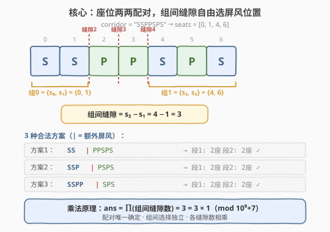
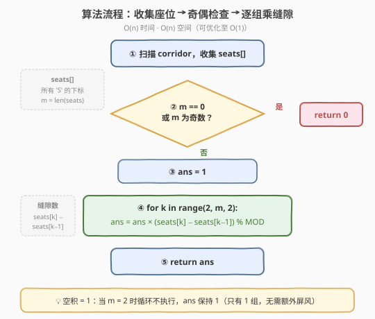
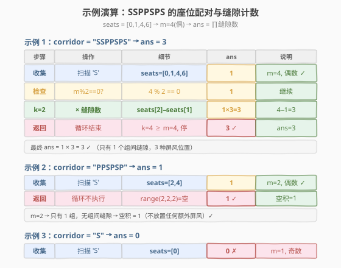

# LeetCode 分隔长廊的方案数 题解

## 1. 题目概述

- **标题 / 题号**：分隔长廊的方案数（#2147，hard）
- **链接**：https://leetcode.cn/problems/number-of-ways-to-divide-a-long-corridor/
- **难度**：困难
- **标签**：数学、字符串、贪心、乘法原理

**题意**：给定一个下标从 **0** 开始、长度为 $n$ 的字符串 `corridor`，由字母 `'S'`（座位）和 `'P'`（植物）组成。走廊两端已各放一个屏风，你需要在相邻位置 $i-1$ 与 $i$ 之间（$1 \le i \le n-1$）**额外**放置若干屏风，使得划分出的**每一段恰好包含 2 个座位**（植物数目不限）。两个方案只要有任何一个屏风位置不同即视为不同。返回方案数对 $10^9 + 7$ 取余的结果；无方案返回 `0`。

**示例 1**：

```text
输入：corridor = "SSPPSPS"
输出：3
解释：总共有 3 种分隔方案。下图黑色竖线为已放置的屏风，
      每种方案中每一段都恰好有 2 个座位。
```

**示例 2**：

```text
输入：corridor = "PPSPSP"
输出：1
解释：只有 1 种方案——不放置任何额外屏风（整段恰好 2 个座位）。
```

**示例 3**：

```text
输入：corridor = "S"
输出：0
解释：只有 1 个座位，无法凑成 2 个一段，无方案。
```

**约束**：

- $n = \text{corridor.length}$
- $1 \le n \le 10^5$
- `corridor[i]` 为 `'S'` 或 `'P'`

> 💡 **读题关键**：「每段恰好 2 个座位」意味着座位被**强制两两分组**——第 1、2 个座位归第 1 段，第 3、4 个归第 2 段……分组方式唯一，唯一的自由度在于**相邻两组之间屏风放在哪个缝隙**。这是一道披着「困难」外衣的乘法原理计数题。

## 2. 解题思路

### 2.1 暴力思路：枚举所有屏风组合

最直白的做法：走廊有 $n-1$ 个可放屏风的缝隙，每个缝隙「放 / 不放」二选一，共 $2^{n-1}$ 种组合。逐一验证每种组合是否使每段恰好 2 个座位。

```text
ans = 0
for mask in 0 .. 2^(n-1) - 1:        // 枚举所有屏风放置方案
    segments = 按 mask 切分走廊
    if 每段座位数都 == 2:
        ans += 1
return ans % MOD
```

时间复杂度 $O(2^n \cdot n)$，$n = 10^5$ 时完全不可行。

> ⚠️ 暴力的浪费在于：它把「屏风位置」当作完全自由的变量来枚举，却忽略了「每段恰好 2 座位」这一约束**几乎完全锁死了屏风的数量和大致位置**——屏风只能出现在特定的「组间缝隙」区域，且数量固定。

### 2.2 核心观察：座位强制配对 + 组间独立选择



**观察 1：座位的配对方式是唯一的。**

设所有座位的下标为 $s_0 < s_1 < s_2 < s_3 < \dots$。由于屏风只能放在缝隙处（不改变座位在走廊中的相对顺序），第 1 段必须包含 $s_0$，而它恰好含 2 个座位，所以第 1 段 = $\{s_0, s_1\}$；第 2 段 = $\{s_2, s_3\}$；以此类推。

> 为什么第 1 段不能是 $\{s_0, s_2\}$？因为 $s_1$ 在 $s_0$ 和 $s_2$ 之间，若屏风放在 $s_0$ 左侧和 $s_2$ 右侧，则 $s_1$ 也被包进第 1 段，变成 3 个座位——违规。因此配对只能按顺序两两截取，别无选择。

**观察 2：座位总数必须为偶数（且 $> 0$）。**

若座位数为奇数，最后会剩 1 个座位无法成对 → 返回 `0`。若座位数为 `0`，整段 0 个座位 $\ne 2$ → 返回 `0`。

**观察 3：每组之间必须且只需放 1 个屏风，位置在该组的最后一个座位与下一组的第一个座位之间的任意缝隙。**

设第 $k$ 组为 $\{s_{2k}, s_{2k+1}\}$，第 $k+1$ 组为 $\{s_{2k+2}, s_{2k+3}\}$。屏风必须放在 $s_{2k+1}$ 与 $s_{2k+2}$ 之间的某个缝隙，可选位置数为：

$$\text{gap}_k = s_{2k+2} - s_{2k+1}$$

（即 $s_{2k+1}+1,\ s_{2k+1}+2,\ \dots,\ s_{2k+2}$ 共 $s_{2k+2} - s_{2k+1}$ 个缝隙。）

**观察 4：各组间的选择相互独立 → 乘法原理。**

由乘法原理，总方案数为所有组间缝隙数的乘积：

$$\text{ans} = \prod_{k=0}^{m/2 - 2} (s_{2k+2} - s_{2k+1}) \pmod{10^9+7}$$

其中 $m$ 为座位总数。当 $m = 2$ 时只有一个组、无组间缝隙，乘积为空积 = `1`。

> 💡 **为什么组间选择独立？** 每组间的屏风位置只影响该处切分，不影响其他组的座位配对（配对由全局座位顺序唯一确定）。不同组间的缝隙区间互不重叠，任取一组组合都对应一个合法方案——这是乘法原理的典型适用场景。

### 2.3 算法流程图



```text
numberOfWays(corridor):
    seats = [i for i, c in enumerate(corridor) if c == 'S']
    m = len(seats)
    if m == 0 or m % 2 == 1:
        return 0                        // 无法两两配对
    ans = 1
    for k in range(2, m, 2):            // 遍历每个组间缝隙
        ans = ans * (seats[k] - seats[k-1]) % MOD
    return ans
```

> 💡 **实现要点**：① 先一次扫描收集所有 `'S'` 的下标，后续只对座位下标数组操作，植物完全忽略——植物只影响「缝隙数」而不影响配对。② 循环 `range(2, m, 2)` 中 `seats[k]` 是每组第一个座位、`seats[k-1]` 是上一组最后一个座位，差值即缝隙数。③ 取余在每次乘法后立即做，避免大整数溢出（C++ 需 `long long` 中间变量）。

### 2.4 示例演算

以示例 1 `corridor = "SSPPSPS"` 为例：



| 步骤 | 内容 | 结果 |
|------|------|------|
| 收集座位下标 | 扫描 `'S'` 位置 | `seats = [0, 1, 4, 6]` |
| 奇偶检查 | $m = 4$，偶数且 $> 0$ | 继续 |
| 配对 | 按顺序两两分组 | 组 0 = $\{0, 1\}$，组 1 = $\{4, 6\}$ |
| 组 0→1 缝隙 | $s_2 - s_1 = 4 - 1 = 3$ | 屏风可放在缝隙 2、3、4（共 3 处） |
| 乘法 | $1 \times 3 = 3$ | $\text{ans} = 3$ |

三种合法方案（`|` 表示额外屏风）：

```text
方案 1：SS | PPSPS   →  段1="SS"(2座)  段2="PPSPS"(2座: 4,6)
方案 2：SSP | PSPS   →  段1="SSP"(2座)  段2="PSPS"(2座: 4,6)
方案 3：SSPP | SPS   →  段1="SSPP"(2座) 段2="SPS"(2座: 4,6)
```

再以示例 2 `corridor = "PPSPSP"` 为例：`seats = [2, 4]`，$m = 2$，只有 1 组，无组间缝隙 → 空积 = `1`，即不放置任何额外屏风。✓

示例 3 `corridor = "S"`：`seats = [0]`，$m = 1$，奇数 → 返回 `0`。✓

## 3. 参考代码

### C++

```cpp
// 分隔长廊的方案数 —— 收集座位下标 + 乘法原理 O(n)/O(n)
// 编译: g++ -O2 -std=c++17 分隔长廊的方案数.cpp -o corridor
#include <string>
#include <vector>
using namespace std;

class Solution {
public:
    int numberOfWays(string corridor) {
        const long long MOD = 1e9 + 7;
        vector<int> seats;
        for (int i = 0; i < (int)corridor.size(); ++i)
            if (corridor[i] == 'S') seats.push_back(i);

        int m = seats.size();
        if (m == 0 || m % 2 == 1) return 0;   // 无法两两配对

        long long ans = 1;
        for (int k = 2; k < m; k += 2)        // 遍历每个组间缝隙
            ans = ans * (seats[k] - seats[k - 1]) % MOD;
        return ans;
    }
};
```

### Python

```python
class Solution:
    def numberOfWays(self, corridor: str) -> int:
        MOD = 10**9 + 7
        seats = [i for i, c in enumerate(corridor) if c == 'S']
        m = len(seats)
        if m == 0 or m % 2 == 1:
            return 0
        ans = 1
        for k in range(2, m, 2):
            ans = ans * (seats[k] - seats[k - 1]) % MOD
        return ans
```

> 💡 **实现细节**：① Python 用列表推导一行收集座位下标，简洁高效。② C++ 用 `long long` 承载中间乘积（`seats[k] - seats[k-1]` 最大 $10^5$，乘以 `ans` 最大约 $10^9$，乘积约 $10^{14}$ 超 `int` 范围，需 `long long`）。③ 取余在每次乘法后立即执行，避免累积溢出。

## 4. 复杂度分析

| 维度 | 复杂度 | 说明 |
|------|--------|------|
| **时间复杂度** | $O(n)$ | 一次扫描收集座位下标 $O(n)$；乘法循环 $O(m/2) \le O(n)$ |
| **空间复杂度** | $O(n)$ | `seats` 数组最坏存 $n$ 个下标（全为 `'S'` 时） |

> ⚠️ $n \le 10^5$，$O(n)$ 完全够用。空间可优化至 $O(1)$——见第 5 节扩展。

## 5. 扩展：$O(1)$ 空间单遍扫描

上述解法先收集所有座位下标再计算，空间 $O(n)$。事实上可以**边扫描边计算**，无需存储下标数组：

```cpp
class Solution {
public:
    int numberOfWays(string corridor) {
        const long long MOD = 1e9 + 7;
        long long ans = 1;
        int cnt = 0, last = -1;               // cnt=已遇座位数, last=上一个座位下标
        for (int i = 0; i < (int)corridor.size(); ++i) {
            if (corridor[i] != 'S') continue;
            if (cnt > 0 && cnt % 2 == 0)      // 新组开始：乘以组间缝隙数
                ans = ans * (i - last) % MOD;
            ++cnt;
            last = i;
        }
        if (cnt == 0 || cnt % 2 == 1) return 0;
        return ans;
    }
};
```

**关键**：当遇到一个座位且之前已数到**偶数个**座位（`cnt > 0 && cnt % 2 == 0`）时，说明上一组刚好凑满 2 个、当前座位开启新组，此时 `i - last` 恰为组间缝隙数。这样只需 `cnt`、`last` 两个变量，空间 $O(1)$。

> 💡 这一「**滚动状态 + 触发式计算**」的手法与 [2125. 银行中的激光束数量](../2101-2200/2125_银行中的激光束数量.md) 中滚动 `prev` 的思想一脉相承：不存全部历史，只保留触发下一步计算所需的最小状态。

## 6. 面试要点

1. **为什么座位的配对方式是唯一的？**

   - 屏风不改变座位的相对顺序。第 1 段必须含第 1 个座位 $s_0$，而每段恰好 2 个座位，故第 1 段 = $\{s_0, s_1\}$；若试图让第 1 段 = $\{s_0, s_2\}$，则 $s_1$ 落在二者之间也被包入，变成 3 个座位。因此配对只能按顺序两两截取。

2. **组间缝隙数为什么是 $s_{2k+2} - s_{2k+1}$ 而非 $s_{2k+2} - s_{2k+1} - 1$？**

   - 屏风放在位置 $i-1$ 与 $i$ 之间的「缝隙 $i$」。$s_{2k+1}$ 与 $s_{2k+2}$ 之间的可放缝隙为 $s_{2k+1}+1,\ s_{2k+1}+2,\ \dots,\ s_{2k+2}$，共 $s_{2k+2} - s_{2k+1}$ 个（左闭右闭，端点差即个数）。

3. **为什么用乘法原理而非加法原理？**

   - 各组间的屏风选择位于**互不重叠的缝隙区间**，且任一组合都产生合法方案（配对已由全局顺序锁定，不受屏风位置影响）。满足「分步独立 + 每步多种选择」的乘法原理条件，故总数 = 各步选择数之积。

4. **座位数为 0 时为什么返回 0 而非 1？**

   - 0 个座位时整段走廊只有 1 段，含 0 个座位 $\ne 2$，不满足「每段恰好 2 座位」。题目要求所有段都满足，故无合法方案。这与「空积 = 1」不同——空积适用于「有合法分组但无组间缝隙」（即 $m = 2$）的情况。

5. **$O(1)$ 空间版本中，`cnt % 2 == 0` 的触发时机如何理解？**

   - `cnt` 是**遇到当前座位之前**的累计座位数。当 `cnt` 为偶数且 $> 0$ 时，说明前面恰好凑成了若干完整的 2 座位组，当前座位是新组的第 1 个。此时 `i - last`（当前座位与上一个座位的距离）正是上一组末座位到新组首座位的缝隙数。这一「偶数触发」避免了显式存储下标数组。

> 💡 **一句话总结**：2147 的核心是识别「座位强制两两配对」的唯一结构，将自由度收缩为「组间缝隙选 1 处放屏风」，再用乘法原理将各独立选择相乘。$O(n)$ 时间、$O(1)$ 空间（单遍扫描版）。

## 同类练习题

| # | 题目 | 与本题的关联 |
|---|------|-------------|
| 2337 | [移动片段得到字符串](https://leetcode.cn/problems/move-pieces-to-obtain-a-string/) | 同样用 `S`/`P` 表示走廊座位与植物，双指针判定可达性——结构高度相似，对比「计数方案数」与「判定可达」 |
| 1359 | [有效的快递序列数目](https://leetcode.cn/problems/count-all-valid-pickup-and-delivery-options/) | 计数满足配对约束的合法排列数，对 $10^9+7$ 取余——同为「强制配对 + 乘法原理计数」 |
| 790 | [多米诺和托米诺平铺](https://leetcode.cn/problems/domino-and-tromino-tiling/) | 计数平铺方案数并取余——同为「结构化计数 + 模运算」，DP 推导乘法递推 |
| 62 | [不同路径](https://leetcode.cn/problems/unique-paths/) | 乘法原理/组合数计数的经典入门，对比「网格路径计数」与「缝隙选择计数」的异同 |
| 2125 | [银行中的激光束数量](../2101-2200/2125_银行中的激光束数量.md) | 滚动变量单遍扫描 + 相邻项贡献计算，与本题 $O(1)$ 空间版的「触发式计算」思想一脉相承 |
