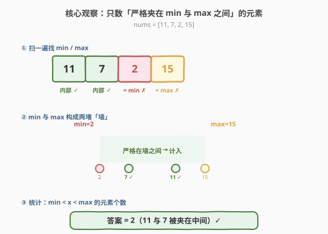
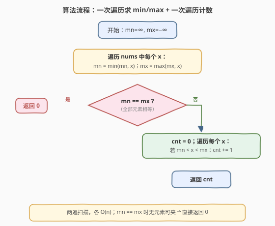
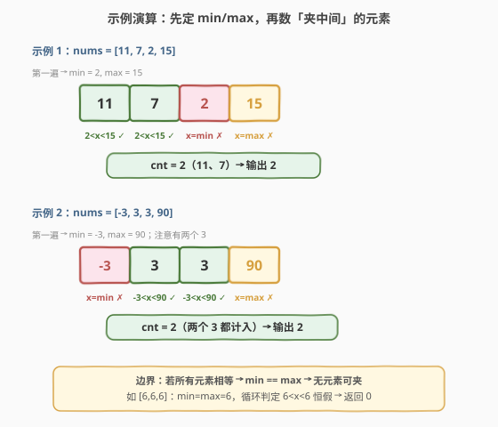

# 元素计数

- **题目名称**：元素计数
- **链接**：[2148. 元素计数](https://leetcode.cn/problems/count-elements-with-strictly-smaller-and-greater-elements/)
- **难度**：简单
- **标签**：数组、一次遍历

## 1. 题目概述

给你一个整数数组 `nums`，统计并返回在 `nums` 中同时**至少具有一个严格较小元素**和**一个严格较大元素**的元素数目。

**示例 1**：

```text
输入：nums = [11,7,2,15]
输出：2
解释：元素 7：严格较小元素是 2，严格较大元素是 11。
      元素 11：严格较小元素是 7，严格较大元素是 15。
      共计 2 个元素满足条件。
```

**示例 2**：

```text
输入：nums = [-3,3,3,90]
输出：2
解释：元素 3：严格较小元素是 -3，严格较大元素是 90。
      两个值为 3 的元素都满足，共计 2 个。
```

**约束条件**：

- $1 \leq \text{nums.length} \leq 100$
- $-10^5 \leq \text{nums[i]} \leq 10^5$

> 💡 **审题关键**：①「严格较小 / 严格较大」即不含等于——等于自身的元素不算；② 满足条件的元素，等价于**严格大于全局最小值**且**严格小于全局最大值**——因为只要存在一个更小、一个更大，那更小者必然 $\geq \min$、更大者必然 $\leq \max$，而严格性要求它们分别 $< x$ 与 $> x$，故 $x$ 必落在开区间 $(\min, \max)$ 内；③ 规模 $n \leq 100$ 极小，但面试应展示 $O(n)$ 最优解。

---

## 2. 解题思路

### 2.1 暴力思路：逐元素判定

对每个 `nums[i]`，再扫一遍数组检查「是否存在 `nums[j] < nums[i]`」与「是否存在 `nums[j] > nums[i]`」，两个条件都满足则计数 +1。

- **正确性**：直接翻译题意，完全正确。
- **效率**：双重循环 $O(n^2)$，对 $n \leq 100$ 可 AC，但面试中应指出可优化。
- **不足**：每个元素都重复扫描整个数组，没有利用「全局最小 / 最大」这一关键信息。

> ⚠️ 暴力法的根因是「**逐元素独立判断**」。若把视角从「每个元素看自己的邻居」抬升到「整个数组只需关心两个极端值」，复杂度立刻从 $O(n^2)$ 降到 $O(n)$。

### 2.2 核心观察：条件等价于「严格落在 (min, max) 开区间内」



设数组最小值为 $mn$、最大值为 $mx$。对任意元素 $x$：

- **存在严格较小元素** $\iff \exists\, y < x \iff x > mn$（因为 $mn$ 是全局最小，只要 $x$ 不等于 $mn$，就一定有 $mn < x$；若 $x = mn$，则没有任何元素比它更小）。
- **存在严格较大元素** $\iff \exists\, z > x \iff x < mx$（对称地，只要 $x \neq mx$ 就一定有 $x < mx$）。

两条件取交集，得到等价判定：

$$\boxed{x \text{ 满足条件} \iff mn < x < mx}$$

即**严格落在开区间 $(mn, mx)$ 内**。于是问题被简化为两步：

| 步骤 | 操作 | 说明 |
|------|------|------|
| ① | 一次遍历求 $mn = \min(\text{nums})$、$mx = \max(\text{nums})$ | 确定「两堵墙」 |
| ② | 再遍历一次，统计满足 $mn < x < mx$ 的元素个数 | 落在墙之间即计数 |

> 💡 **为什么是开区间？** 严格性使然。等于 $mn$ 的元素没有更小者（最左侧），等于 $mx$ 的元素没有更大者（最右侧），二者均被排除。重复出现的 $mn$、$mx$ 也一并排除——这正是示例 2 中虽有两个 3 被计入、但 $-3$ 与 $90$ 不计入的原因。

### 2.3 算法流程图



**完整步骤**：

1. 初始化 $mn = +\infty$、$mx = -\infty$。
2. 遍历 `nums`：对每个 $x$，更新 $mn = \min(mn, x)$、$mx = \max(mx, x)$。
3. **特判**：若 $mn = = mx$（即所有元素相等），开区间 $(mn, mx)$ 为空，直接返回 0。
4. 否则初始化 $cnt = 0$，再次遍历 `nums`：对每个 $x$，若 $mn < x < mx$ 则 $cnt \mathrel{+}= 1$。
5. 返回 $cnt$。

> ⚠️ **特判 $mn == mx$ 的意义**：逻辑上不加特判也正确——此时 $mn < x < mx$ 恒为假，$cnt$ 自然为 0。但显式特判能让「全相等」这一退化情形一目了然，代码意图更清晰，面试中值得点出。

### 2.4 示例演算

以两个示例逐步演算（含全相等边界）：



**示例 1** `nums = [11, 7, 2, 15]`：

- 第一遍：$mn = 2$，$mx = 15$。
- 第二遍逐元素判定 $2 < x < 15$：`11` ✓、`7` ✓、`2` ✗(=min)、`15` ✗(=max)。
- $cnt = 2$ ✓。

**示例 2** `nums = [-3, 3, 3, 90]`：

- 第一遍：$mn = -3$，$mx = 90$。
- 第二遍判定 $-3 < x < 90$：`-3` ✗(=min)、`3` ✓、`3` ✓、`90` ✗(=max)。
- 注意两个 3 **都被计入**——题问的是「元素数目」而非「不同值数目」，每个满足条件的元素都算一次。
- $cnt = 2$ ✓。

**边界** `nums = [6, 6, 6]`：$mn = mx = 6$，开区间为空，返回 0 ✓。

---

## 3. 参考代码

### 方法一：两遍遍历（$O(n)$ / $O(1)$，推荐）

### C++

```cpp
class Solution {
public:
    int countElements(vector<int>& nums) {
        int mn = INT_MAX, mx = INT_MIN;
        for (int x : nums) {
            mn = min(mn, x);
            mx = max(mx, x);
        }
        int cnt = 0;
        for (int x : nums) {
            if (mn < x && x < mx) ++cnt;
        }
        return cnt;
    }
};
```

### Python

```python
class Solution:
    def countElements(self, nums: list[int]) -> int:
        mn, mx = min(nums), max(nums)
        return sum(1 for x in nums if mn < x < mx)
```

> 💡 **写法要点**：① 求极值用一次遍历（C++ 手写循环 / Python 内建 `min`/`max`，均为 $O(n)$）；② 判定写成链式 `mn < x < mx`，Python 原生支持，语义清晰且避免 `mn < x and x < mx` 的冗余；③ Python 版用生成器 + `sum` 一行表达「计数」，简洁且空间 $O(1)$。

### 方法二：一遍遍历计数（$O(n)$ / $O(1)$，进阶）

若不要求显式特判全相等，可在求出 $mn$、$mx$ 后的同一遍里完成计数——但求极值与计数对同一元素存在依赖（必须先知道 $mn/mx$ 才能判定 $x$），**单趟无法完成**。不过可以省去显式特判，让 $mn == mx$ 时判定自然全假：

### C++

```cpp
class Solution {
public:
    int countElements(vector<int>& nums) {
        auto [mn, mx] = minmax_element(nums.begin(), nums.end());
        int cnt = 0;
        for (int x : nums) {
            if (*mn < x && x < *mx) ++cnt;
        }
        return cnt;
    }
};
```

> 💡 `std::minmax_element` 单趟同时返回最小、最大元素的迭代器，$O(n)$ 时间一次拿到两个极值，比分别调 `min_element` + `max_element`（两趟）更高效。`*mn == *mx` 时判定恒假，$cnt$ 自然为 0，无需特判。

---

## 4. 复杂度分析

| 维度 | 复杂度 | 说明 |
|------|--------|------|
| 时间复杂度 | $O(n)$ | 一次求极值 + 一次计数，共两趟遍历 |
| 空间复杂度 | $O(1)$ | 仅用 $mn$、$mx$、$cnt$ 三个变量 |

> 💡 **为何 $O(n)$ 已最优**：答案依赖于全局 $mn$ 与 $mx$，而求全局极值至少需读完整个数组一次（$\Omega(n)$）。计数同样需扫描全部元素。两趟合计 $2n$ 次比较，常数因子已很低，渐近意义上无法低于 $O(n)$。

---

## 5. 扩展：若「严格」改为「非严格」会怎样

若把题意改成「存在**非严格**较小元素（$\leq$）和**非严格**较大元素（$\geq$）」，则：

- 任意元素 $x$，至少有 $x \leq x$ 自身满足「非严格较大」与「非严格较小」。
- 因此**所有元素都满足条件**，答案恒为 $n$。

可见「严格」二字是本题唯一的题眼——它把开区间 $(mn, mx)$ 与闭区间 $[mn, mx]$ 区分开，让位于两端的极值元素被排除。这一细节也解释了为何 $n = 1$ 时答案为 0（唯一元素既是 min 也是 max，被排除）。

> 💡 面试中可主动追问：「如果允许等于会怎样？」「如果有第三大的边界呢？」——前者退化为常数答案，后者引向 [414. 第三大的数](https://leetcode.cn/problems/third-maximum-number/) 的「一趟维护 top-3 distinct」模式。

---

## 6. 面试要点

**Q1：为什么满足条件的元素等价于 $mn < x < mx$？**

> 设 $mn$、$mx$ 为全局最小、最大。「存在严格较小元素」要求 $x$ 不等于 $mn$（否则无更小者），即 $x > mn$；「存在严格较大元素」要求 $x$ 不等于 $mx$，即 $x < mx$。两者同时成立即 $mn < x < mx$。这一等价把「逐元素找邻居」降为「全局两个极值定边界」。

**Q2：$mn == mx$ 时为什么返回 0？需要特判吗？**

> $mn == mx$ 意味着所有元素相等，开区间 $(mn, mx)$ 为空，判定 $mn < x < mx$ 对任意 $x$ 恒假，$cnt$ 自然为 0。逻辑上无需特判，但显式写出可提升可读性。面试中两种写法都接受，关键是能说清「全相等退化情形」。

**Q3：示例 2 中两个 3 为什么都计入？**

> 题目问的是「元素数目」而非「不同值的数目」。每个满足 $mn < x < mx$ 的元素都计数一次，与值是否重复无关。两个 3 都落在 $(-3, 90)$ 内，故都计入，答案为 2。

**Q4：能否在一趟遍历内同时求极值并计数？**

> 不能。计数判定 $mn < x < mx$ 依赖于已知 $mn$、$mx$，而它们只有在扫完整个数组后才能确定。因此至少需要两趟：第一趟求极值，第二趟计数。不过可用 `std::minmax_element` 把求极值合并为单趟，整体仍是 $O(n)$。

**Q5：$n = 1$ 时结果是什么？**

> $n = 1$ 时该唯一元素既是 $mn$ 也是 $mx$，$mn < x < mx$ 即 $x < x$ 恒假，返回 0。这与「至少需要一个严格更小、一个严格更大」的题意一致——单元素数组里不存在「另一个」元素。

> 💡 **一句话总结**：求全局 $mn$、$mx$，统计满足 $mn < x < mx$ 的元素个数即可，$O(n)$ / $O(1)$。题眼在于识破「严格」二字把判定收敛到开区间 $(mn, mx)$。

---

## 7. 同类练习题

- [747. 至少是其他数字两倍的最大数](https://leetcode.cn/problems/largest-number-at-least-twice-of-others/)：一趟维护最大与次大，同样「找极端值」的一次遍历范式
- [414. 第三大的数](https://leetcode.cn/problems/third-maximum-number/)：一趟维护 top-3 distinct 极值，本题「维护极值」思路的进阶（从 2 个升到 3 个）
- [209. 长度最小的子数组](https://leetcode.cn/problems/minimum-size-subarray-sum/)（[题解](../0201-0300/209_长度最小的子数组.md)）：同为 $O(n)$ 一次遍历优化，对照「暴力 $O(n^2)$ → 最优 $O(n)$」的优化路径
- [1984. 学生分数的最小差值](https://leetcode.cn/problems/minimum-difference-between-highest-and-lowest-of-k-scores/)：排序后用「相邻 $k$ 个元素的 min/max 差」最小化，min/max 应用变体
