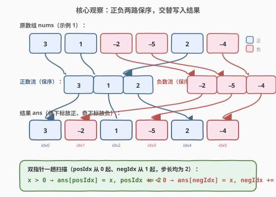
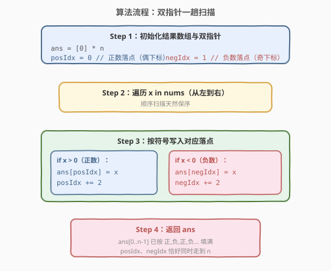
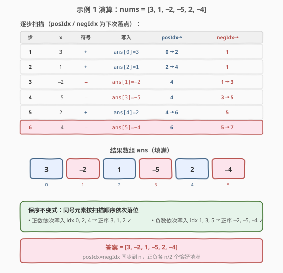

# LeetCode 按符号重排数组 题解

## 1. 题目概述

- **标题 / 题号**：按符号重排数组（#2149，medium）
- **链接**：https://leetcode.cn/problems/rearrange-array-elements-by-sign/
- **难度**：中等
- **标签**：数组、双指针、模拟

**题意**：给定一个下标从 **0** 开始的整数数组 `nums`，其长度为**偶数**，由**数目相等**的正整数和负整数组成。

要求重排 `nums`，使重排后的数组满足：

1. 任意**连续**的两个整数**符号相反**；
2. 对于符号相同的所有整数，**保留**它们在 `nums` 中的**相对顺序**；
3. 重排后的数组**以正整数开头**。

返回重排后的数组。**不需要原地进行修改**。

**示例 1**：

```text
输入：nums = [3,1,-2,-5,2,-4]
输出：[3,-2,1,-5,2,-4]
解释：
  正整数（保序）：[3,1,2]
  负整数（保序）：[-2,-5,-4]
  交错排列：[3,-2,1,-5,2,-4]
```

**示例 2**：

```text
输入：nums = [-1,1]
输出：[1,-1]
解释：唯一正数 1 开头，后接唯一负数 -1。
```

**约束**：

- $2 \le \text{nums.length} \le 2 \times 10^5$
- `nums.length` 是偶数
- $1 \le |\text{nums[i]}| \le 10^5$
- `nums` 由**相等数量**的正整数和负整数组成

> 💡 **审题关键**：① 「保留相对顺序」是本题核心约束——决定了不能用任意交换的 in-place 套路，必须按扫描顺序写入；② 「以正整数开头」+「连续两数符号相反」⇒ 结果下标奇偶性唯一确定：**偶下标必为正、奇下标必为负**；③ 正负数量相等（各 $n/2$ 个），因此两个落点序列恰好同时填满到 $n$。

## 2. 解题思路

### 2.1 暴力思路：先分组再交错拼接

最直观的做法：先一趟扫描把正数、负数分别收集到两个数组 `pos`、`neg`（扫描顺序天然保序），再交错写入结果——`ans[2k] = pos[k]`、`ans[2k+1] = neg[k]`。

- **正确性**：分组保序 + 偶奇落位，满足全部三条要求。
- **效率**：两趟 $O(n)$，空间 $O(n)$（两个分组数组 + 结果数组）。

> ⚠️ 分组法可读性高但**多用了一份分组空间**。注意到「偶下标放正、奇下标放负」这一奇偶性规律后，可以省去分组数组，**一趟扫描直接写入结果**。

### 2.2 核心观察：双指针一趟写入



由题意「以正整数开头 + 连续符号相反」可推出结果数组的**下标奇偶性**：

- 偶下标 `0, 2, 4, …` 全部放**正数**；
- 奇下标 `1, 3, 5, …` 全部放**负数**。

又因「同号保序」，只需**从左到右扫描 `nums`**，遇到正数就写入下一个正数落点、遇到负数就写入下一个负数落点。用两个游标维护「下一个可写的偶/奇下标」：

$$\text{posIdx} \text{ 从 } 0 \text{ 起、步长 } 2 \quad;\quad \text{negIdx} \text{ 从 } 1 \text{ 起、步长 } 2$$

对每个 $x \in \text{nums}$：

$$\begin{cases}
x > 0 \;\Rightarrow\; \text{ans}[\text{posIdx}] = x,\; \text{posIdx} \mathrel{+}= 2 \\
x < 0 \;\Rightarrow\; \text{ans}[\text{negIdx}] = x,\; \text{negIdx} \mathrel{+}= 2
\end{cases}$$

> 💡 **为什么这样天然保序？** 扫描顺序即原数组顺序。同号元素按扫描先后写入**单调递增**的偶（或奇）下标序列，因此同号元素在结果中的相对次序与原数组一致。两个游标独立步进，互不干扰——这正是「两条独立队列合并」的简化版。

> ⚠️ **正负数量相等是关键前提**：正数共 $n/2$ 个，恰好填满 $0, 2, \dots, n-2$；负数共 $n/2$ 个，恰好填满 $1, 3, \dots, n-1$。扫描结束后 `posIdx` 与 `negIdx` 同时到达 $n$，数组无空位。

### 2.3 算法流程图



**完整步骤**：

1. **初始化**：创建长度为 $n$ 的结果数组 `ans`；`posIdx = 0`（正数落点）、`negIdx = 1`（负数落点）。
2. **扫描**：`for x in nums`（从左到右）：
   - 若 $x > 0$：`ans[posIdx] = x`，`posIdx += 2`；
   - 若 $x < 0$：`ans[negIdx] = x`，`negIdx += 2`。
3. **返回 `ans`**：数组已按 `正,负,正,负,…` 填满。

> 💡 **无需越界判断**：题面保证正负数量相等，两个游标在扫描结束时恰好走到 $n$，中途不会越界。若输入不满足「正负等量」，则需额外校验。

### 2.4 示例演算

以示例 1（`nums = [3,1,-2,-5,2,-4]`）逐步演算，跟踪 `posIdx` / `negIdx` 的「下次落点」：



| 步 | $x$ | 符号 | 写入 | posIdx→ | negIdx→ | 说明 |
|----|-----|------|------|---------|---------|------|
| 1 | 3 | + | ans[0]=3 | 0→2 | 1 | 首个正数落偶下标 0 |
| 2 | 1 | + | ans[2]=1 | 2→4 | 1 | 第二个正数落 2 |
| 3 | −2 | − | ans[1]=−2 | 4 | 1→3 | 首个负数落奇下标 1 |
| 4 | −5 | − | ans[3]=−5 | 4 | 3→5 | 第二个负数落 3 |
| 5 | 2 | + | ans[4]=2 | 4→6 | 5 | 第三个正数落 4 |
| 6 | −4 | − | ans[5]=−4 | 6 | 5→7 | 第三个负数落 5（填满） |

**答案 = `[3,−2,1,−5,2,−4]`** ✓

> 💡 **观察正数流**：写入顺序 idx `0→2→4`，对应值 `3,1,2`，与原数组正数出现顺序一致 ✓；**负数流**：写入顺序 idx `1→3→5`，对应值 `−2,−5,−4`，同样保序 ✓。

## 3. 参考代码

### C++

```cpp
class Solution {
public:
    vector<int> rearrangeArray(vector<int>& nums) {
        int n = nums.size();
        vector<int> ans(n);
        int posIdx = 0, negIdx = 1;
        for (int x : nums) {
            if (x > 0) {
                ans[posIdx] = x;
                posIdx += 2;
            } else {
                ans[negIdx] = x;
                negIdx += 2;
            }
        }
        return ans;
    }
};
```

### Python

```python
class Solution:
    def rearrangeArray(self, nums: List[int]) -> List[int]:
        n = len(nums)
        ans = [0] * n
        pos_idx, neg_idx = 0, 1
        for x in nums:
            if x > 0:
                ans[pos_idx] = x
                pos_idx += 2
            else:
                ans[neg_idx] = x
                neg_idx += 2
        return ans
```

> 💡 **代码要点**：① 用 `posIdx`/`negIdx` 两个游标步长为 2，省去分组数组，**一趟写入**；② 无需边界判断（正负等量保证不越界）；③ `nums[i]` 可正可负但非零（$|\text{nums[i]}| \ge 1$），用 `x > 0` 即可判正。

> ⚠️ **不要原地修改 `nums`**：扫描时读写同一数组会破坏后续读取。题面也注明「不需要原地进行修改」，使用独立 `ans` 最稳妥。

## 4. 复杂度分析

| 维度 | 复杂度 | 说明 |
|------|--------|------|
| 时间复杂度 | $O(n)$ | 一趟线性扫描，每个元素 $O(1)$ 写入 |
| 空间复杂度 | $O(n)$ | 长度为 $n$ 的结果数组（不计输入） |

> 💡 **能否 $O(1)$ 额外空间？** 若**不要求保序**，可双指针 in-place 交换（奇下标误放正则与后面误放负的交换），参考 [922. 按奇偶排序数组 II](https://leetcode.cn/problems/sort-array-by-parity-ii/)。但本题**要求保序**，in-place 保序重排需复杂的旋转/块交换，工程价值低，$O(n)$ 辅助数组是公认最优解。

## 5. 扩展：不保序的 in-place 变体

若放宽「保序」约束（即只要正负交替、以正开头，同号顺序可变），可用**对撞双指针 in-place 修正**：

- `i` 从 0 扫描，发现 `ans[i]` 符号与奇偶性不符时（如偶下标放了负数），用 `j` 从右往左找一个「奇下标放了正数」的错位元素，交换 `ans[i]` 与 `ans[j]`。
- 复杂度 $O(n)$ 时间、$O(1)$ 额外空间。

```python
def rearrange_inplace(nums):
    n = len(nums)
    j = n - 1
    for i in range(n):
        if (i % 2 == 0) == (nums[i] > 0):
            continue  # 该位置符号正确
        while (j % 2 == 0) == (nums[j] > 0):
            j -= 1    # 找一个同样错位的对端
        nums[i], nums[j] = nums[j], nums[i]
    return nums
```

> ⚠️ 该变体**不保序**，仅适用于 [922. 按奇偶排序数组 II](https://leetcode.cn/problems/sort-array-by-parity-ii/) 这类只要求「按奇偶下标分类」的题目。本题明确要求保序，**不能**用此法。

## 6. 面试要点

**Q1：为什么用两个游标步长为 2，而不是先分组再交错？**

> 两个游标直接指向结果的偶/奇下标，扫描到元素即时落位，省去了 `pos`/`neg` 两个分组数组和第二趟拼接。本质是把「分组」与「交错」合并成一步，常数因子更小、代码更短。

**Q2：如何保证「同号保序」？**

> 扫描顺序即原数组顺序。同号元素被依次写入**单调递增**的偶（或奇）下标序列，因此同号元素在结果中的相对次序与原数组一致。两个游标独立步进、互不干扰，是「两条队列合并」的特例。

**Q3：为什么不需要越界判断？**

> 题面保证正负数量相等（各 $n/2$ 个）。正数恰好填满偶下标 $0,2,\dots,n-2$，负数恰好填满奇下标 $1,3,\dots,n-1$。扫描结束 `posIdx` 与 `negIdx` 同时到达 $n$，无中途越界。

**Q4：本题与 922「按奇偶排序数组 II」的异同？**

> 同：都是「按下标奇偶性分类放置」，结果偶/奇下标固定放某一类。异：922 只要求**分类**、**不保序**，可用 in-place 对撞交换做到 $O(1)$ 额外空间；2149 要求**保序**，必须借助 $O(n)$ 辅助数组按扫描顺序写入。

**Q5：如果输入不保证正负数量相等怎么办？**

> 需在扫描前先统计正负个数，若不等则按题意返回错误或采取退化策略（如某类先用完则剩余位置全填另一类，但此时无法满足「连续符号相反」）。本题约束已保证等量，无需处理。

## 同类练习题

| # | 题目 | 与本题的关联 |
|---|------|-------------|
| 922 | [按奇偶排序数组 II](https://leetcode.cn/problems/sort-array-by-parity-ii/) | 按下标奇偶性分类但不保序，可用 in-place 对撞交换做到 $O(1)$ 额外空间——对照理解「保序 vs 不保序」对空间的影响 |
| 21 | [合并两个有序链表](https://leetcode.cn/problems/merge-two-sorted-lists/) | 两条独立序列按序合并的鼻祖——本题「正负两路保序交错」是其数组版简化 |
| 88 | [合并两个有序数组](https://leetcode.cn/problems/merge-sorted-array/) | 双指针归并写入——体会「两个游标各自步进、按条件写入目标位」的通用模式 |
| 876 | [链表的中间结点](https://leetcode.cn/problems/middle-of-the-linked-list/) | 快慢双指针步长差——同族「多游标协同」思想的不同应用 |
| 2140 | [解决智力问题](https://leetcode.cn/problems/solving-questions-with-brainpower/) | 同为 21xx 区间的线性扫描题，对照体会「一趟扫描 + 游标维护」在不同场景的迁移 |
