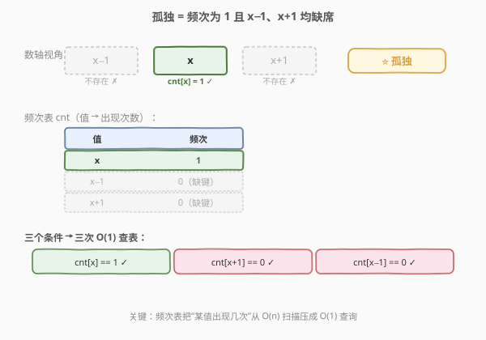
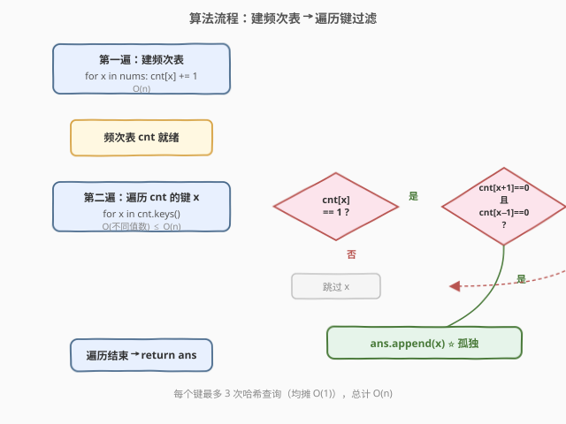
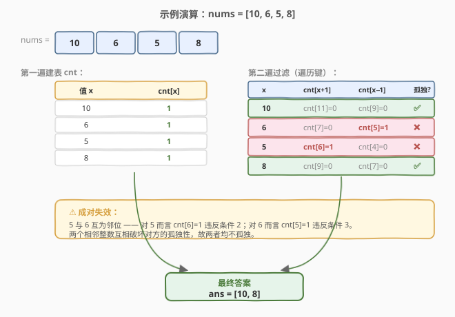

# 找出数组中的所有孤独数字

- **题目名称**：找出数组中的所有孤独数字
- **链接**：[2150. 找出数组中的所有孤独数字](https://leetcode.cn/problems/find-all-lonely-numbers-in-the-array/)
- **难度**：中等
- **标签**：数组、哈希表、计数

## 1. 题目概述

给定一个整数数组 `nums`。如果数字 `x` 满足以下**三个条件**，则称其为**孤独数字**：

1. `x` 在数组中**恰好出现一次**（频次为 1）；
2. 数组中**不存在** `x + 1`；
3. 数组中**不存在** `x - 1`。

返回 `nums` 中所有孤独数字，**顺序任意**。

**示例 1**：

```text
输入：nums = [10,6,5,8]
输出：[10,8]
解释：
- 10 出现 1 次，且 9、11 均不在数组中 → 孤独
- 6 出现 1 次，但 5 在数组中 → 不孤独
- 5 出现 1 次，但 6 在数组中 → 不孤独
- 8 出现 1 次，且 7、9 均不在数组中 → 孤独
```

**示例 2**：

```text
输入：nums = [1,3,5,3]
输出：[1,5]
解释：
- 1 出现 1 次，且 0、2 均不在数组中 → 孤独
- 3 出现 2 次 → 不孤独（频次不为 1）
- 5 出现 1 次，且 4、6 均不在数组中 → 孤独
```

**约束条件**：

- $1 \le$ `nums.length` $\le 10^5$
- $0 \le$ `nums[i]` $\le 10^6$

> 💡 本题是典型的「**按值计数 + 邻位存在性判定**」问题。三个条件本质都依赖「某个值出现几次」——而哈希表（频次表）正是把「查某个值出现次数」从 $O(n)$ 压到 $O(1)$ 的标准工具。先一次遍历建频次表，再一次遍历按条件过滤即可，整体 $O(n)$。

---

## 2. 解题思路

### 2.1 暴力思路：对每个元素全数组扫描

最直观的做法：对 `nums` 中每个元素 `x`，再扫一遍整个数组，分别统计 `x`、`x+1`、`x-1` 出现的次数，然后判定三个条件。

```text
for each x in nums:
    cnt_x = cnt_x1 = cnt_x_1 = 0
    for y in nums:
        if y == x:    cnt_x   += 1
        if y == x+1:  cnt_x1  += 1
        if y == x-1:  cnt_x_1 += 1
    if cnt_x == 1 and cnt_x1 == 0 and cnt_x_1 == 0:
        ans.append(x)
```

时间 $O(n^2)$。$n = 10^5$ 时约 $10^{10}$ 次比较，**超时**。

> ⚠️ 暴力的问题：对每个 `x` 都重复扫全数组统计频次，没有**复用**已统计的信息。突破口是观察——三个条件只关心「某值出现几次」，与下标无关。把「按位置遍历」换成「按值聚合」即可一次建表、多次 $O(1)$ 查询。

### 2.2 核心观察：频次表把存在性查询降到 O(1)



关键直觉：孤独的三个条件全部可转化为「**某值在频次表中的取值**」：

| 条件 | 频次表判定 |
|------|-----------|
| `x` 恰好出现一次 | `cnt[x] == 1` |
| `x+1` 不存在 | `cnt[x+1] == 0`（或缺键） |
| `x-1` 不存在 | `cnt[x-1] == 0`（或缺键） |

因此只需**两遍遍历**：

1. **第一遍建表**：扫 `nums`，`cnt[x] += 1`，得到「值 → 频次」映射。
2. **第二遍过滤**：遍历 `cnt` 的每个键 `x`，若 `cnt[x] == 1` 且 `cnt[x+1] == 0` 且 `cnt[x-1] == 0`，则 `x` 孤独，加入答案。

> 💡 **为什么遍历 `cnt` 的键而非 `nums`？** 若 `x` 出现多次（`cnt[x] > 1`），它必不孤独，遍历 `nums` 时会对同一个 `x` 重复判定，浪费 $O(\text{频次})$ 次。遍历 `cnt` 的键保证每个不同值只判定一次，总判定次数 $O(\text{不同值数}) \le O(n)$。

> ⚠️ **第二遍遍历的对象**：必须遍历 `cnt` 的**键**（即数组中出现过的不同值），而非 `nums` 本身。因为即便 `x+1`、`x-1` 不在 `cnt` 里（缺键即频次为 0），我们要判定的候选 `x` 仍必须是数组中出现过的值——遍历 `cnt` 的键天然满足这一前提。

### 2.3 算法流程图



**完整步骤**：

1. **建频次表**：遍历 `nums`，对每个 `x` 执行 `cnt[x] += 1`。
2. **过滤孤独数字**：遍历 `cnt` 的每个键 `x`：
   - 若 `cnt[x] == 1` 且 `cnt[x+1] == 0` 且 `cnt[x-1] == 0`，将 `x` 加入答案。
3. 返回答案（顺序任意）。

> 💡 **边界处理**：当 `x = 0` 时 `x - 1 = -1`，当 `x = 10^6` 时 `x + 1 = 10^6 + 1`。哈希表实现下缺键自动视为 0，无需特判；若用值域数组实现，需保证下标范围覆盖 `[−1, 10^6 + 1]`（详见第 5 节扩展）。

### 2.4 示例演算

以 `nums = [10,6,5,8]` 为例：



**第一遍建表**：

| 值 `x` | 频次 `cnt[x]` |
|--------|--------------|
| 10 | 1 |
| 6 | 1 |
| 5 | 1 |
| 8 | 1 |

**第二遍过滤**（遍历键）：

| 键 `x` | `cnt[x]==1`? | `cnt[x+1]` | `cnt[x-1]` | 孤独? | 说明 |
|--------|--------------|-----------|-----------|-------|------|
| 10 | ✅ | `cnt[11]=0` | `cnt[9]=0` | ✅ | 邻位均不存在 |
| 6 | ✅ | `cnt[7]=0` | `cnt[5]=1` | ❌ | `5` 存在，违反条件 3 |
| 5 | ✅ | `cnt[6]=1` | `cnt[4]=0` | ❌ | `6` 存在，违反条件 2 |
| 8 | ✅ | `cnt[9]=0` | `cnt[7]=0` | ✅ | 邻位均不存在 |

最终答案 `[10, 8]`，与示例一致。

> 💡 注意 `5` 与 `6` 互为邻位，**互相**破坏对方的孤独性——这是本题最常见的「成对失效」模式：只要两个相邻整数都出现，它们就都不孤独（无论各自频次是否为 1）。

---

## 3. 参考代码

### C++

```cpp
// 找出数组中的所有孤独数字.cpp —— 频次表 + 邻位存在性判定
// 编译: g++ -O2 -std=c++17 找出数组中的所有孤独数字.cpp -o lonely
#include <vector>
#include <unordered_map>
using namespace std;

class Solution {
  public:
    vector<int> findLonely(vector<int>& nums) {
        unordered_map<int, int> cnt;     // 值 -> 频次
        cnt.reserve(nums.size());
        for (int x : nums) cnt[x]++;     // 第一遍：建频次表

        vector<int> ans;
        for (auto& [x, c] : cnt) {       // 第二遍：遍历键过滤
            if (c == 1 && cnt[x + 1] == 0 && cnt[x - 1] == 0) {
                ans.push_back(x);
            }
        }
        return ans;
    }
};
```

### Python

```python
class Solution:
    def findLonely(self, nums: List[int]) -> List[int]:
        from collections import Counter

        cnt = Counter(nums)             # 第一遍：建频次表
        ans = []
        for x, c in cnt.items():        # 第二遍：遍历键过滤
            if c == 1 and cnt[x + 1] == 0 and cnt[x - 1] == 0:
                ans.append(x)
        return ans
```

> 💡 **实现细节**：① `Counter` / `unordered_map` 对缺键返回 `0`（Python 的 `Counter` 缺键返回 0；C++ 的 `unordered_map::operator[]` 缺键会插入 0），故 `cnt[x+1] == 0` 直接判断邻位不存在，无需先 `count` 再取值。② C++ 用 `cnt.reserve(nums.size())` 预分配桶减少 rehash。③ 遍历 `cnt` 的键而非 `nums`，避免对重复值重复判定。

---

## 4. 复杂度分析

| 维度 | 复杂度 | 说明 |
|------|--------|------|
| **时间复杂度** | $O(n)$ | 第一遍建表 $n$ 次哈希插入；第二遍遍历至多 $n$ 个不同键，每次 $O(1)$ 查邻位。总计 $O(n)$ |
| **空间复杂度** | $O(n)$ | 频次表最多存 $n$ 个不同值（最坏所有元素互异） |

> ⚠️ 虽然第二遍对每个键查了 `cnt[x+1]` 与 `cnt[x-1]` 两次哈希查询，但哈希查询均摊 $O(1)$，总查询数 $\le 2n$，不影响 $O(n)$ 渐近复杂度。若用值域数组实现（见第 5 节），常数可进一步降低。

---

## 5. 扩展：值域数组替代哈希表

题目约束 $0 \le$ `nums[i]` $\le 10^6$，值域已知且不大。可用长度为 $10^6 + 3$ 的数组代替哈希表（下标偏移 1 容纳 `x - 1 = -1` 与 `x + 1 = 10^6 + 1`）：

```cpp
class Solution {
  public:
    vector<int> findLonely(vector<int>& nums) {
        const int OFFSET = 1;                 // 下标 = 值 + 1，容纳 -1 与 1e6+1
        static int cnt[1000003];              // 覆盖 [-1, 1e6+1]
        memset(cnt, 0, sizeof(cnt));

        for (int x : nums) cnt[x + OFFSET]++; // 建表

        vector<int> ans;
        // 用 seen 集合去重，避免对同一值重复判定
        unordered_set<int> seen(nums.begin(), nums.end());
        for (int x : seen) {
            if (cnt[x + OFFSET] == 1 &&
                cnt[x + 1 + OFFSET] == 0 &&
                cnt[x - 1 + OFFSET] == 0) {
                ans.push_back(x);
            }
        }
        return ans;
    }
};
```

> 💡 值域数组的下标范围需覆盖 `[-1, 10^6 + 1]`（即 `x - 1` 与 `x + 1` 的极端值），故数组长度取 $10^6 + 3$、下标偏移 1。`static int` 配合 `memset` 清零避免栈溢出（4MB 数组放栈上可能爆栈）。

**两种实现对比**：

| 实现 | 时间 | 空间 | 适用场景 |
|------|------|------|----------|
| 哈希表 | $O(n)$ | $O(n)$ | 值域未知或很大、通用 |
| 值域数组 | $O(n + V)$ | $O(V)$ | 值域小且已知，常数更小 |

本题 $V = 10^6$，值域数组空间约 4MB（`int` 数组），可接受；但哈希表实现更简洁通用，是面试首选。

---

## 6. 面试要点

1. **为什么遍历 `cnt` 的键而非 `nums`？**

   - 若 `x` 出现 $k$ 次（$k > 1$），它必不孤独。遍历 `nums` 时会对同一个 `x` 重复判定 $k$ 次，浪费 $O(k)$ 次查询；遍历 `cnt` 的键保证每个不同值只判定一次，总判定次数 $O(\text{不同值数}) \le O(n)$。两者结果相同（重复值本就被滤掉），但遍历键更高效。

2. **为什么 `cnt[x+1] == 0` 能直接判定 `x+1` 不存在？**

   - 频次表只记录数组中出现过的值。若 `x+1` 出现过，`cnt[x+1] >= 1`；若没出现过，哈希表缺键（`Counter` 返回 0、`unordered_map::operator[]` 插入 0），`cnt[x+1] == 0`。故「频次为 0」与「不在数组中」等价。

3. **`5` 和 `6` 互相破坏孤独性，这种「成对失效」如何理解？**

   - 孤独要求 `x+1` 与 `x-1` 都不存在。若 `5` 与 `6` 同时出现，则对 `5` 而言 `cnt[6] > 0`（违反条件 2），对 `6` 而言 `cnt[5] > 0`（违反条件 3）。两个相邻整数互相成为对方的「邻位存在证据」，导致两者都不孤独——无论各自频次是否为 1。这是「连续整数段」失效的根基：任意长度 $\ge 2$ 的连续整数段内，每个数都有邻位存在，全部不孤独。

4. **哈希表 vs 值域数组，如何选择？**

   - 哈希表：$O(n)$ 时间、$O(n)$ 空间，不依赖值域，通用。值域数组：$O(n + V)$ 时间、$O(V)$ 空间，当值域 $V$ 小且已知时常数更小。本题 $V = 10^6$，两者皆可；若 $V$ 达 $10^9$（如题面改为 `nums[i] <= 10^9`），只能用哈希表。面试默认哈希表，再提值域数组作为优化延伸。

5. **如果改问「孤独数字的个数」而非列表，有更快做法吗？**

   - 渐近复杂度不变，仍 $O(n)$——必须先建频次表才能判定每个值。但可省去答案数组的构建，遍历键时计数即可。若值域小，值域数组的常数优势在「只计数」场景下更明显。

> 💡 **一句话总结**：2150 是「按值计数 + 邻位存在性判定」的招牌题——三个孤独条件全部可由频次表 $O(1)$ 表达，两遍遍历 $O(n)$ 解决。核心是把「位置无关的存在性查询」交给哈希表，与 2006（查配对值频次）、2341（按值计数组对）同属「值域聚合计数」家族。

---

## 7. 同类练习题

- [2006. 差的绝对值为 K 的数对数目](https://leetcode.cn/problems/count-number-of-pairs-with-absolute-difference-k/)（[题解](../2001-2100/2006_差的绝对值为K的数对数目.md)）：哈希表计数 + 查配对值频次，同属「按值聚合计数」家族，母题
- [2341. 数组能形成多少数对](https://leetcode.cn/problems/maximum-number-of-pairs-in-array/)：按值计数后组对，频次表驱动判定，同套思路
- [219. 存在重复元素 II](https://leetcode.cn/problems/contains-duplicate-ii/)：哈希表维护值与最近下标，同属「遍历查表」家族
- [1207. 独一无二的出现次数](https://leetcode.cn/problems/unique-number-of-occurrences/)：频次表 + 频次的频次判定，本题「频次为 1」条件的延伸
- [2248. 多个数组求交集](https://leetcode.cn/problems/intersection-of-multiple-arrays/)：按值计数 + 频次等于数组数的判定，同属「频次过滤」套路
