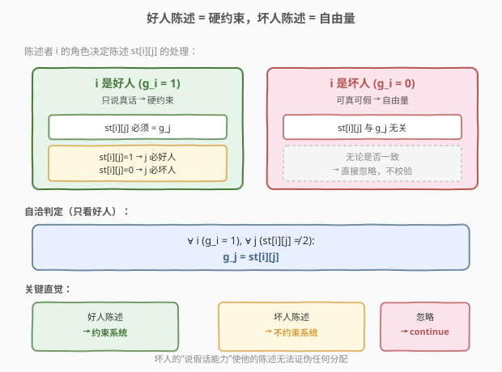
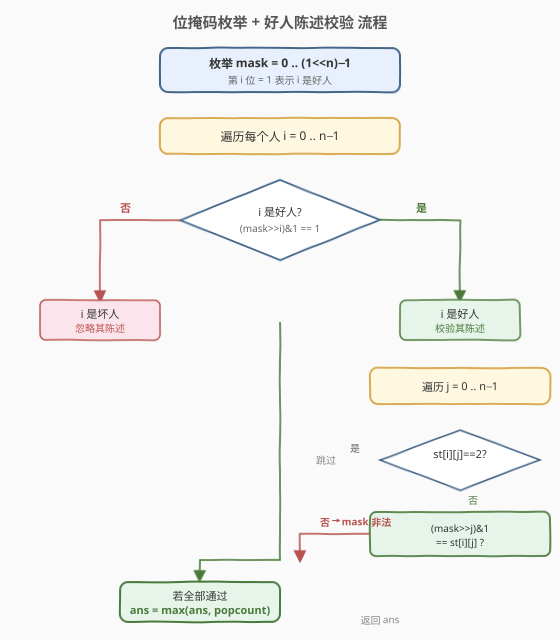
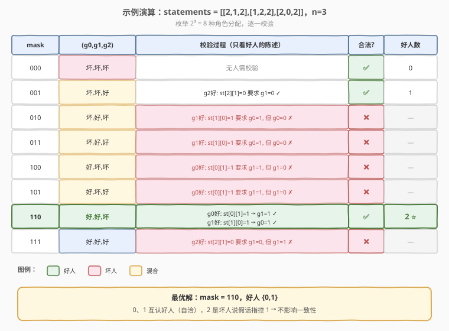

# LeetCode 基于陈述的最大善良人数 题解

## 1. 题目概述

- **标题 / 题号**：基于陈述的最大善良人数（#2151，hard）
- **链接**：https://leetcode.cn/problems/maximum-good-people-based-on-statements/
- **难度**：困难
- **标签**：位运算、枚举、状态压缩、回溯

**题意**：游戏中存在两种角色：

- **好人**：该角色**只说真话**。
- **坏人**：该角色**可能说真话，也可能说假话**。

给你一个下标从 0 开始的二维整数数组 `statements`，大小为 $n \times n$，表示 $n$ 个玩家对彼此角色的陈述。`statements[i][j]` 取值：

- `0`：`i` 的陈述认为 `j` 是坏人。
- `1`：`i` 的陈述认为 `j` 是好人。
- `2`：`i` 没有对 `j` 作出陈述。

另外，玩家不会对自己进行陈述，即对所有 $0 \le i < n$ 都有 `statements[i][i] = 2`。返回可以认为是**好人**的**最大**数目。

**示例 1**：

```text
输入：statements = [[2,1,2],[1,2,2],[2,0,2]]
输出：2
解释：
- 0 认为 1 是好人；1 认为 0 是好人；2 认为 1 是坏人。
- 假设 2 是坏人且说假话 → 1 是好人 → 1 说真话 → 0 也是好人。
- 此时好人集合 {0,1}，共 2 人，为最大可行解。
```

**示例 2**：

```text
输入：statements = [[2,0],[0,2]]
输出：1
解释：
- 0 认为 1 是坏人；1 认为 0 是坏人。
- 两人互相指控对方是坏人。若两人都是好人则矛盾（好人说真话却互指坏人）。
- 最多一人是好人（任选其一为好人，对方为坏人即可自洽）。
```

**约束**：

- $n = $ `statements.length` $= $ `statements[i].length`
- $2 \le n \le 15$
- `statements[i][j]` 的值为 `0`、`1` 或 `2`
- `statements[i][i] == 2`

> 💡 本题是典型的「**二角色陈述一致性 + 最大化好人**」问题。难点不在算法本身，而在**正确建模约束**：好人的陈述必须全部为真，坏人的陈述**完全自由**（既可真也可假），因此只需校验「好人」说的话与假设是否一致。$n \le 15$ 直接指向**位掩码枚举**所有 $2^n$ 种角色分配。

## 2. 解题思路

### 2.1 暴力思路：枚举所有角色分配并校验

最直观的做法：对 $n$ 个人，每人可能是好人或坏人，共 $2^n$ 种分配方案。逐一枚举每种方案，校验是否自洽，自洽则统计好人数，取最大。

```text
for mask in 0 .. (1<<n)-1:
    ok = true
    for i in 0 .. n-1:
        if mask 的第 i 位为 1 (i 是好人):
            for j in 0 .. n-1:
                if statements[i][j] != 2:
                    # i 说真话 → j 的实际角色必须等于 statements[i][j]
                    if mask 的第 j 位 != statements[i][j]:
                        ok = false
    if ok:
        ans = max(ans, popcount(mask))
```

$2^{15} = 32768$，每次校验 $O(n^2)$，总复杂度 $O(2^n \cdot n^2) \approx 32768 \times 225 \approx 7 \times 10^6$，**完全可接受**。

> ⚠️ 暴力的**关键正确性**在于：校验时**只看好人**的陈述。坏人的陈述不参与约束——坏人既可说真话也可说假话，无论他说什么都无法证伪其坏人身份。这是本题最容易踩的坑：若把坏人的陈述也纳入校验，会错误地排除可行解。

### 2.2 核心观察：好人陈述是硬约束，坏人陈述是自由量



关键直觉：把每个人的角色看作**未知量** $g_i \in \{0, 1\}$（1=好人）。则每条陈述 `statements[i][j]` 的约束分两类：

| 陈述者 `i` | 约束 | 处理 |
|-----------|------|------|
| `i` 是好人（$g_i = 1$） | `statements[i][j]` 必须**等于** $g_j$（说真话） | **硬约束**，必须满足 |
| `i` 是坏人（$g_i = 0$） | `statements[i][j]` 与 $g_j$ **无关系**（可真可假） | **忽略**，不校验 |

因此「一组分配是否自洽」的判定**只取决于好人说了什么**：

$$\text{自洽} \iff \forall i\,(g_i = 1),\ \forall j\,(statements[i][j] \ne 2):\ g_j = statements[i][j]$$

> 💡 **为什么坏人陈述可忽略？** 坏人的定义是「可能说真话也可能说假话」，即他的陈述**不构成任何承诺**。无论 `statements[i][j]` 与 $g_j$ 是否一致，都能用「坏人这次说了假话/真话」来解释，不会产生矛盾。这是「自由量」的本质——它的取值不约束系统。

> ⚠️ **对比 1823 约瑟夫环、526 优美排列**：本题的位掩码枚举与 526 类似（枚举子集后校验），但约束来源不同——526 校验「位置与值的关系」，本题校验「好人陈述与分配的一致性」。两者共享「枚举 → 校验 → 取最优」的骨架。

### 2.3 算法流程图



**完整步骤**：

1. **枚举掩码**：`mask` 从 `0` 到 `(1<<n) - 1`，第 `i` 位为 1 表示 `i` 是好人。
2. **校验自洽性**：对每个 `i`：
   - 若 `mask` 第 `i` 位为 0（`i` 是坏人），跳过。
   - 若 `mask` 第 `i` 位为 1（`i` 是好人），遍历 `j`：
     - 若 `statements[i][j] == 2`，跳过（无陈述）。
     - 否则要求 `((mask >> j) & 1) == statements[i][j]`，不满足则 `mask` 不合法，`break`。
3. **统计**：若 `mask` 合法，用 `popcount(mask)` 更新答案。
4. 返回最大值。

> 💡 **剪枝优化**（可选）：从大到小枚举 `mask`（好人多的先试），一旦遇到合法解立即返回——因为好人越多 `popcount` 越大，第一个合法的即最优。或枚举时按 `popcount` 降序。最坏复杂度不变，但平均更快。

### 2.4 示例演算

以 `statements = [[2,1,2],[1,2,2],[2,0,2]]`（$n=3$）为例，枚举 $2^3 = 8$ 种分配：



| 掩码 `mask` | 分配 `(g0,g1,g2)` | 校验过程 | 合法? | 好人数 |
|------------|------------------|---------|-------|--------|
| `000` (0) | 坏,坏,坏 | 无人需校验 | ✅ | 0 |
| `001` (1) | 坏,坏,**好** | `g2=1`：`st[2][1]=0` 要求 `g1=0` ✓ | ✅ | 1 |
| `010` (2) | 坏,**好**,坏 | `g1=1`：`st[1][0]=1` 要求 `g0=1`，但 `g0=0` ✗ | ❌ | — |
| `011` (3) | 坏,**好**,**好** | `g1=1`：`st[1][0]=1` 要求 `g0=1`，但 `g0=0` ✗ | ❌ | — |
| `100` (4) | **好**,坏,坏 | `g0=1`：`st[0][1]=1` 要求 `g1=1`，但 `g1=0` ✗ | ❌ | — |
| `101` (5) | **好**,坏,**好** | `g0=1`：`st[0][1]=1` 要求 `g1=1`，但 `g1=0` ✗ | ❌ | — |
| `110` (6) | **好**,**好**,坏 | `g0=1`：`st[0][1]=1` 要求 `g1=1` ✓；`g1=1`：`st[1][0]=1` 要求 `g0=1` ✓ | ✅ | **2** |
| `111` (7) | **好**,**好**,**好** | `g2=1`：`st[2][1]=0` 要求 `g1=0`，但 `g1=1` ✗ | ❌ | — |

合法解中最大好人数为 **2**（掩码 `110`），与示例一致。

> 💡 **观察掩码 `110`**：`g0=g1=1`（0、1 互认好人，自洽），`g2=0`（2 是坏人，他说 `1` 是坏人属说假话，符合坏人定义）。这正是示例解释中「2 是坏人且说假话」的方案。

## 3. 参考代码

### C++

```cpp
// 基于陈述的最大善良人数.cpp —— 位掩码枚举 + 好人陈述校验
// 编译: g++ -O2 -std=c++17 基于陈述的最大善良人数.cpp -o maxgood
#include <vector>
using namespace std;

class Solution {
  public:
    int maximumGood(vector<vector<int>>& statements) {
        int n = statements.size();
        int ans = 0;
        for (int mask = 0; mask < (1 << n); ++mask) {
            if (valid(statements, n, mask)) {
                ans = max(ans, __builtin_popcount(mask));
            }
        }
        return ans;
    }

  private:
    bool valid(const vector<vector<int>>& st, int n, int mask) {
        for (int i = 0; i < n; ++i) {
            if (!((mask >> i) & 1)) continue;     // i 是坏人，陈述忽略
            for (int j = 0; j < n; ++j) {
                if (st[i][j] == 2) continue;       // 无陈述
                // i 是好人 → j 的实际角色必须等于 st[i][j]
                if (((mask >> j) & 1) != st[i][j]) return false;
            }
        }
        return true;
    }
};
```

### Python

```python
class Solution:
    def maximumGood(self, statements: List[List[int]]) -> int:
        n = len(statements)

        def valid(mask: int) -> bool:
            for i in range(n):
                if not ((mask >> i) & 1):        # i 是坏人，陈述忽略
                    continue
                for j in range(n):
                    if statements[i][j] == 2:    # 无陈述
                        continue
                    # i 是好人 → j 的实际角色必须等于 statements[i][j]
                    if ((mask >> j) & 1) != statements[i][j]:
                        return False
            return True

        ans = 0
        for mask in range(1 << n):
            if valid(mask):
                ans = max(ans, mask.bit_count())
        return ans
```

> 💡 **实现细节**：① 校验函数 `valid` 只遍历好人 `i`，坏人直接 `continue`——这是正确性核心。② `((mask >> j) & 1)` 取 `j` 的角色（1=好人，0=坏人），与 `st[i][j]`（1=好人，0=坏人）直接比较，**编码天然一致**，无需转换。③ C++ 用 `__builtin_popcount`、Python 3.10+ 用 `int.bit_count()` 统计好人位数。④ `statements[i][i] == 2` 保证自陈述不触发校验。

## 4. 复杂度分析

| 维度 | 复杂度 | 说明 |
|------|--------|------|
| **时间复杂度** | $O(2^n \cdot n^2)$ | 枚举 $2^n$ 个掩码，每个掩码校验最坏 $n$ 个好人 × $n$ 个陈述。$n=15$ 时约 $7.4 \times 10^6$ 次操作 |
| **空间复杂度** | $O(n^2)$ | 存 `statements` 矩阵（输入本身），校验过程 $O(1)$ 额外空间 |

> ⚠️ **为何 $O(2^n \cdot n^2)$ 可接受？** $n \le 15$ 是关键——$2^{15} = 32768$，乘以 $n^2 = 225$ 得 $\approx 7.4 \times 10^6$，在现代 CPU 上毫秒级完成。这是「指数枚举」题目的典型甜区：$n \le 20$ 时 $2^n$ 仍可控（配合折半可到 $n \le 40$）。

> 💡 **剪枝后的实际复杂度**：若从大到小枚举 `mask` 并首次合法即返回，平均复杂度远低于上界。最坏情况（唯一解在 `mask` 最小处）仍为 $O(2^n \cdot n^2)$。

## 5. 扩展：回溯剪枝写法

位掩码枚举是「自底向上」穷举所有分配。也可写成**回溯**：逐人决定好人/坏人，每确定一个好人立即校验其陈述是否与已确定的角色冲突，冲突则剪枝。

```cpp
class Solution {
  public:
    int maximumGood(vector<vector<int>>& statements) {
        int n = statements.size();
        vector<int> role(n, -1);          // -1 未定，0 坏人，1 好人
        int ans = 0;
        dfs(statements, role, 0, 0, n, ans);
        return ans;
    }

  private:
    void dfs(const vector<vector<int>>& st, vector<int>& role,
             int i, int goodCnt, int n, int& ans) {
        if (i == n) { ans = max(ans, goodCnt); return; }

        // 分支 1：i 是坏人
        role[i] = 0;
        dfs(st, role, i + 1, goodCnt, n, ans);

        // 分支 2：i 是好人（需校验其陈述与已定角色一致）
        if (consistent(st, role, i, n)) {
            role[i] = 1;
            dfs(st, role, i + 1, goodCnt + 1, n, ans);
        }
        role[i] = -1;
    }

    bool consistent(const vector<vector<int>>& st, vector<int>& role, int i, int n) {
        for (int j = 0; j < n; ++j) {
            if (st[i][j] == 2) continue;
            if (role[j] != -1 && role[j] != st[i][j]) return false;
        }
        return true;
    }
};
```

> 💡 **回溯 vs 位掩码枚举**：两者本质相同（都是 $2^n$ 穷举），区别在于**剪枝时机**。位掩码枚举「先生成完整分配再校验」，回溯「边分配边校验，冲突即剪枝」。回溯平均更快（早剪枝），但代码更长；位掩码枚举更简洁，面试中更易一次写对。$n \le 15$ 下两者都毫秒级，选简洁的位掩码即可。

> ⚠️ **回溯的隐含约束**：`consistent` 只校验 `i`（新确定的好人）的陈述与**已确定**角色 `role[j] != -1` 的一致性。未确定的角色（`role[j] == -1`）暂不校验，待后续确定时再校验——这是「延迟约束」思想，保证不遗漏也不误判。

## 6. 面试要点

1. **为什么只校验好人的陈述，不校验坏人的？**

   - 好人的定义是「只说真话」，其陈述是**硬约束**：若 `i` 是好人且 `statements[i][j] = 1`，则 `j` 必须是好人，否则矛盾。坏人的定义是「可能说真话也可能说假话」，其陈述**不构成约束**——无论 `statements[i][j]` 与 `j` 的实际角色是否一致，都能用「坏人这次说了假话」解释，不会产生矛盾。因此校验只需针对好人。

2. **$n \le 15$ 为何指向位掩码枚举？**

   - $2^{15} = 32768$，是「指数枚举」的甜区（一般 $n \le 20$ 可接受）。配合每次 $O(n^2)$ 校验，总操作约 $7 \times 10^6$，毫秒级完成。题目刻意把 $n$ 压到 15 正是暗示此解法。若 $n$ 达 40，则需折半搜索（Meet in the Middle）。

3. **`((mask >> j) & 1) != st[i][j]` 这个比较为何直接成立？**

   - 题目编码天然对齐：`st[i][j] = 1` 表示 `i` 认为 `j` 是好人，`(mask >> j) & 1 = 1` 表示 `j` 是好人，两者语义一致，可直接比较。`st[i][j] = 0` 表示 `j` 是坏人，对应 `(mask >> j) & 1 = 0`。`st[i][j] = 2` 表示无陈述，已 `continue` 跳过。无需任何编码转换。

4. **回溯剪枝相比位掩码枚举有何优势？**

   - 回溯在「确定某人为好人」时立即校验其陈述与已定角色的一致性，冲突即剪枝，避免深入非法分支。位掩码枚举则先生成完整分配再整体校验。最坏复杂度相同（都是 $O(2^n \cdot n^2)$），但回溯平均更快。$n \le 15$ 下两者都够快，位掩码枚举代码更简洁、不易出错，面试首选。

5. **能否从大到小枚举 `mask` 提前返回？**

   - 可以。好人越多 `popcount` 越大，按 `popcount` 降序枚举，首个合法解即最优。实现上可按掩码数值降序（不严格按 `popcount`，但大掩码往往 `popcount` 也大），或预生成按 `popcount` 排序的掩码列表。最坏复杂度不变，平均加速明显。注意「降序数值」不等价于「降序 `popcount`」（如 `1000` 的 `popcount=1` 小于 `0111` 的 `popcount=3`），严格加速需按 `popcount` 排序。

> 💡 **一句话总结**：2151 是「位掩码枚举 + 一致性校验」的招牌题——核心是正确建模「好人陈述硬约束、坏人陈述自由」的约束体系，$n \le 15$ 的甜区让 $2^n$ 枚举成为自然选择。与 526（优美排列，枚举+校验）、1774（数组最接近目标值，子集枚举）同属「指数枚举」家族。

## 同类练习题

| # | 题目 | 与本题的关联 |
|---|------|-------------|
| 526 | [优美的排列](https://leetcode.cn/problems/beautiful-arrangement/)（[题解](../0501-0600/526_优美的排列.md)） | 状态压缩 DP / 回溯枚举排列并校验整除约束，同属「枚举 + 校验」家族，$n \le 15$ 甜区 |
| 1774 | [最接近目标价格的甜点成本](https://leetcode.cn/problems/closest-dessert-cost/) | 子集枚举 + 校验，指数枚举的另一变体，背包思路的对照 |
| 95 | [不同的二叉搜索树 II](https://leetcode.cn/problems/unique-binary-search-trees-ii/) | 递归枚举所有方案，与本题「枚举所有角色分配」同构 |
| 1239 | [串联字符串的最大长度](https://leetcode.cn/problems/maximum-length-of-a-concatenated-string-with-unique-characters/) | 位掩码枚举子集 + 校验唯一性，与本题「枚举 + 合法性校验」同套路 |
| 39 | [组合总和](https://leetcode.cn/problems/combination-sum/) | 回溯枚举 + 剪枝，第 5 节回溯写法的母题 |
