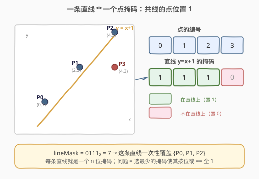
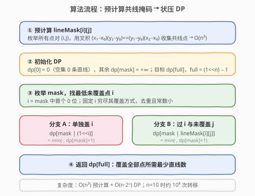
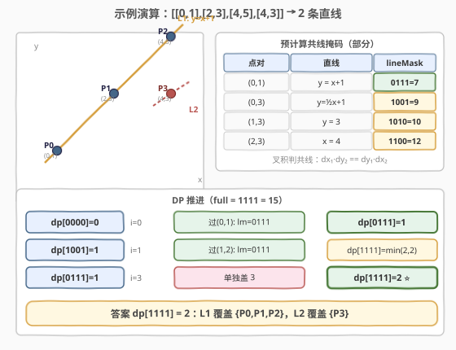

# LeetCode 穿过所有点所需的最少直线数量 题解

## 1. 题目概述

- **标题 / 题号**：穿过所有点所需的最少直线数量（#2152，medium）
- **链接**：https://leetcode.cn/problems/minimum-number-of-lines-to-cover-points/
- **难度**：中等
- **标签**：位运算、几何、动态规划、状态压缩、回溯、数组、哈希表、数学

**题意**：给定平面上 `n` 个**互不相同**的点 `points`，其中 `points[i] = [xi, yi]`。一条直线「覆盖」一个点，当且仅当该点落在这条直线上。返回**能够覆盖所有给定点**的**最少直线数目**。

**示例 1**：

```text
输入：points = [[0,1],[2,3],[4,5],[4,3]]
输出：2
解释：
  - 直线 y = x + 1 覆盖 [0,1]、[2,3]、[4,5]（三点共线）；
  - 剩下的 [4,3] 单独再画一条直线覆盖。
  两条直线即可覆盖全部 4 个点。
```

**示例 2**：

```text
输入：points = [[2,3],[2,4],[2,5]]
输出：1
解释：三点 x 坐标都为 2，位于同一条竖直直线 x = 2 上，一条直线即可。
```

**示例 3**：

```text
输入：points = [[0,0],[1,1],[2,2],[3,3],[4,5],[5,6],[6,7]]
输出：2
解释：
  - [0,0]、[1,1]、[2,2]、[3,3] 在 y = x 上；
  - [4,5]、[5,6]、[6,7] 在 y = x + 1 上。
  两条直线覆盖全部 7 个点。
```

**约束**：

- $1 \le$ `points.length` $\le 10$
- `points[i].length == 2`
- $-10 \le x_i, y_i \le 10$
- 所有点两两不同

> ⚠️ **关键信号**：`n ≤ 10` 且求「最少」——这是**状压 DP（bitmask DP）**的标志性数据范围：$2^{10} = 1024$ 个状态，恰好落在「可以枚举所有子集」的甜区。题目本质是**集合覆盖**（用最少的「共线点集合」盖住全部点），而每条直线对应的「点集合」可用位掩码表示，故状压 DP 是天然解法。

> 💡 **答案上界**：每条直线至少覆盖 2 个点，最坏情况下把点两两配对，故答案最多 $\lceil n/2 \rceil$。这一上界可用于剪枝（见第 5 节回溯版）。

## 2. 解题思路

### 2.1 暴力思路：枚举直线组合

最朴素的想法：先枚举所有可能的直线（每条直线由两点确定，至多 $\binom{n}{2}$ 条），再从这些直线里挑一个**最小子集**，使其并集覆盖全部 `n` 个点。

```text
生成所有直线（每条 = 一个点掩码）
在直线集合里搜索最小子集使其 OR == full
```

这是经典的**集合覆盖问题**（NP-hard），但 $n \le 10$ 让它变得可解：直线数 $\le 45$，用状压 DP 或回溯 + 剪枝都能在毫秒内出解。

> ⚠️ 暴力的瓶颈不在「生成直线」（$O(n^3)$ 即可），而在「挑最小子集」——若不记忆化，回溯会反复求解同一个「剩余待覆盖集合」。突破口：**状态 = 已覆盖的点集合（掩码）**，用 DP 记忆化避免重复。

### 2.2 核心观察：用位掩码编码「已覆盖点集合」

把 `n` 个点编号为 `0..n-1`，用一个 `n` 位二进制整数 `mask` 表示「**已经被直线覆盖的点集合**」：

- `mask` 第 `i` 位为 `1` → 点 `i` 已被某条直线覆盖；
- `mask == (1<<n) - 1`（全 `1`）→ 所有点都被覆盖，达成目标。

每条直线对应一个**点掩码** `line_mask`（该直线覆盖的所有点的位或）。于是问题转化为：

> 每步选一条直线 `line_mask`，把当前 `mask` 与之按位或，问从 `mask = 0` 走到 `mask = full` 至少需要多少步？



**共线判定（避免浮点）**：三点 $(x_0,y_0),(x_1,y_1),(x_2,y_2)$ 共线，等价于**叉积为零**：

$$(x_1 - x_0)(y_2 - y_0) = (y_1 - y_0)(x_2 - x_0)$$

用叉积而非斜率，可规避竖直线「除以零」与浮点误差。预计算每对点 `(i, j)` 的共线掩码 `lineMask[i][j]`：枚举所有 `k`，若 `k` 与 `i, j` 共线则把第 `k` 位置 `1`，$O(n^3)$ 完成。

### 2.3 状态转移：固定「最低未覆盖点」剪掉重复

定义 `dp[mask]` = 覆盖 `mask` 所表示的点集合所需的**最少直线数**。

朴素转移是「枚举每条直线」去或上 `mask`，但这样会**大量重复**（同一个新 `mask` 可由不同直线组合到达，且同一轮里直线选择顺序无关）。采用一个经典优化：**每次固定处理 `mask` 中编号最小的未覆盖点 `i`**。

> 💡 **为什么固定最低未覆盖点不漏解？** 点 `i` 终究要被某条直线覆盖。这条直线要么**只覆盖 `i` 一个点**（`i` 是孤立的最后一点），要么**经过 `i` 与另一点 `j`**。把所有可能的「过 `i` 的直线」枚举一遍即可穷尽 `i` 的所有覆盖方式，不会遗漏最优解。固定 `i` 后，转移分支数从「所有直线」降到「至多 `n` 条过 `i` 的直线」，常数大幅下降，且天然去重。

转移如下（设 `i` 为 `mask` 中最低的未覆盖位）：

1. **单独覆盖 `i`**：画一条只过 `i` 的直线，`dp[mask | (1<<i)] = min(..., dp[mask] + 1)`；
2. **过 `i` 与另一未覆盖点 `j`**：用预计算的 `lineMask[i][j]`，`dp[mask | lineMask[i][j]] = min(..., dp[mask] + 1)`。



- **初始**：`dp[0] = 0`（一个点都没覆盖，0 条直线）。
- **答案**：`dp[full]`。

> ⚠️ **「单独覆盖」分支何时必要？** 当 `i` 是最后一个未覆盖点时，没有 `j` 可配对——此时只能单独画一条过 `i` 的直线。该分支也覆盖 `n = 1` 的边界。其余情况下过 `i` 与某 `j` 的直线总不劣（一条直线至少覆盖 2 点），但保留单独分支不影响正确性。

### 2.4 示例演算

以 `points = [[0,1],[2,3],[4,5],[4,3]]`（编号 0–3）为例：



**第一步：预计算共线掩码**（叉积判定）：

| 点对 `(i,j)` | 直线 | 覆盖的点 | `lineMask`（4 位，从高到低 `3,2,1,0`） |
|--------------|------|----------|----------------------------------------|
| (0,1) | $y = x+1$ | {0,1,2} | `0111` = 7 |
| (0,3) | $y = \tfrac12 x + 1$ | {0,3} | `1001` = 9 |
| (1,3) | $y = 3$（水平） | {1,3} | `1010` = 10 |
| (2,3) | $x = 4$（竖直） | {2,3} | `1100` = 12 |

（(0,2)、(1,2) 与 (0,1) 同属 $y=x+1$，掩码同为 `0111`。）

**第二步：DP 推进**（`full = 1111 = 15`）：

```text
dp[0000]=0 → 最低未覆盖 i=0
   ├─ 单独盖 0          → dp[0001]=1
   ├─ 过 (0,1): lm=0111 → dp[0111]=1
   ├─ 过 (0,2): lm=0111 → dp[0111]=1 (同上)
   └─ 过 (0,3): lm=1001 → dp[1001]=1
dp[0111]=1 (点 0,1,2 已盖) → 最低未覆盖 i=3
   └─ 单独盖 3          → dp[1111]=min(inf, 1+1)=2 ⭐
dp[1001]=1 (点 0,3 已盖) → 最低未覆盖 i=1
   ├─ 过 (1,2): lm=0111 → dp[1001|0111=1111]=min(2, 1+1)=2
   └─ ...
dp[1111]=2 ⭐
```

最终答案 `dp[1111] = 2`，与示例一致。注意「固定最低未覆盖点」让每步只展开至多 `n` 个分支，整个 DP 表只有 $2^n = 16$ 个状态。

## 3. 参考代码

### C++

```cpp
// 穿过所有点所需的最少直线数量.cpp —— 状压 DP + 叉积共线判定
// 编译: g++ -O2 -std=c++17 穿过所有点所需的最少直线数量.cpp -o minlines
#include <vector>
#include <climits>
#include <algorithm>
using namespace std;

class Solution {
  public:
    int minimumLines(vector<vector<int>>& points) {
        int n = points.size();
        // 预计算 lineMask[i][j]：过点 i,j 的直线覆盖的点掩码
        vector<vector<int>> lineMask(n, vector<int>(n, 0));
        for (int i = 0; i < n; ++i)
            for (int j = 0; j < n; ++j) {
                if (i == j) continue;
                long long dx1 = points[j][0] - points[i][0];
                long long dy1 = points[j][1] - points[i][1];
                int m = 0;
                for (int k = 0; k < n; ++k) {
                    long long dx2 = points[k][0] - points[i][0];
                    long long dy2 = points[k][1] - points[i][1];
                    if (dx1 * dy2 == dy1 * dx2) m |= (1 << k);   // 叉积为零即共线
                }
                lineMask[i][j] = m;
            }

        int full = (1 << n) - 1;
        vector<int> dp(1 << n, INT_MAX);
        dp[0] = 0;
        for (int mask = 0; mask <= full; ++mask) {
            if (dp[mask] == INT_MAX) continue;
            int i = 0;                                  // 最低未覆盖点
            while (i < n && (mask >> i) & 1) ++i;
            if (i == n) continue;                       // 已全覆盖
            // 分支 1：单独覆盖 i
            dp[mask | (1 << i)] = min(dp[mask | (1 << i)], dp[mask] + 1);
            // 分支 2：过 i 与另一未覆盖点 j 的直线
            for (int j = 0; j < n; ++j) {
                if (j == i || (mask >> j) & 1) continue;
                int lm = lineMask[i][j];
                dp[mask | lm] = min(dp[mask | lm], dp[mask] + 1);
            }
        }
        return dp[full];
    }
};
```

### Python

```python
class Solution:
    def minimumLines(self, points: List[List[int]]) -> int:
        n = len(points)
        # 预计算共线掩码
        line_mask = [[0] * n for _ in range(n)]
        for i in range(n):
            for j in range(n):
                if i == j:
                    continue
                dx1, dy1 = points[j][0] - points[i][0], points[j][1] - points[i][1]
                m = 0
                for k in range(n):
                    dx2, dy2 = points[k][0] - points[i][0], points[k][1] - points[i][1]
                    if dx1 * dy2 == dy1 * dx2:            # 叉积为零即共线
                        m |= (1 << k)
                line_mask[i][j] = m

        full = (1 << n) - 1
        dp = [float('inf')] * (1 << n)
        dp[0] = 0
        for mask in range(1 << n):
            if dp[mask] == float('inf'):
                continue
            i = 0                                         # 最低未覆盖点
            while i < n and (mask >> i) & 1:
                i += 1
            if i == n:
                continue
            # 分支 1：单独覆盖 i
            dp[mask | (1 << i)] = min(dp[mask | (1 << i)], dp[mask] + 1)
            # 分支 2：过 i 与另一未覆盖点 j 的直线
            for j in range(n):
                if j == i or (mask >> j) & 1:
                    continue
                lm = line_mask[i][j]
                dp[mask | lm] = min(dp[mask | lm], dp[mask] + 1)
        return dp[full]
```

> 💡 **实现细节**：① 共线判定用 `long long`（C++）/ Python 大整数，避免坐标 $-10..10$ 下叉积 $\le 20 \times 20 = 400$ 也不会溢出，但 `long long` 是稳妥习惯。② `lineMask[i][j]` 与 `lineMask[j][i]` 相同，重复存储无妨，省去去重逻辑。③ `if dp[mask] == INF: continue` 跳过不可达状态，常数优化明显。④ `__builtin_popcount` 本题未用——「最低未覆盖点」用 `while` 找首个 `0` 位即可。

## 4. 复杂度分析

| 维度 | 复杂度 | 说明 |
|------|--------|------|
| **时间复杂度** | $O(n^3 + n \cdot 2^n)$ | 预计算共线掩码 $O(n^3)$；DP 共 $2^n$ 个状态，每个状态枚举至多 $n$ 个配对点 |
| **空间复杂度** | $O(n^2 + 2^n)$ | `lineMask` 表 $O(n^2)$，`dp` 数组 $O(2^n)$ |

$n = 10$ 时：预计算 $1000$ 次叉积，DP 约 $10 \times 1024 \approx 10^4$ 次转移，毫秒级完成。

## 5. 扩展：回溯 + 上界剪枝

`n ≤ 10` 时纯回溯也能通过，且更贴近「集合覆盖」直觉。利用**答案上界** $\lceil n/2 \rceil$ 做剪枝：当前已用直线数 + 剩余点数的下界估计一旦 $\ge$ 当前最优，立即回溯。

### C++ 回溯版

```cpp
class Solution {
  public:
    int minimumLines(vector<vector<int>>& points) {
        int n = points.size();
        vector<vector<int>> lineMask(n, vector<int>(n, 0));
        for (int i = 0; i < n; ++i)
            for (int j = 0; j < n; ++j) {
                if (i == j) continue;
                long long dx1 = points[j][0] - points[i][0];
                long long dy1 = points[j][1] - points[i][1];
                int m = 0;
                for (int k = 0; k < n; ++k) {
                    long long dx2 = points[k][0] - points[i][0];
                    long long dy2 = points[k][1] - points[i][1];
                    if (dx1 * dy2 == dy1 * dx2) m |= (1 << k);
                }
                lineMask[i][j] = m;
            }

        int full = (1 << n) - 1;
        int best = (n + 1) / 2;                       // 上界 ⌈n/2⌉

        function<void(int, int)> dfs = [&](int mask, int used) {
            if (used >= best) return;                 // 剪枝：不可能更优
            if (mask == full) { best = used; return; }
            int i = 0;                                // 最低未覆盖点
            while (i < n && (mask >> i) & 1) ++i;
            // 先尝试覆盖点更多的直线（贪心启发式，更快逼近最优）
            for (int j = n - 1; j >= 0; --j) {        // 倒序枚举 j，配合启发式
                if (j == i) continue;
                int lm = (mask >> j) & 1 ? 0 : lineMask[i][j];
                if (lm == 0) continue;
                dfs(mask | lm, used + 1);
            }
            dfs(mask | (1 << i), used + 1);           // 单独覆盖 i
        };
        dfs(0, 0);
        return best;
    }
};
```

> 💡 **DP vs 回溯**：状压 DP 是「以状态为节点的最短路」，保证 $O(n \cdot 2^n)$ 且无重复子问题；回溯依赖剪枝强度，最坏可退化但常数小、可输出具体直线方案。`n ≤ 10` 两者都绰绰有余，**面试首选状压 DP**（复杂度可控、易讲清状态设计）。

## 6. 面试要点

1. **为什么 `n ≤ 10` 提示用状压 DP？**

   - $2^{10} = 1024$ 个状态，状态空间可承受；「选/不选」「覆盖/未覆盖」类最值或计数问题，当 $n \le 20$ 时都应优先考虑状压 DP，这是识别该套路的经验阈值。本题「点是否被覆盖」天然对应 `n` 位掩码。

2. **共线判定为什么用叉积而不是斜率？**

   - 斜率 $\frac{y_2-y_0}{x_2-x_0}$ 在竖直线（$x_2 = x_0$）时除以零；化为叉积 $(x_1-x_0)(y_2-y_0) = (y_1-y_0)(x_2-x_0)$ 后只需整数乘法，规避除零与浮点误差，且 $O(1)$ 判定。这是所有「多点共线」类题目的标准写法。

3. **「固定最低未覆盖点」为什么不会漏掉最优解？**

   - 点 `i` 必须被某条直线覆盖。枚举所有「过 `i` 的直线」就穷尽了 `i` 的覆盖方式：要么单独、要么与某个 `j` 共线。由于「最低未覆盖点」是 `mask` 唯一确定的，从同一 `mask` 出发的转移无歧义、不重复，且每种 `i` 的覆盖方案都被考察到，故不漏最优。

4. **为什么答案上界是 $\lceil n/2 \rceil$？**

   - 每条直线至少覆盖 2 个点（单独覆盖只用于孤立的最后一点）。最坏把点两两配对，每对一条直线，需 $\lfloor n/2 \rfloor$ 条；若 `n` 为奇数，剩下一个孤立点再添一条，共 $\lceil n/2 \rceil$。该上界既给回溯剪枝提供初始 `best`，也便于 sanity check DP 结果。

5. **如果点可以重合（题目保证不重），需要怎么改？**

   - 先去重：重合点必被同一条直线覆盖，可合并成一个代表点并记录权重。去重后再套状压 DP。本题保证两两不同，故无需处理。

> 💡 **一句话总结**：2152 是「几何 + 集合覆盖 + 状压 DP」三合一招牌题——叉积判共线把直线转成点掩码，「固定最低未覆盖点」把集合覆盖压成 $O(n \cdot 2^n)$ 的 DP。与 526（优美的排列）同属「`n ≤ 15` 状压甜区」家族，差别只在状态语义（已放数字 vs 已覆盖点）。

## 同类练习题

| # | 题目 | 与本题的关联 |
|---|------|-------------|
| 526 | [优美的排列](https://leetcode.cn/problems/beautiful-arrangement/)（[站内题解](../0501-0600/526_优美的排列.md)） | `n ≤ 15` 状压 DP 母题，`mask` 表示已放数字集合，状态设计思路与本题同构 |
| 149 | [直线上最多的点数](https://leetcode.cn/problems/max-points-on-a-line/)（[站内题解](../0101-0200/149_直线上最多的点数.md)） | 固定一点按斜率分组求最多共线点，叉积/分数化简判定共线的母题 |
| 691 | [贴纸拼词](https://leetcode.cn/problems/stickers-to-spell-word/) | `mask` 表示已拼出的目标字符子集，求最少贴纸数（最值型状压 DP，与本题「最少直线覆盖」同形） |
| 698 | [划分为 K 个相等的子集](https://leetcode.cn/problems/partition-to-k-equal-sum-subsets/)（[站内题解](../0601-0700/698_划分为K个相等的子集.md)） | 状压 DP / 回溯，`mask` 表示已用元素，把集合划分成若干组——与本题「点集划分成若干共线组」同形 |
| 1799 | [N 次操作后的最大分数](https://leetcode.cn/problems/maximize-score-after-n-operations/) | `mask` 表示剩余可用数字，成对取数，状压 DP 状态设计与本题一致 |
