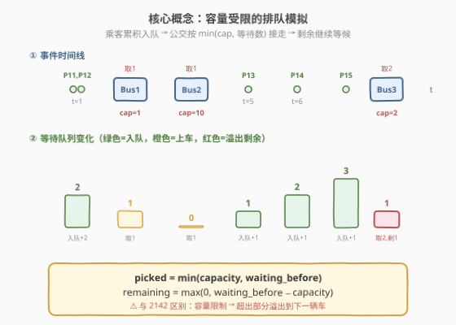
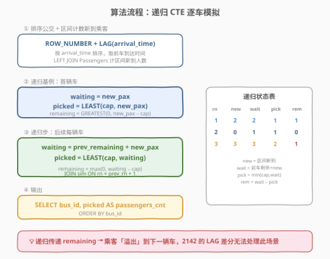
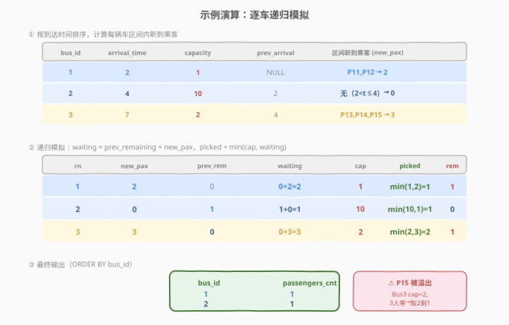

# 每辆车的乘客人数 II

- **题目名称**：每辆车的乘客人数 II
- **链接**：[2153. 每辆车的乘客人数 II](https://leetcode.cn/problems/the-number-of-passengers-in-each-bus-ii/)
- **难度**：困难
- **标签**：SQL、数据库、递归 CTE、窗口函数、`LAG`、`LEFT JOIN`、`GROUP BY`、`COUNT`、模拟

## 1. 题目概述

公交车和乘客先后到达 LeetCode 站点。若一辆公交车在时间 $t_{\text{bus}}$ 到站，乘客在时间 $t_{\text{passenger}}$ 到站，且 $t_{\text{passenger}} \leq t_{\text{bus}}$，**该乘客之前没有赶上任何公交车**，则该乘客将搭乘该公交车。**此外，每辆公交车都有一个容量**——如果在公交车到站的那一刻，等待的乘客超过了它的载客量 `capacity`，只有 `capacity` 个乘客才会搭乘该公交车，**其余乘客继续等待下一辆**。

编写 SQL 查询每辆公交车搭载的乘客数量，按 `bus_id` **升序**排序返回。

**表结构**：

```text
Table: Buses
+--------------+------+
| Column Name  | Type |
+--------------+------+
| bus_id       | int  |
| arrival_time | int  |
| capacity     | int  |
+--------------+------+
bus_id 是该表的主键。
不会出现两辆公交车同时到达。
所有公交车的容量都是正整数。

Table: Passengers
+--------------+------+
| Column Name  | Type |
+--------------+------+
| passenger_id | int  |
| arrival_time | int  |
+--------------+------+
passenger_id 是该表的主键。
```

**示例 1**：

```text
输入：
Buses 表:
+--------+--------------+----------+
| bus_id | arrival_time | capacity |
+--------+--------------+----------+
| 1      | 2            | 1        |
| 2      | 4            | 10       |
| 3      | 7            | 2        |
+--------+--------------+----------+
Passengers 表:
+--------------+--------------+
| passenger_id | arrival_time |
+--------------+--------------+
| 11           | 1            |
| 12           | 1            |
| 13           | 5            |
| 14           | 6            |
| 15           | 7            |
+--------------+--------------+

输出：
+--------+----------------+
| bus_id | passengers_cnt |
+--------+----------------+
| 1      | 1              |
| 2      | 1              |
| 3      | 2              |
+--------+----------------+

解释：
- 乘客 11、12 在时间 1 到达。Bus 1 在时间 2 到站，容量 1 → 只接走 1 人（乘客 11），乘客 12 继续等待。
- Bus 2 在时间 4 到站，容量 10 → 接走等候中的乘客 12（1 人）。
- 乘客 13 在时间 5 到达，乘客 14 在时间 6 到达，乘客 15 在时间 7 到达。
- Bus 3 在时间 7 到站，容量 2 → 3 人在等候（13、14、15），只接走 2 人（13、14），乘客 15 继续等待。
```

**约束条件**：

- `bus_id` 是 `Buses` 表的主键，`passenger_id` 是 `Passengers` 表的主键
- 不会出现两辆公交车同时到达（`arrival_time` 在 `Buses` 表中唯一）
- 所有公交车的容量都是正整数
- 乘客一旦被某辆公交车接走，就不会再搭乘后续公交车
- 未被接走的乘客继续等待下一辆公交车
- 结果按 `bus_id` 升序排序

> 💡 本题是 [2142. 每辆车的乘客人数 I](../2101-2200/2142_每辆车的乘客人数I.md) 的**进阶版**——新增 `capacity` 字段后，2142 的「累积计数 + LAG 差分」模板**直接失效**：差分假设每辆公交能接走区间内全部乘客，但容量限制导致超出部分**溢出**到后续车辆。解法需改为**递归 CTE 逐车模拟**，维护一个「等待队列」，每辆车接走 $\min(\text{capacity}, \text{等待数})$ 人，剩余继续传递。

---

## 2. 解题思路

### 2.1 暴力思路：逐车模拟

最直觉的过程式思路：按到达时间排序公交车，维护一个「等待人数」计数器，逐车处理：

```text
buses = sort(Buses, by=arrival_time)
waiting = 0
for bus in buses:
    new_pax = count(passengers where prev_bus_time < arrival_time <= bus.arrival_time)
    waiting += new_pax
    picked = min(bus.capacity, waiting)
    waiting -= picked
    ans[bus.bus_id] = picked
return ans sorted by bus_id
```

时间 $O(n \times m)$（每辆车区间计数需扫乘客表）。但**纯 SQL 没有显式逐行循环**——`waiting` 的状态传递（上一辆车的剩余 → 本车的初始等待）是**顺序依赖**的，无法用普通窗口函数一步表达。

> ⚠️ **为什么 2142 的 LAG 差分在此失效？** 2142 无容量限制，每辆公交接走区间内**全部**新到乘客，因此 `cum(bus_i) - cum(bus_{i-1})` 恰好等于本车乘客数。本题中 Bus 1 容量 1，但有 2 人在等，差分给出 2 而非 1——溢出的 1 人流向 Bus 2，但 LAG 差分无法捕捉这种**跨车传递**。

### 2.2 核心观察：递归 CTE 模拟等待队列



关键直觉：将问题建模为**带容量约束的队列模拟**，核心状态转移为：

$$\text{waiting}_i = \text{remaining}_{i-1} + \text{new\_pax}_i$$

$$\text{picked}_i = \min(\text{capacity}_i,\ \text{waiting}_i)$$

$$\text{remaining}_i = \max(0,\ \text{waiting}_i - \text{capacity}_i)$$

其中 $\text{new\_pax}_i$ 是「前一辆车到达时间，本辆车到达时间]区间内新到的乘客数」，$\text{remaining}_0 = 0$。

**三个子问题**：

1. **区间计数**：对每辆公交 $b_i$，`LEFT JOIN Passengers p ON p.arrival_time ≤ b.arrival_time AND p.arrival_time > prev_arrival`，`COUNT` 得区间新到人数。用 `LAG(arrival_time) OVER (ORDER BY arrival_time)` 取前车到达时间。

2. **递归传递**：用 `WITH RECURSIVE` 逐车传递 `remaining`。基例为首辆车（`rn = 1`，`prev_remaining = 0`），递归步为 `JOIN sim ON rn = prev_rn + 1`。

3. **容量截断**：每辆车 `picked = LEAST(capacity, waiting)`，`remaining = GREATEST(0, waiting - capacity)`。

> 💡 **为何必须递归？** `remaining_i` 依赖 `remaining_{i-1}`，而 `remaining_{i-1}` 又依赖 `remaining_{i-2}`……这是一条**线性依赖链**，无法用窗口函数并行计算（窗口函数只能取前几行的聚合值，不能做 `min`/`max` 截断后的递推）。递归 CTE 天然适合这种「逐行状态传递」场景。

> ⚠️ **`LEAST` 与 `GREATEST` 是标量函数**，不是聚合函数，在 MySQL 递归 CTE 的递归成员中**允许使用**。递归成员的禁止项是 `GROUP BY`、聚合函数（`SUM`/`COUNT` 等）、窗口函数、`DISTINCT`、`LIMIT`——本题的 `COUNT` 和 `GROUP BY` 只出现在**非递归**的 `new_arrivals` CTE 中，递归成员仅做 `JOIN` + 标量运算，合法。

### 2.3 算法流程图



**完整步骤**：

| 步骤 | 子句 | 作用 |
|------|------|------|
| ① | `ROW_NUMBER() + LAG(arrival_time) OVER (ORDER BY arrival_time)` | 按到达时间排序公交，取前车到达时间 |
| ② | `LEFT JOIN Passengers` + 区间条件 + `COUNT` + `GROUP BY` | 计算每辆车区间内新到乘客数 `new_pax` |
| ③ | `WITH RECURSIVE` 基例 `WHERE rn = 1` | 首辆车：`waiting = new_pax`，`picked = LEAST(cap, new_pax)` |
| ④ | 递归步 `JOIN sim ON rn = prev_rn + 1` | 后续车：`waiting = prev_remaining + new_pax`，`picked = LEAST(cap, waiting)` |
| ⑤ | `SELECT bus_id, picked AS passengers_cnt` + `ORDER BY bus_id` | 输出最终结果 |

> 💡 **递归 CTE 结构**：`WITH RECURSIVE` 包含 `base_case UNION ALL recursive_step`。`UNION ALL`（而非 `UNION`）不去重，保证每辆车恰好一行。递归终止条件是 `JOIN sim ON na.rn = s.rn + 1` 无法匹配更多行（最后一辆车后无后继）。

### 2.4 示例演算

以示例 1 数据为例，观察「区间计数 → 递归模拟」的逐步过程：



**步骤 ①：排序公交 + 区间计数新到乘客**

| bus_id | arrival_time | capacity | prev_arrival | 区间新到乘客 |
|--------|-------------|----------|-------------|-------------|
| 1 | 2 | 1 | NULL | P11(t=1), P12(t=1) → **2** |
| 2 | 4 | 10 | 2 | 无（$2 < t \leq 4$）→ **0** |
| 3 | 7 | 2 | 4 | P13(t=5), P14(t=6), P15(t=7) → **3** |

> 💡 **首辆车 `prev_arrival = NULL`**：`LEFT JOIN` 条件 `prev_arrival IS NULL OR p.arrival_time > prev_arrival` 处理首辆车——包含所有 `arrival_time ≤ 首车到达时间` 的乘客。

**步骤 ②：递归模拟**

| rn | new_pax | prev_rem | waiting = prev_rem + new_pax | cap | picked = min(cap, waiting) | remaining |
|----|---------|----------|------------------------------|-----|---------------------------|-----------|
| 1 | 2 | 0 | 0+2=**2** | 1 | min(1,2)=**1** | **1** |
| 2 | 0 | 1 | 1+0=**1** | 10 | min(10,1)=**1** | **0** |
| 3 | 3 | 0 | 0+3=**3** | 2 | min(2,3)=**2** | **1** |

> 💡 **看 rn=1**：2 人在等（P11、P12），但容量只有 1 → 接走 1 人（P11），剩余 1 人（P12）传递给下一辆车。这就是 2142 无法处理的「溢出」。
>
> **看 rn=2**：上一辆车剩余 1 人（P12），区间内无新到乘客 → 等待 1 人，容量 10 远超 → 全部接走，剩余 0。
>
> **看 rn=3**：上一辆车剩余 0 人，区间内新到 3 人（P13、P14、P15）→ 等待 3 人，容量 2 → 接走 2 人（P13、P14），剩余 1 人（P15）继续等待。

**步骤 ③：`ORDER BY bus_id` 输出**

| bus_id | passengers_cnt |
|--------|----------------|
| 1 | 1 |
| 2 | 1 |
| 3 | 2 |

---

## 3. 参考代码

### SQL（解法 A：递归 CTE，推荐）

```sql
WITH RECURSIVE
    bus_seq AS (
        SELECT
            bus_id,
            arrival_time,
            capacity,
            ROW_NUMBER() OVER (ORDER BY arrival_time) AS rn,
            LAG(arrival_time) OVER (ORDER BY arrival_time) AS prev_arrival
        FROM Buses
    ),
    new_arrivals AS (
        SELECT
            b.rn,
            b.bus_id,
            b.arrival_time,
            b.capacity,
            b.prev_arrival,
            COUNT(p.passenger_id) AS new_pax
        FROM bus_seq b
        LEFT JOIN Passengers p
            ON p.arrival_time <= b.arrival_time
            AND (b.prev_arrival IS NULL OR p.arrival_time > b.prev_arrival)
        GROUP BY b.rn, b.bus_id, b.arrival_time, b.capacity, b.prev_arrival
    ),
    sim AS (
        SELECT
            na.rn,
            na.bus_id,
            na.new_pax,
            na.new_pax AS waiting_before,
            LEAST(na.capacity, na.new_pax) AS picked_up,
            GREATEST(0, na.new_pax - na.capacity) AS remaining
        FROM new_arrivals na
        WHERE na.rn = 1

        UNION ALL

        SELECT
            na.rn,
            na.bus_id,
            na.new_pax,
            s.remaining + na.new_pax AS waiting_before,
            LEAST(na.capacity, s.remaining + na.new_pax) AS picked_up,
            GREATEST(0, s.remaining + na.new_pax - na.capacity) AS remaining
        FROM new_arrivals na
        JOIN sim s ON na.rn = s.rn + 1
    )
SELECT bus_id, picked_up AS passengers_cnt
FROM sim
ORDER BY bus_id;
```

> 💡 **写法要点**：
> - **`bus_seq`**：用 `ROW_NUMBER()` 给公交编号（按 `arrival_time` 排序），`LAG(arrival_time)` 取前一辆车的到达时间。两者同为窗口函数，在同一 `SELECT` 中求值。
> - **`new_arrivals`**：`LEFT JOIN Passengers` 带区间条件 `p.arrival_time ≤ b.arrival_time AND p.arrival_time > b.prev_arrival`，只关联「前车到达之后、本车到达及之前」的乘客。`LEFT JOIN` + `COUNT(passenger_id)` 保证无新到乘客的公交计 0 而非丢行。`GROUP BY` 五列对齐 `SELECT` 的非聚合列。
> - **`sim`（递归 CTE）**：
>   - **基例**（`WHERE rn = 1`）：首辆车无前车，`waiting_before = new_pax`，`picked = LEAST(cap, new_pax)`，`remaining = GREATEST(0, new_pax - cap)`。
>   - **递归步**（`JOIN sim s ON na.rn = s.rn + 1`）：后续每辆车继承前车的 `remaining`，加上本车区间新到 `new_pax` 得 `waiting_before`，再取 `LEAST`/`GREATEST` 截断。
> - **`LEAST(a, b)`** 返回较小值（标量函数），**`GREATEST(0, x)`** 保证剩余数非负（队列不能为负——公交不能接走超过等待数的乘客）。
> - **`UNION ALL`**（而非 `UNION`）：不去重，每辆车恰好一行。
> - ✓ **最推荐**：逻辑清晰、可移植（MySQL 8.0+、PostgreSQL 均支持 `WITH RECURSIVE`）。

### SQL（解法 B：MySQL 会话变量）

```sql
WITH T AS (
    SELECT
        bus_id,
        arrival_time AS dt,
        cnt,
        SUM(cnt) OVER (ORDER BY dt, bus_id) AS cur,
        IF(@t > 0, @t := cnt, @t := @t + cnt) AS cur_sum
    FROM (
        SELECT bus_id, arrival_time, capacity AS cnt FROM Buses
        UNION ALL
        SELECT -1, arrival_time, -1 FROM Passengers
    ) AS a
    CROSS JOIN (SELECT @t := 0) AS b
)
SELECT
    bus_id,
    IF(cur_sum > 0, cnt - cur_sum, cnt) AS passengers_cnt
FROM T
WHERE bus_id > 0
ORDER BY bus_id;
```

> 💡 **写法要点**：
> - 将公交与乘客事件合并为统一时间线：公交 `cnt = capacity`（可接走），乘客 `cnt = -1`（增加等待）。`bus_id = -1` 标记乘客事件。
> - **`ORDER BY dt, bus_id`**：同一时刻乘客（`bus_id = -1`）排在公交（`bus_id > 0`）之前——乘客先入队，公交再从队列接走。
> - **`@t` 变量**追踪「平衡值」：负值 = 等待人数，正值 = 前车剩余容量。
>   - `IF(@t > 0, @t := cnt, @t := @t + cnt)`：
>     - `@t > 0`（前车有剩余容量，无人等待）：`@t := cnt`（重置为本车容量）。
>     - `@t ≤ 0`（有人等待）：`@t := @t + cnt`（容量抵消等待，仍为负则有人溢出）。
> - **`passengers_cnt = IF(cur_sum > 0, cnt - cur_sum, cnt)`**：
>   - `cur_sum > 0`（本车有剩余容量）：接走 `cnt - cur_sum = capacity - 剩余` 人。
>   - `cur_sum ≤ 0`（等待 ≥ 容量）：接走 `cnt = capacity` 人（满载）。
> - ⚠️ **MySQL 8.0+ 中会话变量在 `SELECT` 中的求值顺序不被保证**，此解法在特定版本可能出错。推荐解法 A。

### Python（pandas）

```python
import pandas as pd


def count_passengers(buses: pd.DataFrame, passengers: pd.DataFrame) -> pd.DataFrame:
    buses_sorted = buses.sort_values('arrival_time').reset_index(drop=True)
    buses_sorted['prev_arrival'] = buses_sorted['arrival_time'].shift()

    waiting = 0
    results = []
    for _, bus in buses_sorted.iterrows():
        prev = bus['prev_arrival']
        if pd.isna(prev):
            new_pax = int((passengers['arrival_time'] <= bus['arrival_time']).sum())
        else:
            new_pax = int(
                ((passengers['arrival_time'] > prev)
                 & (passengers['arrival_time'] <= bus['arrival_time'])).sum()
            )

        waiting += new_pax
        picked = min(bus['capacity'], waiting)
        waiting -= picked

        results.append({'bus_id': bus['bus_id'], 'passengers_cnt': int(picked)})

    return pd.DataFrame(results).sort_values('bus_id')[['bus_id', 'passengers_cnt']]
```

> 💡 **pandas 对照**：
> - `buses.sort_values('arrival_time')` + `.shift()` 对应 SQL 的 `LAG(arrival_time) OVER (ORDER BY arrival_time)`。
> - `waiting += new_pax; picked = min(cap, waiting); waiting -= picked` 对应递归 CTE 的三步状态转移。
> - `pd.isna(prev)` 对应 SQL 的 `prev_arrival IS NULL`——首辆车包含全部 `arrival_time ≤ 首车` 的乘客。

---

## 4. 复杂度分析

| 维度 | 解法 A（递归 CTE） | 解法 B（会话变量） |
|------|-------------------|-------------------|
| **时间复杂度** | $O(n \log n + n \times m)$ | $O((n+m) \log(n+m))$ |
| **空间复杂度** | $O(n)$ | $O(n + m)$ |
| **排序次数** | 1 次（公交排序） + 1 次（区间 JOIN） | 1 次（统一时间线排序） |
| **可移植性** | ✓ MySQL 8.0+、PostgreSQL | ⚠️ MySQL 专属 |
| **推荐度** | ✓ **首选**，逻辑清晰可移植 | 备选，紧凑但依赖变量求值顺序 |

> - $n$ = `Buses` 表行数，$m$ = `Passengers` 表行数
> - **解法 A**：`ROW_NUMBER` + `LAG` 排序 $O(n \log n)$；`LEFT JOIN` 区间关联最坏 $O(n \times m)$（实际有索引时接近 $O(n + m)$）；递归 $n$ 步每步 $O(1)$。总计 $O(n \log n + n \times m)$。
> - **解法 B**：合并 $n + m$ 个事件后排序 $O((n+m)\log(n+m))$，窗口函数 `SUM` + 变量遍历 $O(n+m)$。总计 $O((n+m)\log(n+m))$。理论上更快但可移植性差。
> - **索引优化**：在 `Passengers(arrival_time)` 上建索引可加速区间 `JOIN`；在 `Buses(arrival_time)` 上建索引可让窗口排序走索引有序扫描。

---

## 5. 扩展：与 2142 的对比及递归 CTE 适用场景

### 5.1 2142 vs 2153：何时 LAG 差分失效

| 维度 | 2142（无容量限制） | 2153（有容量限制） |
|------|-------------------|-------------------|
| **每车接走人数** | 区间内全部新到乘客 | $\min(\text{capacity}, \text{等待数})$ |
| **溢出** | 无（全部接走） | 有（超出容量传给下一辆） |
| **状态依赖** | 无（各车独立，仅依赖区间乘客） | 有（`remaining` 逐车传递） |
| **解法** | `LEFT JOIN` + `COUNT` + `LAG` 差分 | 递归 CTE 逐车模拟 |
| **核心公式** | $\text{cnt}_i = \text{cum}_i - \text{cum}_{i-1}$ | $\text{picked}_i = \min(\text{cap}_i, \text{rem}_{i-1} + \text{new}_i)$ |

> 💡 **判断标准**：如果每辆车的乘客数**仅依赖区间内的乘客**（与前后车无关），用 LAG 差分；如果存在**跨车状态传递**（溢出、容量限制、累积上限），必须递归。

### 5.2 递归 CTE 的通用模式

本题的递归 CTE 可抽象为「**带截断的逐行状态传递**」通用模板：

```sql
WITH RECURSIVE
    ordered AS (  -- ① 排序 + 编号
        SELECT *, ROW_NUMBER() OVER (ORDER BY sort_key) AS rn
        FROM source_table
    ),
    sim AS (
        -- ② 基例
        SELECT rn, init_state, compute(rn) AS state
        FROM ordered WHERE rn = 1
        UNION ALL
        -- ③ 递归步：传递 state，做截断
        SELECT o.rn, s.state AS prev_state,
               clamp(compute(o.rn, s.state)) AS state
        FROM ordered o JOIN sim s ON o.rn = s.rn + 1
    )
SELECT * FROM sim;
```

> 💡 适用场景：**滑动窗口最大值**（递归维护单调性）、**容量受限调度**（本题）、**链式依赖计算**（如累计折旧、阶梯计价）。核心特征是「当前行状态 = f(前一行状态, 当前行输入)」且 f 不可表示为简单聚合。

### 5.3 替代方案：相关子查询

在不支持递归 CTE 的数据库中，可用**相关子查询**逐车计算：

```sql
SELECT b.bus_id,
       LEAST(b.capacity,
             (SELECT COUNT(*) FROM Passengers p
              WHERE p.arrival_time <= b.arrival_time
                AND p.arrival_time > COALESCE(
                    (SELECT MAX(b2.arrival_time) FROM Buses b2
                     WHERE b2.arrival_time < b.arrival_time), -1
                ))
              -- ⚠️ 此法未减去被前车接走的人数，仅适用于无溢出的场景
       ) AS passengers_cnt
FROM Buses b
ORDER BY b.bus_id;
```

> ⚠️ 此子查询**无法正确处理溢出**——它只算区间新到乘客，不知道前车剩余多少未接走。正确做法仍需递归或过程式代码。列此仅为说明「相关子查询的局限性」。

---

## 6. 面试要点

1. **为什么 2142 的 LAG 差分在本题失效？**

   > 2142 的差分公式 $\text{cnt}_i = \text{cum}_i - \text{cum}_{i-1}$ 假设每辆车接走区间内全部乘客。本题 Bus 1 有 2 人等待但容量只有 1，差分给出 2 而实际接走 1——多出的 1 人溢出到 Bus 2。LAG 差分无法捕捉这种跨车传递，因为 `cum` 是乘客到达数的简单前缀和，不包含「被截断后剩余」的信息。

2. **递归 CTE 的基例和递归步分别做什么？**

   > **基例**（`WHERE rn = 1`）：处理首辆车，`prev_remaining = 0`，`waiting = 0 + new_pax`，`picked = min(cap, waiting)`，`remaining = max(0, waiting - cap)`。**递归步**（`JOIN sim ON rn = prev_rn + 1`）：处理后续每辆车，继承前一辆车的 `remaining`，加上本车区间新到 `new_pax` 得 `waiting`，再做 `min`/`max` 截断。递归在最后一辆车后无后继行匹配时自然终止。

3. **`LEAST` 和 `GREATEST` 在递归 CTE 中合法吗？**

   > 合法。MySQL 递归 CTE 的递归成员禁止使用**聚合函数**（`SUM`/`COUNT`/`MAX` 等）、**窗口函数**、`GROUP BY`、`DISTINCT`、`LIMIT`——但 `LEAST` 和 `GREATEST` 是**标量函数**，不在禁止列表中。本题的 `COUNT` 和 `GROUP BY` 只出现在非递归的 `new_arrivals` CTE 中，递归成员仅做 `JOIN` + 标量运算，完全合法。

4. **为什么用 `LEFT JOIN` 而非 `INNER JOIN` 计算区间新到乘客？**

   > 若某辆公交到达时区间内无新到乘客（如 Bus 2，区间 $(2, 4]$ 内无人到达），`INNER JOIN` 会丢弃该车导致结果缺行。`LEFT JOIN` 保留所有公交，未匹配时 `passenger_id` 为 `NULL`，`COUNT(passenger_id)` 计为 0。这与 2142 的 `LEFT JOIN` 用法一致——「保留全集」模式。

5. **解法 B 中 `@t > 0` 和 `@t ≤ 0` 分别代表什么？**

   > `@t` 是「平衡值」：负值代表等待人数（乘客入队使 `@t` 更负），正值代表前车剩余容量（公交到站使 `@t` 更正）。`@t > 0` 意味着前车有剩余容量且无人等待——当前公交直接重置 `@t` 为自身容量（前车剩余容量被丢弃，因为前车已离开）。`@t ≤ 0` 意味着有人等待——当前公交的容量先抵消等待人数，抵消后仍为负则有人溢出。

> 💡 **一句话总结**：2153 是 SQL **"递归 CTE 逐车状态传递"招牌题**——2142 的 LAG 差分因容量限制失效，需用递归 CTE 维护等待队列，每辆车接走 $\min(\text{cap}, \text{waiting})$ 人，剩余 $\max(0, \text{waiting} - \text{cap})$ 传递给下一辆。核心模板：**非递归 CTE 算区间新到 + 递归 CTE 传递 remaining + LEAST/GREATEST 截断**。

---

## 7. 同类练习题

- [2142. 每辆车的乘客人数 I](https://leetcode.cn/problems/the-number-of-passengers-in-each-bus-i/)（[站内题解](../2101-2200/2142_每辆车的乘客人数I.md)）：本题的无容量限制版，`LEFT JOIN` + `LAG` 差分即可，对照理解容量限制对解法的影响
- [1204. 最后一个能进入巴士的人](https://leetcode.cn/problems/last-person-to-fit-in-the-bus/)：SQL 累积和 + 阈值截断，同属「累积 + 容量限制」家族，用窗口函数 `SUM` + 条件过滤
- [180. 连续出现的数字](https://leetcode.cn/problems/consecutive-numbers/)：`LAG` 窗口函数取前几行做比较，对照 2153 的 `LAG` 用于取前车到达时间
- [1174. 即时食物配送 II](https://leetcode.cn/problems/immediate-food-delivery-ii/)：SQL 窗口函数 + 首次匹配，同属「按时间序首条匹配」模式
- [570. 至少有5名直接下属的经理](https://leetcode.cn/problems/managers-with-at-least-5-direct-reports/)：`GROUP BY` + `COUNT` + `HAVING` 过滤，对照 2153 的 `COUNT` 作用于 `LEFT JOIN` 结果
