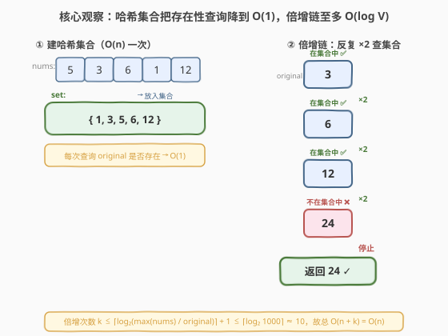
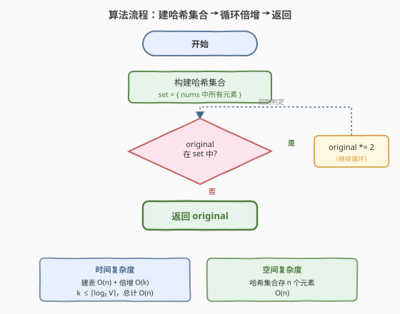
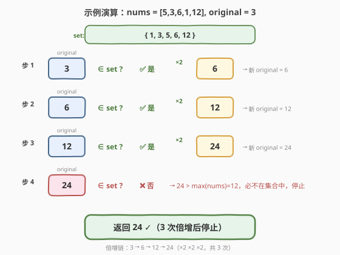

# LeetCode 将找到的值乘以 2 题解

## 1. 题目概述

- **标题 / 题号**：将找到的值乘以 2（#2154，easy）
- **链接**：https://leetcode.cn/problems/keep-multiplying-found-values-by-two/
- **难度**：简单
- **标签**：数组、哈希表、模拟

**题意**：给你一个整数数组 `nums`，另给你一个整数 `original`，这是需要在 `nums` 中搜索的第一个数字。

接下来，你需要按下述步骤操作：

1. 如果在 `nums` 中找到 `original`，将 `original` **乘以** 2，得到新 `original`（即，令 `original = 2 * original`）。
2. 否则，停止这一过程。
3. 只要能在数组中找到新 `original`，就对新 `original` 继续**重复**这一过程。

返回 `original` 的**最终**值。

**示例 1**：

```text
输入：nums = [5,3,6,1,12], original = 3
输出：24
解释：
- 3 能在 nums 中找到。3 * 2 = 6。
- 6 能在 nums 中找到。6 * 2 = 12。
- 12 能在 nums 中找到。12 * 2 = 24。
- 24 不能在 nums 中找到。因此，返回 24。
```

**示例 2**：

```text
输入：nums = [2,7,9], original = 4
输出：4
解释：
- 4 不能在 nums 中找到。因此，返回 4。
```

**约束**：

- $1 \le$ `nums.length` $\le 1000$
- $1 \le$ `nums[i]`, `original` $\le 1000$

> 💡 本题是典型的「**反复存在性查询**」问题。核心操作只有两步：查 `original` 是否在 `nums` 中、在则翻倍。暴力做法每次线性扫描 $O(n)$，而翻倍次数 $k$ 受值域上界约束——$k \le \lceil \log_2 1000 \rceil \approx 10$，故暴力 $O(nk)$ 也能 AC。但最优解法用**哈希集合**把每次查询压到 $O(1)$，总 $O(n)$，体现「**预处理换取查询加速**」的经典思想。

## 2. 解题思路

### 2.1 暴力思路：每次线性扫描

最直观的做法：反复检查 `original` 是否在 `nums` 中，在就翻倍，不在就停。

```text
while original in nums:     # 每次线性扫描 O(n)
    original *= 2
return original
```

- **正确性**：完全符合题意——逐次翻倍直到找不到为止。
- **效率**：每次 `in nums` 是 $O(n)$ 线性扫描；翻倍次数 $k$ 受值域约束。由于 `nums[i]` $\le 1000$，一旦 `original` 超过 1000 就必然不在数组中，故 $k \le \lceil \log_2(1000 / 1) \rceil \approx 10$。整体 $O(nk)$，最坏约 $10^4$ 次比较，AC 无压力。
- **不足**：每次翻倍后都重新扫一遍**整个数组**，没有复用已扫描的信息——`nums` 是**不变**的，存在性查询可以预处理。

> ⚠️ 对于本题的数据规模，暴力完全 AC。但「每次翻倍都从头扫描」是明显的浪费——突破口是观察 `nums` 在整个过程中不变，可以一次性建好查找结构，之后每次查询 $O(1)$。

### 2.2 核心观察：哈希集合把存在性查询降到 O(1)



关键直觉：整个过程只有一个操作——「**查 `original` 是否在 `nums` 中**」，而 `nums` 始终不变。因此可以**一次建表、多次查询**：

| 阶段 | 操作 | 复杂度 |
|------|------|--------|
| **预处理** | 把 `nums` 所有元素放入哈希集合 `set` | $O(n)$ |
| **查询循环** | `while original in set: original *= 2` | 每次 $O(1)$，共 $k$ 次 |

翻倍次数 $k$ 的上界分析：

$$k \le \left\lceil \log_2 \frac{\max(\text{nums})}{\text{original}} \right\rceil + 1 \le \lceil \log_2 1000 \rceil \approx 10$$

因为 `nums[i]` $\le 1000$，当 `original` 超过 1000 时必不在集合中，循环终止。故总复杂度 $O(n + k) = O(n)$。

> 💡 **为什么哈希集合而非排序 + 二分？** 两者都能把查询降到 $O(\log n)$ 或 $O(1)$，但哈希集合的 $O(1)$ 查询更直接，且代码更简洁。排序 + 二分需 $O(n \log n)$ 预处理 + 每次 $O(\log n)$ 查询，总 $O(n \log n + k \log n)$，不如哈希集合优。若值域极小（如本题 $V \le 1000$），还可用布尔数组实现 $O(1)$ 查询且常数更小（见第 5 节扩展）。

### 2.3 算法流程图



**完整步骤**：

1. **建哈希集合**：遍历 `nums`，将每个元素加入 `set`。
2. **循环倍增**：当 `original` ∈ `set` 时，执行 `original *= 2`。
3. 返回 `original`。

> 💡 **循环终止性**：`original` 每轮严格翻倍（$\times 2$），而 `nums` 中元素有上界 $\max(\text{nums})$。当 `original > max(nums)` 时必不在集合中，循环必然终止——不存在死循环风险。

### 2.4 示例演算

以 `nums = [5,3,6,1,12]`, `original = 3` 为例：



**第一步——建集合**：

| `set` 元素 | 1 | 3 | 5 | 6 | 12 |
|------------|---|---|---|---|----|

**第二步——循环倍增**：

| 步 | `original` | ∈ `set`? | 动作 |
|----|------------|----------|------|
| 1 | 3 | ✅ 是 | `original = 3 × 2 = 6` |
| 2 | 6 | ✅ 是 | `original = 6 × 2 = 12` |
| 3 | 12 | ✅ 是 | `original = 12 × 2 = 24` |
| 4 | 24 | ❌ 否 | 24 > max(nums) = 12，停止 |

最终返回 `24`，与示例一致。

> 💡 **对照示例 2** `nums = [2,7,9]`, `original = 4`：第一步建集合 `{2, 7, 9}`；`4` 不在集合中，循环一次都不执行，直接返回 `4`。这是「初始即未命中」的边界情况。

## 3. 参考代码

### 方法一：哈希集合（$O(n)$ / $O(n)$，推荐）

### C++

```cpp
// 将找到的值乘以2.cpp —— 哈希集合 + 循环倍增
// 编译: g++ -O2 -std=c++17 将找到的值乘以2.cpp -o keep_mul
#include <vector>
#include <unordered_set>
using namespace std;

class Solution {
public:
    int findFinalValue(vector<int>& nums, int original) {
        unordered_set<int> seen(nums.begin(), nums.end());  // 建集合 O(n)
        while (seen.count(original)) {                      // O(1) 查询
            original *= 2;
        }
        return original;
    }
};
```

### Python

```python
class Solution:
    def findFinalValue(self, nums: list[int], original: int) -> int:
        seen = set(nums)                  # 建集合 O(n)
        while original in seen:           # O(1) 查询
            original *= 2
        return original
```

> 💡 **实现细节**：① C++ 用 `unordered_set<int>` 的构造函数直接从 `nums` 的迭代器范围建集合，一行完成；② `seen.count(original)` 返回 0/1，比 `seen.find(original) != seen.end()` 更简洁；③ Python 的 `set(nums)` 同样一行建集合，`in` 操作 $O(1)$ 均摊；④ 循环体只有一行 `original *= 2`，无需额外变量。

### 方法二：暴力线性扫描（$O(nk)$ / $O(1)$，思路对照）

### C++

```cpp
class Solution {
public:
    int findFinalValue(vector<int>& nums, int original) {
        while (true) {
            bool found = false;
            for (int x : nums) {
                if (x == original) { found = true; break; }
            }
            if (!found) break;
            original *= 2;
        }
        return original;
    }
};
```

### Python

```python
class Solution:
    def findFinalValue(self, nums: list[int], original: int) -> int:
        while original in nums:          # 每次 O(n) 线性扫描
            original *= 2
        return original
```

> 💡 方法二无需额外空间（$O(1)$），但每次查询 $O(n)$，总 $O(nk)$。本题 $n \le 1000$、$k \le 10$，约 $10^4$ 次比较也能 AC。但面试中应主动展示哈希集合做法体现「预处理换查询加速」的优化意识，再提暴力作为对照。

## 4. 复杂度分析

| 维度 | 方法 | 复杂度 | 说明 |
|------|------|--------|------|
| 时间 | 哈希集合 | $O(n)$ | 建集合 $O(n)$ + 倍增循环 $k$ 次每次 $O(1)$，$k \le \lceil \log_2 1000 \rceil \approx 10$，总计 $O(n)$ |
| 空间 | 哈希集合 | $O(n)$ | 哈希集合存储 `nums` 中所有元素，最坏 $n$ 个不同值 |
| 时间 | 暴力扫描 | $O(nk)$ | 每次翻倍后线性扫描 $O(n)$，共 $k$ 次 |
| 空间 | 暴力扫描 | $O(1)$ | 不需额外数据结构 |

> 💡 **关于 $k$ 的精确上界**：翻倍链 `original → 2·original → 4·original → …` 中每个中间值都必须在 `nums` 中。由于 `nums[i]` $\le 1000$，链中最大有效值 $\le 1000$，故 $k \le \lfloor \log_2(1000 / \text{original}) \rfloor + 1$。最坏 `original = 1` 且 `nums` 含 $1, 2, 4, \ldots, 512$（共 10 个 2 的幂），$k = 10$。

## 5. 扩展：值域布尔数组替代哈希集合

题目约束 `nums[i]`, `original` $\le 1000$，值域已知且很小。可用长度为 1001 的布尔数组代替哈希集合，查询仍是 $O(1)$ 但常数更小（无哈希计算与冲突处理）：

```cpp
class Solution {
public:
    int findFinalValue(vector<int>& nums, int original) {
        bool seen[1001] = {};                    // 值域 [1, 1000]
        for (int x : nums) seen[x] = true;       // 建表
        while (original <= 1000 && seen[original]) {
            original *= 2;
        }
        return original;
    }
};
```

```python
class Solution:
    def findFinalValue(self, nums: list[int], original: int) -> int:
        seen = [False] * 1001
        for x in nums:
            seen[x] = True
        while original <= 1000 and seen[original]:
            original *= 2
        return original
```

> ⚠️ **越界保护**：`while` 条件必须先检查 `original <= 1000` 再访问 `seen[original]`（短路求值），否则当 `original` 翻倍到 2000 时会越界访问 `seen[2000]`。哈希集合实现无此问题——缺键自动返回不存在。

**三种实现对比**：

| 实现 | 时间 | 空间 | 适用场景 |
|------|------|------|----------|
| 哈希集合 | $O(n)$ | $O(n)$ | 值域未知或很大、通用首选 |
| 值域布尔数组 | $O(n)$ | $O(V)$ | 值域小且已知，常数更小 |
| 暴力扫描 | $O(nk)$ | $O(1)$ | $n$ 极小或不允许额外空间 |

本题 $V = 1000$，三种实现皆可 AC；面试默认哈希集合，再提值域数组作为优化延伸。

## 6. 面试要点

**Q1：为什么用哈希集合而不是排序 + 二分？**

> 两者都能加速查询，但各有优劣：哈希集合预处理 $O(n)$、查询 $O(1)$，总 $O(n + k) = O(n)$；排序 + 二分预处理 $O(n \log n)$、查询 $O(\log n)$，总 $O(n \log n + k \log n)$。哈希集合在时间和代码简洁度上都更优。排序 + 二分的唯一优势是支持有序遍历，但本题不需要。

**Q2：翻倍次数 $k$ 的上界是多少？为什么不会死循环？**

> `original` 每轮严格翻倍（$\times 2$），而 `nums` 中元素有上界 $\max(\text{nums}) \le 1000$。当 `original > 1000` 时必然不在集合中，循环终止。最坏 `original = 1` 且 `nums` 含 $1, 2, 4, \ldots, 512$ 时 $k = 10$。关键在于 `original` 单调递增且 `nums` 不变，必然在某一步越过值域上界。

**Q3：值域布尔数组相比哈希集合有什么优劣？**

> 优势：① 查询 $O(1)$ 且无哈希冲突，常数更小；② 实现简单，`seen[x] = true` 一行建表。劣势：① 仅适用于值域小且已知的情况，若值域达 $10^9$ 则空间爆炸；② 需手动处理越界（`original` 翻倍后可能超出数组范围，需短路保护）。哈希集合通用性更强，是面试默认选择。

**Q4：如果值域无上界（如 `nums[i]` 可达 $10^9$），做法有何变化？**

> 哈希集合做法不变——`unordered_set` / `set` 不依赖值域大小，仍 $O(n)$ 建表 + $O(k)$ 查询。值域布尔数组则不可用（空间 $O(V)$ 爆炸）。翻倍次数 $k$ 仍受 $\max(\text{nums})$ 约束，但 $\max$ 可能很大，$k$ 上界相应增大——不过 $k$ 只与值域有关，与 $n$ 无关，$O(n + k)$ 仍优于暴力的 $O(nk)$。

**Q5：本题与「反复查找」类问题的通用模式是什么？**

> 通用模式是「**不变数据集上的多次存在性查询**」：当查询对象（本题 `nums`）在多次查询间不变时，应预处理为哈希集合/排序数组，把单次查询从 $O(n)$ 降到 $O(1)$ / $O(\log n)$。这与其他「预处理换查询加速」的题目同属一脉：如 [1. 两数之和](../0001-0100/1_两数之和.md)（哈希表存已遍历值）、[219. 存在重复元素 II](../0201-0300/219_存在重复元素II.md)（哈希表存最近下标）。

> 💡 **一句话总结**：2154 是「哈希集合加速反复存在性查询」的入门题——`nums` 不变，一次建集合 $O(n)$，之后每次查询 $O(1)$，翻倍次数受值域约束 $\le 10$，总 $O(n)$。核心是把「每次从头扫描」优化为「预处理一次、多次 $O(1)$ 查询」。

## 同类练习题

| # | 题目 | 与本题的关联 |
|---|------|-------------|
| 1 | [两数之和](https://leetcode.cn/problems/two-sum/)（[题解](../0001-0100/1_两数之和.md)） | 哈希表一次遍历——同属「预处理换取 $O(1)$ 查询」家族，母题 |
| 219 | [存在重复元素 II](https://leetcode.cn/problems/contains-duplicate-ii/) | 哈希表维护值与最近下标——同属「不变数据集上的存在性查询」套路 |
| 349 | [两个数组的交集](https://leetcode.cn/problems/intersection-of-two-arrays/) | 哈希集合求交集——同样的「建集合 + 查存在性」模式 |
| 1207 | [独一无二的出现次数](https://leetcode.cn/problems/unique-number-of-occurrences/) | 频次表 + 集合判重——哈希集合判定存在性的延伸 |
| 217 | [存在重复元素](https://leetcode.cn/problems/contains-duplicate/) | 哈希集合判重——最纯粹的「建集合 + 查存在性」入门题 |
