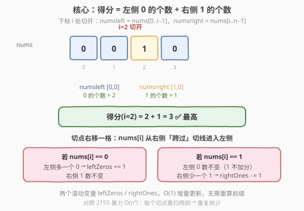
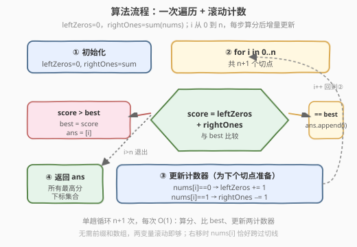
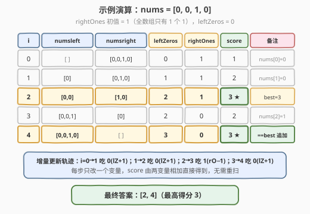

# LeetCode 分组得分最高的所有下标 题解

## 1. 题目概述

- **标题 / 题号**：分组得分最高的所有下标（#2155，medium）
- **链接**：https://leetcode.cn/problems/all-divisions-with-the-highest-score-of-a-binary-array/
- **难度**：中等
- **标签**：数组、前缀和、一次遍历

**题意**：给定下标从 `0` 开始的二进制数组 `nums`，长度为 `n`。可按下标 `i`（$0 \le i \le n$）拆成两段（均可为空）：

- `numsleft` = `nums[0..i-1]`
- `numsright` = `nums[i..n-1]`

下标 `i` 的**分组得分** = `numsleft` 中 **0 的个数** + `numsright` 中 **1 的个数**。返回得分**最高**的所有不同下标，顺序任意。

**示例 1**：

```text
输入：nums = [0,0,1,0]
输出：[2,4]
解释：
- i=0：left=[] , right=[0,0,1,0] → 0 + 1 = 1
- i=1：left=[0] , right=[0,1,0]  → 1 + 1 = 2
- i=2：left=[0,0], right=[1,0]   → 2 + 1 = 3 ★
- i=3：left=[0,0,1], right=[0]   → 2 + 0 = 2
- i=4：left=[0,0,1,0], right=[]  → 3 + 0 = 3 ★
最高得分 3，对应下标 [2, 4]
```

**示例 2**：

```text
输入：nums = [0,0,0]
输出：[3]
解释：i=0..3 得分依次 0,1,2,3，仅 i=3 最高
```

**示例 3**：

```text
输入：nums = [1,1]
输出：[0]
解释：i=0..2 得分依次 2,1,0，仅 i=0 最高
```

**约束**：

- $n = $ `nums.length`
- $1 \le n \le 10^5$
- `nums[i]` 为 `0` 或 `1`

> 💡 本题是典型的「**滑动切点 + 滚动计数**」问题。切点从左滑到右共 $n+1$ 个位置，每移一格只有一个元素跨过切线，因此得分可在 $O(1)$ 内增量更新，无需为每个切点重扫两侧。整体 $O(n)$。

## 2. 解题思路

### 2.1 暴力思路：每个切点重扫两侧

最直观的做法：对每个切点 `i`（共 $n+1$ 个），分别扫一遍 `numsleft` 数 0、扫一遍 `numsright` 数 1，得到得分后取最大。

```text
for i in 0..n:
    zeros = count(0 in nums[0..i-1])
    ones  = count(1 in nums[i..n-1])
    score[i] = zeros + ones
return argmax(score)
```

时间 $O(n^2)$。$n = 10^5$ 时约 $10^{10}$ 次比较，**超时**。

> ⚠️ 暴力的问题：相邻切点 `i` 与 `i+1` 的两侧只差一个元素 `nums[i]`（它从右侧「跨过」切线进入左侧），却重复扫描了几乎相同的区间。突破口是观察——切点右移一格时，**只有一个元素改变归属**，得分可增量维护。

### 2.2 核心观察：切点右移时只有一个元素跨线



关键直觉：维护两个滚动变量：

- `leftZeros`：当前 `numsleft` 中 0 的个数
- `rightOnes`：当前 `numsright` 中 1 的个数

切点 `i` 处得分 = `leftZeros + rightOnes`。切点从 `i` 右移到 `i+1` 时，`nums[i]` 跨过切线：

| `nums[i]` 的值 | 对 `leftZeros` 的影响 | 对 `rightOnes` 的影响 |
|----------------|----------------------|----------------------|
| `0` | `+1`（左侧多一个 0） | 不变（0 本就不计右侧 1） |
| `1` | 不变（1 不计左侧 0） | `−1`（右侧少一个 1） |

因此每步只改**一个变量**，得分 $O(1)$ 得到。初始化时 `i=0`：`numsleft` 为空 → `leftZeros=0`；`numsright` 为全数组 → `rightOnes = sum(nums)`。

> 💡 **为什么 1 不计左侧、0 不计右侧？** 得分定义只数左侧的 0 与右侧的 1。当 `nums[i]=1` 跨入左侧，它对左侧 0 数无贡献（保持不变），但它离开了右侧所以右侧 1 数减一；`nums[i]=0` 同理对称。这正是「跨线元素只影响它被计数的那一侧」的单边效应。

> ⚠️ **更新顺序**：先**算分**（用当前 `leftZeros/rightOnes`），再**更新**计数器（为下个切点准备）。因为更新用的是 `nums[i]`，而 `nums[i]` 在切点 `i` 处仍属右侧、在切点 `i+1` 处才属左侧——算分在前、更新在后，保证两变量始终对应「当前切点」的两侧归属。

### 2.3 算法流程图



**完整步骤**：

1. **初始化**：`leftZeros = 0`，`rightOnes = sum(nums)`，`best = -1`，`ans = []`。
2. **遍历** `i` 从 `0` 到 `n`（共 $n+1$ 个切点）：
   1. `score = leftZeros + rightOnes`；
   2. 若 `score > best`：`best = score`，`ans = [i]`；
   3. 若 `score == best`：`ans.append(i)`；
   4. 若 `i < n`：按 `nums[i]` 增量更新（`0` → `leftZeros++`；`1` → `rightOnes--`）。
3. 返回 `ans`。

> 💡 **边界**：`i=0` 与 `i=n` 两个端点切点天然被循环覆盖（前者 `leftZeros=0`、后者 `rightOnes=0`），无需特判。`best` 初值取 `-1`（得分最小为 0），保证首个切点必定刷新 `best`。

### 2.4 示例演算

以 `nums = [0, 0, 1, 0]` 为例，`rightOnes` 初值 = 1（全数组仅 1 个 1），`leftZeros` = 0：



| i | numsleft | numsright | leftZeros | rightOnes | score | 备注 |
|---|----------|-----------|-----------|-----------|-------|------|
| 0 | `[]` | `[0,0,1,0]` | 0 | 1 | 1 | 吃 `nums[0]=0` → lZ+1 |
| 1 | `[0]` | `[0,1,0]` | 1 | 1 | 2 | 吃 `nums[1]=0` → lZ+1 |
| 2 | `[0,0]` | `[1,0]` | 2 | 1 | **3 ★** | best=3；吃 `nums[2]=1` → rO−1 |
| 3 | `[0,0,1]` | `[0]` | 2 | 0 | 2 | 吃 `nums[3]=0` → lZ+1 |
| 4 | `[0,0,1,0]` | `[]` | 3 | 0 | **3 ★** | ==best 追加 |

最终答案 `[2, 4]`，与示例一致。

> 💡 注意 `i=2` 与 `i=4` 并列最高。`i=2` 是「左侧零已达 2、右侧 1 还在」的峰值点；`i=4` 是「左侧零吃满 3、右侧 1 已被吃掉」的收尾点——两条不同的路径凑出同一得分 3，这正是「并列最高」的常见成因：得分在切点滑动过程中可先升后降，峰值可能 plateau（平台）。

## 3. 参考代码

### C++

```cpp
// 分组得分最高的所有下标.cpp —— 滑动切点 + 滚动计数
// 编译: g++ -O2 -std=c++17 分组得分最高的所有下标.cpp -o divscore
#include <vector>
#include <numeric>
using namespace std;

class Solution {
  public:
    vector<int> maxScoreIndices(vector<int>& nums) {
        int leftZeros = 0;
        int rightOnes = accumulate(nums.begin(), nums.end(), 0);
        int best = -1;
        vector<int> ans;

        int n = nums.size();
        for (int i = 0; i <= n; ++i) {
            int score = leftZeros + rightOnes;
            if (score > best) {
                best = score;
                ans.clear();
                ans.push_back(i);
            } else if (score == best) {
                ans.push_back(i);
            }
            if (i < n) {
                if (nums[i] == 0) ++leftZeros;
                else              --rightOnes;
            }
        }
        return ans;
    }
};
```

### Python

```python
class Solution:
    def maxScoreIndices(self, nums: List[int]) -> List[int]:
        left_zeros = 0
        right_ones = sum(nums)
        best = -1
        ans = []

        n = len(nums)
        for i in range(n + 1):
            score = left_zeros + right_ones
            if score > best:
                best = score
                ans = [i]
            elif score == best:
                ans.append(i)
            if i < n:
                if nums[i] == 0:
                    left_zeros += 1
                else:
                    right_ones -= 1
        return ans
```

> 💡 **实现细节**：① `range(n + 1)` / `i <= n` 覆盖 $n+1$ 个切点（含两端）。② 刷新 `best` 时用 `ans = [i]` / `ans.clear(); ans.push_back(i)` 重置，等价时 `append`，避免维护「得分→下标列表」的哈希表。③ 更新放在算分**之后**、且用 `i < n` 守卫，防止 `i = n` 时越界访问 `nums[n]`。

## 4. 复杂度分析

| 维度 | 复杂度 | 说明 |
|------|--------|------|
| **时间复杂度** | $O(n)$ | 一次 `accumulate` 求 `rightOnes` 初值为 $O(n)$；主循环 $n+1$ 次，每次算分、比 `best`、更新计数器均 $O(1)$。总计 $O(n)$ |
| **空间复杂度** | $O(1)$ | 仅用 `leftZeros`、`rightOnes`、`best` 三个标量；返回数组不计入额外空间（输出必要） |

> ⚠️ 本题无需前缀和数组。若坚持用前缀和：预处理 `preZeros[i]`（前 `i` 个元素中 0 的个数）与 `preOnes[i]`，则 `score(i) = preZeros[i] + (preOnes[n] - preOnes[i])`，时间仍 $O(n)$ 但空间升到 $O(n)$。滚动计数把前缀信息压缩进两变量，是更优实现。

## 5. 扩展：前缀和写法与差分视角

**前缀和写法**（空间 $O(n)$，思路更直白但常数略大）：

```python
class Solution:
    def maxScoreIndices(self, nums: List[int]) -> List[int]:
        n = len(nums)
        pre_zeros = [0] * (n + 1)   # pre_zeros[i] = 前 i 个元素中 0 的个数
        pre_ones  = [0] * (n + 1)
        for i in range(n):
            pre_zeros[i + 1] = pre_zeros[i] + (1 if nums[i] == 0 else 0)
            pre_ones[i + 1]  = pre_ones[i]  + nums[i]
        total_ones = pre_ones[n]

        best = -1
        ans = []
        for i in range(n + 1):
            score = pre_zeros[i] + (total_ones - pre_ones[i])
            if score > best:
                best = score
                ans = [i]
            elif score == best:
                ans.append(i)
        return ans
```

**差分视角**：定义 `f(i) = score(i+1) - score(i)`，即切点右移一格的得分变化。由 2.2 节更新规则：

- `nums[i] == 0`：`leftZeros +1`、`rightOnes` 不变 → `f(i) = +1`
- `nums[i] == 1`：`leftZeros` 不变、`rightOnes -1` → `f(i) = -1`

故得分序列 `score(0), score(1), …, score(n)` 是一个**步长为 ±1 的随机游走**：每遇到 0 上爬一格、遇到 1 下跌一格。最高得分下标即该游走的**峰值平台**。这一视角把本题归入「前缀和数组的极值定位」家族——把 0 当 `+1`、1 当 `−1` 做前缀和，峰值即为答案。

> 💡 这一转换等价于「将 1 视作 `−1`、0 视作 `+1` 后求最大前缀和的下标」——与 53（最大子数组和）、525（0 当 −1 转换）同属「重赋值 + 前缀和极值」套路。

**两种实现对比**：

| 实现 | 时间 | 空间 | 说明 |
|------|------|------|------|
| 滚动计数 | $O(n)$ | $O(1)$ | 推荐，两变量增量更新 |
| 前缀和数组 | $O(n)$ | $O(n)$ | 思路直白，便于引出差分视角 |

## 6. 面试要点

1. **为什么切点右移时只需更新一个变量？**

   - 得分只数左侧的 0 与右侧的 1。`nums[i]` 跨线时，它要么是 0（只影响左侧 0 计数）、要么是 1（只影响右侧 1 计数），**绝不会同时影响两侧**。这种「单边效应」使得每步只改一个变量，得分 $O(1)$ 维护。

2. **算分与更新的顺序能否颠倒？**

   - 不能。算分用的是「当前切点」的两侧归属，而更新用的 `nums[i]` 在切点 `i` 处仍属右侧、在 `i+1` 处才属左侧。若先更新再算分，相当于提前把 `nums[i]` 计入左侧/移出右侧，得到的将是切点 `i+1` 的得分，切点错位。**先算分、后更新**是正确的顺序。

3. **`i=0` 与 `i=n` 两个端点切点如何处理？**

   - 循环 `i` 从 `0` 到 `n`（含），二者天然在内。`i=0`：`leftZeros=0`（左侧空）、`rightOnes=sum(nums)`（右侧全），得分即全数组 1 的个数。`i=n`：`leftZeros` 已吃满所有 0、`rightOnes=0`（右侧空），得分即全数组 0 的个数。两端无需特判。

4. **滚动计数与前缀和数组，如何选择？**

   - 渐近时间均为 $O(n)$。滚动计数空间 $O(1)$、常数更小，是面试首选。前缀和数组空间 $O(n)$，但思路更直白（直接套前缀和模板），且便于引出差分视角（`f(i) = ±1` 的随机游走峰值）。若面试官追问「能否 $O(1)$ 空间」，从前者升级到后者是自然延伸；若追问「与前缀和的关系」，后者更易讲清。

5. **得分序列为什么会出现并列最高？**

   - 由差分视角，得分序列是步长 ±1 的游走：遇 0 上爬、遇 1 下跌。峰值可能出现在「连续多个 0 把得分抬到顶、随后 1 开始下拉」的转折处，也可能在「0 已吃尽、右侧 1 已清空」的收尾处。当这两条路径凑出同一数值时即并列。例 1 中 `i=2`（左侧 0 达峰、右侧 1 仍在）与 `i=4`（左侧 0 吃满、右侧 1 已清）同得 3 即此模式。

> 💡 **一句话总结**：2155 是「滑动切点 + 滚动计数」的招牌题——切点右移时只有一个元素跨线，得分由两变量 $O(1)$ 增量维护，单趟 $O(n)$ 解决。核心是把「每个切点重扫两侧」换成「跨线元素单边效应」，与 53（最大子数组和）、525（0 当 −1 重赋值）同属「前缀和极值定位」家族。

## 同类练习题

| # | 题目 | 与本题的关联 |
|---|------|-------------|
| 53 | [最大子数组和](https://leetcode.cn/problems/maximum-subarray/)（[题解](../0001-0100/53_最大子数组和.md)） | 前缀和极值定位的母题，本题差分视角（0 当 +1、1 当 −1 求最大前缀和）的源头 |
| 525 | [连续数组](https://leetcode.cn/problems/contiguous-array/)（[题解](../0501-0600/525_连续数组.md)） | 0 当 −1 重赋值 + 前缀和哈希，与本题「0/1 重赋值」套路同源 |
| 724 | [寻找数组的中心下标](https://leetcode.cn/problems/find-pivot-index/) | 左右两侧求和比较，本题「切点两侧计数」的等权和变体（那里比两侧和相等，这里比两侧计数和最大） |
| 238 | [除自身以外的数组乘积](https://leetcode.cn/problems/product-of-array-except-self/) | 左右两侧前缀乘积，同属「切点两侧统计」家族，对照乘积与计数两种聚合 |
| 1422 | [分割字符串的最大得分](https://leetcode.cn/problems/maximum-score-after-splitting-a-string/) | 字符串 0/1 切两段使左 0 + 右 1 最大——与本题几乎完全同构，可作为本题的简化对照练习 |
