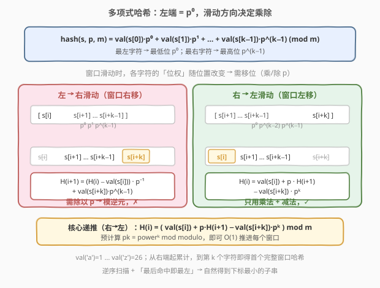
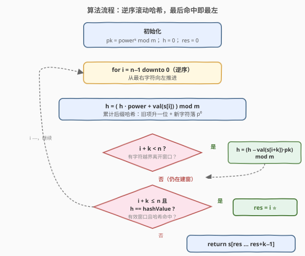
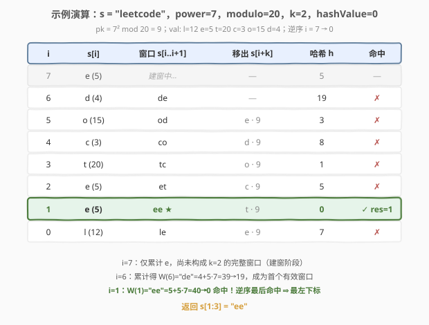

# LeetCode 查找给定哈希值的子串 题解

## 1. 题目概述

- **标题 / 题号**：查找给定哈希值的子串（#2156，hard）
- **链接**：https://leetcode.cn/problems/find-substring-with-given-hash-value/
- **难度**：困难
- **标签**：字符串、滑动窗口、滚动哈希、数学

**题意**：给定整数 `p` 和 `m`，一个长度为 `k`、下标从 0 开始的字符串 `s` 的**哈希值**按如下函数计算：

$$\text{hash}(s, p, m) = \big(\text{val}(s[0]) \cdot p^{0} + \text{val}(s[1]) \cdot p^{1} + \dots + \text{val}(s[k-1]) \cdot p^{k-1}\big) \bmod m$$

其中 $\text{val}(s[i])$ 表示字母在字母表中的下标，$\text{val}(\text{'a'}) = 1$，$\dots$，$\text{val}(\text{'z'}) = 26$。

给定字符串 `s` 和整数 `power`、`modulo`、`k`、`hashValue`，返回 `s` 中**第一个**（下标最小）长度为 `k` 的子串 `sub`，满足 $\text{hash}(sub, \text{power}, \text{modulo}) = \text{hashValue}$。数据保证至少存在一个满足条件的子串。

**示例 1**：

```text
输入：s = "leetcode", power = 7, modulo = 20, k = 2, hashValue = 0
输出："ee"
解释："ee" 的哈希值 = (5·1 + 5·7) mod 20 = 40 mod 20 = 0。
"ee" 是长度为 2 的第一个哈希值为 0 的子串。
```

**示例 2**：

```text
输入：s = "fbxzaad", power = 31, modulo = 100, k = 3, hashValue = 32
输出："fbx"
解释："fbx" 的哈希值 = (6·1 + 2·31 + 24·31²) mod 100 = 23132 mod 100 = 32。
"bxz" 的哈希值同为 32，但 "fbx" 出现更早，故返回 "fbx"。
```

**约束**：

- $1 \le \text{k} \le \text{s.length} \le 2 \times 10^{4}$
- $1 \le \text{power}, \text{modulo} \le 10^{9}$
- $0 \le \text{hashValue} < \text{modulo}$
- `s` 只包含小写英文字母。

> 💡 注意本题哈希多项式的**位权方向**：最左字符 $s[0]$ 对应**最低位** $p^{0}$，最右字符对应最高位 $p^{k-1}$。这与许多 Rabin-Karp 实现（最左字符对应最高位）恰好相反，正是这一方向决定了「向右滑需除法、向左滑需乘法」——本题的全部技巧由此展开。

## 2. 解题思路

### 2.1 暴力思路：逐窗口从头计算

最直观的做法：枚举每个起点 $i \in [0, n-k]$，按定义式从零累加 $k$ 项得到该窗口哈希，与 `hashValue` 比较，返回首个匹配。

```text
for i in 0 .. n-k:
    h = 0
    for j in 0 .. k-1:
        h = (h * power + val(s[i+j])) % modulo
    if h == hashValue:
        return s[i : i+k]
```

每个窗口 $O(k)$，共 $n-k+1$ 个窗口，总时间 $O(nk)$。$n = k = 2 \times 10^{4}$ 时约 $4 \times 10^{8}$ 次运算，**超时**。

> ⚠️ 浪费所在：相邻两个窗口 $s[i..i+k-1]$ 与 $s[i+1..i+k]$ 共享 $k-1$ 个字符，暴力却对每个窗口**从头重算** $k$ 项。能否像前缀和那样 $O(1)$ 增量推进？

### 2.2 核心观察：逆向滚动哈希，把除法变成乘法



记 $H(i)$ 为起点 $i$、长度 $k$ 的窗口哈希：

$$H(i) = \text{val}(s[i]) \cdot p^{0} + \text{val}(s[i+1]) \cdot p^{1} + \dots + \text{val}(s[i+k-1]) \cdot p^{k-1} \pmod m$$

**关键洞察分两步。**

**第一步：正向滑动（窗口右移 $i \to i+1$）需要除法。** 比较 $H(i)$ 与 $H(i+1)$：

$$H(i+1) = \big(H(i) - \text{val}(s[i])\big) \cdot p^{-1} + \text{val}(s[i+k]) \cdot p^{k-1} \pmod m$$

$s[i]$ 从 $p^{0}$ 位脱落，其余各项位权各降一位（整体除以 $p$），$s[i+k]$ 进入最高位 $p^{k-1}$。这里出现 $p^{-1} \bmod m$——**模逆元**。它存在当且仅当 $\gcd(p, m) = 1$，而题目只保证 $1 \le p, m \le 10^{9}$，**并未保证互质**（如 $p=2, m=4$ 时逆元不存在）。正向滑动在此失效。

**第二步：逆向滑动（窗口左移 $i+1 \to i$）只需乘法。** 把递推反过来，由 $H(i+1)$ 推 $H(i)$：

$$H(i) = \text{val}(s[i]) + p \cdot H(i+1) - \text{val}(s[i+k]) \cdot p^{k} \pmod m$$

- $p \cdot H(i+1)$：原窗口各项位权各升一位（$s[i+1]$ 从 $p^{0}$ 升到 $p^{1}$，…，$s[i+k]$ 从 $p^{k-1}$ 升到 $p^{k}$）；
- $+\text{val}(s[i])$：新字符落在最低位 $p^{0}$；
- $-\text{val}(s[i+k]) \cdot p^{k}$：$s[i+k]$ 升到 $p^{k}$ 后越界，须减去。

全程只有**乘法、加法、减法**，无需模逆元，对任意 $p, m$ 都成立。预计算 $\text{pk} = p^{k} \bmod m$ 后，每个窗口 $O(1)$ 推进。

> 💡 **为何要逆向扫描？** 哈希定义把最左字符放在最低位，意味着「向左移动窗口」会让旧字符整体左移升位（乘 $p$），「向右移动」则需右移降位（除 $p$）。乘法在任意模数下可逆运算，除法却受互质条件制约。因此**沿位权升高的方向滑动**——即从右向左——是本题避开模逆元的根本原因。

> ⚠️ **减法带来的负数问题**：$H(i)$ 计算中 $p \cdot H(i+1)$ 可能小于 $\text{val}(s[i+k]) \cdot p^{k}$，产生负数。Python 的 `%` 对负数返回非负结果，无需处理；C++ 的 `%` 保留符号，须 `(x % m + m) % m` 规整到 $[0, m)$。

### 2.3 算法流程图



**完整步骤**：

1. **预处理**：计算 $\text{pk} = \text{power}^{k} \bmod \text{modulo}$（Python 用内置 `pow(power, k, modulo)`，$O(\log k)$；C++ 用循环乘 $k$ 次或快速幂）。初始化 $h = 0$，$\text{res} = 0$。
2. **逆序累计**：$i$ 从 $n-1$ 递减到 $0$，先做 $h = (h \cdot \text{power} + \text{val}(s[i])) \bmod m$。这一步把新字符压入最低位、旧项升一位——从右端起逐步累计后缀哈希。
3. **移出越界字符**：当 $i + k < n$（即 $s[i+k]$ 存在、已越出窗口）时，$h = (h - \text{val}(s[i+k]) \cdot \text{pk}) \bmod m$，减去升到 $p^{k}$ 位后溢出的贡献。当 $i + k \ge n$（建窗阶段，窗口尚未满 $k$ 项），不做减法。
4. **记录答案**：当 $i + k \le n$（窗口完整落在串内，即 $i \le n-k$）且 $h = \text{hashValue}$ 时，$\text{res} = i$。由于**逆序扫描**，越靠后命中的 $i$ 越小，最后一次赋值即下标最小的子串起点。
5. 返回 $s[\text{res}\,..\,\text{res}+k-1]$。

> 💡 **两个判定条件的区别**：`i + k < n`（即 $i < n-k$）控制「是否减去越界字符」——只在窗口已满 $k$ 项后才有字符溢出；`i + k <= n`（即 $i \le n-k$）控制「窗口是否有效」——恰好覆盖 $n-k+1$ 个合法起点。两者在 $i = n-k$ 处不同：此时窗口刚好满 $k$ 项、无溢出，不须减法但已是有效窗口，应当参与哈希判定。

> ⚠️ **建窗阶段的哈希无意义但无害**：$i > n-k$ 时 $h$ 只是不足 $k$ 项的后缀哈希，不代表任何 $k$ 长窗口。流程图用 `i + k <= n` 守卫判定，避免在此阶段误判命中。即便不加守卫，由于题目保证存在合法命中（必然在 $i \le n-k$ 处），逆序「最后赋值胜出」也会覆盖任何建窗期的假命中——但加守卫更清晰稳妥。

### 2.4 示例演算

以 `s = "leetcode", power = 7, modulo = 20, k = 2, hashValue = 0` 为例，$\text{pk} = 7^{2} \bmod 20 = 9$，$\text{val}$：l=12、e=5、t=20、c=3、o=15、d=4。



| $i$ | $s[i]$ | 窗口 $s[i..i{+}1]$ | 移出 $s[i{+}k]$ | 哈希 $h$ | 命中 |
|-----|--------|---------------------|------------------|----------|------|
| 7 | e(5) | 建窗中… | — | 5 | — |
| 6 | d(4) | `de` | — | 19 | ✗ |
| 5 | o(15) | `od` | e·9 | 3 | ✗ |
| 4 | c(3) | `co` | d·9 | 8 | ✗ |
| 3 | t(20) | `tc` | o·9 | 1 | ✗ |
| 2 | e(5) | `et` | c·9 | 5 | ✗ |
| **1** | **e(5)** | **`ee`** | t·9 | **0** | **✓ res=1** |
| 0 | l(12) | `le` | e·9 | 7 | ✗ |

- **$i=7$**：仅累计 `e`，窗口未满 2 项（建窗阶段），不参与判定。
- **$i=6$**：累计满 2 项，$h = \text{val}(\text{d}) + \text{val}(\text{e}) \cdot 7 = 4 + 35 = 39 \to 19$，成为首个有效窗口 `de`，未命中。
- **$i=1$**：$h = \text{val}(\text{e}) + \text{val}(\text{e}) \cdot 7 = 5 + 35 = 40 \to 0$，命中！$\text{res} = 1$。
- **$i=0$**：$h = \text{val}(\text{l}) + \text{val}(\text{e}) \cdot 7 = 12 + 35 = 47 \to 7$，未命中，不覆盖 $\text{res}$。

最终 $\text{res} = 1$，返回 $s[1:3] = $ `"ee"`，与示例一致。

> 💡 注意 $i=1$ 之后 $i=0$ 虽然也在有效窗口内，但未命中故不更新 $\text{res}$。逆序扫描保证了「命中即记录、后续更小 $i$ 若也命中才覆盖」——这正是「最后赋值 = 最左下标」的逻辑根基。

## 3. 参考代码

### C++

```cpp
// 查找给定哈希值的子串.cpp —— 逆向滚动哈希
// 编译: g++ -O2 -std=c++17 查找给定哈希值的子串.cpp -o hashsub
#include <string>
using namespace std;

class Solution {
  public:
    string subStrHash(string s, int power, int modulo, int k, int hashValue) {
        int n = s.size();
        long long p = power, m = modulo;

        // 预计算 pk = power^k mod modulo
        long long pk = 1;
        for (int i = 0; i < k; i++) pk = pk * p % m;

        long long h = 0;
        int res = 0;
        for (int i = n - 1; i >= 0; i--) {
            // 新字符压入最低位，旧项升一位
            h = (h * p + (s[i] - 'a' + 1)) % m;
            // 移出越界字符 s[i+k]（升到 p^k 位的贡献）
            if (i + k < n) {
                h = (h - (s[i + k] - 'a' + 1) * pk % m + m) % m;
            }
            // 有效窗口且命中 → 记录（逆序最后赋值即最左下标）
            if (i + k <= n && h == hashValue) {
                res = i;
            }
        }
        return s.substr(res, k);
    }
};
```

### Python

```python
class Solution:
    def subStrHash(self, s: str, power: int, modulo: int,
                   k: int, hashValue: int) -> str:
        n = len(s)
        pk = pow(power, k, modulo)          # 预计算 power^k mod modulo
        h = 0
        res = 0
        for i in range(n - 1, -1, -1):
            # 新字符压入最低位，旧项升一位
            h = (h * power + (ord(s[i]) - 96)) % modulo
            # 移出越界字符 s[i+k]
            if i + k < n:
                h = (h - (ord(s[i + k]) - 96) * pk) % modulo
            # 有效窗口且命中 → 记录
            if i + k <= n and h == hashValue:
                res = i
        return s[res:res + k]
```

> 💡 **实现细节**：
> - **`val(c)` 用 `ord(c) - 96`（C++ 用 `c - 'a' + 1`）**：`'a'` 的 ASCII 是 97，减 96 恰得 1，与 $\text{val}(\text{'a'}) = 1$ 一致。
> - **C++ 溢出防护**：`power`、`modulo` 可达 $10^{9}$，`h * power` 可达 $10^{18}$，须用 `long long`（`LLONG_MAX ≈ 9.2 \times 10^{18}`）。`(s[i+k]-'a'+1) * pk` 中 `pk` 是 `long long`，乘法自动提升。
> - **C++ 负数取模**：`h - term` 可能为负，`+ m` 再 `% m` 规整到 $[0, m)$。Python 的 `%` 对负数已返回非负值，无需额外处理。
> - **`pow(power, k, modulo)`**：Python 内置三参数 `pow` 做快速幂，$O(\log k)$；C++ 无对应内建，用循环 $k$ 次（$O(k) = O(n)$，可接受）或手写快速幂。

## 4. 复杂度分析

| 维度 | 复杂度 | 说明 |
|------|--------|------|
| **时间复杂度** | $O(n)$ | 逆序单趟遍历 $n$ 步，每步 $O(1)$（一次乘、一次加、至多一次减、一次取模）；预计算 $\text{pk}$ 为 $O(\min(k, \log k))$（Python 快速幂 / C++ 循环） |
| **空间复杂度** | $O(1)$ | 仅维护 $h$、$\text{res}$、$\text{pk}$ 等常数个变量，不随 $n$ 增长 |
| **模逆元依赖** | 无 | 逆向滑动只用乘法/减法，对任意 $p, m$ 成立，不要求 $\gcd(p, m) = 1$ |
| **溢出风险** | 已规避 | C++ 用 `long long` 承载 $10^{18}$ 量级中间结果 |

> ⚠️ 严格地，C++ 预计算 $\text{pk}$ 若用 $k$ 次循环乘法，时间为 $O(k) \le O(n)$，整体仍是 $O(n)$；Python 的 `pow(..., ..., mod)` 是 $O(\log k)$。两者对 $n \le 2 \times 10^{4}$ 的规模毫无压力。

## 5. 扩展：正向滑动的模逆元条件与双哈希

### 5.1 何时可以正向滑动？

若题目**额外保证** $\gcd(\text{power}, \text{modulo}) = 1$（如 `modulo` 为质数且 `power` 非其倍数），则 $p$ 模 $m$ 的逆元 $p^{-1} \bmod m$ 存在，可用扩展欧几里得算法或费马小定理求得，正向滑动同样 $O(n)$：

$$H(i+1) = \big((H(i) - \text{val}(s[i])) \cdot p^{-1} + \text{val}(s[i+k]) \cdot p^{k-1}\big) \bmod m$$

但本题不保证互质，故逆向滑动是**普适**选择。面试中若遇到类似题，先判断模数与基数是否互质——互质则双向皆可，不互质则必须逆向。

### 5.2 滚动哈希的冲突与双哈希

本题哈希值**由题目直接给定**，且窗口长度固定为 $k$，判定是「$h$ 是否等于指定值」——这是**确定性匹配**，不存在哈希冲突问题（我们只须让滚动公式在模 $m$ 下与定义式恒等，加减乘的模运算保证这一点）。

相比之下，1044「最长重复子串」等题用滚动哈希**比较两个不同子串是否相同**，此时模 $m$ 哈希可能冲突，需双哈希（两组独立 $p, m$）或命中后做字符串精确比对。本题无需此顾虑。

### 5.3 与典型 Rabin-Karp 的位权差异

| 维度 | 本题（2156） | 典型 Rabin-Karp（如 1044） |
|------|--------------|---------------------------|
| 位权方向 | 最左字符 $= p^{0}$（低位） | 最左字符 $= p^{L-1}$（高位） |
| 正向滑动 | 需除法（降位） | 需减高位项 + 乘 $p$（升位） |
| 逆向滑动 | 需乘法（升位） | 需除法（降位） |
| 免逆元方向 | **逆向** | **正向** |

> 💡 二者位权恰好镜像，因此「免逆元的滑动方向」也相反。记牢本质：**沿位权升高的方向滑动只需乘法**。判断方向时，先看哈希定义里最左字符是高位还是低位，再决定从哪端起算。

## 6. 面试要点

1. **为什么不能直接正向滑动？**

   > 正向滑动（窗口右移）的递推 $H(i+1) = (H(i) - \text{val}(s[i])) \cdot p^{-1} + \text{val}(s[i+k]) \cdot p^{k-1}$ 含 $p^{-1} \bmod m$，即模逆元。它存在当且仅当 $\gcd(p, m) = 1$。题目仅给 $1 \le p, m \le 10^{9}$，未保证互质（如 $p=2, m=4$ 时无逆元），故正向滑动在某些数据下失效。逆向滑动只用乘法与减法，对任意 $p, m$ 成立。

2. **逆向递推 $H(i) = \text{val}(s[i]) + p \cdot H(i+1) - \text{val}(s[i+k]) \cdot p^{k}$ 是怎么来的？**

   > $p \cdot H(i+1)$ 把原窗口 $s[i+1..i+k]$ 各项位权升一位（$s[i+1]$ 从 $p^{0}$ 升到 $p^{1}$，…，$s[i+k]$ 从 $p^{k-1}$ 升到 $p^{k}$）。加上 $\text{val}(s[i])$ 填入空出的 $p^{0}$ 位，再减去越界的 $\text{val}(s[i+k]) \cdot p^{k}$，剩下的正是 $s[i..i+k-1]$ 的多项式哈希 $H(i)$。预计算 $\text{pk} = p^{k} \bmod m$ 后每步 $O(1)$。

3. **为什么「最后命中的 $i$」就是答案？**

   > 题目要下标最小的子串。我们**从右向左**扫描，$i$ 递减。每次命中都执行 $\text{res} = i$，由于越往后 $i$ 越小，最后一次赋值的 $\text{res}$ 必为所有命中起点中的最小值。这等价于「正向扫描时取首个命中」，但逆向扫描能顺带避开模逆元，一举两得。

4. **建窗阶段（$i > n-k$）的 $h$ 代表什么？为何不参与判定？**

   > 此阶段只累计了不足 $k$ 个字符，$h$ 是「后缀的部分多项式」，不对应任何长度为 $k$ 的窗口。用 `i + k <= n`（即 $i \le n-k$）守卫判定，确保只在窗口完整时检查哈希。即便不加守卫，题目保证存在合法命中（必在 $i \le n-k$），逆序「最后赋值胜出」会覆盖建窗期的假命中——但守卫让逻辑更清晰。

5. **C++ 实现有哪些易错点？**

   > 三处：① `h * power` 可达 $10^{18}$，须用 `long long`，`int` 会溢出；② `h - term` 可能为负，须 `(x % m + m) % m` 规整，Python 无此问题；③ `pk` 预计算用 `long long` 累乘取模，避免 $k$ 次方溢出。另外 `val(c)` 用 `c - 'a' + 1`，注意 `'a'` 对应 1 而非 0。

> 💡 **一句话总结**：2156 的灵魂是「**位权方向决定滑动运算**」——哈希定义把最左字符放在低位 $p^{0}$，于是向左滑动让旧项升位（乘 $p$）、向右滑动需降位（除 $p$，受模逆元制约）。沿位权升高方向（从右向左）滚动，把除法化为乘法，对任意模数普适，配合「逆序最后命中即最左」一举拿到下标最小的子串。

## 同类练习题

| # | 题目 | 与本题的关联 |
|---|------|-------------|
| 187 | [重复的 DNA 序列](https://leetcode.cn/problems/repeated-dna-sequences/)（[题解](../0101-0200/187_重复的DNA序列.md)） | 4 碱基 2 bit 编码 + 滚动哈希找重复 10-mer，是本题「位权升高方向滚动」的完美哈希特例（基数 2 的幂、模数 $2^{20}$） |
| 1044 | [最长重复子串](https://leetcode.cn/problems/longest-duplicate-substring/) | 二分答案 + Rabin-Karp 滚动哈希判定重复，本题的泛化（窗口长度可变 + 哈希比较需处理冲突） |
| 28 | [找出字符串中第一个匹配项的下标](https://leetcode.cn/problems/find-the-index-of-the-first-occurrence-in-a-string/) | 字符串匹配，可用 Rabin-Karp 滚动哈希单模式查找，对照本题「全窗口滚动找指定哈希值」 |
| 718 | [最长重复子数组](https://leetcode.cn/problems/maximum-length-of-repeated-subarray/)（[题解](../0601-0700/718_最长重复子数组.md)） | DP 求最长公共子串，也可用滚动哈希 + 二分，对照本题的滚动哈希套路 |
| 1316 | [不同的循环子字符串](https://leetcode.cn/problems/distinct-echo-substrings/) | 滚动哈希枚举所有「回声」子串去重，进一步练习滚动哈希的位权与去重判定 |
